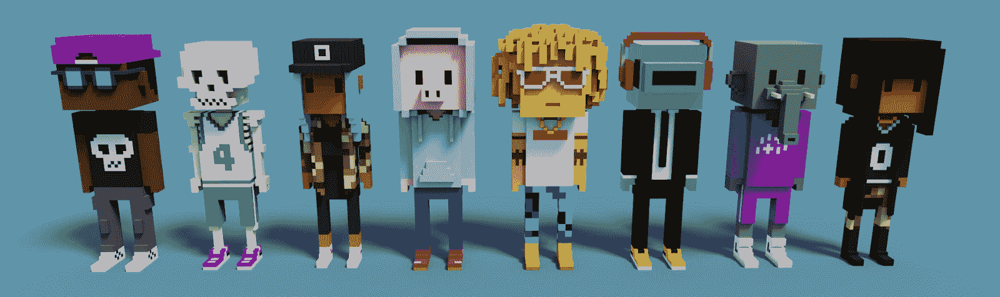
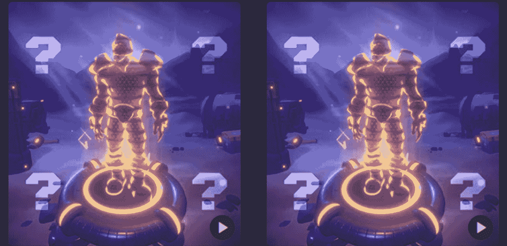
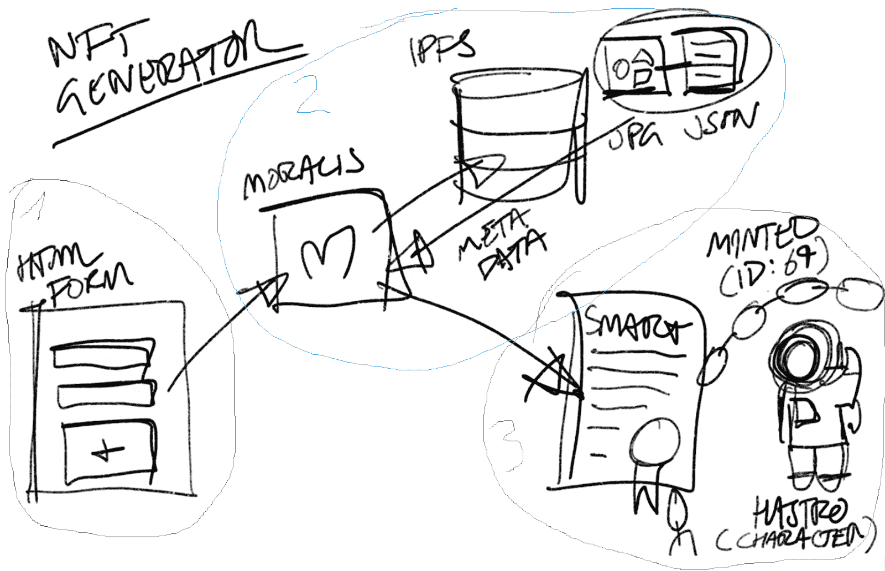
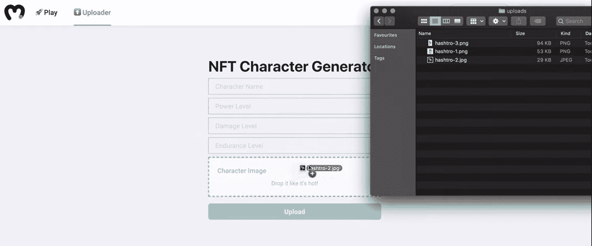
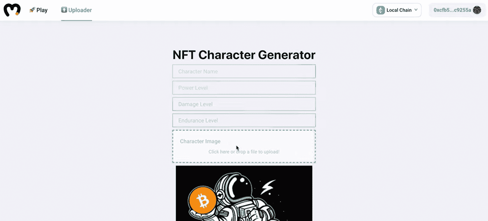
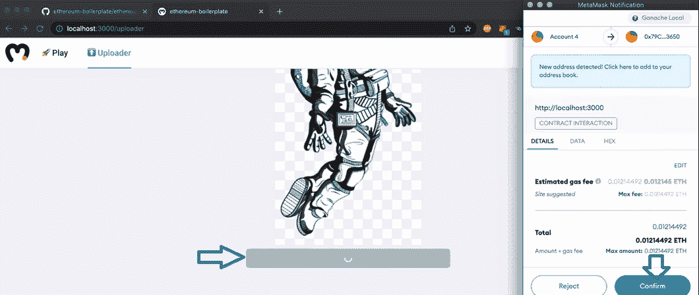
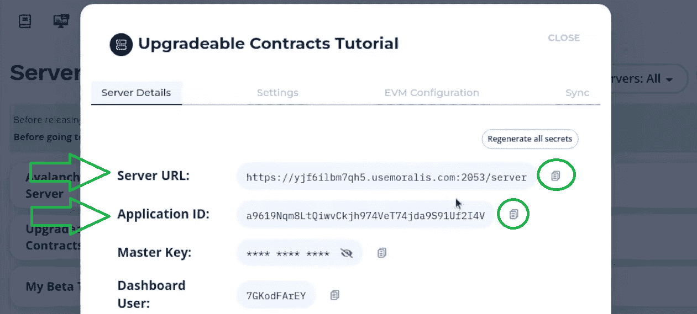
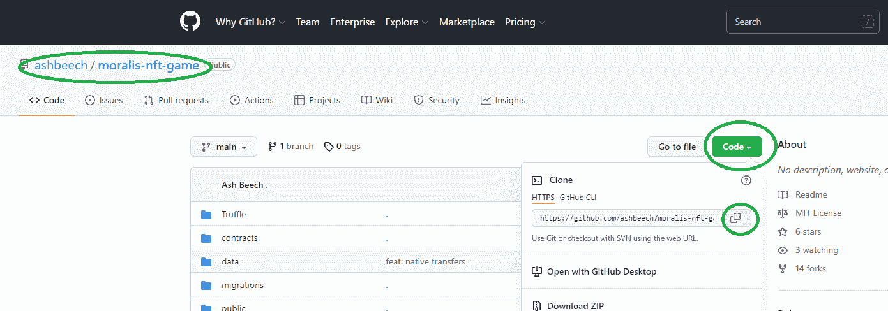

# NFT 游戏角色——如何铸造游戏中的 NFT 角色

> 原文：<https://moralis.io/nft-game-characters-how-to-mint-in-game-nft-characters/>

Web3 领域有许多令人兴奋的利基市场；然而，非功能性测试仍然风靡一时。正如你可能知道的，2021 年呈现给我们的是 NFT 的巨大增长，它们的大量用例开始出现。因此，NFT 游戏已经浮出水面，并让程序员将全部注意力转向 NFT 游戏开发。此外，由于角色是任何类型游戏的关键元素，知道如何创建 NFT 游戏角色是至关重要的。现在，如果您已经熟悉了创建不可替换令牌的过程，您就会知道其中涉及到一个铸造过程。在这种情况下，它的意义在于，人们实际上必须为区块链游戏创造 NFT 游戏角色。因此，如果你想学习如何铸造游戏中的 NFT 角色，请跟随我们就这一主题为你提供进一步的教育。

虽然目前最受欢迎的 NFT 都是关于数字收藏品和艺术，但 Web3 游戏将成为下一个大事件。你可能已经注意到 Axie Infinity 最近是多么受欢迎。此外，就像 Axie Infinity 和 [GameFi 以及 play-to-earn (P2E)](https://moralis.io/what-is-gamefi-and-play-to-earn-p2e/) 利基市场一样，NFT 发挥着重要作用。此外，游戏中的 NFT 可以表示各种对象。然而，NFT 游戏人物是其中最关键和最重要的方面。因此，我们想告诉你如何毫不费力地创造 NFT 人物。幸运的是，当我们使用[Moralis 标准](https://moralis.io/)时，我们可以快速轻松地完成这一点。这个终极的 [Web3](https://moralis.io/the-ultimate-guide-to-web3-what-is-web3/) 开发平台被称为 [Firebase for crypto](https://moralis.io/firebase-for-crypto-the-best-blockchain-firebase-alternative/) 是有道理的。它使您能够通过简单地复制和粘贴简短的代码片段来覆盖与区块链相关的后端。此外，结合终极[以太坊 dApp 样板](https://moralis.io/ethereum-dapp-boilerplate-full-ethereum-react-boilerplate-tutorial/)，你可以马上准备好自己的 NFT 游戏角色铸造 dApp ( [分散应用](https://moralis.io/decentralized-applications-explained-what-are-dapps/))。

## NFT 游戏人物解释道

在我们继续向您展示如何使用 Moralis 铸造 NFT 人物之前，我们需要让您快速了解一下。那么，什么是 NFT 游戏角色呢？我们来分解一下“NFT”和“游戏人物”的概念；不过，还是把重点放在后者吧。如果你玩过任何游戏，你很可能知道什么是游戏角色。他们代表屏幕后面的人或游戏中的任何其他实体。此外，不受玩家控制的游戏角色被称为非玩家角色(NPC)。此外，不同游戏中可用的角色数量差异很大。

然而，当我们添加不可替换的令牌(NFT)时，事情变得有点复杂。此外，虽然大多数 NFT 新手认为 NFT 是 JPEG 文件，但事实上，NFT 远不止如此。首先，JPEG 文件或任何其他类型的文件(PNG、MP3、MP4、PDF、GIF 等。)只是 NFTs 的视觉或听觉部分。使这些文件成为 NFT 的方面隐藏在后端，并且更加重要。如果没有[智能合约](https://moralis.io/smart-contracts-explained-what-are-smart-contracts/)和可编程区块链(如[以太坊](https://moralis.io/full-guide-what-is-ethereum/)，这些文件将只是普通的数字文件。此外，您很可能知道，NFT 是代表唯一性的加密资产。涵盖唯一性的详细信息存储在每个 NFT 的元数据中，这些元数据存储在区块链上。因此，没有两个相同的非功能性测试。因此，即使它们表示相同的数字文件，它们的元数据也不相同。

现在，我们可以把它们放在一起。因此，NFT 游戏角色就像普通游戏角色一样，只是存储在区块链上。此外，这也意味着用户实际上可以拥有自己的角色。这为 NFT 游戏角色交易提供了途径。此外，用户可以显示 NFT 字符或在其他支持的 NFT 平台上使用它们。

### NFT 游戏角色的未来

既然你知道 NFT 游戏角色是什么，你可能会看到 NFT 用例的巨大潜力。由于游戏仍处于早期，NFT 游戏和不同的元诗句才刚刚开始出现。此外，在许多情况下，它们还不能与 Web2 或离线游戏相匹配。然而，加密领域的发展很快，许多投资者将资金投入到这个领域。反过来，我们可以看到 NFT 游戏角色应用程序爆炸式增长，并很快成为主流。这很可能会超越游戏本身。例如，我们最有可能在网上社交中使用 NFT 角色，这是非常重要的。因此，请确保使用接下来的章节来学习如何明智地铸造 NFT 人物。

## 如何铸造 NFT 游戏人物？

如上所述，我们将向您展示如何铸造 NFT 游戏人物的简单方法。成功完成这项任务的第一把钥匙是 Moralis 及其终极 [Web3 SDK](https://moralis.io/exploring-moralis-sdk-the-ultimate-web3-sdk/) ，包括 Moralis 的 [NFT API](https://moralis.io/ultimate-nft-api-exploring-moralis-nft-api/) 。第二个无价的捷径是终极 [Web3 样板](https://moralis.io/web3-boilerplate-beginners-guide-to-web3/)。然而，由于 Moralis 的一位专家已经对样板文件进行了必要的调整，您可以使用完成的代码。因此，你可以进一步加快这一进程。

然而，为了从本文中获得最大收益，我们想为您提供一个清晰的画面。所以，以下是如何创造 NFT 人物的方法:

*   **第一步:前端**——创建一个[反应](https://moralis.io/react-explained-what-is-react/)。js 项目使用了几个库。这足以设置一个适当的 UI 和 UX，这将使事情对用户友好。此外，您需要一个带有上传字段和提交按钮的标准 HTML 表单。

*   **步骤 2:编译文件和数据**–通过使用 HTML 表单获得数据和图像文件，您需要将它们编译成 JSON 文件。这些文件将代表您的 NFTs 的元数据。此外，这也是 Moralis 将为我们完成大部分工作的地方。首先，由于它的 [IPFS](https://moralis.io/what-is-ipfs-interplanetary-file-system/) 集成，它将使我们能够以完全分散的方式存储上传的图像并生成 JSON 文件。此外，我们还将获得一个惟一的散列标识符，指向我们编译的 JPEG 和 JSON 文件。

*   第三步:铸造——这是我们最终创造 NFT 角色的部分。通过使用 ERC-721 智能契约，我们可以使用散列标识符将我们的图像和相应的 JSON 文件转换成 NFT 字符。

### 预览我们的 NFT 字符发生器

通过执行上述步骤，你可以很容易地创建一个 dApp，这将铸币 NFT 游戏角色。就前端而言，我们尽可能保持简单。我们的 dApp 使用户能够命名他们的角色，定义其力量，伤害，耐力水平，并上传他们的角色图像:

接下来，通过使用一个按钮结合 Moralis 的 [MetaMask](https://moralis.io/metamask-explained-what-is-metamask/) 集成，用户可以轻松打造他们的 NFT 角色:

如需更详细的预览，请查看本文末尾的视频，从 5:10 开始。

## 薄荷 NFT 游戏角色-一个例子项目

我们鼓励您使用我们的代码并创建您自己版本的 NFT 铸币 dApp。但是，为了做到这一点，您需要首先完成一些简单的初始设置步骤。为了让事情尽可能简单，我们将事情分解为简单的步骤。第一部分将向您展示如何覆盖初始 Moralis 设置。此外，第二部分将指导您克隆我们的代码并初始化 Moralis SDK。

### 初始 Moralis 设置

为了最轻松地构建 dApps，您需要完成初始的 Moralis 设置。以下是您需要完成的步骤:

1.  [**创建您的免费 Moralis 账户**](https://admin.moralis.io/register)——点击左侧链接进入注册页面。然后，输入您的电子邮件，创建您的密码，并单击将发送到您的电子邮件地址的确认链接。*当然，如果你已经有一个活跃的 Moralis 家账号，现在就* [*登录*](https://admin.moralis.io/login) *。*

2.  [**创建 Moralis 服务器**](https://docs.moralis.io/moralis-server/getting-started/create-a-moralis-server)–进入 Moralis 管理区域后，选择“服务器”选项卡，然后点击“+创建新服务器”按钮(右上角)。接下来，将出现一个包含三种服务器类型的下拉菜单(见下面的截图)。选择最适合您项目的网络类型。*然而，当示例项目或 dApp 测试有问题时，“Testnet 服务器”(* [*)或“本地 Devchain 服务器”是可行的方法。*](https://moralis.io/ethereum-testnet-guide-connect-to-ethereum-testnets/)

选择服务器类型后，您将看到一个弹出窗口，询问您的服务器详细信息。您需要输入您的服务器名称(这可以是您想要的任何名称)，然后选择您的地区、网络类型和链。要运行服务器，请单击“添加实例”:

3.  **访问服务器详细信息**–服务器启动并运行后，您可以通过点击“查看详细信息”来访问其详细信息(服务器 URL 和应用程序 ID):

详细信息将显示在新窗口中。因此，您只需点击每个详细信息右侧的复制图标，即可复制服务器的 URL 和应用程序 ID:

#### 初始化 Moralis

*注* *:暂时跳过这一步。一旦你有了你的，你就会回来完成它。env”文件准备就绪。*

4.  **初始化 Moralis***–*准备好编码文件后，您可以通过填充相关文件来初始化 Moralis 的 SDK。*每当你使用样板文件时，你都需要使用“.env”文件。*因此，将您服务器的详细信息粘贴到指定位置:

### 以太坊样板设置

在下面的视频教程中，Moralis 专家将向您展示与该示例项目相关的更多细节，他准备了您可以使用的代码。此外，GitHub 上也提供了代码。此外，他从最终的 Web3 样板文件开始，做了一些简单的调整。因此，您有机会从最终的 Web3 样板文件开始，自己应用调整，或者使用完成的代码。显然，通过使用后者，你将进一步加快你的进度。此外，每当您不需要创建独特的 UI 时，从以太坊样板文件开始非常有意义。要访问这个样板文件，请使用浏览器的搜索引擎，并在搜索栏中键入“以太坊样板文件”。

接下来，我们将引导您完成克隆" [moralis-nft-game](https://github.com/ashbeech/moralis-nft-game) "代码的过程。然而，以太坊样板文件的过程本质上是相同的(只需使用相关的 URL)。通过克隆起始代码或最终版本，您将很容易理解本文中的代码演练。

#### 克隆代码–分步说明

按照以下步骤复制我们修改过的样板文件(已经针对 NFT minter dApp 进行了调整):

1.  首先，点击上面给出的“Moralis-NFT-游戏”链接。这样，您就可以在我们的 GitHub 仓库中访问代码。

2.  接下来，单击“代码”按钮，然后单击 HTTPS 地址旁边的复制图标:

3.  复制地址后，你就可以克隆我们的代码了。然后，使用你的代码编辑器终端(我们一般使用 Visual Studio 代码[VSC])，输入这个命令行:

    ***git 克隆*** *【将复制的 HTTPS 地址粘贴到这里】*

4.  克隆代码后，您需要安装所有的依赖项。同样，使用您的终端并输入以下命令行:

*   ***cd Moralis-NFT-游戏***
*   ***纱线安装***

*注意:“yarn”和“npm”包管理器都是有效选项。如果您决定使用“npm ”,请确保输入正确的命令。*

5.  您现在需要将“. env.example”文件重命名为”。env”。完成这些之后，也是时候完成上一节的第四步了。因此，请确保正确填写您的”。env "文件与您的服务器 URL 和应用程序 ID。

6.  最后，您可以通过在终端中粘贴或键入“ ***yarn start*** ”来运行您的前端:

### 代码走查

完成上述设置后，您就可以仔细查看代码了。通过这样做，您将了解我们的示例 dApp 的哪些方面是最重要的。因此，您将仔细查看" [Uploader.jsx](https://github.com/ashbeech/moralis-nft-game/blob/002530fea2da843ca67ee60af0ba31e521a5ba94/src/components/Uploader/Uploader.jsx) "文件，其中包含了所有的输入字段(2:28)。我们 minter dApp 的另一个关键方面是“ [Character.sol](https://github.com/ashbeech/moralis-nft-game/blob/main/contracts/Character.sol) ”智能合约。一位 Moralis 专家将在下面的视频中告诉你关于这个智能合约的更多细节，从 3:35 开始。此外，他正在使用[松露](https://moralis.io/truffle-explained-what-is-the-truffle-suite/)来完成这个教程。

如上所述，下面是我们在整篇文章中引用的视频。假设您已经按照上面的说明完成了初始设置，那么您可以从 2:04 开始。

https://www.youtube.com/watch?v=a3zIFrJl7UU

## NFT 游戏角色-如何铸造游戏中的 NFT 角色-摘要

至此，你应该对什么是 NFT 游戏角色有了清晰的认识。此外，你拥有创造 NFT 角色所必需的技能。此外，您还知道 NFT 提供了许多不同的用例，因此对于未来的应用程序有着巨大的潜力。此外，在我们的带领下，你也学会了如何轻松创造 NFT 人物。在我们的示例项目中，您已经有机会创建自己的 NFT 铸造 dApps。后者是制造各种 NFT 的好工具。此外，您还学习了如何使用 Moralis 和以太坊样板文件。因此，你已经准备好接受其他的范例项目，甚至处理你自己的 dApp 想法。

如果 [NFT 开发](https://moralis.io/integrate-mint-function-to-js-interface-nft-development/)是你的主要兴趣，我们推荐探索 [NFT API 替代品](https://moralis.io/nft-api-alternatives-comparing-alchemys-nft-api-with-moralis-nft-api/)和 [NFT 令牌开发](https://moralis.io/nft-token-development-the-ultimate-guide/)。此外，一定要学会如何[发展自己的 NFT 市场](https://moralis.io/develop-your-own-nft-marketplace-step-by-step-guide/)。此外，通过访问 [Moralis 博客](https://moralis.io/blog/)和 [Moralis YouTube 频道](https://www.youtube.com/c/MoralisWeb3)，你可以继续你的免费加密教育。这两个网站都提供大量高质量的内容。例如，我们的一些最新主题涵盖了终极 [Web3UI 套件](https://moralis.io/web3ui-kit-the-ultimate-web3-user-interface-kit/)，最佳 [Web3 技术栈](https://moralis.io/exploring-the-web3-tech-stack-full-guide/)，如何[获得 OpenSea API 密钥](https://moralis.io/get-an-opensea-api-key-in-2022-full-guide/)，[无汽油交易](https://moralis.io/gasless-transactions-exploring-gasless-transactions-on-ethereum/)， [Web3 登录](https://moralis.io/how-to-build-a-web3-login-in-5-steps/)， [Web3 认证](https://moralis.io/web3-authentication-the-full-guide/)等等。但是，如果你想尽快去全职 crypto，你可能要考虑走更专业的路线。如果是这样，报名参加 Moralis 学院可能是你的下一个合乎逻辑的步骤。

