# NFT 游戏开发——如何在几分钟内构建一个 NFT 游戏应用程序

> 原文：<https://moralis.io/nft-game-development-how-to-build-an-nft-game-app-in-minutes/>

如果您想直接开始工作，请务必查看我们完整的 Unity SDK 样板文件。在下面的文章中，我们将一步一步地介绍 NFT 游戏开发。然而，对于任何想马上动手的开发人员来说，一定要看看这个 GitHub:

***以太坊 Unity NFT 游戏开发样板:*[*https://github . com/以太坊-样板/以太坊-Unity-样板*](https://github.com/ethereum-boilerplate/ethereum-unity-boilerplate)**

当涉及到创建应用程序时，开发游戏可能是相对费力的。更具挑战性的任务是为分散的网络开发游戏。这是因为 Web3 开发领域缺乏基本的开发工具。然而，有了合适的工具箱，游戏开发不一定那么困难，对于 [Web3 开发](https://moralis.io/how-to-build-decentralized-apps-dapps-quickly-and-easily/)，最好的工具是 [Moralis](https://moralis.io/) 。如果你有兴趣创建突破性的 Web3 游戏，请跟随我们仔细了解 NFT 游戏开发，并展示如何使用 Moralis 在几分钟内构建游戏应用程序！

Moralis 是为去中心化 web 开发[【dApps】](https://moralis.io/decentralized-applications-explained-what-are-dapps/)(去中心化应用)的头号中间件。借助 Moralis 平台提供的强大开发工具，我们可以大大缩短开发时间。最重要的是，这不仅适用于 NFT 游戏，也适用于一般的 dApp 开发。

该平台为用户提供了无限可扩展的后端基础设施，让用户专注于应用程序的前端。因此，可以将开发后端的重担交给 Moralis。

该平台还通过提供有价值的工具来促进开发过程。其中一些是[Moralis NFT API](https://moralis.io/announcing-the-moralis-nft-api/)[Moralis 价格 API](https://moralis.io/introducing-the-moralis-price-api/) 等等。正因为如此，Moralis 是 dApp 和 NFT 游戏开发的终极平台。

因此，如果你想成为一名 NFT 游戏开发者，第一步就是加入 Moralis！

### 什么是 NFT？

NFT 是不可替换代币的缩写，它们最近变得非常流行。受欢迎程度提高的众多原因之一是艺术家明显受益。首先，NFT 已经被证明是艺术家从加密社区获得资金支持的一个很好的方式。然而，这些不可替换的令牌到底是什么？

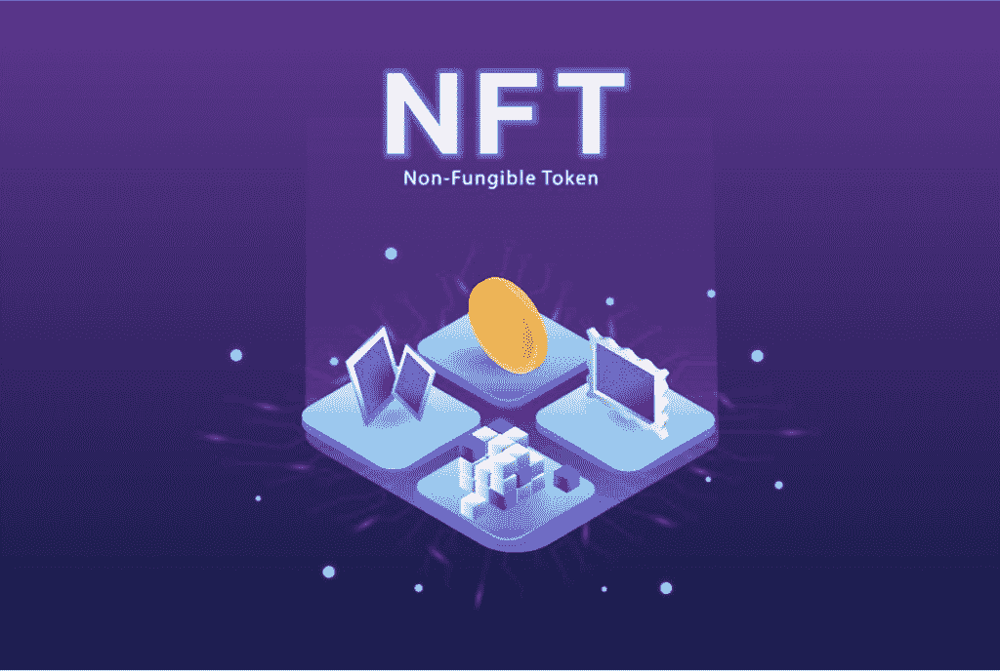

顾名思义，NFT 是令牌。这些数字代币能够代表唯一物品的所有权。有了这项技术，从艺术品到房地产，几乎任何东西都有可能被符号化。价值的一部分来源于只有一个人可以成为官方所有人。为了确保这种所有权，区块链(如以太坊)对 NFT 进行安全保护。这使得在不出售令牌的情况下不可能复制 NFT 或修改所有权记录。从本质上讲，NFT 可以充当物理资产的数字所有权。

术语“不可替代”是一个经济术语，指具有独特属性的商品/资产，如不同的歌曲或独特的棒球卡。这些是不可互换的项目，因为它们具有不同的特性。因此，举例来说，很难将一座房子的价值与一首歌相提并论。不可替代的反义词是可替代。另一方面，这些是由值而不是它们的属性定义的项目。因此，这使得可替换令牌可以互换。

从传统的角度来看，在数字世界中复制实物资产的属性存在问题。很难确保虚拟资产的唯一性、稀缺性和所有权证明。然而，有了区块链技术，现在这是可能的，并且 NFTs 实现了一个新的资产互联网。

# 如何用 Moralis 构建一个 NFT 游戏——前端

在这一部分，我们将仔细看看如何创建我们自己的 NFT 游戏来展示与 Moralis 合作的力量。用大约 100 行代码，我们可以创建一个全功能的 NFT 游戏，其中的化身由可以在 2D 环境中移动的令牌来表示。在这个例子中，我们将使用 Aavegotchi NFTs。然而，对于任何其他 NFT，逻辑都是相同的，这意味着我们不局限于 Aavegotchis。

NFT 游戏开发过程的一个很好的开端就是解释我们将要创建的游戏的安全性。安全性是一个非常重要的问题，因为 NFT 游戏有时会奖励真奖。因此，作弊是被禁止的，我们需要确保我们的应用程序防止这种情况。

为了确保一个没有作弊可能性的游戏环境，我们将把大部分游戏逻辑放在我们的后端代码中。因此，前端的主要任务是询问服务器在一个方向上移动化身是否有效。这意味着我们可以防止用户在游戏中入侵应用程序和作弊。

你可能会问，只用 100 行代码怎么可能做到这一切？简单的回答是 Moralis。

### NFT 游戏开发与 Moralis

为了使 [Web3](https://moralis.io/the-ultimate-guide-to-web3-what-is-web3/) 开发过程更快更简单，我们需要合适的工具。Web3 的最终开发平台是 Moralis。Moralis 允许我们轻松地创建一个 NFT 游戏，并大大缩短了开发过程。Moralis 已经弄清楚了所有 dApps 的基本逻辑，作为平台用户，我们可以访问它的所有功能。

对于我们的 NFT 游戏来说，两个非常重要的特性是实时提醒和检查NFT 余额的能力。我们将使用这些 Moralis 工具从区块链获取实时数据，并检查用户是否拥有任何 NFT。

此外，Moralis 还为 dApp 开发提供了其他优秀的工具。一些例子是对[【IPFS】](https://moralis.io/what-is-ipfs-interplanetary-file-system/)的原生支持，跨链兼容性，以及对作为开发者的你的巨大支持。 [Moralis 博客](https://moralis.io/blog/) 还提供了优秀的指南，供您查看，并更好地了解作为 Moralis 用户的可能性。

因为我们在开发我们的 NFT 游戏时会使用 Moralis，所以第一步就是马上注册 Moralis！

### 为 NFT 游戏开发设立 Moralis 标准

在我们为游戏本身编写代码之前，我们必须导入 Moralis SDK(软件开发工具包)并初始化 Moralis。此外，要初始化 Moralis，我们必须首先创建一个服务器。

*   **创建一个 Moralis 服务器**——我们要做的第一件事是用 Moralis 建立一个服务器。用 Moralis 创建一个服务器非常简单，只需要几分钟。要初始化服务器，我们需要登录 Moralis 并点击“+创建新应用程序”按钮。单击时，将出现一个下拉菜单，其中有三个选项。选择哪个选项并不重要，但是对于这个例子，我们推荐一个 testnet。
    一旦您选择了想要启动的服务器类型，我们需要为我们的服务器提供一个名称，选择一个地区，然后选择网络。一旦我们完成了选择，我们可以简单地点击“添加实例”按钮来启动服务器。启动服务器可能需要几分钟时间，但它很快就会启动并运行。
*   Moralis SDK —我们可以通过几行代码轻松导入 Moralis SDK。这样做的原因是为了使我们能够在代码中访问开发工具包，以便在编程时访问库和其他有价值的工具。导入 SDK 会是这样的:

*   初始化 Moralis 规范 —最后，我们还需要初始化 Moralis 规范。为此，我们需要找到服务器的 URL 和应用程序 ID。这可以通过单击有问题的服务器的“查看详细信息”按钮来找到。代码看起来会像这样，带有你的应用 ID 和服务器 URL:
    

### 认证用户

当我们游戏的玩家访问网站时，我们需要让他们能够登录并验证自己。这种认证通过元掩码进行，如果您不熟悉这个扩展，请查看元掩码 的这个 [细目。这非常简单，我们所需要的只是一行代码:](https://moralis.io/metamask-explained-what-is-metamask/)

此外，这个特性的伟大之处在于 Moralis 整合。当用户登录并执行该行代码时，一个新用户将被添加到您的 Moralis 数据库中。我们可以查看服务器数据库中的所有用户，方法是单击相关服务器的三个点，然后按“Dashboard”。

在仪表板界面的最左侧，我们将看到“浏览器”、“Webhooks”、“作业”等不同的选项卡。在“浏览器”选项卡下，我们可以找到几个不同的页面。“用户”页面就是一个例子，所有用户的加密地址都会出现在这里。然而，对于本教程更重要的是，我们可以在“EthNFTOwners”页面下看到我们用户的所有 NFT。这是相当惊人的，仅仅一行代码，我们可以查看从用户的加密地址到他们的 NFT 的一切。

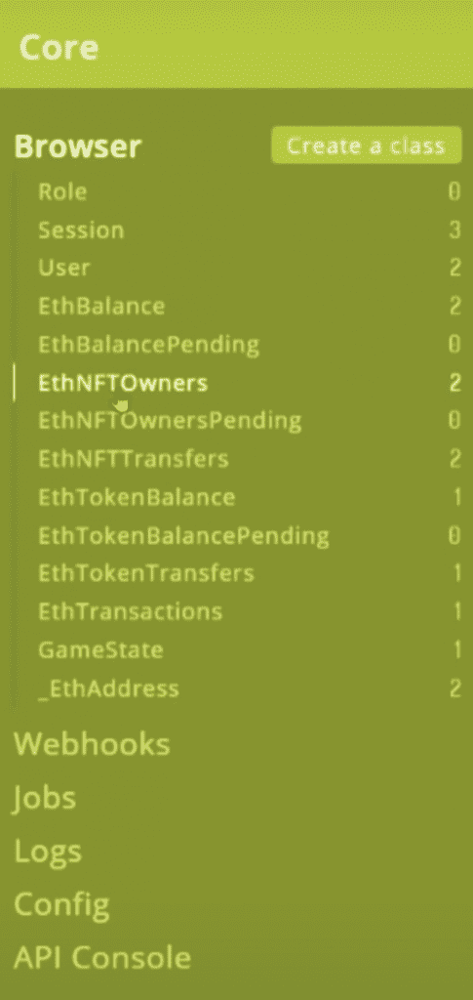

这展示了 Moralis 的魔力，也是我们能用大约 100 行代码创建一个 NFT 游戏的众多原因之一。此外，这表明 Moralis 如何帮助加速 crypto dApps 的开发过程，这对整个行业都有好处。

### NFT 游戏图形

我们游戏开发过程的下一步是设置游戏的图形。在这个例子中，我们使用了一个名为 [Phaser](https://phaser.io/) 的库，一个免费、快速、开源的 HTML5 游戏库。这是一个非常棒的库，可以用来创建简单的图形，就像我们在 NFT 游戏中使用的图形一样。因此，要初始化 Phaser 游戏库，代码示例如下:

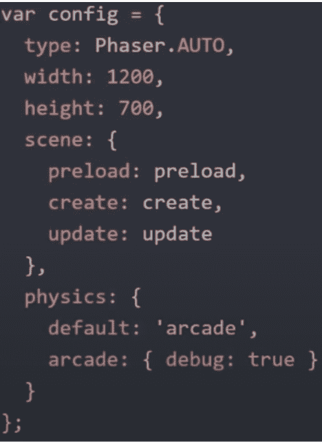

此外，为了向您展示图形的外观，这里有一个游戏的打印屏幕:

### NFT 游戏生命周期

接下来，我们来看看游戏的生命周期。这是所有游戏都有的，从游戏加载一堆东西开始。举个例子，我们可以使用一个名为“预加载”的函数来加载游戏的背景:

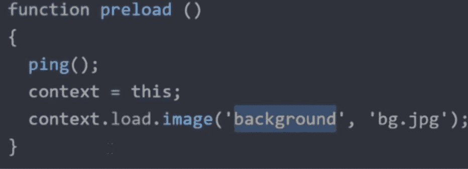

如你所见，我们只预装了我们游戏的背景，但上面的打印屏幕上有一些头像。然而，我们不能预装头像，因为它们属于玩家，我们也不知道玩家正在玩什么。因此，我们不知道在屏幕上放什么头像。从区块链获取关于化身的数据，并将其加载到应用程序的另一部分。

此外，正如你在代码中看到的，我们还执行了一个“ping()”函数。这很重要，因为我们需要开始 ping 服务器。这样做的原因是服务器需要知道此时哪些玩家正在玩游戏。这种 ping 功能每秒钟都在不断重复。下面是这个函数的样子:

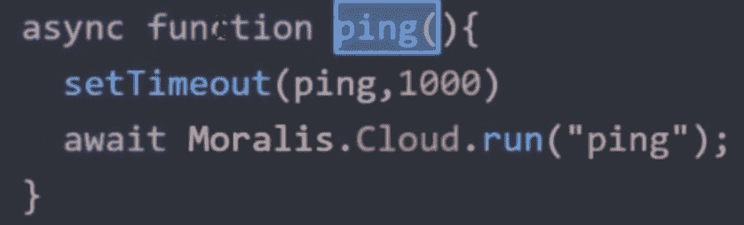

### 控制和订阅

在我们为游戏的图形创建了函数之后，我们可以添加控件并设置对 GameState 的订阅。然而，这意味着什么呢？如果我们在 Moralis 中查看我们的服务器数据库，我们会看到一个名为“GameState”的选项卡。游戏状态告诉我们每个玩家/角色在地图上的位置。这意味着一旦游戏状态发生变化，订阅就会更新每个客户端。因此，每当另一个玩家在世界上移动时，我们都会收到警告。

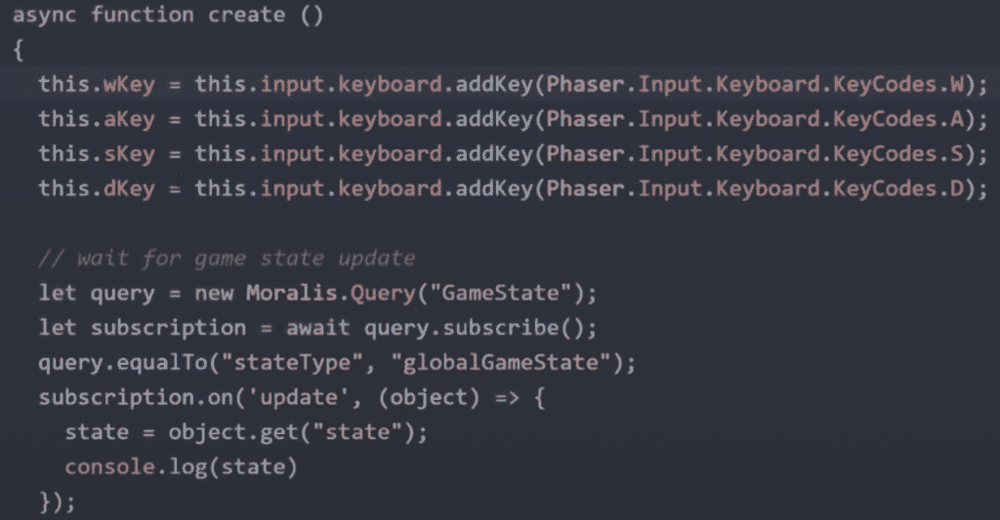

有了 Moralis，就有可能避免用 WebSockets、连接 WebSockets 的逻辑、发送数据等等构建复杂基础设施的所有麻烦；我们可以利用这个平台。我们所需要的就是实现上面的订阅代码。这意味着我们只需要几行代码来确保我们的游戏知道地图上每个玩家的状态。

### 更新功能

一旦我们建立了游戏状态的订阅，并为我们的游戏建立了控制，我们还需要一个更新功能。这个函数监听按下了什么键，然后向服务器发送一个移动字符的请求。部分更新函数看起来像这样，这是向上移动我们的头像的请求:

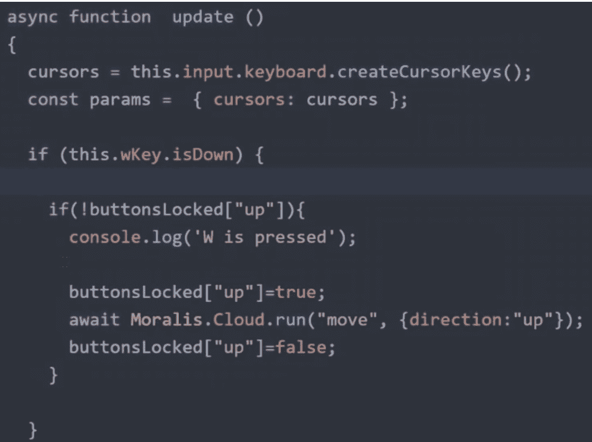

然而，这个片段的一个关键要点是，我们并没有立即移动游戏中的角色；我们只是向服务器发送一个这样做的请求。这样做的原因是服务器确定是否有可能在那个方向上移动角色。因此，在没有真正玩游戏的情况下移动角色是不可能的，而且服务器禁止用户作弊。

### 绘制状态

最后，我们有一个绘制游戏状态的函数。“drawState”功能的第一部分是关于新玩家的。如果玩家未知，该函数从您的 Moralis 服务器获取玩家 SVG，它直接从区块链获取。然而，在查看我们的 NFT 游戏的后端代码时，我们将更深入地研究 SVG 是如何获取的。

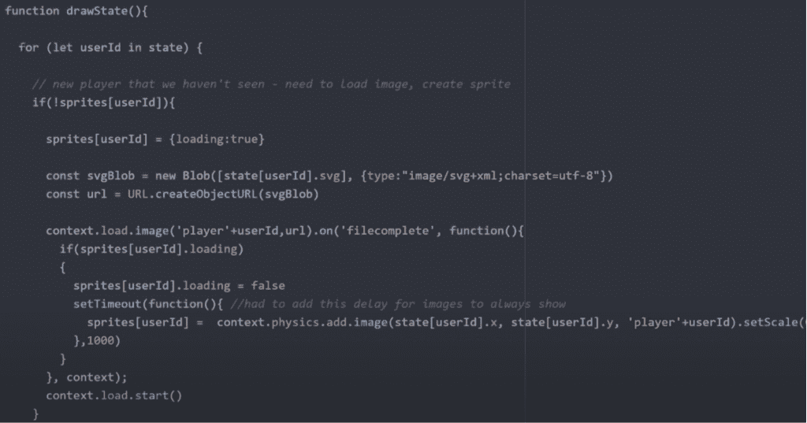

如果不是新玩家，游戏只是简单地在游戏环境中移动玩家的头像。本例中的代码如下:

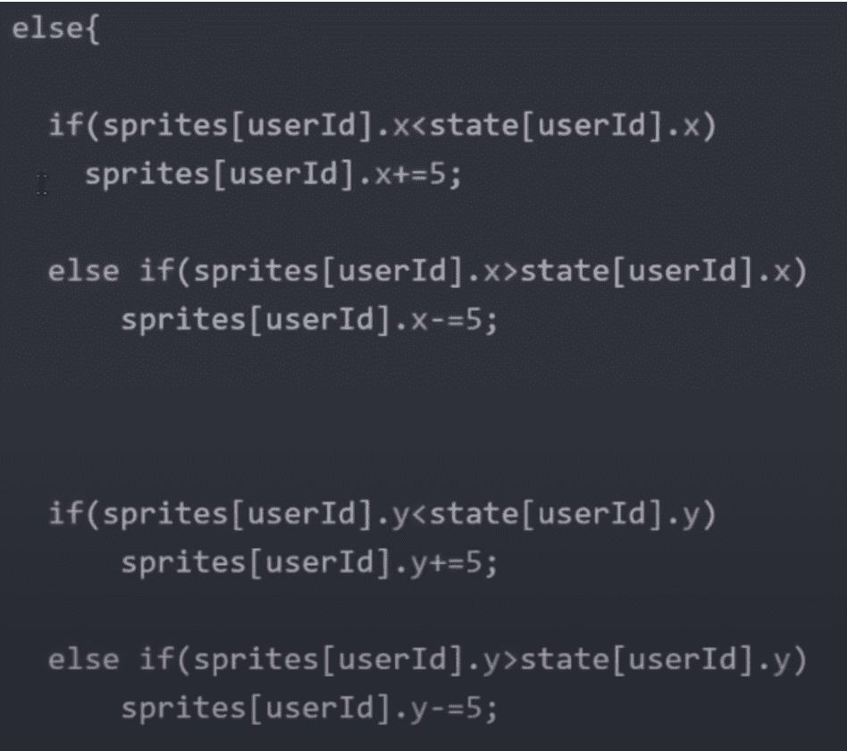

因此，总而言之，只需要实现一些功能就可以让玩家在 2D 环境中移动。此外，代码还需要订阅 GameState 以向客户端提供游戏中所有其他玩家的实时更新，这是我们用几行代码完成的。

这些都是针对前端的，NFT 游戏开发流程相当简单，有编程基础知识[JavaScript](https://moralis.io/javascript-explained-what-is-javascript/)。这就是 Moralis 的力量，如果你感兴趣，Moralis.io 还提供了关于 [创建 ETH dapp](https://moralis.io/how-to-create-ethereum-dapps/)和 [多边形 dapp](https://moralis.io/how-to-build-polygon-dapps-easily/)的很棒的指南。然而，我们还没有完全完成，因为我们仍然需要开发我们的应用程序的后端。

## 如何构建一个 NFT 游戏——后端

如果你发现应用程序的前端很容易开发，那么多亏了 Moralis，后端就更简单了。在我们的 NFT 游戏的后端，我们会发现更多的游戏逻辑和一些当有人在玩游戏时前端调用的函数。这里的第一个例子是一个移动化身的功能。

### 移动功能

每当玩家试图通过按键盘键来移动他们的头像时，前端就会调用这个移动函数。这个函数接收化身应该移动的方向，然后更新应用程序的状态。

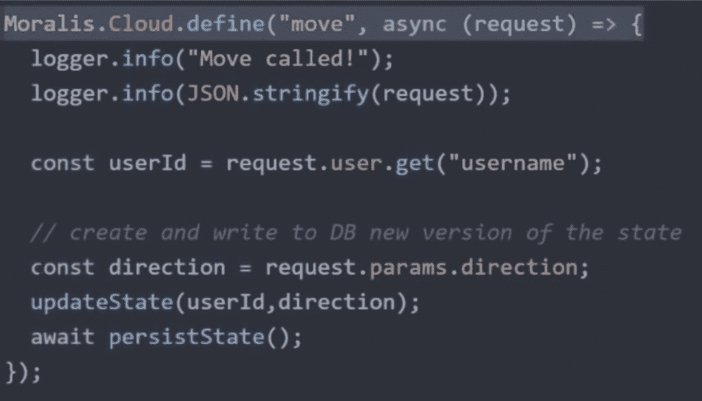

如你所见，move 函数还调用了“updateState”函数。这个函数移动化身，在这个例子中，它向玩家喜欢的方向移动用户五个单位。

然而，正如你所看到的，还有一个注释解释说我们可以在这里添加进一步的逻辑。因此，我们可以添加角色可以捡起的物品，或者在角色不能移动的地方创建边界/障碍。服务器可以检查是否有什么东西挡住了玩家移动的方向，并在必要时限制移动。

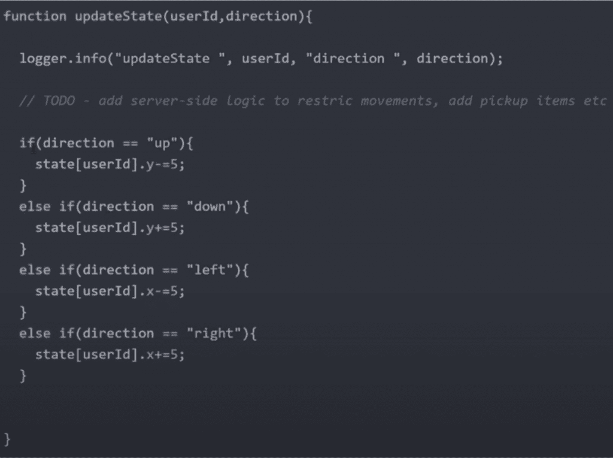

### 持续状态功能

这个游戏的另一个功能是“持久状态”功能，这是游戏状态保存到我们服务器数据库的地方。这个函数看起来是这样的:

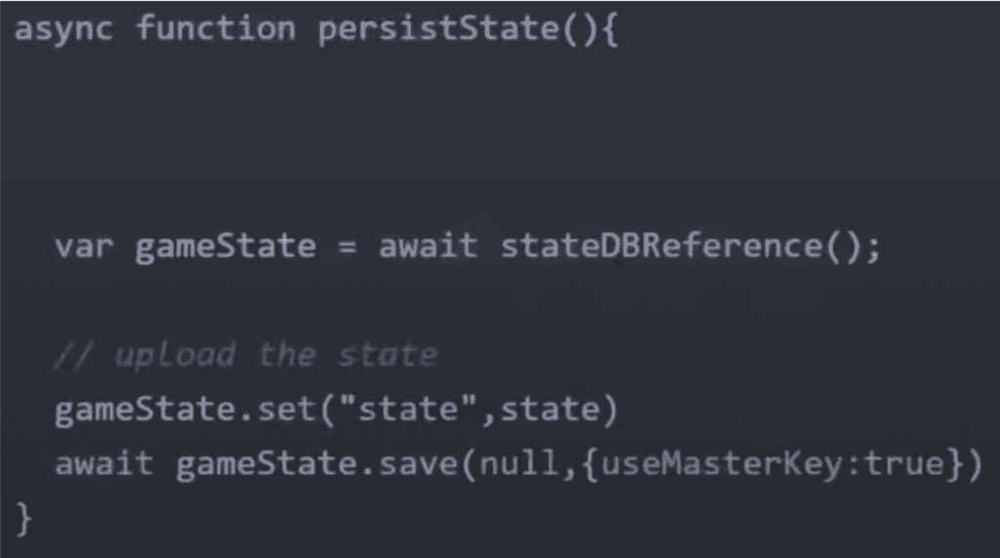

一旦保存了状态，每个客户端都将被更新为新的游戏状态，这就是客户端和服务器之间实时通信的方式。这是一个简洁而简单的解决方案，结合前端的订阅功能，只需要不到十行代码。

### Ping 功能

在后端，我们也有一个 ping 功能，简单地检查用户何时 ping 服务器，然后将它保存到游戏状态。

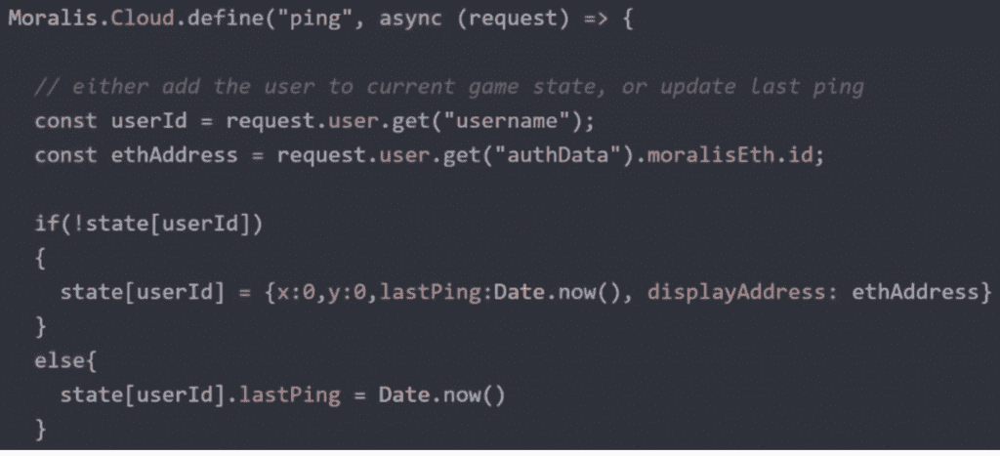

此外，我们还使用这个函数从区块链中获取 SVG。我们在这里做的第一件事是查询用户的 NFT。基于这些信息，我们可以从区块链获取用户的 SVG。

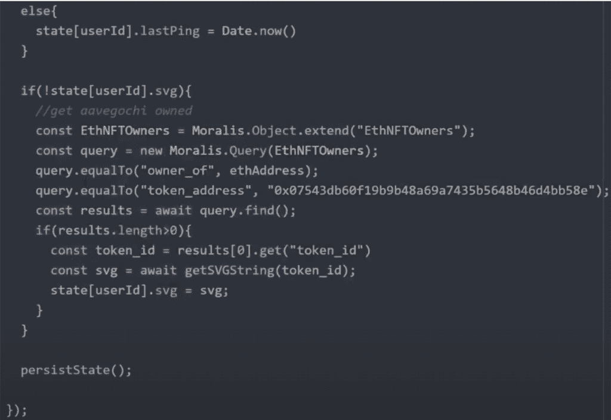

正如您所看到的，ping 函数代码调用了另一个名为“getSVGString”的函数，这就是我们从区块链获取 SVG 的方法。乍一看，这个函数看起来很吓人，因为 ABI 相当大。然而，我们可以从 Aavegotchi 契约中复制并粘贴 ABI。

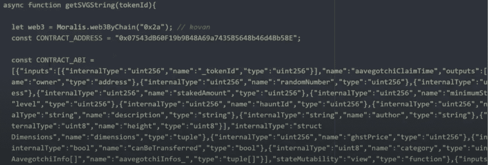

就这样；这些都是我们创建第一个 NFT 游戏所需要的功能。我们已经实现了从实时更新到检查服务器移动是否有效的所有功能。这一点也不复杂，使用合适的工具，我们可以在几分钟内制作出这个游戏！

然而，如果你对 NFT 游戏的开发过程仍有疑问，我们推荐你观看以下来自 Moralis YouTube 频道的视频。在本教程中，[Ivan on Tech](https://www.youtube.com/user/LiljeqvistIvan)将带您完成整个过程，更深入地解释应用程序实际上是如何工作的。此外，在接近尾声时，Ivan 还提供了一些关于如何改善应用程序用户体验的建议。

[https://www.youtube.com/embed/CsdhJrD9m1M?feature=oembed](https://www.youtube.com/embed/CsdhJrD9m1M?feature=oembed)

## NFT 游戏开发—总结

虽然游戏开发被认为是一个相当复杂的过程，但它并不一定如此。我们需要的只是合适的工具，对于 Web3 开发来说，这个工具就是 Moralis。我们已经展示了用 Moralis 的魔力快速创建一个 NFT 游戏是多么容易。我们开发了一个具有简单前端和后端的 Aavegotchi 游戏，只花了我们几分钟的时间。然而，这只是一个示例，以便让读者更清楚地了解这个过程，也可以创建其他具有相同逻辑的游戏。因此，我们并不局限于 Aavegotchi。

然而，我们确实需要 Moralis 来使这个过程变得更容易和更快。用不到十行代码在客户机和服务器之间创建实时通信的能力清楚地展示了 Moralis 的威力。如果你仍然不相信平台的便利性，请随时查看使用 Moralis 来创建 [以太坊令牌](https://moralis.io/how-to-create-ethereum-tokens-in-4-steps/) 和 [BSC 令牌](https://moralis.io/how-to-create-a-bsc-token-in-5-steps/) 是多么容易。

因此，如果你想进入 NFT 游戏开发行业，你首先需要做的是 [今天就向 Moralis 家报名](https://admin.moralis.io/register) ！你不仅可以创建著名的 NFT dapp，而且拥有像 Moralis 这样强大的平台的机会是无穷无尽的。