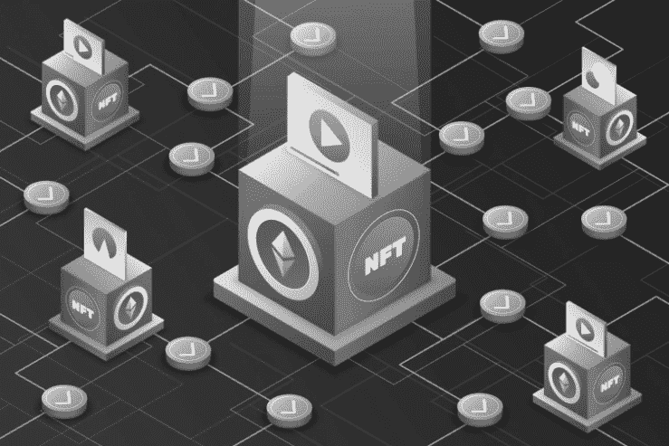
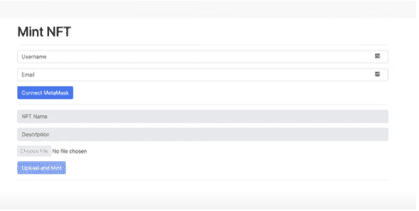
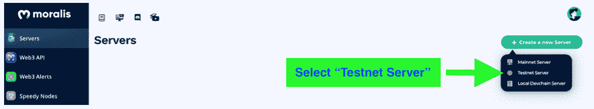
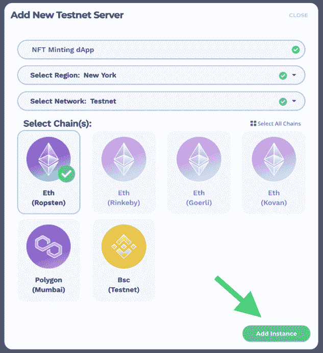
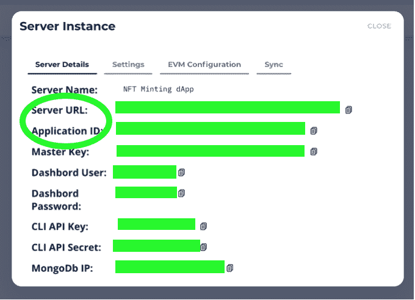
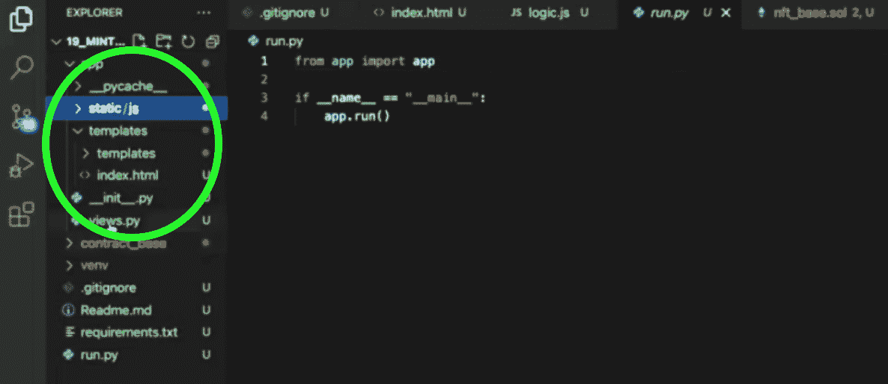

# NFT 生成和铸造——如何生成不可替换的令牌

> 原文：<https://moralis.io/nft-generate-and-mint-how-to-generate-non-fungible-tokens/>

生成和铸造一个[](https://moralis.io/non-fungible-tokens-explained-what-are-nfts/)****是许多令牌开发者经历的一个繁琐的过程。在许多情况下，这是由于缺乏可靠的 API 和工具，使得为 NFTs 创建和生成任务变得复杂和耗时。此外，随着 NFT 市场越来越受欢迎，NFT 创造者正在发现不可替代令牌的新用例，毫不奇怪，开发人员想要学习**[**【NFT 令牌开发**](https://moralis.io/nft-token-development-the-ultimate-guide/) **，包括 NFT 生成和造币过程。因此，本文将向您介绍如何使用 Moralis 的**[**web 3**](https://moralis.io/the-ultimate-guide-to-web3-what-is-web3/)**平台及其各种工具生成不可替换令牌(NFT)。因此，你会发现任何有志于成为区块链开发者的人都可以很容易地学会如何执行 NFT 生成和薄荷过程。****

**开发人员意识到，你不需要 NFT 生成和薄荷从零开始。使用强大的 Web3 基础设施提供者，比如 Moralis，你只需要最少的代码来设置你的后端。此外，有了 Moralis，你可以很容易地弄清楚如何创建一个 NFT 市场或为你的 NFT 建筑创建移动以太坊。因此，Moralis 使得 NFT 的生成和创建过程变得简单，甚至对于一个区块链开发新手也是如此。**

**在本教程中，您将了解启动 NFT 生成和薄荷项目是多么容易。无论您是想使用 [ERC721](https://moralis.io/erc-721-token-standard-how-to-transfer-erc721-tokens/) 还是 [ERC1155](https://moralis.io/erc1155-exploring-the-erc-1155-token-standard/) 令牌标准，Moralis 都会为您提供合适的 Web3 工具，让您轻松制作不可替代的令牌。此外，您将认识到，Moralis 为您的 NFT 基础设施和 NFT dApps(分散式应用)提供 360 度支持。例如，Moralis 的 [NFT API](https://moralis.io/ultimate-nft-api-exploring-moralis-nft-api/) 提供了对 NFT 历史、所有权数据等等的无缝访问。有了 Moralis，您可以将更多的时间投入到 NFT dApp 的前端，同时将后端基础设施置于安全的人手中。**

## ****NFT 发电和造币——先决条件****

**要开始创建 NFT，首先需要理解什么是 NFT。那么，[什么是 NFT](https://moralis.io/non-fungible-tokens-explained-what-are-nfts/)？简而言之，缩写“NFT”代表“不可替代的令牌”。**

**如果你已经建立了区块链或交易加密令牌，那么你会明白什么是可替代令牌。可替换令牌，例如那些使用 ERC-20 或 [BEP20](https://moralis.io/what-is-bep20-full-binance-smart-chain-token-guide/) 令牌标准生成的令牌，是建立在一个相对简单的概念上的。这种代币通常具有货币或流通货币的功能。因此，一个单位等于一个交换单位。因此，当用作交换媒介时，一个 ERC-20 或 BEP-20 代币等同于另一个代币。此外，可替换的代币也可以用来代表股票、债券或其他等价的价值。**

**另一方面，顾名思义，不可替代令牌(NFT)代表相反的意思。因此，NFT 不是表示可互换的值，而是表示唯一的值。例如，一个 NFT 可以代表一个独特的文件，一个数字艺术作品，一个房地产契约等。因此，这些项目是唯一的，它们的 NFT 不能与其他 NFT 互换。此外，NFT 包含到用作区别标签或标识符的信息或元数据的链接。**

## ****如何生成 NFT****

**如果你是一个创建者，区块链开发者，或者只是对生成 NFT 的过程感兴趣，那么你将渴望了解启动你的 NFT 生成和造币项目的最快方法。**

**

### **NFT 用 NFT 造币厂 dApp 生产和铸造**

为了简化 NFT 生成和造币过程，您需要构建一个 NFT 造币厂 dApp。然而，你可能想知道什么是 NFT 明特 dApp。这是一个简单的用户界面，你可以在这里输入关于你的 NFT 或数字创作的信息。例如，您可以向 NFT 添加标题、描述、用户名、电子邮件地址和其他形式的数据。此外，你应该能够上传或输入数字文件本身的链接。

您还应该能够:

*   用简单的前端连接到 MetaMask。
*   调用智能契约方法。
*   [用元掩码](https://moralis.io/how-to-authenticate-with-metamask/)认证。
*   使用 MetaMask 钱包签署交易。

所有这些都是让你的简单 NFT minter dApp 完美工作的基本功能。

此外，我们将创建的基本 flask dApp 应该如下所示:



## **NFT 通过几个简单的步骤生成和制造薄荷**

现在你已经知道你需要创造什么了，你可以开始和 Moralis 签约了。如果您还没有 Moralis 帐户，现在就[注册一个免费的 Moralis 帐户](https://admin.moralis.io/register)！

### **步骤 1–为 Minter dApp 创建服务器**

使用 Moralis，您不必从头开始设置服务器。你可以简单地通过 Moralis 的 Web3 平台创建一个新的服务器。

注册后，点击界面右上角的“+创建新服务器”按钮。然后，会出现一个下拉菜单。选择“Testnet 服务器”选项。出于演示的目的，当您开始一个新项目时，最好从这个备选方案开始。



接下来，在“添加新的 Testnet 服务器”弹出窗口中，将要求您命名您的项目，选择您的区域，并选择您想要使用的链。

#### **选择 Eth (Ropsten)**

由于以太坊仍然是使用最广泛的链，我们将创建一个基于以太坊的 NFT minter dApp。因此，从弹出菜单中选择“Eth (Ropsten)”选项。完成所有必要的选择和信息后，单击“添加实例”。



#### **获取服务器信息**

你的 Moralis 服务器应该在几分钟内准备好。确保复制在您的服务器实例上找到的服务器 URL 和应用程序 ID。在您的“NFT 生成和造币”开发过程中，您将需要它们。



### **第 2 步——从 NFT 敏特 dApp 开始**

Moralis 提供的服务器已经准备好了，现在您可以开始构建 NFT minter dApp 了。请记住，“NFT 生成和造币”过程的这一部分要求您至少安装了 Python 3.0。

为了进一步简化流程，我们将为您提供预先开发的智能合同。当然，如果您愿意，您也可以编写自己的智能合同。然而，使用一个经过充分审查和测试的合同是很实际的，比如下面发布的合同或者直接从 GitHub 选择的合同。

#### **以“run.py”开头**

对于这个简单的 flask dApp，我们使用“run.py”来触发目录中的所有内容。使用以下代码:

```js
from app import app		
if __name__ == "__main__": app.run()
```

此外，为了举例说明，您的屏幕应该如下所示:



### **第三步–NFT 生成并铸造代码**

要通过 NFT minter dApp 生成 NFT，您现在需要按照下面的小节进行操作。

#### **初始化 Moralis 规范**

要在您的 NFT 项目中初始化 Moralis，您需要从上一步中获得的服务器信息。输入以下几行:

```js
Moralis.initialize(""); // Application ID from moralis.io 
Moralis.serverURL = ""; // Server URL from moralis.io
```

#### **获取智能合同**

现在您已经用几行代码初始化了 Moralis(就这么简单),接下来继续智能契约。输入以下内容:

```js
const nft_contract_address = "" //NFT Minting Contract Use This One "Batteries Included", code of this contract is in the github repository under contract_base for your reference.
/*

Available deployed contracts
Ethereum Rinkeby 0x0Fb6EF3505b9c52Ed39595433a21aF9B5FCc4431 Polygon Mumbai 0x351bbee7C6E9268A1BF741B098448477E08A0a53			

BSC Testnet 0x88624DD1c725C6A95E223170fa99ddB22E1C6DDD */
```

继续这个“NFT 发电和造币”项目的 [GitHub](https://github.com/DanielMoralisSamples/19_MINTNFT) 的整个合同。

### **创建一个 HTML 索引文件**

这个简单教程的下一步是创建一个“index.html”文件。这个 HTML 索引文件为您提供了创建 minter dApp 所需的所有元素。此外，它还创建了支持元掩码登录的交互按钮，并在 dApp 中生成信息字段。

#### **获取完整代码**

完整的代码，你可以参考 GitHub 资源库的 [HTML 部分](https://github.com/DanielMoralisSamples/19_MINTNFT/blob/master/app/templates/index.html)。但是，为了便于您的理解，我们将在这里强调代码的一些部分。

##### **文件选择和上传**

```js
<div class="input-group mb-3">
            <input type="file" disabled = "true" id="file">
          </div>
        </div>
        <div>  
          <button disabled = "true" class="btn btn-primary" id="upload" onclick="upload();">Upload and Mint</button>
        </div>
        <hr>
          <div class="input-group mb-3" id="resultSpace">
```

如果你看看 NFT 明特 dApp 样本，你会发现一个“文件”选择按钮。这是创建它的代码。此外，这允许你上传任何你选择的文件。例如，您可以上传您拍摄的数码艺术品或照片。在触发 dApp 的逻辑之后，这个文件将被转换成一个 NFT。此外，您的 dApp 将显示交易结果，反映新铸造的 NFT。因此，这完成了“NFT 产生和铸造”过程的一个重要部分。

### **创建登录功能**

完成 HTML 索引文件后，继续 JavaScript 部分。既然已经初始化了 Moralis 和智能契约，现在就可以编写将 dApp 连接到 MetaMask 的代码了。

```js
async function login(){
  document.getElementById('submit').setAttribute("disabled", null);
  document.getElementById('username').setAttribute("disabled", null);
  document.getElementById('useremail').setAttribute("disabled", null);
  Moralis.Web3.authenticate().then(function (user) {
      user.set("name",document.getElementById('username').value);
      user.set("email",document.getElementById('useremail').value);
      user.save();
      document.getElementById("upload").removeAttribute("disabled");
      document.getElementById("file").removeAttribute("disabled");
      document.getElementById("name").removeAttribute("disabled");
      document.getElementById("description").removeAttribute("disabled");
  })
}
```

### **增加上传功能**

添加上述代码后，下一步是启用上传功能。有了这个功能，很容易将对象保存到 IPFS 或你的 Moralis 服务器。这完全取决于你喜欢哪种储物解决方案。您可以通过键入以下代码来实现这一点:

```js
async function upload(){
  const fileInput = document.getElementById("file");
  const data = fileInput.files[0];
  const imageFile = new Moralis.File(data.name, data);
  document.getElementById('upload').setAttribute("disabled", null);
  document.getElementById('file').setAttribute("disabled", null);
  document.getElementById('name').setAttribute("disabled", null);
  document.getElementById('description').setAttribute("disabled", null);
  await imageFile.saveIPFS();
  const imageURI = imageFile.ipfs();
  const metadata = {
    "name":document.getElementById("name").value,
    "description":document.getElementById("description").value,
    "image":imageURI
  }
  const metadataFile = new Moralis.File("metadata.json", {base64 : btoa(JSON.stringify(metadata))});
  await metadataFile.saveIPFS();
  const metadataURI = metadataFile.ipfs();
  const txt = await mintToken(metadataURI).then(notify)
}
```

### **保存到 IPFS**

Moralis 允许您使用 IPFS 以分散的方式保存文件。以下命令可以实现这一点:

```js
await imageFile.saveIPFS();
```

### **取 URI**

要从 Moralis 获取 URI，请键入以下代码:

```js
const imageURI = imageFile.ipfs();
```

### **创建元数据对象**

```js
Const metadata = {
	“name”: document.getElementById(“name”).value,
	“description”: document.getElementById (“description”).value,
	“Image”: imageURI
 }
```

下一步是使用上面的代码创建元数据对象。NFTs 的元数据包含关于 NFT 的重要信息，这些信息没有存储在主区块链上。因此，这个代码允许我们获得通向那个信息的 URI。

#### **存储元数据**

您可以在 IPFS 中将元数据存储为 JSON 对象或文件，如下所示:

```js
const metadataFile = new Moralis.File("metadata.json", {base64 : btoa(JSON.stringify(metadata))});
  await metadataFile.saveIPFS();
  const metadataURI = metadataFile.ipfs();
  const txt = await mintToken(metadataURI).then(notify)
}
```

创建 JSON JavaScript 对象后，文件被序列化，然后存储在 IPFS 中。完成 IPFS 存储后，现在就可以调用“mintToken”函数了。这个函数允许您获取元数据。

### **创建薄荷功能**

您终于准备好创建 mint 函数了，这是“NFT 生成和 mint”过程的最后一步。下面的代码启用了它:

```js
async function mintToken(_uri){
  const encodedFunction = web3.eth.abi.encodeFunctionCall({
    name: "mintToken",
    type: "function",
    inputs: [{
      type: 'string',
      name: 'tokenURI'
      }]
  }, [_uri]);

  const transactionParameters = {
    to: nft_contract_address,
    from: ethereum.selectedAddress,
    data: encodedFunction
  };
  const txt = await ethereum.request({
    method: 'eth_sendTransaction',
    params: [transactionParameters]
  });
  return txt
}

async function notify(_txt){
  document.getElementById("resultSpace").innerHTML =  
  `<input disabled = "true" id="result" type="text" class="form-control" placeholder="Description" aria-label="URL" aria-describedby="basic-addon1" value="Your NFT was minted in transaction ${_txt}">`;
}
```

如您所见，该函数旨在通过编码的函数调用创建一个新对象。执行事务需要函数调用。

此外，该代码将函数添加到“transactionParameters”对象以及第一步中引用的智能协定地址。此外，函数的后一部分将事务发送到区块链。因此，区块链会向您返回一个事务哈希。在所有这些步骤完成之后，确认的交易 ID 被发送给用户。

## **NFT 发电和造币-快速启动**

如果你需要回顾整个教程或者想要快速开始你的“NFT 生成和造币”项目，你应该看看这个精彩的视频。它解释了如何使用 Moralis 提供的出色的 Web3 工具生成 NFT:

https://www.youtube.com/watch?v=WdQHnb_5m5Q

## **NFT 生成和造币——如何生成不可替代的代币——摘要**


由皮普尔创作的具有历史意义的“日常”NFT，它以创纪录的价格售出。

使用 Moralis 的 Web3 平台，我们成功地将整个“NFT 生成和造币”方法浓缩成几个简单的步骤。有了 Moralis，你不需要建立自己的服务器来启动一个 NFT 项目。只需使用 Moralis 创建一个新的服务器！

此外，Moralis 为您提供了更多的工具，将您的 NFT dapp 或平台变成令人难以置信的体验。使用 [Moralis Speedy Nodes](https://moralis.io/speedy-nodes/?utm_source=blog&utm_medium=post&utm_campaign=Want%2520the%2520Latest%2520in%2520%253Cspan%253EBlockchain%2520Development%253F%253C%252Fspan%253E) 使您能够立即连接到您选择的各种区块链！

如果你想继续你的下一段旅程，学习如何[批量生产非功能性食品](https://moralis.io/how-to-bulk-mint-nfts-batch-minting-guide/)，Moralis 提供了一个很好的方法，使这个过程更快，成本更低。此外，Moralis 提供了一切，从无缝的[以太坊 API](https://moralis.io/ethereum-api-develop-ethereum-dapps-with-moralis/) 、[以太坊 dApp 样板](https://moralis.io/ethereum-dapp-boilerplate-full-ethereum-react-boilerplate-tutorial/)、一个 [React dApp 样板](https://moralis.io/react-dapp-template-how-to-build-a-react-dapp/)，教育用户如何[创建 BSC 令牌](https://moralis.io/how-to-create-a-bsc-token-in-5-steps/)，等等！例如，创建一个 [DeFi 仪表板](https://moralis.io/how-to-create-a-defi-dashboard-in-5-steps/)或[创建你的第一个以太坊 dApp](https://moralis.io/build-your-first-dapp-ethereum-tutorial/) 。使用 Moralis 这个终极的 Web3 开发平台，进入 NFT 游戏变得前所未有的简单。**