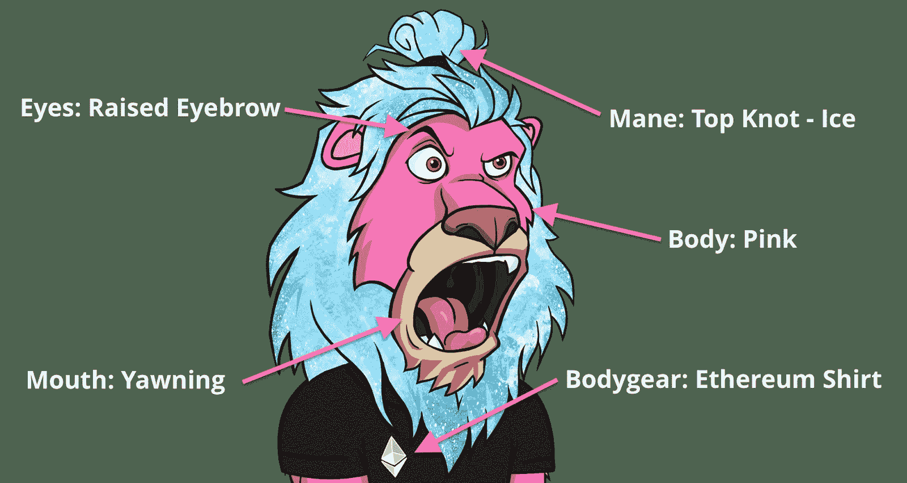
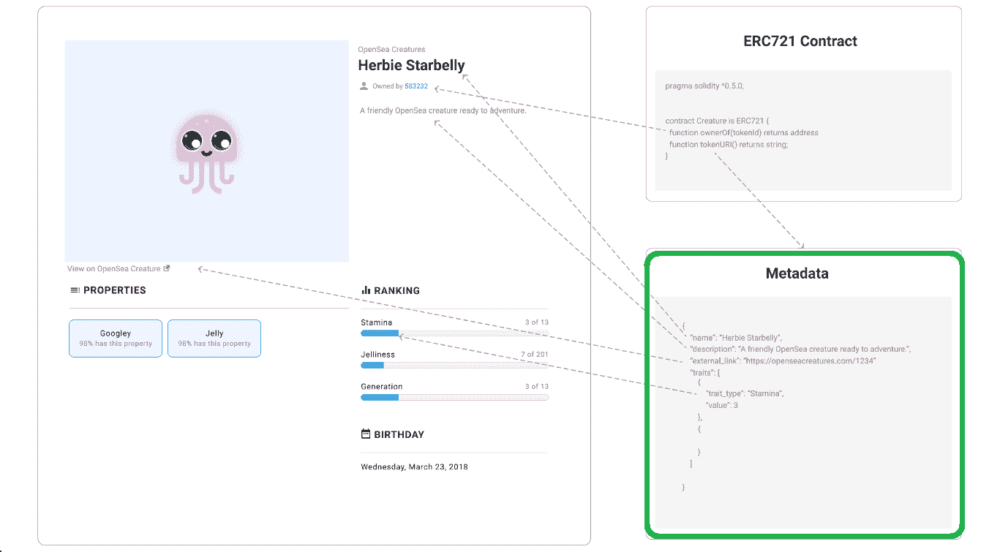
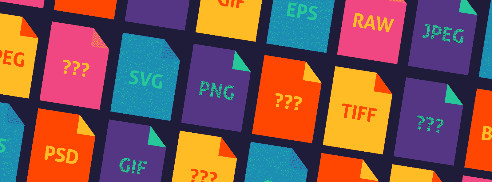
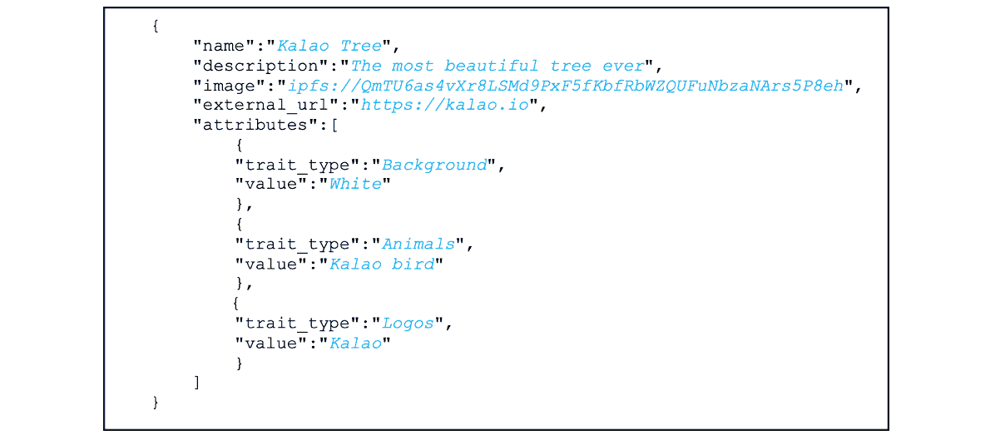
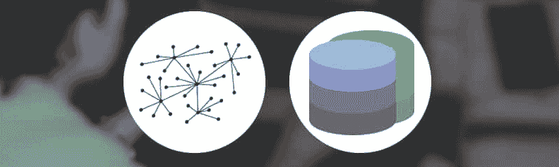
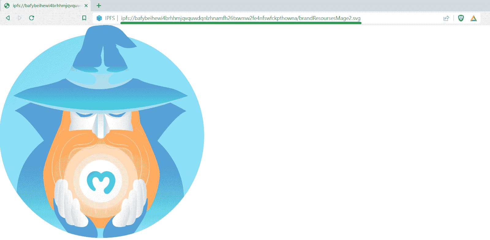
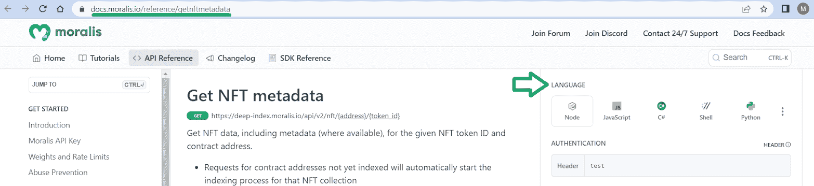

# NFT 元数据–探索 NFT 存储的元数据

> 原文：<https://moralis.io/nft-metadata-exploring-metadata-for-nft-storage/>

NFT 资产中的元数据起着至关重要的作用，因为它包含了使 NFT 公用事业成为可能的细节。也就是说，开发人员在使用数据时必须考虑不同的方面。例如，创建 NFT 时，必须使用合适的 NFT 元数据存储解决方案。此外，您需要使用正确的元数据格式。尽管如此，了解您可以在 NFT 资产的元数据中找到什么信息也非常重要。

除了正确理解 NFT 资产中的元数据之外，您还希望用最好的工具装备自己。这就是终极 NFT API 让所有开发工作变得轻而易举的地方。该 API 提供了强大的端点，可以用简短的代码片段获取各种链上数据。因此，它是构建 NFT dapp 时最重要的工具。当然，[最好的 NFT API](https://moralis.io/nft-api/) 也可以让你获取元数据 NFT 内容。这意味着你可以显示代表 NFT 的文件，将 NFT 特色融入 NFT 游戏，等等。此外，为了帮助您回答“什么是 NFT 元数据？”有信心地提问，我们将看一看本文中的一个元数据示例。因此，您可以看到一些 Moralis API 端点在运行。

此外，我们鼓励您亲自试乘这些终点。为此，[创建您的免费 Moralis 账户](https://admin.moralis.io/register)并跟随我们！然而，在我们卷起袖子之前，让我们解释一下 NFT 资产和 NFT 元数据存储中元数据的来龙去脉。

[**Sign Up with Moralis**](https://admin.moralis.io/login)

## 什么是 NFT 元数据？

在回答“什么是 NFT 元数据？”，让我们简单地看一下非功能性测试和它们需要什么。NFT 是不可替换的加密令牌，这意味着每个 NFT 都有一个唯一的链上签名(令牌 ID)，并且不能与其他 NFT 互换(与可替换令牌不同)。这种唯一性使得 NFTs 非常适合表示唯一的数字或物理项目。也就是说，数字艺术和数字收藏品是最常见的 NFT 工具是有道理的。然而，除了娱乐和投机投资之外，NFT 还有巨大的潜力。通过革新各种认证、会员/所有权证明、在线票务等，他们可以帮助创建一个更加透明和诚实的世界。



另一方面，根据定义，元数据是关于数据的数据。因此，NFT 资产中的元数据是指描述 NFT 数据的特定信息。例如，上面的图片指出了被归类为“属性”的不同的 NFT 特征。但是，属性只是可以存储在 NFT 资产元数据中的一种可选数据类型。事实上，NFT 包含的确切元数据因 NFT 类型而异。不过，有几个 NFT 标准已经就位，如 ERC-721、ERC-1155 和 SPL，它们提供了指导原则和规则。这些规则定义了元数据中必不可少的某些信息，以及可选的其他信息。因此，没有确切的格式。然而，一个普通的元数据示例包括描述、名称、代表 NFT 的文件目标(URL)和 NFT 属性。



### NFTs 和智能合同

在每一个 NFT 或 NFT 系列的背后，都有一个 NFT 智能合约(如上图所示)。如您所知，智能合约是链上软件的一部分，确保预定义的自动化操作在满足正确条件时遵循特定的预定义规则。因此，NFT 智能合约铸造非功能性交易并监管其交易。

因此，如果您决定打造自己的 NFTs，您需要编写自己的遵循上述 NFT 标准的智能合约，并将其部署到您选择的区块链网络。幸运的是，开源平台提供了经过验证的 NFT 智能合同模板，如 OpenZeppelin (EVM)或 Metaplex(索拉纳)。因此，你不需要掌握坚固或生锈来开始以分散的方式铸造 NFT。当然，您确实需要理解元数据存储。毕竟，在智能合约中提供元数据的链接至关重要。因此，让我们把重点放在元数据 NFT 存储方面。

### NFT 元数据是如何存储的？


如上图所示，数据存储在 IPFS 等地。此外，只要看看上面的图片，你马上就会比大多数 NFT 狂热分子更明白。你看，大多数用户认为代表 NFT 的文件存储在区块链。然而，事实并非如此。毕竟，代表 NFT 的文件太大了，保持它们的链接会带来灾难性的技术和经济后果。因此，NFT 开发人员需要将这些文件存储在其他地方，最好使用分散存储解决方案。

虽然元数据文件通常比代表 NFT 的文件小，但它们会消耗不必要的宝贵区块链空间。因此，元数据 NFT 信息也不存储在链上。相反，NFT 开发人员必须将元数据文件存储在其他地方，并提供到相关 NFT 智能合同的链接(URI)。就像代表 NFT 的文件一样，dev 有不同的存储选项。理想情况下，所有开发人员都应该专注于使用分散的 NFT 元数据存储解决方案。也就是说，在正确存储数据之前，开发人员需要使用合适的格式。



## NFT 元数据格式备选方案

谈到元数据格式，您需要注意两个因素。一方面，您需要知道您遵循的 NFT 标准，以便包含正确的信息。另一方面，你需要知道你将使用什么样的文件格式。后者将决定如何构建细节。

如您所知，一般来说，元数据有几种文件格式。然而，最常见的三种选择是 XML、TVS 和 JSON 文件格式。尽管如此，谈到元数据格式，JSON 是王者。因此，让我们仔细看看 NFT JSON 元数据。

### NFT JSON 元数据



在上图中，你可以看到一个 NFT JSON 元数据格式的例子。此外，上述示例结构符合 ERC-721 标准。因此，它包括“名称”、“描述”、“图像”和“外部 url”键值对。同样，“属性”键包含“特征类型”和“值”子键、子值对。此外，下面是一个实际的 NFT 元数据示例:

尽管如此，以下是使 NFT JSON 元数据格式成为加密领域标准的一些主要优势:

*   **速度**–JSON 非常快，因为它消耗的内存空间最小。
*   简单性——JSON API 提供了一个高级外观，简化了常用的用例。‬ ‬‬‬‬‬‬‬‬‬‬‬‬‬‬‬‬‬‬‬‬‬‬‬‬‬‬‬‬‬‬‬‬‬‬‬‬‬‬‬‬‬
*   开源 JSON 库是开源的，每个人都可以免费使用。
*   **通用支持**–支持所有浏览器。
*   **简洁且兼容**–创建简洁且兼容的 JSON 结果，易于阅读。
*   JSON 库不需要任何其他库来处理。

既然您已经知道元数据 NFT 详细信息通常是以 JSON 文件的形式出现的，那么是时候仔细看看一些流行的存储解决方案了。



## NFT 元数据存储解决方案

所以，假设你已经准备好了代表 NFT 的文件。现在，您知道需要将这些文件链接到您的元数据 NFT 详细信息。因此，在实际创建和存储 NFT JSON 元数据文件之前，您需要正确存储代表 NFT 的文件。如上所述，理想情况下，您应该选择分散存储解决方案。幸运的是，有一些可靠的解决方案可供您使用。然而，在我们看来，星际文件系统(IPFS)脱颖而出。如果你是第一次听说这个存储解决方案，请务必阅读我们的“[IPFS·NFT](https://moralis.io/ipfs-nft-how-to-use-ipfs-for-nft-metadata/)”文章。此外，以下是其他一些值得您考虑的著名分散式储物解决方案:

*   地壳网络
*   赫萝
*   希雅·凯特·伊索贝尔·富勒
*   Filecoin
*   比特流
*   斯托尔杰
*   阿尔韦弗

下一步是什么？那么，您可以将代表 NFT 的文件保存到 IPFS，并获取它的 URL(参见前面显示的图片)。然后，您可以将该 URL 与其他详细信息一起粘贴到 NFT JSON 元数据文件中。接下来，您也可以将元数据文件保存到 IPFS，并获取它的 URI。最后，要打造你的 NFT，你需要将 URI 粘贴到你的 NFT 智能合约中，与你决定关注的 NFT 标准相匹配。

当然，您可以手动完成所有这些操作。然而，由于 Moralis 的 IPFS 集成，您可以使用 Moralis IPFS API 通过一些简单的代码行来创建和上传元数据或代表 NFT 的文件。我们将通过上传元数据示例向您展示如何做到这一点。


## 探索 NFT 元数据示例

我们邀请您通过自己完成下面的示例教程来进一步巩固您的元数据知识。幸运的是，只需要三个简单的步骤就可以看到用 Moralis 将 NFT 的元数据存储到 IPFS 的威力。但是，在您采取接下来的步骤之前，请确保您已经完成了以下先决条件:

*   安装 Python 或 Node v.14(或更高版本)。
*   准备好您最喜欢的代码编辑器或 IDE。我们倾向于使用 Visual Studio 代码(VSC)。
*   安装你喜欢的包管理器*(“NPM”、“yarn”、“pnpm”或“pip”)*。

### 步骤 1:设置 Moralis 标准

如果你还没有建立并运行你的 Moralis 账户，现在就创建它。这将允许您访问您的管理区域，在那里您将能够获得您的 Web3 API 密钥:


现在，保持您的 API 密钥，并专注于为您的项目安装 Moralis SDK。因此，运行与您的软件包管理器相匹配的命令行:

```js
npm install moralis
```

```js
yarn add moralis
```

```js
pnpm add moralis
```

```js
pip install moralis
```

### 步骤 2:使用正确的代码行

为了使事情尽可能简单，您不需要自己编写代码。相反，您可以简单地复制粘贴以下“index.js”示例文件:

```js
const Moralis = require('moralis').default;
const { EvmChain } = require('@moralisweb3/evm-utils');

const runApp = async () => {
  await Moralis.start({
    apiKey: "YOUR_API_KEY",
    // ...and any other configuration
  });

    const abi = [
    {
        path: "metadata.json",
        content: {
        name: "NFT Name",
        description: "This will be the NFT description.",
        image: "ipfs://bafybeihewi4brhhmjqvquwdqnlzhnamfh26txwmw2fe4nfswfckpthowna/brandResoursesMage2.svg",
        attributes: [
          {
            "trait_type": "Base", 
            value: "Starfish"
          }, 
          {
            "trait_type": "Eyes", 
            value: "Big"
          }, 
          {
            "trait_type": "Mouth", 
            value: "Surprised"
          }, 
      },
    },
    ];

  const response = await Moralis.EvmApi.ipfs.uploadFolder({ abi });

  console.log(response.toJSON());
}

runApp();
```

看上面几行代码，可以看到“[*upload folder*](https://docs.moralis.io/reference/uploadfolder)”IPFS API 端点。后者负责为 NFT 资产上传元数据。此外，您还可以看到我们的示例“ *abi* ”常量，它包括我们的示例 NFT 的所有元数据 NFT 细节。另外，请注意，我们已经上传了代表 NFT 的 SVG 图像示例。实际上，您可以使用支持 IPFS 地址的浏览器查看它:



尽管如此，请确保不要忘记用上面获得的 Web3 API 密钥替换“ *YOUR_API_KEY* ”。

*注意:上面的示例脚本是用 JavaScript 编写的。但是，如果您更喜欢 TypeScript 或 Python，请访问* [*文档页面，将 NFT 元数据上传到*](https://docs.moralis.io/docs/how-to-upload-nft-metadata-to-ipfs) *，并复制“index.ts”或“index.py”的内容来代替:*


### 步骤 3:执行代码

有了上面几行代码，就该执行程序了。因此，在终端中输入以下命令:

```js
node index.js
```

*注意* *:如果你使用的是 TypeScript 或者 Python，你需要使用“npx ts-node index.ts”或者“python index.py”命令来代替。*

运行以上命令后，使用您的终端来查看结果。我们还鼓励您复制它返回的路径，并使用兼容 IPFS 的浏览器(如 Brave)来查看您的 NFT 的元数据。



### 在 NFT 项目中提取元数据

无论您想从项目的 NFT 还是其他现有的 NFT 获取元数据，您都可以使用终极 NFT API 的强大功能。在获取不可替换令牌的元数据时，以下三个端点往往最有价值:

*   [*getNFTMetadata*](https://docs.moralis.io/reference/getnftmetadata)
*   "[](https://docs.moralis.io/reference/getcontractnfts)*"*
*   *"[*getnftcontractdetadata*](https://docs.moralis.io/reference/getnftcontractmetadata)"*

*请务必浏览上述端点的文档页面，以了解如何正确使用它们。*

## *NFT 元数据–探索 NFT 存储的元数据–概述*

*我们在今天的文章中谈了相当多的内容。首先，您有机会学习如何正确回答“什么是 NFT 元数据？”问题。因此，你发现了什么是 NFT，以及它们独特的链上数据使它们有价值。我们还解释了智能合约如何融入 NFT 的故事。接下来，您发现元数据实际上并没有存储在区块链上。相反，它通常存储在 NFT JSON 元数据文件中。然后，我们使用存储解决方案(如 IPFS)来托管这些文件。最后，您能够跟随我们的领导，创建并上传 NFT 元数据示例。*

*如果你真的想发展 NFT，你有两个选择。您可以进一步探索如何创建自己的 NFT。这将需要处理智能合同，还需要将代表 NFT 的文件和元数据文件上传到 IPFS 或其他分散存储解决方案。当然，在 Moralis 博客的详细指导下，你可以毫不费力地做到这一点。*

*当然，您也可能更喜欢探索其他区块链发展主题。除了我们的加密博客，[Moralis YouTube 频道](https://www.youtube.com/c/MoralisWeb3)将帮助你。毕竟这两个风口涉及的话题很广。例如，一些最新的文章解释了[AWS Lambda 如何工作](https://moralis.io/how-aws-lambda-works-functions-and-architecture-explained/)，什么是 [GameSparks](https://moralis.io/aws-gamesparks-guide-what-is-gamesparks/) ，如何[获得 NFT 收集数据](https://moralis.io/nft-collection-data-how-to-get-nft-collection-data/)，等等。*

*最后但同样重要的是，你可能也渴望尽快成为全职加密员。如果是这样，你应该报名参加[Moralis 学院](https://academy.moralis.io/)成为区块链认证，我们建议从[区块链和比特币基础](https://academy.moralis.io/courses/blockchain-bitcoin-101)开始。*