# NFT 元数据存储–如何存储 NFT 元数据

> 原文：<https://moralis.io/nft-metadata-storage-how-to-store-nft-metadata/>

在本文中，您将了解什么是不可替换令牌的元数据，什么是 NFT 元数据存储，以及如何以非分散的方式存储 NFT 元数据。当然，在很多情况下，NFT 应该以完全分散的方式存储。然而，具体项目可能需要一定的灵活性。例如，假设您的项目的 NFTs 充当网关或订阅确认，并且您希望每月为您的用户提供不同的 NFT 图像。如果是这样，使用集中的 NFT 元数据存储解决方案，如 Firebase 存储桶，将是首选。

接下来，我们将以简单的方式回答一些重要的问题，从而解决今天的话题。例如，解释 NFTs 的元数据存储在哪里以及可以用元数据做什么是很重要的。当谈到利用 NFT 元数据时，一个可靠的 NFT API 是关键。幸运的是，你可以用你的[免费 Moralis 账户](https://admin.moralis.io/register)访问[终极 NFT API](https://moralis.io/nft-api/) 。有了这个工具，您可以轻松地将所有领先区块链的各种 NFT 集成到您的 dapps 中。当然，我们还将采用一个示例项目来进一步阐明如何使用 Firebase 存储 NFT 元数据。因此，我们将向您展示如何创建 NodeJS 后端应用程序来上传一组图像和元数据。最后，您还将学习如何使用 Remix 在 Polygon testnet 上创建这些示例 NFT。

[**Sign Up for Moralis Magazine**](https://moralis.io/joindiscord/)

## 什么是 NFT 元数据？

如果您想了解什么是 NFT 元数据，您需要知道什么是 NFT，什么是元数据。正因如此，我们分开来看这两个词。NFT 或不可替代的代币是区块链资产的独特类型。正如“不可替代”一词所暗示的，不存在两个相等的非功能性交易。当然，它们可能有代表它们的相同文件；然而，它们的链上数据是唯一的。这使得它们非常适合数字艺术、数字收藏品、所有权证明、证书等。

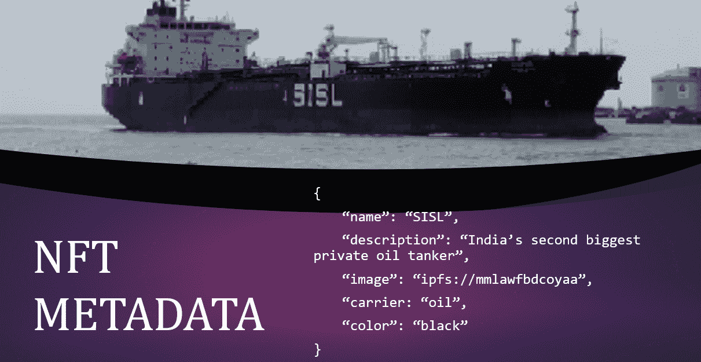

另一方面，根据定义，元数据意味着“关于数据的数据”。因此，NFT 元数据为您提供了特定 NFT 的所有详细信息。上面的图片就是一个很好的例子。此外，由于每个 NFT 的重要部分都是某种文件(JPG、PNG、MP3、MP4、PDF 等)。)，元数据起到了关键作用。毕竟，NFT 的文件太大了，无法直接存储在区块链上。这样做会带来灾难性的技术和财务后果。相反，我们将文件的位置(以及其他细节)存储在 NFT 元数据中。这就是了解如何存储 NFT 元数据至关重要的原因。

此外，元数据文件通常采用 JSON 文件格式。元数据中的具体细节可能会有所不同——毕竟，有不同的 NFTs 标准。然而，最受欢迎的是 ERC-721 和 ERC-1155 NFTs。在这种情况下，元数据通常包括描述、名称、图像(文件)目的地以及属性或特征。后者包含不同的特征类型值对，并且是可选的。在我们之前的一篇文章中，你可以学习如何给 NFT 元数据 *添加属性。*此外，请务必仔细查看下图，巩固您对 NFT 元数据的理解。

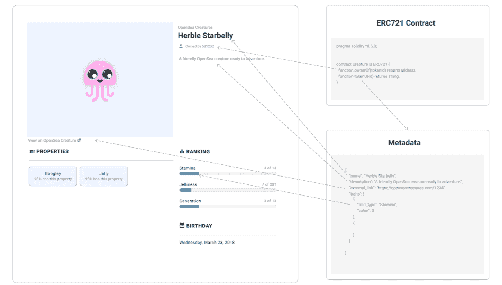

## NFTs 的元数据存储在哪里？

尽管我们的目标都是去中心化的未来，但在某些情况下，您可以通过实际使用集中式 NFT 元数据存储选项来为您的用户增加价值。也就是说，很明显，NFT 项目的分散化程度取决于用来保存 NFT 文件和 NFT 元数据文件的方法。

因此，最终的分散式方法是将 NFT 文件及其元数据存储在分散式云存储解决方案中(例如，IPFS)。另一方面，更集中的方法是将这些文件和元数据存储在一个集中的云存储服务中。此外，中间立场也是可能的。在这种情况下，我们可以使用集中存储解决方案存储 NFT 文件，而 NFT 元数据将以分散的方式存储。此外，在某些情况下，NFTs 的特定用途可能需要您使用一种集中式存储替代方案。但是，必须做到完全透明，并向您的 NFT 用户解释文件和元数据不是以分散的方式存储的，以便让他们选择另一个选项。这样，您就可以让您的用户决定附加价值是否超过了集中化方法。

尽管如此，请记住，实际的 NFT 仍然是在区块链上创建的，这使得它们的契约地址和 ID 是不可变的。此外，它们指向 NFT 元数据的 URI 链接将存储在外链上。现在，如果你觉得这些信息有点混乱，不要担心；如何在 Firebase 上存储 NFT 元数据的例子将进一步阐明事情。


## 你能用元数据做什么？

在上一节结束时，您已经了解到，从本质上讲，NFT 元数据可以通过 URI 链接进行访问。此外，这些 URIs 包含所有的细节，包括相关的 NFT 文件的 URL 链接。因此，您可以使用高质量、不可替代的令牌元数据 API 来获取特定 NFT 的所有细节。

此外，Moralis 提供了终极 NFT API，它结合了构建优秀 NFT 应用程序所需的一切。Moralis NFT API 使您能够获取实时 NFT 元数据、所有权数据、NFT 转让数据、NFT 价格等。因此，您不需要解析单个智能契约、对不规则数据集进行排序、处理清理和拼接，或者进行数十次调用或查询节点来获取元数据。相反，您只需进行一次 API 调用，就可以跨任何受支持的链检索 NFT 信息。

更重要的是，通过使用 Moralis，你可以创建自己的 NFT 仪表板，一个整合了 NFTs 的 Web3 游戏，一个 NFT 市场，等等。要进一步了解 Moralis NFT API 端点，[请访问 Moralis 文档](https://docs.moralis.io/reference/nft-api):

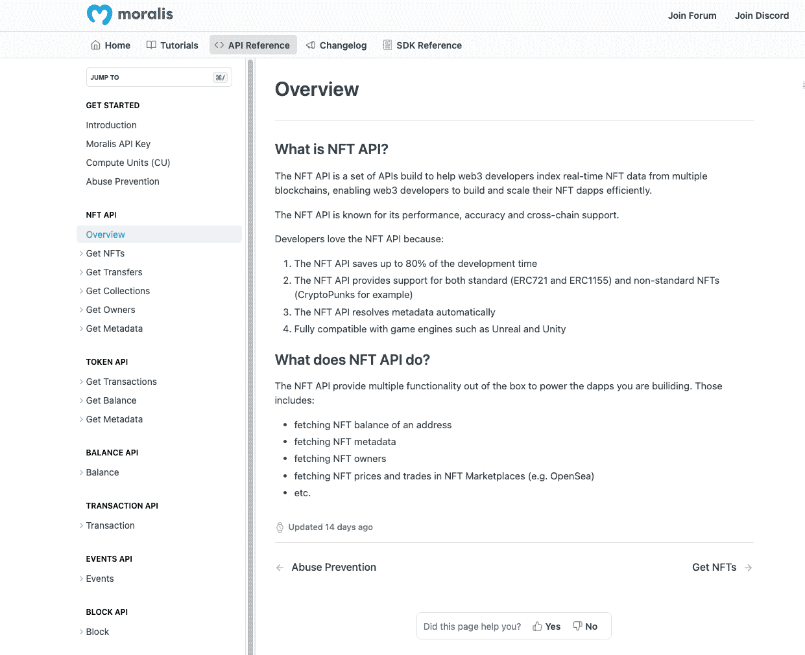

## 如何在 Firebase 上存储 NFT 元数据

在本节中，您将学习如何使用 Firebase 存储桶以集中的方式存储 NFT 元数据和图像(或其他文件)。通过采用这种方法，您可以改变您的 NFT 所代表的图像。除了向您展示如何设置 Firebase 和批量上传文件和元数据，我们还将使用 Remix 创建一个示例 NFT。因此，你将能够完全掌握前面章节中描述的理论。尽管如此，为了从本教程中获得最大收益，我们鼓励你卷起袖子跟随我们。你可以从头开始，或者你可以使用我们在 GitHub 上的 [repo 来访问](https://github.com/MoralisWeb3/youtube-tutorials/tree/main/Firebase-Nft-Metadata-Storage)[最终代码](https://github.com/MoralisWeb3/youtube-tutorials/tree/main/Firebase-Nft-Metadata-Storage)。在那里，您还可以找到示例图像和元数据。


### 初始设置第 1 部分–激活您的 Firebase 存储桶

从访问 Firebase 控制台开始。在那里，您可以使用现有项目或添加新项目:

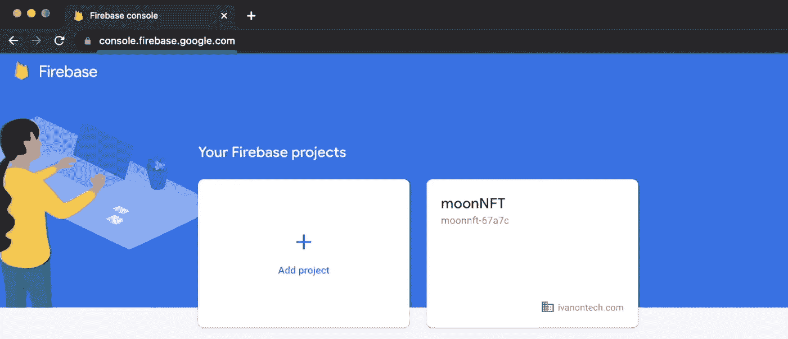

进入 Firebase 项目仪表板后，展开“构建”菜单，然后单击“存储”选项:

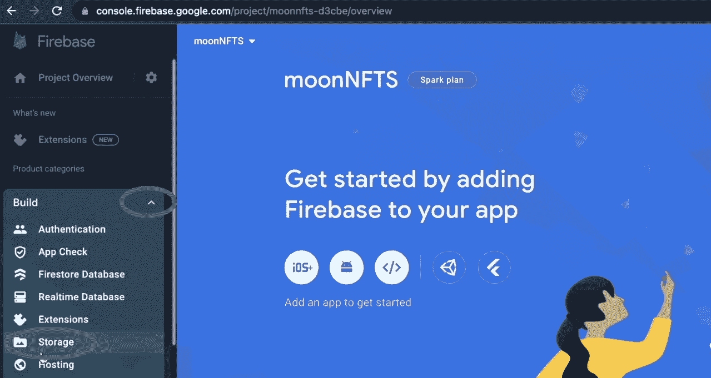

加载“存储”页面后，单击“开始”按钮:

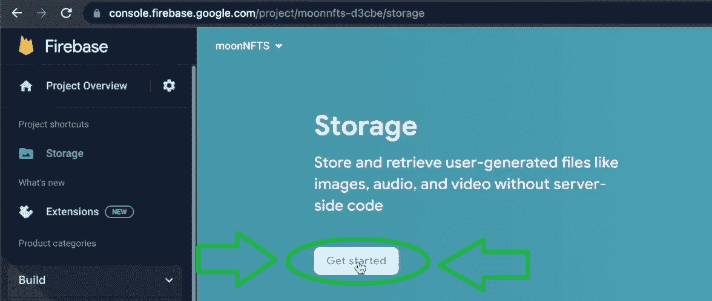

点击上面的按钮后，你就可以设置 Firebase 的云存储了。由于这是一个示例项目，我们建议选择测试模式。然后，点击“下一步”继续:


最后，点击“完成”按钮完成设置:

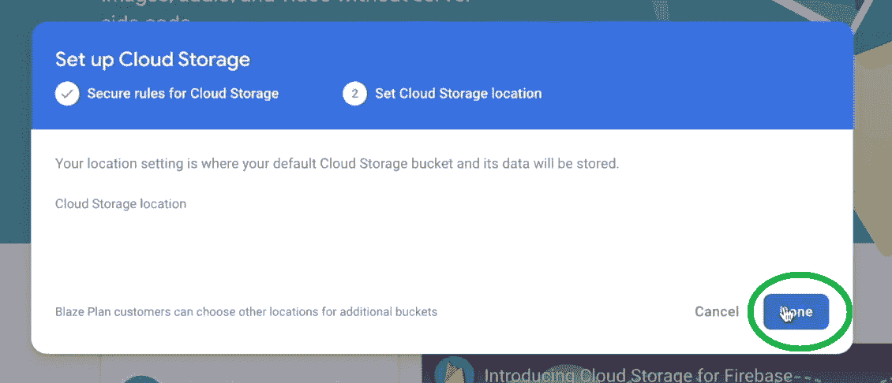

因此，您应该会看到项目的“存储”页面:

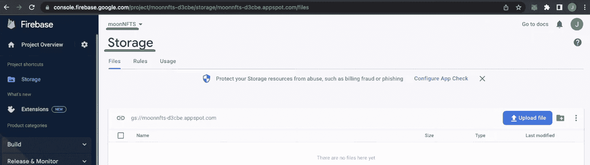

接下来，您需要创建新的私钥。为此，您需要通过单击侧面菜单中的齿轮图标来访问“项目设置”页面:

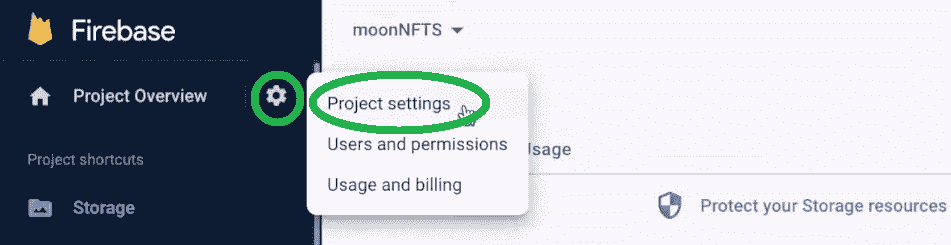

接下来，选择“服务帐户”选项卡:

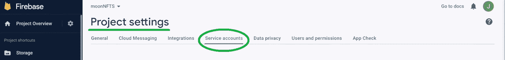

然后，向下滚动并确保“Node.js”被选中:

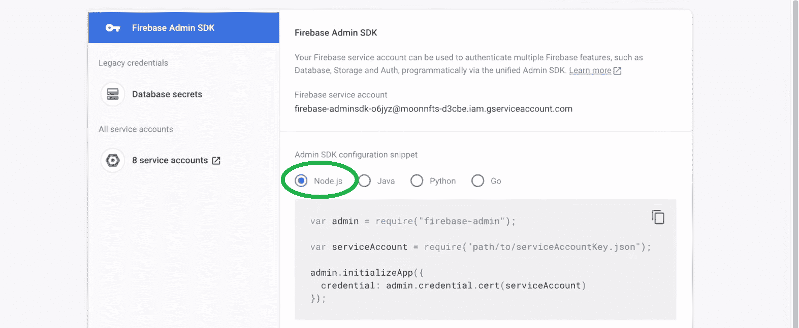

最后，单击“生成新的私钥”按钮，然后在弹出窗口中进行确认(单击“生成密钥”):

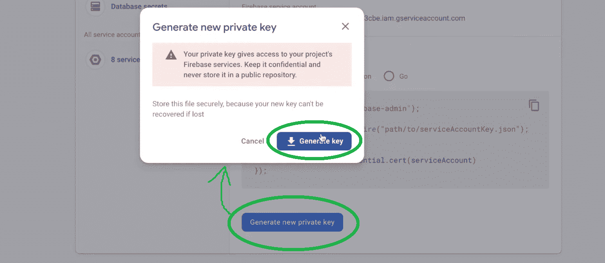

### 初始设置第 2 部分–创建 NodeJS 项目

*注意* *:可以使用自己喜欢的 IDE 然而，为了避免任何不必要的混乱，我们建议您跟随我们的领导，使用 Visual Studio 代码(VSC)。*

首先，为您的 NFT 项目创建一个文件夹，并在 VSC 打开它:

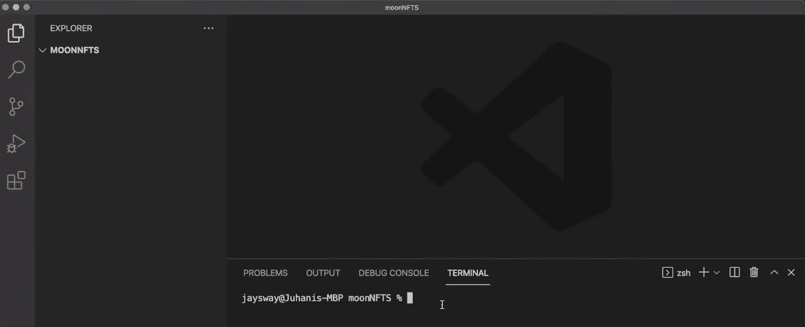

正如你在上面的截图中看到的，我们将我们的文件夹命名为“MOONNFTS”。此外，还要确保准备好您的终端。接下来，通过输入以下命令初始化 NodeJS 项目:

```js
npm init
```

然后，你只需要按几次“回车”来完成设置步骤。因此，您应该在项目文件夹中获得一个“package.json”文件:

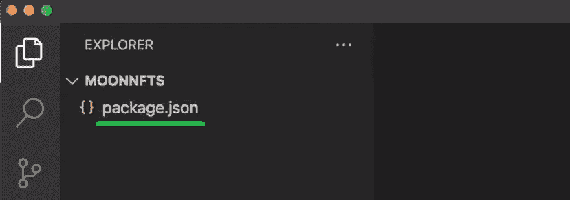

接下来，创建一个“index.js”文件。您可以手动或使用“ *touch index.js* ”命令来完成。有了“index.js”文件，就可以安装所需的依赖项了。因此，使用您的终端并输入以下内容:

```js
npm i firebase-admin uuid
```

上面的命令将创建一个“node_modules”文件夹和一个“package-lock.json”文件。您的项目浏览器应该如下所示:

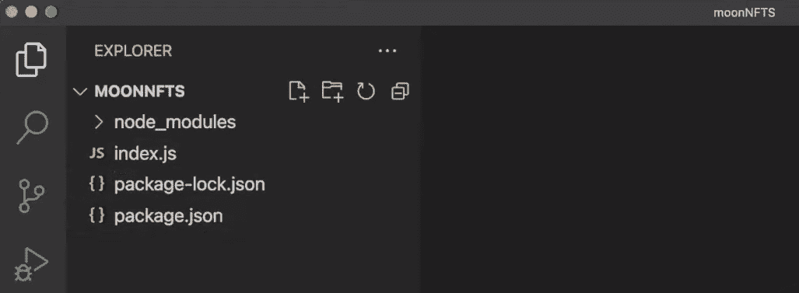

最后，您还需要添加从 Firebase 下载的 JSON 文件(之前您单击“Generate key”按钮时下载的)。您只需从浏览器中拖放即可:

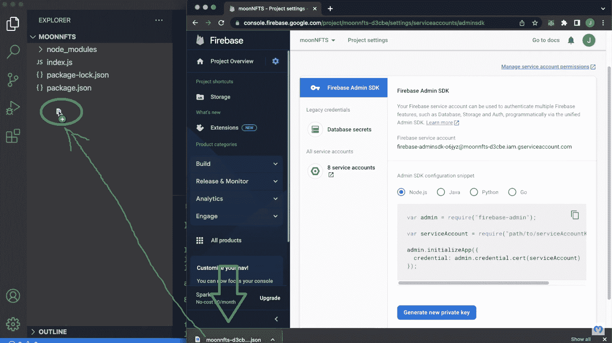

此外，确保将您的文件重命名为更加用户友好的名称(我们的示例是:“serviceAccount.json”)。通过重命名该文件，您已经成功完成了初始设置的两个部分。因此，是时候开始编写“index.js”文件了，这样它就可以正确地将 NFT 元数据存储到 Firebase 中。

### 将 NFT 元数据存储到 Firebase 存储桶的代码

如果您还没有这样做，请打开“index.js”文件。在顶部，要求您依赖以下代码行:

```js
const firebaseAdmin = require("firebase-admin");
const { v4: uuidv4 } = require("uuid");
const serviceAccount = require("./serviceAccount.json");
```

然后，创建一个管理变量以使用您在“serviceAccount.json”文件中的凭据:

```js
const admin = firebaseAdmin.initializeApp({
    credential: firebaseAdmin.credential.cert(serviceAccount),
  });
```

上面几行代码将为您提供对 Firebase 项目的访问。接下来，您还希望确保能够访问您的存储桶:

```js
const storageRef = admin.storage().bucket("REPLACE_WITH_YOUR_BUCKET_NAME");
```

要获得您的存储桶名称，请返回到 Firebase 项目的“存储”页面:

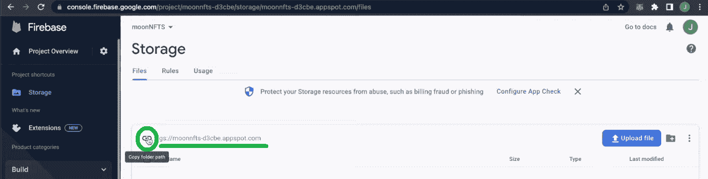

Firebase 项目和存储桶访问就绪后，您需要创建一个函数，将文件从您的文件夹导入 Firebase。

#### 上传 NFT 的文件

如果您还记得的话，NFT 元数据包括 NFT 文件的 URL。因此，您需要首先上传图像文件。为此，创建以下函数:

```js
async function uploadFile(path, filename) {

    const storage = storageRef.upload(path, {
        public: true,
        destination: `image/${filename}`,
        metadata: {
          metadata: {
            firebaseStorageDownloadTokens: uuidv4(),
          },
        },
    });

    return storage
}
```

您还想调用上面创建的函数:

```js
(async () => {
    for (let i = 1; i < 11; i++) {
    await uploadFile(img/${i}.png`, `${i}.png`);
    console.log("Uploaded image number " + i);
    }
})();
```

正如您所看到的，上面的" *for* "循环确保了您的文件夹中的所有十个示例文件都被上传到 Firebase 并正确命名。此外，在您实际运行上面的“ *uploadFile* ”异步函数之前，请确保将包含图像的文件夹添加到您项目的文件夹中:

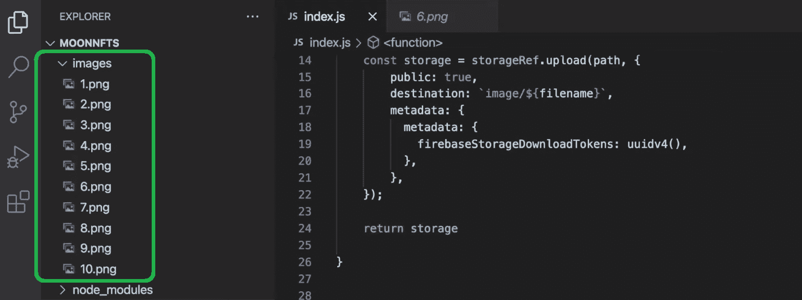

*注意:记住你可以使用我们的例子* [*图片文件*](https://github.com/MoralisWeb3/youtube-tutorials/tree/main/Firebase-Nft-Metadata-Storage/images) *在 GitHub 上等待你。*

准备好示例文件后，您可以运行以下命令开始上传它们:

```js
node index.js
```

运行以上命令后，您将在终端中看到上传进度:

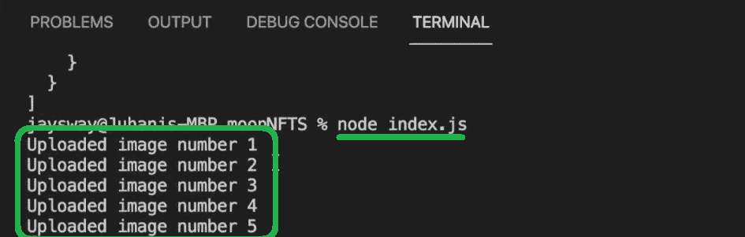

此外，你的 Firebase 的“存储”页面应该反映你的进展:

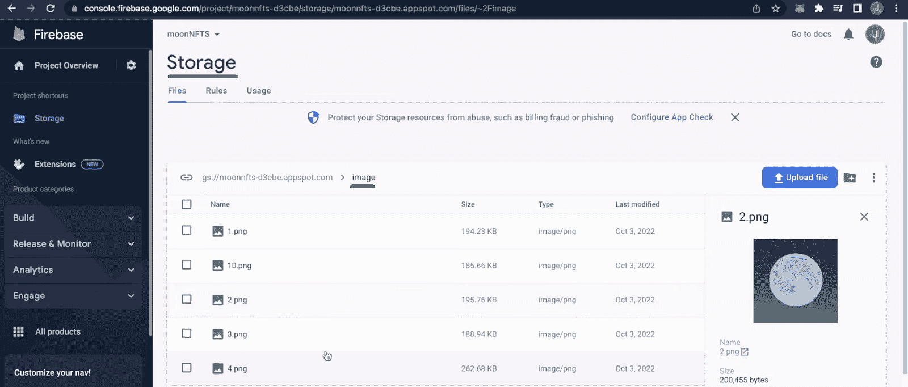

为了更详细的演示，请使用下面的视频(8:48)。成功上传图像文件后，您还可以创建和上传元数据文件。

#### 创建和上传元数据文件

注意:对于本教程来说，您不必创建您的 JSON 文件。相反，你可以使用我们的 [*元数据文件*](https://github.com/MoralisWeb3/youtube-tutorials/tree/main/Firebase-Nft-Metadata-Storage/metadata) *。只要确保使用您的地址(下面的视频，从 9:30 开始)。*

首先创建一个“元数据”文件夹，并用十个 JSON 文件填充它:

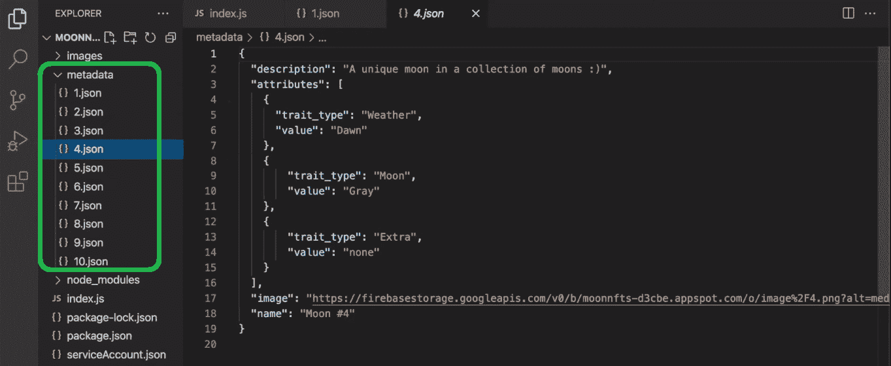

准备好元数据文件后，您可以使用“index.js”文件将它们上传到 Firebase 存储桶，它将充当 NFT 元数据存储。为此，只需将“*图像*替换为“*元数据*”，将“ *png* ”替换为“*JSON*”(10:40):

```js
async function uploadFile(path, filename) {

    const storage = storageRef.upload(path, {
        public: true,
        destination: `metadata/${filename}`,
        metadata: {
          metadata: {
            firebaseStorageDownloadTokens: uuidv4(),
          },
        },
    });

    return storage

}

(async () => {
    for (let i = 1; i < 11; i++) {
    await uploadFile(`./metadata/${i}.json`, `${i}.json`);
    console.log("Uploaded meta number " + i);
    }
})();
```

最后，再次运行" *node index.js* "命令。因此，您现在应该已经成功上传了 NFT 图像文件和相应的元数据:

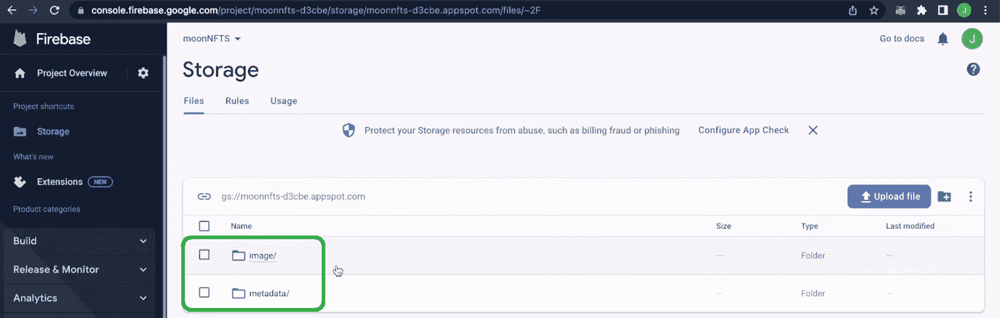

### 创建示例 NFT

现在您已经正确地存储了所有的成分，例如，NFT，是时候创建实际的 NFT 了。为此，我们将把您交给下面的视频教程，从 12:12 开始。在这里，你将有机会跟随我们内部专家的领导，在 Polygon 的 testnet 上使用 Remix 来制作示例 NFT。本质上，您将创建一个简单的 NFT 智能合同，并部署它来创建您自己的 NFT。为此，你需要你的 MetaMask 钱包和一些测试软件。

此外，从 17:43 开始，您还将看到如何使用 Moralis 文档来了解 Moralis 的 NFT API 的强大功能。最后但同样重要的是，您还将能够在 OpenSea (18:40)上查看您的示例 NFTs。

这是我们在整篇文章中引用的视频教程:

[https://www.youtube.com/embed/it1sxzHtvxc?feature=oembed](https://www.youtube.com/embed/it1sxzHtvxc?feature=oembed)

## NFT 元数据存储–如何存储 NFT 元数据–摘要

我们从解释什么是 NFT 元数据开始了今天的讨论。然后我们看了 NFTs 的元数据存储在哪里。在这里，您了解了不同的 NFT 元数据存储选项。此外，您了解了 Moralis NFT API，以及它如何帮助您轻松创建各种 NFT dapp。最后，我们进行了一个示例项目，在这个项目中，您有机会直接看到如何在 Firebase 存储桶中存储 NFT 元数据。作为奖励，你还有机会按照上面的视频教程制作示例 NFT。

如果你喜欢今天的教程，我们建议你浏览 Moralis 文档、 [Moralis YouTube 频道](https://www.youtube.com/c/MoralisWeb3)和 [Moralis 博客](https://moralis.io/blog/)。在那里你可以找到其他的 dapp 和 NFT 开发教程，这些地方是接受 Web3 教育的好地方。例如，一些最新的主题集中在解释什么是 [Aptos 区块链](https://moralis.io/what-is-aptos-full-guide-to-the-aptos-blockchain/)和[隋区块链](https://moralis.io/what-is-sui-blockchain-the-ultimate-guide/)，[构建以太坊 dapps](https://moralis.io/building-ethereum-dapps-create-test-and-deploy/) ，使用元掩码创建 [Web3 Firebase 登录](https://moralis.io/create-a-web3-firebase-login-with-metamask/)，如何[创建 NFT 项目](https://moralis.io/how-to-create-an-nft-project-get-started-and-launch-successfully/)，等等。

另一方面，你可以采取更专业的方法来进行加密教育。通过报名参加[Moralis 学院](https://academy.moralis.io/)，你可以成为区块链认证，并大大增加你的机会去全职加密宜早不宜迟。如果 NFTs 是你最喜欢的茶，你可能想开始学习如何[建立一个 NFT 市场](https://academy.moralis.io/courses/ethereum-dapp-programming)。