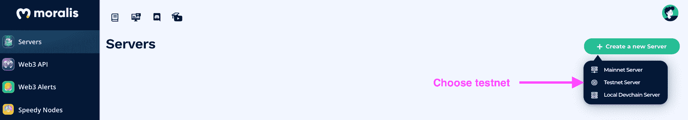
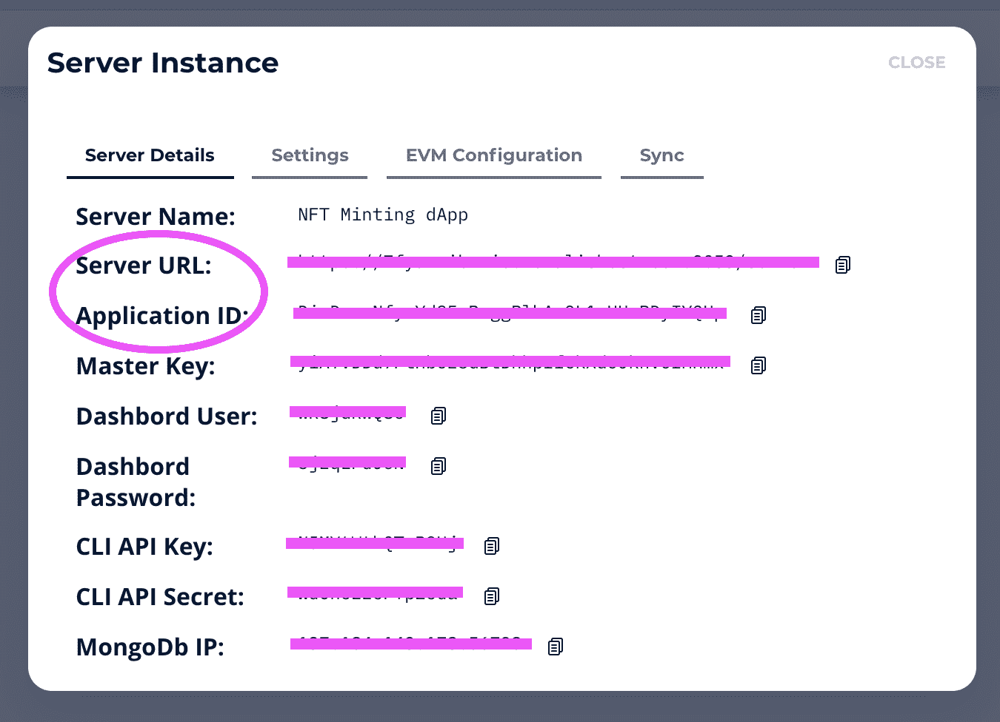
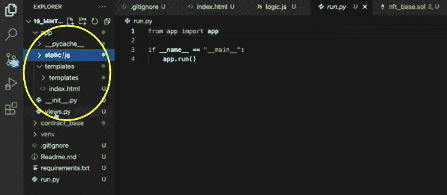
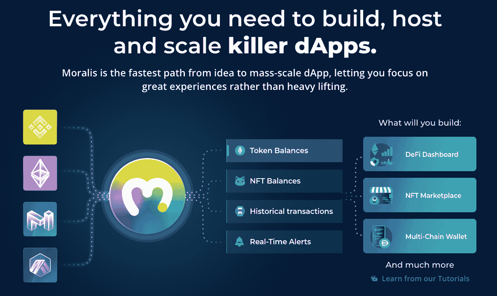

# NFT 代币开发-终极指南

> 原文：<https://moralis.io/nft-token-development-the-ultimate-guide/>

在过去的一年里，NFT，或者说不可替代的代币，已经引起了很多关注。他们将加密、区块链、艺术和游戏产业连接成一个庞大的生态系统。此外，自 2021 年初以来，随着非功能性测试的普及，市场对非功能性测试一直表现出浓厚的兴趣。由于 NFT 的持续成功，程序员们一直热衷于学习 NFT 令牌的开发。此外，如果你渴望成为一名 NFT 开发者，现在是开始的绝佳时机。因此，本指南将推进您的编程之旅，并指导您如何开发 NFT 令牌。

毫无疑问，任何对区块链和加密领域感兴趣的人都应该了解 NFTs。无论你是对编程感兴趣，还是希望在艺术世界中展翅高飞，了解如何[创造自己的 NFT](https://moralis.io/how-to-create-your-own-nft-in-5-steps/) 都会给你的职业生涯带来巨大的优势。

你可以学习简单的 NFT 令牌开发，通过使用强大的 [Web3](https://moralis.io/the-ultimate-guide-to-web3-what-is-web3/?utm_source=blog&utm_medium=post&utm_campaign=Want%2520the%2520Latest%2520in%2520%253Cspan%253EBlockchain%2520Development%253F%253C%252Fspan%253E) 构建工具，如 Moralis 来加速你的 NFT 创建。Moralis 是最终的 Web3 操作系统，提供托管、管理和扩展 NFT dapp(分散式应用)的一切。有了 [Moralis Speedy Nodes](https://moralis.io/speedy-nodes/) ，你可以利用快速、可靠的世界级节点，而无需设置和同步你自己的节点，例如[以太坊节点](https://moralis.io/how-to-connect-to-ethereum-nodes/)。另外，因为是跨链的，所以还可以用 Moralis 设置币安智能链(BSC)、多边形、[雪崩](https://moralis.io/moralis-announces-avalanche-support/?utm_source=blog&utm_medium=post&utm_campaign=Want%2520the%2520Latest%2520in%2520%253Cspan%253EBlockchain%2520Development%253F%253C%252Fspan%253E)，或者 [Arbitrum 节点](https://moralis.io/announcing-moralis-speedy-nodes-support-of-arbitrum-nodes/)。事实上，Moralis 充当雪崩的 [Infura 和 BSC](https://moralis.io/infura-for-avalanche-exploring-infura-avalanche-alternatives/) 的 [Infura。](https://moralis.io/infura-bsc-alternatives-the-best-alternative-to-infura-for-bsc/)

当你进一步深入你的 NFT dApp 或平台开发时，你也应该看看有用的工具，比如 Moralis 的 [ultimate NFT API](https://moralis.io/ultimate-nft-api-exploring-moralis-nft-api/) ，它让你可以访问 NFT 的数据、历史、所有权等等。这意味着即使没有深厚的 EVM ( [以太坊虚拟机](https://moralis.io/evm-explained-what-is-ethereum-virtual-machine/))知识，你也可以创建一个 NFT dApp、平台或市场。

## 了解 NFT 代币开发-信息视频

通过遵循本指南，您将通过几个简单的步骤了解执行 NFT 令牌开发所需的一切。不过，你也可以去 [Moralis 的 Youtube 频道](https://www.youtube.com/channel/UCgWS9Q3P5AxCWyQLT2kQhBw)了解简明视频教程中的过程:

https://youtu.be/WdQHnb_5m5Q

## 快速 NFT 令牌开发-建立一个铸造 dApp

那么，[什么是 NFT](https://moralis.io/non-fungible-tokens-explained-what-are-nfts/)，是什么让它们如此令人兴奋？首字母缩写词 NFT 代表“不可替代的代币”，这意味着这种类型的代币，不同于 ERC-20 代币或其他用作交换媒介的代币，不能作为另一种代币的等价物互换。

NFT 是代表独特价值、商品或对象的令牌。实际上，它们非常适合表现数字艺术作品、创意项目、音乐或任何具有独特属性的东西。NFT 令牌开发中使用的两个流行以太坊标准是 ERC-721 和 ERC-1155。

### NFT 明廷 dApp

创建自己的 NFT 的最佳捷径之一是构建一个为你做铸造工作的铸造 dApp。有了 NFT dApp，你可以随心所欲地制造更多的 NFT。

好消息是构建一个 NFT dApp 不需要很高的编程技能。使用 Moralis，您可以将流程简化为五个简单的步骤:

1.  初始化 Moralis 并找到适合您项目的智能合同。
2.  创建一个 HTML 索引文件。
3.  为你的 dApp 做一个简单的登录功能。
4.  创建一个上传功能，这样您就可以上传您的 NFTs。
5.  构建一个 mint 函数来创建 NFT。

## NFT 令牌开发–dApp 功能

你的目标是创造一个铸造 dApp，你的 dApp 应该具备独立铸造 NFT 所需的所有基本特征。

成品应该是这样的:


正如你所看到的，dApp 有输入你的用户名和电子邮件的字段，以及连接你到 MetaMask 的链接。为什么需要这样做？这是因为该应用程序需要一个函数来[通过元掩码](https://moralis.io/how-to-authenticate-with-metamask/)进行验证，这样用户就可以在区块链上验证自己。请注意，用户数据和钱包地址的存储是分散的。元掩码对于访问这些数据以及与以太坊的网络进行交互至关重要。此外，记住铸造是一种交易。因此，你需要连接到一个有效的以太坊地址来执行它。

## 开始 NFT 令牌开发

### 向 Moralis 注册

如果你还没有注册，你需要[注册一个新的 Moralis 账户](https://admin.moralis.io/register)。不用担心；这很简单，免费，只需要一分钟。

#### 创建新服务器

注册后，你会在界面的右上方找到“+创建新服务器”按钮。单击按钮并选择 testnet 作为您的服务器选项。



当你从下拉菜单中选择“Testnet 服务器”选项后，会出现一个弹出窗口，你需要在其中填写一些细节。为您的项目选择一个名称，在我们的例子中，我们将其命名为“NFT 明廷 dApp”。选择您的首选地区和网络。在“选择链”下，确保使用“Eth (Ropsten)”，因为我们在这个项目中使用 Ropsten testnet。然后单击右下角的“添加实例”按钮来完成这一步。


点击“添加实例”按钮后，您的新服务器应该会很快出现在您的屏幕上。在您刚刚创建的服务器上单击“查看详细信息”按钮，并记下详细信息，因为您将需要这些信息来继续下一步。



记下“应用程序 ID”和“服务器 URL”信息，因为稍后您会将它们复制并粘贴到代码的第一行。

### NFT 令牌开发–铸造 dApp 先决条件

这个阶段至少需要 Python 3.0 但是，如果您还没有安装它，您可以在网上查找一些资源，这些资源将为您提供适合您的平台的安装指南。

此外，为了继续，我们还假设您精通 HTML、JavaScript (JS)、Solidity 和 Python。如果你需要复习一下 [JavaScript](https://moralis.io/javascript-explained-what-is-javascript/) 或者需要理解“[什么是可靠性](https://moralis.io/solidity-explained-what-is-solidity/)？”，在 Tech Academy 上查找 Ivan 的优秀课程，如针对区块链开发人员的 [JavaScript 编程](https://academy.ivanontech.com/courses/javascript-programming-for-blockchain-developers)和[以太坊智能合约编程 101](https://academy.ivanontech.com/courses/ethereum-smart-contract-programming-101) ，让您跟上区块链开发的速度。

你需要记住的另一件事是，我们使用的是事先准备好的智能合约。开发人员可以选择编写他们的智能合约，或者简单地复制一个已经过 GitHub 验证的可靠的预建合约。在这种情况下，我们试图使事情尽可能简单。因此，最好的选择是使用已经写好并审核过的智能合同。

### 建设 NFT 造币厂

dApp 是一个简单的 flask 应用程序，在 flask 应用程序中，有一个“run.py ”,如下所示:

```js
from app import app

if __name__ == "__main__":
    app.run()
```

这个“run.py”将触发位于屏幕左侧的目录中的所有内容:



## NFT 代币发展五步曲

现在，让我们分解必要的代码，看看它如何实现创建您自己的 NFT 和继续 NFT 令牌开发的所有步骤。

1.  初始化 Moralis

要初始化 Moralis，您只需要输入几行代码，以及来自您新创建的 Moralis 服务器的详细信息(应用程序 ID 和服务器 URL)。

```js
Moralis.initialize(""); // Application ID from moralis.io
Moralis.serverURL = ""; // Server URL from moralis.io
```

初始化 Moralis 后，您需要获得智能契约。因此，您需要输入:

```js
const nft_contract_address = "" // NFT minting contract, use this one "Batteries Included", code of this contract is in the GitHub repository under contract_base for your reference.
/*
Available deployed contracts
Ethereum Rinkeby 0x0Fb6EF3505b9c52Ed39595433a21aF9B5FCc4431
Polygon Mumbai 0x351bbee7C6E9268A1BF741B098448477E08A0a53
BSC Testnet 0x88624DD1c725C6A95E223170fa99ddB22E1C6DDD
*/
```

在 [GitHub 存储库](https://github.com/DanielMoralisSamples/19_MINTNFT)中查找智能合约的全部细节后，下一步是继续处理 HTML 索引文件。

2.  创建一个 HTML 索引文件

我们需要一个“index.html”文件，其中包含 dApp 所需的所有元素。这意味着它包含用于以下操作的所有交互按钮:

*   MetaMask login.
*   NFT·明特的字段:NFT 名称、描述和文件元素。

#### 获取 HTML 索引文件

您可以在 GitHub 资源库的 [HTML 部分](https://github.com/DanielMoralisSamples/19_MINTNFT/blob/master/app/templates/index.html)中找到完整的 HTML 索引文件。

这段摘录指出了代码中的一些重要交互:

```js
<div class="input-group mb-3">
            <input type="file" disabled = "true" id="file">
          </div>
        </div>
        <div>  
          <button disabled = "true" class="btn btn-primary" id="upload" onclick="upload();">Upload and Mint</button>
        </div>
        <hr>
          <div class="input-group mb-3" id="resultSpace">
```

文件元素是一个重要的字段。使用这个文件元素，您可以上传任何文件，并使用触发 dApp 逻辑的“上传并创建”按钮来创建它。逻辑一运行，dApp 就在指定的结果空间中显示触发 NFT 铸造的事务的结果。

3.  创建登录功能

现在，回到 JavaScript 文件。在初始化 Moralis 和智能契约之后，您现在可以通过创建一个在单击“连接元掩码”按钮时触发的函数来继续。这是启用该功能的代码:

```js
async function login(){
  document.getElementById('submit').setAttribute("disabled", null);
  document.getElementById('username').setAttribute("disabled", null);
  document.getElementById('useremail').setAttribute("disabled", null);
  Moralis.Web3.authenticate().then(function (user) {
      user.set("name",document.getElementById('username').value);
      user.set("email",document.getElementById('useremail').value);
      user.save();
      document.getElementById("upload").removeAttribute("disabled");
      document.getElementById("file").removeAttribute("disabled");
      document.getElementById("name").removeAttribute("disabled");
      document.getElementById("description").removeAttribute("disabled");
  })
}
```

在单击此处创建的按钮之前，用户已经在需要用户名和电子邮件的字段中输入了信息。中间的代码只是停用元素，这样它们在调用函数后就不能改变了。用户将无法更改他们的用户名或电子邮件数据，并且一旦该过程开始，将无法再次按下该按钮。

禁用按钮和字段后，代码会触发一个身份验证功能。如前所述，我们使用 MetaMask 连接到区块链并验证用户。默认情况下，Moralis 启用元掩码身份验证。在用户认证之后，该函数获取用户数据，并将其添加到 Moralis 数据库中的新用户配置文件中。随后，代码删除“disabled”属性以恢复用户交互和新 NFT 的创建。

4.  添加上传功能

下一步，您需要创建一个上传函数。当你点击“上传并创建”按钮时，这就是我们所说的功能。在第一部分中，该函数收集。HTML 文件中文件组件的“getElementByID”。此外，该组件捕获数组中的文件。这就是您需要指向元素零"[0]"的原因，它表示数组中的第一个元素。我们只想获得该交互捕获的第一个文件。下一行代码创建一个新的 Moralis 文件对象。需要这个对象来执行函数的其余部分。

```js
async function upload(){
  const fileInput = document.getElementById("file");
  const data = fileInput.files[0];
  const imageFile = new Moralis.File(data.name, data);
  document.getElementById('upload').setAttribute("disabled", null);
  document.getElementById('file').setAttribute("disabled", null);
  document.getElementById('name').setAttribute("disabled", null);
  document.getElementById('description').setAttribute("disabled", null);
  await imageFile.saveIPFS();
  const imageURI = imageFile.ipfs();
  const metadata = {
    "name":document.getElementById("name").value,
    "description":document.getElementById("description").value,
    "image":imageURI
  }
  const metadataFile = new Moralis.File("metadata.json", {base64 : btoa(JSON.stringify(metadata))});
  await metadataFile.saveIPFS();
  const metadataURI = metadataFile.ipfs();
  const txt = await mintToken(metadataURI).then(notify)
}
```

现在，将该对象保存到 Moralis 服务器或 IPFS 变得很容易。

#### Moralis IPFS 仓库

在本指南中，我们选择以分散的方式存储数据。因此，我们选择 IPFS(星际文件系统)。要保存文件，请使用以下命令(包含在上面的代码中):

```js
await imageFile.saveIPFS();
```

只需一行代码，Moralis 就可以让你上传并保存一个文件到 IPFS。另一种方法——不使用 Moralis 这样的中间件，自己完成后端工作——是不必要的费力和耗时。

在将图像或文件保存到 IPFS 时，Moralis 为我们提供了两个东西:(1)文件的哈希，这是 IPFS 如何确定文件在网络中没有重复的，(2)文件的 URI(相当于 URL)，由网络中具有 IPFS 网关的某人提供。

#### 获取 URI

这个命令允许 Moralis 获取 URI:

```js
const imageURI = imageFile.ipfs();
```

现在我们已经有了文件的 URI，我们可以创建一个元数据对象，其中包含存储的与 NFT 相关的所有内容，比如名称、描述和 URI。

```js
Const metadata = {
	“name”: document.getElementById(“name”).value,
	“description”: document.getElementById (“description”).value,
	“Image”: imageURI
 }
```

我们在这里得到的是“ElementByID ”,它是 NFT 的名字，加上描述 NFT 的描述，以及我们在上一步中从 Moralis 得到的图像 URI 的图像。

此外，准备好元数据后，您现在可以将其作为 JSON 对象或文件存储在 IPFS:

```js
const metadataFile = new Moralis.File("metadata.json", {base64 : btoa(JSON.stringify(metadata))});
  await metadataFile.saveIPFS();
  const metadataURI = metadataFile.ipfs();
  const txt = await mintToken(metadataURI).then(notify)
}
```

随着这个 JSON JavaScript 对象的创建，文件将被序列化，以便可以存储在 IPFS。JSON 文件存储在 IPFS 之后，您可以通过调用“mintToken”函数来获取元数据 URI。

5.  创建薄荷功能

要完成您的 NFT 铸造 dApp，您需要创建铸造函数。此函数创建一个新对象，该对象包含一个编码的函数调用，这是执行智能协定中的事务所必需的。

建立函数后，代码会将其添加到“transactionParameters”对象中。代码会将它添加到我们在初始步骤中引用的智能合约地址旁边。正如您在下面看到的，函数的最后一部分将把事务发送到区块链，它也将返回一个事务散列。此外，用户收到确认的交易 ID。

```js
async function mintToken(_uri){
  const encodedFunction = web3.eth.abi.encodeFunctionCall({
    name: "mintToken",
    type: "function",
    inputs: [{
      type: 'string',
      name: 'tokenURI'
      }]
  }, [_uri]);

  const transactionParameters = {
    to: nft_contract_address,
    from: ethereum.selectedAddress,
    data: encodedFunction
  };
  const txt = await ethereum.request({
    method: 'eth_sendTransaction',
    params: [transactionParameters]
  });
  return txt
}

async function notify(_txt){
  document.getElementById("resultSpace").innerHTML =  
  `<input disabled = "true" id="result" type="text" class="form-control" placeholder="Description" aria-label="URL" aria-describedby="basic-addon1" value="Your NFT was minted in transaction ${_txt}">`;
}
```

## NFT 令牌开发-总结

现在你有了它，一个 NFT 铸造 dApp 创造了几个简单的步骤与 Moralis。Moralis 的一个最重要的特性让您在 NFT 开发中获得优势，这就是它在存储 NFT 元数据时支持集中式和分散式选项的能力。Moralis 并没有规定你如何建立你的 dApps。相反，它将灵活、敏捷和强大的 dApp 开发的力量掌握在您的手中！

此外， [Moralis](https://moralis.io/speedy-nodes/) 可让您在几分钟内为您的 NFT 项目创建一个服务器，而 [Moralis Speedy Nodes](https://moralis.io/speedy-nodes/) 可让您省去从头开始运行和设置自己的节点的繁重工作！此外，只需一行代码，Moralis 就能支持您 dApp 开发的每一步，从实现无缝用户认证到连接到 [IPFS](https://moralis.io/what-is-ipfs-interplanetary-file-system/) 。它确实是最终的 Web3 开发平台，可以帮助您以更低的成本和复杂性构建和扩展 dApps。



使用 Moralis，您可以有效地减少构建 NFT 造币 dApp 所需的步骤，并以创纪录的时间创建您的 NFTs！例如，您可以立即创建一个 [BSC NFT](https://moralis.io/how-to-create-a-bsc-nft-in-less-than-20-minutes/) ！