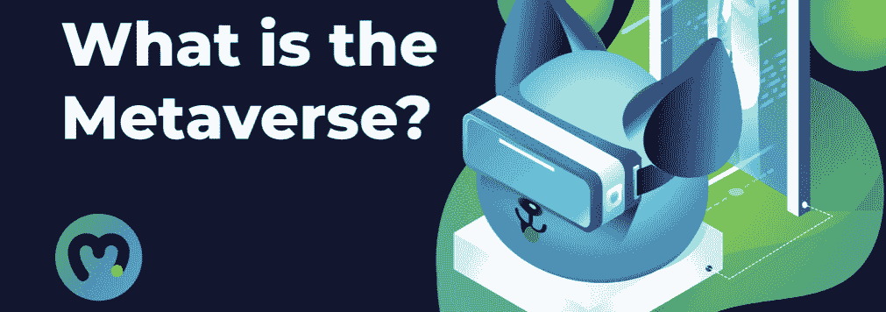
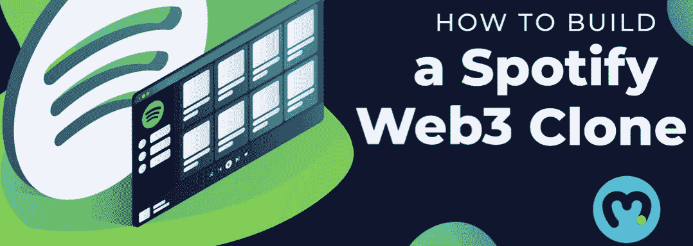
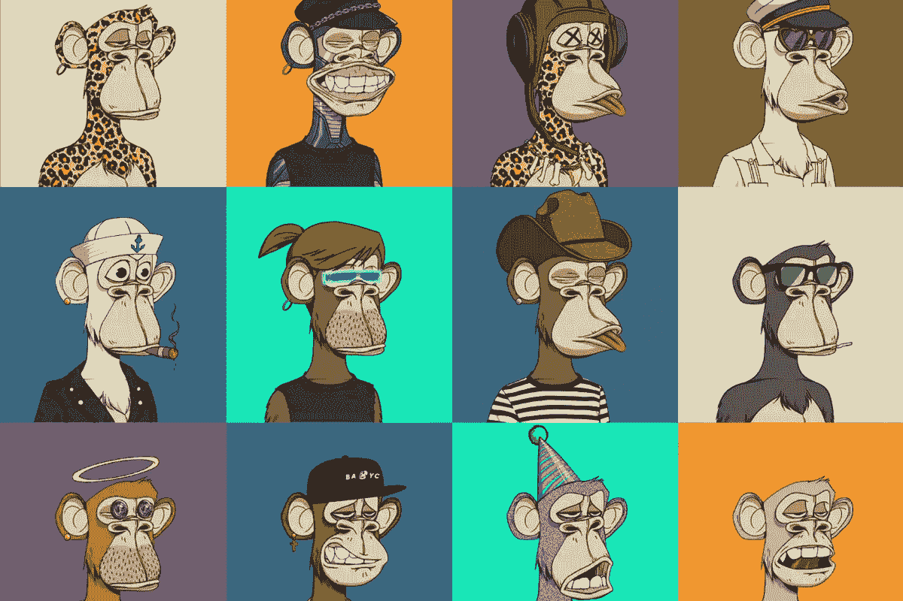
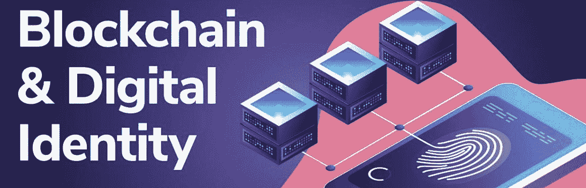

# NFT 公用事业公司——探索 2022 年的 NFT 用例

> 原文：<https://moralis.io/nft-utility-exploring-nft-use-cases-in-2022/>

即使你是第一次接触 [**Web3**](https://moralis.io/the-ultimate-guide-to-web3-what-is-web3/) **，你也很可能听说过 NFTs。NFT 是不可替代代币的缩写，它们和可替代代币是区块链行业的两种主要代币类型之一。“不可替代”一词源于传统经济学，指的是可互换的商品，这意味着非关税壁垒是独特的。此外，NFT 领域已迅速发展成为行业中最突出的领域之一，并从根本上改变了数字资产领域。对**[**NFT**](https://moralis.io/non-fungible-tokens-explained-what-are-nfts/)**的高度兴趣部分源于这些令牌的灵活特性，这意味着它们有各种各样的用例。因此，我们将在本文中安排时间来探索 2022 年的 NFT 用例。如果您对此感兴趣，请跟随我们深入了解 NFT 效用的概念！**

大多数人可能会将 NFTs 与数字艺术和收藏品联系在一起，如 Bored Ape 游艇俱乐部和 Crypto Punks 然而，NFT 远不止于此，还有更多有待发现。因此，我们将在本文中展示 2022 年五个有趣的 NFT 用例。希望这能激发你的创造力，在不久的将来开发你自己的 NFTs。

如果你对打造自己的 NFT 或 Web3 开发感兴趣，那你来对地方了。 [Moralis](https://moralis.io/) 是区块链开发最突出的操作系统，作为该系统的用户，你将能够[立即创建你自己的 NFT](https://moralis.io/how-to-create-your-own-nft-in-5-steps/) 。此外，通过学习[如何铸造 10，000 枚 NFT](https://moralis.io/how-to-mint-10000-nfts-full-walkthrough/)，你可以轻松创建自己的数字收藏品！

那么，希望[成为区块链的开发者](https://moralis.io/how-to-become-a-blockchain-developer/)？然后注册 Moralis，立即开始你的 Web3 开发工作！

## NFT 用例 2022

NFT 已经迅速成为密码行业最突出的特性之一，作为高度灵活的令牌，它们有大量的用例。因此，我们将在接下来的章节中探讨更多关于 NFT 实用程序的内容。然而，在本文中涵盖 NFTs 的所有方面将是一个挑战，因此，我们将重点关注以下五个 2022 年 NFT 用例:

1.  会员专属
2.  服装和可穿戴设备
3.  音乐 NFTs
4.  数字艺术
5.  数字身份

如果你更想看一段关于 NFT 公用事业这些方面的视频，可以去看看 Moralis YouTube 频道。下面的片段让您更深入地了解了如何在 2022 年利用 NFTs:

https://www.youtube.com/watch?v=u3thNOPCS1s

尽管如此，让我们继续深入了解 NFTs 如何代表各种不同组织、俱乐部和活动的专属会员资格！

## NFT 公用事业:会员排他性

2022 年，NFTs 的一个重要用例将是为 DAOs 等组织提供独占访问。DAO 是分散自治组织的缩写，它是特定区块链项目或协议的管理机构。因此，如果您持有提供 DAO 访问权限的 NFT，您将额外获得参与特定平台、项目或 dapp(分散式应用程序)治理的专有权利。如果你想了解更多关于这些组织的信息，请查看以下 Moralis 指南[如何创建 DAO](https://moralis.io/how-to-create-a-dao-in-10-minutes/) 。

此外，NFTs 可以进一步被用作一个指示或标志，表明某人是社区的一部分，赢得了一场竞争，或显示对特定品牌的忠诚。这里的一个例子是最近推出的[Moralis 项目](https://moralis.io/projects/)。在这里，你有可能通过与社区的其他成员一起建立每周项目来提升你的 [Web3 开发](https://moralis.io/how-to-build-decentralized-apps-dapps-quickly-and-easily/)技能。一旦你通过这个过程磨练了你的技能，你就可以获得 NFTs 形式的奖励来展示你在 Web3 开发方面的熟练程度。

最后，NFTs 还可以提供对某些事件的独占访问。这不仅适用于数字环境，也适用于物理事件和现实生活中发生的事情。一个很好的例子是飞鱼俱乐部，它是第一个会员唯一的餐饮俱乐部，以 NFT 的形式在网上购买独家使用权。因此，代币持有者将获得文化和社会体验。

Flyfish Club 是 NFTs 真实用例的早期例子，随着 NFTs 进一步走向主流和大规模采用，我们肯定会看到这类项目呈指数增长。

## NFT 公用事业:服装和可穿戴设备

可穿戴设备和服装构成了我们将探索的 2022 年非功能性技术的第二类用例。这个部门已经相当受欢迎，在过去的一年里受到了极大的关注。此外，这也是一个行业监视器，因为我们肯定会看到数字可穿戴设备在 2022 年进一步增长。

NFT 的可穿戴设备经常与视频游戏和元宇宙联系在一起。在这点上，NFT 可以表示化身可以在游戏或其他数字世界中穿着的物品或衣服。然而，这并不是故事的全部，因为在服装行业还有其他利用 NFT 的方法。

另一个例子是用于社交媒体的虚拟可穿戴设备。有一种围绕影响者使用虚拟物品来实现更可持续发展的呼声。他们不再为一张照片购买新的实体服装，而是使用 NFT 的可穿戴设备作为更环保的选择。这是一个令人兴奋的领域，可能会发展成更大的领域。

最后，NFT 的可穿戴设备不一定局限于数字环境，还可以影响更多传统品牌。一个很好的例子是 GAP，如果你持有某种类型的 NFT，你可以在店内认领物品。这可以追溯到专属会员的概念，作为 NFT 持有者，你可以获得某个品牌的独特商品。

## NFT 公用事业:音乐 NFTs

另一个可能从 NFTs 中受益的令人兴奋的行业是音乐行业。正如你所熟悉的，对于大型企业集团和唱片公司来说，这是一个非常有利可图的行业。然而，他们的盈利能力往往是以牺牲单个艺术家的利益为代价的，而且是通过不利的按流收费的商业模式实现的。

对艺术家个人来说，一种更有效、更有利的赚钱方式可能是音乐非功能性传播的形式。这意味着艺术家可以真正拥有自己的作品，包括商标、版权等。，并且该信息可以存储在令牌的元数据中。音乐 NFTs 也允许粉丝们团结起来，直接支持他们喜爱的艺术家。因此，这意味着 NFT 有可能消除不必要的中介，这对艺术家有利。

这是 2022 年 NFTs 的众多引人注目的用例之一，我们看到投资正涌入音乐 NFT 项目。因此，继续关注这一领域的发展以及 NFTs 如何给音乐产业带来革命性的变化是非常令人兴奋的。

此外，假设您对音乐 NFTs 有进一步的兴趣，并希望了解更多关于这些令牌的机会。在这种情况下，我们强烈建议你看看 Moralis 的这个指南，在那里你可以学习创建一个 [Web3 Spotify](https://moralis.io/how-to-build-a-web3-spotify-clone/) 的克隆版！

## NFT 用例 2022:数字艺术

正如我们在介绍中提到的，大多数人可能会将 NFTs 与数字艺术联系起来。这种联系不是没有根据的，因为这是一个已经受到传统媒体大量关注的用例。此外，NFT 已经被用来代表数字艺术有一段时间了，这意味着它是一个既定的领域。

NFT 不可替代的特性使其成为创造具有独特属性的独一无二的艺术品的理想选择。因此，这是艺术家向消费者保证一件艺术品与众不同的一种方式。这是可能的，由于区块链的不可变记录和这些令牌的可互换性质。

基于此，NFTs 允许艺术家个人以前所未有的方式将他们的作品货币化，这极大地革新了数字艺术空间。此外，可以在代码中加入一些条件，确保艺术家在每次出售 NFT 作品时都能获得分成，为数字艺术家提供新的创新想法，以保持他们的工作货币化。

此外，像 OpenSea 这样的平台也是对 NFTs 越来越关注的一个因素。OpenSea 是 NFT 的一个市场，在过去的一年里，它已经取得了指数级的增长。该网站为艺术家提供了一个易于使用的平台，使其更无缝地销售和购买 NFT。如果你对 OpenSea 感兴趣，你可以使用 Moralis 并学习在几分钟内[开发你自己的 NFT 市场](https://moralis.io/develop-your-own-nft-marketplace-step-by-step-guide/)！

然而，到目前为止，NFT 艺术主要关注数字资产的内在价值，这可能在 2022 年发生变化。在接下来的一年里，我们可能会看到开发人员试图将这项技术提升到一个新的水平，并提出新的创新想法。这里的一个例子是，NFTs 可能适用于代表传统艺术。此外，NFTs 还将使证明资产所有权成为可能，甚至是实物。

## NFT 公用事业:数字身份

我们要仔细研究的 2022 年 NFT 用例中的最后一个是数字身份。到目前为止，NFT 主要用于捕获和声明数字资产的所有权，如视频、艺术品、推文等。之前，我们还简要提到了代表实物资产的 NFT，这是我们未来最有可能看到增长的东西。然而，我们能使用同样的原理和技术来创建数字身份吗？

这听起来可能很牵强，但由于 NFTs 和区块链技术，这可能会成为现实。就像在区块链上存储数字音乐会门票是可能的一样，我们可以使用相同的原理，并将它们应用于数字身份。NFTs 的特性和区块链技术的安全性使它们成为创建虚拟身份的理想选择。事实上，NFTs 可能会启用自主权身份(SSIDs)。这些是个人控制的数字身份。因此，人们将不再依赖政府和其他中央集权机构。这将是一个令人兴奋的领域，绝对是 2022 年需要密切关注的 NFT 用例之一。

此外，拥有一个安全的身份是至关重要的，它们变得越来越难以保护，即使是在熟悉的数字和物理环境中。现在，把元宇宙扔进等式里，保持一个人的身份安全变得更加困难。这就是非功能性身份证明发挥作用的地方，因为它是建立元宇宙身份的一种有效而安全的方式。因此，随着世界数字化程度的提高和元宇宙的发展，NFTs 可能会发挥重要作用。

如果你对元宇宙有进一步的兴趣，看看[Moralis 元宇宙 SDK](https://moralis.io/metaverse/) 让你立刻创建元宇宙 [dapps](https://moralis.io/decentralized-applications-explained-what-are-dapps/) ！例如，你可以阅读如何[用 Moralis 建造一个中世纪的元宇宙游戏](https://moralis.io/how-to-build-a-medieval-metaverse-game/)。

## NFT 电力公司——探索 2022 年使用案例:摘要

NFT 已经迅速成为 Web3 开发中最突出的特性之一，用例的数量也在不断增加。你们中的许多人可能会把 NFT 和数字艺术联系在一起；然而，这只是 NFTs 有帮助的许多例子之一。事实上，在本文中，我们展示了 2022 年可能值得密切关注的五个独立的 NFT 用例:

1.  会员专属
2.  服装和可穿戴设备
3.  音乐 NFTs
4.  数字艺术
5.  数字身份

这只是五个例子，还有其他部门，如 DeFi(分散融资),可以积极采用 NFTs。因此，这表明了非正规金融服务的灵活性，这些代币有可能影响许多经济部门。

出于这个原因，学习更多关于加密令牌和如何铸造 NFT 的知识是你最感兴趣的。创建 NFT 的最佳工具是 Moralis，因为该操作系统使 Web3 开发变得更加容易。事实上，使用 Moralis，您可以将所有未来 Web3 项目的开发时间平均减少 87%，从而节省宝贵的资源。

这是可能的，因为所有 Moralis 的用户都可以访问已建立的后端基础设施。此外，有了像 Moralis 的 [NFT API](https://moralis.io/ultimate-nft-api-exploring-moralis-nft-api/) 以及更多的工具，你将能够轻松地创建区块链项目。

您也可以查看 [Moralis 博客](https://moralis.io/blog/)获取更多内容和优秀指南。例如，了解更多关于区块链发展的[最佳语言](https://moralis.io/best-languages-for-blockchain-development-full-tutorial/)，开始你的旅程！

因此，如果你有进入 Web3 开发领域的雄心，现在就可以自由地与 Moralis 签约！创建一个帐户是免费的，你可以立即开始开发。那么，你还在等什么？