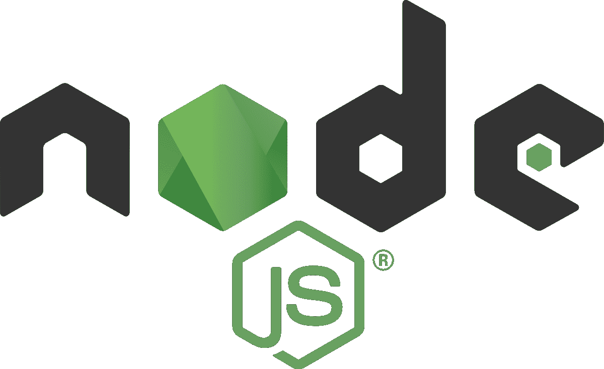
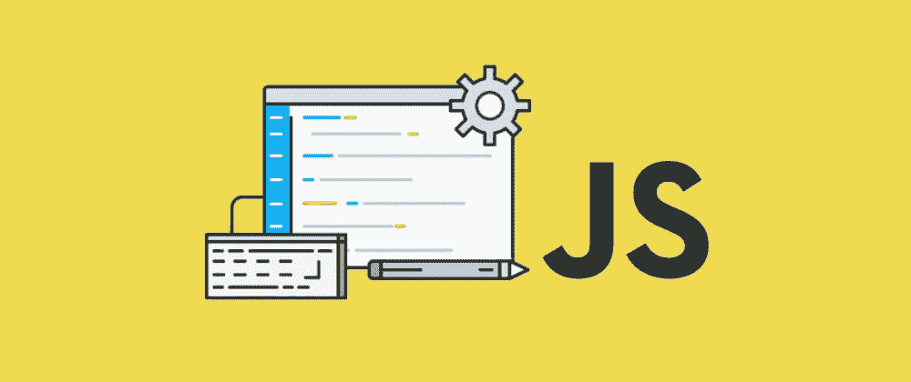
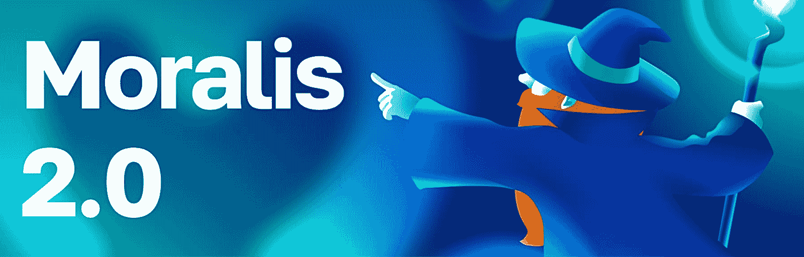
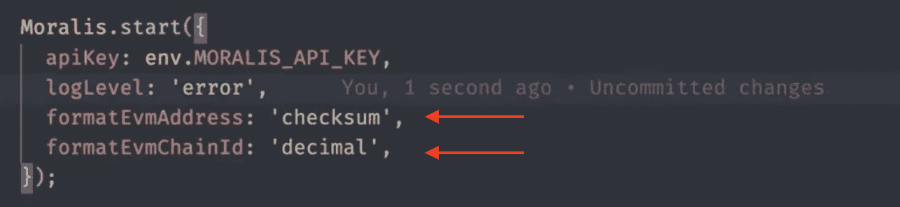
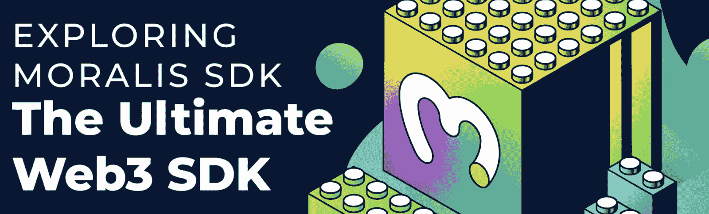

# NodeJS SDK for web 3–探索 Moralis 的 NodeJS SDK

> 原文：<https://moralis.io/nodejs-sdk-for-web3-exploring-moralis-nodejs-sdk/>

JavaScript (JS)是一个编程语言巨人。然而，由于它仅用于基于客户端的脚本编写，这可能会给开发人员带来麻烦，因为他们需要使用多种其他语言。这就是 NodeJS 的切入点。NodeJS 是一个运行时环境，它提供了在浏览器之外运行基于 JS 的程序所必需的一切。 **此外，在** [**Web3 开发**](https://moralis.io/how-to-build-decentralized-apps-dapps-quickly-and-easily/) **空间内，由于**[**Moralis’**](https://moralis.io/)**NodeJS SDK，您现在有机会以更容易理解的方式使用 NodeJS。这个 SDK 弥合了 Web2 和 Web3 之间的差距，允许您使用 Web2 的易用性创建强大的 dapps(分散式应用程序)。例如，它允许您用一段代码对 Web3 用户** **进行认证。在本文中，我们将更详细地探索这个用于 Web3 的 NodeJS SDK！**

然而，在我们深入研究 SDK 之前，我们将进一步了解什么是 NodeJS，以及为什么这种环境是有利的。这样，我们还将了解更多关于 NodeJS 的特性，以及为什么有人会选择使用这个开发工具。

更重要的是，Web3 的 NodeJS SDK 只是 Moralis 众多优秀特性中的一个。除了 SDK，Moralis 还使得 [Web3 syncs](https://moralis.io/syncs/) 和 [Web3 webhooks](https://moralis.io/web3-webhooks-the-ultimate-guide-to-blockchain-webhooks/) 的实现变得更加容易。此外，您可以了解更多关于 [Web3 认证](https://moralis.io/authentication/)，如何[从多边形区块链](https://moralis.io/how-to-pull-data-from-polygon-blockchain/)中提取数据或实现[区块链同步](https://moralis.io/blockchain-syncs-exploring-on-chain-syncing/)，所有这些在 Moralis 开发区块链 dapps 时有价值的特性。

如果你是一个 Web3 开发者，想提高效率，可以考虑注册 Moralis。您可以免费创建一个帐户，并立即获得平台的全部好处！

## 什么是 node.js

JS 是世界上最流行的编程语言之一。这种语言支持数百万个网站和网络应用程序。此外，JS 允许开发者和设计者容易地实现特性。如果你是编程新手，并且想学习 JS，请确保注册以下 Moralis Academy 课程:“[学习 JavaScript 编程](https://academy.moralis.io/courses/javascript-programming-for-blockchain-developers)”。



JS 最初发布于 1995 年，仅用于客户端脚本编写。然而，这迫使开发人员在构建完整的堆栈来连接前端和后端组件时使用多种语言和框架。因此，为了使 JS 开发更容易访问和管理，引入了 NodeJS。

NodeJS 是一个运行时环境，包括执行用 JS 编写的程序所需的一切。该环境是一个单线程、跨平台、开源的运行时环境，允许开发人员构建快速、可扩展的网络和服务器端应用程序。此外，NodeJS 使用 V8 JS 运行时引擎运行，并利用事件驱动的非阻塞 I/O(输入/输出)架构。这使得这个环境既高效又有效，最终表明 NodeJS 适合于实时应用程序。

此外，NodeJS 拥有最大的公共和私有软件包集合，存储在 NPM 注册中心，这里托管了许多开源软件，使其成为当今最大的开源生态系统之一。因此，这为软件开发人员提供了大量的开源工具，这些工具在其他语言生态系统中是无与伦比的，这使得人们可以轻松地开始 JavaScript 开发。

此外，NodeJS 非常适合区块链开发，这使得它成为开发 dapps 或其他 Web3 项目时的一个有吸引力的工具。因此，对 NodeJS 有了更好的理解后，我们可以继续深入了解为什么要在开发工作中使用 NodeJS。

### 为什么使用 node.js

如前一节所述，NodeJS 支持更高的可伸缩性，并允许开发人员创建高性能的 dapps。这在 Web3 开发领域是至关重要的，可伸缩性是一个不断增长的问题和挑战。因此，开发人员必须有合适的工具来解决这些问题。



但是，为了充分理解 NodeJS 的强大功能以及您在开发 dapps 时使用它的原因，我们将探索它的一些特性:

*   **事件驱动的非阻塞 I/O 架构**–NodeJS 的这种架构确保节点进程在检索单个响应时不会锁定整个网站或应用程序。因此，NodeJS 简单地移动到队列中的下一个事件，直到它为空。
*   **客户端和服务器端**–NodeJS 使 JS 开发更易于管理和访问，因为它同时运行 web 应用程序的客户端和服务器端。此外，NodeJS 允许 web 应用程序以双向实时连接的方式运行。这确保了服务器和客户端都能够自由地发起通信和交换数据。
*   **重用代码**–运行 JS 密集型应用的程序员可以从重用代码的潜力中获益。因此，您可以避免在搜索和编辑工具之间切换上下文的麻烦。NPM(节点包管理器)以代码重用而闻名，开发者在他们的开发工作中可以访问超过一百万个包。

现在，有了对 NodeJS 的更好理解以及为什么这个环境是有帮助的，我们可以更仔细地看看用于 Web3 开发的 Moralis NodeJS SDK！

## 用于 Web3 的 NodeJS SDK

接下来的章节深入探讨了 Moralis 的 NodeJS SDK 在 Web3 开发中的应用。SDK 使 Web3 开发变得更加容易，允许您轻松地创建 Web3 项目。因此，如果你想成为一名区块链开发者，请跟随我们探索 Moralis 的 NodeJS SDK 的复杂性！



Web3 的 NodeJS SDK 是实现 Moralis 2.0 的第一步，以使 Moralis 与任何后端兼容。这个 SDK 是以模块化的方式建立的，并且完全支持 typescript，使您可以使用它。

该套件包括许多功能，包括一个 [EVM](https://moralis.io/evm-explained-what-is-ethereum-virtual-machine/) (以太坊虚拟机)API、Solana API、Web3 认证等。但是，在本文中，我们将关注以下三个方面:

1.  **EVM 锁链**
2.  **EVM 演讲**
3.  **代币余额**

如果你喜欢看视频来学习和教育自己，一定要看看下面这个来自 [Moralis 的 YouTube](https://www.youtube.com/channel/UCgWS9Q3P5AxCWyQLT2kQhBw) 频道的视频。本教程很好地介绍了 Moralis 为 Web3 开发的新 NodeJS SDK，并提供了几个例子:

https://www.youtube.com/watch?v=RPK37-_ZJFE

尽管如此，我们将在本文中额外介绍相同的特性和用例。因此，请继续关注我们对 Web3 的 NodeJS SDK 的进一步探索！然而，在进一步了解这些特性之前，我们将快速介绍如何建立自己的项目。

### 设置 Moralis 的 SDK

我们将从向您展示如何设置您的应用程序来使用 Moralis NodeJS SDK 开始这个简短的指南。这是一个简单的过程，根据上面的视频，您只需要下面的代码片段来初始化 Web3 的 NodeJS SDK:

```js
Moralis.start({
    apiKey: env.MORALIS_API_KEY,
    logLevel: 'error',
    formatEvmAddress: 'checksum',
    formatEvmChainId: 'decimal',
});
```

这里我们真正要做的是调用“Moralis.start()”函数并提供一个 API 键。此外，您还可以看到其他选项，如“logLevel”、“formatEvmAddress”和“formatEvmChainId”。

在上面的代码片段中，“logLevel”被设置为“error”。但是，如果您希望进行调试，可以将其改为“verbose”。此外，附加选项用于格式化地址和链 id。

尽管如此，这就是设置您的项目。如果你想要更多关于如何开始一个新项目的详细信息，一定要查看官方的 Moralis 2.0 [文档](https://docs.moralis.io/)。例如，仔细看看“[你的第一个 Dapp](https://docs.moralis.io/docs/your-first-dapp) ”部分，学习如何使用 Web3 的 NodeJS SDK！

## 用于 Web3 的 NodeJS SDK–EVM 链

现在你知道了如何建立一个项目，我们将继续深入了解 SDK 的 2.0 版本以及它如何处理 EVM·区块链。最显著的区别是 NodeJS SDK 不将链作为小数或十六进制字符串处理。相反，Moralis 现在像处理称为“Moralis 数据类型”的独立类实例一样处理这些链。

您可以通过以下两个代码片段之一创建新的类实例:

```js
const chain = EvmChain.ETHEREUM; 
EvmChain.create(1);
```

一旦创建了类实例，就可以访问各种信息。例如，以下是您可以使用的命令列表:

```js
console.log('decimal', chain.decimal);
console.log('hex', chain.hex);
console.log('format', chain.format());
console.log('name', chain.name);
console.log('currency', chain.currency);
```

前两行将控制台记录该实例的十进制和十六进制值。而且，你还有“format()”函数。当启动 SDK 时，该函数将根据我们在前面部分中指定的先决条件格式化该信息:



这很重要，因为这个函数将在任何 EVM API 端点上被调用。因此，如果 EVM API 在一个数据响应中返回一个链，它将根据上面的规范进行格式化。此外，除了“format()”函数之外，还有一些实用方法来获取有关本机令牌的名称或数据。然而，这并不是 API 的全部。您还可以查看关于 [EVM API](https://docs.moralis.io/reference/evm-api-overview) 的 Moralis 2.0 文档，以了解关于该工具的更多信息！

此外，如果你想开发 EVM 兼容的 dapp，一定要查看 Moralis 的[以太坊 dapp API](https://moralis.io/what-is-an-ethereum-dapp-api-build-ethereum-dapps-easily/) 或[多边形 dapp API](https://moralis.io/polygon-dapp-api-how-to-efficiently-create-polygon-dapps/) 。这些工具可以让你轻松有效地创建以太坊 dapp 或构建多边形 dapp！

## 用于 Web3 的 NodeJS SDK–EVM 地址

接下来，我们将仔细研究 Web3 的 NodeJS SDK 如何处理 EVM 地址。这可能是它在项目中的样子:

```js
const address = EvmAddress.create(EVM_ADDRESS); 
console.log('lowercase', address.lowercase);
console.log('checksum, address.checksum);
console.log('format', address.format());
```

我们在这里做的第一件事是使用小写字符串创建一个地址。创建地址时，可以读取小写字符串、校验和、调用“format()”函数等。，在这种情况下，我们称之为控制台日志。因此，你有几个选择，当谈到 EVM 的地址。

提醒一下，您可以查看文档以获得更多关于这方面的信息！

## 用于 Web3 的 NodeJS SDK–EVM API

在本节中，我们将了解 EVM API 的工作原理，更具体地说，就是如何查询余额。与以前版本的 SDK 相比，我们现在将 API 称为“EvmApi”而不是“Web3Api”。此外，对于 Solana，我们现在也有“SolApi ”,这取决于您正在开发哪个网络。

为了说明这是如何工作的，我们举一个简单的例子，在这个例子中，我们在以太坊上查询一个特定地址的令牌余额。代码如下所示:

```js
const tokenResponse = await Moralis.EvmApi.account.getTokenBalances({
    chain: EvmChain.ETHEREUM,
    address: ETHEREUM_ADDRESS
})
console.log('Json result', tokenResponse.toJSON()[0]);
console.log('Direct api result', tokenResponse.raw[0]);
console.log('Data with dataTypes', tokenResponse.result[0]);
```

如您所见，我们调用了“getTokenBalances()”函数，其中指定了链和地址。以前的 SDK 和新版本之间的一个本质区别是，关于令牌余额的数据以三种不同的方式返回。

首先，它通过“toJSON()”函数返回，该函数将值作为原始数据类型返回，可以直接在应用程序中使用。因此，您不需要担心解析任何返回的数据。

其次，SDK 返回包含所有内部数据类型的结果。如果您在内部使用它，您可以访问 SDK 的所有实用功能。最后，Moralis 额外返回来自 API 的原始数据。然而，一些数据仍然被格式化以使其更加一致。

这个短指南就到此为止！希望你能更好地理解 Moralis 的 web 3 NodeJS SDK 及其功能。现在由您在创建 dapps 时使用这些信息，因为 Moralis 与大多数后端兼容。

## Moralis 的 NodeJS SDK for web 3–摘要

在本文中，我们花时间探索了 NodeJS 的复杂性，以及为什么这个环境是有用的。我们更深入地研究了 NodeJS 的特性，深入了解了它对 JS 开发人员的好处。NodeJS 的架构使它非常适合更有效地创建 web 应用程序，并且它适合可伸缩性。这两个特性提供了一个优势，不仅在传统开发中如此，在 Web3 行业中也是如此。



接下来，我们仔细研究了 Web3 的 Moralis NodeJS SDK。为此，我们决定更深入地研究这个开发工具包的 2.0 版本。为了说明 SDK 是如何偏离先前版本的，我们仔细研究了该工具在以下三个方面的工作原理:

1.  EVM 链
2.  EVM 地址
3.  代币余额

然而，这些只是 SDK 派上用场的一些例子。例如，如果你想进入[索拉纳编程](https://moralis.io/solana-programming-the-ultimate-guide-to-solana-development/)，你可以查看[索拉纳 API](https://docs.moralis.io/reference/solana-api) 。这个 API 允许你为索拉纳区块链创建复杂的 dapps。如果你对此感兴趣，看看我们的指南[如何用三个步骤](https://moralis.io/how-to-build-a-solana-dapp-in-3-steps/)打造一个索拉纳 dapp！

此外，如果你是一个 Web3 爱好者，请访问 [Moralis 博客](https://moralis.io/blog/)，阅读最新的 Web3 开发内容。如果这听起来令人兴奋，我们建议仔细看看我们的文章，深入研究不同类型的[Dao](https://moralis.io/full-2022-guide-to-different-types-of-daos/)、[链上数据](https://moralis.io/on-chain-data-the-ultimate-guide-to-understanding-and-accessing-on-chain-data/)，或者如何[构建 Web3](https://moralis.io/how-to-build-on-web3-in-minutes/) 。

所以，如果你对 Web3 开发更感兴趣，并且想开发 dapps，[现在就注册 Moralis](https://admin.moralis.io/login) ！创建一个帐户是免费的，只需要几秒钟。