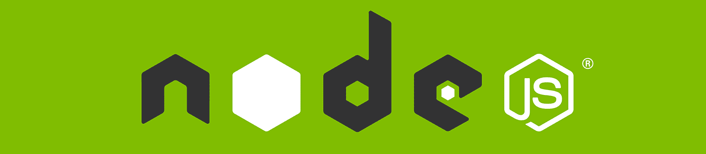
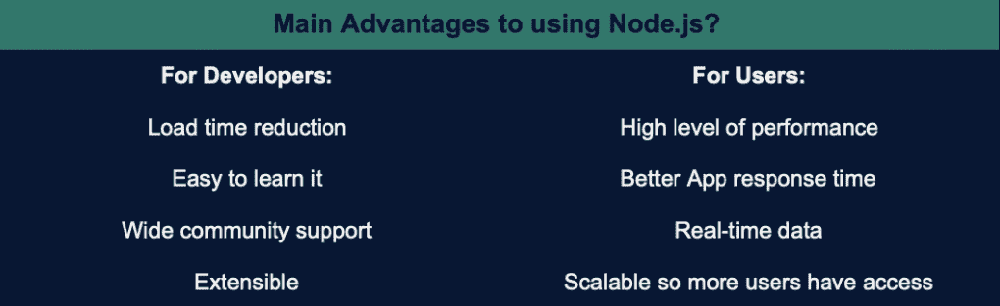
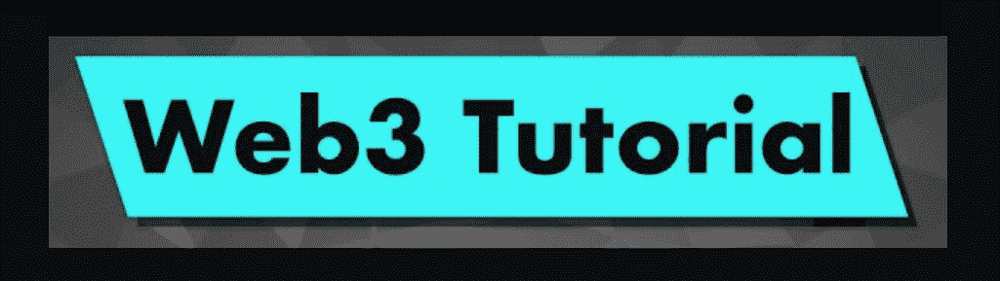
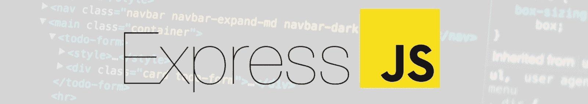
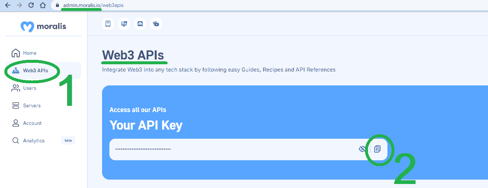
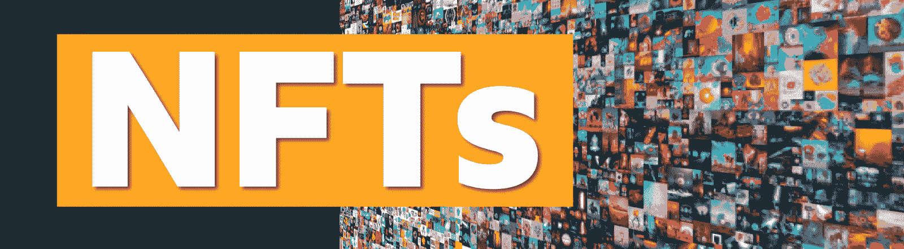
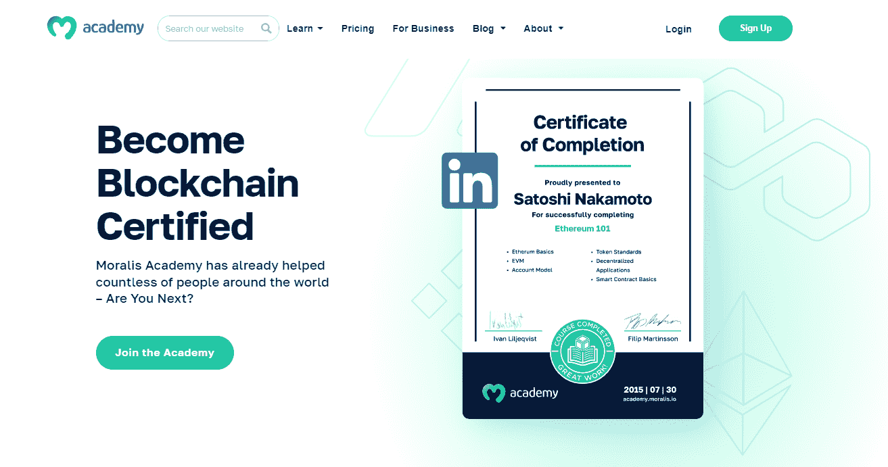

# NodeJS Web3 教程–使用 NodeJS Web3 示例创建 Dapps

> 原文：<https://moralis.io/nodejs-web3-tutorial-create-dapps-using-a-nodejs-web3-example/>

您是否希望创建一个分散的应用程序，但却被 Web3 技术堆淹没？如果是这样，这个 NodeJS Web3 教程可以帮助你开始，因为它提供了构建 dapps **的最简单方法** [**。此外，在本文中，您有机会跟随我们学习一个 NodeJS Web3 示例，该示例将教会您基础知识，您将探索基本工具以及如何使用它们。因此，您将知道如何获取链上数据，由于 Moralis 的企业级 Web3 APIs，这将毫不费力。此外，我们决定使本教程尽可能对初学者友好。因此，通过简单地复制我们的代码，您将能够完成今天的 NodeJS Web3 示例。**](https://moralis.io/the-easiest-way-to-build-dapps-3-step-tutorial-for-devs/)

此外，我们将向您展示如何获取您的 Moralis Web3 API 密钥。后者将让你接触到最终的 web 3 API——你开发 dapps(去中心化应用)的门户。有了 Moralis 的力量在你身边，你可以不费吹灰之力地用 NodeJS 为 Web3 做贡献。

此外，由于 Moralis 完全是关于跨链互操作性的，所以您将使用今天的 NodeJS Web3 教程来解决各种区块链。因此，你可以坚持领先的可编程链，以太坊，或专注于其他著名的 EVM 兼容链。无论哪种情况，你都必须首先[创建你的免费 Moralis 账户](https://admin.moralis.io/register)。然而，在深入我们的主题之前，让我们确保你们都知道基础知识。

[**Join Moralis Magazine Now**](https://moralis.io/joindiscord/) 

## 什么是 node.js

NodeJS，也叫 Node.js，是一个编程平台或环境。它于 2009 年推出，主要目的是帮助开发人员管理 JavaScript (JS)的一些复杂性。此外，带有 NodeJS 的 Web3 扩展了 dapp 开发的可能性。此外，NodeJS 是基于 Chrome 的 JavaScript 运行时构建的，这使得开发人员更容易构建可扩展的高性能应用程序。最后，以下是 NodeJS 的核心特征:

*   **事件驱动的非阻塞 I/O 模型—**NodeJS 利用事件驱动的非区块链 I/O 模型。这可以防止节点流程在检索单个响应时锁定整个 web 应用程序。相反，它只是不断地运行，并移动到下一个事件，直到事件队列为空。此外，NodeJS 使用独特的事件模型。除了库之外，这个模型还使用事件循环作为运行时构造函数。该事件模型可以在没有“阻塞调用”的情况下启动事件循环。由于这些特性，NodeJS 是轻量级的、高效的，并且适合于跨分散网络的实时应用。

*   **客户端和服务器端—**NodeJS 能够在客户端(前端)和服务器端(后端)运行。因此，它增强了 JavaScript 的使用。由于 web 应用程序的这些实时双向连接，服务器和客户端都可以发起通信并自由交换数据。

*   **重用代码–**NodeJS 使开发人员能够重用代码。这就是 NodeJS 包装经理(NPM)出场的地方。此外，开发人员可以用超过一百万个包来完成他们的编程任务。此外，运行大量 JavaScript 应用程序的开发人员特别受益于代码重用。这样，他们就避免了在编辑和搜索工具之间切换上下文的额外负担。



尽管如此，在处理公共区块链时，对实时数据交换和通信的适当支持是必不可少的，这正是 NodeJS 所支持的。



### 为什么要使用来自 Moralis 的 NodeJS Web3 示例？

上图展示了 NodeJS 对于开发者和用户的主要优势。这些关键的好处是引人注目的，因为它们解决了创建 web 应用程序的一些重要方面。这些优点中的大部分来自上一节中介绍的核心 NodeJS 特性。因此，在探索 NodeJS 时，学习如何以简单的方式使用 NodeJS 绝对是值得的。这就是 Moralis NodeJS Web3 教程的切入点。在今天的例子中，您将学习使用 NodeJS 深入 Web3，并了解 Moralis 及其强大的 API。因此，您将能够使用这个 API 提供者提供的工具将您的 Web3 开发游戏带到下一个级别。

话虽如此，请务必卷起袖子，跟随我们的领导。



## 使用 node.js 为 web3 创建 dapp–node . js web 3 教程

如果你决定跟随我们学习今天的 NodeJS Web3 教程，你将学会完成以下五个步骤:

1.  创建 NodeJS 应用程序
2.  导入并设置最新的 Moralis JS SDK
3.  设置一个简单的快速服务器
4.  将您的应用与 Moralis 服务相集成
5.  获取区块链数据

正如您所看到的，有相当多的内容需要讨论。因此，让我们开始第一步。但是在继续之前，请确保已经安装并设置了 Visual Studio 代码，安装了 NodeJS，并且准备好了免费的 Moralis 帐户。这也是今天探索的三个先决条件。接下来，启动您的 VSC 终端，跟随我们的脚步:


### 创建 NodeJS 应用程序

我们将首先创建一个新文件夹，并在 Visual Studio 代码(VSC)中打开它。我们将把我们的文件夹命名为“Simple-NodeJS”。然后，我们使用我们的终端并输入" *npm init* "命令。接下来，我们命名我们的项目，并通过按几次 enter 键来坚持默认选项。通过这样做，我们得到了一个新的“package.json”文件，其中包含以下代码行:

```js
{
  "name": "simple-nodejs-demo",
  "version": "1.0.0",
  "description": "",
  "main": "index.js",
  "scripts": {
    "test": "echo \"Error: no test specified\" && exit 1"
  },
  "author": "",
  "license": "ISC"
}
```

### 导入并设置最新的 Moralis JS SDK

在导入和设置最新的 Moralis JS SDK 时，我们只需要执行一个命令。本质上，我们只需要安装" *moralis* "依赖项。然而，我们可以使用一个命令来安装“ *express* 依赖项。因此，我们在终端中输入“ *npm install moralis express* ”命令。

```js
npm install moralis express
```



### 设置一个简单的快速服务器

通过输入上面的命令，我们已经安装了" *express* "依赖项。因此，我们可以继续设置一个简单的 Express 服务器。创建“index.js”文件，并使用以下代码行:

```js
const express = require('express')
const app = express()
const port = 3000
app.get('/', (req, res) => {
  res.send('Hello World!')
})
app.listen(port, () => {
  console.log(`Example app listening on port ${port}`)
})
```

我们还必须重新访问“package.json”文件，并添加“ *start* ”脚本:

```js
"scripts": {
  "start": "node index.js"
},
```

现在我们的“index.js”文件已经准备好了，我们已经设置了“ *start* 脚本，我们可以运行我们的 Express 服务器了。同样，一个简单的命令——“*NPM run start*”就是我们所需要的。然后，我们可以使用我们最喜欢的浏览器访问“*http://localhost:3000”*,并确保它显示“Hello World！“问候。


### 将您的应用与 Moralis 服务相集成

随着 NodeJS Web3 教程的前三个步骤的完成，是时候将我们的应用程序与 Moralis 服务集成在一起了。为了完成这一步，我们将使用上面创建的“index.js”文件。这是我们粘贴 Moralis Web3 API 密钥的地方。但是，我们必须首先导入 Moralis 和" *EvmChain* "数据类型:

```js
// Import Moralis
const Moralis = require('moralis').default
// Import the EvmChain dataType
const { EvmChain } = require("@moralisweb3/evm-utils")
Then, we add the "MORALIS_API_KEY", "address", and "chain" variables:
// Add a variable for the API key, address, and chain
const MORALIS_API_KEY = "replace_me"
const address = "replace_me"
const chain = EvmChain.ETHEREUM
```

正如您在上面看到的，我们需要用实际的 API 键替换“替换我”占位符。我们一会儿将做那件事，但是让我们也指出我们决定集中于以太坊链。然而，我们可以很容易地把重点放在任何其他 EVM 兼容链 Moralis 支持:

*   以太坊测试网:
    *   罗普斯滕
    *   RINKEBY
    *   格里
    *   很难吗
    *   塞波利亚
*   多边形
*   孟买
*   理科学士
*   BSC_TESTNET
*   雪崩
*   富士山
*   幽灵
*   克罗诺司牌手表
*   CRONOS_TESTNET

在我们获得 Moralis Web3 API 密钥之前，我们还需要用以下代码行初始化 Moralis:

```js
const startServer = async () => {
  await Moralis.start({
    apiKey: MORALIS_API_KEY,
  })
```

#### Moralis Web3 API 密钥-如何获取？

要获取 Moralis Web3 API 密钥，请登录您的 Moralis 帐户。一旦进入我们的管理区域，你必须进入“Web3 APIs”页面。在那里，使用复制图标复制 API 密钥。基本上，获取您的 Moralis Web3 API 密钥是一个简单的两步过程:



当然，我们必须返回到我们的“index.js”文件，并将上面复制的键粘贴到变量“ *apiKey* 的旁边。最终，这是我们到目前为止的“index.js”文件的内容:

```js
const express = require('express')

// Import Moralis
const Moralis = require('moralis').default

// Import the EvmChain dataType

const { EvmChain } = require("@moralisweb3/evm-utils")
const app = express()
const port = 3000

// Add a variable for the api key, address and chain

const MORALIS_API_KEY = "replace_me"
const address = "replace_me"
const chain = EvmChain.ETHEREUM
app.get('/', (req, res) => {
  res.send('Hello World!')
})

// Add this a startServer function that initializes Moralis

const startServer = async () => {
  await Moralis.start({
    apiKey: MORALIS_API_KEY,
  })
  app.listen(port, () => {
    console.log(`Example app listening on port ${port}`)
  })
}

// Call startServer()

startServer()
```

### 获取区块链数据–web 3 和 NodeJS 示例

现在我们已经完成了上面的四个步骤，是时候用 NodeJS 探索 Web3 了。这是今天 NodeJS Web3 教程的一部分，在这里你将学习如何获取原生平衡、ERC-20 平衡和 NFTs。幸运的是，Moralis API 为这些区块链信息提供了强大而实用的端点。所以，让我们看三个获取链上数据的强大例子。


#### 获取本地余额

在获取本机余额时，在我们的例子中是以太坊余额，我们可以使用 Moralis 的" *getNativeBalance* "端点。为了在我们的“index.js”文件中使用这个端点，我们将创建“ *getDemoData* 函数:

```js
async function getDemoData() {
  // Get native balance
  const nativeBalance = await Moralis.EvmApi.balance.getNativeBalance({
    address,
    chain,
  })
  // Format the native balance formatted in ether via the .ether getter
  const native = nativeBalance.result.balance.ether
  return { native }
}
```

看上面几行代码，也可以看出我们用的是“*”。乙醚*”以正确的格式显示本机余额。

*注意:您可以在* [*Moralis 文档*](https://docs.moralis.io/reference/evm-api-overview) *中探索 Moralis 的整个 EVM API 端点数组。*

此外，为了让我们的 dapp 正确地返回上述" *getDemoData* "函数的结果，我们还必须添加" */crypto-data* "端点:

```js
app.get("/demo", async (req, res) => {
  try {
    // Get and return the crypto data
    const data = await getDemoData()
    res.status(200)
    res.json(data)
  } catch (error) {
    // Handle errors
    console.error(error)
    res.status(500)
    res.json({ error: error.message })
  }
})
```

本质上，上面的代码行使我们能够使用“*http://localhost:3000/demo*”地址调用“ */crypto-data* ”端点。此调用以下列格式返回本机余额:

```js
{
    "native": "0.169421625822962794"
}
```


#### 获取 ERC-20 天平

当谈到获取 ERC-20 余额时，事情遵循原生余额的领导。因此，我们需要完成与上面类似的步骤。但是，这一次我们重点使用来自“*令牌*API 组的“ *getWalletTokenBalances* ”端点:

```js
    // Get token balances
  const tokenBalances = await Moralis.EvmApi.token.getWalletTokenBalances({
    address,
    chain,
  })
  // Format the balances to a readable output with the .display() method
  const tokens = tokenBalances.result.map((token) => token.display())
  // Add tokens to the output
  return { native, tokens }
}
```

查看上面的代码行，您可以看到我们再次确保余额正确显示。我们还在我们的“*返回*参数中添加了“*令牌*”。



#### 获取 NFT

最后，我们将完成 NodeJS Web3 示例的最后一个阶段——获取 NFT。为了成功做到这一点，我们将再次实现与本机和 ERC-20 天平类似的代码行。这一次，我们将使用来自“*NFT*API 组的“ *getWalletNFTs* ”端点。此外，我们将着重于获取给定地址的前十个 NFT。当然，我们将用我们的“ *getDemoData* ”函数来实现这一点。此外，我们还需要适当地格式化输出。尽管如此，我们不能忘记在“ *return* ”中添加“ *nfts* ”:

```js
  // Get the nfts
  const nftsBalances = await Moralis.EvmApi.nft.getWalletNFTs({
    address,
    chain,
    limit: 10,
  })
  // Format the output to return name, amount and metadata
  const nfts = nftsBalances.result.map((nft) => ({
    name: nft.result.name,
    amount: nft.result.amount,
    metadata: nft.result.metadata,
  }))
  // Add nfts to the output
  return { native, tokens, nfts }
}
```

### NodeJS Web3 教程——“index . js”示例文件

至此，我们已经成功地在 NodeJS dapp 中实现了本地余额、ERC-20 余额和 NFTs 的成功提取。因此，我们已经完成了 NodeJS Web3 教程。然而，为了进一步帮助您，并帮助您避免在将上面几行代码放在一起时出现任何错误，您可以在下面找到完整的代码。简单地复制并粘贴到 VSC。另外，记得用变量“ *MORALIS_API_KEY* 替换变量“ *replace_me* ”。尽管如此，如果你想探索其他区块链，用上面“将你的应用程序与 Moralis 服务集成”一节中列出的其他受支持的链之一替换“以太坊”。

下面是“index.js”文件的完整代码:

```js
const express = require("express")
const Moralis = require("moralis").default
const { EvmChain } = require("@moralisweb3/evm-utils")

const app = express()
const port = 3000

const MORALIS_API_KEY = "replace_me"
const address = "0x9e8f0f8f8f8f8f8f8f8f8f8f8f8f8f8f8f8f8f8f"
const chain = EvmChain.ETHEREUM

async function getDemoData() {
  // Get native balance
  const nativeBalance = await Moralis.EvmApi.balance.getNativeBalance({
    address,
    chain,
  })

  // Format the native balance formatted in ether via the .ether getter
  const native = nativeBalance.result.balance.ether

  // Get token balances
  const tokenBalances = await Moralis.EvmApi.token.getWalletTokenBalances({
    address,
    chain,
  })

  // Format the balances to a readable output with the .display() method
  const tokens = tokenBalances.result.map((token) => token.display())

  // Get the nfts
  const nftsBalances = await Moralis.EvmApi.nft.getWalletNFTs({
    address,
    chain,
    limit: 10,
  })

  // Format the output to return name, amount and metadata
  const nfts = nftsBalances.result.map((nft) => ({
    name: nft.result.name,
    amount: nft.result.amount,
    metadata: nft.result.metadata,
  }))

  return { native, tokens, nfts }
}

app.get("/demo", async (req, res) => {
  try {

    // Get and return the crypto data
    const data = await getDemoData()
    res.status(200)
    res.json(data)
  } catch (error) {
    // Handle errors
    console.error(error)
    res.status(500)
    res.json({ error: error.message })
  }
})

const startServer = async () => {
  await Moralis.start({
    apiKey: MORALIS_API_KEY,
  })

  app.listen(port, () => {
    console.log(`Example app listening on port ${port}`)
  })
}

startServer()

```

## NodeJS Web3 教程–使用 NodeJS Web3 示例创建 dapp–摘要

今天的指南是关于使用 NodeJS 进行 Web3 开发的。因此，您有机会遵循我们的 NodeJS Web3 教程并创建自己的后端 dapp。您还了解了如何设置 Moralis 的 Web3 功能，以及如何调用 Web3 API 来获取各种链上数据。因此，您现在已经准备好进一步发展您的 dapp。例如，你可以将上面的后端链接到 React 或 NextJS 应用程序。另一方面，你可以通过简单地使用我们的终极 [Web3 网站模板](https://moralis.io/web3-template-build-a-dapp-using-a-web3-website-template/)走一条更快的路。

我们鼓励你通过参加在 Moralis 文档、 [Moralis YouTube 频道](https://www.youtube.com/c/MoralisWeb3)和 [Moralis 博客](https://moralis.io/blog/)中等待你的教程来提高你的 Web3 开发技能。这些途径可以帮助你免费成为区块链开发者。例如，一些最新的主题向您展示了如何[将 dapp 连接到 Cronos](https://moralis.io/cronos-development-connect-dapps-to-cronos/) ，[构建 BNB 链 dapp](https://moralis.io/bnb-chain-boilerplate-how-to-build-bnb-chain-dapps/)，设置并[将 dapp 连接到以太坊网络](https://moralis.io/set-up-and-connect-a-dapp-to-the-ethereum-network/)，[将 dapp 连接到 Polygon](https://moralis.io/tutorial-how-to-connect-a-dapp-to-polygon-network/) ，[克隆 Zapper](https://moralis.io/how-to-clone-zapper-in-less-than-1-hour/) ，[如何集成基于区块链的认证](https://moralis.io/blockchain-based-authentication-how-to-integrate/)，[设置自托管解析服务器](https://moralis.io/how-to-set-up-a-self-hosted-parse-server/)，等等。

你可能还想在 Moralis 学院探索专业的区块链发展课程。例如，你可以注册一门课程，教你如何使用 JavaScript 构建一个[DEX(去中心化交换)。尽管如此，通过完成 Moralis 学院的课程，你成为区块链认证。反过来，你也大大增加了获得梦想工作的机会。今天就报名参加 Moralis 学院，向改变人生的职业迈出第一步！](https://academy.moralis.io/courses/javascript-programming-for-blockchain-developers)

