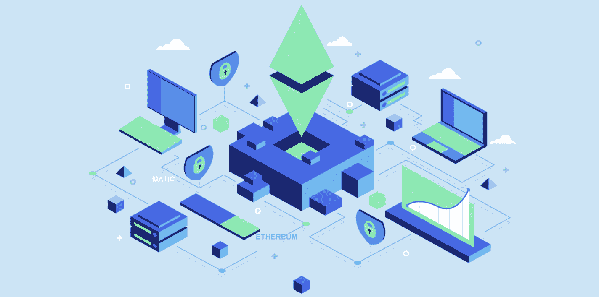
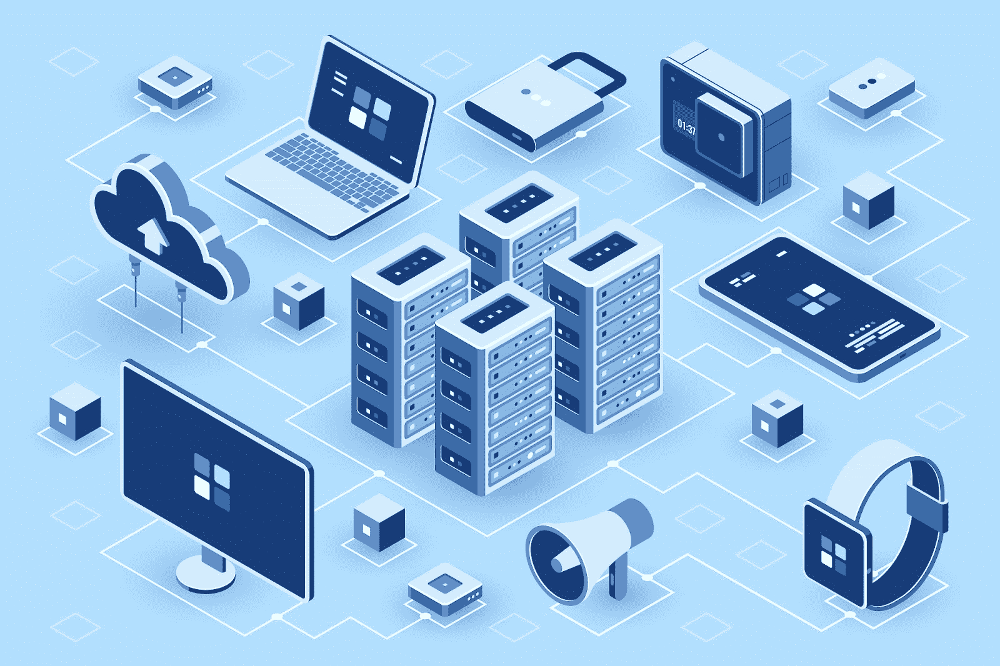
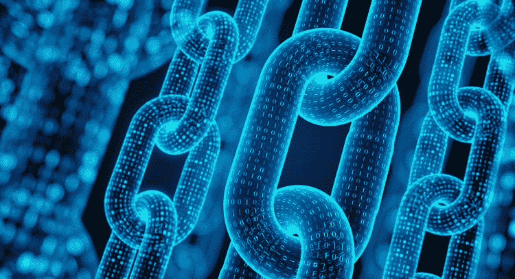

# 链上数据——理解和访问链上数据的终极指南

> 原文：<https://moralis.io/on-chain-data-the-ultimate-guide-to-understanding-and-accessing-on-chain-data/>

如果你熟悉 Web3 开发，你会知道开发者在区块链网络上构建 dapps(去中心化应用)、 [DeFi](https://moralis.io/what-is-defi-the-full-decentralized-finance-guide/) 平台和其他 Web3 项目，如[以太坊](https://moralis.io/full-guide-what-is-ethereum/)。区块链本质上是包含网络交易历史的完整记录的数字公共分类账。这里的关键词是“公共”，反映了这项技术的透明性。而且，这种开放性为 [**Web3**](https://moralis.io/the-ultimate-guide-to-web3-what-is-web3/) **开发者提供了访问“链上数据”的机会。不管你想创建什么项目，访问链上数据是很重要的。因此，我们将通过这篇文章深入探究链上数据的复杂性，以及如何通过**[**Moralis**](https://moralis.io/)**轻松获取这些信息。**

收集和逻辑结构化链上数据通常是一项复杂的任务，需要大量的时间。正因如此，开发者可以通过使用 Moralis 等平台来节省资源。Moralis 是 [Web3 开发](https://moralis.io/how-to-build-decentralized-apps-dapps-quickly-and-easily/)最重要的操作系统。此外，除了底层后端基础设施，Moralis 还提供了出色的开发工具，包括各种 API。

Moralis 的 [Web3 API](https://docs.moralis.io/moralis-dapp/web3-api) 、 [NFT API](https://moralis.io/nft-api/) 、 [Web3 身份验证](https://moralis.io/authentication/)解决方案等让您可以轻松访问链上数据，这意味着您可以避免自己设置基础设施来完成这些工作的麻烦。相反，你可以专注于开发过程中其他更重要的部分，为你的潜在客户创造最好的 UX(用户体验)!

如果你想了解更多关于 Moralis 的信息，请随意浏览 Moralis 博客并浏览更多文章。例如，如果你是这个行业的新手，可以看看我们关于[如何在 Web3](https://moralis.io/how-to-build-on-web3-in-minutes/) 上构建的指南，该指南深入探讨了面向初学者的区块链开发的复杂性！此外，如果你有雄心加快你的 Web3 开发游戏，考虑与 Moralis 签约。此外，创建一个帐户是完全免费的，只需要几秒钟！

### 什么是区块链？

在深入探究链上数据的复杂性之前，简单回顾一下什么是区块链是一个很好的起点。另外，很高兴看到它是如何工作的。因此，在我们进入本文的中心部分之前，让我们试着回答“什么是区块链？”问题。

早在 90 年代就首次提出了区块链的概念。然而，随着比特币在 2009 年的推出，这项技术获得了发展。简而言之，区块链是一种分散的数字分类账，记录、同步和公开共享交易数据。此外，每个区块链网络都有称为节点的独立设备或计算机，用于跟踪和记录特定数字分类帐中的数据。这些节点充当系统验证者，确保网络安全。经验证的数据存储和组织在链接在一起的块中，以创建一个块链，因此得名。所有数据块及其包含的数据通常都是公开的，分布在区块链网络的各个节点上。

与更传统的数据库相比，这些数字和分布式分类帐有许多好处。首先，区块链的分散性质消除了第三方监督的需要。区块链也很安全，这意味着黑客很难甚至不可能访问它们。最后，区块链是完全不可变的，这表明没有人可以篡改记录。因此，没有单个用户可以更改数据，这为网络用户增加了另一个安全级别。

如果你想了解更多关于区块链技术和 Web3 开发的信息，请随时查看[Moralis 学院](https://academy.moralis.io/)。如果你是加密领域的新手，请仔细看看“[区块链&比特币 101](https://academy.moralis.io/courses/blockchain-bitcoin-101) 课程，它涵盖了区块链技术和 Web3 开发的基础知识！

## 什么是链上数据？

链上数据实质上指的是关于在特定区块链网络上发生的交易的所有公开可用的信息。换句话说，它是构成一个完整区块链的所有块的数据。随着这些网络的透明，这些信息对公众是可用的，任何人都可以在需要时查询链上的数据。

每当交易被确认时，交易数据被记录在数字分类账中，并且永远不能被更改。因此，公开可用的信息是安全和准确的，这使得数据在开发 dapps 和其他 Web3 项目时很有价值。不同的数据类型通常是可用的，包括钱包地址、块时间戳、矿工费用、转账金额、智能合同代码等等。

另一方面，我们有链外交易，它可以以多种不同的方式发生。然而，最明显的例子是涉及交换私人钥匙的解决办法。验证器不需要像这样确认交易，因为交换发生在另一个设置中。因此，这些交易不会记录在区块链上，因此不会生成链上数据。在下一节中，我们将进一步研究链外数据。

总而言之，链上数据本质上是区块链网络上关于交易、区块和智能合约的公开可用信息。因为网络促进了这些交易，所以所有交易的不可变记录存在。

更何况除了链上数据还有链外数据(或者说传统数据)。所以，为了让链上数据的概念更容易理解，我们将在接下来的章节中深入探讨链上数据和链下数据的区别。

## 链上与链外数据

为了充分理解链上数据，比较链下数据是非常有益的。简单地说，外链数据是记录在区块链网络上的信息*而不是*。因此，这些更传统的数据保存在传统的数据库和服务器中。

传统数据库基于所谓的“客户机-服务器体系结构”。在这种传统系统中，用户或客户端可以修改集中存储在服务器中的数据。对这些数据库的控制仍然掌握在指定的机构手中，该机构在向客户提供访问权之前对其进行验证和确认。然而，管理数据库的机构是易受攻击的，如果受到危害，数据可能被更改甚至删除。

区块链网络的分散特性确保了数据的完全透明和安全。因此，一旦数据块形成，就不可能更改数据，这提供了记录的不变性。此外，与链上数据不同，链外数据缺乏透明度。一般来说，这意味着你不能访问这些信息，因为它是保密的，而不是公开的。

另一方面是区块链和链上数据。如前一节所述，区块链是由几个分散节点组成的公共数字总账。所有这些节点都参与管理数据库和链上数据。本质上，每个节点都可以向数据库输入新数据；然而，对于要进行的添加，大多数节点通常需要达成共识。因此，这是使区块链网络安全的共识机制。

### 为什么要使用链上数据？

例如，无论你是希望[建立一个 NFT 市场](https://nftcoders.com/how-to-build-an-nft-marketplace-in-5-steps/)还是 [Web3 钱包](https://moralis.io/what-is-a-web3-wallet-web3-wallets-explained/)，访问实时链上数据都是有益的。事实上，链上数据对 Web3 中的所有项目都是有益的。如果我们以 NFT 市场为例，您需要查询关于用户的 [NFTs](https://moralis.io/non-fungible-tokens-explained-what-are-nfts/) 的信息，以确定他们持有什么资产。Web3 钱包也是如此，需要显示用户的令牌余额。然而，这只是链上数据派上用场的两个例子。

无论你想创建什么类型的 Web3 项目，你都会很快发现对链上信息的需求。此外，随着链上数据不断变化，您还希望快速、实时地获得这些信息。

然而，从传统的角度来看，访问链上数据非常麻烦。数据一直是可用的；然而，逻辑地组织和收集信息是一个问题。它通常需要访问节点，甚至运行您自己的 [RPC 节点](https://moralis.io/ethereum-rpc-nodes-what-they-are-and-why-you-shouldnt-use-them/)，这是非常麻烦和耗时的。如果感兴趣，你可以在 Moralis 阅读更多关于 RPC 节点的[限制。](https://moralis.io/exploring-the-limitations-of-rpc-nodes-and-the-solution-to-them/)

由于围绕一个节点构建一个基础设施既费时又耗资源，开发人员转向了节点提供商。因此，在设置和运行自己的节点时，他们能够避免重新发明轮子。此外，开发人员还需要一种快速、便捷的方式来从区块链网络公司查询这些信息，这正是 Moralis 涉足的领域。

借助 Moralis 操作系统，您可以快速轻松地获取相关的最新链上数据。因此，我们将在接下来的章节中更深入地探讨 Moralis，以及作为一名开发人员，您如何使用该平台来获取链上信息！

### 利用 Moralis 轻松获取链上数据

在开发过程中，访问链上数据的最简单快捷的方法是利用 Moralis 操作系统。在该平台提供的工具中，您会发现 API 和 Moralis SDK，它们允许您作为开发人员只需一小段代码就可以查询各种数据。

如果你想了解更多关于 Moralis 的各种 API，请仔细看看关于[以太坊 NFT API](https://moralis.io/what-is-an-ethereum-nft-api-ethereum-nft-apis-explained/) 和[以太坊 dapp API](https://moralis.io/what-is-an-ethereum-dapp-api-build-ethereum-dapps-easily/) 的文章。阅读这些文章将有助于您在以太坊网络上进行 Web3 开发。

通过 Moralis 的工具和基础设施，你可以同时从各种网络中查询各种信息。这是可能的，因为 Moralis 的工具，如 Web3 API 和 NFT API，是跨链兼容的。跨链兼容性使得同时为多个网络开发 dapps 成为可能。此外，只使用 Moralis 的一小段代码就可以认证用户、获取 NFT 余额、 [ERC-20 代币](https://moralis.io/erc20-exploring-the-erc-20-token-standard/)等等。此外，你可以建立自己的 [Web3 webhooks](https://moralis.io/web3-webhooks-the-ultimate-guide-to-blockchain-webhooks/) 来使这些过程更加高效和无缝。

因此，当开发 dapps 或其他令人兴奋的 Web3 项目时，可以利用 Moralis 使链上数据的获取更容易。如果你想了解更多关于 Moralis 的可能性，我们建议查看官方文档。从那里，您可以学习如何使用 Moralis 的 SDK 和 API 轻松获取链上数据！

此外，如果您对 Moralis 和该平台的工具有进一步的兴趣，我们建议查看 [Moralis 元宇宙 SDK](https://moralis.io/metaverse/) 。有了这个工具，你将能够创建复杂的项目，如 [AR 元宇宙 NFT](https://moralis.io/how-to-create-an-ar-metaverse-nft-mystery-box/) ，[构建元宇宙游戏](https://moralis.io/how-to-build-a-metaverse-game-in-25-minutes/)，或者[创建你自己的元宇宙](https://moralis.io/how-to-create-your-own-metaverse/)！

## 如何获取区块链数据——总结

在本文中，我们深入探讨了链上数据的来龙去脉。因此，如果你一直跟着做，你现在有希望对链上数据有更好的理解。此外，您可能还知道如何通过 Moralis 操作系统轻松获取这些信息。然而，让我们总结一下我们所学到的。

每当交易在区块链网络上生效时，该事件都会被记录并存储在一个数字分类账中——区块链。这些信息是公开的，通常被称为链上数据。链上数据有多种形式。这些包括钱包地址、交易金额、NFT 余额、代币余额、[智能合约](https://moralis.io/smart-contracts-explained-what-are-smart-contracts/)的代码等。

这些信息是公开的，对您的开发工作非常有价值。因此，举例来说，如果你想[创建一个 Web3 Twitter 克隆版](https://moralis.io/how-to-build-a-web3-twitter-clone/)或者想[开发一个中世纪的元宇宙游戏](https://moralis.io/how-to-build-a-medieval-metaverse-game/)，你很可能会发现链上数据是一笔宝贵的资产。然而，从传统的角度来看，查询这些信息是一项非常麻烦的任务。幸运的是，你不再是这种情况，因为你有 Moralis。

有了 Moralis，你现在可以用一小段代码轻松地查询所有种类的链上信息。因此，作为平台成员，您将能够在所有未来的开发流程中节省宝贵的时间和资源。这确保您可以专注于真正重要的事情，并尽可能为您的用户提供最佳体验！此外，请仔细看看 Moralis 的 [web3uikit](https://moralis.io/web3ui-kit-the-ultimate-web3-user-interface-kit/) 并学习如何[为所有未来项目创建一个伟大的 dapp UI](https://moralis.io/web3-ui-how-to-create-a-great-dapp-ui/) 。

如果你想创建任何类型的 Web3 项目，[注册 Moralis](https://admin.moralis.io/register) 。创建一个帐户只需要几秒钟，而且完全免费，所以你不会有任何损失！