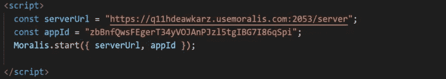
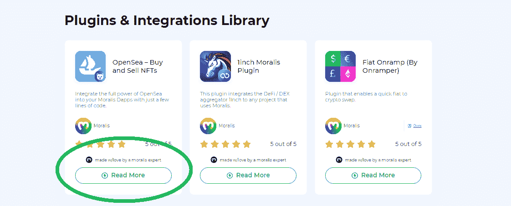
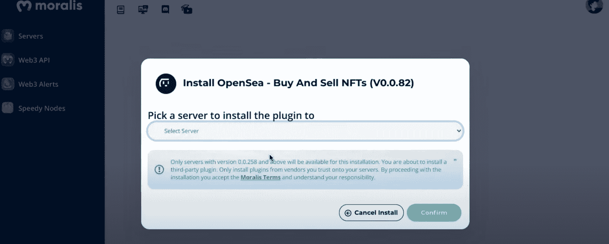
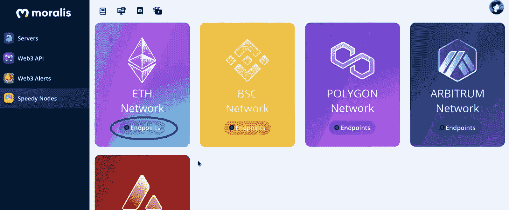
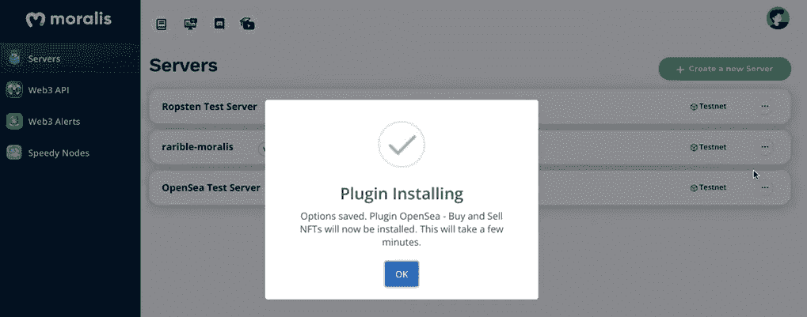
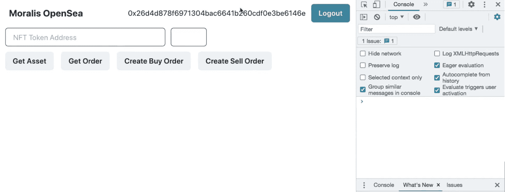
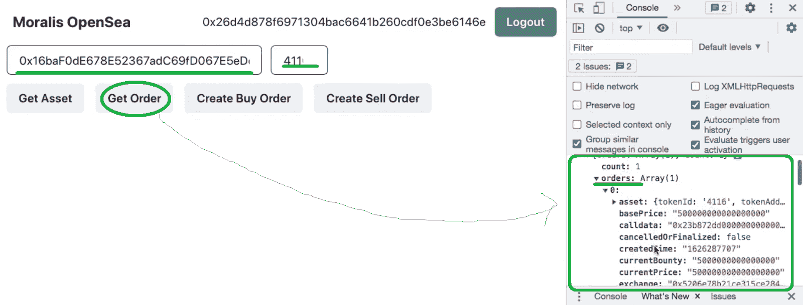
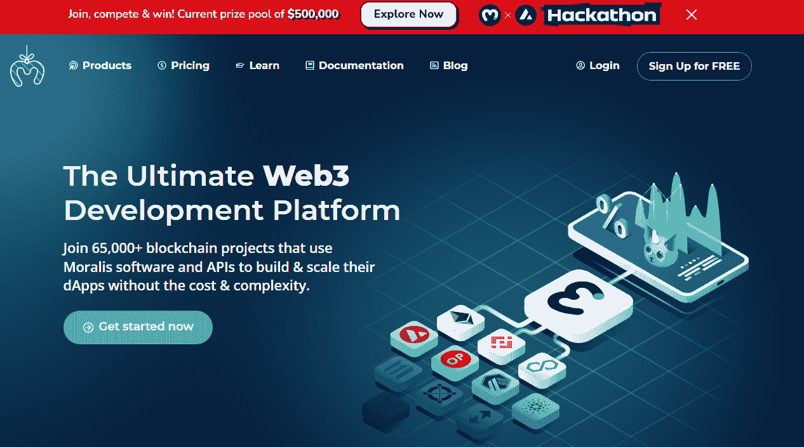

# OpenSea API 替代——用这个 OpenSea 插件列出 NFT

> 原文：<https://moralis.io/opensea-api-alternative-list-nfts-with-this-opensea-plugin/>

2021 年初，很少有密码专家预计 OpenSea 等市场上的[](https://moralis.io/non-fungible-tokens-explained-what-are-nfts/)****将成为 NFT 热潮的“爆发点”。虽然有些人可能想抓住机会并通过交易 NFT 获利，但真正的金矿等待着开发人员创建平台和 dApps，在这些平台和 dApps 中，NFT 可以发挥作用。OpenSea 创建了这样一个平台，他们的早期行动已经得到了回报，因为他们是迄今为止领先的 NFT 市场之一。然而，请记住，我们仍然处于游戏的早期。因此，Moralis 通过他们的 OpenSea 插件** [**创建了一个 OpenSea 克隆**](https://moralis.io/create-an-opensea-clone-build-an-nft-marketplace-like-opensea/) **并列出 NFT 以获得额外的优势。因此，您可以使用这个 OpenSea 插件快速方便地列出 NFT，使其成为领先的 OpenSea API 替代方案。****

**接下来，我们将进行一个示例项目，我们将使用由终极 [Web3](https://moralis.io/the-ultimate-guide-to-web3-what-is-web3/) 开发平台—[Moralis](https://moralis.io/)(又名 [Firebase for crypto](https://moralis.io/firebase-for-crypto-the-best-blockchain-firebase-alternative/) )提供的 OpenSea API 替代方案。因此，您将能够看到在任何 dApp 中实现 NFT 市场功能是多么容易。这包括在 OpenSea 上列出 NFT 和在 OpenSea 上提交列出的 NFT 的报价，所有这些都直接来自您的 dApps。此外，虽然您可能会使用 OpenSea API，但您即将看到的替代方案会使编码过程简单得多。一旦完成了正确的初始设置，并且安装了 OpenSea 插件，您所需要的就是您的 JavaScript 熟练程度和[元掩码](https://moralis.io/metamask-explained-what-is-metamask/)扩展。此外，由于我们相信在行动中学习，我们邀请您亲自完成我们的范例项目。因此，在继续下一步之前，请确保[创建您的 Moralis 账户](https://admin.moralis.io/register)。**

**

## 使用 OpenSea API 替代方案

为了使用 Moralis 和它的 OpenSea 插件，它将作为 OpenSea API 的替代品，你需要正确设置。为了使这个设置过程尽可能简单，我们决定将事情分解成简单的步骤。接下来，您将首先学习如何创建您的 Moralis 服务器，然后学习如何添加 OpenSea 插件。了解了这两个方面之后，您就可以开始使用自己选择的代码编辑器(我们使用 Visual Studio Code [VSC])来调整代码了。当然，你不会孤军奋战；我们将带您浏览代码，甚至为您提供完整的代码。

### 通过创建一个 Moralis 服务器来访问 OpenSea API

要获得最佳 OpenSea API 替代方案，请完成以下步骤:

1.  [**创建您的 Moralis 家账户**](https://admin.moralis.io/register)——如果您还没有创建您的免费 Moralis 家账户，请务必现在就创建。只需按照上面的链接，输入您的电子邮件地址，决定您的密码，并通过点击发送到您的地址的确认链接来确认您的电子邮件地址。*如果您已经拥有一个有效的 Moralis 账户，请点击* [*登录*](https://admin.moralis.io/login) *立即进入您的管理区。
    T12】*
2.  [**创建一个 Moralis 服务器**](https://docs.moralis.io/moralis-server/getting-started/create-a-moralis-server)——登录后，你将进入你的 Moralis 管理区。确保您在“服务器”选项卡上，并单击右上角的“+创建新服务器”按钮。将出现一个提供不同类型网络的下拉菜单(见下图)。鉴于这是一个示例项目，我们将使用“Testnet Server”选项。*然而，一旦你准备好部署全功能的* [*Web3 应用*](https://moralis.io/metamask-for-developers-how-to-launch-web3-apps-with-metamask/) *，你就需要选择“Mainnet 服务器”选项。*


接下来，一个弹出窗口将询问您的服务器的详细信息。因此，输入服务器名(这可以是您想要的任何东西)，选择您所在的地区、网络类型(在我们的例子中是 testnet)和链(在我们的例子中，我们将使用 Ethereum 的 Rinkeby testnet)。最后，单击“添加实例”按钮。*请注意，服务器启动可能需要几分钟时间。*


3.  **访问服务器详细信息**–一旦您的服务器启动并运行，您就可以通过单击服务器名称旁边的“查看详细信息”按钮来访问其详细信息:


点击此按钮后，您会看到一个包含您所需信息的弹出窗口:


4.  **初始化 Moralis**–将您服务器的详细信息复制到您的代码文件中，以获得 Moralis 涵盖的所需后端功能。 ***现在跳过这一步，因为我们将在下面的“代码演练”部分完成这一步。***



## 安装 OpenSea API 替代品

一旦你准备好了 Moralis 服务器，你就可以安装 OpenSea 插件了。因此，在你的管理区点击你的 Moralis 服务器上的“插件”按钮(你可以通过扩展你的服务器选项来访问它)。下一步需要你点击“转到插件商店！”按钮:


你会看到所有的 Moralis 插件；然而，我们将关注 OpenSea 插件。接下来，点击 Moralis 的 OpenSea 插件上的“阅读更多”按钮，选择该插件(见下图):



在下一页，点击“安装插件”按钮:


此外，您将被重定向到您的 Moralis 管理区，在那里您将完成插件的安装过程。这是您应该看到的窗口:



使用下拉菜单选择您在上一部分创建的服务器，然后单击“确认”。现在，您可以使用 Moralis Speedy Nodes 输入所需的详细信息:


因此，在一个新的标签或窗口中打开“快速节点”部分。如果你跟随我们的领导，你正在使用以太坊的 Rinkeby 测试网；因此，点击“以太网”选项下的“端点”:



现在，复制“Mainnet”和“rinke by”HTTPS 地址。您需要将它们粘贴到 OpenSea 插件安装过程中打开的“配置”窗口的相应字段中。接下来，单击“安装”按钮。如果您按照指示做了所有事情，现在您应该看到这个窗口:



安装成功完成后，您应该可以通过单击服务器的“Plugins”按钮看到列出的 OpenSea 插件。


安装了 Moralis 服务器和 OpenSea 插件后，您就可以使用这个 OpenSea API 替代方案了。

## OpenSea API 替代方案的应用——示例项目

我们已经准备好卷起袖子，仔细看看创建一个使用 OpenSea API 替代的示例 dApp 所需的代码。然而，让我们先做一个你将要创建的预览。在下面我们的 [OpenSea 克隆版](https://moralis.io/opensea-clone-create-an-nft-marketplace-like-opensea/)的截图中，你可以看到我们的 dApp 是简单明了的。这是因为我们关注的是后端功能，而不是 UI(用户界面)。请记住，这个示例项目的目的是向您展示使用 [Moralis 的 SDK](https://moralis.io/exploring-moralis-sdk-the-ultimate-web3-sdk/) 来涵盖所有与区块链相关的后端方面是多么容易。因此，我们强烈建议您通过使用您的 [JavaScript](https://moralis.io/javascript-explained-what-is-javascript/) 技能创建一个令人惊叹的 UI，将这个示例项目提升到一个新的水平。


在下面，您可以看到我们的 Web3 示例应用程序包括的特性:

*   [**以太坊认证**](https://moralis.io/ethereum-authentication-full-tutorial-to-ethereum-login-programming/)–dApp 通过使用 Moralis 的元掩码集成提供了 Web3 登录和注销选项。
*   **两个输入字段**–一个字段用于 NFT 合同地址，另一个用于令牌 id。
*   **四个按钮**:
    *   “获取资产”按钮。
    *   “获取订单”按钮。
    *   “创建购买订单”按钮。
    *   “创建销售订单”按钮。

### 示例 dApp 的代码演练

*在继续之前，请注意我们在这里将只涉及代码的某些部分。然而，完整的代码在我们的* [*GitHub*](https://github.com/YosephKS/moralis-opensea-plugins) *页面上供您使用。*

如果你了解前端开发，你知道你有几个选择来创建上面介绍的接口。在我们的例子中，我们将通过在代码编辑器中创建一个新的“React”项目来实现这一点。而且，你要创建这三个文件:“ [index.js](https://github.com/YosephKS/moralis-opensea-plugins/blob/main/src/index.js) ”、“ [App.js](https://github.com/YosephKS/moralis-opensea-plugins/blob/main/src/App.js) ”、“ [package.json](https://github.com/YosephKS/moralis-opensea-plugins/blob/main/package.json) ”。另外，一定要安装最新版本的 Moralis。此外，对 Moralis-React 库执行相同的操作，并将这些库导入到“index.js”文件中:

```js
import React from "react";
import ReactDOM from "react-dom";
import { MoralisProvider } from "react-moralis";
import { ChakraProvider } from "@chakra-ui/react";
import "./index.css";
import App from "./App";
import reportWebVitals from "./reportWebVitals";
```

此外，您终于可以完成“通过创建 Moralis 服务器来访问 OpenSea API 备选方案”一节的最后(第四)步，这将初始化 Moralis 的 SDK。因此，您需要在这些代码行中插入服务器 URL 和应用程序 ID:

```js
<MoralisProvider
				appId={process.env.REACT_APP_MORALIS_APP_ID}
				serverUrl={process.env.REACT_APP_MORALIS_SERVER_URL}
			>
				<App />
			</MoralisProvider>
```

此外，您还需要初始化 OpenSea API 替代品(我们之前安装的插件)。您可以在“ *App.js* ”文件中执行此操作。重要的是不要忘记导入文件顶部的“useMoralis”挂钩:

```js
import { useMoralis } from "react-moralis";
```

这里是您在“App()”函数中调用挂钩的地方:

```js
function App() {
	const {
		Moralis,
		user,
		logout,
		authenticate,
		enableWeb3,
		isInitialized,
		isAuthenticated,
		isWeb3Enabled,
	} = useMoralis();
```

准备好 *"App.js"* 文件后，您可以开始使用 Moralis 插件作为最终的 OpenSea 替代方案。

### 向我们的示例 dApp 添加功能

现在是时候专注于添加功能了。具体来说，这将使我们能够使用“获取资产”、“获取订单”、“创建买入订单”和“创建卖出订单”按钮。通过输入*"****yarn start****"*，使用您的代码编辑器终端初始化“yarn”(或“npm”)包管理器。然后，进入 [OpenSea 插件](https://moralis.io/plugins/opensea/)的网页，因为它提供了所有的细节，包括代码片段。因此，你必须复制并粘贴适当的代码行来覆盖上述按钮的功能。


此外，您可以使用浏览器控制台检查正在运行的 Web3 应用程序:



#### OpenSea API 替代方案——“获取资产”

要为“获取资产”按钮添加功能，请使用插件网页上的代码行(“获取资产”部分),并应用一些小的更改:

```js
	const getAsset = async () => {
		const res = await Moralis.Plugins.opensea.getAsset({
			network: "testnet",
			tokenAddress: values.tokenAddress,
			tokenId: values.tokenId,
		});
		console.log(res);
	};
```

上面的代码行显示，您需要更改“ *tokenAddress* 和“ *tokenID* ”旁边的值，这些值将从我们的 Web3 应用程序中的两个条目字段获得。为了我们的示例项目，我们决定使用这个选项，因为它使您能够避免硬编码令牌地址和令牌 id。后者可以在 OpenSea 上获得:


此外，**Moralis 家。Plugins.opensea.getAsset** "获取与特定令牌地址和令牌 ID 相关的链上信息。为了帮助您正确理解这一点，我们鼓励您使用一个示例资产，并在 dApp 的两个提示字段中输入其合同地址和令牌 ID。您的浏览器控制台将向您显示您的 dApp 正确地获取了有关所述资产的所有详细信息:


通过简单地复制和粘贴一些代码片段，我们确保了对 OpenSea 上所有可用细节的访问。

#### OpenSea API 替代方案——“获得订单”

要实现“获取订单”功能，您需要遵循与上述“获取资产”按钮相同的步骤。这些代码行(" *App.js* ")涵盖了这个方面:

```js
	const getOrder = async () => {
		const res = await Moralis.Plugins.opensea.getOrders({
			network: "testnet",
			tokenAddress: values.tokenAddress,
			tokenId: values.tokenId,
			orderSide: 0, // 0 is for buy orders, 1 is for sell orders
			page: 1, // pagination shows 20 orders each page
		});
		console.log(res);
	};
```

如果您再次使用浏览器的控制台来检查“获取订单”功能，您可以检查所有数据都是从 OpenSea 中正确获取的:



#### OpenSea API 替代方案——“创建购买订单”

接下来，您需要向“创建购买订单”按钮添加功能。您使用与上面相同的原则(从插件的文档页面复制代码行并应用小的调整)。这是您需要获得的代码:

```js
const createBuyOrder = async () => {
		await Moralis.Plugins.opensea.createBuyOrder({
			network: "testnet",
			tokenAddress: values.tokenAddress,
			tokenId: values.tokenId,
			tokenType: "ERC721",
			amount: 0.0001,
			userAddress: web3Account,
			paymentTokenAddress: "0xc778417e063141139fce010982780140aa0cd5ab",
		});

		console.log("Create Buy Order Successful");
	};
```

“令牌类型”值需要与您使用的令牌类型相匹配(“令牌地址”和“令牌 ID”)。幸运的是，OpenSea API 替代品同时支持 [ERC-1155](https://moralis.io/erc1155-exploring-the-erc-1155-token-standard/) 和 [ERC-721](https://moralis.io/erc-721-token-standard-how-to-transfer-erc721-tokens/) 令牌标准。

此外，确保您已经准备好元掩码扩展，并且在您的钱包中有足够的令牌来测试“创建购买订单”功能，因为您需要完成交易。

#### OpenSea API 替代方案——“创建销售订单”

现在，您已经知道了该练习，所以请按照之前的步骤向“Create Sell Order”按钮添加功能。以下是您最终需要的代码行:

```js
	const createSellOrder = async () => {
		const expirationTime = Math.round(Date.now() / 1000 + 60 * 60 * 24);
		const startAmount = 1;
		const endAmount = 1;

		await Moralis.Plugins.opensea.createSellOrder({
			network: "testnet",
			tokenAddress: values.tokenAddress,
			tokenId: values.tokenId,
			tokenType: "ERC1155",
			userAddress: web3Account,
			startAmount,
			endAmount,
			expirationTime: startAmount > endAmount && expirationTime, // Only set if you startAmount > endAmount
		});

		console.log("Create Sell Order Successful");
	};
```

请务必考虑“tokenType”值，因为它需要与您的 NFT 类型相匹配。此外，请记住，您只能为您拥有的 NFT 创建卖出订单。

通过将最后的功能添加到“Create Sell Order”按钮，您已经成功地完成了您的示例 dApp，并将最终的 OpenSea API 替代品投入了正确的使用。尽管如此，我们还是邀请您观看下面的视频，其中 Moralis 的一位专家更详细地介绍了同一个示例项目:

https://www.youtube.com/watch?v=r2YFhfjIb3k

## OpenSea API 备选方案–列出带有此 OpenSea 插件的 NFT–摘要

我们希望你已经成功地遵循了我们的指导，并创建了你自己的 dApp 范例。如果是这样，您现在知道如何利用最好的 OpenSea API 替代方案来为您的 dApps 添加 NFT 功能。结合 Moralis 的 [ultimate NFT API](https://moralis.io/ultimate-nft-api-exploring-moralis-nft-api/) ，这为您提供了完善您的 [NFT 开发](https://moralis.io/nft-token-development-the-ultimate-guide/)技能所需的所有工具。现在你可以接手自己或客户的项目，并尽可能地从这个改变世界的行业中获益。

然而，如果你还不精通 JavaScript，我们建议你报名参加[Moralis 学院](https://academy.moralis.io/)的 [2021 区块链开发者 JavaScript 编程](https://academy.moralis.io/courses/javascript-programming-for-blockchain-developers)课程。此外，许多高质量的课程可以帮助你更快地成为全职加密员。此外，一定要访问 [Moralis YouTube 频道](https://www.youtube.com/c/MoralisWeb3)和 [Moralis 博客](https://moralis.io/blog/)，那里有大量免费的教育和励志内容，可以帮助你[成为一名区块链开发者](https://moralis.io/how-to-become-a-blockchain-developer/)。我们的一些最新文章向您展示了[如何在以太坊](https://moralis.io/how-to-do-gasless-transactions-on-ethereum/)上进行无气体交易，如何[建立跨链桥](https://moralis.io/how-to-build-a-cross-chain-bridge/)，如何[快速创建 DAO](https://moralis.io/how-to-create-a-dao-in-10-minutes/) ，如何[创建预测市场 dApp](https://moralis.io/how-to-build-a-prediction-market-dapp/) ，开发者的[元掩码的来龙去脉](https://moralis.io/metamask-for-developers-how-to-launch-web3-apps-with-metamask/)，如何[用短信获取 Web3 事件](https://moralis.io/get-web3-events-with-sms-messages/)，如何[创建免费令牌](https://moralis.io/create-free-token-how-to-deploy-your-own-testnet-crypto-token-in-10-mins/)，如何

**