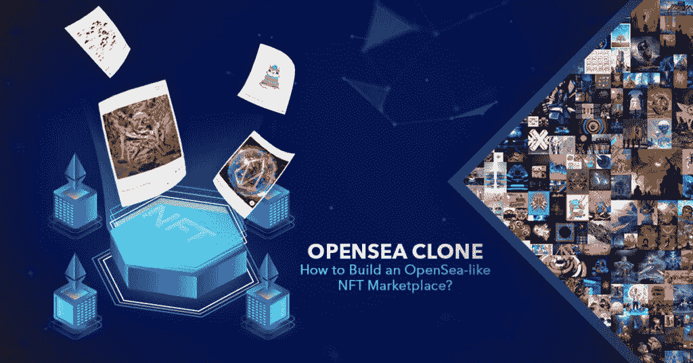
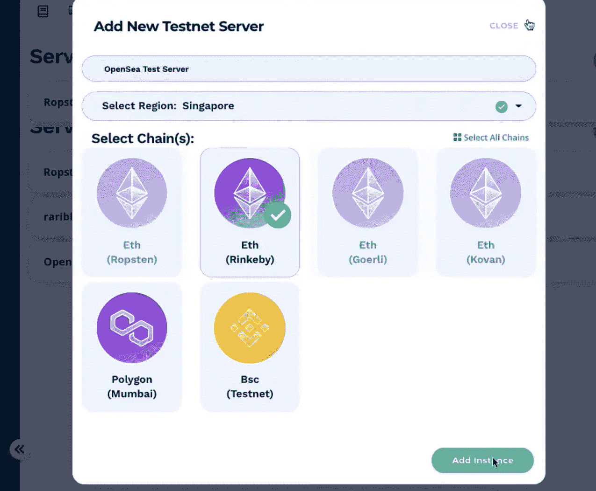
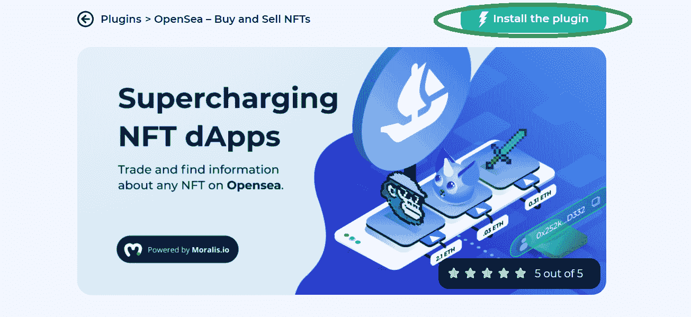
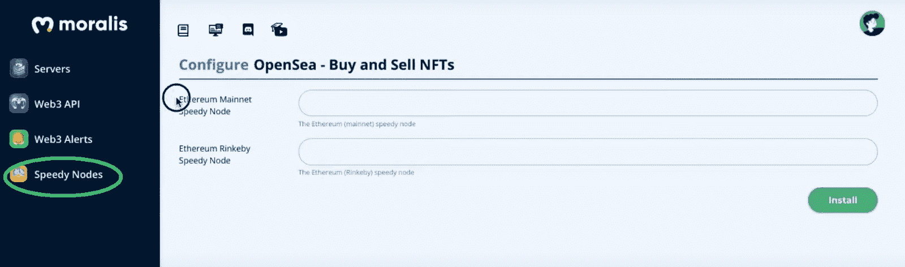
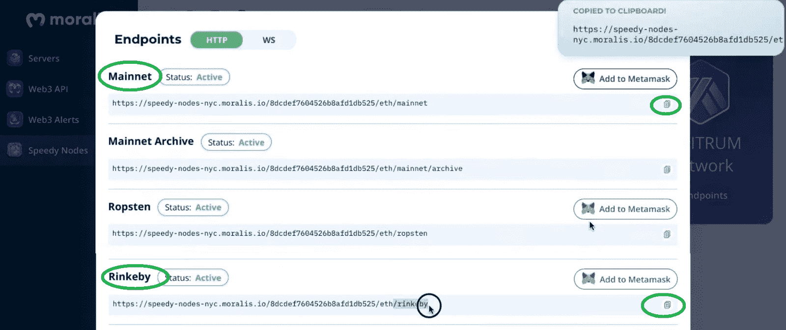
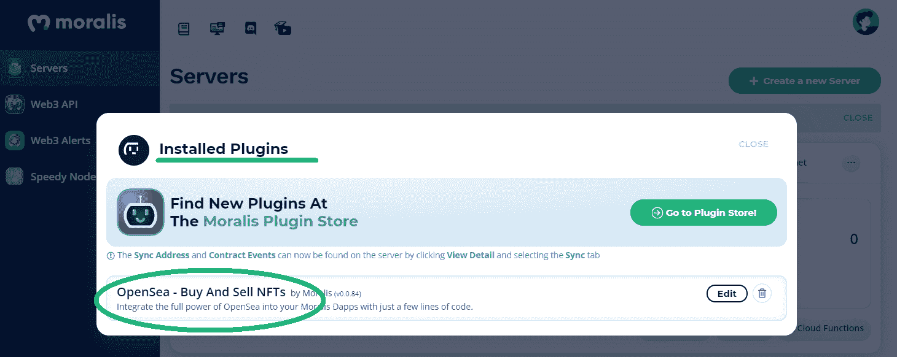
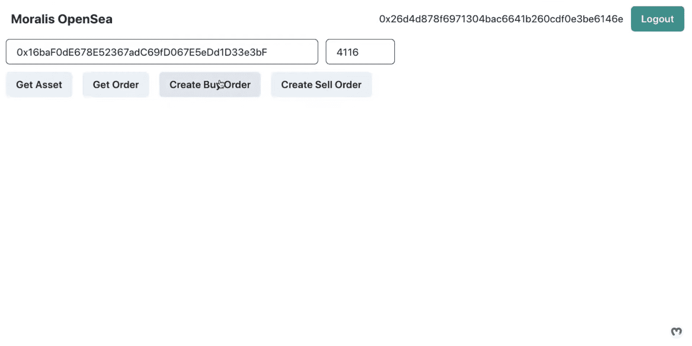

# OpenSea Clone——如何使用 dApp 在 OpenSea 上列出 NFT

> 原文：<https://moralis.io/opensea-clone-create-an-nft-marketplace-like-opensea/>

随着越来越多的人熟悉区块链技术和不可替代代币( [**NFTs**](https://moralis.io/non-fungible-tokens-explained-what-are-nfts/) **)的概念，像 OpenSea 这样的 NFT 市场越来越受欢迎。更重要的是，对类似于 OpenSea 的 NFT 市场的需求并不短缺。无论是人们寻找新的代币，还是艺术家寻找展示他们艺术作品的环境，许多人都在寻找下一个大的 NFT 市场。因此，难怪程序员想要学习** [**NFT 令牌开发**](https://moralis.io/nft-token-development-the-ultimate-guide/) **来创建 OpenSea 克隆。**

当然，OpenSea 很可能会比你自己的 NFT 平台更大。然而，通过学习如何[创建一个像 OpenSea 一样的 NFT 市场](https://moralis.io/how-to-create-an-nft-marketplace/),开发者将自己置于一个位置，在那里他有可能为 NFTs 创建一个非常成功的市场。此外，开发一个 OpenSea 的克隆是一个过程，使用 Moralis 的 [Web3](https://moralis.io/the-ultimate-guide-to-web3-what-is-web3/) 平台和各种工具可以很容易地完成。因此，跟随我们向你展示如何用[Moralis 的插件](https://moralis.io/plugins/)之一来建立一个不可替代代币的市场。最后，您将拥有一个 OpenSea 克隆，可以部署在以太坊的 testnet 上。

多亏了 Moralis 的 [OpenSea 插件](https://moralis.io/plugins/opensea/)，你可以通过复制和粘贴几行简单的代码来创建一个像 OpenSea 一样的 NFT 市场。此外，该插件与 OpenSea 完全集成，这意味着您的用户可以从您的 dApp(去中心化应用程序)轻松创建 OpenSea 上的资产买卖订单。因此，让我们来教育和指导你，因为我们在这里承担了一个范例项目，在那里我们创建了我们的 OpenSea 克隆。



## 用 Moralis 创造一个像 OpenSea 一样的 NFT 市场

Moralis 是业内发展最快的 Web3 开发平台。它涵盖了区块链跨越多个链条的全方位发展需求。除了是拥有 [Moralis Speedy Nodes](https://moralis.io/speedy-nodes/) 的最好的 [Infura 替代品](https://moralis.io/infura-alternatives-and-blockchain-node-providers/)之一，Moralis 还提供了一个全面的 [Web3 SDK](https://moralis.io/exploring-moralis-sdk-the-ultimate-web3-sdk/) 。这包括[以太坊 API](https://moralis.io/ethereum-api-develop-ethereum-dapps-with-moralis/) ，Moralis 家的[终极 NFT API](https://moralis.io/ultimate-nft-api-exploring-moralis-nft-api/) ，以及 [Web3 API](https://docs.moralis.io/moralis-server/web3-sdk/intro) 中的所有其他功能。

此外，Moralis 最近还添加了插件，这是我们在寻求创建像 OpenSea 这样的 NFT 市场时将利用的功能之一。我们将使用的插件是 OpenSea 插件。后者使您能够用几行代码将 OpenSea 的全部功能集成到您的 dApps 中。要使用这个快捷方式，你需要从 Moralis 的插件页面安装插件。幸运的是，这可以很容易地在你的 Moralis 管理区点击几下。但是，您首先需要[创建一个 Moralis 服务器](https://docs.moralis.io/moralis-server/getting-started/create-a-moralis-server)(参见下面的详细说明)。


## OpenSea 克隆创建–Moralis 设置

如果你想用 Moralis 创建一个像 OpenSea 一样的 NFT 市场，你需要完成以下步骤:

1.  [**创建您的 Moralis 家账户**](https://admin.moralis.io/register)——如果您还没有创建您的免费 Moralis 家账户，请务必现在就创建。按照上面的链接，输入您的电子邮件地址，并创建您的密码。接下来，确保通过确认您的电子邮件地址来完成该过程(您将收到一封带有确认链接的电子邮件)。*如果您已经拥有一个有效的 Moralis 家账户，只需* [*登录*](https://admin.moralis.io/login) *即可进入您的管理区。*T12
    T14*T16】*
2.  **创建新服务器**–进入您的 Moralis 管理区域后，点击右上角的“+创建新服务器”按钮。从出现的下拉菜单中，选择最适合您需求的网络类型(见下图)。由于这是一个示例项目，我们将使用“Testnet 服务器”选项。然而，一旦您准备好部署全功能的 dApps，您将需要选择“Mainnet 服务器”选项。


在出现的弹出窗口中，输入服务器名称(这可以是您想要的任何名称)，选择 region、network(在我们的例子中是 testnet)、chain(s)(在我们的例子中，使用“Eth (Rinkeby)”选项)，然后单击“Add Instance”。服务器启动需要一些时间，请耐心等待。



3.  **访问服务器详细信息**–一旦您的服务器准备就绪，您就可以通过单击服务器名称旁边的“查看详细信息”按钮来访问其详细信息。


这样，你会看到一个弹出窗口，包含你需要的所有信息:


4.  **初始化 Moralis 规范**–现在填充您的”。js“或者”。html”文件，包含 Moralis 服务器详细信息(应用程序 ID 和服务器 URL ),以获得 Moralis 涵盖的所需后端功能:


*注意* *:确保使用您特定服务器的详细信息和* ***而不是*** *上图中的信息。*

## 使用 OpenSea 插件创建一个类似 OpenSea 的 NFT 市场

现在您已经创建了 Moralis 服务器，您可以安装 OpenSea 插件了。首先点击 Moralis 服务器上的“插件”按钮。在接下来的步骤中，单击“转到插件商店！”按钮:


然后你需要安装 OpenSea 插件。首先，点击 Moralis 的 OpenSea 插件上的“阅读更多”按钮，选择该插件:


在下一步中，您将看到一个安装插件的选项。单击“安装插件”按钮:



点击“安装插件”按钮会将您重定向到您的 Moralis 管理区，以完成插件的安装过程。您会看到这个屏幕:


从下拉菜单中，选择您为我们的“OpenSea clone”项目创建的服务器，然后单击“确认”，这将带您进入最后一步:



要获得必要的细节，你需要在一个新的标签页或窗口中从侧边菜单打开“快速节点”部分。在那里你会看到各种选项。由于我们使用的是以太坊的 Rinkeby testnet，请点击“以太网”选项下的“端点”按钮:



接下来，复制“Mainnet”和“Rinkeby”选项下的 HTTPS 地址，并粘贴到我们的 OpenSea 插件安装过程中打开的窗口中的指定字段。然后点击“安装”按钮。如果您做的一切都是正确的，您应该会看到这个屏幕:


一旦你完成了安装(当你点击你的服务器的“插件”按钮时，你应该能够看到列出的 OpenSea 插件，如下所示)，你将能够创建一个 OpenSea 克隆。



安装了 Moralis 服务器和 OpenSea 插件后，我们就可以通过使用服务器细节和实现 OpenSea 插件来开始我们的示例项目了。

## OpenSea 克隆的示例项目

在我们进入如何创建一个像 OpenSea 这样的 NFT 市场的细节之前，我们想快速向你展示我们将要建立的东西。查看我们的 OpenSea 克隆的图像，您可以看到我们将关注后端功能，而不是 UI(用户界面)。我们的目标是向您展示实现所有与区块链相关的后端功能是多么容易，然后您将能够通过使用您的 [JavaScript](https://moralis.io/javascript-explained-what-is-javascript/) 技能创建一个令人难以置信的用户界面来更上一层楼。



我们的 Web3 示例应用程序将包括以下特性:

*   [以太坊认证](https://moralis.io/ethereum-authentication-full-tutorial-to-ethereum-login-programming/) (Web3 登录和注销选项)。
*   两个输入字段，一个用于 NFT 合同地址，另一个用于令牌 id。
*   获取资产和订单的按钮。
*   买卖订单按钮。

## 创建一个像 OpenSea 一样的 NFT 市场-代码演练

*注* *:这里我们只涉及代码的特定部分；但是，完整的代码可以在* [*GitHub*](https://github.com/YosephKS/moralis-opensea-plugins) *获得。*

要创建实现所有后端功能的接口(如上所示)，您需要在代码编辑器中设置一个新的“React”项目。你要创建的文件有三个: [index.js](https://github.com/YosephKS/moralis-opensea-plugins/blob/main/src/index.js) 、 [App.js](https://github.com/YosephKS/moralis-opensea-plugins/blob/main/src/App.js) 、 [package.json](https://github.com/YosephKS/moralis-opensea-plugins/blob/main/package.json) 。此外，您需要安装最新版本的 Moralis 和 Moralis-React 库(在“package.json”文件中，或者使用您的代码编辑器的终端)，然后在“index.js”文件中导入这些库:

```js
import React from "react";
import ReactDOM from "react-dom";
import { MoralisProvider } from "react-moralis";
import { ChakraProvider } from "@chakra-ui/react";
import "./index.css";
import App from "./App";
import reportWebVitals from "./reportWebVitals";
```

现在是时候完成“OpenSea 克隆创建–Moralis 设置”部分的最后一步了，通过插入您的服务器 URL 和应用程序 ID 来初始化 Moralis 的 SDK:

```js
<MoralisProvider
				appId={process.env.REACT_APP_MORALIS_APP_ID}
				serverUrl={process.env.REACT_APP_MORALIS_SERVER_URL}
			>
				<App />
			</MoralisProvider>
```

此外，我们还需要初始化 Moralis OpenSea 插件，这是在“ *App.js* ”文件中完成的。当然，还要记住导入文件顶部的“useMoralis”钩子:

```js
import { useMoralis } from "react-moralis";
```

然后我们在“App”函数中调用这个钩子:

```js
function App() {
	const {
		Moralis,
		user,
		logout,
		authenticate,
		enableWeb3,
		isInitialized,
		isAuthenticated,
		isWeb3Enabled,
	} = useMoralis();
```

我们在“useEffect()”函数中设置插件初始化:

```js
useEffect(() => {
		if (isInitialized) {
			Moralis.initPlugins();
		}
		// eslint-disable-next-line
	}, []);
```

您现在可以为这个示例项目使用 Moralis 插件了。

### OpenSea 克隆–增加功能

现在让我们把重点放在为我们的 OpenSea 克隆的“获取资产”、“获取订单”、“创建购买订单”和“创建销售订单”按钮添加功能上。首先，我们使用代码编辑器的终端，通过键入****yarn start****来启动“yarn package manager”(你也可以使用 npm)。接下来，我们使用 Moralis OpenSea 插件的网页，其中提供了所有细节，包括代码片段。这意味着我们可以简单地复制和粘贴这些代码来覆盖按钮的功能。**

**

此外，我们将使用浏览器控制台来检查我们正在运行的 Web3 应用程序:


#### OpenSea 克隆-“获取资产”

如果我们现在想为“获取资产”按钮添加功能，我们只需从插件网站“获取资产”部分提供的代码行开始，并做一些调整。

```js
const getAsset = async () => {
		const res = await Moralis.Plugins.opensea.getAsset({
			network: "testnet",
			tokenAddress: values.tokenAddress,
			tokenId: values.tokenId,
		});
		console.log(res);
	};
```

查看上面的代码行，您可以看到我们更改了“ *tokenAddress* ”和“ *tokenID* ”旁边的值。这些值是从我们的 Web3 应用程序的两个输入字段中获得的。这对我们的示例项目非常有用，因为它使我们能够避免硬编码令牌地址和令牌 id。我们在 OpenSea 上获得这些详细信息:


此外，如你所见，Moralis。Plugins.opensea.getAsset "代码片段负责获取链上信息。如果我们现在使用一个示例资产，在 dApp 上的字段中输入其合同地址和令牌 ID，我们可以看到它获得了关于该资产的所有详细信息:


你看到这的力量了吗？我们只是复制并粘贴了几行代码，现在我们可以访问 OpenSea 上所有可用的细节。

#### OpenSea 克隆–“获得订单”

以“获取资产”为例，我们用“ *App.js* ”中的这些代码行来介绍“获取订单”功能:

```js
const getOrder = async () => {
		const res = await Moralis.Plugins.opensea.getOrders({
			network: "testnet",
			tokenAddress: values.tokenAddress,
			tokenId: values.tokenId,
			orderSide: 0, // 0 is for buy orders, 1 is for sell orders
			page: 1, // pagination shows 20 orders each page
		});
		console.log(res);
	};
```

此外，让我们使用浏览器的控制台来检查增加的功能:


我们可以看到数据提取正确。因此，我们正在从 OpenSea 获取详细信息。

#### open sea Clone–“创建购买订单”

就像我们对前两个按钮所做的一样，我们现在对“Create Buy Order”按钮进行操作。在从插件的文档页面复制代码行并进行一些调整后，我们得到了这样的结果:

```js
const createBuyOrder = async () => {
		await Moralis.Plugins.opensea.createBuyOrder({
			network: "testnet",
			tokenAddress: values.tokenAddress,
			tokenId: values.tokenId,
			tokenType: "ERC721",
			amount: 0.0001,
			userAddress: web3Account,
			paymentTokenAddress: "0xc778417e063141139fce010982780140aa0cd5ab",
		});

		console.log("Create Buy Order Successful");
	};
```

*注意* *:考虑“tokenType”值。匹配我们使用的令牌类型很重要(在我们的 dApp 的输入字段中使用的详细信息)。OpenSea 插件支持的 NFT 类型有* [*ERC721*](https://moralis.io/erc-721-token-standard-how-to-transfer-erc721-tokens/) *令牌标准和*[*ERC 1155*](https://moralis.io/erc1155-exploring-the-erc-1155-token-standard/)*令牌标准。*

在测试这个功能时，我们需要使用元掩码来完成事务。此外，你还需要确保你的钱包里有足够数量的代币。

#### OpenSea Clone“创建销售订单”

为了添加“创建销售订单”按钮的功能，我们再次遵循与前面相同的步骤。我们以下面几行代码结束:

```js
const createSellOrder = async () => {
		const expirationTime = Math.round(Date.now() / 1000 + 60 * 60 * 24);
		const startAmount = 1;
		const endAmount = 1;

		await Moralis.Plugins.opensea.createSellOrder({
			network: "testnet",
			tokenAddress: values.tokenAddress,
			tokenId: values.tokenId,
			tokenType: "ERC1155",
			userAddress: web3Account,
			startAmount,
			endAmount,
			expirationTime: startAmount > endAmount && expirationTime, // Only set if you startAmount > endAmount
		});

		console.log("Create Sell Order Successful");
	};
```

*注意* *:同样，一定要考虑“tokenType”的值。它应该符合你的 NFT 的类型。另外，请注意，您只能为您拥有的 NFT 创建卖出订单。*

至此，我们结束了我们的示例项目，这意味着您现在知道如何创建像 OpenSea 这样的 NFT 市场。此外，请注意，在使用 Moralis 的 OpenSea 插件时，还有其他功能可用，我们鼓励您自行测试。

此外，如果你更喜欢视频，请务必观看下面的视频，其中 Moralis 的一位专家承担了我们上面提到的相同示例项目:

https://www.youtube.com/watch?v=r2YFhfjIb3k

## OpenSea 克隆——创建一个像 OpenSea 一样的 NFT 市场——总结

多亏了 OpenSea 插件和 Moralis 的 SDK，你可以[开发自己的 NFT 市场](https://moralis.io/develop-your-own-nft-marketplace-step-by-step-guide/)，在几分钟内从 OpenSea 获取所有数据和订单。在初始设置(创建 Moralis 服务器并安装插件)之后，您基本上只需要复制并粘贴几行代码来涵盖所有高级功能。当然，围绕这些功能，您可以发挥创造力，构建最佳用户体验。

此外，除了使用 Moralis 创建像 OpenSea 这样的 NFT 市场，您还可以将这个终极 Web3 开发平台用于各种区块链开发项目。无论您只是想[建造您的第一个 dApp](https://moralis.io/build-your-first-dapp-ethereum-tutorial/) ，了解 [BEP20](https://moralis.io/what-is-bep20-full-binance-smart-chain-token-guide/) 代币，还是想[创建一个 DeFi 仪表板](https://moralis.io/how-to-create-a-defi-dashboard-in-5-steps/)，Moralis 都会支持您。它还可以帮你[生成 NFT](https://moralis.io/how-to-generate-nfts-full-guide/)、[批量薄荷 NFT](https://moralis.io/how-to-bulk-mint-nfts-batch-minting-guide/)，甚至可以创建一个[移动以太坊 dApp](https://moralis.io/create-mobile-ethereum-dapp-with-react-native-template/) 。此外，对于那些寻求最大限度简化的人，我们推荐使用终极[以太坊 dApp 样板](https://moralis.io/ethereum-dapp-boilerplate-full-ethereum-react-boilerplate-tutorial/)。另外，一定要看看 [Moralis 的 YouTube 频道](https://www.youtube.com/c/MoralisWeb3)和 [Moralis 的博客](https://moralis.io/blog/)。这两个网站都提供了大量有价值的内容，包括许多有见地和鼓舞人心的示例项目。后者将帮助你掌握更广泛的跨链开发。

**