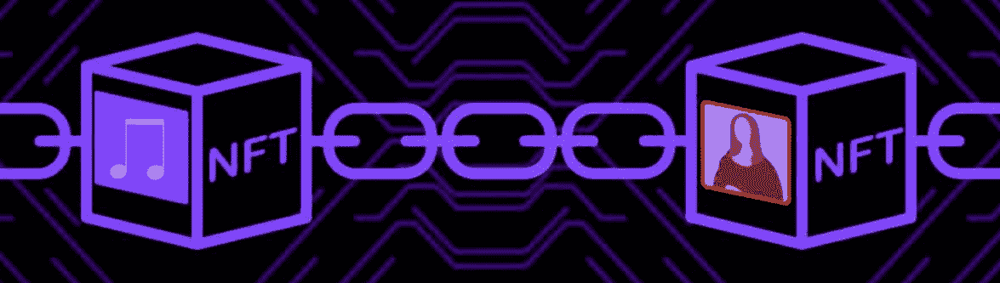
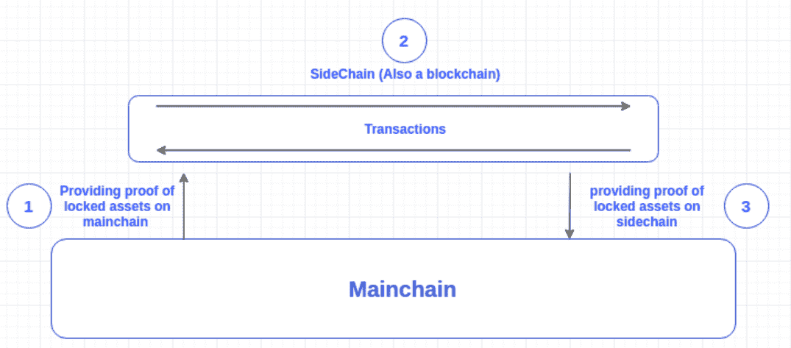
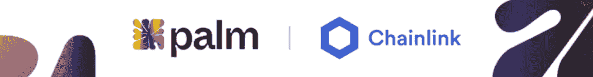
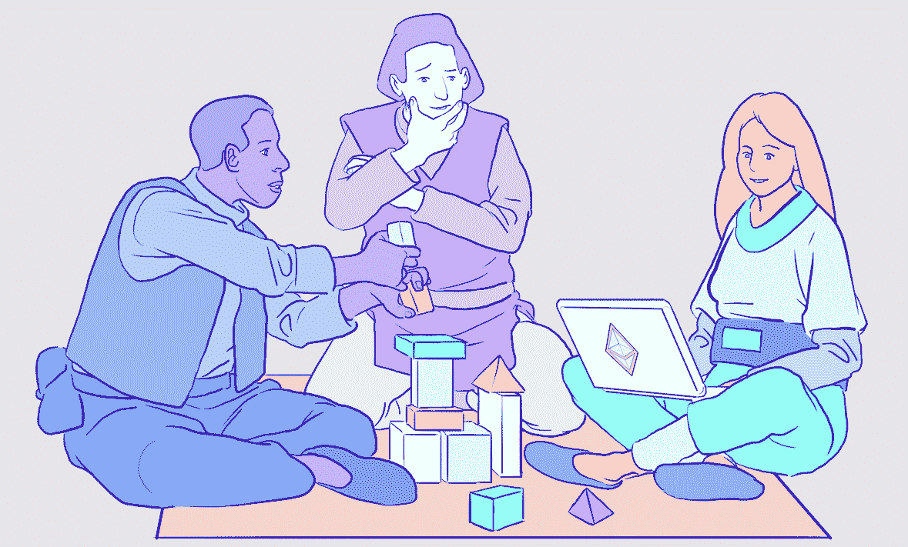
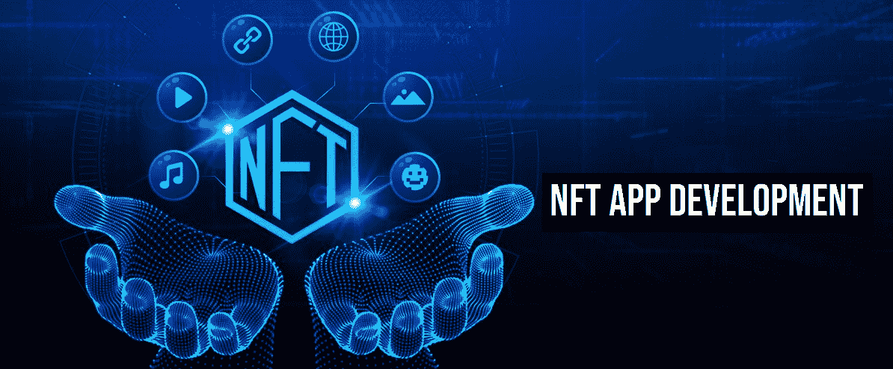
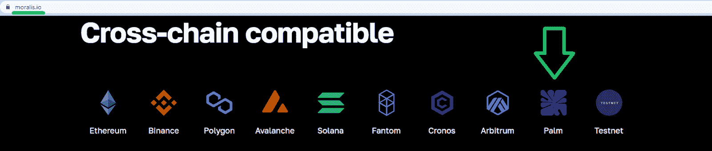
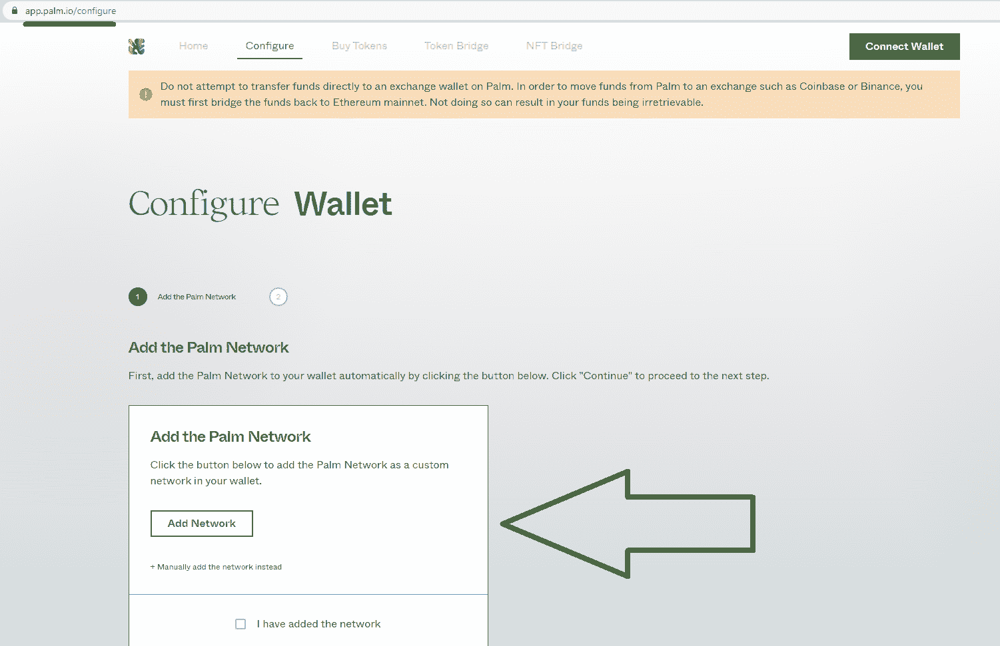

# Palm 区块链——什么是 Palm 网络？

> 原文：<https://moralis.io/palm-blockchain-what-is-the-palm-network/>

NFT，或不可替代的代币，启发了 Palm 网络的创建。此外，Palm 区块链网络有望成为 NFT 创造者的游戏规则改变者。然而，许多人对这个新推出的网络并不熟悉，他们想知道，“Palm 网络到底是什么？”。如果你也是这样问自己的人之一，那么你来对地方了！

接下来，我们将介绍 Palm 区块链网络的来龙去脉，以帮助您确定是否应该考虑将其用于您的项目。我们还将解释从 Palm 获取链上 NFT 数据的最简单方法。毕竟，一个可靠的 NFT API 是构建 NFT dapp(分散式应用程序)的关键——在这个以 NFT 为中心的网络或任何其他区块链上用简单的方法。事实上，在构建与 NFT 相关的项目或任何其他 dapps 时， [Moralis](https://moralis.io/) 及其 Web3 APIs 套件使开发人员能够快速轻松地进行构建。因此，Moralis 是你的首选。说了这么多，让我们深入到“什么是掌网？”问题。

## 什么是掌网？

根据 Palm 的官方网站，Palm 是一个文化和创意的 NFT(不可替代的令牌)生态系统。他们自豪地指出，他们的开发人员利用以太坊高效地构建了生态系统。因此，值得指出的是以太坊是第一个，并将继续成为领先的可编程区块链。此外，请记住以太坊在 2022 年 9 月从其工作证明(PoW)共识机制转换为利益证明(PoS)(合并)。这次以太坊的更新意义重大，因为它使领先的发展区块链更加节能。后者很重要，因为 Palm 表示，他们的团队正在与美术、加密艺术和娱乐领域的一些大牌合作，在以太坊上建立一个新的创意工作室和 NFT 平台，既可扩展又可持续。

此外，Palm 网络背后的公司 Palm NFT 工作室强调创造力的重要性。他们的目标是将项目和平台引入 Palm 生态系统。为此，他们致力于支持创意人员、艺术家、市场和版权所有者，并与之合作。

而且，重要的方面是“什么是掌网？”讨论内容还包括灵活性、低能耗和高能效。据“ *palm.io* ”报道，开发人员将 palm 区块链网络设计得像艺术家的创造力一样灵活。此外，除了低廉的汽油费，这个以 NFT 为中心的网络承诺对创作者和参与者都有回报。就能源效率而言，这个项目背后的团队声称，Palm 区块链的效率比基于 PoW 的区块链网络高 99.9%。因此，Palm 网络为艺术家提供了一个更可持续的解决方案。

### Palm 是区块链吗？

正如标题中的“棕榈区块链”所示，棕榈网络是一个真实的区块链；但是，它不是第 1 层(L1)链。相反，它是一个以太坊侧链。这个区块链的主要目的是作为一个新的可扩展和可持续的生态系统的基础。此外，与继承主区块链安全性的第二层(L2)区块链不同，侧链依赖于自己的安全性。因此，Palm 有自己的共识方法。具体来说，Palm 网络使用 IBFT-2 共识机制，这是一种旋转授权证明(PoA)方法。此外，关键利益相关者运行网络验证程序。目标是随着时间的推移，通过添加额外的验证器来扩展 Palm 网络的初始验证器组。这将进一步增加网络的弹性。

以太坊和 Palm 这两条链通过一个便于代币移动的桥连接在一起。此外，这款侧链完全兼容 EVM。因此，它支持与以太坊链相同的工具。相应地，Palm 上的开发人员也可以部署用 Solidity 编程语言编写的智能合同。

尽管如此，“ *palm.io* ”还提到 palm 的路线图包括向以太坊第二层的过渡。然而，长期愿景是让 Palm 成为领先的跨链 NFT 生态系统。不过，在现阶段，Palm 是由以太坊开发者设计的，也是为他们设计的。此外，如前所述，这一链条的主要特点包括低天然气成本和快速交易终结。另外，连锁店已经有了可靠的记录。毕竟，Palm 的“关于”页面报道说开发者已经在网络上创造了超过 300 万个 NFT。此外，已经有超过 100 万个 Palm wallet 地址，交易量超过 400 万次。

那么，什么是掌网呢？简而言之，它是一个以太坊侧链，致力于出售、购买和交易 NFT。

### 什么是 Palm 网络和 Chainlink 协作？

根据 Palm 的博客，Palm 网络与 Chainlink Labs 积极合作。他们的合作旨在改善和简化区块链企业发放非关税壁垒的方式。实际上，Chainlink Labs 将支持这个以 NFT 为中心的网络的进一步发展和增长。此外，这种协作是创建多链 NFT 抽象层的关键。后者将使企业能够跟踪、监控和管理 NFT。

让我们提一下，Chainlink Labs 是参与构建最广泛采用的开源和分散式 oracle 网络 Chainlink 的开发团队。因此，这种合作也验证了 NFTs 的长期可行性。

作为合作的一部分，Palm network 还集成了几个 Chainlink oracle 服务。这些服务包括用于可验证随机数生成器(RNG)的 Chainlink VRF，用于汇率的 Chainlink 价格馈送，以及用于跨链互操作性的 CCIP。

## 谁使用 Palm 网络？

如果你读了以上几节，你现在可以回答“什么是掌网？”问题。因此，您也知道目前 Palm 网络主要由 NFT(不可替换令牌)开发者使用。因此，基本上，它使各种想要有效地创建 NFTs 的项目能够将 NFTs 部署到 Palm 网络。此外，如前所述，开发人员可以使用以太坊开发工具。因此，Solidity、MetaMask、Hardhat、Truffle、Remix、OpenZeppelin 等技术和工具发挥着至关重要的作用。

在“ *palm.io* ”上，我们可以找到 palm 的庞大合作伙伴网络，包括:

*   共识；一致
*   MetaMask
*   协议实验室
*   Wyre
*   共价的
*   奇安保险系统公司

根据 Palm 的说法，它的合作伙伴，包括上面的合作伙伴，帮助在 Palm 上提供完整的 NFT 体验。

你可能知道，创建 dapps 有很多方面。然而，与几年前你必须构建自己的后端基础设施不同，现在你可以使用高质量的 Web3 APIs 来轻松覆盖与区块链相关的后端功能。此外，这也是 Moralis 的 [NFT API](https://moralis.io/nft-api/) 、 [Streams API](https://moralis.io/streams/) 、 [Web3 Auth API](https://moralis.io/authentication/) 和其他 API 产生巨大差异的地方。作为最好的企业级 Web3 API 提供商，Moralis 让 dapp 开发变得简单明了。您可能已经猜到，Moralis 支持 Palm 网络。

## 开发者如何通过 Moralis 使用 Palm 区块链网络

如上所述，Moralis 是关于跨链互操作性的。它支持所有领先的 EVM 兼容区块链，包括 Palm 网络。因此，您可以使用 Moralis 的 API 来创建只关注 Palm 或多个链的 dapps。

Moralis 也是跨平台互操作的。因此，您可以使用遗留开发平台在 Palm 或任何其他上述链上创建 dapps(如上图所示)。这就是为什么 Moralis 以弥合 Web2 和 Web3 之间的发展差距而闻名。毕竟，它使你能够使用你所知道和喜欢的工具来加入 Web3 革命，即使你对 Web3 知之甚少。例如，如果你精通 JavaScript，你可以在几分钟内准备好你的第一个 dapp。

此外，Moralis 为您提供了一流的文档，其中包括可以帮助您开始创建杀手级 dapps 的教程。在这里，您可以学习如何正确使用 Moralis 的 Web3 APIs。在大多数情况下，这就像复制粘贴一行代码一样简单。在指定 Palm 网络时，可以使用“ *EvmChain。手掌*或 *11297108109* (链 ID)。

如果您有兴趣在“什么是 Palm 网络？”一文中使用您的知识旅程，[创建您的免费 Moralis 账户](https://admin.moralis.io/register)并开始建设。使用 API 参考文档页面，可以随意使用每个 API 端点，例如[通过钱包端点获取 NFTs 的文档页面](https://docs.moralis.io/reference/getwalletnfts):

如上图所示，您需要选择 Palm chain 来查询这个以 NFT 为中心的区块链。此外，不要忘记粘贴在 Palm 网络上有一些 NFT 的钱包地址。此外，正如您在右上角看到的，每个 API 参考页面都允许您选择您喜欢使用的编程语言。

### 在 Palm 网络上开发 Dapps 的其他快捷方式

Moralis 的 Web3 APIs 是快捷方式，可以帮助您将项目的上市时间缩短 87%以上，从而为您节省大量工程成本。但是，还有其他快捷方式可以帮助您在几分钟内启动并运行各种 NFT dapp。它们以我们无数的样板文件的形式出现，在 [GitHub](https://github.com/MoralisWeb3/youtube-tutorials) 等待你。例如，有了其中一个模板，你就可以[快速简单地构建一个 NFT 门控 dapp](https://github.com/MoralisWeb3/youtube-tutorials/tree/main/nft-gating) 。

*注意:如果你对 NFT 开发有进一步的兴趣，了解如何通过一个地址* [*获得所有拥有*](https://moralis.io/how-to-get-all-nfts-owned-by-an-address-3-step-process/) *的 NFT 是至关重要的。如果你想了解这个过程，请务必查看之前的链接文章。*

此外，GitHub 上最通用的样板文件是我们的[以太坊样板文件](https://github.com/ethereum-boilerplate/ethereum-boilerplate)，它也默认支持 NFTs:

因此，一定要学会如何[在以太坊](https://moralis.io/how-to-create-a-decentralized-website-on-ethereum/)上创建一个分散的网站。然后，简单的把 PALM 作为其中一个链条来重点关注，或者把“以太坊”换成“Palm”。

尽管如此，请注意，您会希望将 Palm 添加到您的 MetaMask 钱包中(如果没有其他事情，请测试您的 dapp)。尽管 MetaMask 很容易将这个以 NFT 为中心的网络添加到他们的钱包中，但请确保遵循 Palm 文档中提供的详细说明。本质上，你只需要点击“添加网络”按钮，然后选择“掌上电脑”(你可能需要搜索)。此外，您还可以使用 Palm 应用程序来帮助您:

此外，PALM 文档、Palm 应用程序和 Palm 官方网站也是了解有关 Palm 令牌和将 DAI 从以太坊转移到 Palm 的更多信息的好地方。要实现后者，您需要使用掌桥。此外，除了令牌桥，Palm 应用程序还提供了 NFT 桥:

## Palm 区块链——什么是 Palm 网络？–总结

在今天的文章中，我们尽力回答了“什么是掌网？”问题。如果您已经了解了上述内容，您现在应该知道这是一个新兴的 NFT 生态系统，其中也包括自己的区块链。此外，您还了解到棕榈链不是 L1(第一层)链，而是以太坊侧链。因此，您知道 Palm 有自己的 PoA 共识机制。

此外，我们解释了谁主要使用这个新兴的网络，以及为什么让它出现在你的雷达上可能是明智的。尽管如此，我们也告诉过你，NFT dapp(分散式应用程序)在利用 NFTs 时扮演着重要的角色。此外，我们解释了 Moralis 如何使用您的遗留开发技能来帮助您创建优秀的 NFT dapp。因此，你现在知道你只需要一个免费的 Moralis 帐户就可以开始学习在 Moralis 文档中等待你的教程。

另一方面，你可能已经有了一个严肃的 NFT 项目——一个可以从 Moralis 的服务中大大受益的项目。如果是这样，请务必在我们的[可扩展 Web3 基础架构](https://moralis.io/scale/)页面底部填写您的请求，联系我们的 24/7 全球支持。

请务必通过浏览 [Moralis YouTube 频道](https://www.youtube.com/c/MoralisWeb3)和 [Moralis 博客](https://moralis.io/blog/)进一步扩展您的区块链发展知识。这两个出口涵盖了无数的话题。一些最新文章关注[区块链基础设施公司](https://moralis.io/blockchain-infrastructure-companies-how-to-choose-the-right-provider/)、[区块链基础设施即服务](https://moralis.io/what-is-blockchain-infrastructure-as-a-service/)、 [Web3 webhooks](https://moralis.io/moralis-webhooks-an-introduction-to-web3-webhooks/) 、 [Web3 AWS Lambda](https://moralis.io/web3-aws-lambda-use-aws-for-web3-with-an-aws-lambda-web3-provider/) 等等。当然，你也可以采取更专业的方法来进行你的加密教育。在这种情况下，报名参加 Moralis 学院可能是你正确的下一步。如果是这样，我们建议从[区块链和比特币基本面](https://academy.moralis.io/courses/blockchain-bitcoin-101)开始。