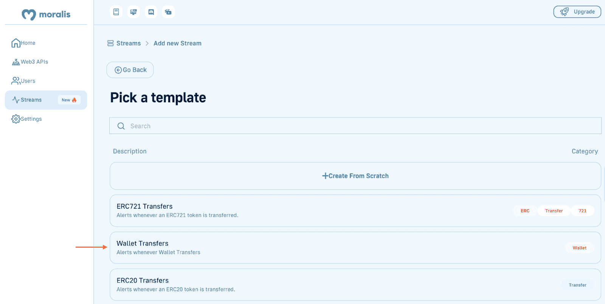
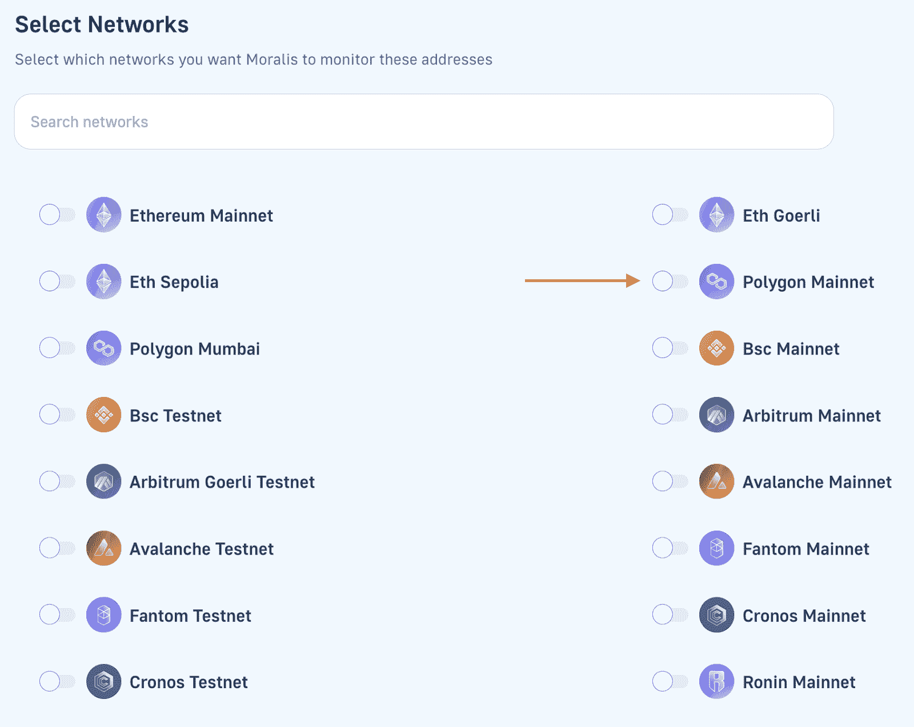

# 多边形网页钩子–如何在多边形上使用网页钩子

> 原文：<https://moralis.io/polygon-webhooks-how-to-use-webhooks-on-polygon/>

当创建一个多边形网页挂钩时，使用最好的开发工具是至关重要的。这就是 Moralis 的 Web3 Streams API 提供更加无缝的开发人员体验的原因，它允许您设置多边形 webhooks，将区块链数据瞬间传输到项目后端！


如果你跟随本教程并完成必要的步骤，你将学会在多边形上创建 webhooks 的有效方法。此外，使用 Moralis 的 Streams API，您可以通过两种方式设置多边形 webhooks:

*   程序化
*   通过 Moralis 的管理面板

如果你想直接跳到教程，向下滚动到“*如何设置和使用 Polygon Webhooks with Moralis* ”部分！此外，您将在下面的代码片段中找到以编程方式设置多边形 webhook 的完整代码:

```js
import Moralis from 'moralis';
import { EvmChain } from "@moralisweb3/evm-utils";

Moralis.start({
  apiKey: 'YOUR_API_KEY',
});

const stream = {
  chains: [EvmChain.ETHEREUM, EvmChain.POLYGON], // List of blockchains to monitor
  description: "monitor Bobs wallet", // Your description
  tag: "bob", // Give it a tag
  webhookUrl: "https://YOUR_WEBHOOK_URL", // Webhook URL to receive events
}

const newStream = await Moralis.Streams.add(stream);
const { id } = newStream.toJSON(); // { id: 'YOUR_STREAM_ID', ...newStream }

// Now we attach Bobs address to the stream
const address = "0x68b3f12d6e8d85a8d3dbbc15bba9dc5103b888a4";

await Moralis.Streams.addAddress({ address, id });
```

[**Sign Up and Start Using Polygon Webhooks**](https://admin.moralis.io/register)

### 概观

dapps(分散应用程序)和传统的 Web2 平台都需要高效的跨系统通信，以实现最佳功能并提供更高的用户价值。而且，平台有几种传播手段；然而，最有效的方法是通过 webhooks。由于 webhooks 在 web 生态系统中扮演着如此重要的角色，开发人员需要工具来有效地设置它们，而在 Web3 中，这就是 Moralis 的 Web3 Streams API 发挥作用的地方！

有了 API，你可以在任何网络和第二层解决方案上接收 Web3 webhooks。这包括以太坊，雪崩，BNB 链，当然，多边形，我们将在本文中直接关注。如果这听起来很有趣，跟随我们教你如何用 [Moralis](https://moralis.io) 快速设置多边形网页挂钩！

如果你已经熟悉 Polygon webhooks，可以考虑在 Moralis 的 [Web3 博客](https://moralis.io/blog/)查看更多内容。该博客为新的和更有经验的开发人员提供了新鲜的内容。例如，如果游戏开发让你兴奋，我们强烈推荐我们关于[创作《我的世界》Web3 游戏](https://moralis.io/creating-a-minecraft-web3-game-take-ideas-into-production/)的文章！

然而，无论你开始什么样的 Web3 开发冒险，[都要和 Moralis](https://admin.moralis.io/register) 签约！Moralis 优秀的[web 3 API](https://moralis.io/web3-apis-exploring-the-top-5-blockchain-apis/)提供了更加无缝的开发者体验，让您充分利用区块链技术的力量！

## 什么是 Webhooks，它们与 Web3 Webhooks 相比如何？

在仔细研究 Web3 webhooks 之前，这第一部分深入探讨了传统 webhooks 的复杂性。因此，我们将通过回答问题“什么是 webhooks？”来开始这个多边形 webhooks 教程。

在一个高度互联的在线空间中，系统和应用程序必须拥有高效通信的手段。否则，由于网络的基础设施是以连接性为核心特征构建的，系统将无法以最佳方式运行。这就是 webhooks 出现的原因，因为它们代表了系统通信的最有效方式之一。

然而，webhooks 是基于源系统(发送方)中触发的特定事件发送到目标系统(接收方)的 HTTP 请求。因此，当特定事件发生时，源系统会通知目标系统。此外，除了通知之外，webhooks 通常还包含“请求有效载荷”，其中包含关于事件的附加信息。


现在，在简要了解了 webhooks 以及它们为什么有用之后，让我们看看它们在 Web3 的上下文中意味着什么！

### Web3 Webhooks

Web3 webhooks 与传统的 webhooks 有着相同的用途:支持跨系统通信。然而，由于 Web3 基于区块链基础设施并运行在智能合约上，两者之间有一些根本的区别。因此，区块链开发者使用 Web3 webhooks 收听区块链事件。这可以是从钱包交易到更复杂的智能联系人事件的任何事情。

此外，开发人员使用 Web3 webhooks 来避免重复的任务，如持续检查区块链的状态或轮询数据库。相反，他们可以为感兴趣的智能合约事件设置 webhooks，以便在触发时自动接收请求负载。这是非常有效的，允许区块链开发者节省资源和时间。


因此，如果您要设置一个多边形 webhook，区块链(源系统)会根据您感兴趣的智能合约事件将数据发送到您指定的 webhook URL。例如，您可以使用多边形网钩来监控区块链上一定数量的转移。在这种情况下，每当传输超过 100，000 美元时，您就会收到一个多边形 webhook！

因此，正如你所想象的，能够轻松地设置 Web3 webhooks 对开发者来说是非常有益的，最容易的方法是用 Moralis 的 Streams API 设置 [Web3 streams](https://web3streams.com/) 。如果这听起来很有趣，请加入我们，我们将向您展示如何创建与上面的例子功能相似的多边形 webhooks！

## 探索多边形的最终 Webhook 解决方案

在开发 dapps(分散应用程序)和其他 Web3 项目时，您需要一种方法来轻松访问链上数据，这对于提供引人注目的用户体验至关重要。然而，从传统的角度来看，这是一个麻烦，因为它需要建立复杂的数据管道，运行错误的 RPC 节点，构建抽象等等。幸运的是，多亏了 Moralis 的 [Web3 Streams API](https://moralis.io/streams/) ，这种情况再也不会发生了！


使用 Streams API，您可以通过 Web3 webhooks 轻松地将链上数据实时传输到 Web3 项目的后端。这是 Moralis 基础设施的主干，但是它实际上是如何工作的呢？

1.  你先提供一个地址。如果是智能合约地址，则列出您感兴趣的事件。
2.  选择确定何时接收网页挂钩的过滤器。
3.  指定要监控的区块链。
4.  添加您的 webhook URL。
5.  当事件根据您的过滤器/条件触发时，获取 webhooks 并请求有效负载。

### 可以查询哪些链上数据？

在向您展示 Moralis 的 Streams API 如何工作之前，本节将简要提供关于使用该 API 可以获取什么类型的[链上数据](https://moralis.io/on-chain-data-the-ultimate-guide-to-understanding-and-accessing-on-chain-data/)的附加信息。本文概述了 Streams API 的能力，并举例说明了如何在您的开发工作中进一步使用 Polygon webhooks。然而，这里有几个例子可以说明何时可以将事件流式传输到应用程序的后端:

*   有人参与你的代币销售。
*   特定地址发送、接收、交换、下注或烧毁资产。
*   当某个资产被交换、标桩、发送、接收等时。
*   一场战斗在你的游戏中开始。

然而，上面的四个要点只是几个例子，您可以接收基于您的条件/过滤器触发的任何其他智能合约事件的 webhooks。然而，如果你想知道更多关于设置 webhooks 的信息，请继续阅读，因为接下来的部分说明了如何使用 Moralis 的 Streams API 创建多边形 webhooks！

## 如何使用 Moralis 设置和使用多边形 Webhooks

现在你对 Web3 webhooks 和 Moralis 的 Web3 Streams API 已经比较熟悉了，下面几节将向你展示如何在 Polygon 上设置 webhooks。Streams API 是 Moralis 基础设施的主干，允许您轻松创建多边形 webhooks。因此，如果你跟着做，你将会学到你需要知道的一切，把链上的数据流入所有未来的 Web3 项目的后端！


当使用 Moralis 时，您有两种选择来创建流以在 mainnet 和 Mumbai testnet 上接收多边形 webhooks:

*   **以编程方式**–您可以使用 Moralis SDK 或 API 以编程方式创建流，以接收 Polygon 上的 webhooks。
*   **使用 Moralis 的管理面板**–您还可以选择创建流，通过 Moralis 的 web UI 接收多边形 webhooks。

以下部分提供了使用这两种方法在多边形网络上设置 webhooks 的全面演练。为了说明 Moralis 的 Streams API 的可访问性，您将学习创建一个多边形 webhook，用于根据地址监控 [Web3 wallet](https://moralis.io/what-is-a-web3-wallet-web3-wallets-explained/) 的传入和传出交易。

然而，假设您跟随并学习如何设置监控钱包的一切。在这种情况下，您可以使用相同的基本原则来监控任何链上事件，并将各种数据传输到所有未来项目的后端！

现在，事不宜迟，让我们直接跳到下一节，仔细看看如何以编程方式设置多边形 webhooks！

### 程序化

首先，多边形 webhooks 教程的初始部分向您展示了如何以编程方式创建多边形 webhook。在这样做的时候，您将使用 Moralis 的 JavaScript SDK。然而，要开始，打开您喜欢的 IDE(集成开发环境)并创建一个包含 JavaScript 文件的新文件夹。接下来，打开一个新的终端并安装 Moralis 依赖项。例如，如果您正在使用 NodeJS，运行“ *npm install moralis* ”。

在设置了 JavaScript 文件并安装了依赖项之后，是时候初始化 Moralis SDK 了。为此，复制下面的代码片段，并将其添加到 JavaScript 文件的顶部:

```js
import Moralis from 'moralis';
import { EvmChain } from "@moralisweb3/evm-utils";
Moralis.start({
  apiKey: 'YOUR_API_KEY',
});
```

您将很快注意到，您需要用实际的密钥替换代码中的“ *YOUR_API_KEY* ”。要获得密钥，您需要一个 Moralis 帐户。因此，如果你还没有，[立即向 Moralis](https://admin.moralis.io/register) 注册，进入管理面板，那里有你的 Web3 API 密匙等着你！

登录 Moralis 后，导航至“Web3 APIs”选项卡。从那里，复制您的密钥，并通过替换“ *YOUR_API_KEY* ”将其添加到您的代码中:


接下来，创建一个名为" *stream"* 的新对象，并添加以下属性:链、描述、标签和 webhook URL。下面，您将看到它应该是什么样子的示例:

```js
const stream = {
  chains: [EvmChain.ETHEREUM, EvmChain.POLYGON], // List of blockchains to monitor
  description: "monitor Bobs wallet", // Your description
  tag: "bob", // give it a tag
  webhookUrl: "https://YOUR_WEBHOOK_URL", // Webhook URL to receive events,
}
```

从那里，使用“*流*”对象来调用 Moralis 家的“*”Moralis 家。Streams.add(stream)* "函数。最后，创建一个新的“{ *id* }”对象，并添加您要监视的钱包地址:

```js
const newStream = await Moralis.Streams.add(stream);
const { id } = newStream.toJSON(); // { id: 'YOUR_STREAM_ID', ...newStream }
// Now we attach Bobs address to the stream
const address = "0x68b3f12d6e8d85a8d3dbbc15bba9dc5103b888a4";
await Moralis.Streams.addAddress({ address, id });
```

最终，您的 JavaScript 文件应该看起来像这样:

```js
import Moralis from 'moralis';
import { EvmChain } from "@moralisweb3/evm-utils";

Moralis.start({
  apiKey: 'YOUR_API_KEY',
});

const stream = {
  chains: [EvmChain.ETHEREUM, EvmChain.POLYGON], // List of blockchains to monitor
  description: "monitor Bobs wallet", // your description
  tag: "bob", // give it a tag
  webhookUrl: "https://YOUR_WEBHOOK_URL", // Webhook URL to receive events,
}

const newStream = await Moralis.Streams.add(stream);
const { id } = newStream.toJSON(); // { id: 'YOUR_STREAM_ID', ...newStream }

// Now we attach bobs address to the stream
const address = "0x68b3f12d6e8d85a8d3dbbc15bba9dc5103b888a4";

await Moralis.Streams.addAddress({ address, id });
```

这涵盖了如何用 Moralis 以编程方式设置一个多边形 webhook！剩下的工作就是打开终端，用文件名运行下面的代码:

```js
node “FILE_NAME”
```

### 通过 Moralis 的网络用户界面

本节将向你展示如何通过 Moralis 的网络用户界面设置多边形网络钩子。你首先需要的是一个 Moralis 账户。因此，如果你还没有，第一步是注册 Moralis。一旦你有了一个帐户，访问以下网页:“[*【https://admin.moralis.io/streams】*](https://admin.moralis.io/streams)”。

点击该链接会将您带到 Moralis 管理面板，在那里，通过点击“+ New Stream”按钮继续操作:


按下上面的按钮，您将有两个选择:从头开始创建流或使用模板。由于您想要监控特定的 Web3 钱包，因此可以使用已经准备好的“钱包转账”选项:



单击模板后，您需要输入您要监控的钱包的地址:


在那里，点击“下一步”,并添加描述、您的 webhook URL 和标签:


接下来，选择您希望监控的链。由于这是一个多边形 webhooks 的教程，请确保包括多边形 mainnet 作为一个备选方案:



选择完网络后，您需要选择地址活动。这决定了您希望 Moralis 自动为您解析哪些活动:


最重要的是，向下滚动并点击“创建流”按钮！就是这样！这涵盖了使用 Moralis 的 web UI 通过 Polygon webhook 创建流的整个过程！

### 必需的多边形测试网钩

不管你是通过编程还是通过 Moralis 的网络用户界面来创建多边形网络钩子；当启动一个新的流时，您将总是收到一个多边形测试 webhook。因此，要使流完全运行，您必须返回状态代码 200。您可以在下面找到测试主体:

```js
{
  "abi": {},
  "block": {
    "hash": "",
    "number": "",
    "timestamp": ""
  },
  "txs": [],
  "txsInternal": [],
  "logs": [],
  "chainId": "",
  "tag": "",
  "streamId": : "",
  "confirmed": true,
  "retries": 0,
  "erc20Approvals": [],
  "erc20Transfers": [],
  "nftApprovals": [],
  "nftTransfers": []
}
```

当您返回状态代码时，它应该设置您的流，使它们完全正常工作。因此，当您监控的钱包地址发送或接收资产时，您将收到一个多边形 webhook，包括一个请求有效负载！

尽管如此，如果你已经加入了我们，你现在应该能够以编程的方式创建流，并通过 Moralis 的 web UI 来设置多边形 webhooks。此外，您现在已经熟悉了 Moralis 的 Web3 Streams API，并且可以使用 Polygon webhooks 将链上数据传输到您未来所有区块链项目的后端！

如果您对 Streams API 有进一步的疑问，您可以在这里找到官方文档。此外，如果在本教程中出现任何问题，请考虑加入 Moralis 不和谐频道。在那里，您可以从我们有才华的社区工程师那里获得帮助！

## 总结–如何使用多边形网络挂钩

本文向您介绍了 webhooks 的复杂性以及它们在 Polygon 环境中的含义。您还了解了如何通过 Moralis 的 Web3 Streams API 为链上数据流创建多边形 webhooks。事实上，您可以使用以下步骤创建多边形 webhook:

1.  提供一个链上地址。如果是智能合同地址，则列出您想要监控的事件。
2.  选择确定何时接收多边形网钩的条件。
3.  指定要监控的网络。
4.  添加 webhook URL。
5.  当事件基于您的过滤器触发时接收 webhooks。

本教程的大部分可访问性源自 Moralis 的 Streams API。也就是说，这只是 Moralis 提供的许多企业级 API 中的一个，Moralis 的所有工具都有助于实现最好的 [Web3 基础设施](https://moralis.io/web3-infrastructure-exploring-the-best-solution-for-web3-development/)。如果你想了解更多这方面的知识，你可以，例如，查看 Moralis 的 [Solana API](https://moralis.io/solana-api/) 。这个工具使 Solana 开发更加简单，使您能够更有效地为网络构建 dapps 和令牌。有关 Solana 开发的更多信息，请考虑阅读我们关于 [Solana 智能合同示例](https://moralis.io/solana-smart-contract-examples-for-developers/)或 [Solana 智能合同构建](https://moralis.io/solana-smart-contract-building/)的文章！

此外，如果你想成为一名更熟练的区块链开发者，可以考虑报名参加 Moralis 学院。该学院提供一些业内最好的发展课程。例如，如果你是 Web3 领域的新手，从以下课程开始你的旅程:“[区块链&比特币 101](https://academy.moralis.io/courses/blockchain-bitcoin-101) ”。


尽管如此，请立即与 Moralis 签约，开始更智能、更高效地构建 dapps！此外，创建你的 Moralis 账户是免费的，所以你不会有任何损失！