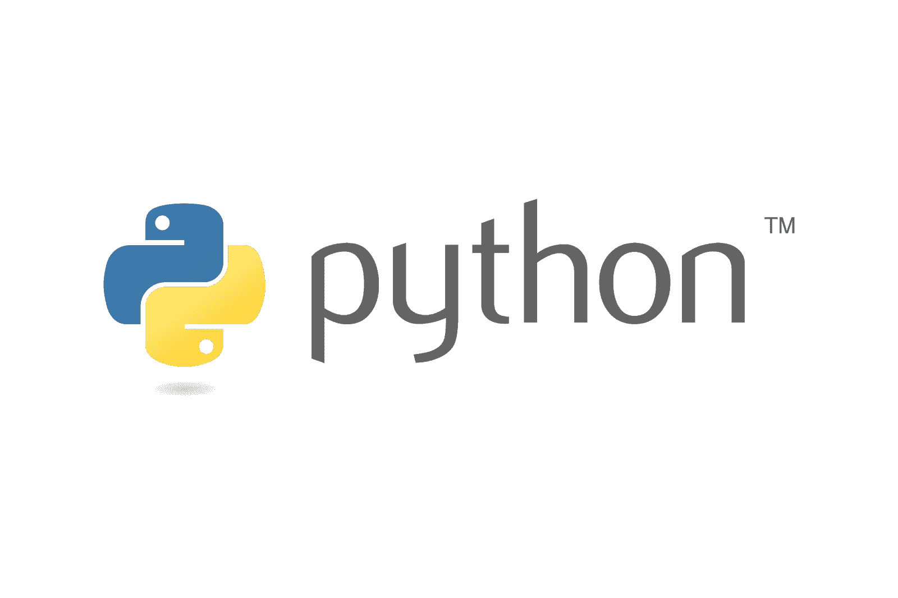
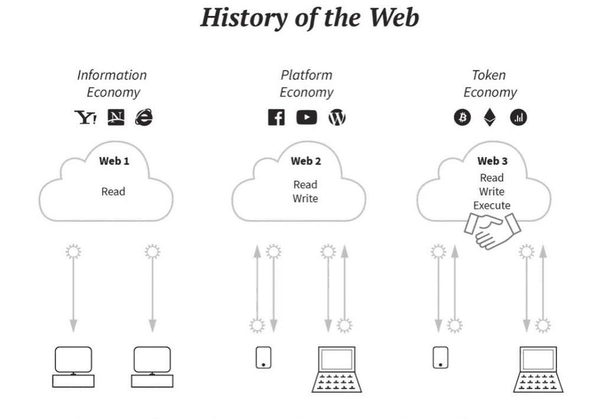
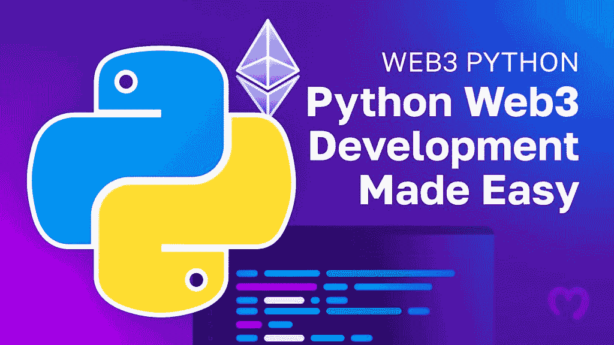
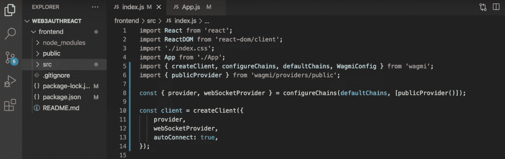

# Python 和 Web3——区块链开发的 web 3 和 Python 教程

> 原文：<https://moralis.io/python-and-web3-a-web3-and-python-tutorial-for-blockchain-development/>

**你对 Web3 Python 开发感兴趣吗？如果是这样，Moralis 的 Python SDK 是您的首选！有了这个开发工具包，您可以在任何 Python 应用程序中无缝地实现 Web3 功能，只需两个简单的步骤:**

1.  使用下面的终端命令安装 Moralis Python SDK:

```js
pip install moralis
```

2.  进行 Moralis Web3 API 调用。下面是查询 Web3 钱包的本机余额的示例:

```js
from moralis import evm_api

api_key = "YOUR_API_KEY"

params = {
    "address": "0xd8da6bf26964af9d7eed9e03e53415d37aa96045", 
    "chain": "eth", 
}

result = evm_api.balance.get_native_balance(
    api_key=api_key,
    params=params,
)

print(result)
```

如果你想了解更多关于 Moralis 作为 Python Web3 提供者的细节，请查看官方的 [Web3 Python SDK 文档](https://docs.moralis.io/docs/your-first-dapp-python)。本页提供了一个快速教程和一些 API 调用的例子，用于获取 NFT 元数据、从一个地址获取 NFT、从一个集合获取 NFT、如何[获得所有拥有的 NFT](https://moralis.io/how-to-get-all-nfts-owned-by-an-address-3-step-process/)，等等！

### 概观

Python 是当今最成熟的编程语言之一，可以用来创建从简单的应用程序到更复杂的机器学习软件的任何东西。此外，您知道现在在 Web3 开发中使用 Python 比以往任何时候都容易吗？借助 Moralis 和 Python SDK，您可以将 Web3 功能无缝集成到任何 Python 应用程序中。如果这听起来令人兴奋，并且您想了解更多，请跟随我们进一步探索 Python 和 Web3 的复杂性！


为了说明 [Moralis](https://moralis.io) 的可访问性，本教程演示了如何创建一个 Web3 Python 应用程序，允许用户使用 MetaMask 登录。此外，由于 Python SDK，您只需三个步骤就能做到这一点:

1.  创建 Python Flask 应用程序
2.  启动 Flask 应用程序
3.  创建前端 React 应用程序

结合 Python SDK，本教程还展示了 [Auth API](https://moralis.io/authentication/) 的强大功能。然而，这只是 Moralis 的各种[web 3 API](https://moralis.io/web3-apis-exploring-the-top-5-blockchain-apis/)之一。另一个令人兴奋的例子是 [Streams API](https://moralis.io/streams/) ，它允许你通过 [Moralis webhooks](https://moralis.io/moralis-webhooks-an-introduction-to-web3-webhooks/) 将链上数据直接传输到 dapps 的后端！

尽管如此，无论你着手什么区块链项目，都要立即与 Moralis 签约。有了 Moralis，您可以更快、更智能地建造房屋，释放区块链技术的全部力量！

[**Sign Up with Moralis**](https://admin.moralis.io/register)

## 探索 Python 和 Web3

在进入本教程的主要部分之前，我们先简单介绍一下 Python 和 Web3。如果你已经熟悉这两个概念，可以直接跳到下面的“*教程:Python 和 Web3 用于区块链开发*”部分。否则，请加入我们，我们将分别分解 Python 和 Web3，以提供它们所包含的内容的概述！

### Python 是什么？

Python 是一种面向对象的高级编程语言，其语法简单易学，注重可读性。因此，学习 Python 是非常容易的，这使得它成为编程爱好者的首选。这有助于 Python 的广泛采用，也是它成为当今最常用的编程语言之一的重要原因。



此外，Python 是一种“通用”语言，这意味着它有许多不同的用例。因此，开发人员使用 Python 构建简单的应用程序来完成更复杂的工作，如机器学习。

### 什么是 Web3？

Web3，顾名思义，指的是第三代互联网。因此，它是一个包罗万象的术语，指的是网络的一个新的改进版本。最核心的是，Web3 利用加密货币、区块链和其他创新技术来创建一个去中心化的网络，以所有权的形式将权力返还给用户。

为了更好地理解 Web3，将它与互联网的前几代进行简单的比较是一个好主意。简而言之，Web1 完全是静态只读内容，而在 Web2 中，它过渡到了动态读写内容。最后，Web3 时代的目标是读写自有结构。



此外，以下是 Web3 去中心化网络的三个核心理念:

*   分散
*   本地支付
*   未经许可

有了 Python 和 Web3 的这些简要概述，让我们将它们结合起来，探索是否有可能使用 Python 进行 Web3 开发！

## Web3 可以用 Python 吗？

有没有可能用 Python 进行区块链开发？这个问题的答案是肯定的！然而，如果您直接来自传统的 Web2 开发领域，那么在开始任何 Python Web3 工作之前，您需要考虑一些微小的差异。例如，掌握“Web3.py”等库是非常有益的。这个基于 Python 的库使得与以太坊网络的交互更加无缝。


此外，还有一些其他的开发工具可以让你的 Web3 开发工作变得更加容易。如果这听起来令人兴奋，并且您想了解更多关于 Web3 Python 开发工具的知识，请加入我们的下一部分，在这里我们将探索最好的 Python Web3 提供者:Moralis！

## 在 Python 开发中使用 web 3——最佳 Python Web3 提供商

Moralis 是业界最好的 Web3 基础设施提供商之一，提供各种开发工具，如企业级 Web3 APIs、SDK 等等。有了 Moralis，就有可能释放区块链技术的全部潜力，更无缝地构建 dapps 和其他 Web3 项目！

在这些著名的 Web3 开发工具中，一个很好的例子就是 Moralis Python SDK。Moralis 的 Python SDK 是 Python 开发的终极 Web3 工具，允许您更有效和高效地创建区块链项目。


由于 Moralis 作为 Python Web3 提供者的能力，您可以将区块链功能无缝集成到所有 Python 应用程序中。此外，由于 Moralis 的跨链兼容性，您可以为多个网络创建 Web3 Python 项目，包括 Cronos、Solana、Ethereum 等等！

因此，如果您想更多地了解作为 Python Web3 提供者的 Moralis 以及这个工具是如何工作的，请加入我们的下一部分，我们将向您展示如何通过三个步骤创建一个 [Web3 Python](https://moralis.io/web3-python-python-web3-development-made-easy/) 应用程序！

## 教程:区块链开发的 Python 和 Web3

随着对 Python、Web3 和作为 Web3 Python 提供者的 Moralis 有了更深刻的理解，本节将深入到本文的中心部分，在这里我们将向您展示如何创建一个 Python 应用程序，允许用户使用他们的元掩码钱包登录。



通过学习，您将了解如何创建一个后端 Python 应用程序，实现处理 Web3 身份验证流所需的逻辑。除了后端代码，您还将设置一个 React 前端应用程序，在实践中演示身份验证机制！

此外，由于 Moralis 的 Python SDK，您只需三个步骤就可以构建这个 Web3 应用程序:

1.  创建 Python Flask 应用程序
2.  启动 Flask 应用程序
3.  创建前端 React 应用程序

然而，如果你更想看解释这个过程的视频，你可以看看下面来自 [Moralis 的 YouTube](https://www.youtube.com/@MoralisWeb3) 频道的剪辑。该视频涵盖了从开始到结束的整个过程，以视频格式提供了本教程的全面演练:

[https://www.youtube.com/embed/eIYd_FOT3Fw?feature=oembed](https://www.youtube.com/embed/eIYd_FOT3Fw?feature=oembed)

尽管如此，在开始第一步之前，下面的部分将会更仔细地看看这个应用程序的最终结果，让你知道你正在朝着什么方向努力！

### Web3 Python 应用程序–最终结果

您将在本 Python 和 Web3 教程中学习创建的应用程序相对简单，其登录页面如下所示:


如图所示，初始登录页面有一个“Python Web3 身份验证”标题和一个“登录”按钮。如果你点击这个按钮，它会启动你的元掩码，要求你连接你的 Web3 钱包。当连接元掩码时，一个新的请求被发送到 Python 应用程序的后端，提示 Moralis 的 Auth API 创建一个新的登录挑战。

接下来，应用程序发送另一个验证您签名的请求。如果匹配，并且这是您首次登录，则会生成一个新的用户 ID，显示在应用程序的用户页面上:


此外，一旦您成功验证了自己的身份，它会自动添加一个新用户(附带 ID)到您的 Moralis 管理面板上的“用户”选项卡:


这涵盖了我们的 Web3 Python 应用程序的演示！所以，现在你已经更好地理解了应用程序的工作方式和你的目标，让我们直接进入第一步，向你展示如何为后端创建 Python Flask 应用程序！

### 步骤 1:创建 Python Flask 应用程序

首先，您需要做的第一件事是在您的集成开发环境(IDE)中建立一个新的 Web3 Python 项目。对于本教程，我们将使用 Visual Studio 代码(VSC)来说明这一过程。因此，如果您选择另一种方法，请注意有些步骤可能偶尔会有所不同。

然而，启动您的 IDE，创建一个新的项目文件夹，并打开一个新的终端。如果您正在使用 VSC，您可以通过单击界面顶部的“终端”选项卡，然后单击“新终端”来启动新的终端:


接下来，将“ *cd* ”放到项目的根文件夹中，并在您的终端中运行以下命令:

```js
python3 -m venv venv
```

运行上面的命令会创建一个新的虚拟环境，现在您应该会在本地目录中找到一个新的“ *venv* 文件夹:


在那里，使用下面的命令初始化环境:

```js
source venv/bin/activate
```

初始化虚拟环境后，通过在终端中运行以下输入，确保您拥有最新版本的" *pip"* :

```js
pip install --upgrade pip
```

最重要的是，您需要安装所需的依赖项。对于本教程，总共有三个，您可以在下面找到安装它们的命令。分别输入，然后按顺序运行:

```js
pip install flask
```

```js
pip install flask_cors
```

```js
pip install moralis
```

#### 烧瓶应用代码

随着项目初始设置的完成，是时候关注代码了。因此，本节将向您展示如何为 Web3 Python 应用程序添加必要的端点和函数！

首先，在项目的根文件夹中创建一个新的“app.py”文件。打开文件并在顶部添加依赖项的导入:

```js
from flask import Flask
from flask import request
from moralis import auth
from flask_cors import CORS
```

在导入下面，初始化应用程序，并通过添加以下代码片段将其包装在“ *CORS* 中:

```js
app = Flask(__name__)
CORS(app)
```

接下来，为 Moralis API 键添加一个新变量:

```js
api_key = "xxx"
```

现在您可能已经发现，您需要用您实际的键的值替换“ *xxx* ”。因此，如果你还没有，[向 Moralis](https://admin.moralis.io/register) 注册，因为你需要一个账户来获取密钥。拥有帐户后，登录，点击“Web3 APIs”选项卡，复制密钥，并将其输入代码:


最后，添加以下两条路线:

*   "***/request challenge***"–当用户验证自己时，他们向 Moralis 请求挑战，这是通过这个初始路径完成的。“ */requestChallenge* ”路由包含一个“ *reqChallenge()* ”函数，该函数获取请求参数，添加一个“ *body* ”变量，从“ */requestChallenge* ”端点获取结果，最后将结果传递给客户端:

```js
@app.route('/requestChallenge', methods=["GET"])
def reqChallenge():

    args = request.args
    body = {
        "domain": "my.dapp", 
        "chainId": args.get("chainId"), 
        "address": args.get("address"), 
        "statement": "Please confirm login", 
        "uri": "https://my.dapp/", 
        "expirationTime": "2023-01-01T00:00:00.000Z", 
        "notBefore": "2020-01-01T00:00:00.000Z", 
        "resources": ['https://docs.moralis.io/'], 
        "timeout": 30, 
    }

    result = auth.challenge.request_challenge_evm(
        api_key=api_key,
        body=body,
    )

    return result
```

*   "***/verify challenge***"–一旦用户在消息上签名，结果就会被发送到应用程序的后端，并使用第二种方法进行验证。“ */verifyChallenge* ”路由包含“ *verifyChallenge()* ”函数，负责获取请求参数，添加“ *body* ”变量，从 Moralis Auth API 端点获取结果，并将结果传递给客户端:

```js
@app.route('/verifyChallenge', methods=["GET"])
def verifyChallenge():

    args = request.args
    body={
        "message": args.get("message"), 
        "signature": args.get("signature"),
    }

    result = auth.challenge.verify_challenge_evm(
        api_key=api_key,
        body=body
    )

    return result
```

此外，添加下面的代码片段，指定您希望运行应用程序的位置:

```js
if __name__ == "__main__":
    app.run(host="127.0.0.1", port=3000, debug=True)
```

涵盖了 Web3 Python Flask 应用程序代码！总而言之,“app.py”文件现在看起来应该是这样的:

```js
from flask import Flask
from flask import request
from moralis import auth
from flask_cors import CORS

app = Flask(__name__)
CORS(app)

api_key = "xxx"

@app.route('/requestChallenge', methods=["GET"])
def reqChallenge():

    args = request.args
    body = {
        "domain": "my.dapp", 
        "chainId": args.get("chainId"), 
        "address": args.get("address"), 
        "statement": "Please confirm login", 
        "uri": "https://my.dapp/", 
        "expirationTime": "2023-01-01T00:00:00.000Z", 
        "notBefore": "2020-01-01T00:00:00.000Z", 
        "resources": ['https://docs.moralis.io/'], 
        "timeout": 30, 
    }

    result = auth.challenge.request_challenge_evm(
        api_key=api_key,
        body=body,
    )

    return result

@app.route('/verifyChallenge', methods=["GET"])
def verifyChallenge():

    args = request.args
    body={
        "message": args.get("message"), 
        "signature": args.get("signature"),
    }

    result = auth.challenge.verify_challenge_evm(
        api_key=api_key,
        body=body
    )

    return result

if __name__ == "__main__":
    app.run(host="127.0.0.1", port=3000, debug=True)
```

### 步骤 2:启动 Flask 应用程序

现在您已经添加了 Web3 Python 应用程序代码，您需要启动项目。因此，打开一个新的终端并运行以下命令:

```js
python3 app.py
```

现在就是这样！您的 Web3 Python Flask 应用程序应该在您在上一步中指定的本地主机 3000 上启动！

但是，如果您计划向公众发布应用程序，添加错误处理可能是个好主意。不幸的是，这超出了本文的范围。所以，如果你想超越自我，你必须自己弄清楚这一点。

尽管如此，现在您已经启动了 Web3 Python 后端应用程序，让我们更仔细地看看前端！

### 步骤 3:创建前端 React 应用程序

由于这是一个 Python 和 Web3 教程，本节将简要地向您展示如何快速设置一个 React 前端应用程序，您可以从该应用程序调用端点来处理 Web3 身份验证。我们不会讨论这个应用程序如何工作的细节。但是，如果你对此感兴趣，可以看看上一节的视频。

然而，为了尽可能简单明了，我们将使用已经准备好的应用程序模板:

**Python 和 Web3 应用文档—[https://github . com/moralisweb 3/YouTube-tutorials/tree/main/web 3 auth Python](https://github.com/MoralisWeb3/youtube-tutorials/tree/main/Web3AuthPython)T3】**

要设置 React 应用程序，请访问上面的 GitHub 存储库并将项目克隆到您的本地目录。这样做应该会提供一个类似于下面打印屏幕中的文件结构:



一旦您有了项目的本地副本，您现在应该能够启动 React 应用程序了。因此，打开一个终端，将" *cd* "放入项目的根文件夹，输入以下命令，然后按 enter 键:

```js
npm run start
```

这涵盖了整个“ *Python 和 Web3* ”教程！如果您已经学习了这么多，现在应该能够创建一个 Web3 Python 应用程序来处理 Web3 身份验证流了！

此外，您现在可以使用相同的基本原则来添加其他 Web3 Python 后端功能。如果你想了解更多关于这一点以及作为 Web3 Python 提供者的 Moralis 的能力，请查看我们的官方 [Web3 Python SDK 文档](https://docs.moralis.io/docs/your-first-dapp-python)。

## 总结——如何结合 Python 和 Web3

本教程通过探索作为 Web3 Python 提供者的 Moralis，教您如何向任何 Python 应用程序添加 Web3 功能。为了说明这个过程，本文演示了如何创建一个简单的 Python 应用程序。此外，通过该应用程序，用户可以使用 MetaMask 登录。此外，多亏了 Moralis 和 Python SDK，您只需三个步骤就能创建这个项目:

1.  创建 Python Flask 应用程序
2.  启动 Flask 应用程序
3.  创建前端 React 应用程序

结合 Python SKD，您使用了 Moralis 的 Auth API 来添加元掩码登录功能。然而，MetaMask 只是 Auth API 支持的众多 wallet 连接器之一。如果你想探索其他选择，查看 Moralis 的 [Web3 博客](https://moralis.io/blog/)获取更多文章。例如，了解如何在[添加比特币基地钱包登录功能](https://moralis.io/how-to-add-coinbase-wallet-login-functionality/)或[使用 RainbowKit 添加登录功能](https://moralis.io/how-to-add-a-sign-in-with-rainbowkit-to-your-project-in-5-steps/)。

此外，如果你想成为一名更熟练的 Web3 开发者，可以考虑加入 Moralis 学院。例如，通过“[以太坊 101](https://academy.moralis.io/courses/ethereum-101) ”课程学习 Web3 开发的基础知识。或者，通过“ [React Web 开发 101](https://academy.moralis.io/courses/react-web-development-101) ”了解您需要了解的所有 React 知识！


尽管如此，[还是与 Moralis](https://admin.moralis.io/register) 签约，以更无缝地创建兼容区块链的 Python 应用程序。创建一个帐户只需要几秒钟，而且完全免费！