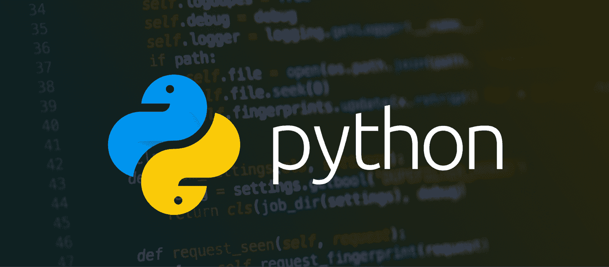
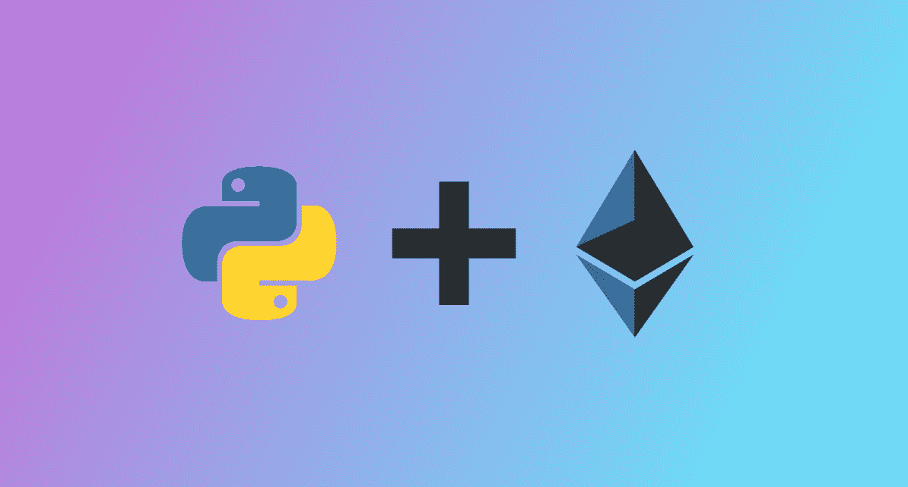
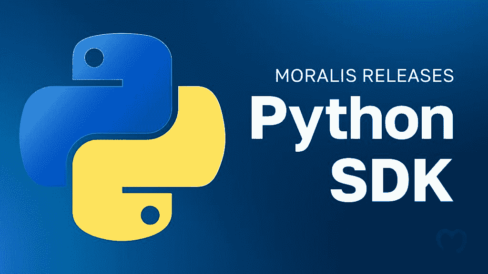

# 用于以太坊开发的 Python–构建一个 Web3 以太坊 Python 应用程序

> 原文：<https://moralis.io/python-for-ethereum-development-build-a-web3-ethereum-python-app/>

你想进入 Web3 以太坊 Python 开发吗？如果是这样，你应该熟悉一下 Moralis 的 Python SDK！有了这个开发工具包，您只需两步就可以将区块链功能无缝集成到您的所有 Python 项目中:

1.  使用以下终端命令安装 Moralis 的 Python SDK:

```js
pip install moralis
```

2.  进行 Moralis API 调用。下面是一个查询 NFT 元数据的示例:

```js
import json
from moralis import evm_api

api_key = "YOUR_API_KEY"

params = {
    "address": "0xb47e3cd837dDF8e4c57F05d70Ab865de6e193BBB", 
    "token_id": "3931", 
    "chain": "eth", 
    "format": "decimal", 
    "normalizeMetadata": True, 
}

result = evm_api.nft.get_nft_metadata(
    api_key=api_key,
    params=params,
)

print(json.dumps(result, indent=4))
```

如果你想要更多关于 SDK 的例子和细节，查看 Moralis 的官方 [Web3 Python SDK 文档](https://docs.moralis.io/docs/your-first-dapp-python)。否则，请加入我们的教程，因为我们涵盖了构建 Web3 以太坊 Python 应用程序所需的所有步骤，以展示 SDK 的作用！

### 概观

Python 是当今最流行的编程语言之一，在本教程中，我们将向您展示如何使用 [Moralis](https://moralis.io) 将 Web3 和区块链功能集成到 Python 项目中。具体来说，您将学习如何创建一个应用程序，让用户可以用他们的 Web3 钱包登录。此外，您将学习如何使用 Python 处理 Web3 身份验证流。多亏了 Moralis 的 Python SDK，您将能够只通过三个简单的步骤来创建这个应用程序:

1.  构建一个 Python Flask 应用程序
2.  启动应用程序
3.  设置 React 前端应用程序

在深入本教程的中心部分之前，我们将通过探索 Python 的复杂性来介绍基础知识。反过来，您将发现编程语言需要什么，以及为什么开发人员使用 Python 进行以太坊开发。但是，如果您已经熟悉这一点，可以直接跳到本文的“*用 Moralis* 构建 Web3 以太坊 Python 应用程序”一节！

结合 Python SDK，您还将了解更多关于 Moralis 的 [Auth API](https://moralis.io/authentication/) ，它用于集成元掩码认证。此外，由于 Auth API，您可以只使用一个代码片段集成许多其他身份验证方法。如果这听起来很有趣，请查看我们的指南，了解如何[添加比特币基地钱包登录功能](https://moralis.io/how-to-add-coinbase-wallet-login-functionality/)或[使用 RainbowKit 添加登录功能](https://moralis.io/how-to-add-a-sign-in-with-rainbowkit-to-your-project-in-5-steps/)。

然而，在继续之前，[向 Moralis](https://admin.moralis.io/register) 注册，因为你需要一个账户来跟进。有了帐户，你可以在所有未来的 Web3 开发工作中充分利用区块链技术的力量！

## 探索 Python 开发

Python 是全世界开发者使用的最流行的编程语言之一。它直观且易于使用，是新手和有经验的开发人员的首选之一。而且，Python 是一种所谓的“通用”语言。因此，它有许多不同的用例！



事实上，Python 可以用于从机器学习到创建简单应用程序的任何事情，这里有几个其他的例子:

*   数据科学
*   Web 开发
*   电脑图形图像
*   游戏开发
*   安全测试

大量的用例表明 Python 相对灵活，这是该语言最显著的优势之一。因此，有可能在几个不同的行业中使用 Python，从金融和贸易到科学和数学计算。因此，精通 Python 是非常有益的，因为它打开了许多大门和发展机会。

尽管如此，让我们在下一节中更深入地研究这种编程语言，以便更好地理解它，在下一节中，我们简要地回答这个问题，“什么是 Python？”。

## python——它是什么？

Python 具有动态语义、高级数据结构、动态类型、动态绑定等特性。此外，它是一种高级的面向对象编程语言，具有强调可读性的简单易学的语法。因此，它是最容易学习的语言之一，这也是 Python 被广泛采用的原因之一。


Python 有很多好处和优势。在下面的列表中，你会发现三个优秀的例子:

*   **模块和库**–Python 支持包和模块，支持代码重用和程序模块化。

*   社区(Community)——这种编程语言有一个庞大的开发者社区，贡献了大量的库和模块。

*   **开源**——Python 是开源的。因此，您可以免费使用和分发该语言，包括在商业环境中。

正如我们在上一节中提到的，Python 是一种所谓的通用编程语言。因此，它有丰富的用例，从创建简单的应用程序到机器学习。

以上是 Python 的简要概述。在下一节中，我们将仔细研究为什么应该使用 Python 进行以太坊开发！

## 为什么要用 Python 进行以太坊开发？

为了理解开发人员为什么使用 Python 进行以太坊开发，我们需要回到这种编程语言的好处。因此，让我们探讨一下 Python 在 Web3 开发中的三个优势！



1.  **简单易学**–正如我们之前提到的，Python 是一种直观的编程语言。因此，Web3 开发者很容易学习和快速掌握，使得经验较少的开发者更容易为区块链生态系统做出贡献。

2.  **Python 可以编译或不编译**–Python 简化了 Web3 开发人员的生活，因为它是一种脚本语言，这意味着它不需要编译就能被机器理解。

3.  **包和库**–以太坊开发选择 Python 的另一个原因是该语言提供免费的包和库。因此，开发人员可以很容易地使用 Python 编写兼容 Web3 的代码。

上面的好处只是几个例子，还有其他几个你应该使用 Python 进行以太坊开发的原因。一定要自己探索它们！

## 如何开始

进入 Web3 以太坊 Python 开发最简单的方法是使用 Moralis。Moralis 是最好的 Web3 基础设施提供商之一，提供企业级开发工具，如 SDK、[web 3 API](https://moralis.io/web3-apis-exploring-the-top-5-blockchain-apis/)等。在这些令人惊叹的开发工具中，你会发现 Moralis 的 Python SDK！



SDK 是终极以太坊开发工具，允许您将 Web3 功能无缝集成到所有 Python 项目中。此外，由于 Moralis 的互操作能力，您可以将这个开发工具包与任何其他 Web3 APIs 结合起来，在多个链上创建更复杂的项目。此外，Python SDK 有许多用例，包括获取本机余额、来自集合的所有 NFT、来自钱包的 NFT、NFT 元数据等等。因此，有了 SDK，您的 Web3 以太坊 Python 开发工作变得更加容易！

尽管如此，如果您想了解 Python SDK 如何工作的更多信息，请继续阅读下一节，我们将向您展示如何用 Moralis 通过三个步骤构建一个 Web3 以太坊 Python 应用程序！

## 用 Moralis 构建一个 Web3 以太坊 Python 应用

现在，您已经对 Web3 Ethereum Python 开发入门所需的工具更加熟悉了，本节将向您展示如何创建一个简单的 Web3 Python Flask 应用程序。该应用程序负责处理身份验证流，允许用户使用他们的元掩码钱包登录。结合 Python Flask 应用程序，您还将学习如何快速设置一个 React 前端应用程序来测试正在运行的 auth 流。然而，多亏了 Moralis 和 Python SDK，您只需三个步骤就可以创建这个应用程序:

1.  构建一个 Python Flask 应用程序
2.  启动应用程序
3.  设置 React 前端应用程序

通过完成以上步骤，您可以立即创建一个简单的 Web3 以太坊 Python Flask 应用程序！此外，您将学习如何处理 Web3 身份验证流，以及如何通过 Python Flask 服务器应用程序进行 API 调用。由此，您可以在未来的开发工作中应用相同的原则，无缝地将各种身份验证方法添加到您所有的 Web3 项目中！


尽管如此，在进入本教程的第一步之前，接下来的部分将仔细检查您将要创建的应用程序。这样做会让你更深刻的了解自己在朝着什么方向努力！

### 演示–web 3 以太坊 Python 应用程序如何工作？

在进入本教程的第一步之前，本节提供了一个 Web3 以太坊 Python 应用程序的快速演示。因此，你会更好地理解我们的工作目标。尽管如此，这是应用程序的登录页面:


登录页面有两个元素:一个“Python Web3 身份验证”标题和一个“登录”按钮。按下“登录”按钮将自动提示您的 MetaMask 钱包，要求您签署一条消息。当您成功连接您的帐户时，一个“挑战”请求被发送到应用程序的后端，要求 Moralis 的 Auth API 创建一个新的 Web3 登录挑战。

接下来，应用程序会发送一个额外的请求来验证签名。如果匹配，它会自动生成一个新的 ID，并显示给用户:


该应用程序还使用该 ID 生成一个新用户，并将其添加到 Moralis 中的“用户”选项卡中:


基本就是这样！如果您有兴趣学习如何创建类似的项目，请加入我们的“ *Web3 Ethereum Python* ”教程的第一步，我们将向您展示如何创建 Python Flask 应用程序！

### 步骤 1–构建 Python Flask 应用程序

本教程的初始步骤包括两个部分。首先，我们将向您展示如何设置项目。其次，我们将介绍 Python Flask 应用程序代码。所以，事不宜迟，让我们更仔细地看看如何设置项目！

首先，打开您喜欢的集成开发环境(IDE)并创建一个新的项目文件夹。在我们的例子中，我们将使用 Visual Studio 代码(VSC)。但是，您可以选择您最熟悉的 IDE。

现在您已经有了一个项目文件夹，打开一个新的终端。如果您也选择了 VSC，您可以点击顶部的“终端”，然后点击“新终端”:


一旦您启动了一个新的终端，将" *cd* "放到项目的根文件夹中，并运行下面的命令来创建一个新的虚拟环境:

```js
python3 -m venv venv
```

这将在您的本地目录中提供一个新的“venv”文件夹:


从那里，您现在需要初始化环境，这可以通过运行以下终端命令来完成:

```js
source venv/bin/activate
```

接下来，确保您拥有最新的" *pip* "版本。您可以通过在终端中输入以下内容并按 enter 键来检查当前版本并安装任何最新的更新:

```js
pip install --upgrade pip
```

最重要的是，通过依次运行以下三个终端输入来安装所有必需的依赖项:

```js
pip install flask
```

```js
pip install flask_cors
```

```js
pip install moralis
```

#### Web3 以太坊 Python 应用代码

项目设置完毕后，是时候添加应用功能所需的端点和功能代码了。因此，首先，在项目的根文件夹中创建一个新的“app.py”文件。从那里，打开文件并在顶部添加所需的依赖项:

```js
from flask import Flask
from flask import request
from moralis import auth
from flask_cors import CORS
```

然后，您可以添加下面的代码来初始化应用程序，并将其包装在“ *CORS* ”中:

```js
app = Flask(__name__)
CORS(app)
```

接下来，添加您的 Moralis API 密钥:

```js
api_key = "xxx"
```

确保将代码中的“ *xxx* ”替换为您实际的 Web3 API 密钥，如果您拥有 Moralis 帐户，则可以获得该密钥。所以，如果你还没有，那么[向 Moralis 家](https://admin.moralis.io/register)报名吧。然后，登录 Moralis 管理面板，导航到“Web3 APIs”选项卡，复制密钥，并将其输入代码:


从那里，您需要添加两条路线:“*/请求挑战*和“*/验证挑战*”。

*   "***/request challenge***"–初始路由称为" */requestChallenge* "，每当用户想要进行身份验证时，都会创建一个新的请求挑战。路由的中心部分是" *reqChallenge()* "函数，它获取请求参数，创建一个名为" *body* 的新变量，获取" */requestChallenge* "端点结果，并最终将其传递给客户端:

```js
@app.route('/requestChallenge', methods=["GET"])
def reqChallenge():

    args = request.args
    body = {
        "domain": "my.dapp", 
        "chainId": args.get("chainId"), 
        "address": args.get("address"), 
        "statement": "Please confirm login", 
        "uri": "https://my.dapp/", 
        "expirationTime": "2023-01-01T00:00:00.000Z", 
        "notBefore": "2020-01-01T00:00:00.000Z", 
        "resources": ['https://docs.moralis.io/'], 
        "timeout": 30, 
    }

    result = auth.challenge.request_challenge_evm(
        api_key=api_key,
        body=body,
    )

    return result
```

*   "***/verify challenge***"–一旦用户在客户端签署了消息，第二条路径就负责验证挑战。此外，“ */verifyChallenge* ”包含一个“ *verifyChallenge()* ”函数，负责从请求端点获取参数，创建另一个“ *body* ”变量，从 Auth API 获取结果，并最终将结果传递给客户端:

```js
@app.route('/verifyChallenge', methods=["GET"])
def verifyChallenge():

    args = request.args
    body={
        "message": args.get("message"), 
        "signature": args.get("signature"),
    }

    result = auth.challenge.verify_challenge_evm(
        api_key=api_key,
        body=body
    )

    return result
```

最后，在两条路线之后添加下面的代码，以指定您希望运行应用程序的位置:

```js
if __name__ == "__main__":
    app.run(host="127.0.0.1", port=3000, debug=True)
```

这就是全部的代码！您的“app.py”文件现在应该看起来像这样:

```js
from flask import Flask
from flask import request
from moralis import auth
from flask_cors import CORS

app = Flask(__name__)
CORS(app)

api_key = "xxx"

@app.route('/requestChallenge', methods=["GET"])
def reqChallenge():

    args = request.args
    body = {
        "domain": "my.dapp", 
        "chainId": args.get("chainId"), 
        "address": args.get("address"), 
        "statement": "Please confirm login", 
        "uri": "https://my.dapp/", 
        "expirationTime": "2023-01-01T00:00:00.000Z", 
        "notBefore": "2020-01-01T00:00:00.000Z", 
        "resources": ['https://docs.moralis.io/'], 
        "timeout": 30, 
    }

    result = auth.challenge.request_challenge_evm(
        api_key=api_key,
        body=body,
    )

    return result

@app.route('/verifyChallenge', methods=["GET"])
def verifyChallenge():

    args = request.args
    body={
        "message": args.get("message"), 
        "signature": args.get("signature"),
    }

    result = auth.challenge.verify_challenge_evm(
        api_key=api_key,
        body=body
    )

    return result

if __name__ == "__main__":
    app.run(host="127.0.0.1", port=3000, debug=True)
```

### 步骤 2–启动应用程序

现在您已经为 Web3 Ethereum Python Flask 应用程序编写了所有代码，剩下的就是运行项目了。因此，再次打开一个新的终端，输入以下内容，然后按 enter 键:

```js
python3 app.py
```

就是这个！您的应用程序现在应该在" *localhost 3000* "上启动！这完全涵盖了以太坊 Python Flask 应用程序。然而，为了演示它是如何工作的并测试其功能，下一节将简要地向您展示如何设置一个可以从中调用端点的 React 应用程序！

### 步骤 3–设置一个 React 前端应用程序

本“ *Web3 以太坊 Python* ”教程的最后一步是设置一个前端 React 应用程序。这个应用程序可以调用端点，并演示 Web3 身份验证流程在实践中是如何工作的。然而，让我们仔细看看如何设置它！

为了使第三步尽可能容易实现，我们将使用一个已经开发的 React 应用程序，您可以在下面的 GitHub 资源库中找到完整的代码:

**Web3 以太坊 Python 应用文档—**[**https://github . com/moralis web 3/YouTube-tutorials/tree/main/web 3 auth Python**](https://github.com/MoralisWeb3/youtube-tutorials/tree/main/Web3AuthPython)

**您所需要做的就是访问存储库并将项目克隆到您的本地目录中。克隆项目后，您现在应该有一个类似于下图所示的文件结构:**

**

从那里，你现在可以在一个新的终端上运行" *npm run start* "来启动这个应用程序！

本文到此为止！如果还有问题或者你在教程中遇到了麻烦，请随时查看官方的 [Web3 Python SDK 文档](https://docs.moralis.io/docs/your-first-dapp-python)，它将回答你的任何问题！你也可以从[Moralis YouTube](https://www.youtube.com/@MoralisWeb3) 频道观看下面的视频。以下片段从头到尾详细介绍了该教程，其中我们一位才华横溢的工程师将带领您完成整个过程:

[https://www.youtube.com/embed/eIYd_FOT3Fw?feature=oembed](https://www.youtube.com/embed/eIYd_FOT3Fw?feature=oembed)

## 用于 Web3 以太坊开发的 python–总结

在本文中，您了解了如何创建一个简单的 [Web3 Python](https://moralis.io/web3-python-python-web3-development-made-easy/) 应用程序来处理带有 Moralis 的 Web3 认证流。此外，多亏了 Moralis 的 Python SDK，您只需三个步骤就能做到:

1.  构建一个 Python Flask 应用程序
2.  启动应用程序
3.  设置 React 前端应用程序

如果你觉得这个教程很有帮助，可以考虑在 Moralis 的 [Web3 博客](https://moralis.io/blog/)查看更多的指南。例如，学习如何[设置自动的 Web3 通知邮件](https://moralis.io/how-to-set-up-automated-web3-notification-emails-with-python/)或者阅读 [Ethers.js vs Web3 streams](https://moralis.io/ethers-js-vs-web3-streams-the-best-option-for-blockchain-developers/) ！

此外，如果你想成为一名更熟练的区块链开发者，立即报名参加[Moralis 学院](https://academy.moralis.io)！该学院为新的和更有经验的开发人员提供了一系列课程。例如，通过以下课程学习 React 开发的基础知识:“ [React Web 开发 101](https://academy.moralis.io/courses/react-web-development-101) ”。


然而，如果你想创建 Web3 以太坊 Python 应用程序，确保[注册 Moralis](https://admin.moralis.io/register) 。您可以免费创建您的帐户；只需要几秒钟！**