# QuickNode 替代方案–顶级 Web3 开发选项

> 原文：<https://moralis.io/quicknode-alternatives-top-web3-development-options/>

如果你有任何开发经验，你会知道使用正确的工具会有很大的不同。然而，通常，对于每一项新技术，合适的工具都需要一些时间来跟上。例如，早期的区块链构建者不得不处理 RPC 节点****的局限性。然而，在过去的几年里，无数的平台使得 Web3 开发变得更加简单。一个这样的选项是 QuickNode(以前的 QuikNode)。然而，QuickNode 有一些限制——这意味着您应该了解 QuickNode 的替代方案。这篇文章让你熟悉当前的** [**Web3 技术栈**](https://moralis.io/exploring-the-web3-tech-stack-full-guide/)**——选择最适合你需求的** [**Web3 后端平台**](https://moralis.io/exploring-the-best-web3-backend-platform/) **。因此，您将节省大量的开发时间，并尽快准备好您的 MVP。****

**首先，我们将回顾为什么 QuickNode 替代品如此重要——以及为什么许多开发人员都在问同样的问题。然后，我们还将解释什么是 QuickNode，以确保我们都掌握了基本知识。我们还将介绍一些顶级 QuickNode 选项，以确保您能够访问到适合您需求的工作流。在这里，您将了解关于四个顶级 QuickNode 备选方案的更多详细信息。当然，为了从本文中获得最大收益，您需要使用本文提供的信息。也就是你需要决定你要用哪个平台，开始开发杀手级 dapps ( [去中心化应用](https://moralis.io/decentralized-applications-explained-what-are-dapps/))。通过这样做，你可以[立刻成为一名区块链开发者](https://moralis.io/how-to-become-a-blockchain-developer/)！具体来说，你可以将你的时间和资源集中在创造最好的 [Web3 UI](https://moralis.io/web3-ui-how-to-create-a-great-dapp-ui/) 上。**

**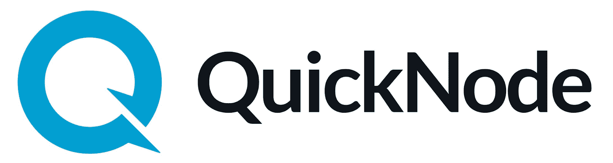

## QuickNode 替代品——它们为什么重要？

创造力和独特性很重要；然而，在当今快节奏的世界中，速度也是必不可少的。因此，在创建 dapps 时，您希望能够快速创建最小可行产品(MVP)。如果你想在这个竞争日益激烈的领域脱颖而出，这是必须的。如果你花了太长时间去做某事，很可能有人会打败你。而且，我们可能不需要提醒您率先上市的重要性。简单地成为第一个比成为后来者并试图获得采纳要容易得多。因此，你总是想确保尽快向投资者和用户展示你的 MVP。

幸运的是，使用 QuickNode 替代品可以帮助您解决这个问题。如上所述，这些工具可以帮助你快速行动，快速营销。此外，这也是你可以专注于顶级 [Web3 前端](https://moralis.io/web3-frontend-everything-you-need-to-learn-about-building-dapp-frontends/)的方式。后者将确保用户爱上你的产品。QuickNode 或 QuickNode 替代品等平台为您提供了必要的构建模块。在大多数情况下，他们关注的不仅仅是运行可靠的区块链节点([区块链节点提供商](https://moralis.io/infura-alternatives-and-blockchain-node-providers/))。后者通常以全面支持的形式出现，以满足您的整个区块链发展之旅。而且，在适当的支持下，您可以保持竞争力。

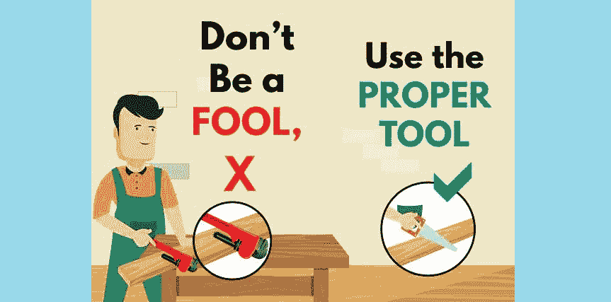

### 为什么使用 QuickNode 或 QuickNode 替代品？

基本上，所有区块链开发人员都需要问自己“我真的需要运行和维护自托管节点吗？”。当然，在某些项目中，运行自己的节点更有意义。然而，大多数项目使用可靠的节点提供者会更好。

此外，由于大多数初创公司的预算有限，所以关注支出是非常有意义的。自托管节点可能非常昂贵——通常运行自己的节点每月需要花费近 5000 美元的工程时间。此外，年平均费用总额估计超过 85 000 美元。此外，根据 Alchemy 网站的说法，每月的 AWS 成本可能在 2000 美元到 5000 美元之间。除了费用之外，运行您自己的节点需要大量时间，并且会带来很高的复杂性。

也就是说，很少有项目能够以这种方式花费他们团队的工程资源。此外，构建一个可靠且强健的基础架构往往需要数月时间。最重要的是，通常你需要考虑到巨大的失败风险。一些例子包括错误和回归、内部数据库损坏、不一致的对等，以及很可能破坏“稳定版本”。此外，内存泄漏、CPU 峰值和磁盘错误等问题也很常见。

因此，很明显，当你信任专家来负责后端基础设施时，Web3 的开发压力会小很多，成本会更低，速度会更快。依靠顶级的 QuickNode 替代品，比如 Moralis，你将拥有一个完整的后端团队。

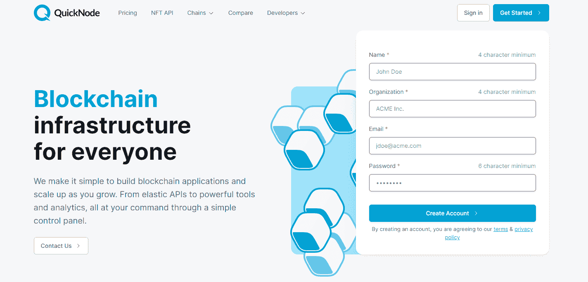

### 什么是 QuickNode？

QuickNode 是一个著名的节点提供商。在许多方面，它与 Infura 非常相似——它提供可靠的节点支持。根据 QuickNode 官方网站的说法，这个平台认为互联网的未来是私有的、不可信的和抵制审查的。此外，它的使命是通过提供无障碍的核心基础设施，帮助区块链生态系统的规模。QuickNode 让您的区块链应用变得简单，并随着您的发展而扩展。因此，您可以通过一个简单的控制面板利用他们的弹性 API、分析和其他强大的工具。

此外，QuickNode 支持一系列区块链(在撰写本文时总共有 14 个)，给了 devs 很多选择。因此，他们可以建立在索拉纳，BNB 链，比特币，乐观，灵知，Celo，多边形，Fantom，Terra 和其他一些。另一方面，QuickNode 不提供免费计划。不过，用户可以测试这种托管的区块链基础设施，为期七天。

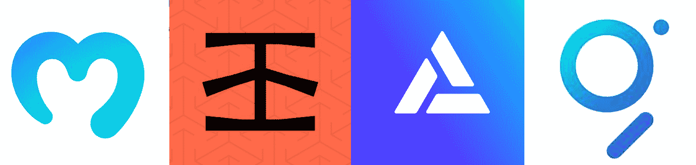

# quicknote 备选方案–首选

Infura、Alchemy、Graph 和 Moralis 是一些顶级的 QuickNode 替代品。这些平台各有利弊。因此，您需要确定哪一个最适合您的项目需求。然而，如果你正在寻找终极的 [Web3](https://moralis.io/the-ultimate-guide-to-web3-what-is-web3/) 开发平台， [Moralis](https://moralis.io/) 是一个值得关注的平台。因此，我们将首先详细介绍这个用于加密的[火基。](https://moralis.io/firebase-for-crypto-the-best-blockchain-firebase-alternative/)

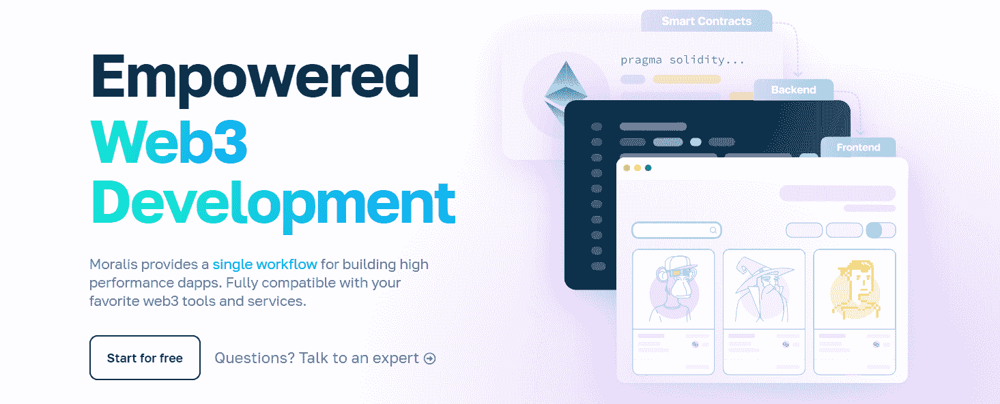

## quicknote 备选方案-Moralis

首先，您需要知道 Moralis 不仅仅是一个节点提供者。它为开发人员提供了构建 dapps 的单一工作流程。该公司自成立以来一直在经历巨大的增长。来自世界各地的开发人员都很欣赏这个工具带来的强大功能。此外，正如下面的截图所示，它在流量和参与度方面位居榜首:

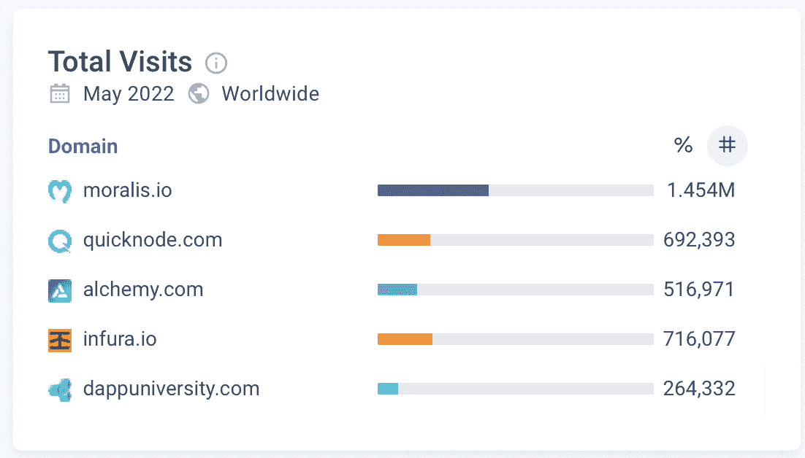

已经有数千个项目使用 Moralis 来满足他们的 Web3 基础设施需求。 [Moralis 的 SDK](https://moralis.io/exploring-moralis-sdk-the-ultimate-web3-sdk/) 提供了一套非常全面的特性，包括最广泛的 [Web3 API](https://docs.moralis.io/moralis-dapp/web3-api) 。

### moralis——不仅仅是一个节点提供商

Moralis 不仅仅是一个简单的节点提供者。首先，Moralis 允许用户使用简短的代码片段添加或创建新的 dapp 功能。实际上，Moralis 的目标是用一行代码覆盖最复杂的 Web3 方面。这就是 [Moralis 文档](https://docs.moralis.io/introduction/readme)和 [Moralis 的 GitHub](https://github.com/MoralisWeb3) 页面的用武之地。使用这些资源，您可以通过复制粘贴代码片段来满足 dapps 的后端需求。此外，Moralis 的内部专家还创建了几个令人印象深刻的样板，使您能够在几分钟内启动并运行全功能 dapps。对于 web dapps，你可以使用终极的 [Web3 样板](https://moralis.io/web3-boilerplate-beginners-guide-to-web3/)。以及用于移动 dapps 的[以太坊移动样板](https://moralis.io/ethereum-mobile-boilerplate-full-guide-to-ethereum-for-mobile/)。

您还应该记住，Moralis 完全是关于跨平台和跨链的互操作性。因此，您可以将 Moralis 的 SDK 用于不同的平台和不同的编程语言。因此，如果你知道如何使用 [JavaScript](https://moralis.io/javascript-explained-what-is-javascript/) 和 Unity (C#)，你可以立即开始构建 dapps。Web3 基础知识和入门级的[坚实度](https://moralis.io/solidity-explained-what-is-solidity/)知识会有所帮助，但并不是必须的，因为你可以随时掌握这些知识。这也使得 Moralis 成为传统开发者从 [Web2 无缝过渡到 Web3](https://moralis.io/what-is-web2-and-web3-explaining-web3/) 的首选平台。此外，跨链互操作性为您提供了一种简洁的方式来使用相同的代码来定位多个链。此外，这也证明了你的工作是面向未来的，因为你的 dapps 永远不会被任何特定的链所束缚。

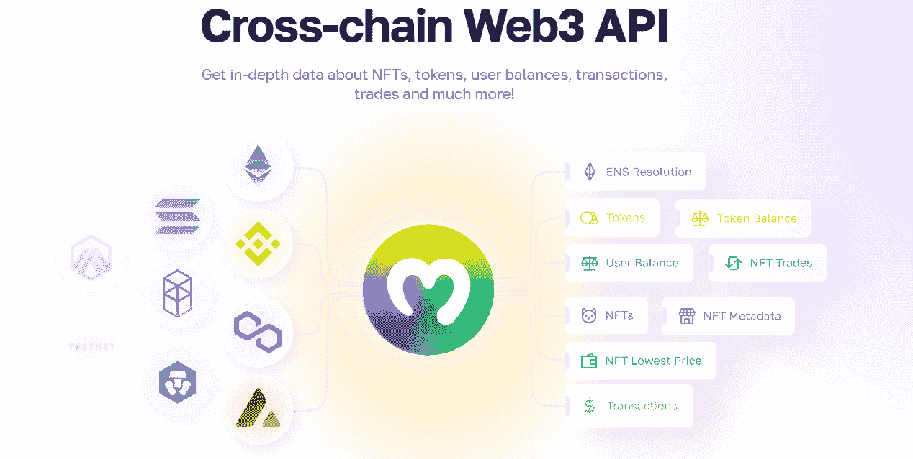

#### QuickNode 备选方案中的佼佼者

以下是 Moralis 的主要特点:

*   该平台的“同步”功能使您能够[同步和索引智能合约事件](https://moralis.io/sync-and-index-smart-contract-events-full-guide/)。这是[索引区块链](https://moralis.io/how-to-index-the-blockchain-the-ultimate-guide/)最直接的方法。
*   使用[元掩码](https://moralis.io/metamask-explained-what-is-metamask/)、 [WalletConnect](https://moralis.io/what-is-walletconnect-the-ultimate-walletconnect-guide/) 或其他 [Web3 钱包](https://moralis.io/what-is-a-web3-wallet-web3-wallets-explained/)完成 [Web3 认证](https://moralis.io/web3-authentication-the-full-guide/)的集成。如果你不想用 MetaMask 进行[认证，Moralis 还可以让你通过 email](https://moralis.io/how-to-authenticate-with-metamask/) 和 [Web3 社交登录](https://moralis.io/web3-social-login-sign-in-dapp-users-with-google-email-or-twitter/)实现 [Web3 认证。这两个](https://moralis.io/how-to-do-web3-authentication-via-email/) [Web3 登录](https://moralis.io/how-to-build-a-web3-login-in-5-steps/)方法是促进 [Web3 用户加入](https://moralis.io/how-to-boost-web3-user-onboarding-success-rates/)的好方法。
*   一个 Web3 API，包括 Moralis [NFT API](https://moralis.io/nft-api/) 。
*   Moralis 还允许你通过[https://moralis.io/plugins/](https://moralis.io/plugins/)使用其他 API(例如 Moralis 的 [OpenSea 插件](https://moralis.io/plugins/opensea/))。
*   到项目前端的套接字连接。
*   使您能够[通过 SMS 消息](https://moralis.io/get-web3-events-with-sms-messages/)和电子邮件推送通知(用于用户提醒)获得 Web3 事件。
*   一个强大的数据库[存储链外数据](https://moralis.io/how-to-store-off-chain-data-unity-web3-database/)和编年史[链上事件](https://moralis.io/web3-data-science-importing-on-chain-events/)以及。
*   Moralis IPFS 集成使您能够以分散的方式存储数据。

尽管如此，我们还是鼓励你看看这个巧妙地涵盖了 Moralis 要点的视频:

https://youtu.be/txHnWDRB728

## QuickNode 替代品 Infura

Infura 是另一个著名的节点提供商，它比 QuickNode 存在的时间更长。此外，Infura 是 ConsenSys 的公司。因此，它聚焦于[以太坊](https://moralis.io/full-guide-what-is-ethereum/)区块链。因此，有了 Infura，你可以毫不费力地连接到以太坊。这意味着您不需要自己处理这个众所周知的困难且通常很慢的同步过程。此外，Infura 还提供了几个优势——高速、可伸缩性和存储。就像 Moralis 一样，Infura 也提供了一个 IPFS API。

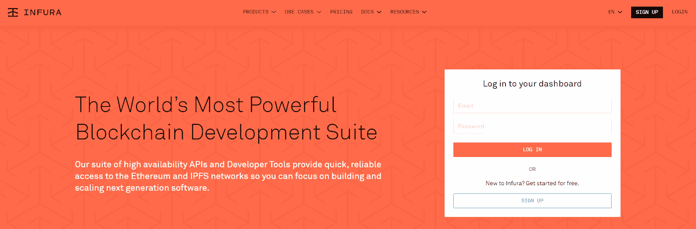

此外，Infura 缩短了同步以太坊节点的时间。它具有内置的可扩展性，这使得区块链开发人员不必担心雇佣全职可靠性工程师来进行扩展。此外，Infura 还通过提高存储效率降低了成本。所有这些优势使得 Infura 成为 QuickNode 备选方案中的首选。这是针对构建在以太坊之上，主要对提供服务的节点感兴趣的开发人员的。然而，Infura 缺乏主要的跨链支持。因此，如果您想要更多的跨链自由，其他 QuickNode 替代品可能适合您。

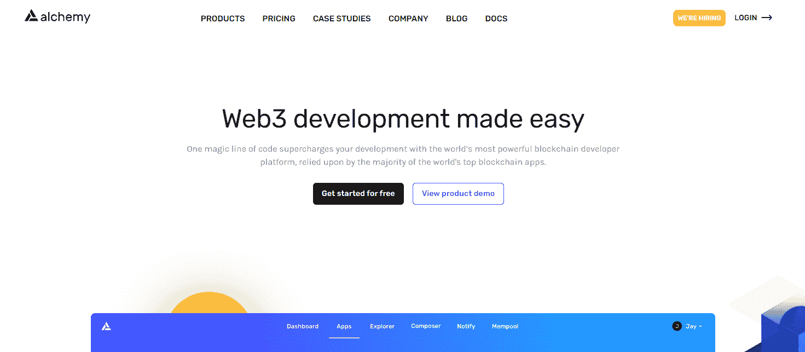

## quicknote 替代方案-炼金术

像目前所有其他的 QuickNode 替代方案一样，Alchemy 也是一个声誉很高的节点提供商。它从 2019 年开始，当时它还宣布将“秘密修复区块链的节点噩梦”。因此，许多知名的加密和区块链公司开始将项目外包给他们。此外，Alchemy 最初主要是作为一个节点基础设施提供商。因此，他们主要关注更新缓慢的架构。然而，在 2020 年，他们推出了一整套开发者工具。这一扩展使得 Alchemy 能够为区块链开发者提供更全面的体验。此外，通过营销即时测试网、高消费者满意度得分、增强的 API 以及高可靠性的快速开发时间，他们吸引了许多开发人员。

根据 Alchemy 网站的说法，这种 QuickNode 替代品的核心产品和功能如下:

*   super node——这个特性被标记为“以太坊、多边形、Arbitrum、乐观、流和 Crypto.org 中使用最广泛的区块链 API”
*   Alchemy Build——这是 Alchemy 为减少调试时间和增加构建时间而推出的产品。然而，这个工具主要是为那些想要[建立以太坊 dapps](https://moralis.io/ultimate-guide-how-to-build-ethereum-dapps/) 的人准备的。
*   NFT API——这是 Alchemy 新推出的 NFT 相关产品。由于 NFT([不可替代令牌](https://moralis.io/non-fungible-tokens-explained-what-are-nfts/))仍然风靡一时，这一增加很有意义。毕竟，开发人员已经开始理解 [ERC-1155](https://moralis.io/erc1155-exploring-the-erc-1155-token-standard/) 和 [ERC-721](https://moralis.io/erc-721-token-standard-how-to-transfer-erc721-tokens/) 令牌标准的影响。然而，正如你已经知道的，还有其他的 [NFT API 替代品](https://moralis.io/nft-api-alternatives-comparing-alchemys-nft-api-with-moralis-nft-api/)可用。

与 Infura 不同，Alchemy 确实支持一些其他链。然而，它的主要焦点仍然是以太坊。因此，如果您想要更全面的跨链支持，Moralis 或 QuickNode 是更好的选择。

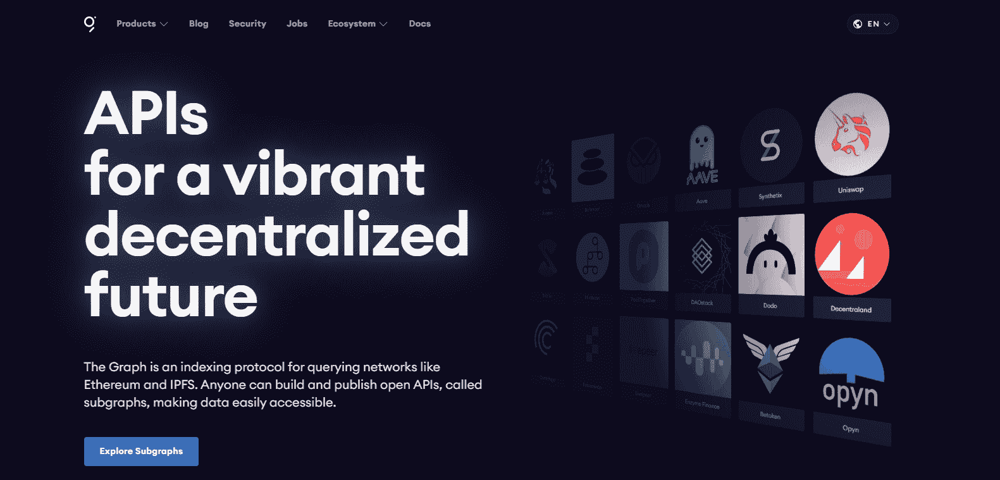

### 图表——索引协议

首先，我们必须指出，该图可能不能直接作为 QuickNode 的替代方案。它的主要焦点是通过查询以太坊和 IPFS 的区块链索引。该图的伟大之处在于它允许您构建或发布开放的 API(“子图”)。

有了图的子图，其他开发人员就可以使用数据了。因此，您为区块链技术的采用做出了贡献。此外，您可以将子图组成包含网络公共信息的全局图。此外，为了使用图形，您需要使用 GraphQL 编程语言。总而言之，这个图表是索引[智能合约](https://moralis.io/smart-contracts-explained-what-are-smart-contracts/)的一个强有力的选择。

由于区块链索引是众所周知的困难，图表是一个非常有用的工具。然而，你之前了解到 Moralis 也能帮助你解决这个问题。因此，它们都有助于您避免从头开始学习如何编制区块链指数的复杂性。

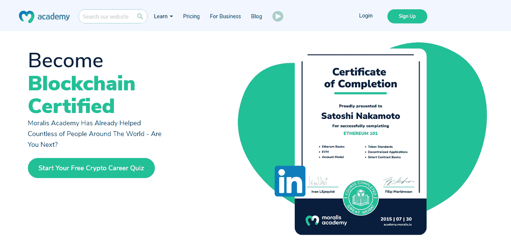

## QuickNode 替代方案–顶级 Web3 开发选项

此时，您知道使用正确的工具可以在您的区块链开发职业生涯中产生巨大的影响。一个合适的工具集可以为您节省大量的时间和资源。更重要的是，有了合适的 Web3 开发平台，您可以更快地交付产品。QuickNode 无疑是这类工具中的一种，本文介绍的其他 QuickNode 替代工具也是如此。然而，如果你正在寻找一个完整的跨链解决方案，Moralis 是建立你的 MVP 的方法。它不仅提供了节点，如 Infura、Alchemy 和 QuickNode，而且它还使您能够索引区块链，就像图表一样。

也就是说，我们邀请你开始建造。[创建你的免费 Moralis 账户](https://admin.moralis.io/register)并处理我们的一些示例项目。你可以在[Moralis 利斯的博客](https://moralis.io/blog/)和[Moralis 利斯的 YouTube 频道](https://www.youtube.com/c/MoralisWeb3)上找到无数的教程。这些也是你继续接受免费区块链发展教育的途径。此外，在这里你可以学到关于 Unity Web3 编程的知识。最后但同样重要的是，你也应该考虑采取一种更专业的方式来进行你的 Web3 教育。这是 Moralis 学院打开机会之门的地方。通过完成几门顶级加密[课程](https://academy.moralis.io/all-courses/)，你有信心[成为一名 Web3 开发者](https://moralis.io/how-to-become-a-web3-developer-full-guide/)。**