# React dApp 模板–如何构建 React dApp

> 原文：<https://moralis.io/react-dapp-template-how-to-build-a-react-dapp/>

**如果你精通**[**JavaScript**](https://moralis.io/javascript-explained-what-is-javascript/)**，你很可能熟悉 React，你甚至可以轻松构建 React dApp。React 流行的 JavaScript 库使开发人员能够构建具有高效用户界面(ui)的应用程序。而且有了 Moralis 的终极** [**Web3**](https://moralis.io/the-ultimate-guide-to-web3-what-is-web3/) **开发平台，就可以利用 React.js，构建现象级**[**dApps**](https://moralis.io/decentralized-applications-explained-what-are-dapps/)**(去中心化应用)。此外，即使是初级开发人员也可以使用适当的 React dApp 模板创建下一代应用程序。通过使用 React dApps 的模板，您可以跳过编程的重复部分，从而进一步加快 dApp 创建的过程。因此，本文将演示如何使用 React dApp 模板构建 React dApp。**

也就是说，如果您想知道如何构建 React dApp，那么您来对地方了。本文将向您展示一种使用基本的 React dApp 模板创建 dApp 的简单而快速的方法。在接下来的几节中，我们将重点介绍如何正确设置所有工具。这包括设置一个代码编辑器，访问 React dApp 模板，调整 React dApp 模板，并连接到 Moralis 以满足所有与区块链相关的后端需求。因此，本文旨在成为学习如何构建 React dApp 的一个很好的起点。

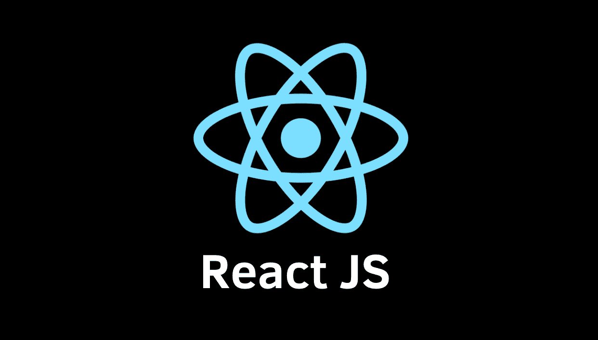

## 使用 React dApp 模板的先决条件

像任何其他编程任务一样，即使你是一个完全的初学者，你也可以开始着手一些初级的 Web3 项目。但是，要使用 React dApp 模板并最好地了解如何构建 React dApp，我们建议您牢牢掌握并充分理解以下内容:

1.  精通 JavaScript(JS)——这种简单且非常受欢迎的编程语言在与 Moralis 结合使用时会让你受益匪浅。如果你还不精通 Javascript，我们推荐你参加伊凡科技学院的“[区块链开发者 JavaScript 编程](https://academy.ivanontech.com/courses/javascript-programming-for-blockchain-developers)课程。
2.  **了解 Moralis 基础知识**–这款终极 Web3 操作系统提供了轻松快速部署杀手级 dApps 所需的工具和专业知识。它为你提供 [Moralis 的 Web3 SDK](https://moralis.io/exploring-moralis-sdk-the-ultimate-web3-sdk/) ，一个主要的 [NFT API](https://moralis.io/ultimate-nft-api-exploring-moralis-nft-api/) ， [Moralis Speedy Nodes](https://moralis.io/speedy-nodes/) ，整洁的[文档](https://docs.moralis.io/)(业界最好的之一)，免费的高价值内容( [Moralis 的博客](https://moralis.io/blog/)和 [Moralis 的 YouTube 频道](https://www.youtube.com/c/MoralisWeb3))，以及一个知识渊博的社区。

3.  **知道如何使用元掩码**–[元掩码](https://moralis.io/metamask-explained-what-is-metamask/)是最流行的加密钱包，也可能成为 Web3 行业的门户。此外，这是最简单的[认证解决方案](https://moralis.io/how-to-authenticate-with-metamask/)。幸运的是，它很容易设置和使用。此外，Moralis 已经完全集成了内置的 MetaMask。
4.  **能够回答** [**什么是反应？**](https://moralis.io/react-explained-what-is-react/)**–为了充分利用任何 React dApp 模板，并更深入地研究“如何构建 React dApp”主题，您需要清楚地了解这个有用的 JavaScript 库。**

***如果你是一个区块链开发的初学者，我们推荐你学习如何成为一名区块链开发者***。此外，了解区块链开发的最佳语言***对于推进您的加密之旅也非常有益。*****

****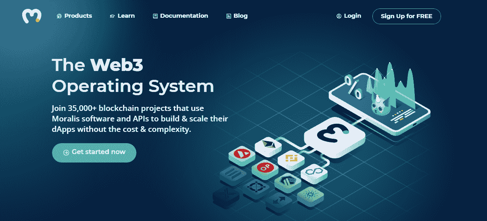

## **React dApp 模板——如何使用 Moralis 构建 React dApp**

在我们继续之前，我们首先建议您设置并准备好您的[免费 Moralis 账户](https://admin.moralis.io/register)。为此，只需输入您的电子邮件地址，并创建您的密码。然后通过确认您的电子邮件(单击确认电子邮件中的链接)来完成这个过程，您就万事俱备了。

除了 Moralis、MetaMask 和 React.js 库，我们还将使用 VSC 的代码编辑器(Visual Studio Code)、包管理器(npm)和开源 CSS 框架(称为“Chakra”)。如果你需要帮助来获得和设置 MetaMask 和 VSC，我们推荐你看看我们的文章，内容是为初学者开发以太坊。

## React dApp 模板–设置 VSC

Visual Studio Code (VSC)是市场上最流行的代码编辑器之一，大多数 Moralis 的专家也在使用它。当然，可以随意使用您选择的任何其他代码编辑器；然而，如果你是初学者，我们建议使用和我们一样的工具，因为这会使事情更简单。使用 VSC 时，我们将利用其内置终端。要打开它，请单击顶部菜单栏中的“查看”，然后单击“终端”。

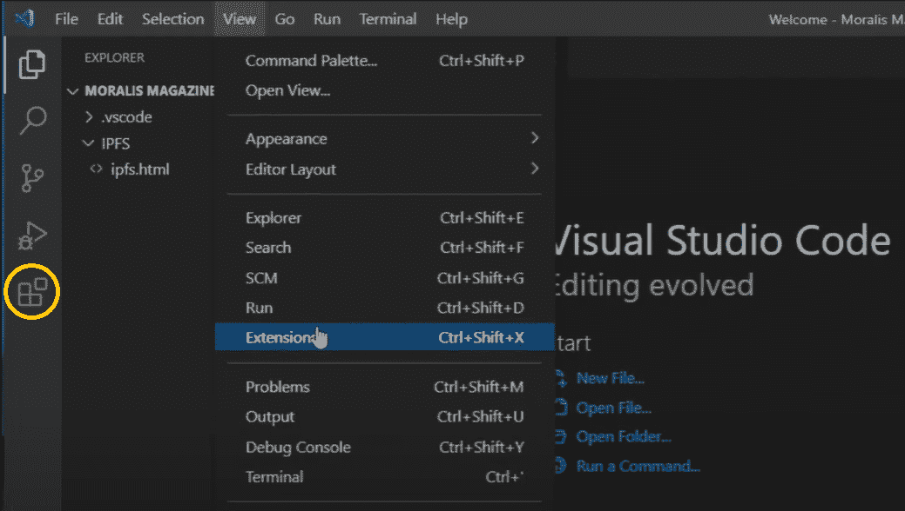

此外，我们将利用几个扩展来简化您的工作。要添加扩展，请导航到“*视图”，然后导航到“扩展”*，然后使用搜索栏找到下面列出的扩展并安装它们。以下是我们将使用的扩展:

*   Babel JavaScript–它为 React 和 JavaScript 提供了亮点。
*   **括号对上色器**–它可以更容易地看到匹配的括号，并帮助您避免遗漏开括号。
*   **更漂亮——代码格式化程序**—它自动形成代码。另外，在这个扩展中设置关于“保存时格式化”的设置。

## 运行 React dApp 模板

如前所述，我们将使用 VSC 的终端来启动特定的行动。为了创建 React dApp，我们将使用“Create React”库，它将为我们引导整个 dApp。为了实现这一点，我们在终端的命令行中键入*"****npx create-react-app Twitter-clone****"*(见下图)。*“Twitter-clone”*是我们为 React dApp 选择的名称(它可以是您喜欢的任何名称)。此外，您可能需要安装 Create React 库。如果发生这种情况，只需点击“是”，它会自动完成。

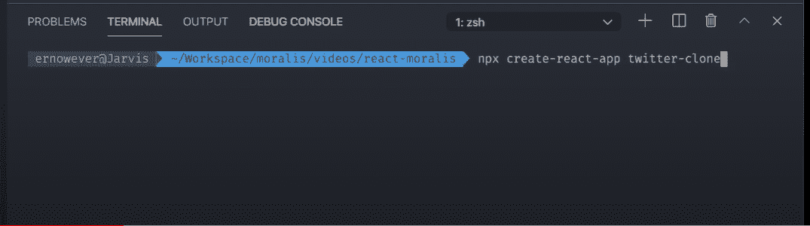

默认情况下，将使用“Yarn”中的包管理器。你可以选择这个选项。然而，我们更喜欢 npm。因此，我们将删除“yarn.lock”并安装 npm。

1.  右键点击并选择“删除”。

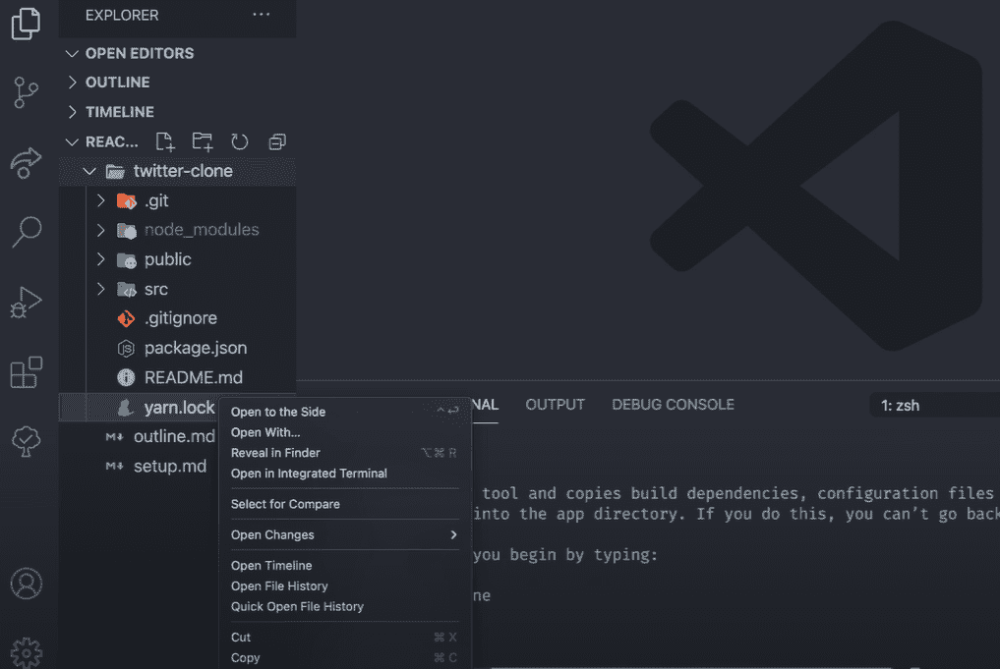

2.  使用终端，键入****CD Twitter-clone****即可定向到相应的目录。**
***   输入****NPM 安装****在终端*。*这会让我们得到一个新的包的”。锁定”文件。****

**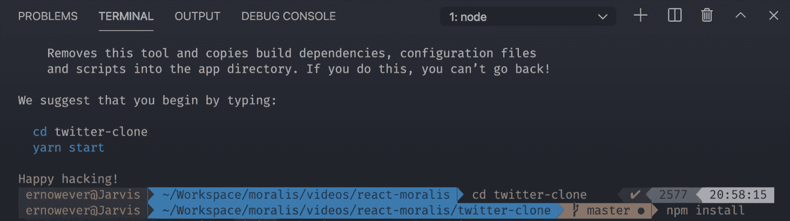

现在我们已经准备好了一切，我们可以让我们的应用程序开始运行了。我们通过在终端中键入*"****NPM run start****"*来实现这一点。

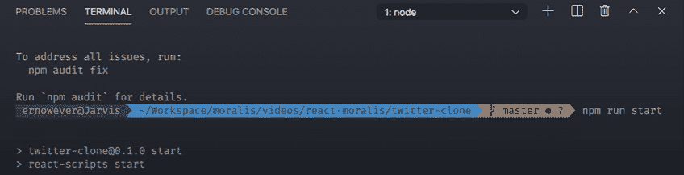

## 如何构建 React dApp–模板文件清理

随着我们的进行，我们希望删除一些自动创建的文件，这些文件我们实际上并不需要(如“ *App.css”、“App.test.js”、“index.css”、“logo . SVG”)*。我们通过右击有问题的文件，然后选择“删除”来做到这一点。

此外，我们还想删除引用这些文件的所有代码行。在“App.js”文件里面，我们删除了****导入。/app . CSS '；*** *和* ***从' . logo.svg '中导入 logo****行代码。我们还想删除同一个文件中“div”元素内的整个代码，并在“div”内添加我们应用程序的名称。这样，我们只剩下下图中显示的代码:**

**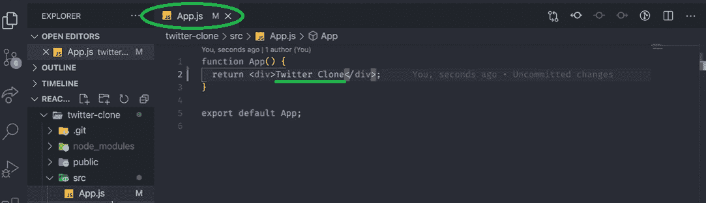

我们现在转到“index.js”文件，通过删除*“****导入”来执行类似的清理。/index . CSS '；****行代码。这就是我们剩下的:*

*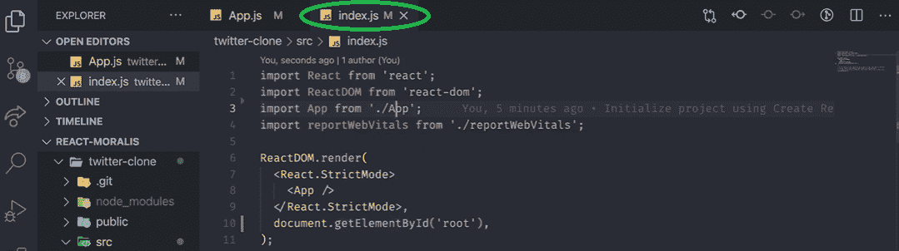

## 向我们的 React dApp 模板添加样式

此外，为了让我们的 React dApp 模板看起来更有趣，我们可以使用各种开源网站来添加一些样式。为此，我们将使用“[脉轮](https://chakra-ui.com/)库。一旦我们上了他们的官方网站，我们需要点击“开始”按钮。在下一页，我们简单地复制顶部的代码行(npm 的安装脚本)。

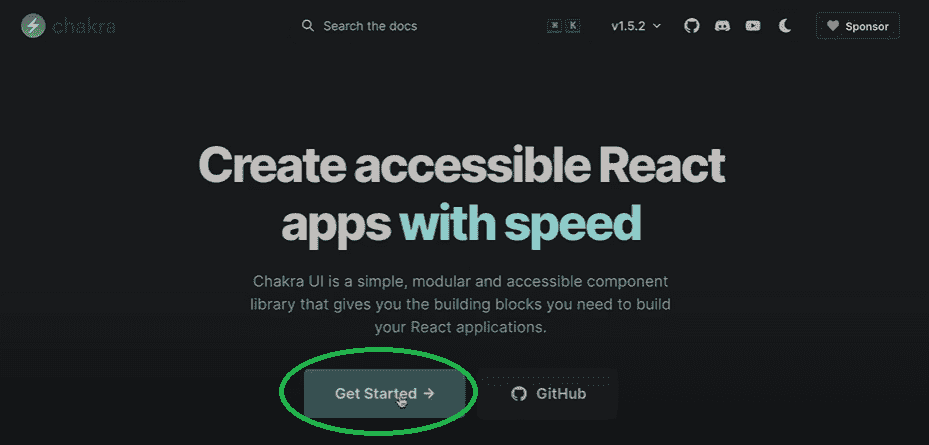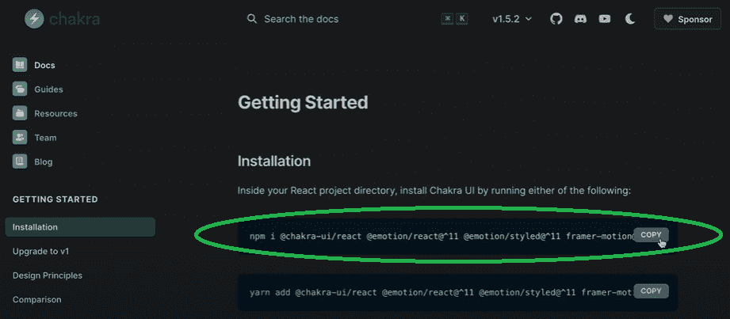

接下来，我们在 VSC 的终端区域内单击并按“CTRL+C”。然后我们将复制的代码粘贴到命令行中。这将启动安装过程。一旦完成，我们将有完整的脉轮功能可用。如果你熟悉来自 Bootstrap 的 CSS 框架，Chakra 与它非常相似，也许只是更加可定制一些。

我们还需要将这行代码添加到“index.js”文件中:

***从“@ chakra-ui/react”***导入{ ChakraProvider，extendTheme }

我们使用了“***extend theme****”*，这使我们能够为我们的 dApp 设置暗背景。而且，在同一个文件中，我们添加了“ *< ChakraProvider >* ”，并在*“<App/>”之后关闭。*这是我们得到的:

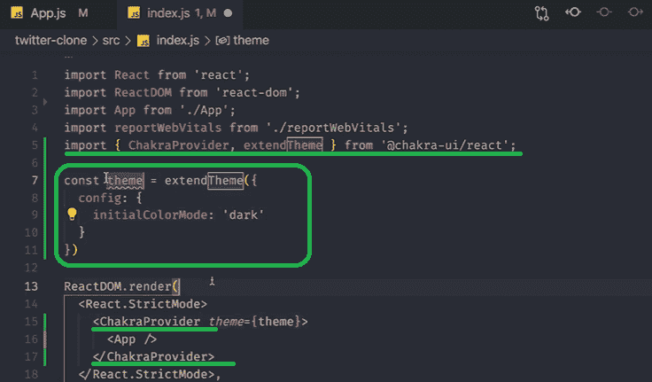

一旦安装完成，我们再次使用终端的命令行并键入****NPM 运行启动*** *。我们现在可以打开我们的应用程序了。正如你在下面看到的，我们现在有一个黑暗主题的应用程序，除了我们的 dApp 的名字什么都没有:**

*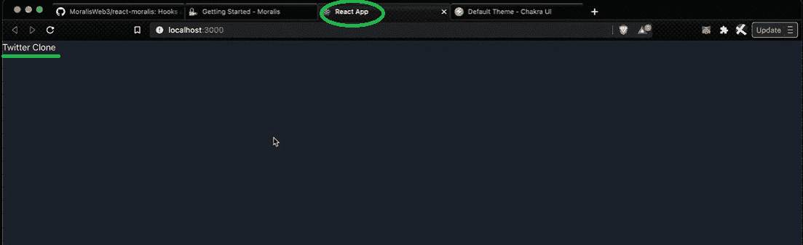

## 如何用 Moralis 建立一个反应的 dApp

正如在开始时提到的，我们将用 Moralis 覆盖大部分链上相关的后端编码。为了增加 Moralis 的功能，我们需要安装 Moralis 并对 Moralis 的依赖关系做出反应。这将使 React dApp 的创建成为一个简单的过程。

为了增加这个功能，我们再次使用 VSC 的终端。我们从按“CTRL+C”开始。接下来，我们在命令行中键入*"****NPM install moralis react-moralis***"并点击 enter:

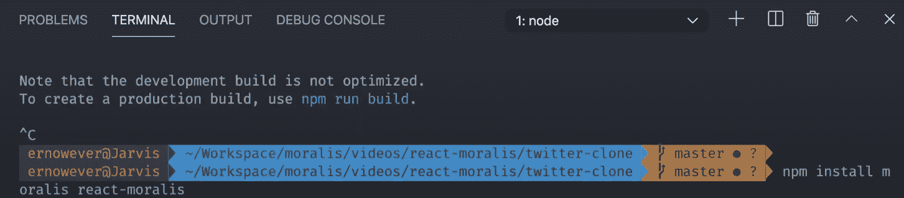

接下来，我们使用 [GitHub](https://github.com/MoralisWeb3/react-moralis) 中的“react-moralis”文档。这样，我们只需要复制并粘贴适当的代码行。一旦你进入 GitHub 页面，在快速入门部分，我们会找到“如何构建一个 React dApp”所需的一切。

下面是将与我们的 Moralis 服务器建立连接的最重要的一行代码:

***<Moralis 提供者 appId = { appId } server URL = { server URL }>***

我们将上面的代码行添加到“index.js”文件中，添加方式与添加*“chakra provider”*的方式相同。这意味着我们必须把它包在*<App/>*周围。此外，我们将*"****const appId = " "****"**"****const serverUrl = " "****"*添加到“index.js”文件中。在引号内，您将添加您的 Moralis 服务器的详细信息(下面提供了设置您的 Moralis 服务器的说明)。还要加上****从“react-moralis”导入{ moralis provider }；****在我们的“index.js”文件里面。**

### **如何用 Moralis 构建 React dApp 获取“appId”和“serverUrl”**

**在我们实际填充了*"****const appId****"*和*"****serverUrl****"*常量之前，我们将无法访问 Moralis 的能力，因此没有区块链功能。因此，我们需要获得这些信息来将我们的 Web2 应用程序转换成 Web3 应用程序。**

#### **通过 4 个步骤获得应用程序 ID 和服务器 URL**

***   创建你的 Moralis 账户——如果你还没有[创建你的 Moralis 账户](https://admin.moralis.io/register)，现在就创建吧。如果您已经有了一个有效的 Moralis 帐户，只需[登录](https://admin.moralis.io/login)。*   **创建新服务器**–登录您的 Moralis 帐户后，您可以选择创建新服务器。只需点击 Moralis 管理页面右上角的“+创建新服务器”按钮。接下来，将出现一个下拉菜单，提供不同类型的网络(见下图)。我们建议从“Testnet 服务器”选项开始。**

**

您需要输入所需的详细信息，包括服务器名称(可以是您想要的任何名称)，选择区域、网络、链(您可以选择一个或多个选项)，然后单击“添加实例”以完成此步骤(如下所示)。

3.  **访问服务器详细信息**–现在，您终于可以获得详细信息了(将在您的“index.js”文件中使用)。只需点击您的服务器名称旁边的“查看详细信息”按钮。这将导致弹出窗口出现。在那里，您将看到所需的详细信息(查看下图)。*如果你以前用过 Moralis，你可能已经设置了一个或多个服务器。在那种情况下，你可以使用任何一台服务器。*

4.  **初始化 Moralis**–剩下的就是用 Moralis 服务器的详细信息(应用程序 Id 和服务器 Url)填充“index.js”文件中的****const appId****和****serverUrl****常量。这样，您的 dApp 就可以获得所需的后端功能:****

***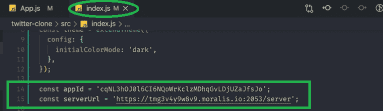

## React dApp 模板–如何构建 React dApp–总结

在这篇文章中，我们已经涉及了相当多的内容。希望您已经学会了如何构建 React dApp。当然，一个空白的，但是在添加特定的功能之前，这是一个很好的起点。此外，在 Moralis 的带领下，我们通过使用几个强大的工具很快完成了工作。通过使用 React dApp 模板并稍加调整，我们创建了一个黑色应用程序。然后，我们通过将代码与 Moralis 服务器连接，添加了 Web3 功能。因此，我们已经为任何特定的 dApp 开发项目做好了一切准备。

现在是时候让你更深入一些，承担一些具体的项目了。此外，如果你还没有准备好开始自己的项目，使用 Moralis 的内容来指导你。你可能想学习如何实现[以太坊认证](https://moralis.io/ethereum-authentication-full-tutorial-to-ethereum-login-programming/)、[创建自己的 NFT](https://moralis.io/how-to-create-your-own-nft-in-5-steps/) 和掌握 [NFT 令牌开发](https://moralis.io/nft-token-development-the-ultimate-guide/)，或者通过学习“[什么是 BEP20](https://moralis.io/what-is-bep20-full-binance-smart-chain-token-guide/) ”和承担 [BEP20 令牌开发](https://moralis.io/bep20-token-development-full-guide/)来处理其他链。此外，如果你对自己的技能有信心，并有一些很酷的想法，我们强烈建议你查看关于[chain link 2021 秋季黑客马拉松](https://moralis.io/announcing-moralis-sponsorship-chainlink-fall-2021-hackathon/)的详细信息，Moralis 是官方赞助商！

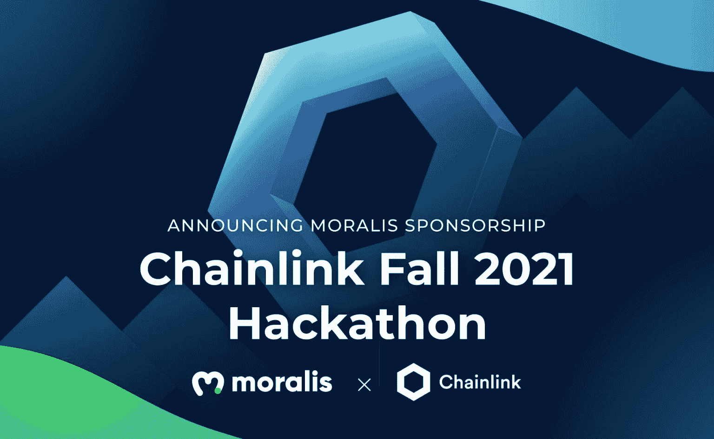***************