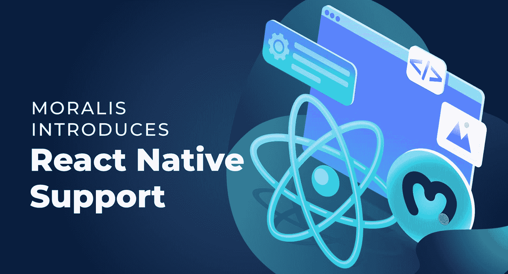
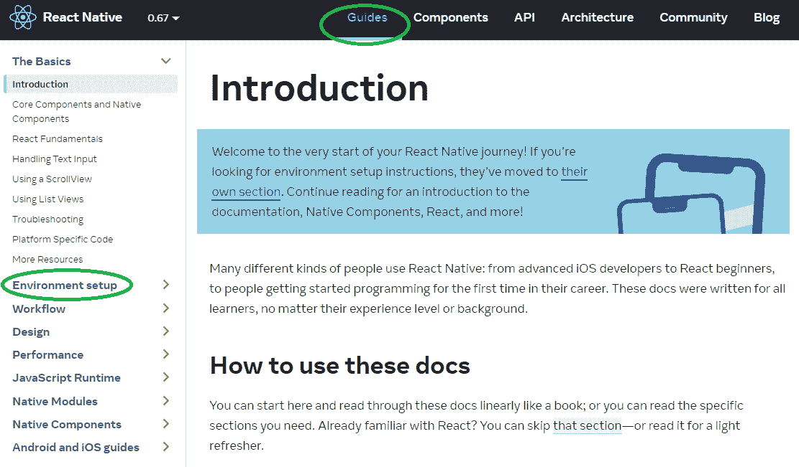
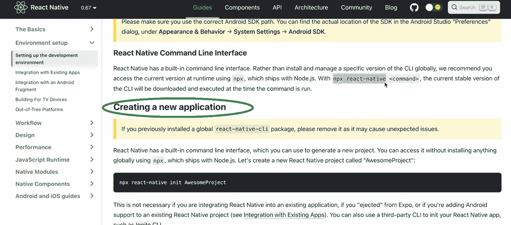
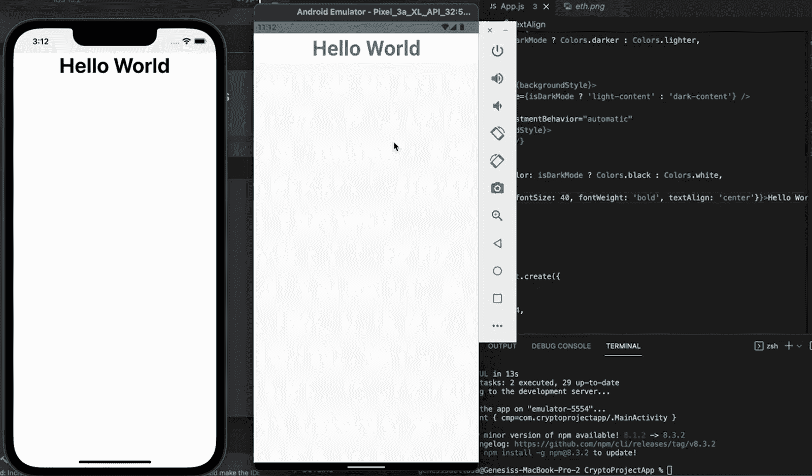
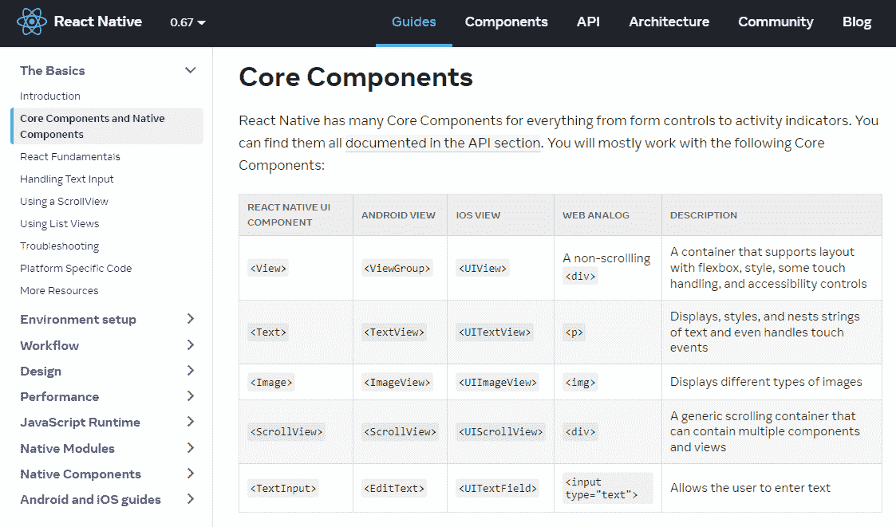
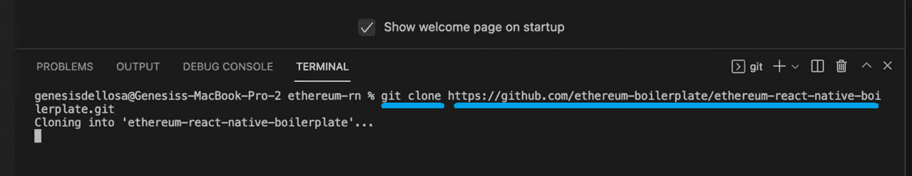
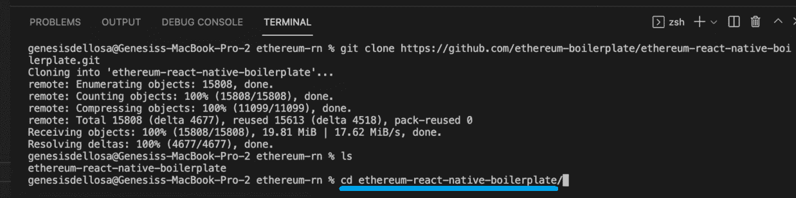
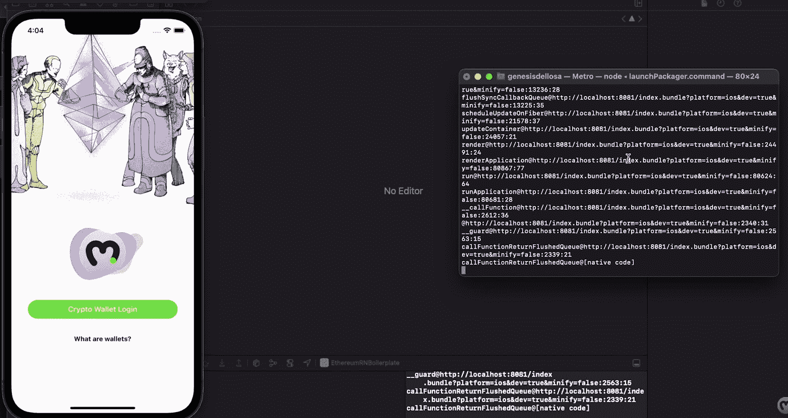
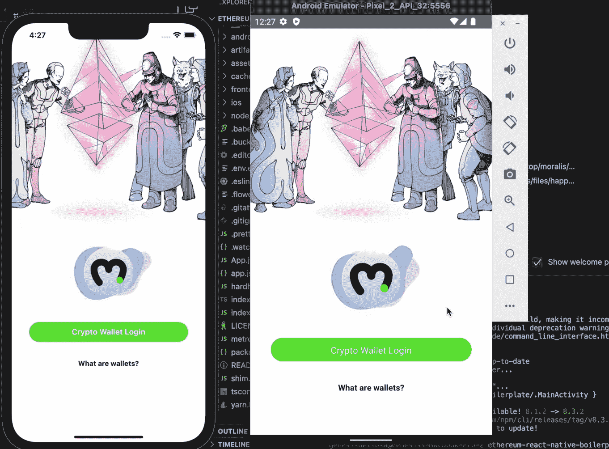

# React 原生 Web3–完整的 React 原生 web 3 开发指南

> 原文：<https://moralis.io/react-native-web3-full-react-native-web3-dev-guide/>

由于如今普通用户使用移动设备的次数超过其他任何东西，所以让 Web3 变得对移动设备友好是至关重要的。最初，Web3 领域可以通过计算机访问。然而，为了让区块链成为主流应用，程序员在开发 dApps 时必须采用移动优先的方法。这就是 React 原生 Web3 工具为开发人员带来巨大变化的地方。现在，如果您已经有了使用 React Native 的经验，那么您已经有了一个很好的开端。但是，即使你是一个 Web3 开发新手，你想学习如何在 Web3 中使用 React Native，了解 JavaScript 就足以启动你的 React Native Web3 之旅。此外，通过使用合适的工具库，您可以毫不费力地部署 iOS 和 Android Web3 应用程序。

在本文中，我们将为您提供 React 原生 Web3 开发的完整指南。我们将指导您一步一步地完成设置过程，以简化事情。在这个过程中，你会发现哪些工具是“必备”的。此外，我们将从介绍传统的移动开发工具开始，比如 Xcode 和 Android Studio。然而，React Native Web3 开发的真正推动力是[Moralis 规范](https://moralis.io/)。这个终极的 Web3 开发平台，也被称为“ [Firebase for crypto](https://moralis.io/firebase-for-crypto-the-best-blockchain-firebase-alternative/) ”，是你从 Web2 到 [Web3](https://moralis.io/the-ultimate-guide-to-web3-what-is-web3/) 的桥梁。有了 Moralis 的支持，您可以通过简单地复制和粘贴代码片段来覆盖与区块链相关的后端。此外，通过使用 Moralis，您还可以利用终极捷径——以太坊反应本机样板文件。后者使你能够在几分钟内[创建移动以太坊 dApps](https://moralis.io/create-mobile-ethereum-dapp-with-react-native-template/) 。此外，在继续之前，请确保[创建您的免费 Moralis 账户](https://admin.moralis.io/register)。

## 什么是 React Native Web3？

如果您完全熟悉“React”、“React Native”和“Web3”术语，请随意跳到下一部分。但是，如果您是区块链开发和/或移动开发的新手，请务必认真彻底地阅读这一部分。

那么，什么是 React Native Web3 呢？首先，让我们指出 React Native 与 React 非常相似。然而，它没有利用 web 组件作为构建模块，而是专注于本地组件。因此，React Native 使您能够开发跨平台的移动应用程序。现在，如果你不确定什么是 React，我们推荐你看看我们的文章，这篇文章详细介绍了这个 JavaScript UI 库。此外，需要注意的是 React.js 使用了一种叫做“JSX”的模板语言。此外，后者将代码编译成普通的 JavaScript 函数。因此，知道如何使用 React 就足以轻松过渡到 React 本地开发。然而，学习尽可能多的 React 本地特有的方面，尤其是关于本地组件，应该是你的任务清单。

现在你知道 React Native 是什么了，让我们把“Web3”加入到图片中。后者是互联网新时代，由区块链科技推出。那么，【Web3 是如何工作的？理想情况下，它是 Web2 的分散形式，内置数字货币系统。此外，当前的目标是使用户体验类似于 Web2(当前大多数网站)。然而，当用户使用 [Web3 登录](https://moralis.io/how-to-build-a-web3-login-in-5-steps/)或 [Web3 认证](https://moralis.io/web3-authentication-the-full-guide/)时，明显的差异就出现了。此外，随着我们经历从 Web2 到 Web3 的过渡，将会有很多“Web2-Web3”混合应用。记住这一点，你现在知道“React Native Web3”是指 React Native 应用于创建 Web3 移动应用程序。

## 完整的 React 原生 Web3 开发指南

接下来，我们将指导您完成使用 React Native 所需的设置。此外，如上所述，我们将通过介绍 [Moralis SDK](https://moralis.io/exploring-moralis-sdk-the-ultimate-web3-sdk/) 来涵盖 Web3 部分。这样，您将能够快速轻松地集成后端功能。因此，您将有时间专注于创建最佳前端。因此，你的移动 dApps 将有机会提供一个有吸引力的用户界面和优秀的 UX，这是成功的关键。

此外，我们将在很大程度上依靠 Moralis 专家的视频教程，使这一点更加清晰。这样，当专家执行所有必要的设置步骤时，你就有机会看着他。此外，你也将有机会跟随他的领导，创建自己的移动 dApp。首先，他将向您展示如何从头开始创建移动 dApp。然而，他还将向您展示如何使用以太坊 React 本机样板文件。毫无疑问，后者是反应原生 Web3 开发的最终捷径。

## 开始您的 React Native Web3 之旅

如果你有任何编程经验，你知道文档是珍贵的。因此，我们建议您首先访问“ReactNative.dev ”,然后点击“指南”选项:

“简介”部分有很多有用的信息。但是，如果您急于开始，请关注“环境设置”。此外，我们相信你自己可以很容易地做到这一点，但我们希望尽可能地帮助你。因此，这里有一个必需的 React-Native 开发工具的总结:

*   **命令行界面(CLI)工具** *(下面 3:45 的视频)*:
    *   节点. js
    *   红宝石
    *   可可豆荚(iOS 版)
    *   ADB(安卓调试桥)(针对安卓；已经在 Android Studio 中提供)
*   **iOS 开发** *(下面 9:26 的视频)*:
    *   Xcode *(使用最新版本)*
*   **安卓开发** *(下面 12:07 的视频)*:
    *   Android Studio *(使用最新版本)*

*注* *:详细指导请参考本文末尾的视频(使用给出的时间戳)。*

### 从头开始创建您的第一个 React 本机应用程序

现在，您可以开始构建了。此外，因为我们知道你们中的一些人喜欢从零开始建造东西，你们将有机会这样做。此外，你将学习如何克服某些错误的挑战(40:01)。此外，这也是学习如何使用 iOS 和 Android 模拟器的途径。总而言之，您将创建一个非常基本的“Hello World”移动应用程序:

另一方面，你可能更像我们，更喜欢在尽可能短的时间内到达终点。如果是这样，使用样板文件可能是适合你的方法。此外，这正是我们将在下一节重点讨论的内容。这也是我们实际创建 React 原生 Web3 dApp 的地方。

*注意* *:在这两种情况下(从头开始或使用样板文件)，Moralis 专家使用 Visual Studio 代码(VSC)，这是我们首选的代码编辑器。*

此外，我们还鼓励您进一步了解 React 本机组件(1:05:10):

对 React Native 组件的清晰理解将有助于您进一步使用 Ethereum React Native dApp 样板文件。

## 以太坊移动 dApp 样板——反应原生 Web3 开发的终极捷径

如果你认真对待 React 原生 Web3 开发，你需要知道我们在这个领域仍然处于早期。因此，很多错误是很常见的。然而，我们的终极以太坊反应原生样板已经有一段时间了。因此，我们已经设法改善了很多，事情运行顺利。但是，如果您遇到任何错误，请务必让我们知道。作为早期采用者和前沿开发者，我们必须一起工作以获得最佳的进展。

要使用样板文件，您必须首先克隆代码。要做到这一点，您需要采取以下步骤:

1.  访问 GitHub 上的[以太坊 React 原生样板](https://github.com/ethereum-boilerplate/ethereum-react-native-boilerplate)页面。
2.  复制 HTTPS 地址:

3.  在 VSC 内部打开一个新项目。然后，使用 VSC 的终端克隆代码，使用“git clone”命令，后跟上面复制的 HTTPS:

4.  克隆代码后，确保进入相应的文件夹。同样，你需要使用 VSC 的终端:

5.  接下来，您需要安装所有的依赖项。这样，使用 ***纱在终端安装*** 命令。
6.  现在，你需要进入 iOS 文件夹(在终端中输入“ ***cd ios*** ”)。一旦进入“ios”文件夹，在终端中运行“ ***pod 安装*** ”命令。
7.  您需要返回到根文件夹。您可以通过输入“ ***cd 来完成此操作..*** ”在终端的命令行中。
8.  现在剩下要做的就是在终端中输入正确的命令来运行应用程序:
    1.  对于 iOS:***npx react-原生运行-ios***
    2.  对于安卓:***npx react-原生运行-安卓*** *或****npx react-原生启动***

### 使用模拟器运行您的移动 dApp

完成以上步骤后，就可以用 Xcode 运行 iOS dApps，用 Android Studio 运行 Android dApps 了。对于 ios，首先使用 Xcode (1:24:10)导航到“ether eum-react-native-boilerplate”项目中的“iOS”文件夹。详情参考下面的视频。这也是您将看到运行基于样板的移动 dApp 是多么容易的地方。如果您设法按照说明正确操作，您将看到应用程序在您的仿真器中运行:

随着 iOS dApp 的启动和运行，是时候为 Android 重复类似的步骤了。因此，您需要使用 Android Studio (1:28:21)。这一次，您需要使用 android Studio 在“ether eum-react-native-boilerplate”项目中找到“Android”文件夹。你还将有机会看到专家解决 Android 模拟器的一些障碍。 *如果你遇到同样的问题，后者可能是无价之宝。*然而，我们的目标是让两个仿真器(iOS 和 Android)都运行您的 dApp:

如果您想了解如何更改文本或按钮，请从 1:42:20 开始观看视频。您将清楚地看到编辑代码如何自动改变您的 Android 和 iOS 版本的应用程序。此外，这也是您有机会了解更多关于 Web3 身份验证的地方。由于 Moralis 的 [WalletConnect](https://moralis.io/what-is-walletconnect-the-ultimate-walletconnect-guide/) 集成，后者与该样板文件完全集成。当然，要访问 Moralis 的后端功能，您还需要创建您的 Moralis 服务器(说明如下)。接下来，您还有机会探索在 Xcode 和 Android Studio 上选择物理设备(1:49:18)。

### 创建 Moralis 服务器

使用 Moralis 时，创建 Moralis 服务器是 web 和移动 dApp 开发的重要部分。因此，请确保完成以下步骤:

1.  **登录您的 Moralis 管理区**——此时，您应该已经准备好了您的 Moralis 帐户；于是，只需[登录](https://admin.moralis.io/login)。然而，如果你还没有这样做，现在就创建你的免费 Moralis 账户。

2.  [**创建一个 Moralis 服务器**](https://docs.moralis.io/moralis-server/getting-started/create-a-moralis-server)–在您的 Moralis 管理区内，进入“服务器”选项卡。在那里，点击右上角的“+创建一个新服务器”(见下面的截图)。接下来，您需要从出现的下拉菜单中选择最适合您需求的网络类型。*在处理示例项目或测试您的 dApps 时，您应该关注“Testnet 服务器”(* [*)或“本地 Devchain 服务器”选项。然而，当向公众发布您的 dApps 时，您会希望选择“Mainnet 服务器”。*](https://moralis.io/ethereum-testnet-guide-connect-to-ethereum-testnets/)

接下来，您将看到一个弹出窗口，要求您提供服务器的详细信息。这些包括您的服务器名称(可以是您想要的任何名称)、您的地区、网络类型和链。最后，要启动服务器，请单击“添加实例”:

3.  **访问服务器详细信息**–一旦您的服务器启动并运行，您就可以访问它的详细信息(服务器 URL 和应用程序 ID)。为此，您需要单击服务器旁边的“查看详细信息”按钮:

您将在新窗口中看到所有详细信息:

4.  初始化 Moralis*–*这是使用 Moralis 后端的必要步骤。因此，请确保填充。将文件从“. example.env”重命名为“. env”后。env”。然后，只需将您服务器的详细信息粘贴到指定位置:

这是我们在整篇文章中引用的视频:

https://www.youtube.com/watch?v=dZYSr9UPdfQ

## React 原生 Web3–完整的 React 原生 web 3 开发指南–摘要

在这篇文章中，我们已经讨论了很多内容。到目前为止，您已经知道什么是 React Native Web3，以及为什么它对于 crypto 的主流采用是必不可少的。React Native 使您能够同时为 iOS 和 Android 开发移动应用程序。此外，Moralis 使您能够为多个可编程区块链创建移动 dApps。因此，你可以保证你的开发过程面向未来，并且以最少的额外努力获得大量的用户。此外，您现在知道如何从头开始创建 React 本机应用程序。然而，您还了解到有一个更快的途径可用——终极以太坊反应原生样板。通过复制这个样板文件，你可以在几分钟内准备好你自己的移动 dApps。

如果你想了解更多关于区块链的发展，一定要访问 [Moralis YouTube 频道](https://www.youtube.com/c/MoralisWeb3)和 [Moralis 博客](https://moralis.io/blog/)。这两个渠道都提供了大量有价值的文章，涵盖了各种加密概念，包括教育示例项目。例如，我们的一些最新主题深入到[可升级智能合约](https://moralis.io/what-are-upgradable-smart-contracts-full-guide/)、 [ERC721 智能合约](https://moralis.io/erc721-contract-exploring-erc721-smart-contracts/)、终极 [Web3 用户界面套件](https://moralis.io/web3ui-kit-the-ultimate-web3-user-interface-kit/)、 [NFT API 替代方案](https://moralis.io/nft-api-alternatives-comparing-alchemys-nft-api-with-moralis-nft-api/)、 [Web3.js vs Ethers.js](https://moralis.io/web3-js-vs-ethers-js-guide-to-eth-javascript-libraries/) 、 [Web3 技术栈](https://moralis.io/exploring-the-web3-tech-stack-full-guide/)、如何[获得 OpenSea API 密钥](https://moralis.io/get-an-opensea-api-key-in-2022-full-guide/)等等。然而，如果你想[更快地成为一名区块链开发者](https://moralis.io/how-to-become-a-blockchain-developer/)，你可能需要考虑一种更专业的方法。如果是这样，考虑报名参加[Moralis 学院](https://academy.moralis.io/)！

