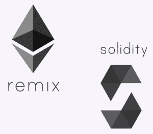
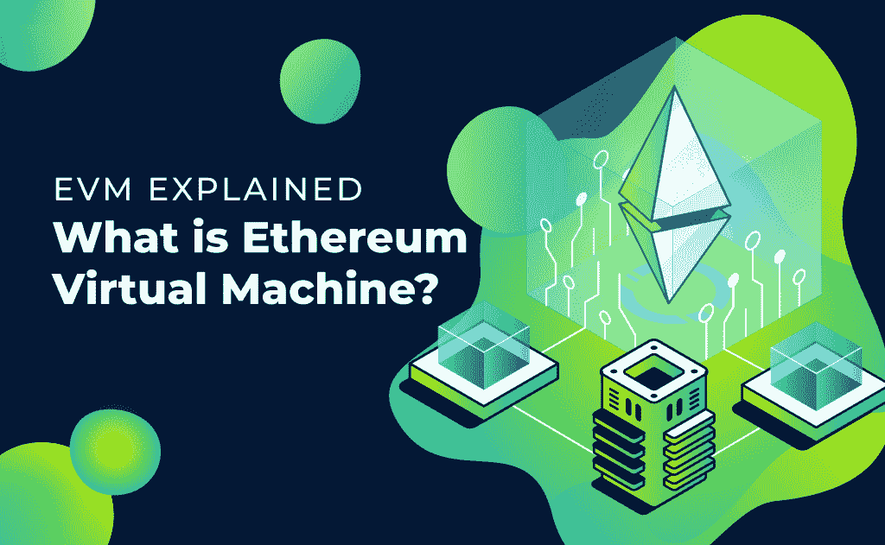
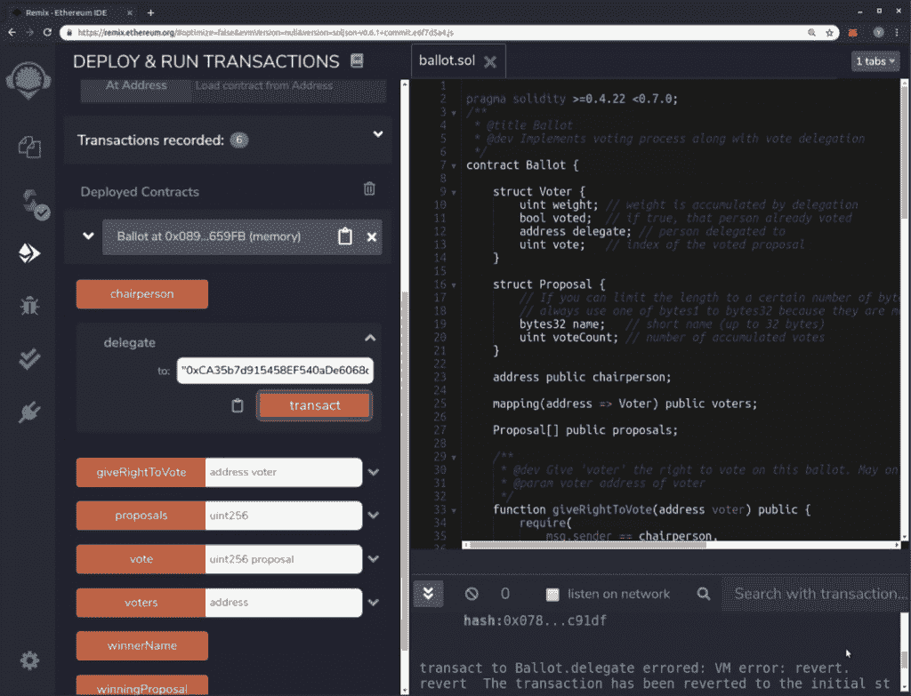
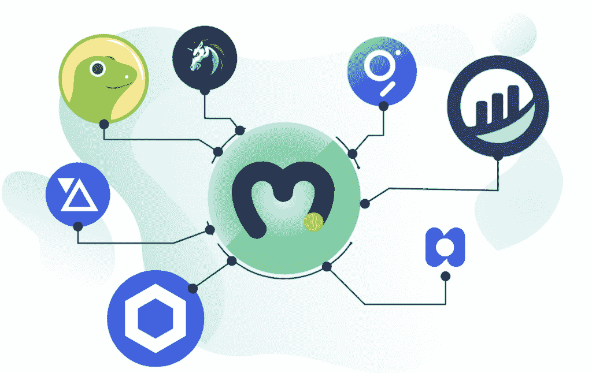
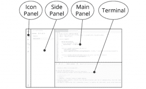
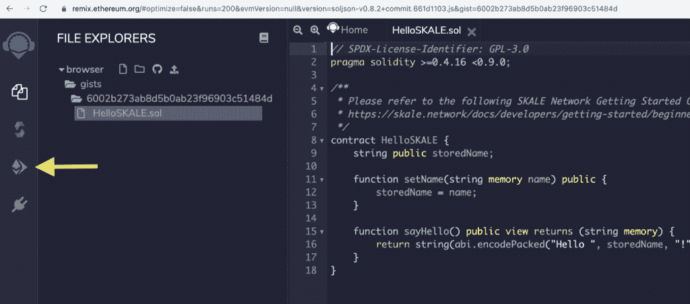

# 混音解释——混音是什么？

> 原文：<https://moralis.io/remix-explained-what-is-remix/>

Remix，通常被称为 Remix IDE，是一个开源的以太坊 IDE，你可以用它来编写、编译和调试 Solidity 代码。因此，Remix 可能是 Web3 和 dApps 开发中非常重要的工具。简而言之，如果你在寻找“什么是混音”的答案，你来对地方了！在接下来的章节中，你会学到所有你需要知道的关于混音的基础知识。这些信息将帮助您决定它是否是您应该利用的合适工具。最重要的是，我们将告诉你一个令人惊叹的平台，它使你能够跳过耗时的后端编码，仍然部署优秀的****。****

**事实上，我们来说说这个能力巨大的 [Web3](https://moralis.io/the-ultimate-guide-to-web3-what-is-web3/) 开发平台——[Moralis 家](https://moralis.io/) 。Moralis 是一个涵盖所有后端开发需求的平台，只需一些简短的代码片段。你猜怎么着，Moralis 是免费的！你需要入门的只是[JavaScript](https://moralis.io/javascript-explained-what-is-javascript/)技能。如果这是你已经得到的东西， [今天就创建你的免费账户](https://admin.moralis.io/register) 并开始开发令人敬畏的 dApps 吧！在你决定深入研究混音之前，了解一下 Moralis 真的会让你受益匪浅。**

**具体来说，Moralis 是一款优秀的中间件，可以让您立即开始开发 dApps。这意味着你不必手动设置、管理和维护你自己的 Web3 后端，这通常是进入 Web3 领域的巨大障碍。相反，你可以专注于你最擅长的事情——项目的前端和核心理念。立即注册 Moralis，获得最佳的 dApp 开发流程！**

# **什么是混音？**

**在我们真正深入研究混音之前，我们需要确保我们都在同一页上。由于 Remix 与 Web3、dApps 和区块链开发相关，因此简要回顾一下区块链的一些基本原理可能会有所帮助。如果您已经熟悉区块链开发的基础知识，请随意浏览下一部分。**

****

**然而，如果你刚刚开始熟悉这个快速发展的行业，请务必仔细阅读以下解释。此外，对于那些有兴趣深入研究的人，请确保点击链接。它们引导我们发表与讨论主题相关的博客文章。**

## **帮助你理解什么是混音的基础知识**

**随着区块链越来越受到主流的关注，你可能听说过许多不同的区块链概念。例如，你可能对以太坊、以太网、比特币、BTC、去中心化应用、Web3 和其他基本相关术语有些熟悉。然而，大多数人都不知道这些是什么。因此，让我们确保你不是那些人之一。**

### **区块链**

**区块链是一种特定类型的数据库，它将一组区块链接在一起，每个区块都包含特定的信息。当新数据进入块时，它们按时间顺序链接到现有的区块链。此外，它指的是提供大量用例的相对较新的技术。它可以存储各种数据，尽管它的许多用例充当交易的分类帐。区块链的伟大之处在于它可以以分散的方式使用。因此，该技术背后没有单一实体，这确保了安全性和透明度。但是值得注意的是，区块链也可以是中央集权的。**

### **比特币**

**对许多人来说，比特币是区块链技术的代名词。具体来说，比特币是首要的加密货币，是一种数字储值形式。当然，你也可以使用比特币在不同的 BTC 地址之间转账，以及在任何接受 BTC 作为支付选项的地方支付商品。**

#### **BTC**

**BTC 是比特币的股票代码，代表着比特币。因此，BTC 只是比特币的缩写。更有甚者，可以送 BTC 的分数，称之为“聪”(一个 BTC = 10 8 聪)。**

### **以太坊**

**以太坊是第二受欢迎的区块链。然而，以太坊通过引入 [智能合约](https://moralis.io/smart-contracts-explained-what-are-smart-contracts/) 将事情带到了另一个层面。这个特性吸引了无数开始在以太坊链上构建应用程序的项目。**

#### **ETH**

**ETH 是以太坊的股票代号。因此，以太网对于以太坊就像 BTC 对于比特币一样。**

### **EVM**

**[【EVM】](https://moralis.io/evm-explained-what-is-ethereum-virtual-machine/)代表“以太坊虚拟机”。它本质上是整个以太坊生态系统——一个基于区块链的软件平台——的动力。它使开发者能够 [在其上创建分散的应用](https://moralis.io/how-to-create-smart-contracts/) (dApps)。**

****

### **GUI**

**GUI 代表“图形用户界面”。这是一种用户界面，允许用户与电子设备互动。**

### **坚固度**

**[**Solidity**](https://moralis.io/solidity-explained-what-is-solidity/) 是一种专门为构建以太坊而设计的编程语言。**

### **MetaMask **

**[**MetaMask**](https://moralis.io/metamask-explained-what-is-metamask/) 是最受欢迎的存储硬币和代币(又名加密货币)的钱包之一。MetaMask 的伟大之处在于它还可以作为访问 Web3 应用程序的网关。您还可以使用元掩码进行身份验证——当您使用 Moralis 开发 dApps 时，我们还提供了如何使用元掩码 对用户进行身份验证的指南。**

****

## **混音解说**

**现在我们已经讲述了基础知识，你可以开始学习什么是混音了。那么，什么是混音呢？嗯，Remix 通常被称为 Remix IDE(集成开发环境)，尽管这是一种简化。它是一个开源的 web 和桌面应用程序，也可以说是一个开发环境。它打包了一组丰富的插件，并通过直观的 GUI 加快了开发周期。而且，Remix IDE 主要用于智能合约开发的整个流程。此外，它还可以作为一个操场，教授和学习如何使用以太网。**

****

### **混音项目 vs 混音 IDE**

**尽管“Remix IDE”和“Remix”经常互换使用，但它们并不完全相同。Remix IDE 实际上只是一个更大的画面的一部分，叫做“Remix 项目”。后者是基于插件架构运行的开发工具平台。而且，Remix 项目包括几个子项目，当然 Remix IDE 是其中之一。另外两个子项目是 Remix Plugin Engine 和 Remix Libs。**

### **Remix 属性和功能概述**

**那么，什么是 Remix IDE 呢？Remix IDE 的一个明显且相对实用的特性是浏览器内编码。是的，这个开源工具可以帮助你直接从浏览器中编写可靠性合同。但是，如果您喜欢在本地运行，也有一个桌面版本。而且，你可能有兴趣知道 Remix IDE 是用 JavaScript 写的。**

**Remix IDE 遵循大多数流行编程语言的结构，有几个模块。最受欢迎的三个包括一个用于测试、调试和部署智能合约的模块。而且，Remix 还提供了几个库，让开发更快。我们将在下面的指定部分中仔细看看 Remix 模块和库。**

****

### **从哪里获取 Remix IDE 并学习如何使用？**

**如果你想了解更多关于 Remix IDE 的细节，请访问 remix.ethereum.org。这也是 Remix IDE 可以用的地方。此外，所有相关的文件也可以在那里找到。IDE 工具也可以在 Remix 的 GitHub 库中找到。如果你想了解如何使用混音的细节，那就是你要去的地方。此外，在“Remix Project”Medium 博客上还提供了许多教程。最重要的是，他们提供了名为“LearnEth”的特殊教程工具，位于 Remix IDE 中。**

## **混音对于创建 dApps 是必不可少的吗？**

**在我们更仔细地研究 Remix 的一些组件之前，我们需要让你知道，Remix 对于 dApp 的创建绝不是必不可少的。有几种替代混音的方式，以 Windows、Linux、Mac 甚至以太坊的网站和应用程序的形式出现。根据流行的博客，以太坊是最受欢迎的选择，因为它是免费和开源的。其他选择包括 Solidity、Byton、KIN 和 TokenMint。但是不断有新的选择出现。**

**如果你喜欢后端开发，以上选项都非常好。然而，如果你更喜欢关注前端，而不是在 dApp 创建的耗时的后端部分浪费时间和精力，那么你会爱上 Moralis。毫无疑问，Moralis 是创造 dApps 的最简单的方法。**

****

### **Moralis——部署 dApps 的捷径**

**是的，是的，我们正在推广我们的平台。但我们不做，因为那是我们的“宝贝”；我们这样做是因为它真的是一个神奇的、独特的工具。这是区块链行业渴望的工具，也是开发者应得的。如果你是一名 JavaScript 开发人员，你基本上已经具备了创建令人敬畏的 dApps 所需的一切，而不需要再巩固或再混合。Moralis 通过简单地复制和粘贴简短的代码来处理所有与区块链相关的后端问题。后者在 [Moralis 文档](https://docs.moralis.io/) 中都有，非常干净，很容易导航。**

**如果您正在寻找一种方法来尽可能快地部署分散式应用程序，并提前完成那些延迟的时间表，Moralis 是您的救星。无论你是一个单独的开发者还是与一个更大的团队一起工作，这个终极的 Web3 开发平台都会支持你。如果您想获得灵感，我们邀请您在 Moralis 文档中查看如何使用 Moralis 在 3 分钟内 [构建一个简单的 dApp](https://docs.moralis.io/guides/build-a-simple-dapp-in-3-minutes)。**

**我们理解在了解了 Moralis 之后，你可能会失去动力去更深地钻研混音。好的一面是你不需要这么做。然而，如果你决心掌握智能合约的后端，Remix IDE 肯定是一个强大的工具。**

## **什么是 Remix IDE？–特写**

**那么，什么是 Remix，什么是 Remix IDE？这两者可能非常相似，但 Remix 是整个项目。现在你已经能够轻松地回答“什么是 Remix”这个问题，你已经准备好学习更多关于 Remix IDE 的细节了。我们仍然希望保持事情相对轻松和肤浅。要完全融入 Remix IDE，你需要访问他们的官方网站，并开始使用它。**

### **Remix IDE Layout**

**Remix IDE 布局最近得到了更新。它现在有四个部分:**

***   **图标面板**–一个区域，你点击它来改变哪个插件出现在“侧面板”中。*   侧面板——大多数(但不是全部)插件将显示其 GUI 的区域。*   主面板–它现在提供了标签页，在那里可以为 IDE 编译插件或文件。*   **终端**–你可以在这里看到你与 GUI 交互的结果。您也可以在这里运行您的脚本。**

***为了更好的理解 Remix IDE 的新布局结构，请看下图。T3】***

****

**Remix IDE 布局的关键元素有:**

***   **页面加载时的图标面板**–加载 Remix 时，图标面板默认显示三个图标。这些是“文件浏览器”、“插件管理器”和“设置”图标。由于 Remix 现在都是关于插件的，这使得“插件管理器”图标变得至关重要。*   **主页**–在新的 Remix IDE 布局中，主页位于主面板的一个选项卡中。此外，还可以通过单击 Remix 徽标来访问它。*   环境–这是你访问插件集合的地方。为了查看所有插件，请转到插件管理器。*   **插件管理器**——这是你加载你需要的插件的地方。您还可以在这里打开和关闭插件。*   **主题**–在这里你可以根据自己的喜好设置环境的外观。**

### **混合 IDE 模块**

**下面是 默认 IDE 模块列表:**

***   文件浏览器模块。*   插件管理器。*   设置。*   坚固性编辑器。*   终端。**

**下面是典型的 IDE 模块列表:**

***   编译器(Solidity)。*   部署&运行。*   调试器。*   坚固性静态分析。**

****

### **混音库**

***   **Remix Analyzer**–它帮助您对 Solidity smart contracts 执行静态分析，以检查安全漏洞和不良开发实践。*   Remix ASTWalker*   Remix Debug–它为您提供了为智能合约添加调试功能的所有基本工具。*   混合可靠性–这只是可靠性编译器的一个包装。*   Remix Lib–跨多个模块使用库是很平常的事情。*   混合测试——它使你能够将可靠性单元测试添加到你的持续集成或工具中。*   **Remix URL Resolvers**——它为解析来自外部 URL 的内容提供帮助。**

## **什么是混音？–总结**

**从“什么是混音”这个问题开始，你很可能对这个话题知之甚少。然而，在这一点上，你已经走了很长的路。你现在一眨眼就能说出那个问题的答案。你知道 Remix IDE 是 Remix 项目的一部分，它是一个开源开发环境，主要用于智能合约开发的整个过程。此外，我们还讨论了 Remix 的基本特性、模块和库。此外，您现在已经知道，为了了解这个有用平台的更多信息，您需要访问 remix.ethereum.org。在全面深入“什么是混音”之后，你肯定会想在开发下一个 dApp 时使用 Moralis。**

**另一方面，我们也告诉过你，混音对于创建 dApps 来说并不重要。如果你知道 JavaScript 和一些区块链技术的基本知识，你就具备了开始开发分散式应用的条件。通过利用 Moralis 的力量，后者是可能的，它是最终的 Web3 开发平台。如果你渴望了解更多关于 Moralis 的信息或从它的实际应用中获得灵感，请务必查看 Moralis YouTube 频道。现在轮到你了。你的下一步是什么？**