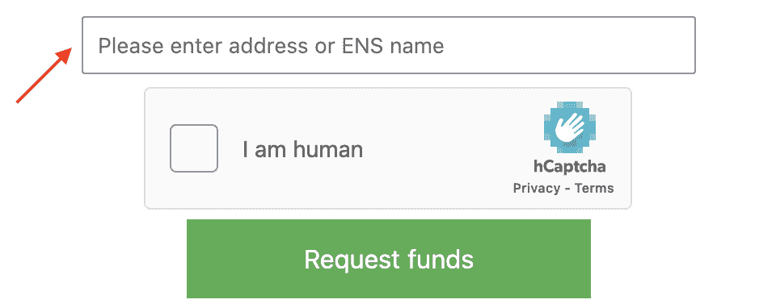
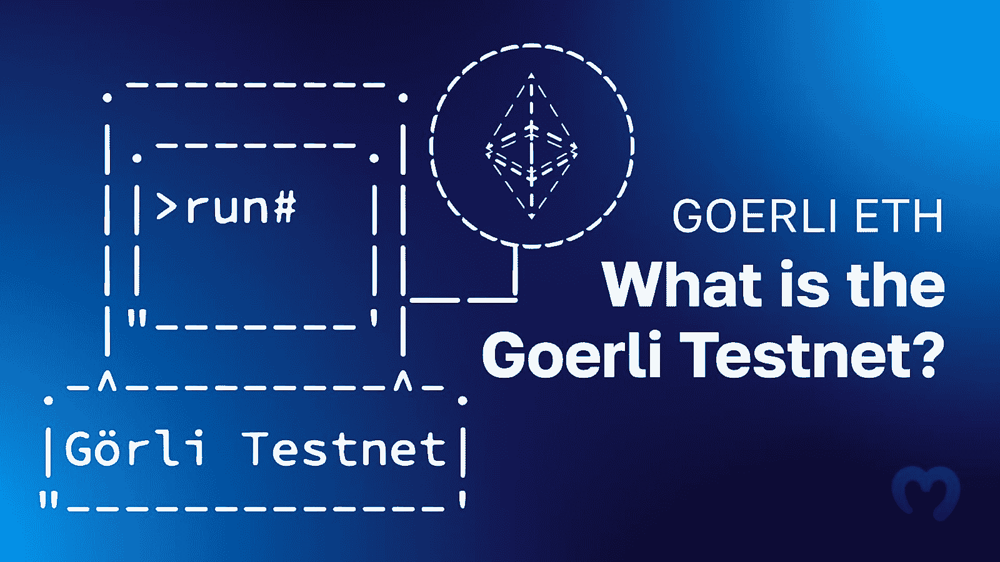
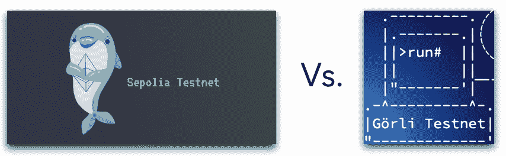
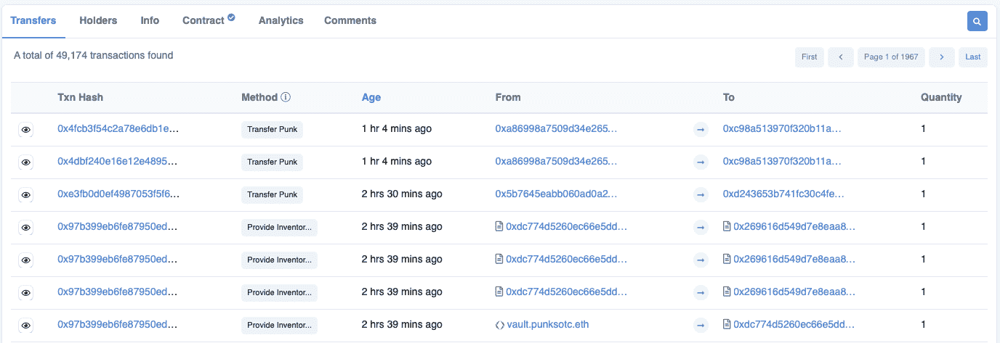
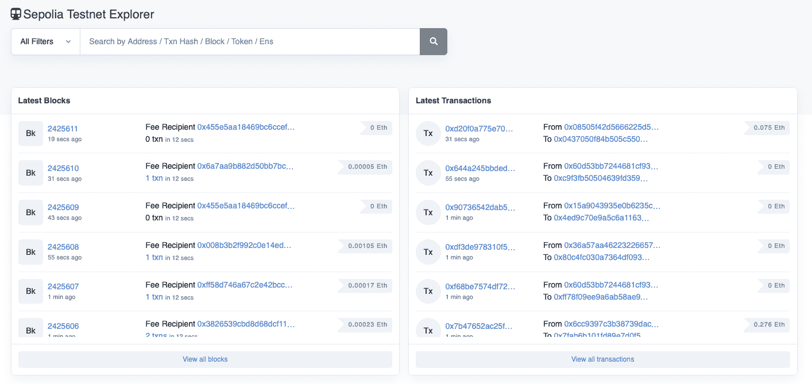

# Sepolia Testnet 指南——什么是 Sepolia Testnet？

> 原文：<https://moralis.io/sepolia-testnet-guide-what-is-the-sepolia-testnet/>

testnet 对 Web3 开发者来说是最有价值的工具之一，因为它提供了一个安全可靠的环境，用于在提交给 mainnet 之前测试项目的性能。此外，通过测试网，区块链开发人员可以节省宝贵的时间和资源。以以太坊为例，社区维护着两个中央公共测试网，其中一个是 Sepolia。由于 Sepolia 是以太坊最著名的利害关系证明(PoS)测试网之一，我们将通过这篇文章来探索这个网络的复杂性。因此，如果你想了解更多这方面的知识，请加入我们的指南，因为我们开始回答这个问题，“什么是 Sepolia 测试网？”。

首先，本文将探讨 Sepolia 的复杂性以及为什么 testnets 是必要的。从那里，本文提供了一个获取 Sepolia testnet ETH 的简短教程，开发人员用它来支付网络上的交易。接下来，我们将比较 Sepolia 和其他网络，例如 Goerli，这是以太坊社区目前维护的另一个 testnet。在本指南的最后部分，您将了解到 Sepolia Etherscan，一个用于 Sepolia testnet 的区块链浏览器！

如果你已经熟悉了 Sepolia testnet，可以考虑在[Moralis](https://moralis.io)’[Web3 博客](https://moralis.io/blog/)查看更多内容。例如，阅读 [ethers.js vs Web3 streams](https://moralis.io/ethers-js-vs-web3-streams-the-best-option-for-blockchain-developers/) 或者学习如何[部署 AWS Lambda 函数](https://moralis.io/deploying-lambda-functions-how-to-deploy-aws-lambda-function-tutorial/)。此外，如果你想进入 Web3 开发领域，现在就和 Moralis 签约吧！有了帐户，您就可以立即访问诸如 Moralis 的[web 3 API](https://moralis.io/web3-apis-exploring-the-top-5-blockchain-apis/)等工具，从而释放区块链技术的全部力量！

## 什么是 Sepolia Testnet？

Sepolia 是以太坊最著名的利害关系证明(PoS)测试网之一，最初于 2021 年 10 月推出。此外，Sepolia 和 Goerli 是两个没有被弃用的主要试验网之一。这意味着 Sepolia 目前由客户开发者维护，确保它是一个安全和准确的测试环境。

在 2021 年推出时，Sepolia 最初实施了一个工作证明(PoW)共识机制。然而，随着*合并的到来，* Sepolia 加入了 PoS Sepolia 信标链，并且——很像以太坊主网——现在应用了 PoS 共识机制。自从*合并*，Sepolia 现在模仿以太坊 mainnet，使其适合在精确的环境中测试智能合约和 dapps。

但是，为什么首先需要一个像 Sepolia 这样的 testnet 呢？如果你还不知道，天然气是需要支付链上交易。因此，在以太坊这样的主网上直接开发 dapps 和其他区块链项目会变得非常昂贵。这就是像 Sepolia 这样的测试网提供更经济友好和无缝的开发者体验的地方。

Sepolia 几乎是以太坊的一个完全相同的副本，Web3 开发者可以用它来测试运行他们的 Web3 项目。因此，开发人员可以在提交以太坊主网之前设计、创建、测试和跟踪他们项目的公共性能。这对开发者来说既经济又有利，因为他们不需要投入资金，对整个 Web3 生态系统来说也是积极的，因为只有久经考验的 dapps 才能进入 mainnet。

然而，基于 Sepolia 的交易也需要 Sepolia testnet ETH 形式的 gas。因此，您仍然需要令牌来在这个 testnet 上运行事务。幸运的是，使用水龙头可以免费获得 Sepolia testnet ETH！

## 如何获取 Sepolia Testnet ETH

任何人都可以通过 Sepolia testnet 水龙头获得 Sepolia testnet ETH，允许开发者向他们的钱包发送少量的 Sepolia ETH。他们可以使用收到的 ETH 来支付 Sepolia testnet 上的交易。这些测试网令牌模仿真实以太网在以太坊主网上的功能。此外，您可以通过三个步骤轻松获得 Sepolia testnet ETH:

1.  参观*【sepolia faut ceth】*[【https://faut cet . sepolia . dev】](https://faucet.sepolia.dev/)。
2.  将您的钱包地址或 ENS 名称添加到输入栏:

3.  点击验证码和“申请资金”按钮:

只要你点击“请求资金”按钮，你就会看到一个弹出窗口，显示“交易已发送”的消息，以及有关发送到你钱包的 Sepolia testnet ETH 金额的信息。因此，现在您已经有了一些 Sepolia ETH，您可以立即开始在 testnet 上运行智能合约！

## Sepolia 与其他测试网有何不同？

现在，您已经更加熟悉了 Sepolia testnet 需要什么以及如何获得 Sepolia testnet ETH，让我们将这个网络与您在 Web3 开发过程中可能遇到的其他著名的 testnet 进行比较。所以，不再多说，让我们来回答这个问题，“Sepolia 与其他测试网有什么不同？”。

以前以太坊有很多不同的 testnets，比如 Ropsten，Rinkeby，Kovan 等。然而，前面提到的例子和附加的测试网现在已经被否决了。当这种情况发生时，社区停止提供客户端更新。这并不意味着网络完全消失，而是失去了与以太坊虚拟机(EVM)的对等性。因此，废弃的网络不再是测试 dapps 和其他 Web3 项目的准确或安全的环境。

不像罗普斯滕，林克比，科万等。，Sepolia 没有被弃用，仍然由以太坊社区维护。因此，Sepolia 与这些测试网最显著的不同之处在于它是持续维护的。因此，它是测试基于以太坊的项目的合适环境。

然而，结合 Sepolia，以太坊社区仍然维护的另一个测试网是 Goerli。因此，比较这两个网络变得更加有趣，因为在您的 Web3 开发工作中，您最有可能使用这两个网络中的任何一个。但是，在比较 Sepolia 和 Goerli 之前，我们需要通过回答“什么是 Goerli testnet？”这个问题来更深入地了解后者。

### 什么是 Goerli Testnet？

Goerli 或 Gö rli 于 2018 年首次推出，与 Sepolia 一起，是以太坊最重要的测试网之一。Goerli 在 ETHBerlin 开始是一个黑客马拉松项目，但直到 2019 年，这个 testnet 才在柏林的 Gö rliCon 正式推出。此外，像 Sepolia 一样，Goerli 仍然由以太坊社区维护，这对于其他著名的测试网来说就不一样了，正如上一节所解释的，这些测试网已经被废弃了。

在发布时，Goerli 是第一个社区构建的、权威证明(PoA)以太坊测试网，具有跨客户端功能。然而，就像 Sepolia 一样，Goerli 通过与 Beacon Chain 合并，在 *The Merge* 出现期间，从最初的共识机制过渡到了 PoS。

那么，是什么让格利与众不同呢？如前所述，Goerli 具有跨客户端功能，这是 testnet 最显著的优势之一。客户端对于以太坊生态系统至关重要，它允许开发者使用不同的编程语言与网络进行交互。以太坊基金会维护不同语言的各种客户端，如 Java、Rust、Go、C#等。一些著名的客户例子是奇偶校验，尼瑟迈德和 Geth。然而，尽管 mainnet 支持不同的客户端，但对于其他测试网，如 Rinkeby 和 Kovan，情况就不一样了。

因此，这就是 Goerli 在单一测试网络中为客户提供协同作用的地方。因此，Goerli 支持各种客户端和节点软件。这包括 Geth，奇偶性，虚空思维等。这意味着以太坊开发者现在有了一个统一的测试网！

关于这个测试网的更多信息，请查看我们的" [*什么是 Goerli 测试网？*](https://moralis.io/goerli-eth-what-is-the-goerli-testnet/) “文章！

然而，现在你对 Goerli testnet 和它所包含的内容更加熟悉了，让我们用下面的部分来比较一下 Sepolia 和 Goerli！

### 塞波利亚 vs 戈利

现在你对赛波利亚和戈利有了更深刻的了解，这一节将对两者进行比较。通过这样做，您将了解到这两个 testnets 之间的相同点和不同点！

*   Sepolia 是以太坊为 dapp 开发推荐的主要测试网络。这个 testnet 使用了一组许可的验证器，并且相对较新，表明它的状态和历史都相对较小。因此，运行的节点需要更少的存储，网络可以快速同步。因此，如果您想直接与网络交互，可以快速启动节点。然而，在下面，你会发现三个重要的 Sepolia 要点:

1.  快速同步
2.  一组封闭的验证器
3.  相对较新的 testnet 托管的应用程序比其他网络少

*   goer Li–goer Li 是执行验证和定位测试的推荐测试网。此外，与 Sepolia 不同，Goerli 对所有希望运行自己的 testnet 验证程序的开发人员开放。因此，希望测试新协议升级的利益相关者应该在使用以太坊主网之前使用这个测试网。你可以在下面找到三个重要的 Goerli 要点:

1.  一组开放的验证器
2.  大舞台–有助于测试复杂的智能合约
3.  为正在运行的节点和更长时间的同步提供更多存储

尽管如此，基于上面的简要描述，还是有可能识别出适用于不同场景的测试网之间的差异。因此，在您的开发工作中，您是选择 Sepolia 还是 Goerli 应该取决于您正在创建的项目。

## sep olia Testnet Explorer–sep olia ethers can

在这一节中，我们将简要介绍 sep olia ethers can——sep olia testnet 区块链浏览器。然而，你可能不熟悉什么是区块链探险者。因此，首先，让我们从回答“什么是区块链探险家”这个问题开始。

区块链浏览器是一个软件，它使用节点和 API 从各自的网络中获取链上数据。此外，它们还具有在线界面。因此，它们允许用户无缝地搜索网络。此外，通过区块链浏览器，Web3 开发人员可以很容易地检索数据块，地址，费用，交易，等等！例如，用户可以输入一个合同地址，并接收整齐地显示在表格中的相关信息:

上面的截图展示了来自 Etherscan 的一个例子。如果你不知道，以太扫描是最重要的以太坊区块链探险家之一。此外，由于测试网是它们自己的区块链，独立于它们模仿的主网，它们也有自己的探索者。对于 Sepolia 也是如此，一个很好的例子就是 Sepolia Etherscan:

Sepolia Etherscan 是一个 Sepolia 区块链资源管理器，提供了对与测试网相关的链上数据的简单访问。因此，开发人员可以将这个工具用于许多不同的用例。例如，开发人员可以检查他们的合同是否部署成功，查找块数据，查看事务历史等。因此，Sepolia Etherscan 是一个优秀的开发工具，可以帮助以太坊开发人员在 testnet 上监控他们项目的性能！

如果你已经加入了我们，你现在对 Sepolia testnet 和 Sepolia Etherscan explorer 有了更好的了解！

## Sepolia Testnet 指南-摘要

Sepolia 于 2021 年首次推出，与 Goerli 一起，是目前由社区维护的两个以太坊试验网之一。起初，Sepolia 的特色是 PoW(工作证明)共识机制。然而，由于*的合并，*测试网从 PoW 过渡到 PoS(proof-of-stage)来模仿以太坊主网。此外，在两个维护的初级以太坊测试网中，Sepolia 是社区推荐用于 dapp(分散应用程序)开发的一个。

Testnets 是 Web3 开发人员最有价值的工具，因为它们允许开发人员节省宝贵的资源和时间。因此，通过像 Sepolia 这样的测试网，开发者可以在将他们的项目部署到以太网之前测试它们的公共性能！

如果你真的想进入 Web3 开发，考虑加入 Moralis。Moralis 提供各种企业级开发工具，允许您充分利用区块链技术的力量。例如，一个很好的例子是 Web3 [Streams API](https://moralis.io/streams/) 。有了这个工具，你可以使用[Moralis 网钩子](https://moralis.io/moralis-webhooks-an-introduction-to-web3-webhooks/)将[链上数据](https://moralis.io/on-chain-data-the-ultimate-guide-to-understanding-and-accessing-on-chain-data/)流入你所有项目的后端！

此外，如果你想成为一名更熟练的 Web3 开发者，今天就报名参加[Moralis 学院](https://academy.moralis.io)！该学院为新的和更有经验的开发人员提供了许多很好的课程。比如用以下课程学习行业基础知识:“[区块链&比特币基础](https://academy.moralis.io/courses/blockchain-bitcoin-101)”。

然而，要获得更无缝的开发者体验，[立即注册 Moralis](https://admin.moralis.io/register) 。您可以免费创建一个帐户，只需点击几下，因此您不会有任何损失！