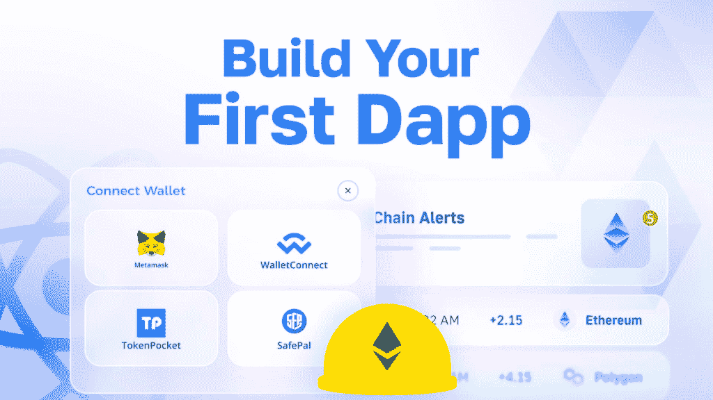
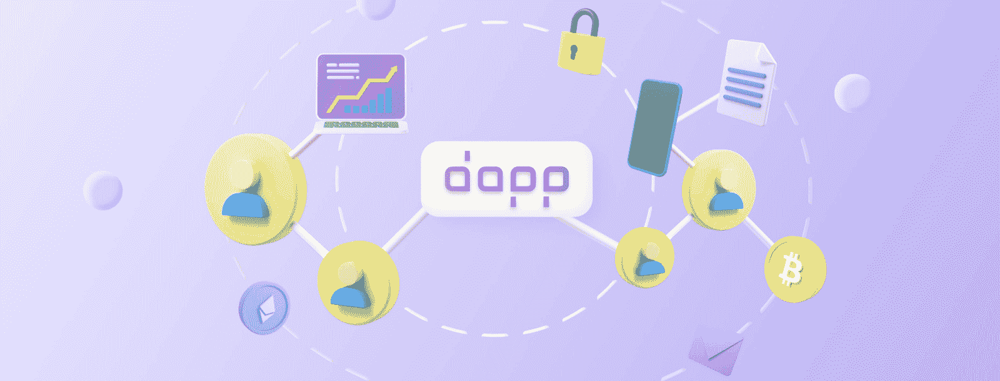
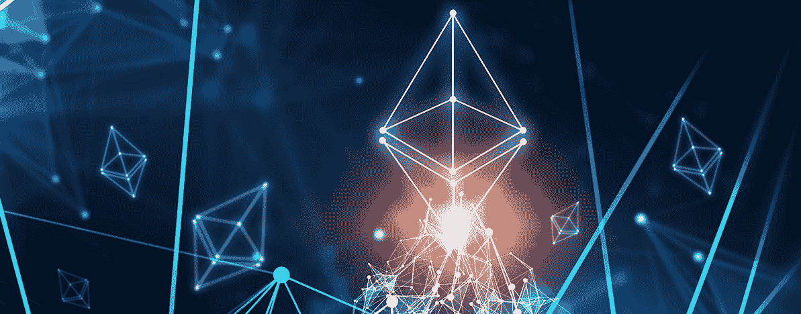
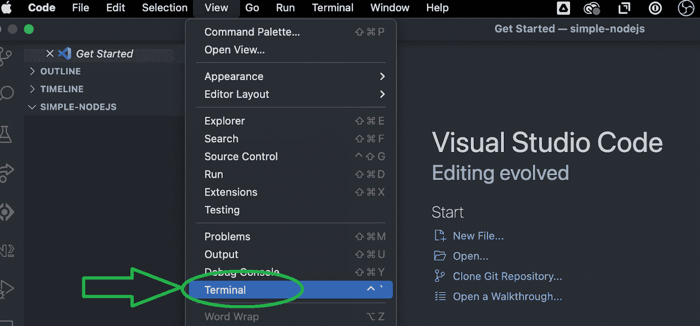
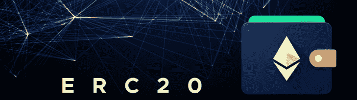
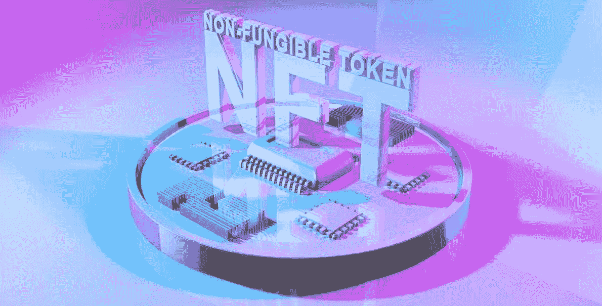
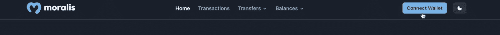
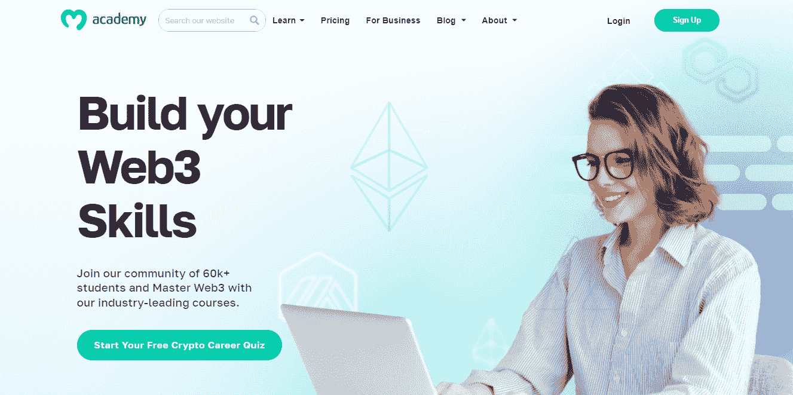

# 设置 Dapp 并将其连接到以太网

> 原文：<https://moralis.io/set-up-and-connect-a-dapp-to-the-ethereum-network/>

了解如何以简单的方式设置 dapps 并将其连接到以太坊！本教程让您设置一个功能齐全的 Web3 应用程序，并以创纪录的速度将您的 dapp 连接到以太坊网络。你所需要做的就是 Moralis ( [**领先的企业级 API 提供商**](http://moralis.io/) **)和我们的以太坊样板。然而，由于我们的主要焦点是在后端，我们鼓励你坚持到这篇文章的结尾，在那里你将使用一个** [**Web3 网站模板**](https://moralis.io/web3-template-build-a-dapp-using-a-web3-website-template/) **。而且，在撸起袖子之前，一定要了解基础。因此，我们将从解释什么是分散式应用程序开始这篇文章。接下来，我们将看看构建 dapp 并将其连接到以太坊所需的组件。此外，我们将检查以太坊网络的基础！**

一旦您掌握了速度，我们将带您从头开始使用 NodeJS 和 Moralis 构建 dapp 的步骤。前者是一个开源、跨平台、后端 JavaScript (JS)运行时环境，在 web 浏览器之外执行 JS 代码。另一方面，Moralis 是权威的 Web3 API 提供者。它使您能够用单行代码整合 Web3 功能。此外，Moralis 是跨链互操作的，并支持所有领先的区块链。因此，通过学习如何连接到以太坊，你也学习如何连接到其他 EVM 兼容链。因此，如果你想加入网络 3 革命，[创建你的免费 Moralis 账户](https://admin.moralis.io/register)并开始“建设”通过 Moralis，你可以很容易地将 dapp 连接到以太坊或任何其他领先的连锁店。

## 什么是分散式应用？

分散式应用程序，或称 dapps，是允许用户以某种方式与区块链交互的应用程序。一方面，dapps 可以是简单的探索者，用户可以浏览链上数据或探索他们钱包的内容。另一方面，dapps 可以更高级，可以与智能合约交互。说到智能合约，这些" [Web3 合约](https://moralis.io/what-are-web3-contracts-exploring-smart-contracts/)"本质上是链上程序。它们确保一旦满足预定义的条件，就执行预定义的操作。



需要指出的是，目前许多 dapps 都是 Web2-Web3 的混合体。因此，权力下放的程度可能有所不同。然而，所有的 dapp 都有一个共同点——它们为用户提供了一种将他们的 Web3 钱包连接到 dapp 支持的链上的方式。这个过程被称为 [Web3 认证](https://moralis.io/authentication/)。此外，除了身份验证，当涉及到 Web3 功能时，大多数 dapps 都关注相同的功能。这就是为什么一组领先的 Web3 APIs 工作得如此之好。最终，这样的 API 使你能够将 dapp 连接到以太坊和其他 EVM 兼容的链。



### 构建 Dapp 并将其连接到以太坊的组件

如果你想简单地构建 dapp 并将其连接到以太坊，你需要使用正确的工具。幸运的是，Web3 技术在最近几年已经有了长足的进步。因此，您不再需要处理 RPC 节点的所有限制。相反，您可以使用 node 和 Web3 API 提供程序。此外，感谢 Moralis，您可以使用您的 Web2 开发技能开始实现 Web3 功能。当然，构建 dapp 并将其连接到以太坊的组件可能会有所不同；但是，一般来说，您需要以下内容:

*   **后端**–应用程序的服务器端(例如，NodeJS 和 Express 服务器)。
*   **前端**–应用程序的客户端(如 ReactJS 或 NextJS)。
*   **web 3 API**–查询链上数据需要这些 API。
*   智能合约(Smart Contracts)–如果你想整合更高级的 Web3 特性，Web3 合约是必不可少的。
*   **数据存储**–目标应该是使用分散式解决方案(如 IPFS)。
*   **Web3 钱包**–区块链或 Web3 钱包对于执行在线交易和测试您的 dapps 至关重要。

需要指出的是，Web3 钱包本身并不是 dapp 组件。相反，它们是开发者和用户可以利用的第三方解决方案(例如 MetaMask)。



## 以太坊网络是什么？

以太坊是第一个可编程区块链，它仍然是 dapp 开发的最大区块链。此外，以太坊网络包括自己的原生硬币/令牌 ETH(以太)。后者是市值第二大的加密资产。此外，以太坊为任何能上网的人提供了获取数字货币和数据友好型服务的途径，无论他们身处何地。最终，以太坊网络是一种社区构建的技术，由不同领域(金融、游戏、营销等)的无数分散应用组成。).由于网络的 EVM(以太坊虚拟机)，所有这些 dapps 都与以太坊链进行操作和交互。有趣的是，大多数其他可编程链也依赖于 EVM。

此外，由于以太坊网络，用户可以向任何拥有有效以太网地址的人发送以太网和其他 EVM 兼容令牌。然而，以太坊的主要优势是其可编程性和对智能合约的支持，这是 dapp 开发的支柱。当然，今天，我们有其他几个可编程的区块链；然而，以太坊仍然是最受欢迎的。以太坊是同类建筑中的第一个，这一事实创造了一个广泛的世界性社区。这种去中心化的社区赋予以太坊网络很多价值。因此，作为开发者，知道如何连接以太坊是很重要的。*如果你想了解更多关于以太坊的知识，我们推荐你报名参加 Moralis 学院的“* [*以太坊基础*](https://academy.moralis.io/courses/ethereum-101) *”课程。*


## 使用 Moralis 和 NodeJS 将 Dapp 连接到以太坊

使用 NodeJS 和 Moralis 将 dapp 连接到以太坊需要完成以下五个步骤:

1.  **创建一个节点 JS Dapp**
2.  **导入并设置最新的 Moralis NodeJS SDK**
3.  **建立一个简单的快递服务器**
4.  **将 Moralis APIs 集成到您的 Dapp 中**
5.  **从以太坊和其他网络获取任何区块链数据**

在你着手上述步骤之前，请确保你已经注册了一个免费的 Moralis 帐户。此外，安装并设置您最喜欢的代码编辑器——我们使用 Visual Studio Code (VSC)。最后但同样重要的是，您还应该在继续之前安装 NodeJS。具备这些先决条件后，您就可以连接以太坊了。

### 创建 NodeJS Dapp

通过在 VSC 打开一个新文件夹，开始创建 NodeJS dapp 的过程。为了避免混淆，我们鼓励您按照我们的指导，将您的文件夹命名为“Simple-NodeJS”。然后，打开一个新的 VSC 终端:



接下来，输入“ *npm init* ”命令来初始化一个新项目。另外，给你的项目起个名字，根据你的喜好填写细节。最简单的方法是坚持默认选项(只需按几次 enter 键)。成功初始化 NodeJS 项目后，您应该会看到一个新的“package.json”文件。

### 导入并设置最新的 Moralis NodeJS SDK

为了使用 Moralis，您需要安装" *moralis* "依赖项。既然您将在下一步中关注于设置一个 Express 服务器，那么安装“ *express* ”依赖项也是有意义的。相应地，使用终端执行“ *npm install moralis express* ”命令。

### 设置一个简单的快速服务器

现在已经有了" *express* "依赖项，可以设置 express 服务器了。因此，创建一个“index.js”文件，并添加以下代码行:

```js
const express = require('express')
const app = express()
const port = 3000

app.get('/', (req, res) => {
  res.send('Hello World!')
})

app.listen(port, () => {
  console.log(`Example app listening on port ${port}`)
})
```

接下来，打开“package.json”文件并添加“ *start* 脚本:

```js
"scripts": {
  "start": "node index.js"
},
```

有了上面几行代码，您就可以使用“ *npm run start* ”命令运行您的 Express 服务器了。然后，您可以使用您的浏览器访问“*http://localhost:3000”*,在那里您应该会看到“Hello World！“问候。

### 将您的应用与 Moralis 服务相集成

现在，为了将您的 NodeJS 应用程序与 Moralis 的服务集成，请使用上面创建的“index.js”文件。这是您将导入 Moralis 及其 EVM API 的地方。此外，这也是您提供 Moralis Web3 API 密钥的地方。因此，在“index.js”文件的顶部添加以下导入行:

```js
// Import Moralis
const Moralis = require('moralis').default
// Import the EvmChain dataType
const { EvmChain } = require("@moralisweb3/evm-utils")
```

然后，添加这些变量:

```js
const MORALIS_API_KEY = "replace_me"
const address = "replace_me"
const chain = EvmChain.ETHEREUM
```

查看上面的变量，可以看到您需要输入某些值。具体来说，您必须提供您的 Moralis Web3 API 密钥和一个区块链地址(您希望区块链数据来自的链)。因为我们的目标是将 dapp 连接到以太坊，“*以太坊”表示*我们将使用这个领先的链。然而，您也可以通过将“*以太坊*”替换为任何支持的链来关注其他 EVM 兼容链。

#### 获取您的 Moralis Web3 API 密钥

如果你还没有创建你的免费 Moralis 账户，现在就创建吧。您可以使用简介中的“[创建您的免费 Moralis 帐户](https://admin.moralis.io/register)”链接或 Moralis 主页上的“[免费启动](https://admin.moralis.io/register)”按钮:


创建并确认您的帐户后，您将能够访问您的管理区。从那里，您将能够通过两个简单的步骤获得您的 Moralis Web3 API 密钥:


尽管如此，您还需要“index.js”中的以下代码行来初始化 Moralis:

```js
const startServer = async () => {
  await Moralis.start({
    apiKey: MORALIS_API_KEY,
  })
```

*注意* *:不要忘记用你的 Moralis Web3 API 密匙和一个实际的以太坊地址替换“replace_me”。*

### 将 Dapp 连接到以太坊，获取区块链数据

准备好 NodeJS 应用程序并集成了 Moralis 后，您可以使用 Moralis EVM API 获取各种链上数据。然而，出于本教程的考虑，我们将重点放在获取原生余额、ERC-20 余额和 NFT 上。但是，我们鼓励您探索终极 EVM API 的其他端点。


#### 获取本地余额

如果您通过我们的说明将 dapp 连接到以太坊，您可以使用 Moralis 的" *getNativeBalance* "端点来获取本机余额。为此，在“index.js”文件中创建“ *getDemoData* 函数:

```js
async function getDemoData() {
  // Get native balance
  const nativeBalance = await Moralis.EvmApi.balance.getNativeBalance({
    address,
    chain,
  })

  // Format the native balance formatted in ether via the .ether getter
  const native = nativeBalance.result.balance.ether

  return { native }
}
```

正如您在上面看到的那样，“*getNativeBalance*”EVM API 端点接受一个地址和一个链作为参数。因为我们已经在“index.js”中定义了这两个参数，所以我们可以在这里使用它们。此外，您还需要添加“ */crypto-data* ”端点来返回“ *getDemoData* 函数的结果:

```js
app.get("/demo", async (req, res) => {
  try {
    // Get and return the crypto data
    const data = await getDemoData()
    res.status(200)
    res.json(data)
  } catch (error) {
    // Handle errors
    console.error(error)
    res.status(500)
    res.json({ error: error.message })
  }
})
```

有了上面几行代码，您就可以使用“*http://localhost:3000/demo*”调用“ */crypto-data* ”端点了。此外，响应应该是这样的:

```js
{
    "native": "0.169421625822962794"
}
```



#### 获取 ERC-20 天平

你可能知道，有许多 ERC 20 代币。因此，能够显示它们的余额是非常重要的。幸运的是，Moralis 提供了" *getWalletTokenBalances* "端点来完成这个任务。因此，下面是您可以添加到“ *getDemoData* ”函数以获取 ERC-20 余额的代码行:

```js
    // Get token balances
  const tokenBalances = await Moralis.EvmApi.token.getWalletTokenBalances({
    address,
    chain,
  })

  // Format the balances to a readable output with the .display() method
  const tokens = tokenBalances.result.map((token) => token.display())

  // Add tokens to the output
  return { native, tokens }
}
```



#### 获取 NFT

当你知道如何将 dapp 连接到以太坊时，你也可以获取 NFT。出于本教程的考虑，我们将使用函数" *getDemoData* 获取给定地址的前十个 NFT。此外，我们还必须相应地格式化输出——将“ *nfts* 添加到“ *return* ”中。尽管如此，这些代码行将获取 NFT 并返回它们的元数据:

```js
   const nftsBalances = await Moralis.EvmApi.nft.getWalletNFTs({
    address,
    chain,
    limit: 10,
  })

  // Format the output to return name, amount and metadata
  const nfts = nftsBalances.result.map((nft) => ({
    name: nft.result.name,
    amount: nft.result.amount,
    metadata: nft.result.metadata,
  }))

  // Add nfts to the output
  return { native, tokens, nfts }
}
```

*注:* *您可以在“* [*使用 NodeJS*](https://docs.moralis.io/docs/nodejs-dapp-from-scratch) *”文档页面下方查看“index.js”文件的最终完整代码。*



### 使用以太坊样板

上面的教程都是关于后端的。然而，您可能也对“前端”快捷方式感兴趣。如果有，一定要看下面的视频教程。在这篇文章中，你将有机会跟随我们的一位内部专家的指导，他使用了作为 Web3 模板的终极以太坊样板。后者使您能够通过三个步骤创建一个去中心化的应用程序[:](https://moralis.io/how-to-create-a-decentralized-app-in-just-3-steps/)

1.  克隆 GitHub 上等待你的以太坊样板代码。
2.  自定义特定的环境变量。
3.  启动这个 Web3 模板 dapp 的实例。

使用我们的以太坊样板是将 dapp 连接到以太坊的最快方式。毕竟，完成所需步骤不超过六分钟。

https://www.youtube.com/watch?v=Bb5Pc–kyAY&t=10s

## 设置 Dapp 并将其连接到以太坊网络–摘要

今天的文章教你如何设置和连接 dapp 到以太坊。我们主要关注使用 NodeJS 和 Moralis 的 EVM API 建立一个后端 dapp。例如，我们演示了如何获取本机余额、ERC-20 余额和 NFTs。你也有机会了解 dapps 是什么。此外，我们还向您介绍了构建 dapps 和连接以太坊所需的组件。此外，我们为您提供了以太坊网络的简单解释。最后但同样重要的是，您有机会使用终极以太坊样板，并在六分钟内准备好一份整洁的 dapp。

有了这里获得的技能和知识，你就可以将你的 Web3 开发带到下一个层次。如果你有自己的想法，无论如何，专注于实现它们。然而，你可能会欣赏一些额外的实践。如果是这样，一定要访问 Moralis 文件、 [Web3 YouTube 频道](https://www.youtube.com/c/MoralisWeb3)和[Moralis 博客](https://moralis.io/blog/)。一些最新的话题集中在如何[构建一个 Web3 应用](https://moralis.io/how-to-build-a-web3-app/)和[如何将 MetaMask 连接到网站](https://moralis.io/how-to-connect-metamask-to-website-with-nextjs/)。此外，您可以探索[顶级区块链 API](https://moralis.io/web3-apis-exploring-the-top-5-blockchain-apis/)，如何构建 [Web3 FIFA 克隆](https://moralis.io/how-to-build-a-web3-fifa-clone/)等等。本质上，有了这三个途径，你可以免费成为一个自信的 Web3 开发者。

另一方面，你可能有兴趣尽快在区块链行业找到一份好工作。在这种情况下，成为区块链认证可以大大提高你的机会。所以，如果你梦想成为全职加密员，考虑报名参加 Moralis 学院。除了上面提到的“以太坊基础”课程，在这里你可以参加各种各样的区块链发展课程。尽管如此，这也是加入行业中最先进的社区之一的地方。

