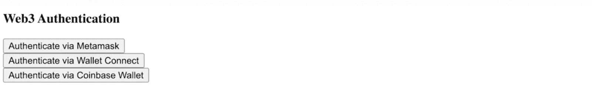
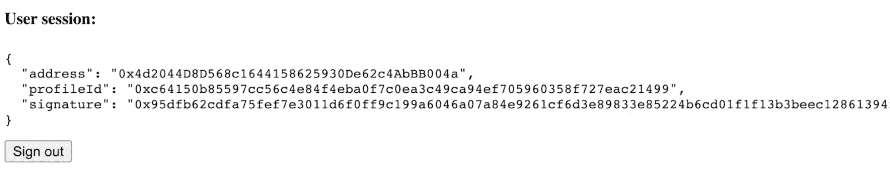
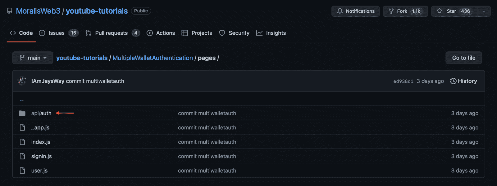
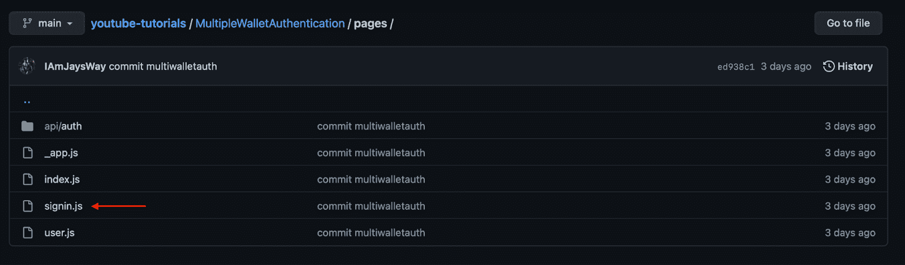

# 使用任何钱包登录您的 Web3 应用程序

> 原文：<https://moralis.io/sign-in-with-any-wallet-to-your-web3-app/>

Web3 身份验证对于构建兼容 Web3 的项目至关重要，因为它提供了更具吸引力的用户体验，并降低了入门摩擦。此外，您知道您可以使用 [Moralis](https://moralis.io) 为任何钱包无缝添加登录功能吗？如果这听起来很有趣，请继续阅读并了解所有您需要了解的关于 Web3 身份验证的知识！

**使用任意钱包文档完全登录—**[**https://github . com/moralisweb 3/YouTube-tutorials/tree/main/MultipleWalletAuthentication**](https://github.com/MoralisWeb3/youtube-tutorials/tree/main/MultipleWalletAuthentication)

**这篇文章将演示如何在你的 Web3 项目中添加任何钱包的登录功能。如果您不想阅读完整的指南，您可以在上面的 GitHub 资源库中找到完整的代码。然而，如果你跟着做，我们将进一步详细解释 Moralis 的 [Auth API](https://docs.moralis.io/docs/web3-authentication) 和代码，这样你就可以用任何钱包登录到你的 Web3 应用。我们还将探索 Moralis 支持的其他认证方法或替代方法，所有这些都是对 [EIP-4361](https://moralis.io/exploring-eip-4361-sign-in-with-ethereum/) 标准的实现。因此，一旦你完成阅读，你将有望知道如何在所有未来的项目中实现几种不同的 [Web3 钱包](https://moralis.io/what-is-a-web3-wallet-web3-wallets-explained/)认证机制。**

**此外，Moralis 的 Auth API 只是该平台众多有价值的工具之一。例如，Moralis 还提供了一个复杂的 NFT API，使得轻松无缝地开发与 NFT 相关的项目成为可能。**

**所以，一定要注册 Moralis，因为这个平台提供了更无缝的开发者体验。Moralis 可以帮助所有的 Web3 开发工作，并且创建一个帐户是完全免费的！**

## **使用任何钱包登录**

**您是否希望创建一个新的 Web3 dapp，将现有的 Web2 数据库与 Web3 身份验证合并，或者为您的业务身份验证流程使用 Auth0 之类的身份验证聚合器？如果你是——或者可能发现自己处于这些情况中的任何一种——那么 Moralis Web3 Auth API 正是你所需要的！**

**

从传统的角度来看，在 dapps 和其他分散的项目中实现 [Web3 认证](https://moralis.io/authentication/)机制一直是一项繁琐的任务。它通常要求开发者将用户重定向到第三方认证接口，掌握不同的钱包标准，更新和维护认证解决方案等。然而，Moralis 的 Web3 Auth API 不再是这种情况。

Moralis 为所有不同的身份验证方法提供了一个统一的 API，并提供了一个复杂的 SDK，便于集成。此外，该 API 与其他身份验证聚合器兼容，并不断添加新的身份验证机制。因此，当使用 Moralis 的 API 时，您可以确保您的认证流程在快速发展的行业中经得起未来的考验。

Moralis 的验证 API 增强了您项目的验证能力，允许您的用户使用任何钱包登录。该开发工具结合了 Web3 技术的强大功能和 Web2 开发的易用性。因此，您可以为用户提供最安全、最直接的方式来注册您的所有项目。

此外，该 API 是跨链兼容的，这意味着您只需一行代码就可以将 Web3 身份验证集成到多个不同的链中。因此，当使用 Moralis 时，您不需要在复杂的集成上浪费不必要的时间。

此外，在快速发展的行业中，使用 API 可以消除入职摩擦，让您的身份认证流程经得起未来考验。所以，如果你想创建兼容 Web3 的项目，你可以通过注册 Moralis 免费试用这个 API！

## 使用 Moralis 为任何钱包添加登录功能

随着对 Moralis 的 Auth API 有了更深刻的理解，我们现在将通过向您展示如何使用任何钱包登录来说明该工具的强大功能。接下来，我们将创建一个简单的应用程序，用户可以使用 MetaMask、WalletConnect 或比特币基地钱包进行登录。我们将使用这些作为例子，因为不幸的是，我们没有时间来涵盖所有选项 Moralis 支持。尽管如此，无论您希望添加哪种身份验证方法，整个过程都是一样的，只是在这里或那里做了一些调整。

为了演示我们将在本教程中创建的内容，我们将提供两个屏幕截图:一个用于登录页面，一个用于用户页面:

**登录页面:**



**用户页面:**



正如您从上面的图片中看到的，登录页面为每个选项提供了三个身份验证按钮。要创建这个简单的应用程序，您只需访问我们最初链接的 GitHub 存储库，并将代码下载到您的本地存储库。

有了所有的代码，您必须安装所有必要的依赖项并运行一个本地开发服务器。运行本地开发服务器将确保项目在“*本地主机 3000* ”上编译，这意味着您可以轻松地测试应用程序。尽管如此，以下是您需要运行的两个命令:

```js
npm i 
```

```js
npm run dev
```

这基本上就是创建这个简单应用程序的基础；然而，我们将在下一节解释代码是如何工作的。反过来，它将使您更容易在未来的项目中添加任何钱包的登录功能。

此外，如果你更喜欢观看视频来自学，请查看下面来自 [Moralis 的 YouTube 频道](https://www.youtube.com/c/MoralisWeb3)的剪辑，了解该应用程序的完整演示以及如何设置:

[https://www.youtube.com/embed/BmxD9KTHEGI?feature=oembed](https://www.youtube.com/embed/BmxD9KTHEGI?feature=oembed)

## 代码演练:为任何钱包添加登录功能

我们将代码演练分为两部分，一部分用于后端，另一部分用于前端。这样做有望让你深入了解如何使用 Moralis 为任何钱包添加签名功能。不幸的是，我们没有时间涵盖代码的所有方面。因此，如果您有任何进一步的问题，请务必在 GitHub repo 查看完整的代码。但是，事不宜迟，让我们直接进入代码，从“api/auth”文件夹开始！



### 授权 API 为任何钱包添加登录功能

“api/auth”文件夹包含两个独立的文件。我们将仔细研究的第一个是请求消息的端点。同时，第二个用于验证消息。尽管如此，让我们仔细分析每个文件，并从仔细查看请求消息的端点开始。所以，这个文件的代码看起来是这样的:

```js
import Moralis from 'moralis';

const config = {
    domain: process.env.APP_DOMAIN,
    statement: 'Web Login.',
    uri: process.env.NEXTAUTH_URL,
    timeout: 60,
};

export default async function handler(req, res) {
    const { address, chain, network } = req.body;

    await Moralis.start({ apiKey: process.env.MORALIS_API_KEY });

    try {
        const message = await Moralis.Auth.requestMessage({
            address,
            chain,
            network,
            ...config,
        });

        res.status(200).json(message);
    } catch (error) {
        res.status(400).json({ error });
        console.error(error);
    }
}
```

上面的代码会触发" *Moralis。Auth.requestMessage()* "函数使用用户的地址和链 ID。此外，这将创建一个发送到客户端的新消息，供用户签名。签名后，会发送另一个 post 请求，这将我们带到第二个文件的代码:

```js
import CredentialsProvider from 'next-auth/providers/credentials';
import NextAuth from 'next-auth';
import Moralis from 'moralis';

export default NextAuth({
    providers: [
        CredentialsProvider({
            name: 'MoralisAuth',
            credentials: {
                message: {
                    label: 'Message',
                    type: 'text',
                    placeholder: '0x0',
                },
                signature: {
                    label: 'Signature',
                    type: 'text',
                    placeholder: '0x0',
                },
            },
              async authorize(credentials) {
                try {
                  // "message" and "signature" are needed for authorisation
                  // we described them in "credentials" above
                  const { message, signature } = credentials;

                  await Moralis.start({ apiKey: process.env.MORALIS_API_KEY });

                  const { address, profileId } = (
                    await Moralis.Auth.verify({ message, signature, network: 'evm' })
                  ).raw;

                  const user = { address, profileId, signature };
                  // returning the user object and creating  a session
                  return user;
                } catch (e) {
                  console.error(e);
                  return null;
                }
              },
        }),
    ],
    // adding user info to the user session object
    callbacks: {
        async jwt({ token, user }) {
            user && (token.user = user);
            return token;
        },
        async session({ session, token }) {
            session.user = token.user;
            return session;
        },
    },
});
```

如这段代码所示，另一个请求被发送到" *Moralis。Auth.verify()* "函数使用来自第一个请求的响应(即消息)和用于在客户端对消息进行签名的签名。

接下来，使用“ *next.auth* ”生成一个用户，包括用户的地址、配置文件 ID 和签名。然后，该用户将被存储在 JWT (JSON web token)的 web 会话中。所以，这就是后端/auth API 部分的代码；让我们继续，仔细看看前端。

### 前端添加任何钱包的登录功能

接下来，我们将进一步了解应用程序的前端。我们这里有几个设置文件，比如“_app.js”、“index.js”等。但是，我们将把重点放在“signin.js”文件上，因为在这里我们可以找到各种身份验证备选方案的大部分基本逻辑。



在这个文件的顶部，您会注意到一些导入。我们对使用 wagmi 引入各种身份验证选项的连接器特别感兴趣。本质上，这就是您将用于所有客户端 Web3 连接的内容。此外，代码看起来是这样的:

```js
import { signIn } from "next-auth/react";
import { useAccount, useConnect, useSignMessage, useDisconnect } from "wagmi";
import { useRouter } from "next/router";
import { MetaMaskConnector } from "wagmi/connectors/metaMask";
import { CoinbaseWalletConnector } from "wagmi/connectors/coinbaseWallet";
import { WalletConnectConnector } from "wagmi/connectors/walletConnect";
import axios from "axios";
```

#### “ *handleAuth(wal)* 函数

在导入之后，我们将关注" *handleAuth(wal)* "函数，在这里我们使用各种 wallet 连接器创建一个连接。“*墙*”参数指定了要使用的替代方案。然而，在建立连接之前，我们创建一个“*用户数据*”常量，用于存储关于用户的信息。然而，函数的第一部分看起来是这样的:

```js
 const handleAuth = async (wal) => {
    if (isConnected) {
      await disconnectAsync();
    }

    console.log("Connect To Site Via Wallet");

    const userData = { network: "evm" };
```

接下来，我们有三个“ *if* ”语句用于各种选项，如下所示:

```js
 if (wal === "meta") {
      const { account, chain } = await connectAsync({
        connector: new MetaMaskConnector({}),
      });
      userData.address = account;
      userData.chain = chain.id;
    }

    if (wal === "coin") {
      const { account, chain } = await connectAsync({
        connector: new CoinbaseWalletConnector({}),
      });
      userData.address = account;
      userData.chain = chain.id;
    }

    if (wal === "wal") {
      const { account, chain } = await connectAsync({
        connector: new WalletConnectConnector({ options: { qrcode: true } }),
      });
      userData.address = account;
      userData.chain = chain.id;
    }
```

我们以第一个为例。在第一条语句“if (wal === "meta " "”中，代码将使用“ *MetaMaskConnector* ”建立连接。此外，一旦设置了连接，我们就有了钱包地址和链 ID，它们被添加到“*用户数据*常量中。

然后，我们利用这些信息向 Moralis Auth API 发送 post 请求:

```js
console.log("Sending Connected Account and Chain ID to Moralis Auth API");

    const { data } = await axios.post("/api/auth/request-message", userData, {
      headers: {
        "content-type": "application/json",
      },
    });
```

收到消息后，我们再次使用 wagmi 对消息进行签名，然后向 Moralis authentication 发送最终的 post 请求，以验证并创建用户 JWT，我们最后将该用户推送到用户页面:

```js
console.log("Received Signature Request From Moralis Auth API");

    const message = data.message;

    const signature = await signMessageAsync({ message });

    console.log("Succesful Sign In, Redirecting to User Page");

    const { url } = await signIn("credentials", {
      message,
      signature,
      redirect: false,
      callbackUrl: "/user",
    });

    push(url);
```

最重要的是，我们为每个备选项创建一个按钮，在这里我们运行“ *handleAuth(wal)* ”函数，该函数具有与前面的各种“ *if* ”语句相对应的不同参数:

```js
<div>
      <h3>Web3 Authentication</h3>
      <button onClick={() => handleAuth("meta")}>
        Authenticate via Metamask
      </button>
      <br />
      <button onClick={() => handleAuth("coin")}>
        Authenticate via Coinbase
      </button>
      <br/>
      <button onClick={() => handleAuth("wal")}>
        Authenticate via Wallet Connect
      </button>
    </div>
```

这是基本部分，这是“signin.js”文件的最终产品应该是这样的:

```js
import { signIn } from "next-auth/react";
import { useAccount, useConnect, useSignMessage, useDisconnect } from "wagmi";
import { useRouter } from "next/router";
import { MetaMaskConnector } from "wagmi/connectors/metaMask";
import { CoinbaseWalletConnector } from "wagmi/connectors/coinbaseWallet";
import { WalletConnectConnector } from "wagmi/connectors/walletConnect";
import axios from "axios";

function SignIn() {
  const { connectAsync } = useConnect();
  const { disconnectAsync } = useDisconnect();
  const { isConnected } = useAccount();
  const { signMessageAsync } = useSignMessage();
  const { push } = useRouter();

  const handleAuth = async (wal) => {
    if (isConnected) {
      await disconnectAsync();
    }

    console.log("Connect To Site Via Wallet");

    const userData = { network: "evm" };

    if (wal === "meta") {
      const { account, chain } = await connectAsync({
        connector: new MetaMaskConnector({}),
      });
      userData.address = account;
      userData.chain = chain.id;
    }

    if (wal === "coin") {
      const { account, chain } = await connectAsync({
        connector: new CoinbaseWalletConnector({}),
      });
      userData.address = account;
      userData.chain = chain.id;
    }

    if (wal === "wal") {
      const { account, chain } = await connectAsync({
        connector: new WalletConnectConnector({ options: { qrcode: true } }),
      });
      userData.address = account;
      userData.chain = chain.id;
    }

    console.log("Sending Connected Account and Chain ID to Moralis Auth API");

    const { data } = await axios.post("/api/auth/request-message", userData, {
      headers: {
        "content-type": "application/json",
      },
    });

    console.log("Received Signature Request From Moralis Auth API");

    const message = data.message;

    const signature = await signMessageAsync({ message });

    console.log("Succesful Sign In, Redirecting to User Page");

    const { url } = await signIn("credentials", {
      message,
      signature,
      redirect: false,
      callbackUrl: "/user",
    });

    push(url);
  };

  return (
    <div>
      <h3>Web3 Authentication</h3>
      <button onClick={() => handleAuth("meta")}>
        Authenticate via Metamask
      </button>
      <br />
      <button onClick={() => handleAuth("coin")}>
        Authenticate via Coinbase
      </button>
      <br/>
      <button onClick={() => handleAuth("wal")}>
        Authenticate via Wallet Connect
      </button>
    </div>
  );
}

export default SignIn;
```

如果您对代码有疑问，请仔细阅读本文开头提到的 GitHub 资源库中的完整代码。你也可以仔细看看上面的视频，更详细地解释这个过程！

以上就是这个简短的教程，向您展示如何使用任何钱包登录。下一节将探索使用 Moralis 认证用户的其他方法！

## Moralis 认证替代方案

在上一节中，我们演示了如何使用 MetaMask、WalletConnect 和比特币基地钱包对用户进行身份验证。如果您对这些身份认证备选方案有进一步的兴趣，我们还有其他指南，您可能会感兴趣。例如，查看我们的指南，了解如何[添加比特币基地钱包登录功能](https://moralis.io/how-to-add-coinbase-wallet-login-functionality/)或集成[后端 Web3 认证功能](https://moralis.io/how-to-integrate-backend-web3-authentication-functionality/)。

然而，上面提到的选择只是 Moralis 提供的三个例子。在接下来的部分中，我们将仔细研究一些额外的选择！

### 使用 RainbowKit 添加登录

除了前面提到的流行替代方案，Moralis 还支持 RainbowKit。因此，您可以使用 Moralis 在当前或未来的区块链项目中轻松实现对 RainbowKit 的支持。因此，如果你觉得这很有趣，请阅读我们的“[如何使用 RainbowKit](https://moralis.io/how-to-add-a-sign-in-with-rainbowkit-to-your-project-in-5-steps/) 添加登录”教程！

### 使用魔法添加登录。环

另一个令人兴奋的 Moralis 认证替代方案是 Magic.Link。Link 将允许用户无需帐户或密码即可登录您的项目。相反，他们必须输入他们的电子邮件地址，他们将收到一个链接。一旦他们按下链接，他们将被认证。查看下面的文章，了解更多关于实现 Magic 支持的信息。链接:"[用魔法添加签到。通过 5 个步骤](https://moralis.io/add-sign-in-with-magic-link-to-your-nextjs-project-in-5-steps/)链接到你的 NextJS 项目。

### 使用 Django 添加元掩码身份验证

Moralis 允许将元掩码身份验证轻松集成到所有项目中。此外，该平台提供了几个备选方案，您可以在其中实现对元掩码的支持。这里的一个例子是 Django，这是一个流行的 Python 框架。如果你想了解更多这方面的内容，请查看我们关于如何使用 Django 添加元掩码认证的指南。

这些只是实现支持的身份验证选项和方法的一些示例。Moralis 提供了额外的选择，允许您使用任何钱包添加登录功能。因此，在使用该平台时，您不会局限于一个选项！

## 使用任何钱包登录–摘要

本教程教你如何添加任何钱包的登录功能。为了展示 Moralis Auth API 的强大功能，我们展示了如何创建一个简单的应用程序，允许用户使用 MetaMask、WalletConnect 和比特币基地钱包进行身份验证。多亏了 Moralis 平台，我们能够用几行代码轻松实现这三种方法。

除了创建应用程序之外，我们还探索了其他一些身份验证方法。因此，我们了解到，例如，Moralis 提供了对实现 Magic 认证机制的支持。Link 和 RainbowKit。

如果您发现可以通过 Moralis 访问 Web3 身份验证，那么您也应该知道这只是 Moralis 的一个亮点。例如，您可以轻松实现 [Web3 同步](https://moralis.io/syncs/)并创建 [Web3 webhooks](https://moralis.io/web3-webhooks-the-ultimate-guide-to-blockchain-webhooks/) 。

此外，如果你想从总体上了解更多关于区块链发展的信息，请访问 Moralis 的 [Web3 博客](https://moralis.io/blog/)了解更多内容。我们推荐阅读我们关于[区块链 syncs](https://moralis.io/blockchain-syncs-exploring-on-chain-syncing/) 或[Moralis 家的 NodeJS SDK for Web3](https://moralis.io/nodejs-sdk-for-web3-exploring-moralis-nodejs-sdk/) 的文章。此外，你可以[免费注册 Moralis](https://admin.moralis.io/register) 并在几分钟内开始创建复杂的 Web3 项目！因此，请确保立即创建您的帐户，并访问所有平台的工具，以使您的 Web3 开发工作更加容易！**