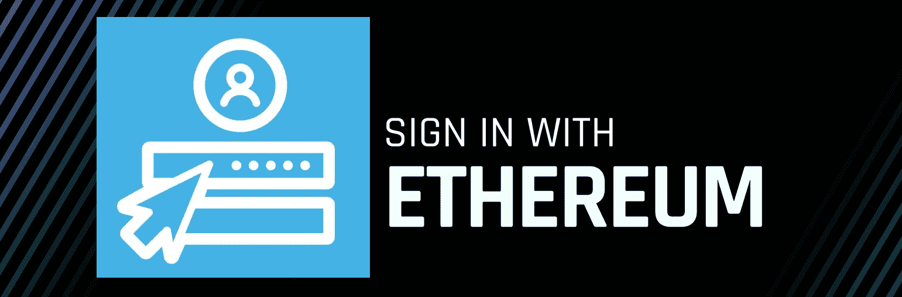
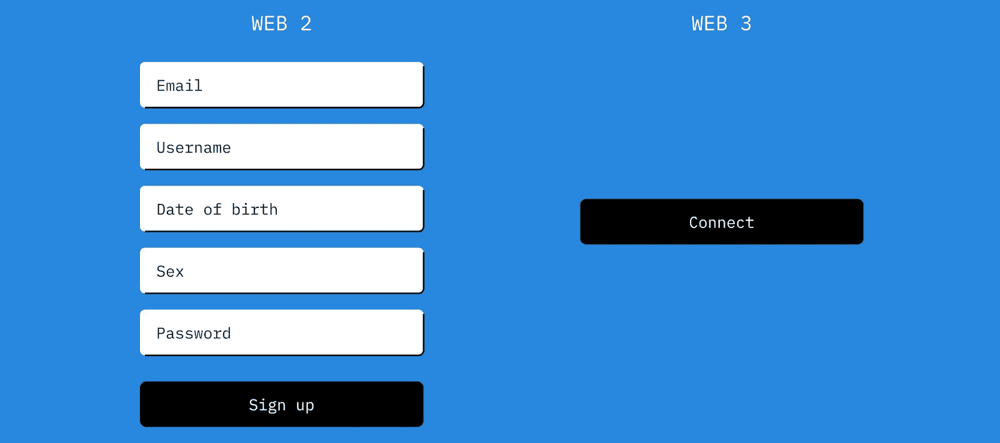
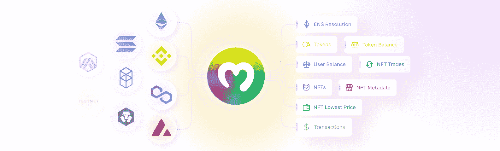
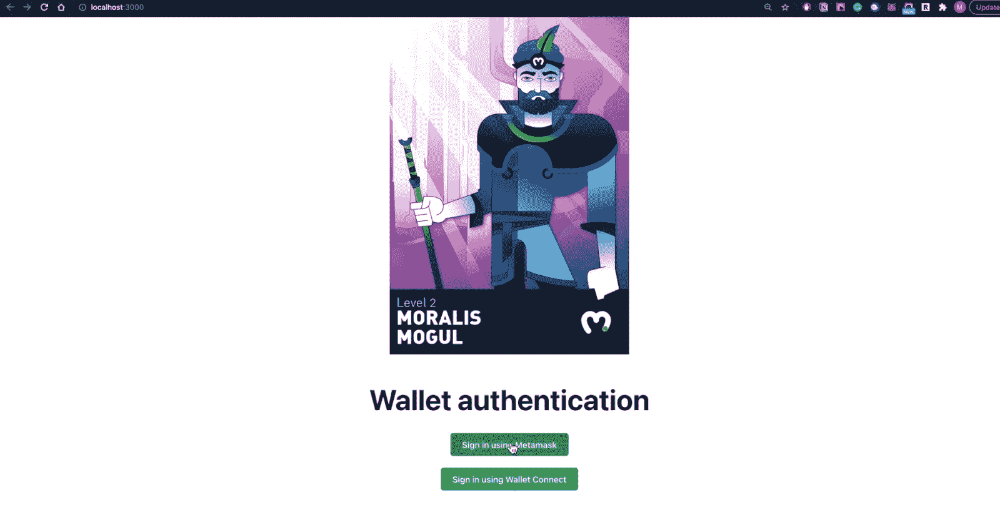
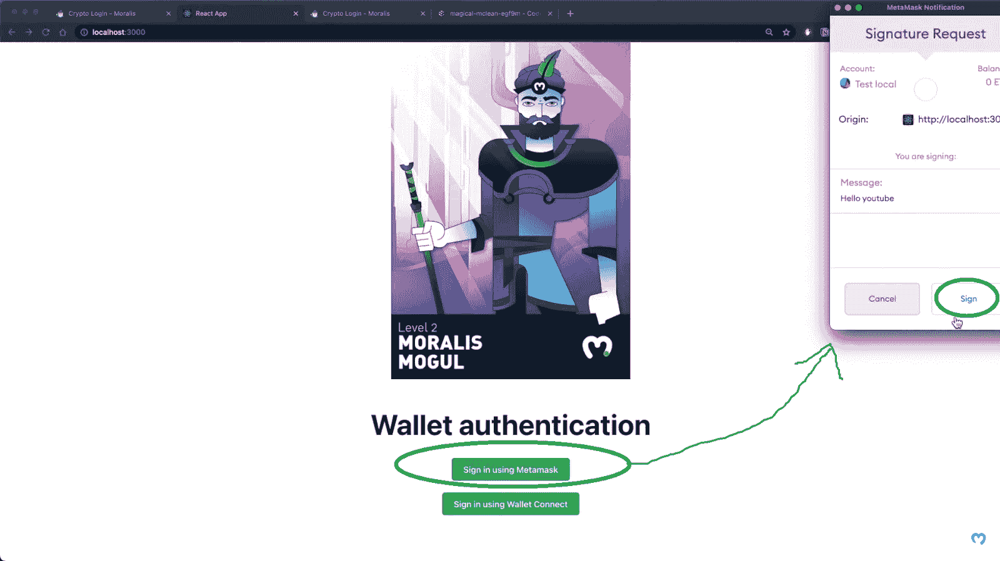
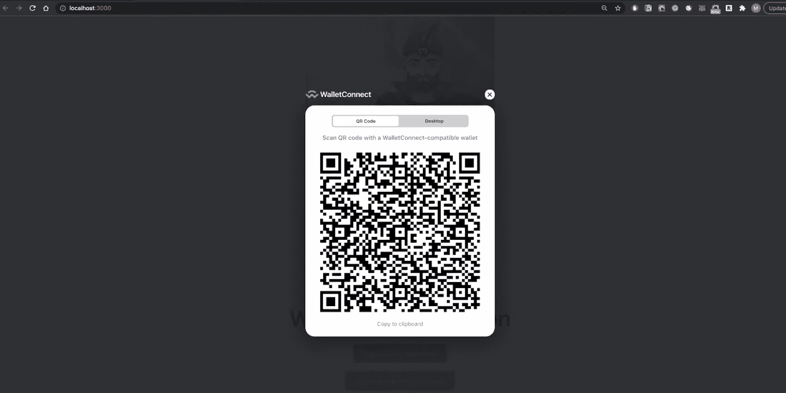
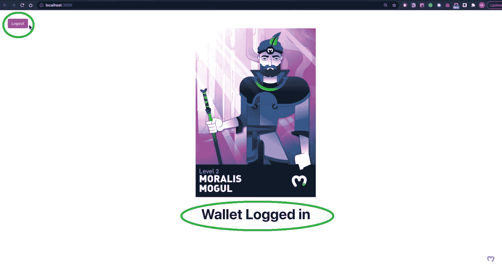
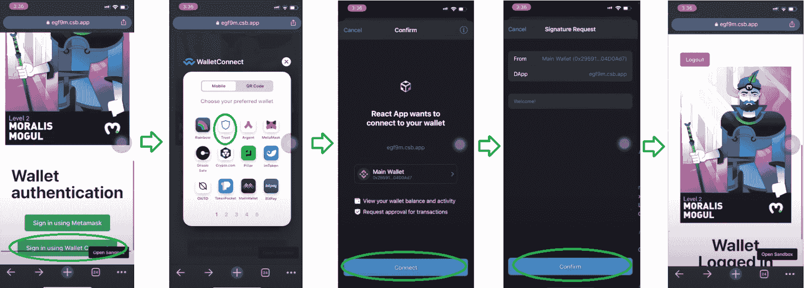
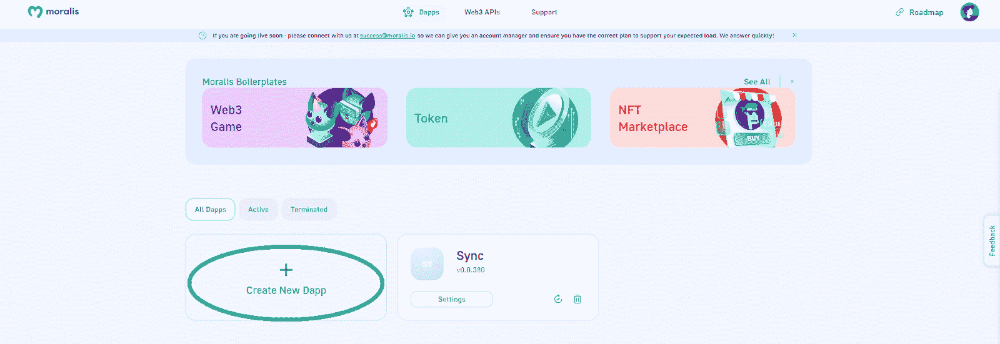

# 登录以太坊–以太坊认证指南

> 原文：<https://moralis.io/sign-in-with-ethereum-ethereum-auth-guide/>

尽管当前的宏观经济环境不佳，但没有迹象表明 Web3 的采用会停止。不过，在不久的将来，我们可能会期待互联网发展成为一种 Web2 和 Web3 的混合体。不过这种混合会要求某些关键方面，比如 [**Web3 认证**](https://moralis.io/authentication/) **。而且，由于以太坊是目前领先的区块链网络，了解如何登录以太坊是至关重要的。那么，如何毫不费力地将“使用以太坊登录”功能整合到您的 dapps(去中心化应用程序)中呢？幸运的是，Moralis 是桥接 Web2 和 Web3 dapps 的领先 Web3 解决方案。这意味着在使用 Moralis 的 Auth API 时，只需复制粘贴一行代码，你就可以轻松地用以太坊登录你的用户。**

此外，您可能知道以太坊使用以太坊虚拟机(EVM)来按预期执行代码。此外，许多其他连锁店使用 EVM 作为智能合约的运行时环境。因此，通过学习合并“用以太坊登录”功能，您能够在其他 EVM 兼容链上部署 dapps。这些包括 BNB 链、多边形和雪崩，仅举几例。接下来，我们将首先进一步了解为什么要使用以太坊登录。然后，我们将看看由 Moralis 的 Web3 认证 API 提供的一些最流行的以太坊认证解决方案。这也是你了解更多 Moralis 的地方。最后，我们将进行一个示例项目，在这个项目中，您将看到如何创建直接使用以太坊登录的 dapps。此外，我们鼓励您创建自己的 dapp。因此，请务必[创建您的免费 Moralis 账户](https://admin.moralis.io/register)并跟随我们的脚步。

## 为什么要用以太坊签到？

大多数当前的在线用户依赖于电子邮件和密码认证。通过验证他们自己或他们的帐户，用户可以访问特定的内容。此外，这使得用户能够设置他们的个人偏好。后者随后被存储为用户账户的一部分。此外，您实际上也可以使用电子邮件密码登录 Web3 应用程序。然而，一定有一个区块链的地址与这些细节有关。有了区块链地址(Web3 钱包)，用户就无法体验 dapps 的核心好处。

当然，如果用户需要手动提供他们的区块链地址，这将是非常不切实际的，并且与用户友好性完全相反。幸运的是，区块链钱包提供半自动的 Web3 认证解决方案。通过加密钱包，用户可以批准 dapps 访问他们的公共地址。而且，当他们在以太坊或其他 EVM 兼容的连锁店上这样做时，他们用以太坊登录。此外，一旦他们这样做了，用户就可以完全使用 Web3 应用程序了。因此，他们可以显示他们的可替换代币余额和 NFT(不可替换代币)，交易他们的资产，利用他们的资产(例如:Web3 游戏)，等等。总而言之，为了让用户在 EVM 连锁店体验到 Web3 的实际优势，他们需要登录以太坊。然而，你有责任(作为一个开发人员)确保这个过程尽可能的用户友好。

## Moralis 以太坊认证解决方案

除非你一直生活在岩石下，否则你可能知道 Moralis 是最终的 Web3 开发平台。Moralis 的主要目标是给传统开发者提供他们需要的工具来连接 Web2 和 Web3。此外，dapp 开发有三个与区块链相关的关键方面——web 3 认证、Web3 API 和同步链上事件。而且，以太坊上的每个 dapp 都需要有一个用以太坊登录的方法。因此，Web3 身份验证是起点。

首先，Moralis 的 Auth API 可以让你毫不费力地在应用程序中统一 Web3 钱包和 Web2 账户。这使得它成为对从头开始构建 dapps 感兴趣的开发人员或者只是希望将 Web3 功能添加到现有 Web2 应用程序的开发人员的首选工具。Moralis 认证解决方案的另一个优点是它与各种技术堆栈的兼容性。此外，它还让您完全控制和拥有您的用户数据。此外，Moralis 的 Web3 Auth API 支持其他行业标准，如 OAuth、OpenID、DIDs 等。

如果这不是您第一次在 Ethereum 上使用 Web3 身份验证实现，您很可能知道这非常棘手。如果您没有合适的工具集，这一点尤其正确。幸运的是，Moralis 让你不费吹灰之力就能登录以太坊。因此，没有必要:

*   将用户重定向到第三方身份验证界面
*   真正理解 Web3 认证流程
*   了解钱包如何签署或验证信息
*   掌握不同的钱包标准
*   了解钱包如何在不同的区块链上工作
*   担心认证解决方案的安全性
*   更新和维护认证解决方案

由于不需要担心和处理上述所有事情，你节省了大量的时间和其他资源。

### 节省时间，让您的 Dapps 经得起未来考验

借助 Moralis 的 Web3 认证解决方案，您可以毫不费力地用以太坊登录所有用户。在大多数情况下，您从 Moralis 文档中复制的一行代码就能达到目的。因此，您可以在几分钟内完成几周或几个月的工作。此外，这也是消除任何入职摩擦的方法。实质上，Moralis 为所有 Web3 身份验证方法提供的统一 API 和全面的 SDK 使您能够专注于提供最佳 UI，这是赢得人群的原因。

此外，Moralis 也是关于跨链互操作性的。因此，你的注册流程不限于任何特定的链。毕竟，谁知道呢，对吧？今天你可能想登录以太坊，但是加密领域的事情变化很快。而且，你最不希望的事情就是被束缚在任何特定的链条上。有了 Moralis 的 Web3 身份验证解决方案，您可以面向未来。你已经准备好接受任何新的钱包、新的链条和新的认证方法。

### 使用以太坊登录的主要选项

虽然区块链行业可能仍处于起步阶段，但它已经提供了许多令人惊叹的工具。例如，有无数的 Web3 钱包使 Web3 认证变得非常简单。然而，Moralis 决定只集成最可靠的选项。因此，Moralis 使您能够使用以下解决方案:

*   meta mask–Moralis 的默认“以太坊登录”解决方案。
*   wallet connect–面向移动用户的领先解决方案，支持各种加密钱包。
*   web 3 auth——一个简单的非托管身份验证基础设施，通过聚合 OAuth 登录来工作。
*   magic——一种 Web 身份验证替代方案，可让您完全控制 UX。

除了上面提到的认证解决方案，Moralis 允许你使用任何 Web3 提供商登录以太坊。当然，在某些情况下，您需要实现额外的代码行。

### 什么是 MetaMask？

MetaMask 是市场上最受欢迎和最受信任的加密货币钱包。它自 2016 年以来一直存在，最初是为了支持以太坊区块链而设计的。但是，您现在可以将任何 EVM 兼容链添加到元掩码中。尽管默认情况下，它仍然关注以太坊的 mainnet 和 testnets。此外，元掩码不仅仅可以用于存储加密货币。它充当了 Web3 sphere 的网关。正是这一特性使得 MetaMask Moralis 成为以太坊的本地登录选项。*如果您想了解更多关于元掩码的信息，请深入了解“* [*什么是元掩码？*](https://moralis.io/metamask-explained-what-is-metamask/) *。*

### 什么是 WalletConnect？

与普遍看法不同，WalletConnect 不是一个加密钱包。相反，它是一个连接 dApps 和移动钱包的开源协议。而且，它支持多种移动钱包。此外，WalletConnect 可以通过二维码扫描建立连接，非常人性化。这个 Web3 身份验证选项声誉很高，在某些方面，与桌面或浏览器扩展钱包相比，它是一个更安全的选择。*我们鼓励您详细了解如何使用 WalletConnect* *对用户进行* [*认证。*](https://moralis.io/how-to-connect-users-with-walletconnect/)

### 什么是 Web3Auth

如果你计划瞄准不熟悉 Web3 技术的用户，Web3Auth 是最好的选择之一。也很有保障。事实上，许多流行的应用程序，如 Skyweaver、币安和育碧，都使用 Web3Auth(以前称为 Torus)。本质上，Web3Auth 是一个简单的非托管身份验证基础设施。它通过聚合 OAuth (Google、Twitter、Discord)登录、不同的钱包和现有的密钥管理解决方案来工作。此外，通过提供熟悉的登录体验，它可以帮助您提高转化率高达 64%。*更多详情，请访问 Web3Auth 官网。*

### 什么是魔法？

Magic(以前称为 Fortmatic)是另一个著名的 Web3 身份验证替代方案。它的独特之处在于对 UX 的完全控制。由于 Magic 是可定制和嵌入式的，它不会从你的应用程序中夺走用户。魔术是天生兼容几个区块链。此外，它还包括非托管密钥管理。此外，这个 Web3 auth 解决方案还以强大的安全性和基础设施而自豪。此外，Magic 声称它可以保证 99.99%的正常运行时间，所以你可以确保世界各地的用户可以毫无障碍地访问你的应用程序。*更多详情，请访问 Magic 官网。*

## Dapps 如何登录以太坊-以太坊认证示例项目

至此，您已经了解了 Moralis 认证解决方案的基础知识，以及它如何帮助您登录以太坊。因此，是时候卷起袖子开始一个示例项目了。而且，因为你的 dapps 同时迎合桌面和移动用户是非常重要的，所以我们将关注一个这样做的示例项目。然而，在我们将您交给我们内部专家之前，让我们看一下我们的 dapp 演示。

### 使用以太坊登录–Dapp 演示

让我们首先来看看桌面设备上的 dapp 示例。下面的截图明确指出了用户使用以太坊登录需要使用的两个按钮。基本上，这些按钮让用户可以选择使用 MetaMask 或 WalletConnect 登录:

对于浏览器用户来说，大多数用户可能会选择元掩码身份验证。因此，他们将单击“使用元掩码登录”按钮，这将自动调用元掩码。要继续，用户需要“签名”按钮:

然而，如果用户决定使用 WalletConnect 登录以太坊，他们需要点击“使用 wallet connect 登录”按钮。在这种情况下，我们的 dapp 返回一个带有 QR 码的弹出模式，而不是提示 MetaMask:

以上意味着用户需要使用他们的移动钱包来扫描代码，从而完成他们的 Web3 登录。尽管如此，一旦用户使用这两种方法中的任何一种成功登录，我们的 dapps 布局就会发生一些变化。如下图所示，我们的 dapp 现在在左上角显示“注销”按钮，在底部显示“钱包已登录”消息:

#### 手机上的 Dapp 演示

当用户在移动设备上访问我们的示例 dapp 时，他们很可能会专注于签署 WalletConnect。毕竟，后者支持广泛的移动钱包应用。因此，下面是一个屏幕截图序列，巧妙地展示了认证过程:

上图中的第二步清楚地展示了可供用户选择的各种手机钱包。然而，对于本教程，我们使用信任钱包。选择钱包后，用户只需确认认证即可。

### 代码走查

为了充分利用本文，我们鼓励您尝试创建自己的上述 dapp 实例。这样，您将掌握使用 Moralis 实现 Web3 身份验证的窍门。完整的代码在 [GitHub](https://github.com/abdulmalik97/moralis-react-authentication) 等着你。此外，下面 2:30 开始的视频将带您浏览代码。

https://www.youtube.com/watch?v=UP6MfkU3Bkg

*注意* *:获取自己的 dapp 凭证(dapp URL 和 ID)*[*创建一个 Moralis dapp*](https://docs.moralis.io/moralis-dapp/getting-started/create-a-moralis-dapp) *:*

## 使用以太坊登录–以太坊认证指南–摘要

我们在今天的文章中谈了相当多的内容。因此，你知道了某些登录以太坊的费用会带来一个不同的世界。在这方面，Moralis 和它的 Web3 Auth API 是真正的游戏规则改变者。此外，为了让您不费吹灰之力就到达终点，Moralis 提供了第三方集成。即 MetaMask 和 WalletConnet。然而，Moralis 也支持其他解决方案。在这里，Web3Auth 和 Magic 是两个值得一提的选项。它们都使您能够使用 Web2 登录方法使 Web3 登录尽可能顺利。最后但同样重要的是，你也有机会承担我们的范例项目。

如果你喜欢跟随我们的教程，我们鼓励你访问 Moralis 的 [Web3 博客](https://moralis.io/blog/)和 Moralis 的 YouTube 频道。在那里，您可以找到大量的示例项目，从而学习如何使用 Moralis 在几分钟内创建杀手 dapps。此外，这两个出口是你继续免费密码教育的门票。然而，如果你想成为区块链认证，那么[Moralis 学院](https://academy.moralis.io/)是你的地方。除了顶级的区块链发展课程，这也是你获得专家指导和个性化学习路径的地方。尽管如此，通过报名参加 Moralis 学院，你也成为了一个最先进的加密领域的社区成员之一。