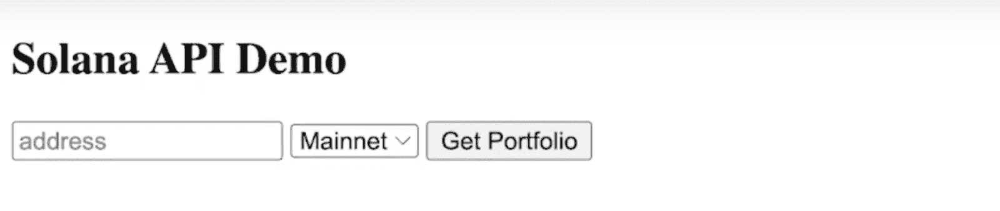

# Solana JavaScript 开发—在普通 JavaScript 中使用 Solana API

> 原文：<https://moralis.io/solana-javascript-development-use-solana-api-in-vanilla-javascript/>

在本文中，我们将探索 Solana JavaScript 开发的复杂性，以及如何在普通 JavaScript 中使用 Moralis 的 Solana API。为了说明 API 如何工作，我们将创建一个简单的 dapp(分散式应用程序),用户可以在其中输入钱包地址并查询投资组合。但是，如果您想直接进入代码，只需访问下面的 GitHub 库:

**完成索拉纳 Dapp 文档—**[](https://github.com/YosephKS/demo-moralis-solana-api)

****尽管是最受欢迎的区块链网络，以太坊面临的可扩展性挑战及其高昂的 T2 以太坊燃气费为其他网络留下了发展空间。其中一个网络是 Solana，它解决了以太坊的一些可伸缩性问题。像以太坊一样，Solana 提供了一个平台，开发者可以在这个平台上构建复杂的 dapps。然而，即使 Solana 已经看到了指数级的增长，进入 Solana JavaScript 开发仍然具有挑战性。由于这个原因，对 Solana APIs 的需求增加了——因为它们使 Web3 开发变得更加容易。因此，我们将致力于这篇简短的指南，更深入地研究 Solana JavaScript 开发，以及如何使用 [Moralis](https://moralis.io/) Solana API 使您的编程工作变得更加容易！****

****Moralis 是 Web3 开发的最佳操作系统，提供了创建复杂 dapps 所需的一切。除了完全托管的后端基础设施，Moralis 还提供了一些最好的 Web3 开发工具。例如，在这个工具箱中，您可以找到 Moralis 的 [NFT API](https://moralis.io/nft-api/) 、[元宇宙 SDK](https://moralis.io/metaverse/) ，当然还有 Moralis 的 Solana API。此外，Moralis 的特性是跨链兼容的，允许您为多个链创建 dapps、 [DeFi](https://moralis.io/what-is-defi-the-full-decentralized-finance-guide/) 平台和其他项目！****

****所以，如果你想进入，比如说，索拉纳或者以太坊发展公司，就和 Moralis 签约吧。创建一个帐户是完全免费的，只需要几秒钟！****

## ****什么是索拉纳原料药？****

****在我们开始 Solana JavaScript 开发之前，我们将仔细看看什么是 Solana API。为了完全掌握这个概念，我们将从深入研究 API 及其含义开始这一部分。那么，什么是 API 呢？****

****

API 是“应用程序编程接口”的缩写，每当你浏览网页或在手机上使用应用程序时，你通常都会接触到 API。使用任何设备时，您的软件都会连接到互联网，向服务器发送数据。服务器接收信息，执行特定的操作，并发回响应。然后，您的设备解释响应，并以可读的方式呈现给您。这整个过程通常由 API 加速。因此，API 本质上允许两个软件相互通信。

为了更好地理解 API，我们可以用一个餐馆的例子来使这个概念更容易理解。在这个比喻中，厨房将是处理您的订单的基础“系统”。然而，在去餐馆的过程中，你通常不会直接和厨房沟通，而是通过服务员这种中间人。在这个例子中，服务员/女服务员是处理您和厨房中的厨师之间的通信的 API。这意味着服务员/女服务员交付您的订单(请求)，然后为您提供食物(响应)。


因此，总的来说，API 通过在查询中提供一致的函数来传输/翻译指令，以便相互理解，从而允许在安全的开发环境中进行兼容的编码。现在，对这个概念有了更好的理解，它在索拉纳的上下文中意味着什么？嗯，很简单；Solana API 本质上为 Solana 网络提供了上述功能。

## 为什么要使用 Solana API 进行 Solana JavaScript 开发？

随着对什么是 Solana API 有了更好的理解，让我们进一步了解为什么您可能需要 API。两个软件能够通信的能力的重要性是不可低估的。由于 API 促进了软件之间的交流，它们可以极大地帮助所有的开发过程。


每当开发人员创建一个新程序或 dapp 时，API 允许开发人员避免从头开始创建一切。取而代之的是，通过例如利用已经开发的可以更好地完成工作的代码片段来“外包”职责成为可能。

此外，这也正是 Moralis 介入的地方，因为该平台为 Solana JavaScript 开发提供了最好的 API 之一。因此，只需几行代码，就可以使用 Moralis 的 Solana API 来获取各种后端和链上数据。例如，您可以轻松地查询从令牌余额到认证用户的所有内容。

所以，如果你想成为一名区块链开发者，并且想和 Solana 一起工作，你应该看看 Moralis 的 Solana API。有了这个 API，你将能够大大减少开发时间，更有效地创建 Solana dapps。

然而，在我们仔细研究 Moralis Solana API 如何工作之前，我们将仔细研究 JavaScript 开发。这将为我们提供一个很好的基础，然后我们再举一个实际的例子，说明使用 Moralis 的 Solana API，Solana JavaScript 开发变得多么容易！

## 什么是 JavaScript 开发？

JavaScript 最早出现在 90 年代，现在是最重要的编程语言之一。开发人员主要(但不是唯一)使用 JavaScript 进行 web 开发，更具体地说，是为了使网站更具交互性。编程语言具有改变和更新 HTML 和 CSS 代码的特性，这些代码是 Web2 网页的基础。此外，由于 JavaScript 运行在 HTML 和 CSS 之上，开发人员通常将其称为 Web2 的第三层。因此，每当您发现自己在与动态网站交互时，涉及 JavaScript 的可能性很高。


更重要的是，JavaScript 是一种所谓的基于文本的语言——因此，学习 JavaScript 是非常直观的。因此，通过利用这种语言，您可以创建动态更新的内容，并为您的所有客户提供更复杂的 UX(用户体验)。这意味着在使用 JavaScript 时，您可以完全控制图像、多媒体元素以及更多内容。

正如我们之前提到的，JavaScript 主要用于开发网页；然而，这并不是故事的全部。JavaScript 还用于其他开发领域，如软件、服务器、嵌入式硬件控制等。因此，开发人员有可能利用 JavaScript 来建立简单的 web 服务器，开发 web 和移动应用程序，甚至创建游戏。

这表明 JavaScript 是许多不同领域的敲门砖。这也是 JavaScript 被广泛采用并成为最受欢迎的语言之一的众多原因之一。

如果你想了解更多关于 JavaScript 的知识，请考虑[Moralis 学院](https://academy.moralis.io/)。该学院提供一系列课程，帮助你成为更熟练的 Web3 开发者。在[区块链课程](https://academy.moralis.io/all-courses)中，您会发现“[学习 JavaScript 编程](https://academy.moralis.io/courses/javascript-programming-for-blockchain-developers)课程让您的 JavaScript 技能更上一层楼！


## Solana JavaScript 开发—使用 Moralis 的 Solana API

在接下来的几节中，我们将深入研究 Solana JavaScript 开发和 Moralis 的 Solana API。为了说明在普通 JavaScript 中使用 Moralis 的 Solana API 是多么容易，我们将创建一个简单的 dapp，用户可以通过输入钱包地址并单击按钮来查询钱包组合。为了向你展示我们的努力方向，这是最终产品的打印屏幕:



有了这个 dapp，用户可以输入一个 Solana 钱包地址，选择想要的网络，并简单地点击“获取组合”按钮来查询该特定地址的组合。这将提供三条信息:本地 SOL 令牌、其他令牌和 [NFT](https://moralis.io/non-fungible-tokens-explained-what-are-nfts/) 余额。更重要的是，要获得这三个元素，我们只需要一行代码；不过，稍后会有更多介绍。

为了使这个过程更容易理解，我们将把这个过程分成以下三个步骤:

1.  创建 Moralis Dapp
2.  设置 HTML 文件
3.  添加 JavaScript 逻辑

所以，让我们从仔细看看如何创建你自己的 Moralis 开始吧！

## 步骤 1: Solana JavaScript 开发——创建一个 Moralis Dapp

如果您还没有，您需要先创建一个 Moralis 帐户。这是完全免费的，只需要几秒钟。有了自己的账户，你可以通过导航到 Moralis 管理面板并点击“创建新的 Dapp”按钮来启动这个过程。


单击此按钮后，首先需要选择的是环境。由于这只是一个教程，我们将选择“Testnet”替代。然而，您会很快注意到没有一个 testnet 选项与 Solana 相关。然而，不要烦恼；您可以简单地选择其中一个，因为这不会影响我们在使用 Solana API 时的 dapp。因此，在我们的案例中，我们选择了 Polygon 的孟买测试网。从那里，所有剩下的是选择一个地区，命名您的项目，并点击“创建您的 Dapp”。

有了服务器，如果你点击“设置”按钮，你有几个选项可以探索。例如，您可以在“dapp 凭据”标题下找到关于您的 Dapp 的详细信息。在那里，您可以找到您的 dapp URL 和应用程序 ID，我们将在以下步骤中用到它们！


## 步骤 2: Solana JavaScript 开发——设置 HTML 文件

dapp 设置完毕后，我们就可以开始实际的开发过程了。然而，在深入研究代码之前，请从我们在文章中最初链接的 GitHub 存储库中克隆这个项目。

一旦您的本地存储库中有了“index.html”和“index.js ”,我们将从仔细查看 html 文件开始。""相对简单，这就是全部代码:

```js
<html>
  <head>
    <title>Solana API Demo</title>
    <script src="https://unpkg.com/moralis/dist/moralis.js"></script>
  </head>
  <body>
    <h2>Solana API Demo</h2>
    <input type="text" id="address" name="address" placeholder="address">
    <select id="network" name="network" aria-placeholder="network">
      <option value="mainnet">Mainnet</option>
      <option value="devnet">Devnet</option>
    </select>
    <button id="get-portfolio">Get Portfolio</button>
    <script type="text/javascript" src="./index.js"></script>
  </body>
</html>
```

正如您所看到的，有一个标题、一个标题和一些输入字段和按钮。这相对简单，我们不会深入研究这些元素。原因是 dapp 的内容结构并不重要。因此，这取决于你作为一个开发者的需求和你想要的最终产品的外观。

然而，HTML 代码的一个重要部分是第四行:

```js
<script src="https://unpkg.com/moralis/dist/moralis.js"></script>
```

这是我们导入 [Moralis SDK](https://moralis.io/exploring-moralis-sdk-the-ultimate-web3-sdk/) 的地方，它允许您利用 Moralis 的高级开发工具包。因此，这允许您使用我们将在接下来的步骤中仔细查看的代码片段！

## 步骤 3: Solana JavaScript 开发——添加 JavaScript 逻辑

在 Solana JavaScript 开发指南的最后一步，我们将添加应用程序的逻辑。然而，在此之前，我们需要初始化 Moralis 来将我们的代码连接到我们最初创建的 dapp。如果您仔细查看" [index.js](https://github.com/YosephKS/demo-moralis-solana-api/blob/main/solana-vanilla/index.js) "文件，您可以简单地通过在代码的以下部分插入您的 dapp URL 和应用程序 ID 来初始化 Moralis:

```js
const serverUrl = "";
const appId = "";
Moralis.start({ serverUrl, appId });
```

初始化 Moralis 后，我们将关注“getSolanaPortfolio()”函数。这个函数看起来是这样的:

```js
const getSolanaPortfolio = async () => {
  const options = {
    network: document.getElementById("network").value,
    address: document.getElementById("address").value,
  };
  const portfolio = await Moralis.SolanaAPI.account.getPortfolio(options);
  console.log(portfolio);
};
```

这相对简单，您需要做的就是使用用户的输入创建一个“选项”常量，然后在运行 Moralis 的“getPortfolio()”函数时将它作为参数传递。本质上就是这样！这说明了使用 Moralis 的强大之处，因为获取投资组合所需要的只是一小段 Moralis 代码！

除此之外，您需要简单地添加一个点击事件，当用户点击“Get Portfolio”按钮时触发“getSolanaPortfolio()”函数。

这就是 Solana JavaScript 开发指南，我们在普通 JavaScript 中使用了 Moralis 的 Solana API。如果你想要更详细的代码分解，或者只是喜欢看视频来学习，请查看下面的 YouTube 剪辑:

https://www.youtube.com/watch?v=ax5scht_s4U

## Solana JavaScript 开发—总结

在本文中，我们花时间探索了 Solana JavaScript 开发的复杂性。在这个过程中，我们利用 Moralis 的 Solana API 和普通的 JavaScript 来使这个过程更容易理解。通过使用 Moralis SDK 和 Solana API，我们只用了三个步骤就创建了一个简单的 Solana JavaScript 演示 dapp:

1.  创建 Moralis Dapp
2.  设置 HTML 文件
3.  添加 JavaScript 逻辑

只用一行代码，我们就可以获取一个 [Web3 wallet](https://moralis.io/what-is-a-web3-wallet-web3-wallets-explained/) 地址的投资组合。这提供了对本机、令牌和 NFT 余额的访问。因此，这证明了与 Moralis 合作的优势，因为它使 [Web3 开发](https://moralis.io/how-to-build-decentralized-apps-dapps-quickly-and-easily/)变得更加容易。


然而，这仅仅触及了与 Moralis 家合作潜力的表面。如果你对 API 有进一步的兴趣，请随意仔细看看 Moralis 的[以太坊 dapp API](https://moralis.io/what-is-an-ethereum-dapp-api-build-ethereum-dapps-easily/) 或[多边形 dapp API](https://moralis.io/polygon-dapp-api-how-to-efficiently-create-polygon-dapps/) 。这些工具允许你创建复杂的 dapps，比如说，一个 [Web3 Spotify](https://moralis.io/how-to-build-a-web3-spotify-clone/) 或 [Web3 Twitter](https://moralis.io/how-to-build-a-web3-twitter-clone/) 的克隆！此外，如果您对 NFT 和令牌更感兴趣，您还可以学习关于令牌开发所需的一切。例如，学习[创建自己的 ERC-20 令牌](https://moralis.io/how-to-create-your-own-erc-20-token-in-10-minutes/)或[在短短 15 分钟内开始生成 NFT](https://nftcoders.com/begin-generating-nfts-in-15-minutes/)！

所以，如果你对 Solana JavaScript 开发感兴趣，你绝对应该[注册 Moralis](https://admin.moralis.io/register) ！****