# 索拉纳 NFT API–探索索拉纳的终极 NFT API

> 原文：<https://moralis.io/solana-nft-api-exploring-the-ultimate-nft-api-for-solana/>

随着 Solana 生态系统的发展，以及在可编程区块链排行榜上的不断攀升，开发者需要一个权威的 Solana API。幸运的是,[**【NFT】API**](https://moralis.io/nft-api/)**为索拉纳满足了这一需求。因为如果你想一想，如果没有索拉纳·NFT 的 API，最好的 Web3 技术栈会是什么？因此，开发人员可以使用 Moralis 从 Solana 的区块链中为他们的**[**dapp**](https://moralis.io/decentralized-applications-explained-what-are-dapps/)**获取各种数据。此外，tech stack 向为所有区块链项目提供完整解决方案又迈进了一步。在这篇文章中，我们探索 Moralis 的索拉纳 NFT API，以及如何使用它来获取 NFT 数据！**

向前看，你将有机会跟随并创造你自己版本的整洁的索拉纳 NFT dapp。为了构建这个 dapp，我们将使用 [React](https://moralis.io/react-explained-what-is-react/) 和 [Moralis](https://moralis.io/) 。有了 React，我们将覆盖我们所有的 [Web3 前端](https://moralis.io/web3-frontend-everything-you-need-to-learn-about-building-dapp-frontends/)需求。此外，由于 Moralis 的终极索拉纳 NFT API，我们将轻松处理链上数据。尽管如此，如果你不熟悉 Moralis，可以把它看作是加密的" Firebase "。它是最好的 [Web3 后端平台](https://moralis.io/exploring-the-best-web3-backend-platform/)，使开发者能够立即开始部署杀手级 dapps。感谢 Moralis 的单一工作流程，您可以用简短的代码片段覆盖所有后端需求。此外，Moralis 具有跨链、跨平台的互操作性；因此，它为你提供了许多选择。然而，今天我们将利用其索拉纳 NFT API。因此，请务必[创建您的免费 Moralis 账户](https://admin.moralis.io/register)并跟随我们的脚步。

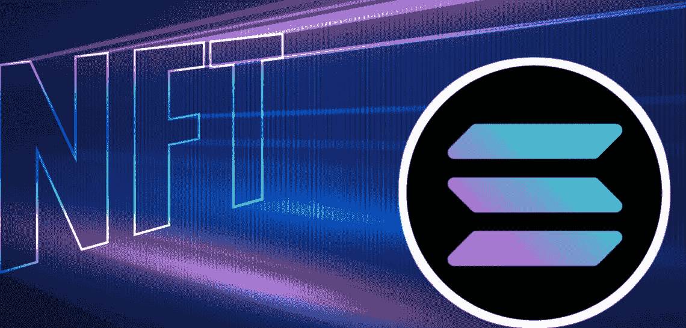

## 使用索拉纳 NFT API–演示

在我们卷起袖子开始一起构建我们的示例索拉纳·NFT·dapp 之前，我们想对我们的示例 dapp 做一个快速演示。这样，你可以提前看到最终的结果。因此，您将很容易决定是否要自己承担这个示例项目。

下面的截图代表了我们的索拉纳 NFT dapp 的要点:


查看上面的图像，您可以看到顶部的输入字段(就在“Solana”下面)。这是我们的 dapp 接受令牌地址的地方。当我们点击“获取 NFT”按钮时，索拉纳·NFT API 会收集与该地址相关的详细信息。最后，结果是，当用户执行搜索时，它会显示 NFT 的图像、其集合的名称以及其令牌 ID。我们可以重复搜索任意多次，搜索任意多的 Solana NFTs(一次一个)。以下是一些其他的搜索结果:

*   “Okay Bear”系列:

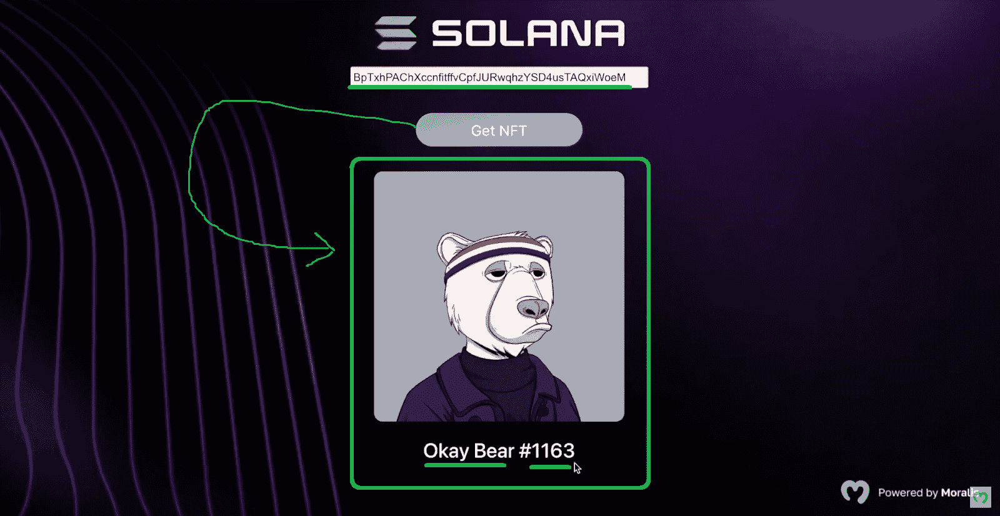

*   “索拉纳猴业”(SMB)系列:

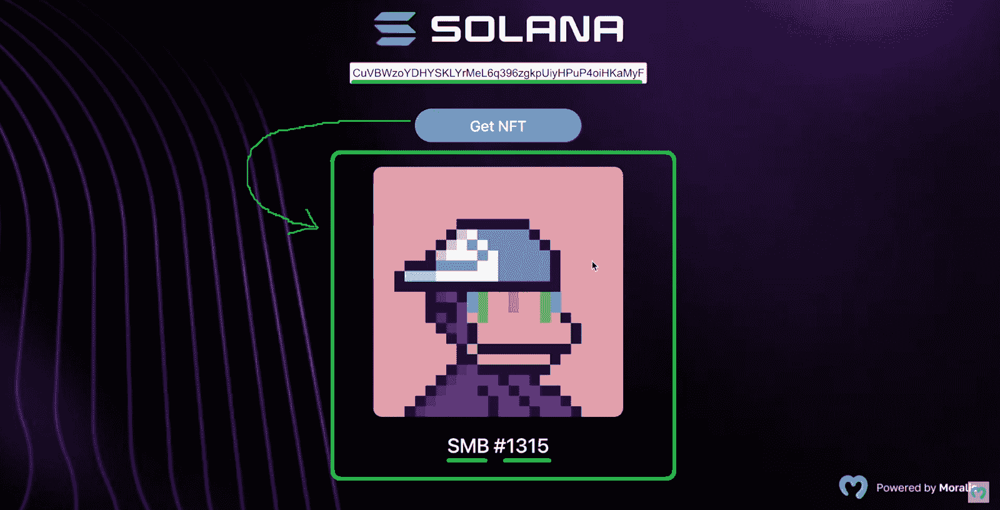

## 使用索拉纳 NFT API–示例项目

如果你正在读这篇文章，我们假设你喜欢你在演示部分看到的东西，并且渴望亲自动手。幸运的是，这是一个简洁简单的示例项目。照这样，你不到十分钟就能完成。此外，我们将一步一步地指导您完成这个过程，这样即使是完全的初学者也能跟上。尽管如此，你可以通过使用我们在 [GitHub](https://github.com/MoralisWeb3/youtube-tutorials/tree/main/Solana-NFT) 上等待你的代码来获得额外的快捷方式。在那里，您还可以找到所有资产(徽标、背景等。)呈现在上面的小节中。当然，你也可以从零开始这个项目。

如果您已经克隆了我们的代码，您现在看到的是我们项目的布局:


至此，您已经为构建 React 应用程序做好了一切准备。虽然要访问 Moralis 的索拉纳 NFT API 的能力，你需要使用你的 Moralis 服务器的详细信息。实际上，您需要将应用程序 ID 和服务器 URL 粘贴到“index.js”文件中的指定位置:

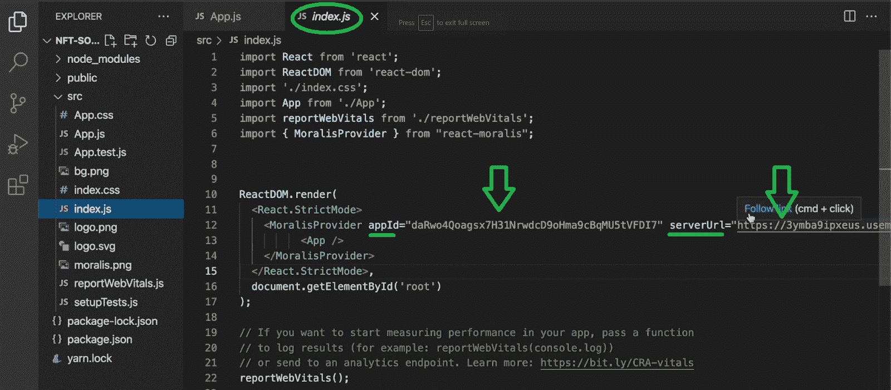

*注意* *:如果这不是你第一次使用 Moralis，你可能已经知道如何获得所需的服务器细节。因此，您可以跳过以下部分。*


### 初始 Moralis 设置

初始 Moralis 设置是一个快速而简单的过程，以下是您需要完成的步骤:

1.  创建您的免费 Moralis 帐户，或者如果您已经有一个 Moralis 帐户，请使用您的凭据登录。

2.  在您的 Moralis 管理区域中，导航到“服务器”选项卡并创建一个新服务器:


3.  *选择服务器类型。注意，当处理示例项目和测试 dapps 时，最好使用“Testnet 服务器”选项:*


4.  输入您的服务器详细信息:名称、位置和链。然后，使用“添加实例”按钮启动服务器:


5.  为您的服务器使用“查看详细信息”按钮，并复制相关详细信息:

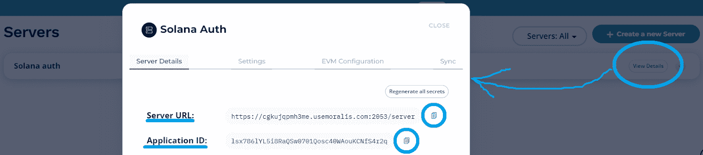

6.  将复制的详细信息粘贴到“index.js”文件中。

### 创建简单的 React 应用程序

完成上述设置后，您就可以构建一个简单的 React 应用程序了。因此，打开“App.js”文件，首先定义一些状态变量:

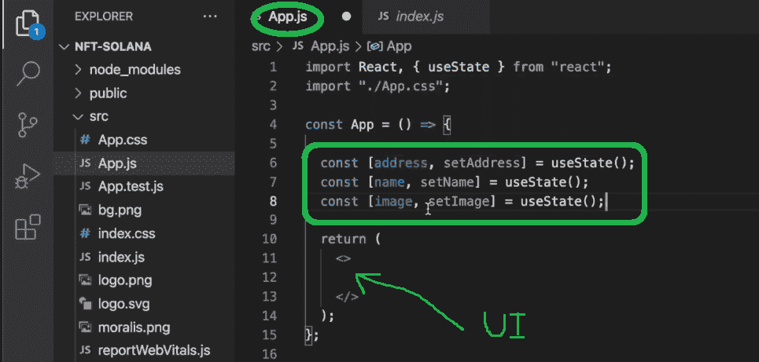

如您所见，我们将使用这些变量来存储输入的地址、NFT 的名字和图像。接下来，我们需要添加适当的代码行来创建我们的用户界面(UI)。我们从标题、地址输入字段和按钮开始，根据输入的地址执行搜索:


我们现在可以运行我们的 dapp 来确保上面的代码行正常工作:


看上面的截图，你可以看到我们已经准备好了“索拉纳·NFT”标题、输入字段和“获取 NFT”按钮。当然，布局是非常基本的，因为我们还没有实现任何样式。我们也没有利用索拉纳 NFT API。因此，即使我们输入一个地址并点击“获取 NFT”按钮，事情也不会正常运行。因此，我们需要导入 Solana API。

## 进口索拉纳 NFT 原料药

在“App.js”文件的顶部，我们需要添加以下代码行:

```js
import { useMoralisSolanaApi } from "react-moralis";
```

上面的代码行导入了索拉纳·NFT API。现在，我们需要使用“ *npm i react-moralis* ”或“ *yarn add react-moralis* ”命令来安装“react-moralis”。您可以在 Visual Studio 代码(VSC)上的终端中输入这些命令中的任何一个。一旦完成，我们就可以调用“useMoralisSolanaApi”钩子:

```js
 const SolanaApi = useMoralisSolanaApi();
```

接下来，我们需要编写“NFTsearch”函数的细节。我们从定义网络和地址开始:

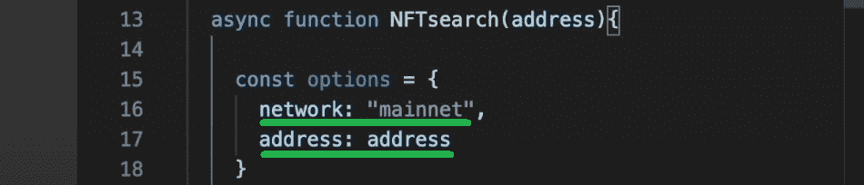

然后，我们需要确保我们的函数得到对应于搜索地址的 NFT。这就是 Moralis 的索拉纳 NFT API 让事情变得非常简单的地方。因此，我们可以用一行代码涵盖这一功能:

```js
const nftResult = await SolanaApi.nft.getNFTMetadata(options);
```

为了记录结果，我们还添加了“c *onsole.log(nftResults)* ”，这将使我们能够使用浏览器的控制台来查看结果。

有了上面的功能，让我们看看我们的 dapp 在运行。为此，我们首先进入 OpenSea，在这里我们选择一个示例 NFT 并复制其令牌 ID:

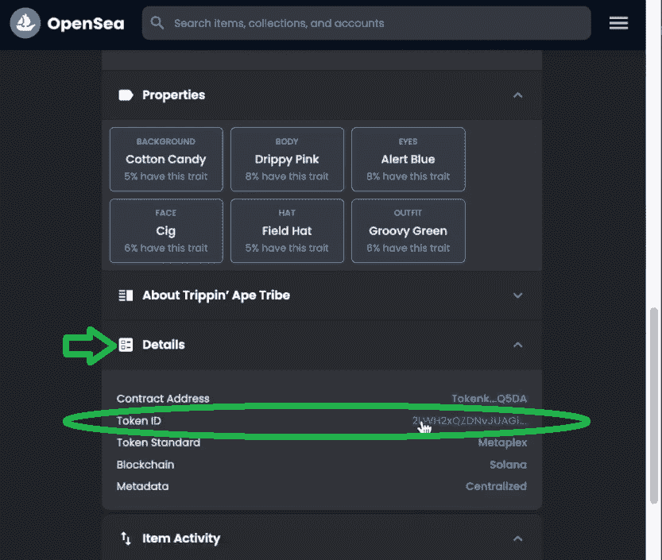

然后，我们在 dapp 的搜索框中使用该令牌的 ID:


正如你在上面的截图中看到的，我们在点击“获取 NFT”按钮后获取一个对象。后者包含与被搜索地址相关的所有细节:

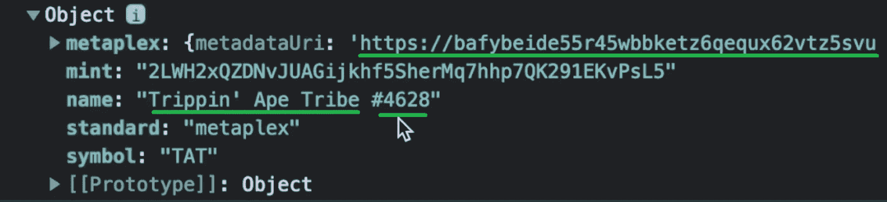

此外,“metaplex”中还有其他详细信息，其中也包括所有者的历史:

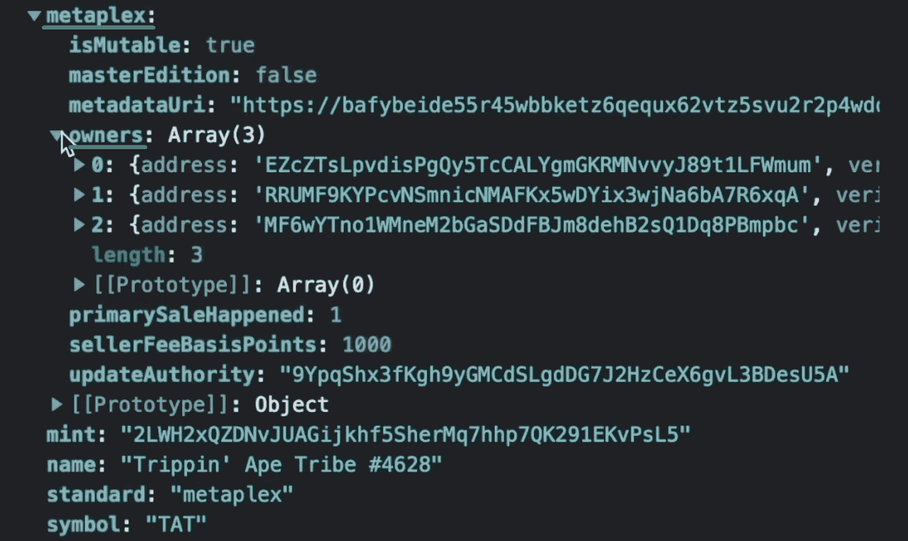

然而，让我们感兴趣的是元数据，其中也包含 NFT 的图像 URL:

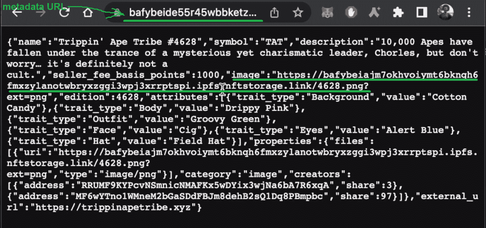

### 使用索拉纳 NFT API 实现图像和名称

上面的截图表明，我们拥有填充 dapp 所需的所有细节。回想一下上面的演示，您知道我们将只使用收藏名称和 NFT 的 ID。然而，你可以很容易地把事情做得更进一步。例如，你也可以显示一个拥有者的历史等等。但是现在让我们把重点放在实现在我们的例子索拉纳 into 戴普中显示图像和名字上。

至于 NFT 的名称，我们可以将“setName”设置为搜索结果:

```js
setName(nftResult.name);
```

当然，对于图像来说，事情要稍微复杂一些。看了上面的细节后，您已经知道我们需要从元数据中提取图像的 URL，这是 NFTs 的 URIs。JSON 文件)。下面是实现这一点的代码行:

```js
   let uri = nftResult.metaplex.metadataUri;

    try {
      await fetch(uri)
        .then((response) => response.json())
        .then((data) => {
          setImage(data.image);
        });
    } catch {
      console.log("couldnt get image");
    }
```

如果我们现在再次运行 dapp，它会返回搜索到的 NFT 的名字和图像:

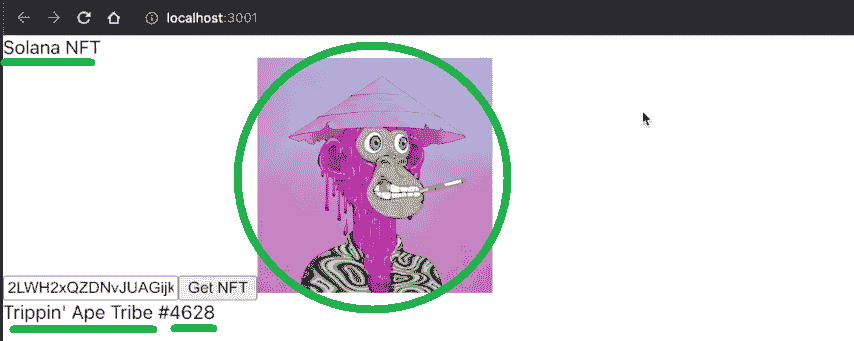

显然，这适用于 Solana 上的所有 NFT:

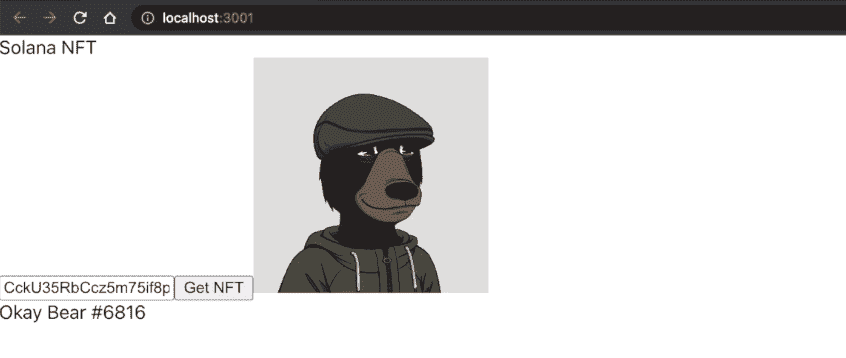

此时，我们的示例 dapp 已经提供了与上面演示的相同的功能。此外，我们已经完成了索拉纳·NFT API 实用程序。当然，我们鼓励你也调整样式，让用户界面看起来更好。虽然，如果你克隆了我们的代码，样式已经被应用了。因此，上面看起来很酷；然而，功能是完全相同的:

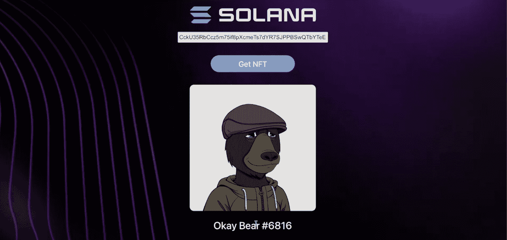

喜欢视频教程的人，请务必观看下面的视频。在那里，你将有机会看到内部 Moralis 专家完成上述项目。

https://www.youtube.com/watch?v=Ln0GEUsvcFM

### 超越 Moralis 的索拉纳 NFT API

索拉纳可能不会像以太坊那样去中心化；但是，这是一个值得我们关注的链条。也就是说，你可能愿意和 Moralis 一起进一步探索 Solana 的发展。如果是这样，你应该学习如何用虚拟钱包认证 Solana 用户。此外，一定要探索 [SPL vs ERC-20 代币](https://moralis.io/spl-vs-erc20-tokens-comparing-solana-and-ethereum-tokens/)的比较。后者可能会启发你[创造一个索拉纳令牌](https://moralis.io/how-to-create-a-solana-token-in-5-steps/)。既然如此，为什么不也构建一个 [Solana 令牌仪表板](https://moralis.io/how-to-build-a-solana-token-dashboard/)。

请记住，Moralis 是跨链互操作的。因此，即使你后来决定换到其他连锁店，你也不会被索拉纳缠住。通过稍微调整代码，您将能够将相同的 dapps 部署到其他受支持的区块链。其中包括以太坊和几个 EVM 兼容链([雪崩](https://moralis.io/how-to-build-avalanche-dapps-in-minutes/)、 [BNB 链](https://moralis.io/how-to-create-a-bnb-chain-token-in-5-minutes/)、[多边形](https://moralis.io/how-to-build-polygon-dapps-easily/)等。).Moralis 的单一工作流程使事情尽可能简单明了，无论您决定使用哪条链。它帮助您处理 [Web3 认证](https://moralis.io/web3-authentication-the-full-guide/)、[同步和索引智能合约事件](https://moralis.io/sync-and-index-smart-contract-events-full-guide/) ( [索引区块链](https://moralis.io/how-to-index-the-blockchain-the-ultimate-guide/))、[存储链外数据](https://moralis.io/how-to-store-off-chain-data-unity-web3-database/)和链内数据。它甚至通过 Moralis 的 [web3uikit](https://moralis.io/web3ui-kit-the-ultimate-web3-user-interface-kit/) 来帮助你的 [Web3 UI](https://moralis.io/web3-ui-how-to-create-a-great-dapp-ui/) 工作。因此，你的前端技能，比如 JavaScript 或 Unity，足以让你成为一名 Web3 开发者 T21。

尽管如此，如果你对每周挑战感兴趣，在那里你可以得到专家的支持，你应该加入 Moralis 项目。此外，你还可以通过完成各种挑战来获得一些很酷的 NFT。

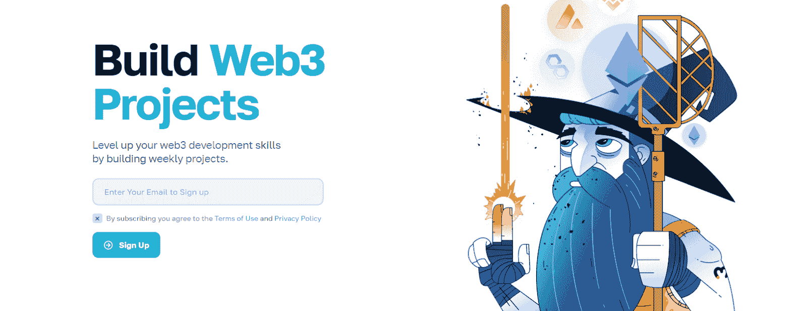

## 索拉纳 NFT API–探索索拉纳的终极 NFT API–摘要

今天，您有机会看到使用 Moralis 来利用索拉纳 NFT API 是多么容易。首先，你得看看我们完成的索拉娜·NFT·戴普的样品。然而，更重要的是，你也有机会跟随我们的领导，建立自己的索拉纳 NFT dapp。因此，您学习了如何完成初始 Moralis 设置并使用 React 创建 dapp 的前端。当然，您还发现了如何使用索拉纳 NFT API 来获取索拉纳 NFTs 的详细信息。尽管如此，如果你有兴趣进一步发展 Solana，我们也给你一些建议。

另一方面，你可能有兴趣在其他链上开发或了解区块链开发的不同方面。如果是这样的话，一定要访问[Moralis 的 YouTube 频道](https://www.youtube.com/c/MoralisWeb3)和[Moralis 的博客](https://moralis.io/blog/)。一些最新的话题围绕着[上传 Web3 Unity 元数据](https://moralis.io/uploading-web3-unity-metadata/)和 [Unity 资产到 IPFS](https://moralis.io/how-to-upload-unity-assets-to-ipfs/) ， [dapp 开发](https://moralis.io/dapp-development-tutorial-full-guide-to-building-a-dapp/)，创建[密码情感 dapp](https://moralis.io/how-to-create-a-crypto-sentiment-dapp/) ，NFT [在线库存系统](https://moralis.io/create-an-nft-on-chain-inventory-system-for-gaming/)， [Solidity 智能合约](https://moralis.io/what-are-solidity-smart-contracts-full-solidity-tutorial/)，构建[去中心化 Twitter](https://moralis.io/2022-guide-to-building-a-decentralized-twitter/) ，构建[购买游戏内 NFTs](https://moralis.io/build-a-marketplace-to-buy-nfts-in-game/)的市场，以及[EIP 11 这些渠道拥有大量有价值的内容，可以满足您持续的免费加密教育需求。](https://moralis.io/eip-1559-example-what-is-eip-1559/)

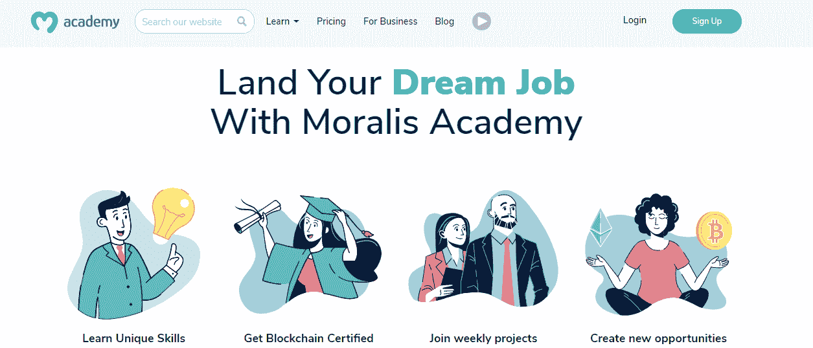

然而，你可能渴望快速自信地成为一名区块链开发者。如果是这样，你可能要考虑采取更专业的方法。这就是[Moralis 学院](https://academy.moralis.io/)可以帮助你缩小你现在的位置和你想要的位置之间的差距的地方。除了顶级的[区块链发展课程](https://academy.moralis.io/all-courses/)，这个在线学院还为你提供专家导师和个性化的学习路径。尽管如此，这也是你可以在这个行业最先进的社区中找到你的部落的地方。