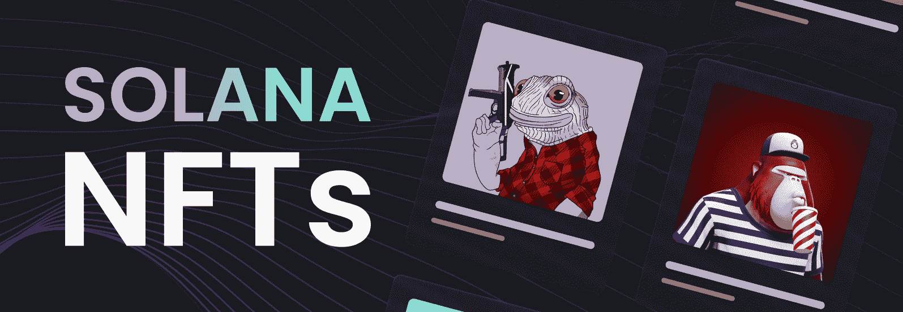
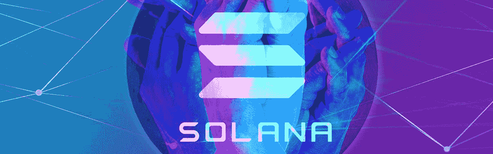
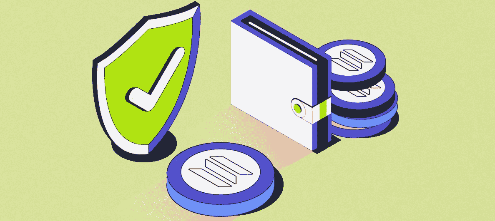
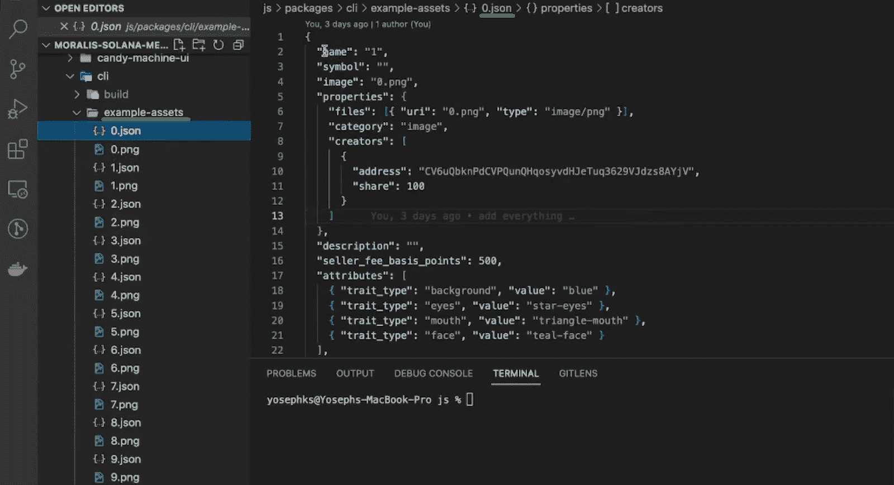
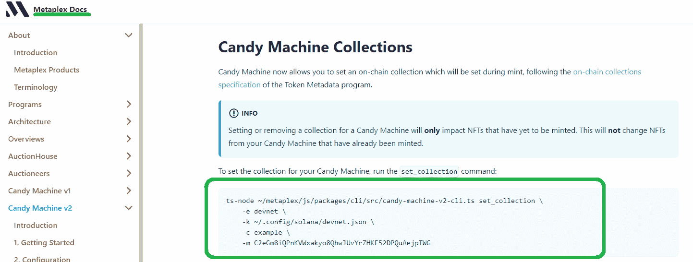
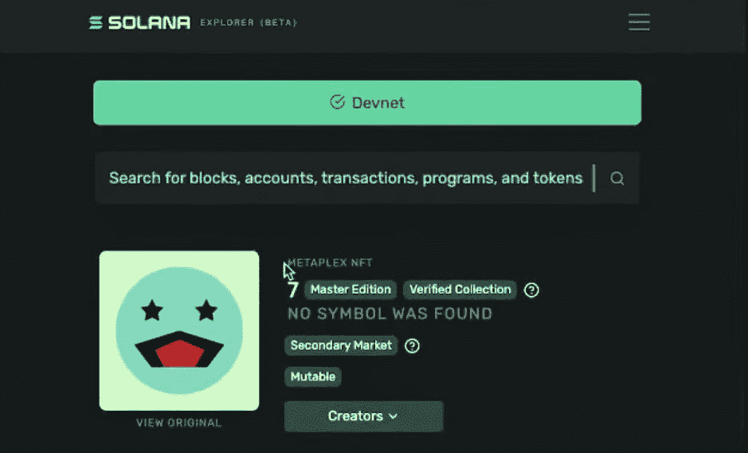
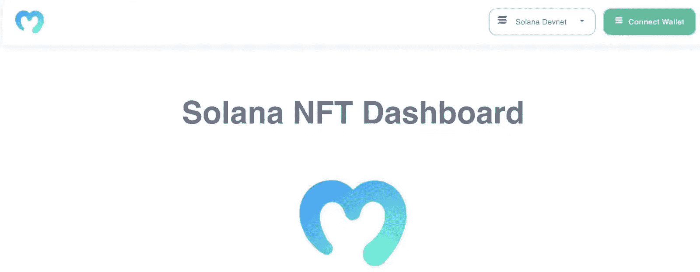
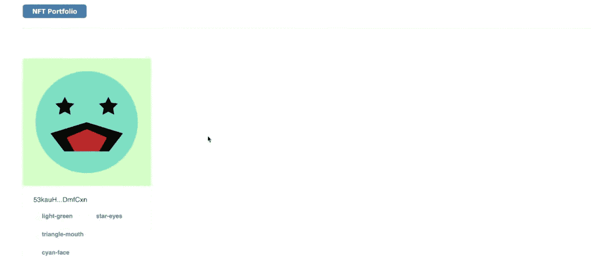
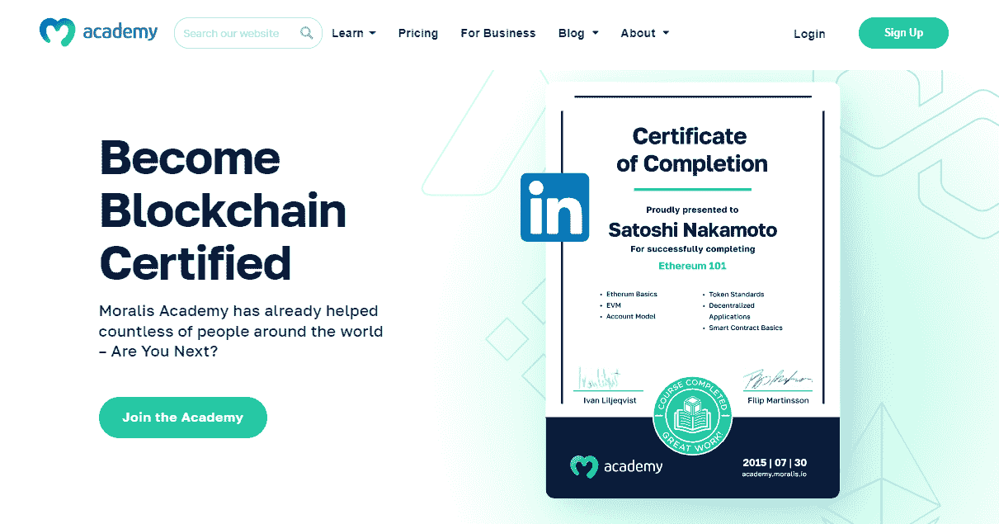

# 索拉纳 NFT 薄荷工具-创建自己的索拉纳 NFT

> 原文：<https://moralis.io/solana-nft-mint-tools-create-your-own-solana-nft/>

由于索拉纳令牌属于 SPL 标准，而不是以太坊和 EVM 兼容链上的典型标准，深入 NFT 空间的用户不知道在创建索拉纳 NFT 时使用什么工具。幸运的是，我们决定在这篇文章中强调最好的索拉纳 NFT 造币厂工具，这样你就可以完成你的 NFT 难题，创造你自己的索拉纳 NFT！此外，我们在这里将要探索的一些工具是 Metaplex 和它的 NFT 糖果机，您可以利用它们来铸造单个[**NFT**](https://moralis.io/non-fungible-tokens-explained-what-are-nfts/)**或整个集合，而无需高级 Rust 编程知识。在索拉纳 NFT 造币厂工具中，我们还将利用当地的索拉纳钱包和 Arweave——一种分散式存储解决方案。简而言之，如果你跟随这篇文章，你会毫不费力地熟悉所有你需要的必要工具。**

当我们利用索拉纳 NFT 薄荷工具时，我们将首先完成 Metaplex 糖果机 v2 的初始设置。接下来，我们将向您展示如何在本地计算机上创建一个 Solana 钱包。接下来，我们将带您了解糖果机 v2 配置。我们还将向您展示如何准备图像和元数据 NFTs 背后的资产。然后，我们将重点演示如何创建您自己的 meta plex NFT 糖果机实例。此外，我们将介绍如何将资产上传到 Arweave。接下来，我们将向您展示如何使用您的 NFT 糖果机来创建一个 NFT 收集的例子。尽管如此，您将学习如何验证您的资产被正确上传。最后，您将看到索拉纳 NFT 造币厂的工具。此外，我们还有一份奖金给你。因此，请务必[创建您的免费 Moralis 账户](https://admin.moralis.io/register)以使用奖金部分。

## 使用索拉纳 NFT 薄荷工具的先决条件

在使用索拉纳 NFT 薄荷工具，你需要了解基本知识。因此，你应该知道什么是 Solana NFTs，什么是 Metaplex。所以，从前者开始，注意 Solana 是一个流行的可编程区块链。正如你在阅读本文开始时可能已经理解的那样，索拉纳与 EVM 不兼容。因此，它依靠自己的工具，从加密钱包开始。因此，你不能将 MetaMask 与 Solana 一起使用。索拉纳也有自己的智能合约变体，被称为“链上程序”或简称为“程序”。

索拉纳程序的目的和智能合约的目的是一样的——确保事情顺利进行。本质上，Solana 程序根据预定义的规则执行自动操作。因此，这些程序也是索拉纳 NFT 薄荷工具之一。尽管如此，让我们再次指出，Solana 使用的是 SPL 令牌标准，它包括可替换令牌和不可替换令牌。你可以从“[什么是索拉纳”中了解更多关于索拉纳和 SPL 令牌的信息。](https://moralis.io/what-is-solana-the-full-2022-guide/)、[SPL vs ERC——20 代币](https://moralis.io/spl-vs-erc20-tokens-comparing-solana-and-ethereum-tokens/)篇。

因此，索拉纳非功能性交易是索拉纳链上不可替代的 SPL 代币。

现在您已经知道什么是 Solana NFTs，是时候了解 Metaplex 了。后者是一个流行的 NFT 市场、艺术、收藏品和游戏生态系统。因此，Metaplex 协议致力于提供支持 NFT 开发的标准和工具。Metaplex 的解决方案之一是让开发人员能够以分散的方式创建 NFT。在这方面，Metaplex 是智能合约和工具的组合，用于简单地创建和启动 NFTs。这些工具以 Metaplex 店面和 NFT 糖果机的形式出现。此外，后者是我们今天要关注的主要 NFT 造币工具之一。

## 使用索拉纳 NFT 薄荷工具

有了基础知识，你就可以专注于今天的教程了。我们将带你经历几个不同的阶段，与铸造索拉纳 NFTs。因此，你应该能够很容易地跟上。当然，我们鼓励您实现概述的步骤，以充分利用本文。

第一阶段是完成最初的 [NFT 糖果机](https://moralis.io/how-to-create-an-nft-candy-machine/) v2 设置。此外，为了更加方便，我们鼓励您使用我们在 [GitHub](https://github.com/YosephKS/moralis-solana-metaplex) 上为您准备的代码。

注意:关于今天的示例项目的某些阶段的其他细节，我们将参考视频教程，您可以在本文的底部找到它。

### NFT 糖果机 V2 初始设置

要使用 NFT 糖果机 v2，你需要这些工具:Git、NodeJS、“yarn”(一个包管理器)和 TS-node。您将使用 Git 来克隆存储库，NodeJS 将作为 JavaScript 运行时，使用“yarn”，您将安装所需的依赖项，TypeScript node (TS-node)将作为执行环境。

注意:如果您使用的是苹果 M1 芯片，您需要安装额外的依赖项(“brew install pkg-config cairo pango libpng JPEG gif lib librsvg”)。

准备好上面列出的工具后，继续克隆和安装 Metaplex。在这里，您有两个选择——您可以使用 Metaplex 文档提供的 URL，或者使用我们的代码(上面的 GitHub 链接)。我们推荐使用我们的代码，因为它完全符合本教程。我们的代码还包括使用 Moralis 所需的特定代码行。后者将使你更上一层楼，充分利用奖金部分。所以，现在克隆我们的代码:

### 你的索拉纳钱包

要打造 Solana NFTs，你需要一个 Solana 钱包。后者会“储存”你的 SOL(索拉纳的原生加密货币)，你需要用它来覆盖交易费用。毕竟，铸造 NFT 包括执行链上事务。幸运的是，您可以使用 Solana 工具套件特性，这使您能够轻松地创建本地钱包。

注意:请记住，本地钱包不是很安全。然而，它们对于开发来说是实用的。因此，不要用你的本地钱包储存更多的资金。

要创建您的本地 Solana 钱包，您需要完成以下步骤:

1.  在您的终端中使用“Solana–version”命令。
2.  输入“索拉纳地址”命令。
3.  最后，使用“索拉纳平衡”命令。

注意:如果你还没有你的 Solana 地址，你可能想设置你的新的 devnet 钱包。使用 Metaplex 文档作为指南。

出于本教程的考虑，我们将重点关注 Solana devnet。这意味着你不需要获得真正的溶胶。相反，你可以免费收集“测试”溶胶。您可以使用“solana airdrop 2”命令来完成此操作，该命令为您提供了两个 SOL 令牌。

注意:要在 Solana mainnet 上使用你的 NFT 糖果机，你需要真正的 SOL。因此，你必须在一个有信誉的交易所购买，然后把它转移到你的钱包里。

### 配置你的索拉纳 NFT 薄荷工具

准备好您的本地 Solana 钱包，打开上面克隆的项目。为了方便起见，我们建议跟随我们使用 Visual Studio 代码(VSC)。接下来，找到“example-candy-machine-upload-config . JSON”文件:

上面的截图表明我们将使用 Arweave 来存储我们的资产。但是，请记住，您还有其他选择。要探索其他有信誉的替代方案，请使用下面的视频，从 4:39 开始。

### 准备好图像和元数据 NFTs 背后的资产

在这一点上，你可能明白你不能凭空制造 NFT。因此，您需要准备好文件和元数据。文件代表了 NFTs 的有形部分，而元数据提供了关于 NFTs 的细节。此外，在制造 NFT 时也会用到这些细节。此外，元数据以 JSON 文件的形式出现。你可以自己准备这些文件；然而，本教程的要点是教你关于索拉纳 NFT 薄荷工具。因此，您可以简单地使用我们的示例资产:

查看上面的截图，您可以看到“example-assets”文件夹中有十对文件。这意味着你可以使用这些文件铸造十个索拉纳 NFT 代币。在上图的右侧，您还可以看到十个 JSON 文件中的一个的详细信息。有关文件的更多细节，请使用下面的视频，从 7:52 开始。这也是您可以学习如何验证您的资产(可选步骤)的地方。

### 使用索拉纳 NFT 薄荷工具上传您的资产

现在是时候上传你的文件了，关于如何执行“上传”命令的细节，请使用下面的视频(12:27)。如果你听从我们的领导，这个命令会把你的图片和 JSON 文件上传到 Arweave。最终，您可以简单地复制 Metaplex 文档提供的命令。但是，请确保您编辑的路径与此项目相匹配:

通过执行上面的命令行(使用更新的路径)，您将在 Solana devnet 上部署您的 NFT 糖果机。因此，您将上传所有资产并创建 NFT 糖果机程序的实例。

### 用索拉纳 Mint 造币工具创作 NFT 系列

现在，您已经准备好了 NFT 糖果机的实例，并且您的资产位于云中。因此，你已经得到了所有的索拉纳 NFT 薄荷工具，你需要创建你的 NFT 收集准备就绪。同样，您必须从 Metaplex 文档中复制特定的命令行(有关更多详细信息，请使用下面的视频[15:35])。此外，就像前面一样，您还需要调整以下命令以匹配您的项目路径:

以上命令将为您的资产准备一个集合。当您进入造币流程时，您将有机会将此集合设置为您的 NFTs 详细信息的一部分。

#### 验证资产上传

就像资产验证一样，验证资产上传也是一个可选但推荐的步骤。基本上，这一步可以帮助您确保所有资产都已正确上传:

有关“验证资产上传”步骤的详细说明，请从 17:23 开始观看下面的视频，或访问 Metaplex 文档。

## 索拉纳 NFT 铸币工具在行动——铸造你的非专利商标

最后，你可以使用索拉纳 NFT 造币厂工具来创建你的 NFT。如果您对铸造过程的细节感兴趣，请使用下面的视频，从 18:18 开始。然而，多亏了 Metaplex，创建 Solana NFTs 变得非常简单。就像您在前面的步骤中所做的一样，您将再次从 Metaplex 文档中复制所需的命令。同样，在运行命令之前，确保实现必要的调整以匹配您的文件路径。

注意:您有两种铸造选择。你可以单独铸造茄汁，也可以批量铸造。后者使您能够在单个事务中创建多个 NFT。

通过执行铸币交易，您可以将您的资产转换成 NFT。成功创建 NFT 后，您可以在 Solana explorer 中查看它们。因为您在 devnet 上创建了 NFT，所以您需要切换到那个网络:

### 额外收获:创建一个 NFT 仪表板

我们鼓励你进一步发展你的 Solana 程序。因此，我们准备了这个奖金部分，在这里您可以学习如何创建您的 NFT 仪表板。这就是 Moralis 让事情变得轻而易举的地方。因此，如果你还没有这样做，请使用简介中的“创建你的免费 Moralis 账户”链接。有了 Moralis 的 ultimate [Solana API](https://moralis.io/solana-api/) ，你将能够专注于前端，同时用单行代码覆盖 Web3 后端特性。这是我们的索拉纳 NFT 投资组合跟踪 dapp 的例子，你可以按照下面的视频(24:50)建立:

通过使用虚拟钱包进行身份验证，我们的示例 dapp 在连接的钱包中整齐地显示 NFT:

最后，这是我们在本文中一直引用的视频:

https://www.youtube.com/watch?v=BPQXek6lMUE

## 索拉纳 NFT 造币厂工具-创建您自己的索拉纳 NFT-摘要

在本文中，我们从基础知识开始，您已经了解了什么是 Solana NFTs 和 Metaplex。然后，我们重点介绍了使用索拉纳 NFT 薄荷工具。因此，您能够跟随我们的领导并完成所有必要的设置。在这个过程中，您学习了如何准备好文件和元数据，以及如何将它们上传到 Arweave。最后，你有机会使用你的 NFT 糖果机的实例来铸造你的 NFT。此外，我们还展示了如何使用 Moralis 轻松创建一个整洁的 NFT 仪表板。

如果你喜欢今天的教程，并想深入了解 NFT 的发展或探索其他 Web3 主题，请务必访问 [Moralis YouTube 频道](https://www.youtube.com/c/MoralisWeb3)和 [Moralis 博客](https://moralis.io/blog/)。此外，由于 Moralis 是跨链互操作的，您可以专注于索拉纳，以太坊，或其他领先的 EVM 兼容链。Moralis 也是关于跨平台互操作性的。因此，你可以使用最流行的 Web2 开发平台来加入 [Web3](https://moralis.io/the-ultimate-guide-to-web3-what-is-web3/) 革命。

最后但同样重要的是，值得指出的是，加密领域提供了许多有趣的工作机会。因此，你可以全职从事加密工作，专注于这个颠覆性的快速发展的行业。当然，在这种情况下，获得密码认证会大大增加你获得想要的工作的机会。这就是 Moralis 学院的课程能给你所需知识和额外优势的地方。此外，这个在线学院还为您提供个性化的学习路径、专家指导以及行业内最先进社区之一的会员资格。

