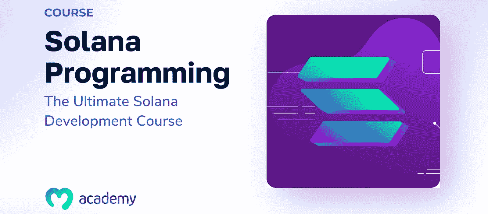
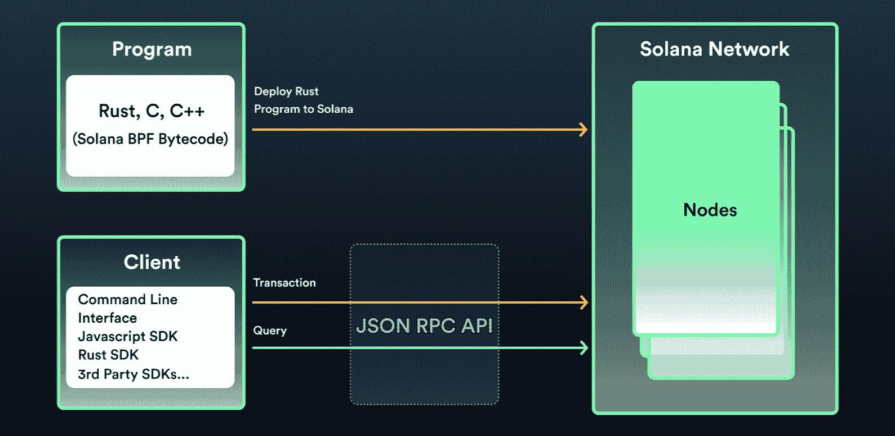
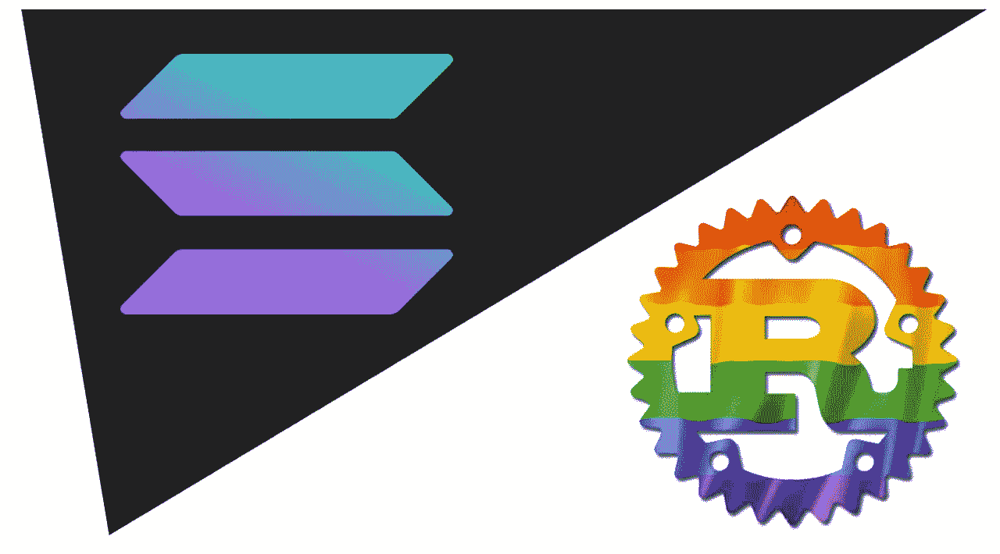
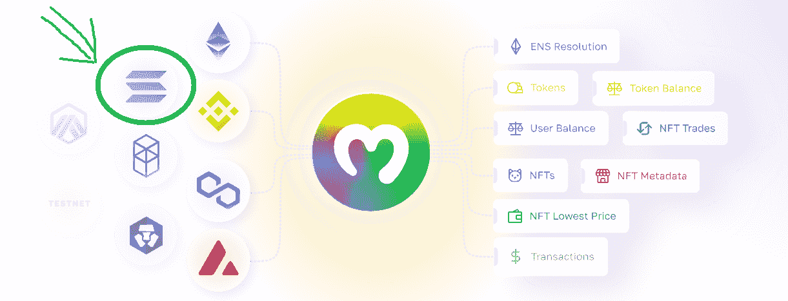
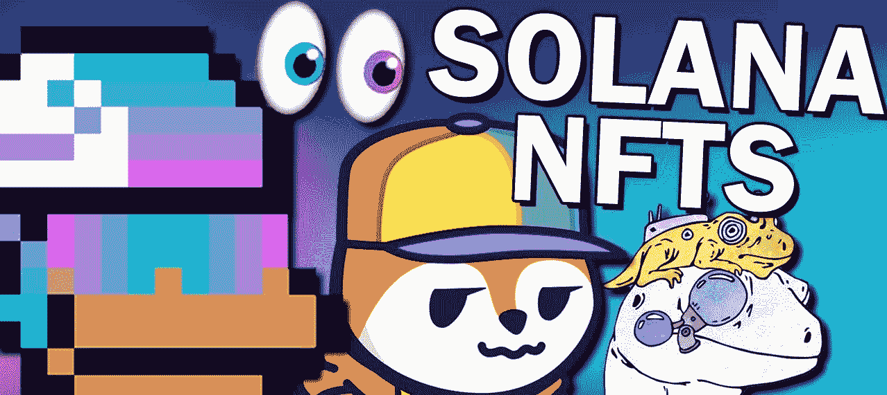
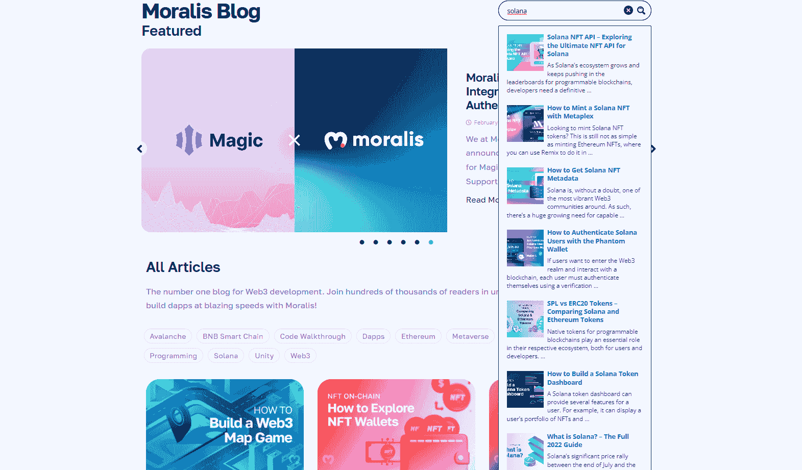

# Solana 编程——Solana 开发的最终指南

> 原文：<https://moralis.io/solana-programming-the-ultimate-guide-to-solana-development/>

索拉纳是定义 2021 年的可编程区块链之一。然而，索拉纳还有比 2021 年价格上涨更多的东西。具体来说，很多开发人员都在关注 Solana 编程。此外，与以太坊不同的是，该连锁店的汽油费要低得多，这使其比以太坊等更具优势。此外，索拉纳链上有无数项目——更不用说 SPL 代币和索拉纳 NFT(不可替代代币)了。此外，与大多数其他流行的区块链网络不同，索拉纳不是 EVM 兼容的。因此，Solana 不使用 Solidity 作为它的编程语言。尽管如此，我们将涵盖您需要了解的关于 Solana 编程的所有知识，不管您以前有什么知识。首先，你应该知道有一些工具可以让 Solana 编程变得简单很多。这就是最终的 Web3 开发平台 [**Moralis 家**](https://moralis.io/) **的不同之处。而且，由于熊市是为了建设，现在是学习更多关于索拉纳开发的最佳时机。**

接下来，我们将从基础开始，确保你们都了解索拉纳。然后，我们再来仔细看看如何做索拉纳编程。在这里，您还可以学到更多关于 Solana 编程语言选项的知识。接下来，我们将深入探讨 Moralis 的索拉纳 API，包括[索拉纳 NFT API](https://moralis.io/solana-nft-api-exploring-the-ultimate-nft-api-for-solana/) 。后者使您能够毫不费力地围绕 Solana NFTs 构建分散式应用程序(dapps)。最后但同样重要的是，我们还将快速概述一些简洁的示例项目，它们可以帮助您学习如何进行 Solana 编程。然后，你就可以更深入地研究这些项目了。如果你决定这样做，你将学会利用 Moralis 和 Metaplex 等工具的力量。因此，你将有机会创造自己的索拉纳令牌，SPL 仪表板，和其他杀手索拉纳 dapps！


## 索拉纳是什么？

阿纳托利·亚科文科和拉杰·戈卡尔在 2017 年推出了索拉纳。这两位开发人员仍然与索拉纳实验室有着密切的联系，索拉纳实验室是索拉纳背后的公司。亚科文科是索拉纳实验室的现任首席执行官，戈卡尔是其首席运营官。然而，这并没有告诉我们太多关于索拉纳的事情——所以简而言之，[索拉纳](https://moralis.io/what-is-solana-the-full-2022-guide/)是什么？

Solana 是一个公共和开源的可编程区块链，这意味着它支持智能合约。然而，在索拉纳的案例中，后者被称为“程序”，尽管它们扮演着与智能合约相同的角色。因此，索拉纳程序是索拉纳编程的关键。而且，正如简介中提到的，就像以太坊一样，Solana 支持可替代和不可替代令牌的开发。当然，这也是一个开发者可以部署各种 dapps 的网络。此外，索拉纳的本土硬币或代币被称为“索尔”。这种本地货币用于通过 Solana 的混合 DeFi staking consensus 提供网络安全，支付交易费用，并在这条链上转移价值。

此外，尽管索拉纳的混合共识机制，它属于证明利益(PoS)链的范畴。Solana 的 PoS 协议由 staked SOL 进行“挖掘”，确保 Solana 区块链在所有节点上维护准确的信息。此外，Solana 的理论吞吐量高达每秒 65，000 个事务。除了速度快之外，索拉纳的交易费还不到一美元一美分。相比之下，以太坊的燃气费往往在数百美元。因此，这两个因素使得 Solana 在用户和开发人员中都很受欢迎。然而，我们不得不提到索拉纳的问题，许多怀疑论者继续怀疑其权力下放的程度。

要深入了解索拉纳的混合共识机制、该链的利与弊以及索尔的令牌组学，请点击上面的“索拉纳是什么”链接。



## 如何做索拉纳编程

有了 Solana 基础知识，我们就可以专注于如何进行 Solana 编程了。在这里，我们不得不提醒您，索拉纳编程有不同的类型。例如，有[创建 Solana 令牌](https://moralis.io/how-to-create-a-solana-token-in-5-steps/)，创建 Solana dapps，以及创建 Solana 程序(智能合约等价物)。有时，这类节目之间的界限会非常模糊。此外，虽然创建 Solana 程序被认为是 Solana 编程的核心，但您可以使用链上数据和 Solana wallets(如 Phantom)创建许多 Solana dapps，而无需编写 Solana 程序。此外，即使程序是代币铸造的幕后推手，您也可以实际创建 SPL 代币，而无需编写自己的 Solana 程序。因此，这完全取决于你的目标和偏好。

开始 Solana 编程的最一般的方法是访问 Solana 的“开发人员资源”页面。在那里，您可以浏览他们的文档，了解 Solana 开发工作流、程序、dapps 和客户端 SDK。此外，这是访问 Solana Cookbook、SolDev 和核心 Metaplex 文档的地方。因此，我们强烈建议您探索这些宝贵的资源。然而，Solana 编程最简单的方法是通过 Moralis。并且，我们将向您展示如何使用这个 Firebase for crypto 来为 Solana 获得一个 API。但是首先，让我们仔细看看 Solana 编程语言选项。



### 索拉纳用什么编程语言？

如果我们必须选择 Solana 编程语言，最明显的选择是 Rust。但是，C 和 C++也可以用来在 Solana 上部署程序。所以，如果你的目标是成为一个铁杆 Solana dev，在这个链条上掌握智能合约开发的人，Rust 绝对是一个先决条件。但是，正如您之前所了解的，有一些工具可以让您只关注前端，并且仍然可以创建杀手级 dapps。因此，当您使用 Moralis 时，您的 JavaScript 技能足以满足您的 Solana 编程需求。因此，我们将仔细看看如何获得 Moralis 的 Solana API。然而，对于那些想了解更多核心 Solana 编程语言的人，请务必查看下面的部分！



### 核心 Solana 编程语言——Rust

Rust 是格雷顿·霍尔在 2010 年创造的。因此，铁锈在索拉纳之前就存在了，不像固体，它是专门为以太坊设计的。这个事实给了已经精通 Rust 的开发人员一定的优势。而且，Rust 是一种开源的编程语言。它是高性能的、静态类型的和内存高效的。对于对可靠性和安全性感兴趣的开发人员来说，Rust 是一个很好的选择。此外，Rust 还使控制内存等底层细节变得非常容易。此外，由于 Rust 的类型系统和所有权模型，开发人员可以在编译时消除几类错误。

Rust 的另一个优点是它没有运行时或垃圾收集器。因此，它可以轻松支持性能关键型计算，并在嵌入式设备上运行。而且，将 Rust 与其他流行的编程语言集成在一起是非常容易的。尽管如此，据开发者称，核心的 Solana 编程语言非常直观和通用，在 Solana 上创建程序只是其应用之一。



## 获取用于 Solana 编程的 API

Moralis 的 Solana API 是开始 Solana 编程的最简单的方法。有了这个快速而强大的 API，您可以毫不费力地从索拉纳区块链查询数据。本质上，Solana API 是一个非常强大的 REST API。此外，它使您能够获取用户令牌余额、NFT 元数据等等。此外，与 REST APIs 一样，您可以在任何编程语言中默认调用 Solana API。因此，您可以毫不费力地在多个应用程序和平台中获取 Solana 数据

然而，使用这个 API 最简单的方法是使用 Moralis 的 SDK 调用它。这样，只需要几行代码。此外,“Moralis。SolanaAPI”名称空间是所有这些强大函数的所在。此外，“Moralis.start()”会自动加载“Moralis”。SolanaAPI”模块。此外，为了更加方便，上述名称空间分为两类——“solanaapi . account”和“SolanaAPI.nft”。而且，由于索拉纳 NFTs 继续风靡一时，让我们仔细看看索拉纳 NFT API。



### 索拉纳·NFT 节目

至此，你知道索拉纳与 EVM 不相容。因此，它有自己的象征性标准，被称为 SPL。这就是 Moralis 为您提供“getNFTMetadata”来获取 SPL NFTs 的元数据的地方。而且这个钩子有两个选项:“网络”和“地址”。

“网络”选项使您能够在 Solana 的 mainnet 和 devnet 之间进行选择。不过，mainnet 是默认值。另一方面,“地址”选项接受 SPL·NFT 的地址。为了进一步阐明“getNFTMetadata”的用法，让我们看看获取给定 SPL NFT 地址的 devnet 元数据的示例代码:

```js
const options = {
  network: "devnet",
  address: "6XU36wCxWobLx5Rtsb58kmgAJKVYmMVqy4SHXxENAyAe",
};
const nftMetadata = await Moralis.SolanaAPI.nft.getNFTMetadata(options);
```

下面是上面几行代码的结果:

```js
{
  "mint": "string",
  "standard": "string",
  "name": "string",
  "symbol": "string",
  "metaplex": {
    "metadataUri": "string",
    "masterEdition": true,
    "isMutable": true,
    "primarySaleHappened": true,
    "sellerFeeBasisPoints": 0,
    "updateAuthority": "string"
  }
}
```

一旦你获得了上面的细节，你就可以围绕它建立各种 dapps。此外，除了 NFTs 的元数据，您还可以使用“getNFTs”返回特定地址的 SPL NFTs。这个方法还接受网络类型(mainnet 或 devnet)和一个地址。此外，还有其他几个 Moralis Solana API 挂钩供您使用，包括“balance”、“getSPL”和“getPortfolio”。关于这些钩子的更多细节，请访问 Moralis 文档。


### 用 Moralis 练习 Solana 编程

根据我们的经验，通过动手学习对于学习编程非常有效。因此，我们鼓励您卷起袖子，着手我们的一些 Solana 编程示例项目。举例来说，如果你能学会如何用 Metaplex 制造一种茄烟 NFT。这个例子项目将教你如何薄荷每个索拉纳 NFT 单独或如何批量薄荷没有任何生锈的编程。

此外，我们还建议探索如何[获得索拉纳 NFT 元数据](https://moralis.io/how-to-get-solana-nft-metadata/)。这是您能够使用上面介绍的“getNFTMetadata”钩子的地方。此外，在这里您还将学习如何构建一个简洁的 Web3 UI，以用户友好和引人注目的方式呈现 Solana NFTs。

最后但同样重要的是，我们也鼓励你创造一个索拉纳令牌；只需要 5 个简单的步骤。此外，你可以给你的令牌一个家，并建立一个[索拉纳令牌仪表板](https://moralis.io/how-to-build-a-solana-token-dashboard/)。这些教程将带你更接近成为一名 Solana 开发者。因此，采取你的选择，并开始建设。但是，我们强烈建议您全部完成。在这个过程中，你会建立起自信，然后准备好处理自己的项目。



## Solana 编程——Solana 开发的最终指南——摘要

如果这是您第一次听说 Solana，那么您现在已经了解了 Solana 编程所需的一切。此外，即使您已经掌握了诸如“什么是 Solana”之类的基础知识，您也有机会学习更多关于 Solana 编程的知识。因此，你现在知道 Rust 是主要的 Solana 编程语言，用于创建 Solana 程序。

此外，您还知道要成为一名 Solana 程序员并不需要精通 Rust。事实上，您有机会了解开始创建 Solana dapps 的最简单方法，那就是通过 Moralis 的 Solana API。而且，由于 Moralis 提供免费计划，这也是一种省钱的方法。此外，我们还分享了一些我们的 Solana 项目示例，可以帮助您获得初始牵引力。然而，如果你真的想成为一名索拉纳专家，采取更专业的方法可能是你的道路。在这种情况下，我们建议报名参加[索拉纳编程 101](https://academy.moralis.io/courses/solana-programming-101) 。

另一方面，你可能想探索其他区块链发展的话题，而不是关注索拉纳。如果是这样，Moralis 家的 Web3 YouTube 频道和 Moralis 家的 Web3 博客是你的出路。在那里，您可以找到大量的示例项目，教您如何在不同的可编程区块链上创建令牌和构建各种 dapps。而且，由于 Moralis 的跨链互操作性，您不会被任何特定的网络所束缚。除了可操作的示例项目，这两个出口还提供了易于理解的加密术语和概念的解释。当然，你也可以从经验丰富的 [NFT 程序员](https://nftcoders.com/)那里了解非功能性测试，例如了解[生成非功能性测试](https://nftcoders.com/begin-generating-nfts-in-15-minutes/)，如何[创建一个 NFT 造币网站](https://nftcoders.com/create-an-nft-minting-website-in-5-steps/)，或者了解更多关于 [NFT 用例](https://nftcoders.com/learning-all-about-nft-use-cases-in-2022/)。此外，如果你想要更有条理的课程，你可以去 Moralis 学院。此外，这也是获得专业指导的地方，并成为最支持和进步的区块链社区的一员。