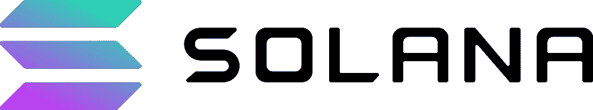

# 面向开发人员的 Solana 智能合同示例

> 原文：<https://moralis.io/solana-smart-contract-examples-for-developers/>

您是否希望进入 Solana 智能合同开发领域？如果是这样的话，那么您正处于您需要的位置，因为本文通过探索 Solana 智能合同示例来介绍 Solana 开发。探索这些是非常有益的，因为它给了我们一个关于 Web3 合同如何在 Solana 网络上构建的概述。然而，在深入示例之前，我们将通过研究智能合约及其架构的复杂性来回归基础。也就是说，如果您已经熟悉了 Web3 合约，并想对本文中概述的合约进行深入剖析，请随意跳到“ ***Solana 智能合约示例*** **”部分！**

索拉纳是一个杰出的可编程区块链，像许多其他网络一样，索拉纳的特色是 [Web3 合同](https://moralis.io/what-are-web3-contracts-exploring-smart-contracts/)。然而，与其他以太坊替代方案不同，Solana 与 EVM 不兼容(与以太坊虚拟机不兼容)。因此，这意味着索拉纳智能合同开发不同于其他 EVM 连锁店。

出于这个原因，本文首先深入探讨 Web3 合约的复杂性，然后用一个章节探讨索拉纳和 EVM 智能合约之间的区别。一旦您对 Solana smart contracts 有了更深刻的理解，剩下的部分将列出几个示例，让您了解它们的结构。


此外，如果您对 Solana 开发感兴趣，请查看 Moralis 的 Solana API。这是企业级[web 3 API](https://moralis.io/web3-apis-exploring-the-top-5-blockchain-apis/)的 [Moralis](https://moralis.io) 选择之一，使区块链开发变得更加容易，Moralis 是理想的商业用 web 3 选择！此外，无论你想创建什么样的 Web3 项目，[注册 Moralis](https://admin.moralis.io/register) 以获得更无缝的开发体验！

## 什么是智能合约？

在深入 Solana 智能合约示例之前，我们将回到基础，探索智能合约的复杂性。如果你已经熟悉智能合约的基本原则，请直接跳到“ *Solana 智能合约示例*”部分。否则，请加入我们，回答“什么是智能合约？”。


智能合同(Web3 合同)是托管在区块链网络上的程序，根据预定义的条件执行预定义的操作。此外，Web3 开发人员使用智能合约来自动执行两方或多方之间的协议。因此，Web3 契约与传统契约具有相同的基本功能，只是代码作为这些数字程序的中介，而不是传统的中介。

智能合约扩展了比特币背后的基本概念，即通过实现任何交易的安全自动化，在没有中介的情况下发送和接收资产。因此，智能合约使更复杂的交易/交易自动化成为可能，并且由于它们运行在区块链网络上，它们提供了高可靠性、安全性和无国界的可访问性。

此外，Web3 合同是区块链产业的支柱。这些允许开发者创建创新的 dapps、令牌和其他 Web3 项目。此外，智能合约被用于从革新金融工具到游戏逻辑的方方面面。每当契约被部署在区块链网络上时，它们通常是不可逆的或不可变的，这意味着契约不能被改变。不变性——结合智能合约的确定性特征——确保参与者可以确定结果。

有趣的是，智能合同有时被称为“数字自动售货机”，因为自动售货机是解释智能合同功能的一个很好的类比。就像传统的自动售货机一样，智能合约保证以正确的输入获得特定的输出。然而，这种交易往往比收到一份点心或汽水更复杂。

## 索拉纳有智能合约吗？

索拉纳有智能合约吗？这个问题的答案是肯定的！Solana 是一个可编程的分散式区块链，能够创建可扩展的、用户友好的 dapps，并且像所有可编程的区块链网络一样，Solana 具有智能合约的特性。然而，索拉纳智能合约不同于，例如，EVM Web3 合约。



Solana 的智能合约架构与更传统的 EVM 区块链模型略有不同。例如，以太坊智能合约仅在以太坊网络上部署的单个合约中累积代码/逻辑和状态。就 Solana 而言，智能契约(或程序)是无状态的或“只读的”，只包含程序逻辑。

一旦部署了合同，就可以通过外部帐户与他们进行交互。然后，帐户负责存储与程序交互相关的数据。因此，这就造成了逻辑(程序)和状态(账户)之间的分离。

上面的区别概述了索拉纳和其他 EVM 兼容的区块链在智能合约方面的关键区别。由于 EVM 连锁店和索拉纳之间的智能合约架构存在差异，因此它们的构建方式也存在差异。开发人员使用 Solidity 编程语言编写 EVM 兼容的智能合同。同时，对于 Solana 合同，开发人员使用 Rust、C 和 C++编写。

因此，如果您想从事 Solana 智能合同开发，那么精通上述编程语言可能是个好主意。然而，Solana 网络上已经有许多部署的程序/智能合同供您交互。因此，你只需要偶尔创建新的智能合同时，建立在索拉纳区块链！

## Solana 智能合同示例

随着对智能合约及其在 Solana 上下文中的含义有了更好的理解，下一节将深入研究一些 Solana 智能合约示例。这将提供索拉纳智能合约可能看起来像什么的概述，使前面的解释更加简单明了。


具体来说，本节涵盖了三个 Solana 智能合约示例:

1.  **"*****Hello _ World*****"**–第一个示例智能契约是" *hello_world* "，它负责简单地显示一个" *Hello World！！*"有人调用程序时的消息。
2.  **"** ***井字游戏*****"**–第二个 Solana 样本智能契约被称为"*井字游戏*"，由于这个契约负责处理一个井字游戏的游戏逻辑，所以要复杂一点。
3.  *****微博*****——我们将进一步考察的最后一个例子叫做“*微博*”，它照顾了一个微博的必要逻辑。****

****尽管如此，让我们直接进入我们的第一个 Solana 智能合约示例，仔细看看" *hello_world* "合约！****

### ****“ *hello_world* ”合同****

****我们三个 Solana 样本智能合约中的第一个，“ [*hello_world*](https://github.com/JohnVersus/solana-contracts/blob/main/hello_world/src/lib.rs) ”相对简单。您可以在下面找到该智能合约的完整代码:****

```js
**use solana_program::{
    account_info::AccountInfo, entrypoint, entrypoint::ProgramResult, msg, pubkey::Pubkey,
};

entrypoint!(hello_world);

pub fn hello_world(
    _program_id: &Pubkey, // Public key of the account the program was loaded into
    accounts: &[AccountInfo], // All accounts required to process the instruction
    _instruction_data: &[u8], // Serialized instruction-specific data
) -> ProgramResult {
    msg!("Hello {:}!!", accounts[0].key);
    Ok(())
}**
```

****每当有人调用这个智能合约时，它就会触发一个用户需要签署的 Solana 事务。当他们签署消息时，它自动返回合同的数据日志，在本例中，是一个" *Hello World！！*"消息。****

### ****“井字游戏”合同****

****接下来，让我们仔细看看“[](https://github.com/JohnVersus/solana-contracts/blob/main/tic_tac_toe/src/lib.rs)*”第二样智能契约。这个契约比上一个契约更复杂，因为它处理了多人井字游戏的逻辑。然而，这是索拉纳智能合约的全部代码:*****

```js
***use borsh::{BorshDeserialize, BorshSerialize};
use solana_program::{
    account_info::AccountInfo, entrypoint, entrypoint::ProgramResult, msg, pubkey::Pubkey,
};

pub fn win_check(moves: [u32; 9]) -> u32 {
    // Player 1 move will be marked as 1 and player 2 as 2
    let [m1, m2, m3, m4, m5, m6, m7, m8, m9] = moves;
    if (m1 == 1 && m2 == 1 && m3 == 1)
        || (m1 == 1 && m4 == 1 && m7 == 1)
        || (m7 == 1 && m8 == 1 && m9 == 1)
        || (m3 == 1 && m6 == 1 && m9 == 1)
        || (m1 == 1 && m5 == 1 && m9 == 1)
        || (m3 == 1 && m5 == 1 && m7 == 1)
        || (m2 == 1 && m5 == 1 && m8 == 1)
        || (m4 == 1 && m5 == 1 && m6 == 1)
    {
        // Condition for Player 1 Win
        return 1;
    } else if (m1 == 2 && m2 == 2 && m3 == 2)
        || (m1 == 2 && m4 == 2 && m7 == 2)
        || (m7 == 2 && m8 == 2 && m9 == 2)
        || (m3 == 2 && m6 == 2 && m9 == 2)
        || (m1 == 2 && m5 == 2 && m9 == 2)
        || (m3 == 2 && m5 == 2 && m7 == 2)
        || (m2 == 2 && m5 == 2 && m8 == 2)
        || (m4 == 2 && m5 == 2 && m6 == 2)
    {
        // Condition for Player 2 Win
        return 2;
    } else if (m1 == 1 || m1 == 2)
        && (m2 == 1 || m2 == 2)
        && (m3 == 1 || m3 == 2)
        && (m4 == 1 || m4 == 2)
        && (m5 == 1 || m5 == 2)
        && (m6 == 1 || m6 == 2)
        && (m7 == 1 || m7 == 2)
        && (m8 == 1 || m8 == 2)
        && (m9 == 1 || m9 == 2)
    {
        // Condition for Draw
        return 3;
    } else {
        return 0;
    }
}

#[derive(BorshSerialize, BorshDeserialize, Debug)]
pub struct GameAccount {
    pub player1: String,
    pub player2: String,
    pub moves: [u32; 9],
    pub game_status: u32,
    pub next_move: u32,
}

entrypoint!(tic_tac_toe);

pub fn tic_tac_toe(
    _program_id: &Pubkey,
    accounts: &[AccountInfo],
    instruction_data: &[u8],
) -> ProgramResult {
    let game_account = &accounts[0];
    let player1 = accounts[1].key.to_string();
    let player2 = accounts[2].key.to_string();

    let instruction: u32 = instruction_data[0].into();
    let played_by: u32 = instruction_data[1].into();
    let move_positon: usize = instruction_data[2].into();

    match instruction {
        // Create New Game or Reset the Game Data
        0 => {
            msg!("Instruction 0 Start");
            let game_data = GameAccount {
                player1,
                player2,
                moves: [0, 0, 0, 0, 0, 0, 0, 0, 0],
                game_status: 0,
                next_move: 1,
            };
            msg!("Game Creation Successful!!");
            msg!("Player 1: {:?}", game_data.player1);
            msg!("Player 2: {:?}", game_data.player2);
            game_data.serialize(&mut &mut game_account.data.borrow_mut()[..])?;
            msg!("Instruction 0 End");
        }
        // Play game!!
        1 => {
            msg!("Instruction 1 Start");
            let mut game_data = GameAccount::try_from_slice(&game_account.data.borrow())?;
            if game_data.game_status == 0 {
                msg!("Player 1: {:?}", game_data.player1);
                msg!("Player 2: {:?}", game_data.player2);

                // Verify and updating moves in Game Account
                if (game_data.moves[move_positon] == 0) && (game_data.next_move == played_by) {
                    if game_data.next_move == 1 {
                        game_data.moves[move_positon] = 1;
                        game_data.next_move = 2
                    } else if game_data.next_move == 2 {
                        game_data.moves[move_positon] = 2;
                        game_data.next_move = 1
                    }
                } else {
                    msg!(" Wrong Move");
                }

                let game_status = win_check(game_data.moves);

                match game_status {
                    0 => {
                        // Log the next player to move
                        msg!("Next move: Player {}", game_data.next_move);
                    }
                    1 => {
                        game_data.game_status = 1;
                        msg!("Player 1 won the game.");
                    }
                    2 => {
                        game_data.game_status = 2;
                        msg!("Player 2 won the game.");
                    }
                    3 => {
                        game_data.game_status = 3;
                        msg!("It's a Draw.");
                    }
                    _ => {
                        msg!("Game Error!!");
                    }
                }
                // Write the updated data to account.
                game_data.serialize(&mut &mut game_account.data.borrow_mut()[..])?;
                msg!("Instruction 1 End");
            } else {
                msg!(" Wrong Move.");
            }
        }
        // Invalid Instruction
        _ => {
            msg!("Invalid Instruction");
        }
    }

    Ok(())
}***
```

*****上面的代码负责井字游戏的所有游戏逻辑，处理游戏的几个方面。最初，契约检查两个玩家是否已经有一个游戏正在进行中。如果没有，智能合约会从头开始创建一个新游戏。此外，契约检查正确的玩家是否在移动，并相应地更新游戏的状态。*****

*****每次移动后，契约调用“ *win_check()* ”函数来检查是否有一个玩家赢得了游戏。最后，游戏状态返回给用户，使他们能够实时看到游戏板的更新！*****

### *****“*微博*合同*****

*****我们三个初始索拉纳样本智能合约的最后一个是“ [*【微博】*](https://github.com/JohnVersus/solana-contracts/blob/main/micro_blog/src/lib.rs) ”。就像第一个例子一样，这是一个相对简单的契约。下面，您将看到完整的代码:*****

```js
***use borsh::{BorshDeserialize, BorshSerialize};
use std::str;

use solana_program::{
    account_info::AccountInfo, entrypoint, entrypoint::ProgramResult, msg,
    program_error::ProgramError, pubkey::Pubkey,
};

// Create a struct to store Blog count
#[derive(BorshSerialize, BorshDeserialize, Debug)]
pub struct BlogCount {
    pub total_blogs: u32,
}

// Function to convert buffer array back to string
pub fn buffer_to_string(buffer: &[u8]) -> &str {
    let s = match str::from_utf8(buffer) {
        Ok(v) => v,
        Err(e) => panic!("Invalid UTF-8 sequence: {}", e),
    };
    return s;
}

entrypoint!(micro_blog);

pub fn micro_blog(
    program_id: &Pubkey,
    accounts: &[AccountInfo],
    instruction_data: &[u8],
) -> ProgramResult {
    let data = buffer_to_string(&instruction_data);

    let account = &accounts[0];

    // Check if the account is owned by this program, else throw an error.
    if account.owner != program_id {
        msg!(
            "Account {:?} does not have the program id {} as owner",
            account,
            program_id
        );
        return Err(ProgramError::IncorrectProgramId);
    }

    // Increment and store the number of times user created a new blog.
    let mut blog_counter = BlogCount::try_from_slice(&account.data.borrow())?;
    blog_counter.total_blogs += 1;
    blog_counter.serialize(&mut &mut account.data.borrow_mut()[..])?;

    // Save the data to the transaction logs
    msg!("Author: {}", accounts[1].key);
    msg!("Blog No: {}", blog_counter.total_blogs);
    msg!("Blog: {}", data);

    Ok(())
}***
```

*****该合同的目的是存储博客数据，并跟踪用户发布了多少帖子。因此，契约从前端应用程序读取数据，这些数据是用户以博客帖子的形式输入的。一旦用户发布了一条消息，契约就会增加跟踪该用户发布了多少帖子的数量。*****

*****这涵盖了前三个 Solana 智能合约样本。然而，我们接下来将探讨第四个例子，这个例子有点特殊，因为它与 NFTs 有关。*****

### *****索拉纳 NFT 智能合同示例*****

*****这里我们可以列举大量的例子。然而，由于我们手头只有这么多时间，我们将看一个精心挑选的例子。现在，在仔细研究我们在几个不同的索拉纳 NFT 智能合约示例中的选择之前，有必要提一下 Metaplex。Metaplex 是一个著名的 NFT 生态系统，包括游戏、市场、艺术、收藏品等。该协议结合了工具和智能合约，实现了创建和启动 NFTs 的无缝工作流。所以，如果你想了解更多关于索拉纳·NFT 智能合同开发的知识，去 Metaplex 看看是值得的。*****

*****

此外，我们提出 Metaplex 是因为我们下面展示的索拉纳 NFT 智能合约就是基于该协议的。更具体地说，我们将简要地研究一下索拉纳·NFT 为 Metaplex 的[糖果机](https://github.com/metaplex-foundation/metaplex-program-library/blob/master/candy-machine-core/program/src/lib.rs)签订的智能合同。这是整个代码的样子:

```js
use anchor_lang::prelude::*;

pub use errors::CandyError;
use instructions::*;
pub use state::*;
pub use utils::*;

pub mod constants;
pub mod errors;
mod instructions;
mod state;
mod utils;

declare_id!("CndyV3LdqHUfDLmE5naZjVN8rBZz4tqhdefbAnjHG3JR");

#[program]
pub mod candy_machine_core {
    use super::*;

    /// Add the configuration (name + uri) of each NFT to the account data.
    pub fn add_config_lines(
        ctx: Context<AddConfigLines>,
        index: u32,
        config_lines: Vec<ConfigLine>,
    ) -> Result<()> {
        instructions::add_config_lines(ctx, index, config_lines)
    }

    /// Initialize the candy machine account with the specified data.
    pub fn initialize(ctx: Context<Initialize>, data: CandyMachineData) -> Result<()> {
        instructions::initialize(ctx, data)
    }

    /// Mint an NFT. Only the candy machine mint authority is allowed to mint.
    pub fn mint<'info>(ctx: Context<'_, '_, '_, 'info, Mint<'info>>) -> Result<()> {
        instructions::mint(ctx)
    }

    /// Set a new authority of the candy machine.
    pub fn set_authority(ctx: Context<SetAuthority>, new_authority: Pubkey) -> Result<()> {
        instructions::set_authority(ctx, new_authority)
    }

    /// Set the collection mint for the candy machine.
    pub fn set_collection(ctx: Context<SetCollection>) -> Result<()> {
        instructions::set_collection(ctx)
    }

    /// Set a new mint authority of the candy machine.
    pub fn set_mint_authority(ctx: Context<SetMintAuthority>) -> Result<()> {
        instructions::set_mint_authority(ctx)
    }

    /// Update the candy machine configuration.
    pub fn update(ctx: Context<Update>, data: CandyMachineData) -> Result<()> {
        instructions::update(ctx, data)
    }

    /// Withdraw the rent lamports and send them to the authority address.
    pub fn withdraw(ctx: Context<Withdraw>) -> Result<()> {
        instructions::withdraw(ctx)
    }
}
```

上面的代码启用了 NFT 糖果机的所有功能。因此，它负责资产管理、索引生成/选择和铸造 NFT 的所有逻辑。此外，该合同使得铸造单个非功能性运输工具或批量制造它们成为可能。

这涵盖了本教程的索拉纳 NFT 智能合同的例子。下一节将快速向您展示如何实现和部署任何 Solana 智能合约示例！

## 如何部署 Solana 智能合同示例

当您完成一个契约的编写时，比如本文中提到的 Solana 智能契约示例，您需要一种方法来构建它们并将其部署到 Solana 网络。因此，本节通过向您展示如何部署" *hello_world* "契约来概述这个过程中的步骤，这是我们在前面的一节中的 Solana 智能契约示例之一。

首先，如果你还没有安装 Rust，Solana CLI 和 Solana wallet。接下来，打开您选择的 IDE 并启动一个新的终端。从那里，通过在终端中运行以下命令，建立一个" *Hello World* " Cargo 项目:

```js
cargo init hello_world --lib
```

这将在您的目录中创建一个货物库，其中包含用于构建 Solana 智能合约示例的文件。然后，您可以使用下面的命令导航到“hello_world”文件:

```js
cd hello_world
```

接下来，打开“Cargo.toml”文件，复制下面的代码片段，并将其添加到文件的底部:

```js
[lib]
name = "hello_world"
crate-type = ["cdylib", "lib"]
```

然后，您可以通过运行以下命令导航回终端并添加 Solana 程序包:

```js
cargo add solana_program
```

最后，打开“src/lib.rs”文件，将其所有内容替换为“ *Solana 智能合同示例*”部分中的“ *hello_world* ”合同代码:

```js
use solana_program::{
    account_info::AccountInfo, entrypoint, entrypoint::ProgramResult, msg, pubkey::Pubkey,
};

entrypoint!(hello_world);

pub fn hello_world(
    _program_id: &Pubkey, // Public key of the account the program was loaded into
    accounts: &[AccountInfo], // All accounts required to process the instruction
    _instruction_data: &[u8], // Serialized instruction-specific data
) -> ProgramResult {
    msg!("Hello {:}!!", accounts[0].key);
    Ok(())
}
```

有了合同代码，您现在应该能够通过输入以下 Cargo 命令并在终端中运行它来构建 Solana 智能合同:

```js
cargo build-bpf
```

接下来，剩下的工作就是使用下面的命令部署契约:

```js
solana program deploy ./target/deploy/hello_world.so
```

现在就是这样！现在，您已经成功地创建并部署了" *hello_world* "契约。现在，您可以将相同的原则用于您想要部署的任何其他 Solana 智能合约示例！

## 总结–Solana 智能合同示例

如果您已经了解了这么多，那么您现在已经看到了四个不同的 Solana 智能合约示例的概要。本文涵盖了从简单的" *hello_world* "智能合约显示一个" *Hello World！！*“消息给一个更复杂的索拉纳·NFT 合约负责铸造代币。因此，我们希望这能让我们深入了解索拉纳智能合约的结构。此外，我们希望它已经启发你创造自己的索拉纳智能合同！

如果你觉得这个指南很有帮助，可以在 Moralis 的 [Web3 博客](https://moralis.io/blog/)查看更多内容。该博客为新的和更有经验的开发人员提供了新鲜和令人兴奋的 Web3 开发内容。例如，查看最近在 [Dogechain](https://moralis.io/build-with-dogecoin-on-evm-what-is-dogechain/) 上的指南或者如何[上传文件到 IPFS](https://moralis.io/how-to-upload-files-to-ipfs-full-guide/) ！

此外，如果你想磨练你的索拉纳智能合同开发技能，考虑报名参加[Moralis 学院](https://academy.moralis.io)。例如，查看“ [Rust 编程](https://academy.moralis.io/courses/rust-programming)”课程，在 Solana 智能合同开发中变得更加突出！


此外，如果你想开发复杂的 Solana dapps，[立即与 Moralis](https://admin.moralis.io/register) 签约。通过 Moralis 的各种 Web3 APIs，您可以利用区块链技术的全部力量更快地构建 dapps！*****