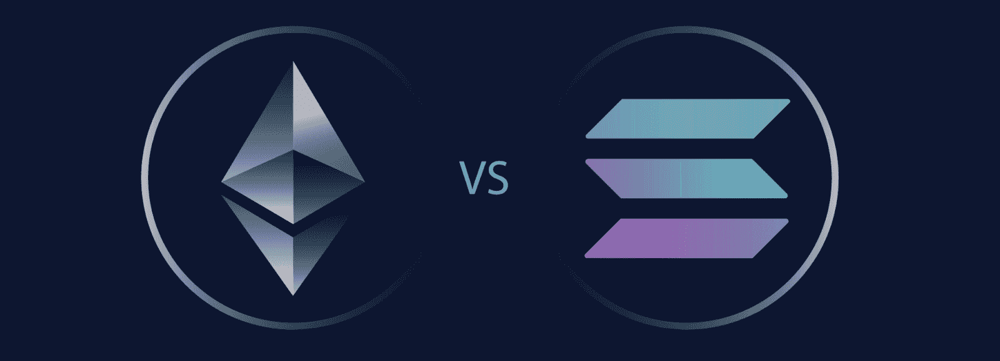
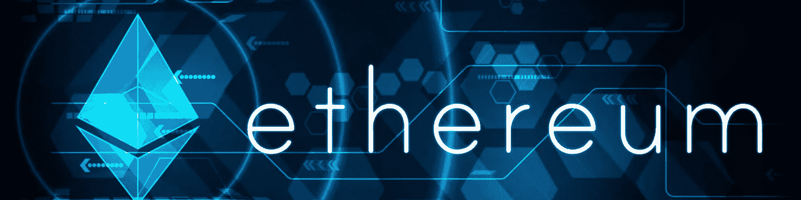
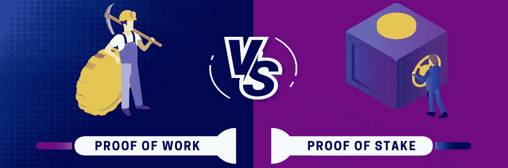
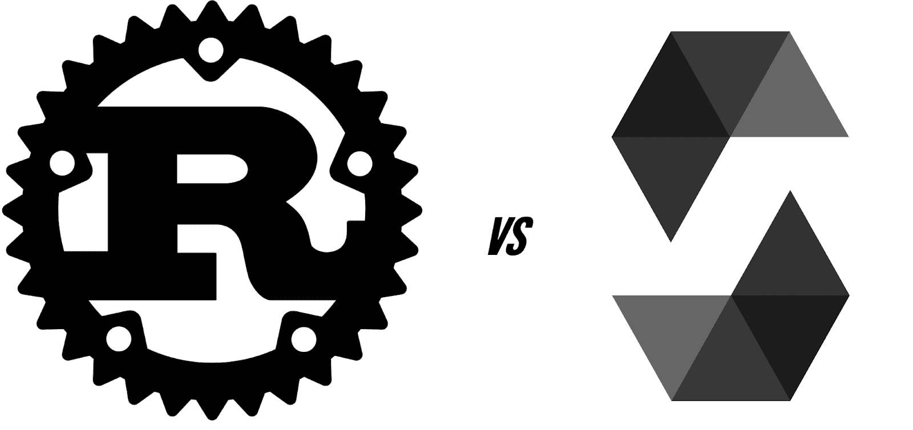

# SPL 与 ERC20 代币–比较索拉纳和以太坊代币

> 原文：<https://moralis.io/spl-vs-erc20-tokens-comparing-solana-and-ethereum-tokens/>

对于用户和开发者来说，可编程区块链的本地令牌在各自的生态系统中扮演着重要的角色。无论你是一个经验丰富的区块链程序员，想要利用一个新的链，还是渴望 [**成为一名 Web3 开发者**](https://moralis.io/how-to-become-a-web3-developer-full-guide/) **，你都需要了解各种区块链的令牌和标准，这样你就可以充分利用它们各自的优势和劣势。由于 Solana 和以太坊之间正在进行一场战斗，比较 Solana 和以太坊令牌(SPL 和 ERC20)可以让您很好地了解哪些资产可以让您的项目受益最多。那么，你准备好迎接 SPL 对 ERC20 的比赛了吗？在我们比较 SPL 和 ERC20 代币时，我们将在这里提供场边座位-让我们准备好欢呼吧！**

如果创建 SPL 或 ERC20 令牌是你的首要任务，这篇文章是一个很好的起点。随着我们向前推进，我们将首先介绍索拉纳和以太坊的基础知识，以确保我们都在同一页上。然后，我们将深入探讨 SPL 与 ERC20 令牌的比较。此外，由于 NFTs ( [不可替代令牌](https://moralis.io/non-fungible-tokens-explained-what-are-nfts/))继续风靡一时，我们将提到 SPL 和 ERC NFT 标准。尽管如此，您将学习创建可以利用 SPL 或 ERC 令牌的 [Web3](https://moralis.io/the-ultimate-guide-to-web3-what-is-web3/) 应用程序的最简单、最快的方法。感谢当前 [Web3 技术栈](https://moralis.io/exploring-the-web3-tech-stack-full-guide/)的巅峰——Moralis，你可以轻松处理链上数据。这个终极的 [Web3 后端平台](https://moralis.io/exploring-the-best-web3-backend-platform/)帮助你避免处理 RPC 节点的[限制。另外，你可以毫不费力地将区块链编入索引。因此，请务必今天就](https://moralis.io/exploring-the-limitations-of-rpc-nodes-and-the-solution-to-them/)[创建您的免费 Moralis 账户](https://admin.moralis.io/register)！

## 索拉纳是什么？

索拉纳在 2017 年复活了。它是由拉杰·戈卡尔和阿纳托利·亚科文科发起的，他们两人仍然和索拉纳有着密切的关系。亚科文科是索拉纳实验室的现任首席执行官，戈卡尔是其首席运营官。然而，这仍然没有涵盖索拉纳的全部范围。那么，[索拉纳是什么？](https://moralis.io/what-is-solana-the-full-2022-guide/)

Solana 是一个开源的、公共可编程的区块链，支持[智能合约](https://moralis.io/smart-contracts-explained-what-are-smart-contracts/)。您可能知道，智能合同是区块链开发的一个重要方面。他们是创造代币和链上交易自动化背后的“引擎”。此外，Solana 使开发人员能够创建可替换和不可替换的令牌以及各种 dapps(分散式应用程序)。此外，索拉纳有自己的本土硬币或代币。后者是“SOL”代码，有双重用途。首先，它提供网络安全，这是通过索拉纳的混合 [DeFi staking](https://moralis.io/what-is-defi-staking-full-guide/) consensus 实现的。第二，SOL 也是 Solana 链上转移价值的媒介。这包括支付交易费用，即众所周知的天然气。

当我们关注共识类型时，索拉纳被归类为利益证明(PoS)链，但也使用历史证明(PoH)共识。此外，索拉纳的理论吞吐量也相当可观。它应该每秒处理高达 65，000 个事务(TPS)，使其成为 Web3 领域中最快的链之一。除了速度，索拉纳还提供微薄的交易费。在大多数情况下，汽油费低于 1 美分。如果你经历过以太坊高昂的费用，你已经可以看到索拉纳的吸引力和核心优势。因此，速度和交易费在 SPL 与 ERC20 令牌的讨论中也起着至关重要的作用。尽管如此，我们必须指出，许多怀疑论者继续质疑索拉纳的分权水平。

*注* *:要进一步了解 Solana 及其 PoS/PoH 混合协议，请遵循“什么是 Solana？”上面的链接。*

## 以太坊是什么？

对于一个适当的 SPL 与 ERC20 代币的讨论，你还需要知道以太坊是什么。以太坊是第一个可编程链，于 2015 年推出。此外，以太坊仍然是部署加密令牌和 dapps 的最受欢迎的区块链网络。此外，就像所有可编程链一样，以太坊有自己的本机令牌或硬币。后者被称为 ETH(以太)。ETH 是市值第二大的加密货币，价值约为比特币市值的一半。

以太坊也是一个去中心化的公共分类账，验证并记录其网络上的交易(所有公共区块链都是如此)。此外，“[ethereum.org](http://ethereum.org/)”指出，以太坊为基本上任何能上网的人提供了开放的数字货币和数据友好服务。来自全球各地的用户可以访问这种社区构建的技术及其无数的应用程序。通过以太坊网络，用户可以使用[的 Web3 钱包](https://moralis.io/what-is-a-web3-wallet-web3-wallets-explained/)，如[的 MetaMask](https://moralis.io/metamask-explained-what-is-metamask/) ，发送本国的加密货币。此外，以太坊可以用来发送/接收其他 EVM 兼容的令牌。后者适用于拥有有效 ETH 地址的任何人。

今天，在以太坊上运行着各行各业无数的 Web3 应用程序。理论上，每个人都可以访问这些 dapps 没有审查或中央集权。然而，高昂的天然气费用限制了富裕用户和开发商的准入。高气的原因之一在于以太坊的工作验证(PoW)机制。此外，dapps 和令牌创建由以太坊上的智能合约提供支持。本质上，智能契约确保在满足某些预定义的条件时执行特定的操作。由于以太坊起步较早，它拥有广泛的全球社区，这赋予了整个网络价值。

*注* *:探索我们的向导解答* [*什么是以太坊？*](https://moralis.io/full-guide-what-is-ethereum/) *疑问。*

### 位置与功率

利益证明(PoS)和工作证明(PoW)是两种常见的共识协议。在 PoW 的情况下，节点的计算能力保证安全，并验证交易。另一方面，PoS 是基于标记令牌来完成的。因此，PoS 链上的本地代币的某些所有者需要将他们的硬币抵押给验证器，该验证器是计算机(节点)。在索拉纳的例子中，这些计算机运行索拉纳的软件及其最新版本的链的副本。反过来，PoS 的验证器相当于 PoW 链上的矿工。此外，PoS 验证器根据它们的定位细节添加下一个块。后者包括几个标准，尽管验证者持有令牌的数量和期限通常是最重要的输入。

也就是说，你可以看到 PoS 协议都是关于网络参与者的承诺水平。幸运的是，这种承诺是有回报的，所以通常有足够多的候选人来确保信誉良好的连锁店的安全和适当的机制。奖励的级别主要根据原生代币的数量和承诺期来确定。此外，在这两种类型的协议中，分散化的程度取决于验证者和挖掘者的分布程度。此外，对于 PoS 协议，桩循环供应的比率也起主要作用。因此，必须始终检查每个链的记号组学，以获得尽可能清晰的图像。

## SPL vs ERC20 代币

现在你们都知道以太坊和索拉纳是什么了，你们可以开始研究 SPL vs ERC20 代币了。所以，让我们从一些定义开始:

*   **ERC**——这个缩写代表“**以太坊请求**给**评论**”，这就是以太坊上标准的命名方式。而且以太坊标准正常是有编号的。毫无疑问，最常见的标准是 ERC20。后者围绕以太坊链顶端的令牌创建和处理。其他流行的标准集中在 NFTs 上——[ERC 721 令牌](https://moralis.io/erc-721-token-standard-how-to-transfer-erc721-tokens/)和 [ERC1155](https://moralis.io/erc1155-exploring-the-erc-1155-token-standard/) 。

*   **SPL**——这个缩写代表“**索拉纳程序库**”——索拉纳的链上程序集合。这些链上程序的目标是“海平面”并行运行时 Solana 的八项关键技术之一。此外，Solana 的“令牌计划”定义了区块链上可替换和不可替换令牌的一种常见实现。

以上两个定义为我们提供了 SPL 与 ERC20 令牌讨论的基础:

*   ERC 令牌是在以太坊链上创建的加密令牌。
*   SPL 令牌是在索拉纳链上创建的加密令牌。

当我们谈论 ERC20 令牌时，我们指的是以太坊上的可替换令牌。然而，就 SPL 代币而言，它们既包括可替代代币，也包括不可替代代币。因此，当我们想要更具体时，我们需要在“SPL 代币”前面包括“可替代的”或“不可替代的”。除了术语之外，主要的区别在于 SPL 代币存在于索拉纳上，而 ERC 代币存在于以太坊链上。因此，这些令牌的机制取决于相应链的机制。这也决定了如何存储和处理令牌以及如何创建它们。此外，它们需要不同类型的加密钱包和不同的编程语言。

## 处理 SPL vs ERC20 代币

除非你一直生活在岩石下，否则你一定听说过 MetaMask。后者是以太坊连锁店最受欢迎的热门加密钱包。因此，它本身支持以太坊主网和[以太坊测试网](https://moralis.io/ethereum-testnet-guide-connect-to-ethereum-testnets/)。此外，它还支持所有其他 EVM 兼容链(如 [BNB 链](https://moralis.io/how-to-create-a-bnb-chain-token-in-5-minutes/)、[雪崩](https://moralis.io/how-to-connect-to-avalanche-nodes/)、[多边形](https://moralis.io/how-to-create-a-polygon-token/)等)。)，用户可以将其添加到他们的元掩码钱包中。因此，元掩码是处理 ERC20 令牌的工具。然而，这个钱包不支持 SPL 代币。因此，要处理 SPL 代币，用户需要使用其他类型的 Web3 钱包。当然，有几种选择，但幻影钱包仍然是最受欢迎的选择。

如果用户和开发人员想要使用区块链，他们都需要掌握处理令牌的能力。然而，开发人员也需要学习如何创建它们。对于那些希望[成为区块链开发者](https://moralis.io/how-to-become-a-blockchain-developer/)的人来说，请继续阅读，因为我们决定也涵盖这一方面。

## 创建 SPL vs ERC20 令牌

创建 SPL vs ERC20 令牌是这两种令牌的主要区别。首先，如上所述，SPL 令牌包括可替换令牌和不可替换令牌。然而，当在以太坊上铸造代币时，开发人员必须注意使用适当类型的合同——对于可替代代币使用 [ERC20 合同](https://moralis.io/what-are-erc20-contracts-full-erc20-contract-guide/),对于非功能性交易使用 ERC1155 或 [ERC721 智能合同](https://moralis.io/erc721-contract-exploring-erc721-smart-contracts/)。

此外，在创建智能合同时，这两个链使用不同的编程语言。当创建以太坊和其他 EMV 兼容的智能合约时，开发人员需要学习[可靠性](https://moralis.io/solidity-explained-what-is-solidity/)。另一方面，Rust 是创建 Solana 智能合约的编程语言。因此，一个使用专门为以太坊开发创建的特殊编码语言，而另一个使用现有的编程语言。因此，如果你以前使用过 Rust，那么专注于 Solana 对你来说可能很有意义。然而，索拉纳 SPL CLI 工具使您能够创建令牌，而无需 Rust 编程。

接下来，我们鼓励你[创建自己的 ERC20 令牌](https://moralis.io/how-to-create-your-own-erc-20-token-in-10-minutes/)，然后创建[索拉纳令牌](https://moralis.io/how-to-create-a-solana-token-in-5-steps/)。因此，你会清楚地了解他们的不同之处。说到创建 SPL 代币，你可以从 5:48 开始使用下面的视频教程。此外，假设在完成“SPL vs ERC20 tokens”之旅后，你认为索拉纳是你的区块链。在这种情况下，下面的视频将非常有益于创建不仅仅是一个 Solana 令牌，而是一个 Solana 令牌仪表板！

https://www.youtube.com/watch?v=IsTFNOedPkk

## SPL 与 ERC20 代币–Solana 和以太坊代币对比–总结

至此，您知道 SPL 与 ERC20 令牌比较有许多细微差别。在某种程度上，这些代币有许多相似之处，因为它们都是加密货币。但是，由于它们是不同可编程区块链的本机令牌，因此在许多方面有所不同。例如，您需要不同的加密钱包来处理它们，并使用不同的编程语言来铸造它们。然而，在 SPL 对 ERC20 代币的讨论中也有一线希望。后者为您提供了全方位的工具，可以帮助您决定是创建 SPL 代币还是以太坊代币。当你决定创建用户可以利用这些代币的杀手级 dapps 时，你会看到 Moralis 的全部荣耀。例如，你可以[在几分钟内建立一个索拉纳令牌仪表板](https://moralis.io/how-to-build-a-solana-token-dashboard/)。

如果你想学习如何与 Moralis 合作，请访问 Moralis YouTube 频道和 T2 的 Moralis 博客。这些渠道提供了大量高质量的内容，包括无数的示例项目。一些最新的话题集中在如何[创建你自己的元宇宙](https://moralis.io/how-to-create-your-own-metaverse/)，如何[创建 BNB NFT](https://moralis.io/how-to-create-a-bnb-nft/) ，如何构建 P2E 游戏智能契约，如何构建 Uniswap DEX 克隆[，如何](https://moralis.io/build-a-uniswap-dex-clone-with-html-css-javascript-moralis-on-the-ethereum-network/)[获得区块链短信通知](https://moralis.io/how-to-get-blockchain-sms-notifications/)，如何[在你的网站上添加 Web3 连接钱包按钮](https://moralis.io/how-to-add-a-web3-connect-wallet-button-to-your-website/)，如何[获得免费的孟买 testnet MATIC 令牌](https://moralis.io/mumbai-testnet-faucet-how-to-get-free-testnet-matic-tokens/)，[最重要的是，我们鼓励你考虑报名参加 Moralis 学院。这样，你将能够通过专业等级的课程、专家指导和来自优秀社区的支持来提升你的区块链开发游戏。](https://moralis.io/what-are-nft-based-memberships-full-guide/)