# 同步和索引智能合同事件—完整指南

> 原文：<https://moralis.io/sync-and-index-smart-contract-events-full-guide/>

**同步和索引智能合约事件使区块链开发者能够使用公共链上数据。此外，您还可以将同步数据整合到您的 dApp(******)中，以触发特定功能或以用户友好的方式显示特定信息。此外，随着以太坊不断扩大其用户群并保持作为** [**智能合约**](https://moralis.io/smart-contracts-explained-what-are-smart-contracts/) **部署的领先链，专注于** [**以太坊开发**](https://moralis.io/ethereum-development-for-beginners/) **的 dApp 开发者将受益于了解如何同步和观看智能合约事件。因此，在这份完整的指南中，我们将帮助您提高编程技能，教您如何用 Moralis 同步和索引智能合约事件。完成后，您将能够利用 Moralis 的智能合同事件同步工具在新事件实时发生时立即获得通知！****

**此外，一个有抱负的区块链开发者倾向于避免使用智能合同；但是，您应该知道有几种工具可以使事情变得简单得多。首先，你可以使用 [OpenZeppelin](https://moralis.io/what-is-openzeppelin-the-ultimate-guide/) 来获得各种各样的智能合同模板。然后你可以使用 [Remix](https://moralis.io/remix-explained-what-is-remix/) 轻松部署它们。然而，为了同步和索引智能契约事件，Moralis 是程序员应该利用的最终工具。这个领先的 [Web3](https://moralis.io/the-ultimate-guide-to-web3-what-is-web3/) 开发平台，也被称为 [Firebase for crypto](https://moralis.io/firebase-for-crypto-the-best-blockchain-firebase-alternative/) ，自带 [ultimate Web3 SDK](https://moralis.io/exploring-moralis-sdk-the-ultimate-web3-sdk/) 和 [API](https://docs.moralis.io/moralis-server/web3-sdk/intro) ，包括[以太坊 API](https://moralis.io/ethereum-api-develop-ethereum-dapps-with-moralis/) 和 [NFT API](https://moralis.io/ultimate-nft-api-exploring-moralis-nft-api/) 。因此，它使您能够通过复制和粘贴来自 [Moralis 文档](https://docs.moralis.io/)的代码片段来处理所有与区块链相关的后端开发，而您则专注于创建最好的前端。此外，要使用 Moralis，你只需要精通 JavaScript。记住这一点，让我们在这里解决“用 Moralis 同步和索引智能合约事件”的问题。**

**

### 什么是智能合约事件？

在我们进一步了解如何使用 Moralis 同步和索引智能合同事件之前，我们希望确保大家都清楚地了解什么是[智能合同事件](https://docs.moralis.io/moralis-server/automatic-transaction-sync/smart-contract-events)。智能合约是一组特定的编码规则，一旦满足预定条件，这些规则就会执行预定义的操作。当考虑智能合约的这个简单定义时，逻辑上认为智能合约中会发生一些有意义的事情，或者我们应该说，基于它们的代码。因此，当智能契约中发生有意义的事情时，它被开发来发出事件。因此，智能合约事件本质上是向 dApps 或其他智能合约发出的信号，即合约正在向想要与它们通信的信号发出信号。当然，应该由智能合约的开发人员来定义事件何时发出。

例如，让我们看看 [ERC-20 令牌标准](https://moralis.io/erc20-exploring-the-erc-20-token-standard/)智能合约。每当有人发送一个 ERC-20 令牌，相关的合同将发出一个“转移”事件。此外，该事件将包含有关转移的所有细节。考虑到这一点，您可以想象在创建 dApps 时，能够实时监听智能合约事件是极其重要的。因此，我们来看一个示例任务，向您展示如何使用 Moralis 同步和索引智能合同事件。

## 使用 Moralis 同步和索引智能合同事件

我们相信学习的最好方法是向你展示它在实践中是如何工作的。因此，我们将承担一个示例项目，在该项目中，我们将为最受欢迎的 [NFT](https://moralis.io/non-fungible-tokens-explained-what-are-nfts/) 收藏之一——crypto 朋克同步和索引智能合约事件。我们的假设是，我们有一个分散的应用程序，我们希望实时跟踪所有 CryptoPunks 转账，并查看所有历史转账事件。然而，在我们能够用 Moralis 同步和索引智能合同事件之前，我们需要创建一个 Moralis 服务器。*要了解如何完成这个简单的设置，请使用下面的说明。*

### 如何创建 Moralis 服务器

要获得 Moralis 的完整后端功能，您需要创建一个 Moralis 服务器。后者对于同步和索引智能合约事件也是必不可少的。因此，下面是要遵循的步骤:

1.  [**创建一个免费的 Moralis 家账户**](https://admin.moralis.io/register)——点击链接创建你的免费 Moralis 家账户。只需输入您的电子邮件地址并创建您的密码。然后，通过确认您的帐户完成该过程(单击发送给您的电子邮件中的确认链接)。如果你已经有了你的 Moralis 账户，只需[登录](https://admin.moralis.io/login)。

[**创建一个 Moralis 服务器**](https://docs.moralis.io/moralis-server/getting-started/create-a-moralis-server)——登录后，您将进入您的 Moralis 管理区。从那里，选择“服务器”选项卡(如下图所示)。然后，点击右上角的“+创建新服务器”。接下来，从下拉菜单中选择网络类型。由于 CryptoPunks 是一个活项目，所以选择“Mainnet 服务器”选项。*然而，在处理示例项目时，我们建议选择“Testnet 服务器”选项(使用我们的* [*以太坊 testnet*](https://moralis.io/ethereum-testnet-guide-connect-to-ethereum-testnets/) *指南)*。

然后，将出现另一个弹出窗口，您需要输入您的服务器名称(这可以是您想要的任何名称)，选择区域、网络和链(CryptoPunks 在以太坊上)。最后，通过点击“添加实例”按钮启动您的服务器。 *T2】*

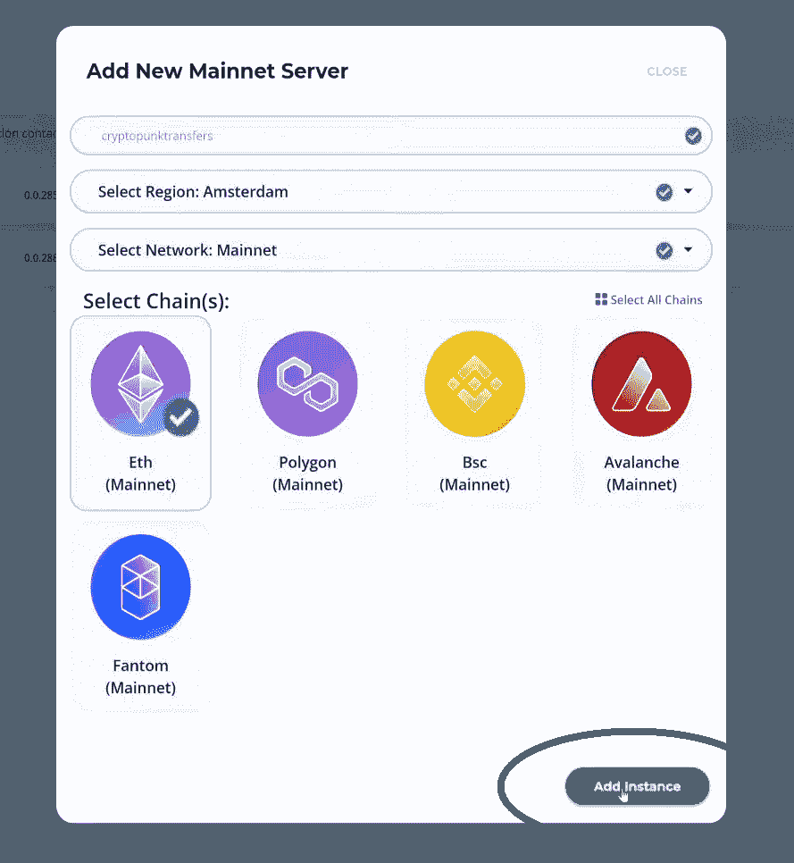

一旦你成功地创建了你的 Moralis 服务器，你就可以把事情带到另一个层次了。如果你想[构建你的第一个 dApp](https://moralis.io/build-your-first-dapp-ethereum-tutorial/) ，你需要获得你的服务器的详细信息。但是，在我们的例子中，我们不会创建任何 dApps。相反，我们将同步和索引智能合约事件。因此，我们需要进入“同步”选项卡。

## 同步和索引智能合同事件–示例项目

要使用 Moralis 同步和索引智能合同事件，请单击“查看详细信息”按钮:

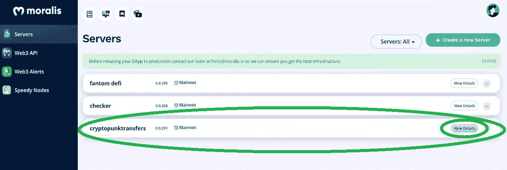

点击“查看详情”按钮后，将会出现一个弹出窗口。默认情况下，选择“Server Details”选项卡(这是创建 dApps 时获取服务器 URL 和应用程序 ID 的地方)。出于示例项目的目的，我们需要选择“Sync”选项卡，它位于最右侧:

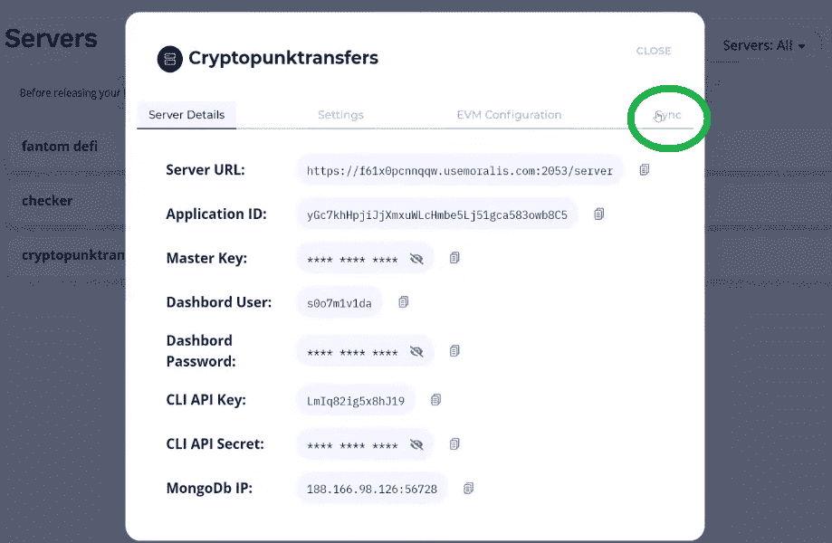

点击“同步”选项卡按钮后，您将看到下图所示的窗口。因为您刚刚创建了服务器，所以服务器上应该没有同步服务。要添加您的新同步服务，请点击“添加新同步”:

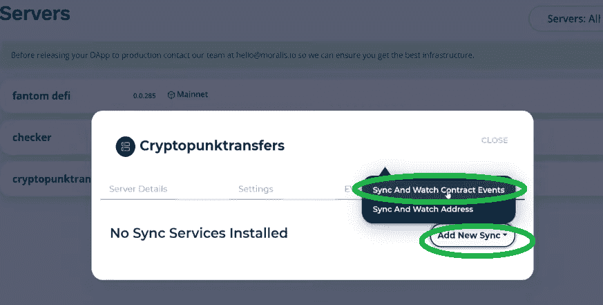

现在，一旦你点击“添加新的同步”按钮，两个选项将出现。确保选择顶部的一个–只需点击“同步和观察合同事件”选项。接下来，您将最终看到配置同步和索引智能合约事件的选项。配置过程简单；本质上，你只是复制和粘贴公开可用的链上数据。然而，由于这可能是您第一次处理链上数据，我们将一步一步地指导您完成这个过程，向您展示您可以从哪里获得我们的示例项目(CryptoPunks)所需的详细信息。

### 同步和索引智能合约事件–使用链上数据

您终于了解了我们示例项目的核心。通过正确完成这一步，您将能够为我们的 CryptoPunks 示例项目同步和索引智能合约事件。当然，您可以使用这个示例将相同的原则应用于任何其他智能合约。

此时，您应该在“同步”选项卡上，并准备在“配置同步和观察合同事件”下输入具体参数/详细信息:

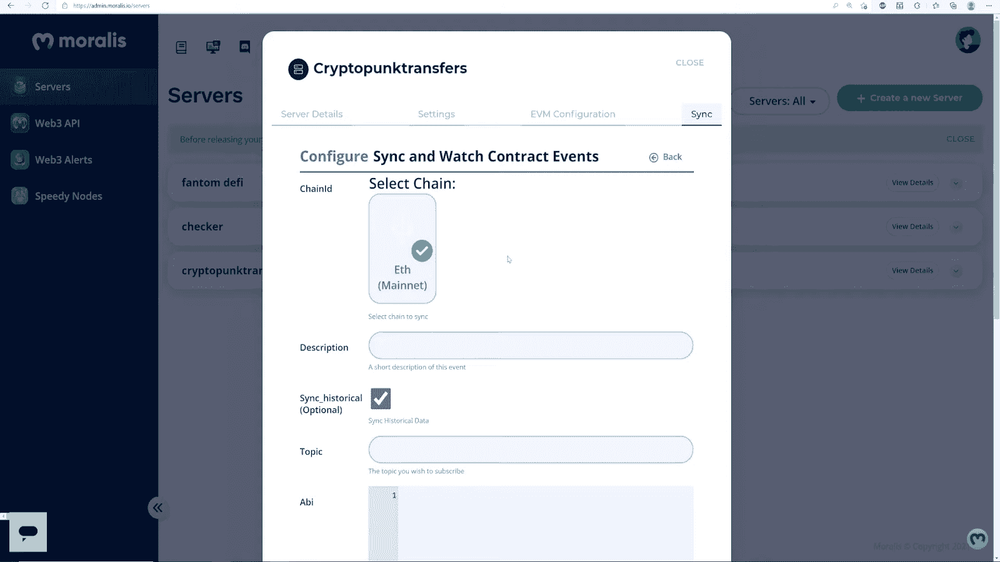

看上面的图像，你可以看到你首先需要选择适当的链。由于你在创建服务器时只选择了以太坊主网，这是你应该有的唯一选项。只需点击它，它会被标上一个绿色的勾号。说到描述，想怎么写就怎么写；然而，我们选择了“CryptoPunk Transfers”，所以请随意跟随我们的领导。

接下来，您需要单击/选中“Sync_historical”选项(默认情况下已经选中)。这样，只需一次点击，您就可以包括所有 CryptoPunk 传输的历史数据:

#### 使用以太扫描获取主题

就主题而言，你需要获得正确的细节。要为基于以太坊的项目做这件事，你必须去以太坊。使用搜索栏并输入“CryptoPunks”:

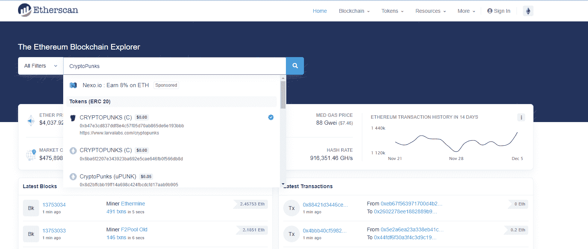

然后，单击“Transfers”选项卡上任何“Transfer Punk”方法上的任何交易散列，这将带您进入该交易的详细信息:

进入“交易详情”页面后，确保选择“日志”选项卡:

在那里你会看到“转账”和“PunkTransfer”的名字。而且，“PunkTransfer”才是我们感兴趣的。为了获得主题，我们使用“PunkTransfer”和括号内的详细信息(仅限类型):

当然，您需要将该主题输入到“同步”选项卡中的“配置同步和观察合同事件”下:

#### 使用以太网扫描获取 ABI

接下来，您需要在“Abi”字段中输入正确的 ABI。幸运的是，你也可以在 Etherscan 上找到它。要定位 ABI，你需要点击 CryptoPunks 的合同地址:

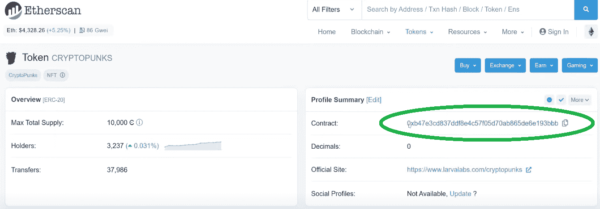

在下一页，向下滚动一点，点击“合同”选项卡:

进入“合同”选项卡页面后，确保您位于“代码”部分，然后再次向下滚动:

看到“契约 ABI”就停下来:

你可以看到一个相当长的数组。幸运的是，你只需要它的特定部分。要找到它，使用搜索选项并输入“PunkTransfer”。这将自动突出显示您感兴趣的 ABI 部分:

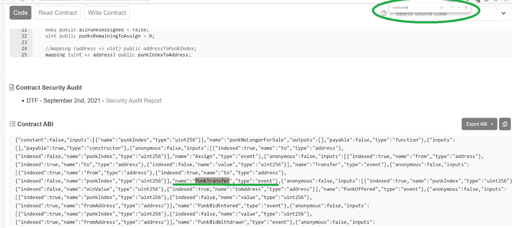

现在，复制包含突出显示的“PunkTransfer”的整个对象:

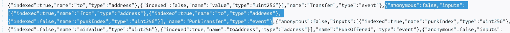

最后，将复制的对象(上面突出显示的)粘贴到“同步”标签的“Abi”部分:

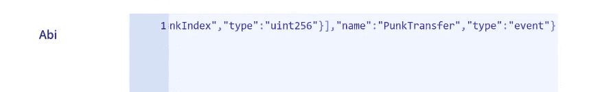

#### 使用以太网扫描获取合同地址

现在，您需要获得正确的合同地址。这是您在上一个步骤开始时单击的那个。但是，您也可以在以太网扫描的当前页面上找到它(如果您按照相应的步骤操作的话)——只需滚动到顶部即可。然后，单击旁边的“复制”图标:

接下来，将其粘贴到您的“同步”标签中:

表名是完成添加新同步所需的最后细节。在这里，你可以再次使用任何你想要的；然而，我们选择了“双关语”:

为了最终同步和索引我们的 CryptoPunks 示例的智能合约事件，请单击“Confirm”按钮。完成后，您的新同步和观看合同事件将在“同步”选项卡中列出:

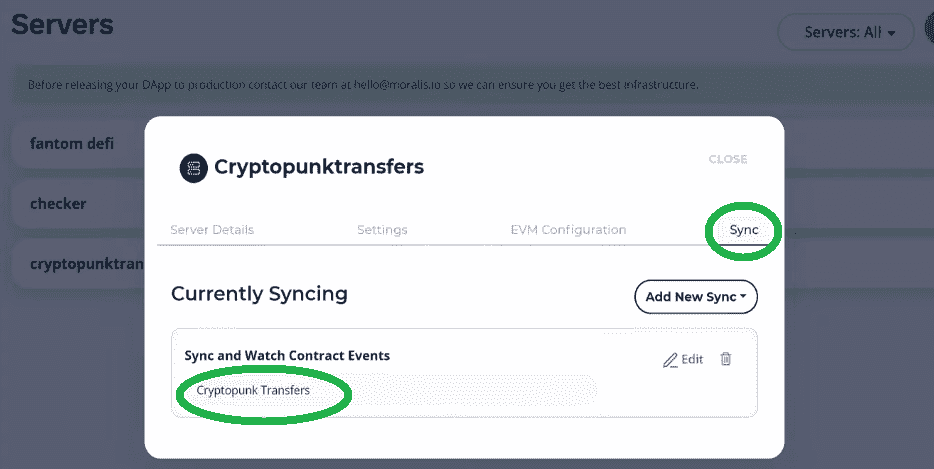

通过完成上述简单步骤，您已经使 Moralis 能够实时同步和索引所有 CryptoPunks 转账的智能合约事件，包括所有历史交易。

### 同步和索引智能合同事件，由您自行处理——Moralis 仪表盘

您可以很容易地访问在上一节中添加的同步所获得的详细信息，这些信息可以在您的 Moralis 仪表板中找到。从本质上讲，后者是每个 Moralis 服务器都有的数据库。此外，要访问您的仪表板，请单击“查看详情”按钮旁边的箭头图标，然后单击“仪表板”:

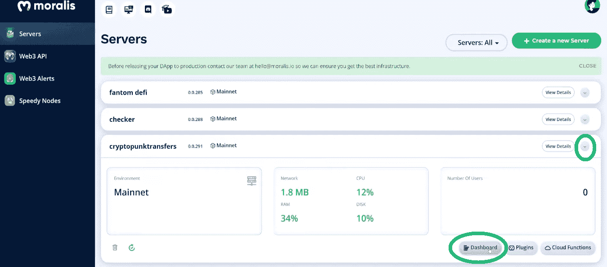

在您的仪表板中，现在您将看到“PunkTransfers”类，它是在您创建 sync:

在这个类中，你可以看到与 CryptoPunks 传输相关的所有细节，整齐地排列在列中。这意味着，如果您决定在 dApps 中使用这些数据，现在所有这些数据都可供您使用。此外，所有未来的交易也将实时添加到您的仪表板中。

尽管如此，如果你更喜欢视频，请务必观看下面的视频，其中 Moralis 的一位专家采取了与上述相同的步骤:

https://www.youtube.com/watch?v=LMqqxkuo7b0

## 同步和索引智能合约事件的完整指南—摘要

我们希望您已经完成了上述所有步骤，现在知道如何使用 Moralis 同步和索引智能合同事件。只需要几个简单的任务，从创建 Moralis 服务器和添加一个新的 sync 实例开始。此外，由于公开可用的链上数据，您可以使用 Etherscan 轻松获得所有需要的详细信息(当使用以太坊时)。此外，一旦正确设置了同步，您和您的 dApps 就可以在 Moralis dashboard 中使用所有数据。然而，这仅仅是开始；现在轮到你使用 Moralis 的力量和部署非凡的 dApps！

展望未来，如果你想进一步拓展你的区块链视野，我们建议你访问[Moralis 的 YouTube 频道](https://www.youtube.com/c/MoralisWeb3)和[Moralis 的博客](https://moralis.io/blog/)。在那里你会发现很多教育内容，包括多个范例项目。例如，你可以学习如何[构建一个去中心化的消息应用](https://moralis.io/build-a-decentralized-messaging-app-in-5-steps/)、[创建一个 OpenSea 克隆](https://moralis.io/create-an-opensea-clone-build-an-nft-marketplace-like-opensea/)、 [mint NFTs 无汽油费](https://moralis.io/how-to-mint-nfts-without-gas-fees/)，为 Web3 创建一个 [Reddit 克隆](https://moralis.io/create-a-reddit-clone-for-web3-step-by-step-guide/)，如何[用一行代码发送以太坊交易](https://moralis.io/ethereum-send-transaction-basics-send-ethereum-with-one-line-of-code/)，熟悉终极[以太坊 iOS 开发工具包](https://moralis.io/the-ultimate-ethereum-ios-dev-kit/)，学习使用终极 [Web3 样板](https://moralis.io/web3-boilerplate-beginners-guide-to-web3/)等等

另一方面，如果你还不精通 JavaScript，并且想成为全职的加密专家，一定要访问 [Moralis Academy](https://academy.moralis.io/) 。

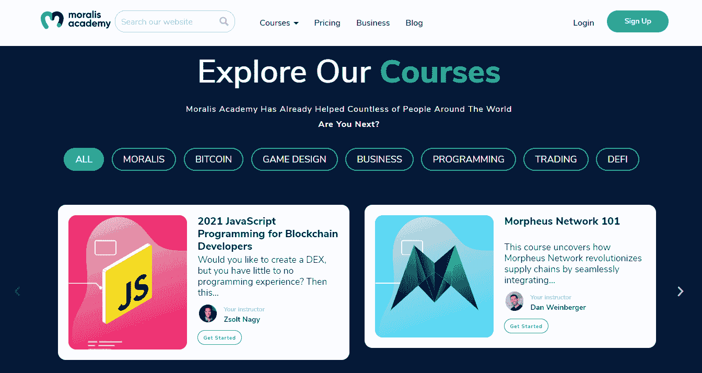**