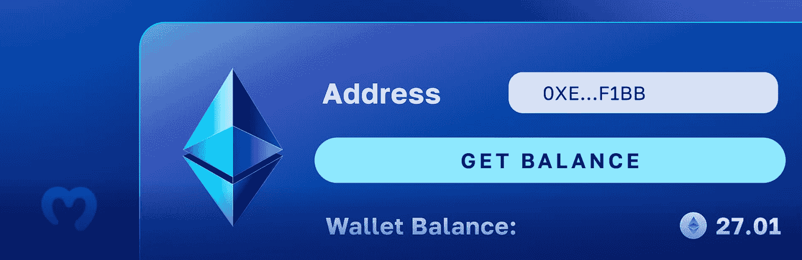
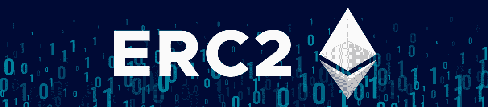
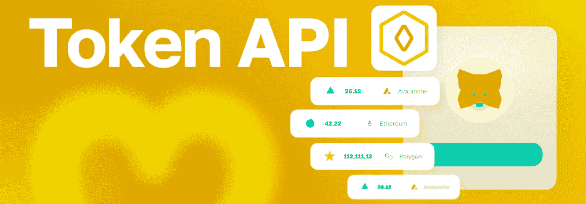
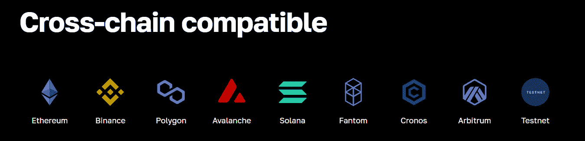

# Dapp 开发的最佳 ERC20 令牌平衡 API

> 原文：<https://moralis.io/the-best-erc20-token-balance-api-for-dapp-development/>

一个可靠的 ERC20 令牌平衡 API 是每个区块链开发者必须使用的工具。你在寻找这样的工具吗？不要再看了！借助 Moralis 的 ERC20 令牌平衡 API 端点，您可以使用一小段代码[获得钱包的本机加密平衡](https://moralis.io/get-wallet-balance-how-to-get-wallets-native-crypto-balance/):

```js
const response = await Moralis.EvmApi.balance.getNativeBalance(options)
```

此外，通过以下端点，您可以获得令牌余额:

```js
const response = await Moralis.EvmApi.token.getWalletTokenBalances(options)
```

如果您以前使用过 Moralis，那么您会确切地知道如何实现上面的代码行来充分利用 [best token API](https://moralis.io/token-api/) 。然而，如果这是你第一次听说市场上领先的 [Web3 提供商](https://moralis.io/web3-provider-why-blockchain-developers-should-use-one/)，创建你的免费 Moralis 账户，并跟随我们学习今天的教程。

[**Sign Up with Moralis**](https://admin.moralis.io/register)

### 概观

一旦你学会了如何充分利用 Moralis 的 ERC20 令牌平衡 API，你将有无数的机会，今天的文章将帮助你自信地开始。



接下来，我们将首先确保你们都知道什么是用于 ERC20 令牌的 API。接下来，我们将解释这个工具是如何有用的。然后，我们将适当地向您介绍由 Moralis 的 Token API 为您带来的最佳 ERC20 token balance API。最后但同样重要的是，我们将带您完成一个简单的示例项目，您将有机会使用上述令牌 API 端点之一。此外，通过跟随我们的领导，你也可以创建一个简单的 dapp。



## ERC20 令牌平衡 API–它是什么？

ERC20 令牌 API 是一个特定的 Web3 API，它围绕着关于 ERC20 令牌的链上数据。您可能知道“应用程序编程接口”(API)已经成为遗留开发领域的重要组成部分。毕竟，API 通过翻译相关理解的指令来促进不同软件之间的通信。此外，API 支持在安全和受控的开发环境中进行可靠的编程。类似地，除了 crypto，Web3 APIs 做同样的事情。因此，Web3 APIs 促进了区块链节点和分布式应用程序(dapps)后端之间的通信。本质上，Web3 APIs 使区块链开发者能够构建 dapps！

此外，大多数可替换令牌位于以太坊网络上，在那里它们遵循 ERC20 标准。这就是代币得名的原因。另外值得注意的是，ERC20 是“以太坊征求意见稿 20”的简称。该意见/提案已于 2015 年底提交并被接受。自其实现以来，所有在以太坊上铸造的可替换令牌都具有与以太坊(以太坊的本地令牌)完全相同的基本特性。所有 ERC20 令牌都是使用 ERC20 智能合约创建的。铸造后，令牌的智能合约地址存储所有令牌。然而，随着代币的分发，其他区块链地址或 Web3 钱包也会卷入其中。这就是为什么一个合适的 ERC20 令牌余额 API 发挥着重要作用——它有助于毫不费力地获取这些余额。


## 显示 ERC20 令牌余额的 API 有什么用？

就像 ERC20 令牌可以服务于许多不同的目的一样，显示 ERC20 令牌余额的 API 也可以。基本上，当您希望 dapp 在后端显示或利用 ERC20 天平时，可以使用这种 API。如果涉及到 ERC20 令牌，无论是作为公用设施令牌、治理令牌还是货币，一个可靠的 ERC20 令牌余额 API 都会让您的生活变得简单很多。使用这个工具，您可以获取关于可替换令牌的链上细节，并使用可用的数据来触发特定的功能。此外，在更高级和复杂的功能中，令牌 API 允许您为 dapp 的用户显示 ERC20 余额。

因此，无论何时你决定在以太坊或其他 EVM 兼容链上构建 dapp，一个可靠的令牌 API 应该在你的工具箱中。有了它，你甚至可以毫不费力地构建 DeFi 平台或在 Web3 游戏中加入 ERC20 令牌。尽管如此，高质量的 API 也能让您节省大量的时间和资源。毕竟，您不用构建自己的基础设施，只需使用简介中介绍的代码片段。



## 介绍最佳的 ERC20 令牌平衡 API

至此，您已经知道 Moralis 为您带来了最好的 ERC20 令牌平衡 API。然而，令牌 API 只是这个企业级 Web3 API 提供商提供的众多产品之一。当您将它与 [Auth API](https://moralis.io/authentication/) 、 [Streams API](https://moralis.io/streams/) 和 [NFT API](https://moralis.io/nft-api/) 结合起来时，您可以轻松地创建任何类型的 dapp。此外，Moralis 是 Web2-Web3 的桥梁，使您能够使用您喜欢的遗留开发平台、编程语言和框架来加入 Web3 革命。此外，您可以使用 Moralis 的跨平台互操作性来创建多链 dapps。毕竟，Moralis 支持所有领先的可编程区块链。因此，一定要探索 Moralis 力量的全部范围。



然而，让我们回到令牌 API。它使您能够以直接的方式将实时令牌数据集成到 dapp 中。此外，它不仅可以帮助您获取代币余额，还可以获取代币价格、所有权，并在所有支持的区块链之间传输数据。为了使这一切尽可能简单，令牌 API 提供了许多端点，您可以在[令牌 API 文档](https://docs.moralis.io/docs/token-api)中探索这些端点。然而，在本文中，我们将重点关注“ *getWalletTokenBalances* ”和“*getnativebalances*”端点。毕竟，他们是本文开头介绍的代码行的关键角色。

### “ *getWalletTokenBalances* ”端点

“ *getWalletTokenBalances* ”端点是轻松获取钱包令牌余额的关键，也是 Moralis er C20 令牌余额 API 的重要组成部分。因此，我们应该仔细看看[通过钱包获得平衡文档页面](https://docs.moralis.io/reference/getwallettokenbalances):


从上面可以看到，这个端点需要“ ***地址*** ”参数来让函数知道关注哪个地址。此外，当使用“ *getWalletTokenBalances* 获取令牌余额时，您可以包括其他可选参数:

*   *"-连锁查询。*
*   *" ***子域***"–在选择本地开发/测试链时使用它。*
*   *"***to _ block***"-使您能够检查过去块的余额。*
*   *"***token _ addresses***"–此参数允许您将结果过滤到特定的地址列表中。*

*Moralis 的 API 参考文档页面允许您测试端点。所以，如果你再看一下上面的截图，可以看到你只需要粘贴一个你想查询的地址就可以了。然后，选择你喜欢的编程语言，点击“试试看！”按钮。然而，您可以简单地从“请求”部分复制代码片段，并将其粘贴到您的脚本中。然后，您使用“ *getWalletTokenBalances* ”端点为您的 dapps 获取特定钱包地址的 ERC20 令牌的[余额。](https://moralis.io/balance-of-erc20-how-to-get-balance-of-an-erc20-token-from-address/)*

### *“ *getNativeBalance* 端点*

*如果您注意了简介中提供的代码片段，您可能会注意到" *getNativeBalance* "端点在技术上是 Balance API 的一部分。然而，因为这是您想要用来获得 ERC20 令牌库的[本地余额的端点，所以它值得我们注意。另外，它是我们将在接下来的教程中使用的端点。也就是说，请务必访问](https://docs.moralis.io/docs/how-to-get-the-native-balance-of-a-smart-contract-vault)[“getNativeBalance”端点的文档页面](https://docs.moralis.io/reference/getnativebalance):*

*

就像“ *getWalletTokenBalances* ”一样，“*getnativebalances*也需要“ ***地址*** ”参数。此外，它接受以下三个可选参数:

*   *"-连锁查询。*
*   *"***provider Url***"–使用本地开发链时，您可以使用此参数来确定 Web3 提供程序 URL。*
*   *"***to _ block***"-使您能够检查过去块的余额。*

## *使用 Moralis 的 API 获取 ERC20 令牌的余额*

*至此，您已经对最好的 ERC20 令牌平衡 API 有了足够的了解，可以看到它的实际应用。因此，我们邀请您卷起袖子，跟随我们完成这三个步骤:*

**   创建 NodeJS 后端 Dapp*   初始化 Moralis*   创建一个 ReactJS 前端 Dapp*

*通过完成以上三个步骤，您将拥有自己的“获取钱包本机余额”示例 dapp 的实例:*

*

上面的截图显示了你将要构建的要点。但是，如果您想要更详细的演示，请确保使用本文底部的视频(0:15)。

### 创建 NodeJS 后端 Dapp 步骤 1

如果这是您第一次创建 NodeJS 应用程序，请确保按照 Moralis 文档中的“ [NodeJS](https://docs.moralis.io/docs/nodejs-dapp-from-scratch) ”页面完成初始设置。后者将向您展示如何正确安装所需的依赖项，以及如何设置和运行 Express 服务器。

一旦准备好 NodeJS 应用程序并在 Express 服务器上运行，就可以专注于创建“index.js”脚本了。在那里，您将使用最好的 ERC20 令牌平衡 API。首先在文件顶部定义所需的常数:

```js
const express = require("express");
const Moralis = require("moralis").default;
const app = express();
const cors = require("cors");
const port = 3000;
```

此外，确保您的 dapp 使用“ *cors* 和“ *express* ”:

```js
app.use(cors());
app.use(express.json());
```

有了上面几行代码，就可以创建“ *get* ”端点到“ *balance* ”路由。通过一个简单的“ *if-else* ”语句，您可以确保“ *getNativeBalance* ”端点接受其参数。最后，您需要用下面几行代码扩展“index.js”文件:

```js
app.get("/balance", async (req, res) => {
  try {
    const { query } = req;
    let balance;

    if (query.toBlock) {
      balance = await Moralis.EvmApi.balance.getNativeBalance({
        address: query.address,
        chain: query.chain,
        toBlock: query.toBlock
      });
    }else{
      balance = await Moralis.EvmApi.balance.getNativeBalance({
        address: query.address,
        chain: query.chain,
      });
    }

    const result = balance.raw;

    return res.status(200).json({ result });
  } catch (e) {
    console.log(e);
    console.log("something went wrong");
    return res.status(400).json();
  }
});
```

上面的代码将使您的 NodeJS dapp 能够从输入字段中查询详细信息。一旦你将它链接到你的前端，这将正确运行，在那里你将创建“*获得平衡*按钮。

### 初始化 Moralis——步骤 2

要初始化 Moralis，您需要用下面几行填充上面创建的“index.js”脚本:

```js
Moralis.start({
  apiKey: "MORALIS_API_KEY",
}).then(() => {
  app.listen(port, () => {
    console.log(`Listening for API Calls`);
  });
});
```

如您所见，占位符“ *MORALIS_API_KEY* ”在上面的代码中。因此，要使用 Moralis 的 ERC20 令牌平衡 API，您需要用实际的 Web3 API 密钥替换它。一旦你有了免费的 Moralis 账户，你就可以在你的管理区点击两下获得你的 Web3 API 密钥:


*注:完整的“* [index.js](https://github.com/MoralisWeb3/youtube-tutorials/blob/main/GetBalance/api/index.js) *”脚本在 GitHub 等着你。*

### 创建 ReactJS 前端 Dapp–步骤 3

您可能有创建 ReactJS 应用程序的经验，并且完全有能力自己创建上面演示的前端。然而，您可以通过使用我们的 [GitHub](https://github.com/MoralisWeb3/youtube-tutorials/tree/main/GetBalance/app) repo 来节省一些时间。尽管如此，让我们看看 dapp 前端的核心功能——编码在“ [App.js](https://github.com/MoralisWeb3/youtube-tutorials/blob/main/GetBalance/app/src/App.js) 脚本中。以下是由“获取余额”按钮触发的“*获取余额*功能的详细信息:

```js
async function fetchBalance() {

    let res;

    if(toBlock){
      res = await axios.get(`http://localhost:3000/balance`, {
        params: { address: address, chain: chain, toBlock: toBlock },
      });
    }else{
      res = await axios.get(`http://localhost:3000/balance`, {
        params: { address: address, chain: chain },
      });
    }

    console.log(res);

    setBalance((res.data.result.balance / 1E18).toFixed(2))
  }
```

上面的代码行向您展示了我们的 dapp 为我们的后端提供了必需的和可选的参数。此外，它采用原始余额，其中包括 18 位小数，并将其四舍五入到两位小数。

如果你想要更详细的指导，使用下面的视频。除了演示“获取钱包原生余额”dapp 之外，它还指导您完成其他核心脚本:

*   3:54–核心后端脚本(“index.js”)的详细信息
*   5:24-“app . js”脚本

有了这个 dapp 示例，我们鼓励您尝试使用不同的钱包地址和链。此外，还可以使用不同的块号随意查看过去的余额。此外，您可能也愿意使用上面提供的脚本来运行“ *getWalletTokenBalances* ”。为此，您需要用“*token . getwallettokenbalances*替换“*balance . getnativebalances*”。

最后，这里是视频教程的所有细节:

[https://www.youtube.com/embed/sL5t07JE0aE?feature=oembed](https://www.youtube.com/embed/sL5t07JE0aE?feature=oembed)

## Dapp 开发的最佳 ERC20 令牌平衡 API 总结

在今天的文章中，您了解了用于 dapp 开发的最佳 ERC20 令牌平衡 API 是什么，以及如何使用它。因此，您现在知道这个优秀的工具来自 Moralis 的 Token API 和 Balance API。您还有机会按照我们的步骤完成一个获取本机令牌余额的示例 dapp。通过对代码进行一些小的调整，这个相同的 dapp 可以用于获取 ERC20 令牌余额。此外，如果您学习了今天的教程，您就学会了如何获得 Web3 API 密钥。因此，您现在可以利用 Moralis 的其他 Web3 APIs 了。

我们相信在行动中学习。因此，我们建议您集中精力完成尽可能多的教程，这些教程在[Moralis 文件](https://docs.moralis.io/docs)中等待着您。此外，一定要继续你的免费区块链发展教育，探索[Moralis YouTube 频道](https://www.youtube.com/c/MoralisWeb3)和我们的[加密博客](https://moralis.io/blog/)。这两个出口涵盖了广泛的有用的话题。例如，一些最新的文章关注于 [Web3 AWS Lambda](https://moralis.io/web3-aws-lambda-use-aws-for-web3-with-an-aws-lambda-web3-provider/) 、 [Python Web3 开发](https://moralis.io/web3-python-python-web3-development-made-easy/)、 [NFT 元数据](https://moralis.io/nft-metadata-exploring-metadata-for-nft-storage/)、[区块链基础设施](https://moralis.io/blockchain-infrastructure-the-tech-and-landscape-empowering-developers/)等等。尽管如此，你也可以通过完成[Moralis 学院](https://academy.moralis.io/)提供的课程获得区块链认证。为了更好地理解可编程链，你可以从[以太坊基础](https://academy.moralis.io/courses/ethereum-101)开始。**