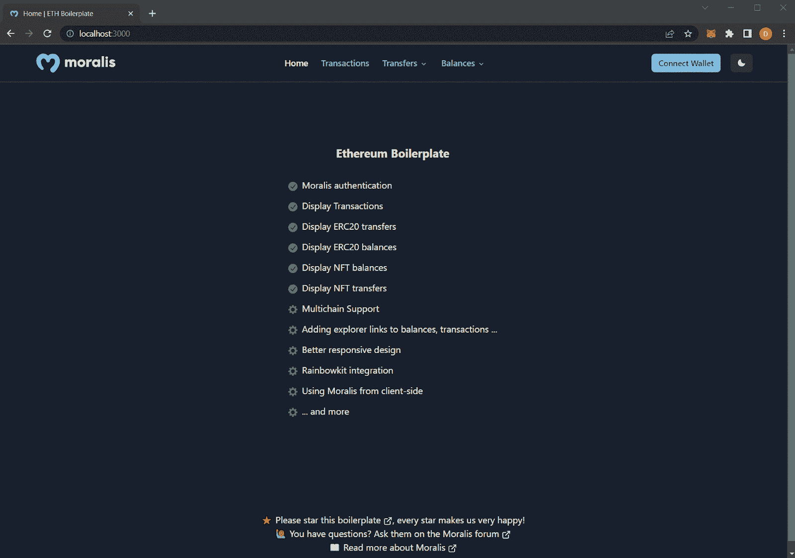
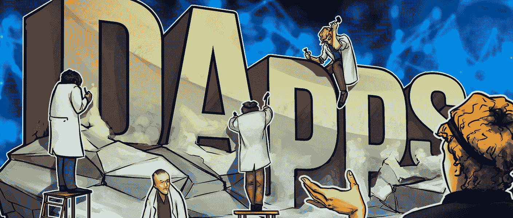
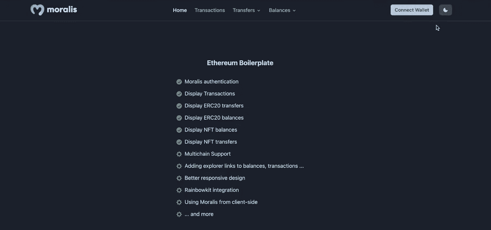
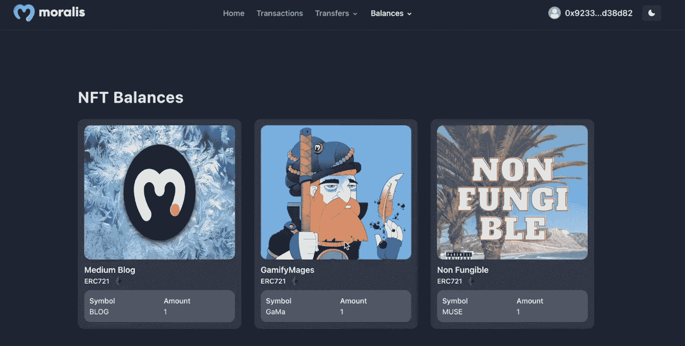
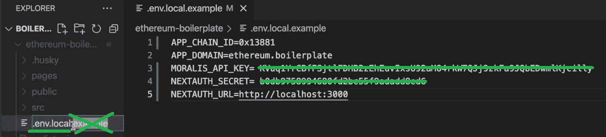
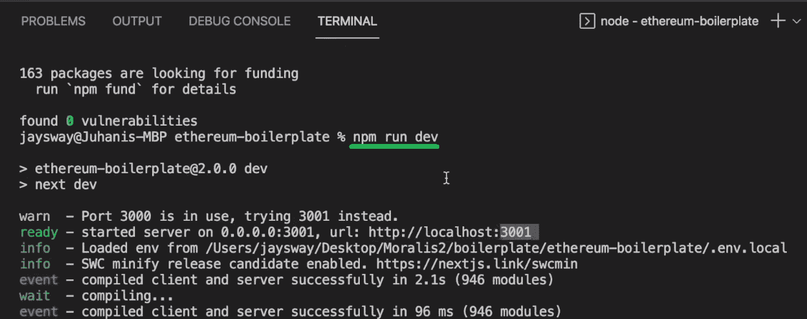

# 构建 Dapps 最简单的方法——面向开发人员的 3 步教程

> 原文：<https://moralis.io/the-easiest-way-to-build-dapps-3-step-tutorial-for-devs/>

在本文中，我们概述了构建 dapp 的具体步骤。现在，如果你已经精通 JavaScript，你可以开始在 GitHub 上使用 Moralis(领先的[企业级 Web3 API](http://moralis.io) 提供商)和我们的 [Web3 网站模板。此外，您基本上可以完成本文的项目，并通过以下三个步骤探索构建 dapps 的最简单方法:](https://moralis.io/web3-template-build-a-dapp-using-a-web3-website-template/)

1.  **克隆我们的** [以太坊样板代码](https://github.com/ethereum-boilerplate/ethereum-boilerplate)
2.  **使用简单的命令安装依赖项(更多信息见下文)**
3.  **运行您的 dapp**

通过使用我们的模板，您将探索构建 dapps 的最简单方法，并且您的应用程序将默认实现以下特性:

✅ **Web3 认证**–默认情况下集成了元掩码功能。但是，您可以轻松实现其他身份验证方法。

✅ **钱包交易**–完成的 dapp 将有一个页面显示连接的钱包的交易。

✅ **令牌传输**–显示来自已连接钱包的令牌传输，如 ERC-20 和 NFTs。

✅ **跨链支持**–使用 Moralis 时，您可以调整特定参数并连接到任何支持的 EVM 兼容区块链。

✅ **和更多**——moralis 的开发团队一直在改进样板文件，新的功能正在开发中！

然而，如果你只是一个有抱负的开发人员，我们建议按照我们的指示，在最后观看视频。因此，您将看到如何轻松地构建 dapps。接下来，我们将首先确保您知道 dapps 是什么。然后，我们将探索以太坊样板和 Moralis。有了这些基础知识，您就可以为今天的演示项目做好准备了。然后，我们将指导您完成简单的三步过程，展示构建 dapps 的最简单方法。

您还将获得 Web3 API 密钥——使用 Moralis API 的门户。此外，由于 Moralis 的跨链互操作性，您将看到如何关注其他 EVM 兼容链。因此，[创建您的免费 Moralis 账户](https://admin.moralis.io/register),跟随我们的脚步。

[**Sign Up for Moralis Magazine**](https://admin.moralis.io/register) 

## 分散式应用——它们是什么？

因为我们会广泛使用“dapp”和“dapps”这两个词，所以你知道 dapps 实际上是什么是很重要的。Dapps 是“分散应用”的简称。但是到底什么是去中心化应用呢？嗯，如果你了解区块链理工的基础知识，你就会知道分散化是这个游戏的名字。当然，各个链的去中心化程度不同。然而，它们都是由分布式节点供电和管理的。

此外，随着以太坊(第一个可编程链)的诞生，软件获得了部署到区块链网络的能力。我们知道这些软件被称为“智能合同”。区块链开发中的这一进步使开发人员能够开始创建以某种方式与区块链交互的应用程序。当然，这是几年前的事了。因此，在那时，开发人员在创建 Web3 应用程序时必须处理 RPC 节点的所有限制——在开发人员发现构建 dapps 的最简单方法之前的时代。

今天，我们使用术语“dapps”来描述所有的网络和移动应用程序，这些应用程序以某种方式使用户能够与一个或多个区块链交互。因此，dapps 需要为用户提供一种建立这些联系的方式。这是使用 Web3 钱包完成的，其中 MetaMask 仍然是领先的解决方案。因此，学习如何为 dapps 配备这些 [Web3 身份验证](https://moralis.io/authentication/)功能非常重要。幸运的是，多亏了 Moralis 的 Auth API，缺省情况下实现了 Web3 身份验证。

然而，值得指出的是，大多数 dapps 实际上是某种 Web2-Web3 的混合体。毕竟，不是所有的数据都需要存储在链上。这也意味着有无数的机会。例如，你可以使用任何现有的 Web2 应用程序，并为其添加某些 Web3 功能。

## **如何以最简单的方式构建 Dapps**

如上所述，Moralis 是最终的 Web3 API 提供者。它致力于为遗留开发者提供工具，帮助他们尽可能少地参与 Web3 革命。Moralis 通过提供三个核心解决方案来实现这一目标——授权 API、EVM API 和流 API。

Moralis Auth API 使您能够轻松实现各种 Web3 身份验证方法。Moralis 的 [EVM API](https://moralis.io/evm-api/) 用单行代码从以太坊或其他 EVM 兼容的链中获取各种链上数据。此外，Moralis 的 [Streams API](https://moralis.io/streams/) 使您能够毫不费力地使用 webhooks 来监听区块链账户和智能合约事件，并根据特定操作同步您的 dapps。

此外，Moralis 还提供了先进的 Solana API。因此，你甚至可以处理这个流行的非 EVM 兼容链。除了具有跨链互操作性，Moralis 还具有跨平台互操作性。因此，你可以在不同的 Web2 开发平台和编程语言上使用 Moralis 的 API。

此外，我们的以太坊样板可以作为一种 Web3 网站模板，帮助你快速入门。结合 Moralis，这个样板文件形成了构建 dapps 的最简单的方法。当使用这种捷径时，你可以避免处理任何潜在的障碍。因此，这是让您的 MVP(最小可行产品)尽可能快地启动和运行的好方法。尽管我们之前展示了 ultimate Ethereum 样板文件的一些核心特性，但让我们再简单地看一下:

*   **Web3 认证**–用户连接 Web3 钱包的简单方式。
*   **交易**–显示已连接钱包交易的页面。
*   **转账**–显示已连接钱包的 ERC-20 或 NFT 转账的页面。
*   **余额**–显示联网钱包的 ERC-20 或 NFT 余额的页面。

尽管如此，该模板还包括多链支持和改进的响应式设计。

## **构建 Dapps 的最简单方法——演示项目**

如前所述，我们想快速演示一下我们的示例 dapp。因此，让我们看看样板文件 dapp 的主页:

在上面的截图中，你可以看到我们 dapp 的要点，它包括一个顶部菜单栏。后者以最左边的一个标志开始，接着是“主页”、“交易”、“转账”和“余额”选项。右上角还有“连接钱包”按钮和暗光主题开关:

此外，你可能已经猜到了，用户必须点击“连接钱包”按钮来完成他们的 Web3 认证。下面是一个用户选择使用元掩码连接的示例:

查看上面的截图，可以看到用户的 MetaMask 扩展提示签名请求。因此，用户只需要点击“签名”按钮来连接他们的钱包。通过这样做，用户可以在认证之前“连接钱包”按钮所在的位置看到他们的钱包地址:

此外，经过身份验证的用户可以通过“交易”顶部菜单选项查看他们的交易:

此外，用户还可以探索他们的 ERC 20 或 NFT 转移。他们通过选择“Transfers”选项时出现的下拉菜单来完成此操作:

例如，如果用户决定查看 NFT 转账，他们会看到以下表格中的详细信息:

尽管如此，用户也可以查看他们的 ERC-20 和 NFT 余额。要选择他们想要关注的代币类型，他们必须使用下拉菜单，该菜单在选择“余额”选项时出现:

如果用户选择查看他们的 ERC-20 余额，他们将看到这样的表格:

此外，如果用户决定查看他们的 NFT 余额，他们将以以下方式查看:

### **构建 Dapps 的最简单方法——逐步说明**

既然您已经看到了我们的样板文件，您可能已经迫不及待地想探索并使用最简单的方法来构建 dapps 了。所以，从访问 [GitHub](https://github.com/ethereum-boilerplate/ethereum-boilerplate) 上的以太坊样板回购开始吧。你可以通过使用“GitHub”链接或者在谷歌上查询“以太坊样板文件”来实现:

一旦进入“以太坊-样板”页面，克隆代码:

接下来，创建一个文件夹(在我们的例子中是“样板文件”)，并在 Visual Studio 代码(VSC)中打开它。然后，用 VSC 的终端克隆代码。为此，您需要使用" *git clone* "命令，后跟上面复制的 URL:

成功克隆代码后，将 *cd* 放入“以太坊-样板”文件夹:

我们现在已经到了构建 dapps 时最重要的部分——调整“. env.local.example”文件。如需更详细的指导，请使用下面的视频，从 3:20 开始。您需要用环境变量值填充该文件:

看上面的截图，你可以看到顶部的变量定义了你要关注的链。默认情况下，我们的样板文件以以太坊( *0x1* )为目标，因此得名“以太坊样板文件”。但是，您可以选择将 dapp 连接到其他[支持的 EVM 兼容链](https://docs.moralis.io/reference/supported-chains-evm)。例如，我们的内部专家在视频教程中关注多边形测试网( *0x13881* )。

在决定要连接到哪个链并输入相应的链 ID 之后，您需要输入其他值。关于“ *NEXTAUTH_SECRET* ”和“ *NEXTAUTH_URL* ”值的说明在模板的“. env.local.example”文件中提供。因此，获取这些值应该没有问题。另一方面，您可能需要一些帮助来获得您的 Moralis Web3 API 密钥。下面一节我们来简单看一下如何获得这个密钥！

#### **分两步获得您的 Web3 API 密钥**

一个活跃的 Moralis 帐户是获得 Moralis Web3 API 密钥的唯一先决条件。因此，请使用简介中的“创建您的免费 Moralis 帐户”链接，或点击 Moralis 主页上的“[免费开始](https://admin.moralis.io/register)”按钮:

随着您的帐户启动和运行，您可以访问您的管理区。然后，您将能够通过完成以下两个步骤来获得 Web3 API 密钥，如下图所示:

然后返回到您的" . env.local.example "文件，将您的 API 键粘贴到" *MORALIS_API_KEY* "旁边，同时替换占位符内容。设置好所有值后，还要将" . env.local.example "重命名为" . env.local ":

接下来，使用“ *yarn* 或“ *npm i* ”命令安装所有需要的依赖项:

最后，您可以通过在终端中输入“*纱线运行开发”*或“ *npm 运行开发*”命令来运行 dapp:

*注* *:正如你在上面的截图中看到的，我们使用的是 3000 端口。因此，我们的 dapp 在 3001 端口启动。如果您遇到这种情况，请确保相应地调整“. env.local”文件中的“NEXTAUTH_URL”地址。*

这是我们在过去两个部分一直引用的视频教程:

https://www.youtube.com/watch?v=Bb5Pc–kyAY

### **进一步拿以太坊样板**

在今天的教程中，您有机会探索构建 dapps 的最简单方法。你甚至有机会建造一个外观整洁的 dapp。后者包括 Web3 身份验证和其他基本功能。因此，这是您的项目或黑客马拉松的一个很好的起点。然而，你会想添加其他功能，使其独一无二。因此，您需要关注“以太坊-样板”文件夹中的“页面”文件夹:

此外，请务必查看“src”文件夹。它托管组件(元素、布局、模块和模板)和“实用程序”。如果没有别的，你肯定想改变默认样板的主页。为此，请转到“模板”文件夹。最后，确保更深入地探索“以太坊-样板”库，并很好地利用它。

## **探索构建 Dapps 的最简单方法——总结**

构建 dapps 最简单的方法是什么？它以终极以太坊样板结合 Moralis 力量的形式出现。这种方法可以让你在几分钟内准备好一个引人注目的 dapp。此外，这个样板 dapp 包括 Web3 身份验证，并显示连接的钱包的几个细节。此外，它让用户从大门就可以探索他们的交易、转账和余额。这些简洁的特性使这个样板文件成为各种 dapps 的一个很好的起点。

通过阅读本文，您还了解了如何获得 Moralis Web3 API 密钥。因此，您现在掌握了强大力量的钥匙，您可以用它来更深入地开发 Web3。一个很好的方法是专注于完成 Moralis YouTube 频道和 Moralis 博客上等待你的各种教程。例如，一些最新的主题向您展示如何[将 dapp 连接到 Polygon](https://moralis.io/tutorial-how-to-connect-a-dapp-to-polygon-network/) ，如何[克隆 Zapper](https://moralis.io/how-to-clone-zapper-in-less-than-1-hour/) ，如何[使用 Azure 函数](https://moralis.io/how-to-connect-playfab-with-web3-using-azure-functions/)连接到 PlayFab 与 Web3，如何[使用 NextJS](https://moralis.io/how-to-connect-metamask-to-website-with-nextjs/) 将 MetaMask 连接到网站，等等。

另一方面，你可能想通过注册“ [Moralis Web3 Dapp 编程](https://academy.moralis.io/courses/moralis-web3-dapp-programming)课程来采取更专业的方法。此外，注册还将为您提供在[Moralis 学院](https://academy.moralis.io/)学习其他区块链发展课程的机会。因此，你将能够升级你的 Web3 游戏，并立即成为全职加密。作为奖励，你将成为加密领域最先进的社区之一的成员。