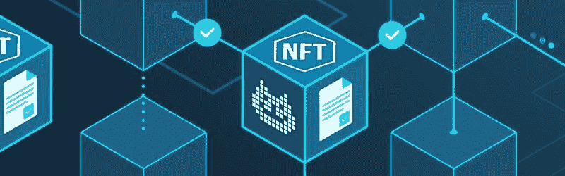
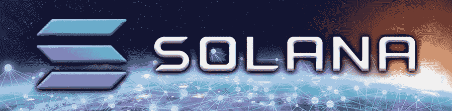
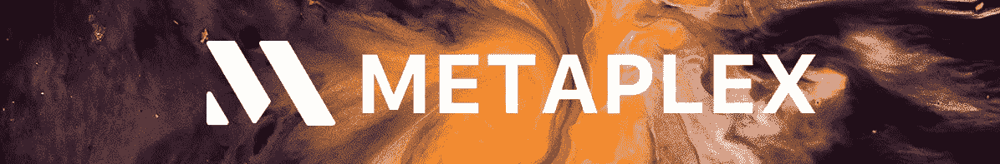
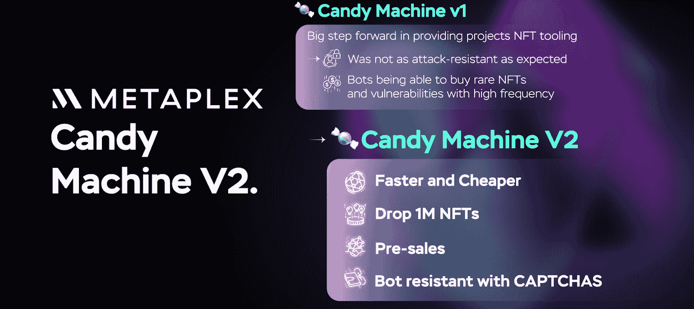
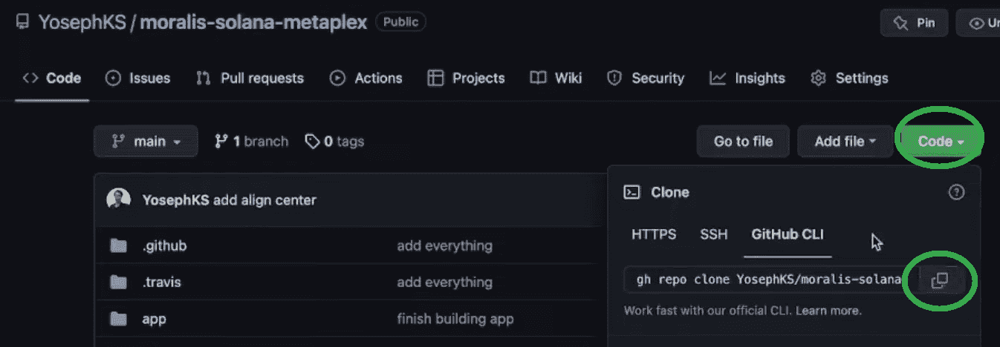
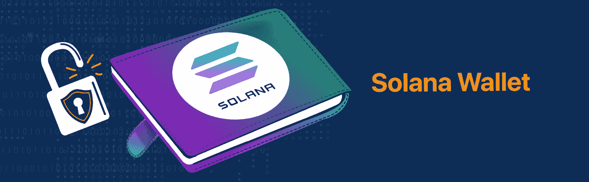
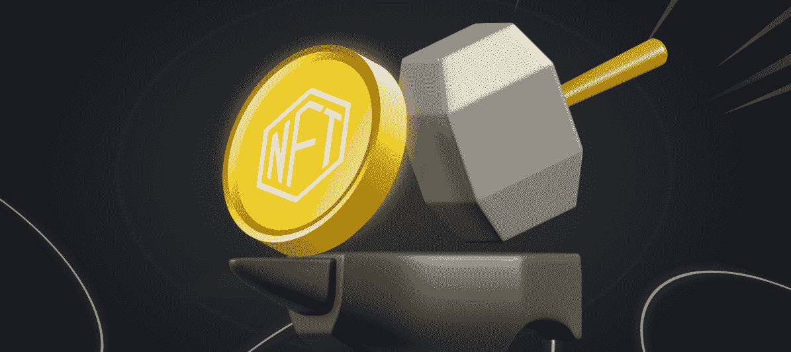

# 在 Solana 上创建 NFT 的最简单方法

> 原文：<https://moralis.io/the-easiest-way-to-create-nfts-on-solana/>

谈到 NFT 开发，Solana 提供了一些很棒的工具。例如，使用 Metaplex 的糖果机，您可以在几分钟内在 Solana 上创建 NFT！反过来，使用这种替代方法是在 Solana 网络上创建不可替换令牌的最简单方法之一。如果你想探索这个过程，请继续阅读！除了在 Solana 上轻松创建 NFT 之外，我们还将看看 Moralis——最终的 Web3 API 提供者——如何进一步推进您的开发工作。毕竟，Moralis 的企业级 NFT API 使得在任何项目中使用 NFTs 变得简单明了！

由于许多人不熟悉什么是 NFT 以及它们是如何工作的，我们将从介绍一些基础知识开始这篇文章。因此，您将有机会了解 NFTs 和 Solana 的发展趋势。我们还将解释为什么这个链提供了创建 NFT 的最简单的方法，以及为什么它是 NFT 项目的优秀网络。然后，我们将专注于一步一步的教程，演示在 Solana 上创建 NFT 的最简单的方法。因此，您将学习如何使用 Candy Machine v2 在 Solana 上铸造不可替换的令牌。当然，如果你已经掌握了基础知识，可以直接进入今天的教程。此外，如果你想创建能够轻松利用 NFTs 的 dapps，请确保[创建你的免费 Moralis 账户](https://admin.moralis.io/register)。



## 什么是 NFT？

NFT 或不可替代令牌是一种独特的加密资产。首先，正如“不可替代性”所暗示的，每一个 NFT 都是独一无二的，它的连锁“签名”也是独一无二的。这个属性使得 NFTs 非常适合于表示数字艺术、数字收藏品、证书、所有权证明、在线票务等。需要指出的是，NFT 不仅仅是图像。当然，目前有许多“无意义的”NFT 项目试图利用这种新的加密资产类型的流行。但是，你要知道，你看到的图像只是 NFTs 的极小一部分。NFT 的真正价值隐藏在后端的加密唯一性中。

NFT 表示的文件可以有各种形式，比如 JPEGs、png、MP3、MP4、pdf 等。虽然分配给 NFTs 的文件往往是 NFTs 最有形的部分，但它们只是文件。此外，像任何其他数字文件一样，你可以复制它们。因此，NFT 的真正价值在于它们的加密 id，没有人能够复制它们。因此，即使两个 NFT 包含相同的文件，它们的链上数据仍然是唯一的。

还值得指出的是，上面列出的文件类型太大，无法存储在区块链上。因此，理想情况下，这些文件使用分散存储解决方案进行存储。然后，这些文件的链接包含在存储在链上的 NFT 元数据中。此外，在唯一加密 id 下存储 NFT 元数据的过程被称为“NFT 铸造”。所以，每当你想铸造一个 NFT，你必须执行一个链上交易。此外，NFT 元数据包含的细节可能会因 NFT 标准而异。此外，某些元数据细节是必需的，而其他的是可选的。



## 什么是 Solana，为什么用它来创建 NFT？

索拉纳是一个广受欢迎的非 EVM 区块链是可编程的。与 EVM 不兼容意味着 Solana 不能使用与以太坊相同的工具。当然，这适用于开发工具；然而，对于必需品来说也是如此，比如加密钱包。因此，您不能将 MetaMask 与 Solana 一起使用。此外，Solana 也有自己的智能合约变体，称为“程序”。然而，Solana 程序与以太坊智能合约的目的是一样的。它们确保事情按照预先定义的规则运行。毕竟，当满足预定义的条件时，Solana 程序会执行预定义的操作。

为什么 Solana 项目对 NFTs 很重要？嗯，它们是索拉纳·NFT 造币厂的工具之一。此外，与 ERC-721 和 ERC-1155 NFT 是规范的 EVM 标准不同，Solana 的 SPL 令牌标准管理可替换和不可替换的令牌。因此，茄碱 NFT 是茄碱链上不可替代的 SPL 标记。要了解更多关于索拉纳和 SPL 代币，请查看“[索拉纳是什么？](https://moralis.io/what-is-solana-the-full-2022-guide/)、 [SPL vs ERC-20 代币](https://moralis.io/spl-vs-erc20-tokens-comparing-solana-and-ethereum-tokens/)篇。

Solana 在 NFT 项目中非常受欢迎的两个主要原因是 Solana 网络的高速和低交易费用。然而，超丛也是一个促成因素。毕竟，正是这个工具提供了在 Solana 上创建 NFT 的最简单方法。



### 什么是 Metaplex？

简而言之，Metaplex 是一个受欢迎的 NFT 市场、艺术、收藏品和游戏生态系统。Metaplex 协议提供了支持 NFT 开发的标准和工具。此外，Metaplex 的领先解决方案之一是使开发人员能够以分散的方式在 Solana 上创建 NFT。因此，Metaplex 是一种智能契约和工具的组合，提供了创建 NFT 的最简单方法。此外，两个领先的工具是 Metaplex Storefront 和 NFT 糖果机，我们将使用后者向前推进。



## 如何在 Solana 上轻松创建 NFT

在本节中，我们将向您展示如何使用 Metaplex 的 NFT 糖果机在 Solana 上创建 NFT，因为该工具提供了在 Solana 链上创建 NFT 的最简单方法。首先，我们将向您展示如何完成糖果机 v2 的初始设置。

*注:您可以在* [GitHub](https://github.com/YosephKS/moralis-solana-metaplex) *上访问我们的代码。另外，您可以在本文末尾找到一个视频教程，其中包含更多的详细信息。*

### 设置糖果机 V2

创建 NFT 最简单的方法需要一些工具。其中包括 NodeJS、Git、“ *yarn* ”(一个包管理器)和 TS-node。NodeJS 将作为 JavaScript 运行时。使用 Git，您将能够克隆我们的库，并且您将使用“ *yarn* 来安装所需的依赖项。尽管如此，TypeScript 节点(TS-node)将充当执行环境。

注意:如果你使用的是苹果 M1 芯片，你必须安装额外的附件。因此，使用以下命令:“brew install pkg-config cairo pango libpng JPEG gif lib librsvg”。

将上面列出的工具设置到位后，您需要克隆并安装 Metaplex。因此，现在就使用上面的“GitHub”链接克隆我们的代码:



### 创建您的 Solana 钱包

执行链上交易来铸造 NFT 是必须的。因此，你需要一个 SOL 钱包，里面有足够的 SOL 硬币。后者是 Solana 的原生加密货币，你需要它来支付交易费用。幸运的是，您可以使用 Solana 工具套件轻松创建本地钱包。

*注意:本地钱包并不总是安全的，不应用于存储加密货币用于开发以外的目的。*



您可以按顺序使用以下命令与您的本地 Solana wallet 进行交互:

```js
solana –version
```

```js
solana address
```

```js
solana balance
```

注意 *:如果你还没有你的 Solana 地址，考虑设置你的新 devnet 钱包。有关如何操作的详细说明，请参考 Metaplex 的文档。*

继续向前，我们将关注在 Solana devnet 上创建示例 NFT。因此，你不需要真正的 SOL 令牌。相反，您将使用“测试”SOL，并且您可以使用“ *solana airdrop 2* ”命令免费获得两个测试 SOL。然而，一旦你决定在 Solana mainnet 上使用你的 NFT 糖果机，你将需要真正的 SOL。

### 配置您的糖果机

在成功地创建了你的 Solana 钱包并在上面添加了两个测试 SOL 令牌后，是时候打开上面克隆的项目了。首先找到“example-candy-machine-upload-config . JSON”文件:


此外，你可以跟随我们的领导，使用 Arweave 来存储 NFT 文件。但是，您可以从其他几个选项中进行选择；Arweave 只是创建 NFT 的最简单方法的特定配置之一。更多细节，请看下面的视频(4:39)。

### 准备 NFT 图像和元数据以创建索拉纳上的 NFT

如前所述，即使使用最简单的方法创建 NFT，您仍然需要 NFT 文件和元数据。如果你有知识和技能，请随意自己准备这些文件。但是，由于创建图像文件和元数据不是本教程的重点，您可以使用我们的示例资源:


上面的屏幕截图显示了“example-assets”文件夹中的十对文件。此外，JSON 文件是每个 NFT 的元数据，而 PNG 文件是表示我们的示例 NFT 的图像。因此，使用我们的示例文件，您可以铸造十个索拉纳 NFT 代币。

此外，通过查看上面截图的右侧，可以看到十个 JSON 文件中的一个的详细信息。如果您想了解更多关于 NFT 文件和元数据的信息，请观看下面的视频(7:52)。此外，视频的这一部分还演示了如何验证您的资产(可选步骤)。

### 上传您的 NFT 文件和元数据

要上传您的 NFT 文件和元数据，您将使用“ *upload* ”命令(下面 12:27 的视频)。这个命令确保您的图像和 JSON 文件被上传到上面选择的分散存储解决方案。本质上，您只需复制 Metaplex 文档提供的命令行即可。当然，您需要编辑路径以匹配您的项目:


上面的命令行将在 Solana devnet 上部署 Candy Machine 的实例，并上传所有资产。

### 创建您的 NFT 收藏

在这一点上，你已经做好了一切准备来创建你的索拉纳 NFT 收集的例子。此外，就像上一步一样，您可以从 Metaplex 文档中复制一个特定的命令行(15:35)。不要忘记调整它以匹配您的项目路径:


“*糖果机集合*”命令将为您的非糖果准备一个集合。因此，在铸造步骤中，您将有机会将您的 NFT 分配到此集合。

#### 验证资产上传

验证资产上传不是强制性的。但是，由于此步骤有助于您确保所有资产正确上传，我们建议您完成此步骤:


*您可以在下面的视频(17:23)中找到有关“验证资产上传”步骤的更多详细信息，或者访问 Metaplex 文档。*



### 在索拉纳上创建 NFT 的最简单方法——造币时间

以上所有步骤都指向这一点，在这一点上，您实际上可以在 Solana 上创建 NFT。你可以在下面的视频(18:18)中找到关于铸造过程的所有细节。多亏了 Metaplex，在我们看来，这是创建 NFT 最简单的方法。毕竟，您只需要从 Metaplex 文档中复制所需的命令，并调整它以匹配您的文件路径。

此外，值得指出的是，在使用 Metaplex 创建 NFT 时，您有两种选择。您可以单独铸造茄碱 NFT 或执行批量或批量铸造。如果您选择后者，您可以在一次交易中铸造多个 NFT。

尽管如此，一旦您成功地创建了您的 NFT，您就可以在 Solana explorer (devnet)中查看它们:


最后但同样重要的是，下面是我们在上面提到的视频。

最后但并非最不重要的一点是，下面是我们在上面提到的视频。成功铸造 NFT 后，我们的内部 Solana 专家演示了如何使用 Moralis 来构建 Solana 仪表板(24:35)。然而，他使用了一些 Moralis 1.0 中的特性，但是在 Moralis 2.0 中没有。因此，作为一种替代方案，我们鼓励你使用我们的“ [NFT 门控网站](https://docs.moralis.io/docs/nft-gating-nextjs)”教程，并尝试调整代码以匹配 Solana devnet。*T3】*

[https://www.youtube.com/embed/BPQXek6lMUE?feature=oembed](https://www.youtube.com/embed/BPQXek6lMUE?feature=oembed)

## 在 Solana 上创建 NFT 的最简单方法——总结

在今天的文章中，您有机会了解了创建 NFT 的最简单方法。我们首先解释了基础知识，在这里您了解了什么是 NFT 及其主要组件。我们还确保您知道 Solana 是什么，以及为什么它是创建 NFT 的流行网络。因此，你会发现它的速度、低廉的油费和一些优秀的工具是 NFT 开发商开发 Solana 的主要原因。此外，在这里您了解到 Metaplex 的 Candy Machine 是一个工具，它使在 Solana 上创建 NFT 变得相对简单。最后但同样重要的是，您有机会跟随我们的领导，在 Solana devnet 上创建您自己的示例 NFT。

无论你是想更深入地了解索拉纳的发展，还是想探索 NFT 在其他方面的发展，Moralis 的 YouTube 频道和 T2 的 Moralis 博客都是值得探索的地方。这些是支持你的免费和持续的加密教育的平台。例如，我们最近的一些话题集中在[跨链桥接](https://moralis.io/cross-chain-bridging-deep-dive/)、[在 Solana 上编程智能合约](https://moralis.io/how-to-program-smart-contracts-and-implement-them-on-solana/)、[上传文件到 IPFS](https://moralis.io/how-to-upload-files-to-ipfs-full-guide/) 、[在 Solana 上铸造硬币](https://moralis.io/how-to-mint-a-coin-on-solana-in-5-steps/)等等。

另一方面，你也可以采取更专业的方式来接受区块链发展教育。在这种情况下，报名参加 Moralis 学院可能是你的正确道路。而且，如果你想成为一名 Solana 程序员，那就从“ [Solana 编程 101](https://academy.moralis.io/courses/solana-programming-101) 课程开始吧。