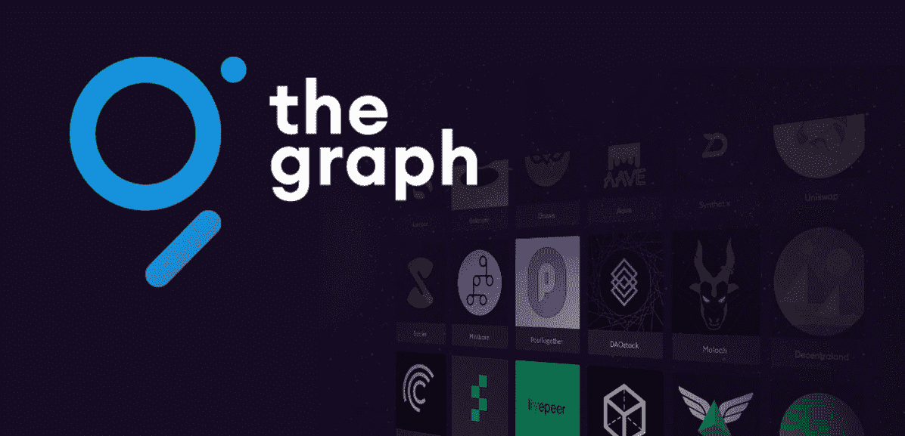
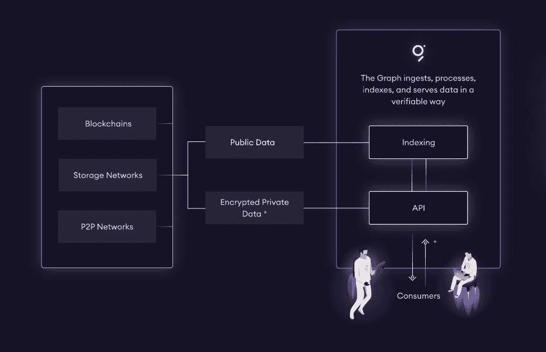
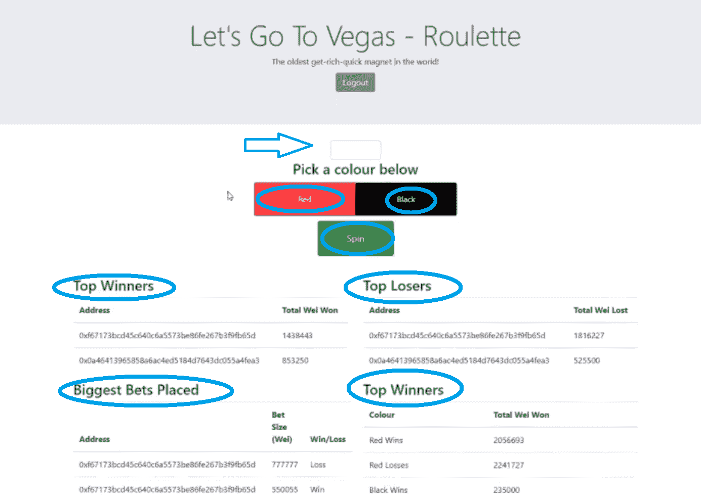
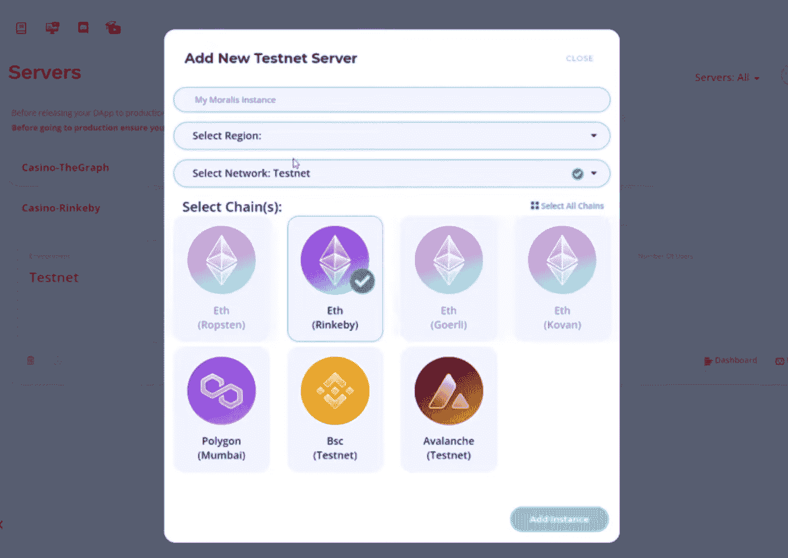
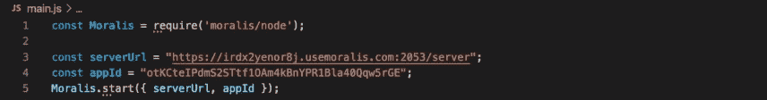
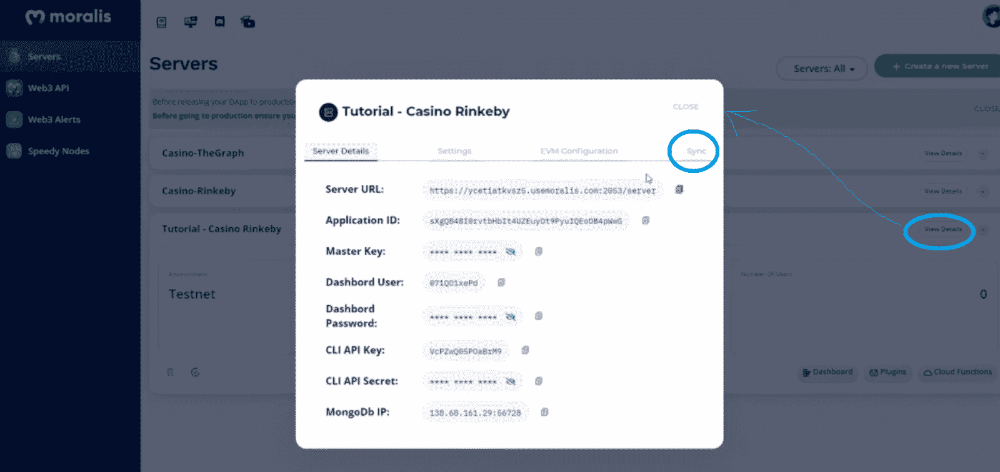
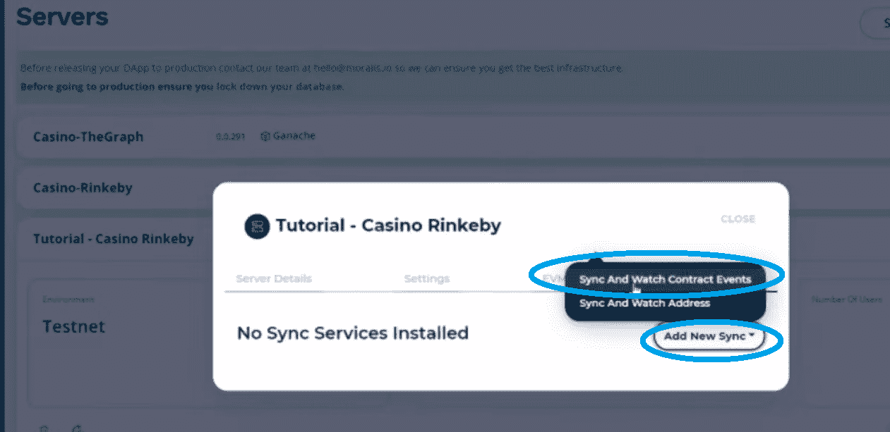
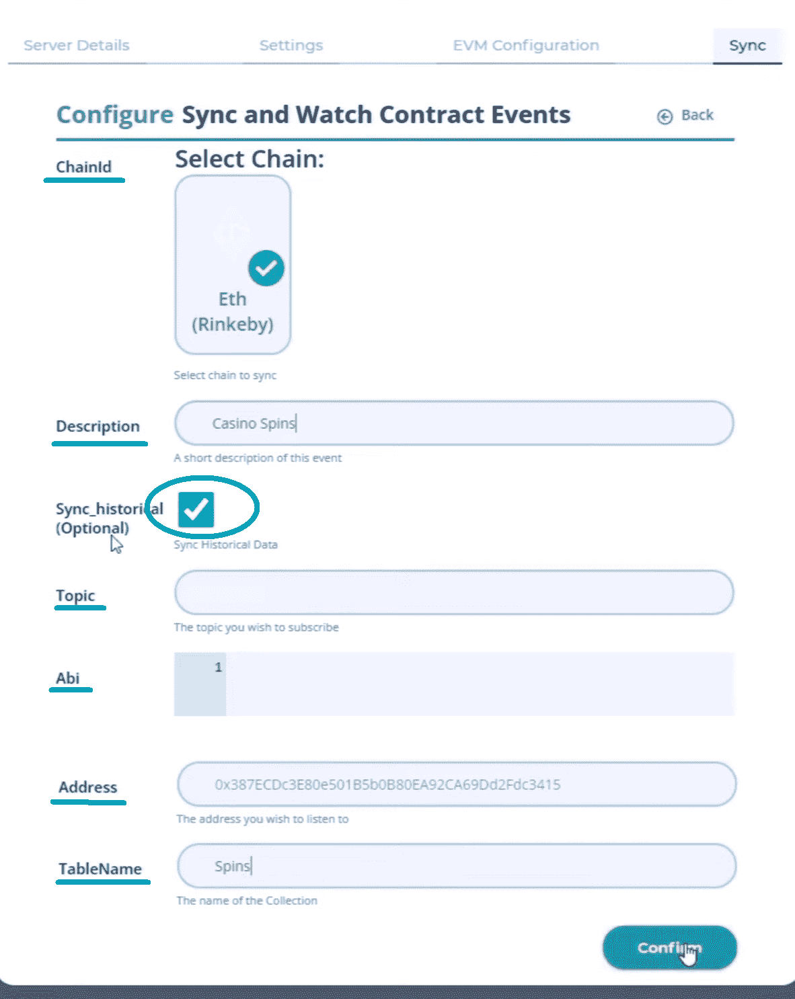
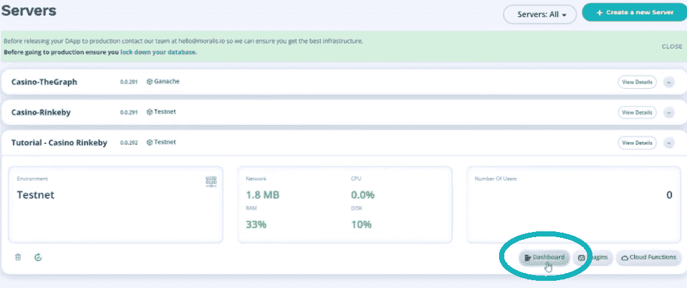
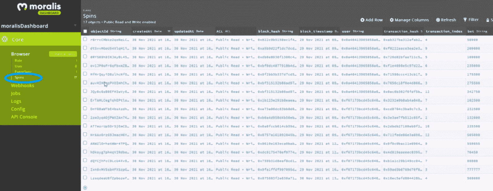

# 智能合同索引的图形选择

> 原文：<https://moralis.io/the-graph-alternative-for-smart-contract-indexing/>

区块链世界发展迅速，我们看到在短时间内出现了无数的项目。许多加密项目都提供了切实可行的解决方案和用例。该图似乎是这样一个项目；然而，只有时间才能证明它是否会继续存在。虽然 Graph 提供了强大的 API 和 [**智能合约**](https://moralis.io/smart-contracts-explained-what-are-smart-contracts/) **索引解决方案，但是 Graph 也有几个替代解决方案。本文将更仔细地研究图形的替代方案。**

例如，图中的一个替代物是 [Web3](https://moralis.io/the-ultimate-guide-to-web3-what-is-web3/) 开发平台 [Moralis](https://moralis.io/) (又名[crypto](https://moralis.io/firebase-for-crypto-the-best-blockchain-firebase-alternative/)的 Firebase)，它为开发者提供了[终极 Web3 SDK](https://moralis.io/exploring-moralis-sdk-the-ultimate-web3-sdk/) 。在许多有用的工具中，Moralis 有一个特殊的“同步”功能，使您能够在几分钟内同步和索引智能合同事件。此外，与所讨论的智能合同相关的链上数据在您的 Moralis 仪表板中变得可用，这本质上是一个简洁的数据库。

接下来，我们将首先确保我们都掌握了基本知识。因此，我们将回答“图是什么？”以及“什么是智能合同索引？”在承担一个示例项目之前。后者将展示 Moralis 的智能合同索引功能。因此，您将能够看到使用图表替代方案是多么快速和容易。此外，Moralis 最棒的一点是，任何能够使用 [JavaScript](https://moralis.io/javascript-explained-what-is-javascript/) 编写代码并拥有 [React](https://moralis.io/react-explained-what-is-react/) 开发经验的人都有能力在最短的时间内创建杀手级 dapp([分散应用](https://moralis.io/decentralized-applications-explained-what-are-dapps/))。此外，Moralis 完全是关于跨链互操作性的，这意味着它支持几种领先的可编程区块链，从而使您能够轻松地跨多个链部署 dApps。因此，它能让您的项目经得起未来的考验。



## 图表是什么？

该图是一个索引协议，使开发人员能够查询像[以太坊](https://moralis.io/full-guide-what-is-ethereum/)和 [IPFS](https://moralis.io/what-is-ipfs-interplanetary-file-system/) 这样的知名网络，从而将链上数据用于各种用例。它是区块链和特定 dApp 之间的一种数据分类层。该图允许任何人构建和发布开源 API(子图),从而有助于开发人员轻松访问有用的数据。此外，子图可以合并或组合成一个包含世界上所有公共数据或信息的全局图。此外，通过跨应用程序转换、组织和共享这些数据，开发人员可以使用 GraphQL 编程语言通过几次击键来查询这些数据。本质上，所有链上数据都在开放网络上存储和处理，具有可验证的完整性。该图使查询这些数据变得快速、可靠和安全。



如果你有兴趣了解更多关于图表的信息，请访问他们的官方网站。此外，您还可以使用图表观看一位经验丰富的开发人员在下面的视频(5:40)中承担一个简单的示例项目。

## 什么是智能合同索引？

如果我们想讨论智能合约索引，我们需要确保您知道什么是智能合约。好吧，智能合同是计算机程序或交易协议。它们包含一组特定的条件，满足这些条件时会触发预定义的操作。因此，智能合同的条款自动受到尊重，因此被称为“智能”合同。此外，每当智能协定中或基于其代码发生有意义的事情时，它都会发出一个事件(智能协定事件)。通过监听这些事件，我们可以通过索引来安排链上数据。因此，智能合约索引是指基于智能合约事件捕获区块链数据并将这些数据整理到结构化数据库中的行为。

后者之所以可能，是因为在大多数情况下，智能合约都是“可审计的”，这意味着代码和所有交易都是公开的。然而，事实证明索引智能合约并不那么简单。当然，使用像图表这样的工具可以让你做到这一点，但是如果你自己尝试，你会发现这仍然是相当棘手和费时的。这就是为什么您将在本文中了解的图表替代方案目前为智能合同索引提供了最实用和最快的解决方案。这是一个真正的游戏规则改变者，因此对于时间至关重要的项目来说，这是一条正确的道路。


# 行动中的图形选择

如果您有足够的时间，并且想以稍微高级一点的方式(自己涵盖大部分后端基础设施)使用智能合同索引，那么请确保进一步研究该图。然而，如果你渴望以最简单的方式涵盖这一方面，而不是把你的时间投入到创建最好的用户界面，那么使用图形替代是一种方法。

在这里，我们将通过一个示例项目向您展示如何使用图表替代方案来索引智能合同。因此，我们将使用区块链轮盘赌，使用户能够在没有绿色(零)选项的情况下下注红色或黑色。我们将使用 Moralis 来索引相关的智能合同，从而使所有的链上数据在 Moralis 数据库中整齐地可用。从那里，我们可以通过复制和粘贴由 [Moralis 的文档](https://docs.moralis.io/)提供的代码片段，使用 Moralis 的云功能及其最终的 Web3 API 轻松使用索引数据。

## 行动中的图形选择——一个示例项目

在下面的截图中，你可以看到我们的示例 casino dApp(它在 Rinkeby 上直播),这将是我们在这个示例任务中感兴趣的。接下来，我们将使用 Moralis 对其智能合约进行索引。但是，让我们首先快速概述一下这个 dApp，以便为您提供清晰的背景。



如前一节所述，dApp 允许用户在 gwei 中输入他们希望下注红色或黑色的金额(没有零)。在输入金额和选择颜色后，用户需要点击“旋转”按钮，执行交易。此外，我们的赌场 dApp 还显示最高赢家，最高输家，最大的赌注，以及每种颜色的输赢总数。当然，为了我们的任务，我们感兴趣的是这个 dApp 背后的智能契约( [flipcontract.sol](https://github.com/ChrisMoralis/Moralis-Tutorials/blob/main/07%20Casino%20App%20Edited%20Files/truffle/flipcontract.sol) )，我们在 [GitHub](https://github.com/ChrisMoralis/Moralis-Tutorials/tree/main/07%20Casino%20App%20Edited%20Files) 提供了它和其余的代码。此外，智能合约控制几个事件；但是，下注的那个(下注金额、下注颜色和结果)是我们要关注的。

### 使用 Moralis 的智能合同索引

为了使用 Moralis 进行智能合同索引，您需要首先正确设置它。为此，我们准备了以下部分，涵盖了您需要完成的所有步骤，以访问图形替代。


#### 初始设置–创建 Moralis 服务器

无论你是想使用 Moralis 进行智能合约索引，将其作为 [Infura 替代品](https://moralis.io/infura-alternatives-and-blockchain-node-providers/)(Moralis’[Speedy Nodes](https://moralis.io/speedy-nodes/))之一，还是使用其 Web3 SDK 开发 dApps，你都需要从创建 Moralis 服务器开始。以下是您需要遵循的步骤:

1.  [**创建您的免费 Moralis 账户**](https://admin.moralis.io/register)–如果您还没有免费的 Moralis 账户，请点击该链接，输入您的电子邮件地址，创建您的密码，不要忘记点击将发送到您的电子邮件中的确认链接。然而，如果你已经有了一个 Moralis 账户，[登录](https://admin.moralis.io/login)到你的管理区。

2.  [**创建 Moralis 服务器**](https://docs.moralis.io/moralis-server/getting-started/create-a-moralis-server)–进入 Moralis 管理区域后，进入“服务器”选项卡，点击右上角的“+创建新服务器”按钮(见下图)。然后从下拉菜单中选择最适合您需求的网络类型。*由于示例“赌场”dApp 是在 Rinkeby 上直播的，所以选择“Testnet 服务器”选项(* [*连接以太坊 Testnet*](https://moralis.io/ethereum-testnet-guide-connect-to-ethereum-testnets/)*)。*


接下来，输入服务器名称(可以是您想要的任何名称)，选择您所在的地区，选择网络类型、链，并通过单击“添加实例”按钮启动您的服务器:



3.  **访问服务器详情**–*(现在可以跳过第 3 步和第 4 步；当您决定使用智能合同索引创建 dApp 时，您将需要它。)*一旦您的服务器上线，您就可以通过点击“查看详情”按钮来访问其详情:


你需要的所有信息都会显示在一个新窗口中。在那里，您可以通过单击复制图标来简单地复制它们(一个接一个):


4.  初始化 Moralis 规范 *(同样，你需要完成这个步骤来创建你的 Moralis 规范 dApps。)*–用上面获得的 Moralis 服务器详细信息(应用程序 ID 和服务器 URL)填充您的编码文件:



#### 为智能合同索引使用图形替代

一旦您完成了初始的 Moralis 设置，您就可以使用图表选项进行智能合同索引了。首先，单击您在上面创建的服务器旁边的“查看详细信息”按钮。在出现的弹出窗口中，单击“同步”选项卡:



一旦在“同步”标签，你会有一个按钮来添加新的同步。通过单击“添加新同步”按钮，您可以获得两个选项:



为了索引智能合同，您需要选择顶部选项(“同步和观察合同事件”)。选择正确的选项后，您将看到以下窗口:



正如您在上面的屏幕截图中看到的，您需要输入一些详细信息来设置智能合同索引。为了尽可能方便您，我们向您提供了以下所有详细信息。您可以简单地复制并粘贴这些详细信息:

*   **ChainId:** 选择“Eth(rinke by)”*(如果你已经正确地遵循了上面的说明，这应该是你唯一的选择)。*
*   **描述** : *这可以是你想要的任何东西；然而，请随意跟随我们的领导，使用“赌场旋转”。*
*   **同步历史数据** : *选择此选项以收集过去的事件。*
*   **题目** : *这里我们需要输入“赌注”事件(只需要数据类型):*

```js
bet(address,uint256,bool,uint8);
```

*   **ABI** 为“打赌”事件:

```js
{
“anonymous”: false,
“Inputs”: [
	{
		“Indexed”: true,
		“internalType”: “address”,
		“name”: “user”,
		“type”: “address”,
	},
	{
		“Indexed”: true,
		“internalType”: “uint256”,
		“name”: “bet”,
		“type”: “uint256”,
	},
	{
		“Indexed”: true,
		“internalType”: “bool”,
		“name”: “win”,
		“type”: “bool”,
	},	
	{
		“Indexed”: false,
		“internalType”: “uint8”,
		“name”: “side”,
		“type”: “uint8”,
	},	
	]
	“name”: “bet”,
	“type”: “event” 
}
```

*   **智能合约的地址**:*0x 387 ecdc 3 e 80 e 501 b 5b 0 b 80 ea 92 ca 69 DD 2 FDC 3415*
*   **表名** : *这也可以是您喜欢的任何东西(这是将在您的 Moralis 仪表板中使用的类名)。同样，请随意跟随我们的领导，使用“赌场旋转”。*

#### Moralis 的仪表板

输入上述所有详细信息后，单击“确认”按钮创建您的同步事件。如果您已经正确完成了所有操作，您应该会看到以下屏幕:


现在，您可以关闭该窗口，以便我们可以查看仪表板。这是所有过去的智能合约事件应该已经被索引的地方。当然，这也是所有未来事件将被索引的地方。要访问您的数据库，请单击服务器的“仪表板”按钮:



查看您的 Moralis 仪表板的侧栏，您应该看到“Spin”类。这是通过我们的“同步和观察”事件自动创建的。它已经索引了与“打赌”事件相关的所有细节:



上面的列包含用户的地址、赌注金额、0 或 1(红色或黑色)，或者赌注是否赢了。有了这些数据，您就可以开始查询它们，并在 dApps 中使用它们。如果你想进一步了解这方面的内容，请务必观看下面 30:12 开始的视频。此外，如果你更喜欢视频，请随意观看整个视频:

https://www.youtube.com/watch?v=zrtcXd5cSe4

## 智能合同索引的图形替代方案–摘要

现在，您知道了什么是图表，以及如何使用它进行智能合同索引。但是，您还了解到，图表不是索引智能合约的最简单也不是最快的方式。首先，它需要运行你自己的服务器，对节点来说是相当繁重的，而且要花相当多的时间用一种新的编程语言对它进行适当的编码。幸运的是，有了图形替代方案，精通 JavaScript 的开发人员可以在几分钟内完成智能合同索引。因此，它可以让你节省大量的时间，以及如何创建最有吸引力的前端。此外，Graph alternative 不仅仅是一个智能合同索引工具，它还是最终的 Web3 开发平台。

如果你想接手其他有趣的示例项目，从而提升你的区块链开发技能，请务必访问 [Moralis 的博客](https://moralis.io/blog/)和 [Moralis YouTube 频道](https://www.youtube.com/c/MoralisWeb3)。我们的一些最新主题向您展示了[如何连接到 Arbitrum 节点](https://moralis.io/full-guide-how-to-connect-to-arbitrum-nodes/)，如何在 Angular 中构建[以太坊 dApps](https://moralis.io/how-to-build-ethereum-dapps-in-angular/)，如何[构建 NFT 交易界面](https://moralis.io/build-an-nft-trading-interface-full-guide/)，如何使用 [OpenSea API 替代方案](https://moralis.io/opensea-api-alternative-list-nfts-with-this-opensea-plugin/)，[闪贷如何工作](https://moralis.io/how-do-flash-loans-work-full-walkthrough/)，如何为开发者使用[元掩码](https://moralis.io/metamask-for-developers-how-to-launch-web3-apps-with-metamask/)，如何[快速创建 DAO](https://moralis.io/how-to-create-a-dao-in-10-minutes/) ，如何进行[无气体交易 如何](https://moralis.io/how-to-do-gasless-transactions-on-ethereum/)[建立跨链桥](https://moralis.io/how-to-build-a-cross-chain-bridge/)，如何[建立预测市场 dApp](https://moralis.io/how-to-build-a-prediction-market-dapp/) ，等等。 此外，如果你有兴趣尽快成为全职加密员，我们建议你采取一种更专业的方式，报名参加[Moralis 学院](https://academy.moralis.io/)提供的一些高质量[课程](https://academy.moralis.io/all-courses/)。

