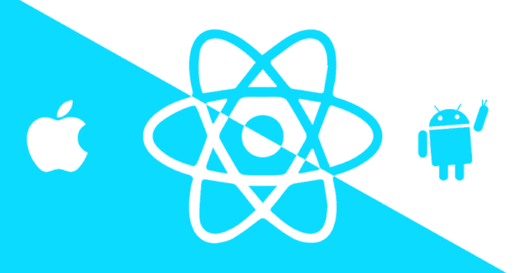
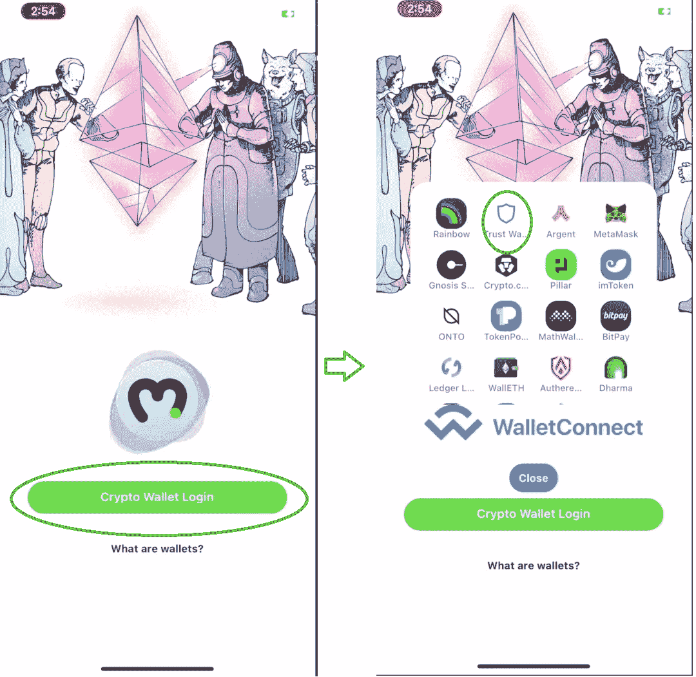
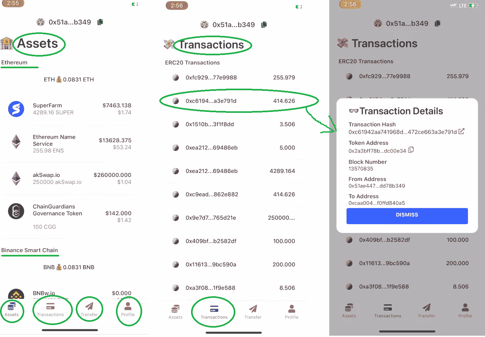
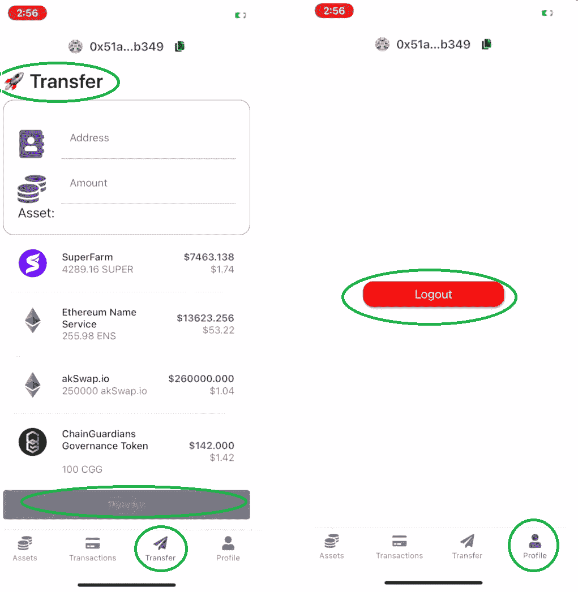
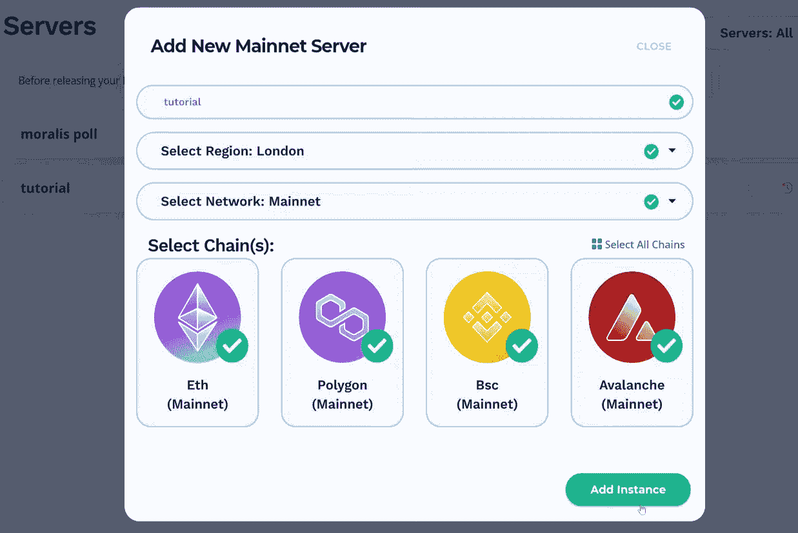

# 终极以太坊 iOS 开发套件

> 原文：<https://moralis.io/the-ultimate-ethereum-ios-dev-kit/>

随着 iOS 成为最受欢迎的智能手机操作系统之一，区块链开发者在为以太坊创建 [**dApps**](https://moralis.io/decentralized-applications-explained-what-are-dapps/) **时，将受益于移动优先的方法。此外，如果你能够掌握为 iOS 创建非凡且优化的以太坊移动应用的技能，你将使自己和你的** [**Web3**](https://moralis.io/the-ultimate-guide-to-web3-what-is-web3/) **应用从竞争中脱颖而出，并吸引更多用户。然而，虽然有些人正在使用繁琐耗时的方式围绕** [**RPC 节点**](https://moralis.io/ethereum-rpc-nodes-what-they-are-and-why-you-shouldnt-use-them/) **开发原生移动 dApps，但程序员最好使用 Moralis 的以太坊 iOS 开发工具包。使用 Moralis 的终极以太坊 iOS 开发套件，您将能够在几分钟内启动并运行移动 dApps。**

在这个创建本地移动 dapp 的指南中，您将学习如何创建跨链互操作的移动 dapp。此外，即使您主要对服务 iOS 用户感兴趣，ultimate Ethereum iOS dev kit 也提供了对 Android 的全面支持。因此，您将能够在其他可编程区块链和操作系统之间进行转换，从而使您的移动 dApp 开发生涯经得起未来的考验。

本质上，两个主要工具组成了最终的以太坊 iOS 开发套件，这是这个[以太坊移动样板](https://moralis.io/ethereum-mobile-boilerplate-full-guide-to-ethereum-for-mobile/)和首要的 Web3 开发平台——[Moralis](https://moralis.io/)(也就是用于加密的[Firebase](https://moralis.io/firebase-for-crypto-the-best-blockchain-firebase-alternative/))。此外，您将在这里学习如何开始使用这两种工具，如果您不想将开发局限于移动 dApp，您也可以使用 Moralis 的[以太坊 dApp 样板](https://moralis.io/ethereum-dapp-boilerplate-full-ethereum-react-boilerplate-tutorial/)来部署常规的 Web3 应用程序。总而言之，有了 Moralis 的支持，区块链开发变成了一个简单明了的过程。

### 什么是 React Native？

如果您是一名经验丰富的移动应用程序开发人员，那么您很可能非常熟悉 React Native。在这种情况下，请随意跳到下一部分，我们将向您展示以太坊 iOS 开发工具包的运行情况。但是，如果您刚刚开始移动开发者之旅，请确保学习 React Native 的基础知识。

那么，什么是 React Native 呢？React Native 是一个 [JavaScript](https://moralis.io/javascript-explained-what-is-javascript/) (JS)框架，用于编写 Android 和 iOS 的原生渲染移动应用。此外，正如“反应”部分所暗示的，它是基于[反应](https://moralis.io/react-explained-what-is-react/)。后者是脸书用于创建用户界面(ui)的 JavaScript 库，在 React Native 中，它的目标是移动平台而不是浏览器。从本质上讲，React Native 使 web 开发人员能够编写感觉和外观都是真正本机的移动应用程序。此外，你应该始终致力于构建原生移动应用，因为当涉及到用户输入和输出时，它们会运行得更流畅。此外，原生应用继承了设备的操作系统界面，让它们看起来像是设备的一个组成部分。由于可以在平台之间共享代码，React Native 使得同时为 iOS 和 Android 开发成为可能。

我们之所以讨论 React Native，是因为这个 JavaScript 框架正是终极以太坊 iOS 开发套件所基于的。这意味着任何精通 JavaScript 的人都可以立即开始部署移动 dApps。然而，如果你还不知道 JavaScript，我们强烈建议你报名参加 Moralis Academy 的 [2021 区块链开发者 JavaScript 编程](https://academy.moralis.io/courses/javascript-programming-for-blockchain-developers)课程。此外，如果你真的想成为全职加密员，一定要去看看[Moralis 学院](https://academy.moralis.io/)的其他高质量课程。

## 以太坊 iOS 开发套件在运行

我们可以连续几个小时谈论以太坊 iOS 开发工具包及其特性；然而，我们相信，如果我们进行一个示例项目，您将从本文中获得最大收益。通过使用终极以太坊 iOS 开发套件的核心部分——最好的以太坊移动样板，在几分钟内创建一个全功能的移动 dApp，您将很容易看到这个非凡工具的要点。我们鼓励你跟随并创建你自己的移动 dApp。通过这样做，您将学会如何正确设置，这将在您未来的移动 dApp 开发中派上用场。

### 示例移动 dApp 预览

在我们进入设置指南之前，我们希望你在使用终极以太坊 iOS 开发套件时，能在几分钟内对你可用的 dApp 有一个正确的认识。那么，让我们对我们完成的移动 dApp 做一个简单的预览。让我们从登录页面开始:

看上面的图片，你可以看到我们的移动 dApp 通过 [WalletConnect](https://moralis.io/what-is-walletconnect-the-ultimate-walletconnect-guide/) 为用户提供了一个登录选项。用户点击“加密钱包登录”按钮后，WalletConnect 会为他们提供众多受支持的加密钱包。这些也作为加密领域的[认证](https://moralis.io/ethereum-authentication-full-tutorial-to-ethereum-login-programming/)服务商。*在本次演示中，我们选择了 Trust Wallet。*

用户成功认证(登录)后，就可以访问 dApp 的功能(如下图所示)。我们的移动 dApp 功能的第一个选项卡使用户能够查看多个区块链的资产和余额(目前支持的链有[以太坊](https://moralis.io/full-guide-what-is-ethereum/)、[币安智能链](https://moralis.io/bsc-programming-guide-intro-to-binance-smart-chain-development-in-10-minutes/) (BSC)、[多边形](https://moralis.io/how-to-build-polygon-dapps-easily/)和[雪崩](https://moralis.io/how-to-build-avalanche-dapps-in-minutes/))。

第二个选项卡显示过去的交易。此外，在这里，用户只需轻轻一点，就能轻松获取任何交易的细节。这样，将会出现一个包含详细信息和事务浏览器链接的弹出窗口(见上图)。第三个选项卡显示转移。在那里，您的用户可以通过输入收件人的地址、选择他们想要发送的资产、输入金额并点击“转移”按钮来发送他们的加密资产，在输入所有先前的详细信息后，该按钮将变为活动状态:

在最右侧，我们有“个人资料”选项卡。这是用户注销的地方。点击“注销”按钮后，dApp 会显示初始登录屏幕。

## 以太坊 iOS 开发套件设置

能够在几分钟内创建一个包括所有基本 Web3 功能的移动 dApp，使这个以太坊 iOS 开发工具包成为目前可用的最好的移动 Web3 开发工具之一。除了涵盖所有的基本功能，dApp 看起来也很整洁干净。幸运的是，你很快就能自己创建那种移动 dApp 了。

如果你还记得，我们已经提到过终极以太坊 iOS 开发套件有两个关键要素——Moralis 和最好的以太坊移动样板。因此，要开始无缝创建移动 dApps，您需要完成两组设置步骤。

### 以太坊 iOS 开发套件设置–移动样板快速入门

以太坊移动样板入门很简单。只需完成下图所示的五个步骤:

你最有可能独自完成上述步骤；然而，为了以防万一，让我们来指导您完成这个过程。

1.  对于初学者来说，通过在样板文件的 GitHub 页面上单击 GitHub URL 旁边的复制图标来克隆或派生以太坊移动样板文件:

2.  接下来，转到您的代码编辑器(我们使用 Visual Studio 代码[VSC])并将复制的 URL 粘贴到 VSC 的终端中:

3.  然后，您需要全局安装“expo CLI”。您可以通过在代码编辑器的终端中键入“npm i -g expo-cli”(或者从 GitHub 中复制代码)来实现这一点:

4.  是时候将“. env.example”文件重命名为”。env”。接下来，插入您的 Moralis 服务器 URL 和应用程序 ID(从 Moralis 设置部分获得——遵循以下小节中的说明):

5.  一旦您的 Moralis 服务器详细信息被插入到。env”文件，您需要安装所有的依赖项。然而，由于您很可能已经在该文件夹中，您可以跳过"*CD ether eum-react-native-boilerplate*"命令。因此，继续下一个命令(键入或粘贴"*纱安装"*在 VSC 的终端):

6.  完成以上步骤后，就该运行你的 dApp 了。为此，您需要使用的实际命令取决于您正在使用的操作系统:

*   **网**:纱网
*   **iOS** :纱线 iOS
*   **安卓**:纱安卓

因为我们在这里关注的是终极以太坊 iOS 开发工具包，所以你需要使用" *yarn ios"* 命令。该命令还将自动启动移动应用模拟器:

#### 创建 Moralis 服务器

为了使用以太坊 iOS 开发工具包，尤其是最好的以太坊移动样板，你需要[创建一个 Moralis 服务器](https://docs.moralis.io/moralis-server/getting-started/create-a-moralis-server)。因此，请完成以下步骤:

1.  **登录你的 Moralis 账户**——如果你已经准备好了你的 Moralis 账户，只需[登录](https://admin.moralis.io/login)即可进入你的管理区。然而，如果不是这样，请确保[现在就创建你的免费 Moralis 账户](https://admin.moralis.io/register)。

**创建您的 Moralis 服务器**–登录并访问您的 Moralis 管理区(如下图所示)后，点击右上角的“+创建新服务器”。接下来，从下拉菜单中选择最适合您需求的网络类型。当处理示例项目时，选择“Testnet 服务器”(查看我们的[以太坊 testnet](https://moralis.io/ethereum-testnet-guide-connect-to-ethereum-testnets/) 指南)通常是最好的方法。然而，当你想让你的移动 dApps 上线时，你需要选择“Mainnet 服务器”选项。

然后，会出现一个弹出窗口。它将询问您的服务器名称(可以是您想要的任何名称)、地区、网络和链。输入这些详细信息后，单击“添加实例”。

3.  **访问服务器详细信息**–一旦您的服务器启动，您可以通过单击服务器名称旁边的“查看详细信息”按钮来查看其详细信息。

点击“查看详情”按钮，将弹出另一个窗口。在其中，您将看到您的服务器 URL 和应用程序 ID:

4.  **初始化 Moralis 规范**–按照上一节(第四步)中的说明，您现在需要填充您的”。env "文件和 Moralis 服务器的详细信息。这样，你将获得由 Moralis 的 SDK 提供的后端功能。只需复制并粘贴以上两个详细信息:

*注意* *:确保* ***而不是*** *使用上图中的细节。相反，您需要粘贴特定服务器的详细信息。*

### 以太坊 iOS 开发套件–超越样板文件

在以上各节中，您已经完成了创建一个全功能移动 dApp 所需的所有步骤(根据以上“示例移动 dApp 预览”一节中提供的详细信息)。下一步是进行必要的调整，以最好地满足您或您的客户的需求。而且，这也会让你的手机 dApp 与众不同。幸运的是，以太坊 iOS 开发工具包为您提供了所有的工具，让您不费吹灰之力就能将 dApp 提升到一个新的水平。首先，您可以在应用程序的任何地方使用以太坊移动样板提供的组件。你可以通过使用 Moralis 的钩子把事情做得更好。为了尽可能最好地使用后者，请确保依赖 [Moralis 的文档](https://docs.moralis.io/)。

你可以在“App.jsx”文件中查看你的移动 dApp 背后的核心代码(如上图所示)。这是 Moralis 专家确保您获得正确导航并能利用前面介绍的所有功能的地方。此外，不要忘记探索 Moralis 提供的其他选项。这些包括[智能契约](https://moralis.io/smart-contracts-explained-what-are-smart-contracts/)事件、创建实时查询、触发器、地址大小写等等。

对于视频演练，当一个 Moralis 专家承担我们上面提到的任务时，从他的肩膀上看过去:

https://www.youtube.com/watch?v=jGUY5Hq8tFo

## 以太坊 iOS 开发套件–创建本地移动 dApps 指南–摘要

我们希望您已经按照整篇文章中的说明采取了行动并完成了所有步骤。如果是这样，你现在就有了一个功能齐全的移动 dApp。此外，您还知道如何充分利用最好的以太坊 iOS 开发套件。只需要 15 分钟就可以克隆以太坊移动样板，设置您的服务器，并运行您的样板 dApp。当然，为了让你的手机 dApp 与众不同，你会想要摆弄一下组件和挂钩。

此外，以太坊移动样板，结合 Moralis，是目前最好的以太坊 iOS 开发套件。除了提供部署 iOS dApps 的最快方式，它还提供对 Android 的全面支持。因此，它使得以太坊移动应用程序的开发不受操作系统平台的影响。此外，Moralis 的跨链互操作性进一步扩大了可能性的范围，也为您的未来做好了准备。无论哪条链成为移动 dApps 最受欢迎的选择，这款以太坊 iOS 开发套件都意味着您将做好准备。

如果你想了解更多关于 Web3 开发的知识，请查看 YouTube 频道和[Moralis 博客](https://moralis.io/blog/)。这两个网站每天都提供新鲜的内容。一些最新的主题向您展示如何[为 Web3](https://moralis.io/create-a-reddit-clone-for-web3-step-by-step-guide/) 创建 Reddit 克隆，如何[用一行代码发送以太坊交易](https://moralis.io/ethereum-send-transaction-basics-send-ethereum-with-one-line-of-code/)，如何[懒惰薄荷 NFT](https://moralis.io/how-to-lazy-mint-nfts/)，如何[立即创建以太坊 dApp](https://moralis.io/how-to-create-an-ethereum-dapp-instantly/)，以及如何[生成数千个 NFT](https://moralis.io/how-to-generate-thousands-of-nfts/)。

