# 终极 EVM API–2022 年完整指南

> 原文：<https://moralis.io/the-ultimate-evm-api-full-2022-guide/>

**你大概知道** [**以太坊**](https://moralis.io/full-guide-what-is-ethereum/) **是领先的可编程链。因此，它是“托管”大多数分散式应用程序(dapps)和加密令牌(包括 NFT(不可替代令牌))的网络。此外，许多其他著名的区块链也使用相同的计算引擎，被称为以太坊虚拟机或 EVM。因此，一个高质量的 EVM API 对 Web3 开发者来说意义重大。事实上，有了 Moralis 的终极 EVM API，你只需要基本的编程技巧就可以轻松地创建 dapps。因此，掌握一些 Web3 基础知识的 JavaScript 或 Unity 可以帮助你成为一名区块链开发者。这是我们帮助开发者** [**连接 Web2 和 Web3**](https://moralis.io/web2-to-web3-bridging-web2-and-web3/) **的方式。然而，在开始使用 EVM API 之前，理解什么是 EVM 以及它是如何工作的是有益的。所以，这就是我们今天文章首先要讲的内容！**

在确保我们对 EVM 是什么以及它是如何工作的有了基本的了解之后，我们还将看看 API。在这里，您将了解什么是 API，以及为什么它对高效的 Web3 编程如此重要。毕竟，考虑到当前的 Web3 堆栈，Web3 APIs 是每个开发人员都应该关注的关键元素之一。由于上述原因，EVM API 是拼图中最重要的一块。毕竟，它还包括 NFT API，可以帮助你加入 NFT 革命。如果您不确定什么是 EVM API，不要担心，我们也会涉及到它。此外，你将有机会了解[Moralis 观](https://moralis.io/)以及它如何让你的 Web3 之旅变得更加简单。

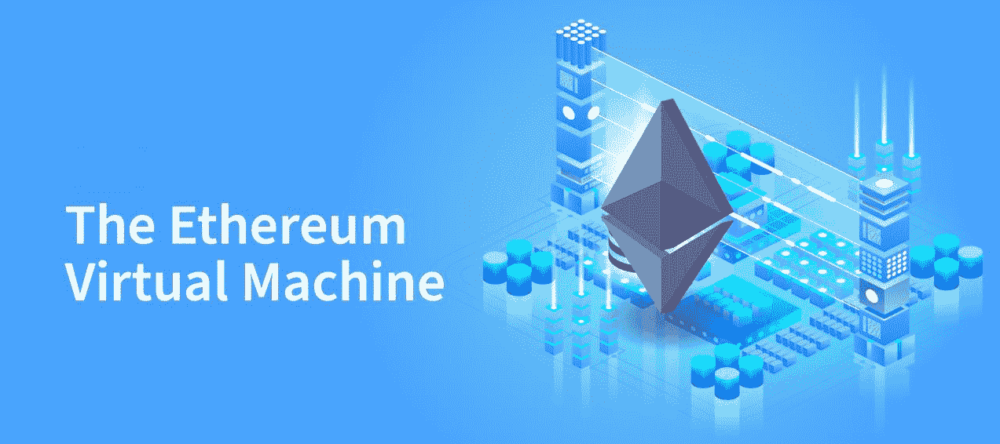

## EVM 入门指南

以太坊虚拟机的一个最常见的定义如下: **EVM 是一个图灵完全虚拟机，它能够完全按照预期执行代码。因此，它是以太坊和其他 EVM 兼容链上每个智能合约的运行时环境。**

看上面的定义，大概有你不完全理解的部分。例如，你可能不知道什么是虚拟机，更不用说什么是图灵完全虚拟机了。此外，您可能也不熟悉智能合约。因此，在我们关注什么是 EVM API 之前，我们必须先看看这三个概念。

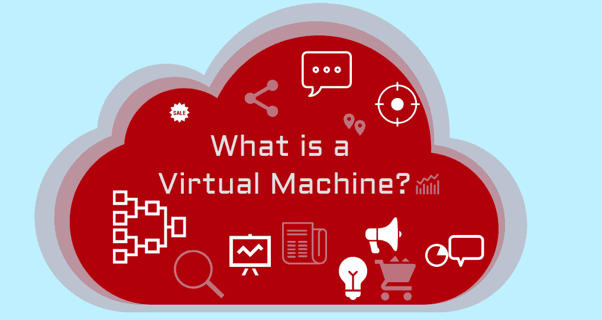

### 什么是虚拟机？

与通常的操作系统(OS)相比，虚拟机(VM)是一种尝试更高级别的抽象的机器。我们通常区分 Windows 或 macOS 等操作系统和虚拟机，因为虚拟机是在常用操作系统之上创建的。因此，虚拟机能够像物理计算机器一样运行。正是由于虚拟体系结构，虚拟机才能够接近物理机的计算能力。此外，虚拟机能够在许多不同类型的操作系统和硬件上运行。后者使它们成为分散式生态系统所需要的引擎。

虚拟机的另一个好处是可以利用世界上任何地方的其他网络参与者的资源。因此，网络用户能够克服物理位置或地理的限制。此外，人们可以使用这些资源构建、处理和执行各种动作。正是这一点使 EVM 能够像一个全球处理器或计算机一样运作。后者只是将其积累的计算能力借给参与的开发者。因此，开发人员可以使用这些资源来创建智能合同和 dapps，这丰富了生态系统。

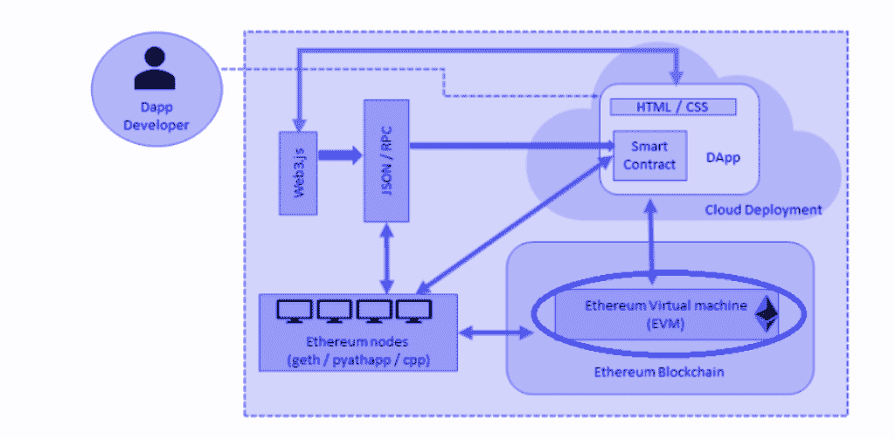

参与以太坊节点使开发人员能够从世界任何地方访问 EVM。此外，值得指出的是，将计算能力借给网络是自愿的。然而，有几个激励因素在起作用。考虑到虚拟机的基本属性，结合通过自愿网络处理所有数据的需求，虚拟机类型的架构对以太坊最有意义。

### 图灵完全虚拟机

如果你记得 EVM 的定义，你知道 EVM 是图灵完全的。因此，我们必须告诉你什么是图灵完全性。这个概念是基于计算机科学家艾伦·图灵确定的想法；因此“图灵”部分大写。图灵是第一个提出思考机器(一台假设的计算机)能做什么的人。此外，他的想法解决了计算机和人类处理思想的方式之间的差异。此外，他认为计算机根据一套数据处理规则“思考”来解决问题。艾伦还谈到这台思维机器将如何处理一卷磁带。后者有一行符号或功能，可以前后移动。

此外，图灵的论文解释说，“自动机器”能够处理或改变一个符号。此外，这种机器一次只能关注一个“状态”(“状态”的概念)。这卷假想的磁带相当于一台计算机的内存。就像我们可以增加虚拟磁带卷的长度一样，我们可以无限增加内存。考虑到这一点，应用于计算机遵循的一组指令的数据只受物理约束的限制。因此，图灵完全虚拟机是那些遵循阿兰图灵的想法的虚拟机。

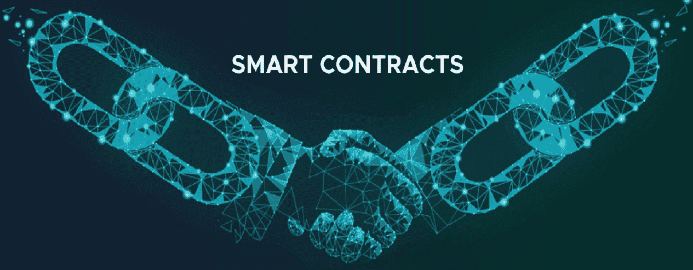

### 智能合同基础

智能合同或 Web3 合同本质上是软件或程序的链上部分。在 EVM 兼容链的情况下，它们是用 Solidity 编程语言编写的。本质上，智能合约确保 dapps、交易和其他链外和链内事件按照规则运行。因此，当满足预定义的条件时，预定义的动作就会发生。抛开一切不谈，每一个以太坊智能合约都只是代码(函数)和数据(状态)的集合，存储在以太坊链上的特定地址。后者被称为智能合同地址。

此外，Web3 合约是一种以太坊账户。因此，他们有一个平衡，可以发送交易，但他们不受用户控制。一旦部署到网络上，它们就会按照程序运行。此外，用户帐户与智能合约帐户交互-他们提交触发合约上定义的特定功能的交易。此外，与 Web3 合同的交互是不可逆的。此外，默认情况下不能删除合同。

希望现在你已经知道了什么是虚拟机、图灵完备性和智能契约，EVM 的定义就更加清晰了。心想，可以探索一下 [*什么是以太坊虚拟机*](https://moralis.io/evm-explained-what-is-ethereum-virtual-machine/) *？”在 Moralis 家的博客上。然而，现在是我们把注意力转移到“EVM API”拼图的第二块的时候了。*

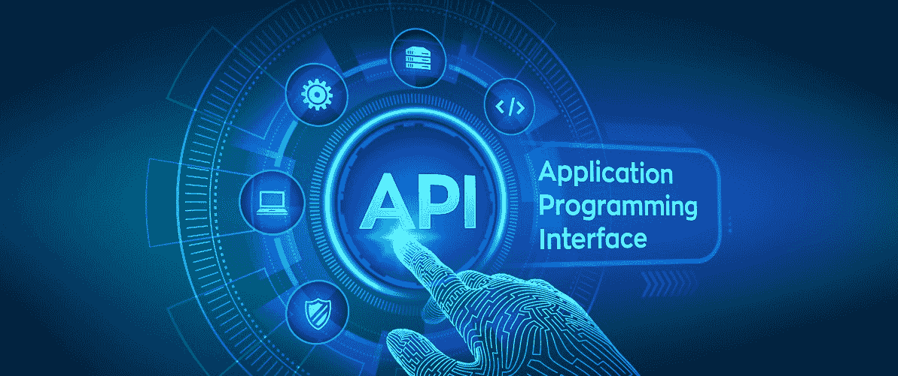

## 什么是 API？

应用程序编程接口或 API 是使软件能够与其他软件进行交互的接口。它通过使不同的指令集能够被翻译或以某种方式传递以相互理解来支持这种通信。因此，API 允许在稳定的环境中进行一致的编码。因此，发送到可复制函数的每个请求都确保了一致且可预测的响应。显然，这使得编程变得更加简单。从本质上讲，API 使开发人员能够避免重新发明轮子，并在他们的应用程序中使用现有的 API 集。

此外，API 可以关注不同的领域。例如，我们有 PC API、web API 等等。这里，需要指出的是，web APIs 支持不同系统之间的交互。但是，从本质上讲，web APIs 也只是一组指令、定义和协议。

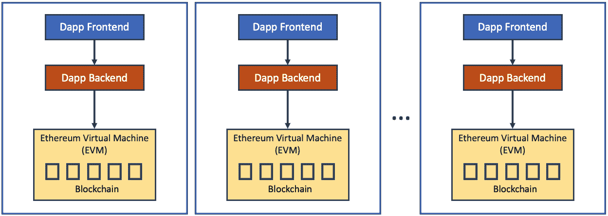

## 什么是 EVM 空气污染指数？

鉴于我们已经介绍了 EVM 和 API，您现在知道 EVM API 只不过是一组指令、定义和协议，支持基于 EVM 运行的软件之间的通信。这包括不同智能合约之间的通信，以及其他代码片段。因此，EVM API 使得使用以太坊虚拟机成为可能。因此，对于有兴趣在以太坊或其他 EVM 兼容链上构建 Web3 项目的开发人员来说，这是一个非常重要的工具。

因此，无论你想创建以太坊，BSC，多边形，或雪崩 dapps，最终的 EVM API 使世界的差异。它使开发人员很容易解决他们的任何 EVM 需求。此外，由于 Moralis 的 EVM API 是任何开发人员完成其所有 EVM 工作的最佳和最简单的方法，我们应该进一步探索它。

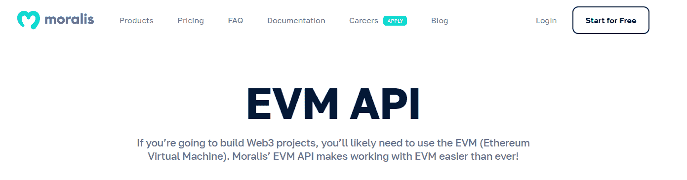

### Moralis EVM API

除非你一直生活在岩石下，否则你知道 Moralis 是最终的 Web3 开发平台。它擅长于例如 [Web3 认证](https://moralis.io/authentication/)、 [Web3 同步](https://moralis.io/syncs/)，以及提供全面的 [Web3 API](https://docs.moralis.io/moralis-dapp/web3-api) 。Moralis 家的 EVM API 是后者的核心。此外，最终的 EVM API 被整齐地分为不同的类别，包括“本机”、“帐户”、“令牌”、“解析”、“定义”、“存储”和“信息”。此外，在 moralis.io/evm-api/，你还可以找到各种各样的模式。

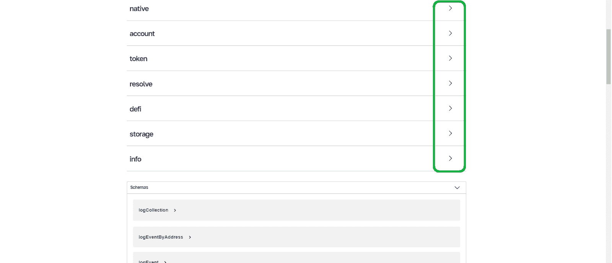

要浏览任何 EVM API 类别，您只需单击右侧的箭头。这将打开一个端点列表:

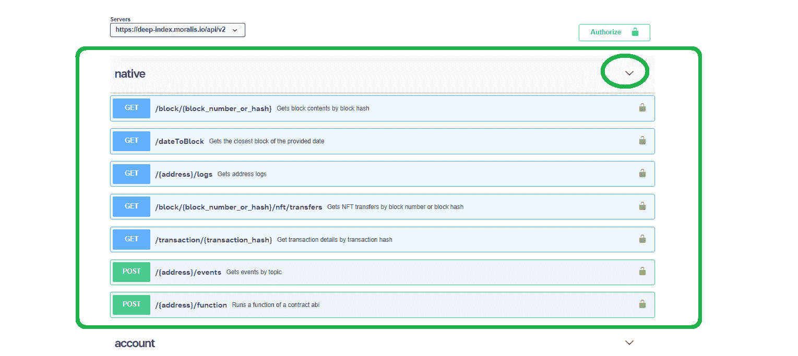

要使用任何端点，只需将它们复制并粘贴到代码中:

然而，由于大多数端点都接受特定的参数，所以明智的做法是首先了解更多关于您想要使用的端点的信息。因此，只需单击有问题的端点，您就会看到您可能感兴趣的所有详细信息:

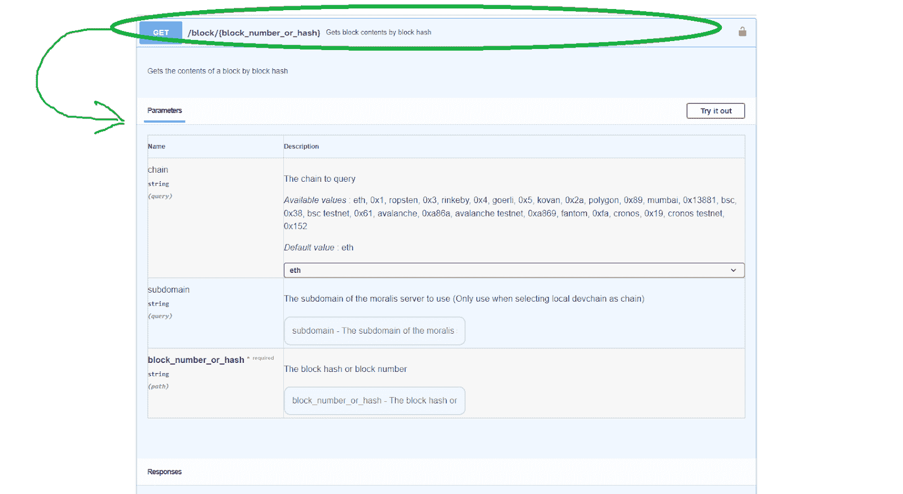

因此，您可以了解关于输入参数您需要知道的一切。为此，也有一些例子。此外，您还可以通过“尝试”按钮来尝试有问题的端点。然后，您还可以探索响应。

#### 你能用终极 EVM API 做什么？

下面是终极 EVM API 得到的动作列表:

*   按块散列块内容
*   所提供日期的最近时间段
*   地址日志
*   NFT 按块号或块散列传输
*   按事务哈希列出的事务详细信息
*   按主题列出的事件
*   本地交易
*   特定地址的令牌余额
*   ERC20 令牌交易
*   给定地址拥有的 NFTs
*   NFT 在给定的地址来回转账
*   给定地址拥有的 NFTs
*   NFT 通过市场交易
*   NFT 代币合约的最低价格
*   令牌元数据
*   代币合约的 ERC20 交易
*   允许支出者从所有者处提取的金额
*   象征性价格
*   基于元数据搜索的 NFT 数据
*   NFT 从一个块号转移到另一个块号
*   给定契约中的唯一 NFT
*   给定合同的 NFT 转让
*   给定合同的 NFT 的所有者
*   特定地址的本地余额
*   给定合同的全局元数据
*   令牌元数据
*   具有给定协定的给定 id 的 NFT
*   基于 uni WAP-v2 的交易所的流动性对储备
*   给定合同的 NFT 所有者
*   基于令牌 0 和令牌 1 地址的地址对

它还:

*   返回 wWeb3 API 版本
*   上传多个文件并将它们放在一个文件夹目录中
*   返回费率限制和成本的端点价目表
*   同步 NFT 指数的合约
*   解析不可阻挡的域并返回地址
*   返回可用的 ENS 域(仅适用于 ETH)
*   重新同步给定令牌 ID 的元数据
*   运行合同 ABI 的功能

正如你所看到的，你可以用 Moralis 的 EVM API 做很多事情。因此，一定要好好利用它。

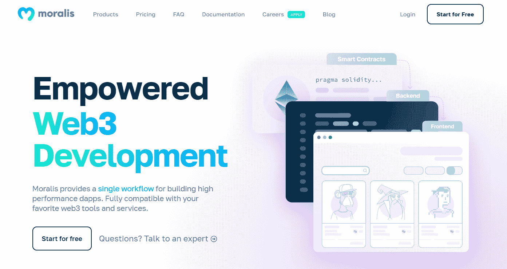

## 终极 EVM API–2022 年完整指南–摘要

在今天的文章中，您通过将“EVM”和“API”的含义放在一起，了解了什么是 EVM API。因此，您现在知道了 EVM API 是一组指令、定义和协议，它支持基于 EVM 运行的智能合约之间的通信。此外，您还了解了 EVM 是一个图灵完全虚拟机，它能够完全按照预期执行代码。因此，EVM 也是以太坊和其他 EVM 兼容链上每个智能合约的运行时环境。此外，您有机会近距离了解了 Moralis 的 EVM API，并了解到它可以帮助您在以太坊和其他 EVM 兼容链上完成几乎所有您能想到的事情。因此，您现在可以开始构建了。

如果你已经有了一些很酷的 dapp 想法，那就开始做吧！如果你没有，那么你可能想先做一些我们的示例项目。通过这种方式，您将通过亲身体验来了解更多关于终极 EVM API 的知识。在 Moralis 的 [Web3 博客](https://moralis.io/blog/)和 [Web3 YouTube 频道](https://www.youtube.com/c/MoralisWeb3)上，你可以找到各种各样的教程。因此，你可以创建各种 dapps，包括一些流行的 Web2 应用程序的惊人的 Web3 克隆。此外，您还可以使用 Moralis 的 Unity Web3 SDK 深入研究 Web3 游戏设计。否则，向顶级 [NFT 程序员](https://nftcoders.com/)学习如何做 [NFT 赌注](https://nftcoders.com/the-2022-guide-to-nft-staking-how-to-stake-nfts/)、 [NFT minting 网站开发](https://nftcoders.com/create-an-nft-minting-website-in-5-steps/)，或者[如何在几分钟内开始生成 NFT](https://nftcoders.com/begin-generating-nfts-in-15-minutes/)！尽管如此，如果你想成为区块链认证者，[Moralis 学院](https://academy.moralis.io/)是你的不二之选。除了顶级加密课程，这也是获得专家指导、个性化学习路径和不可替代的同行支持的地方。