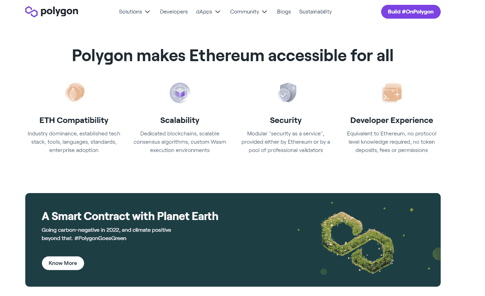
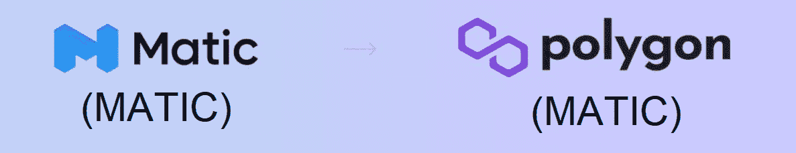
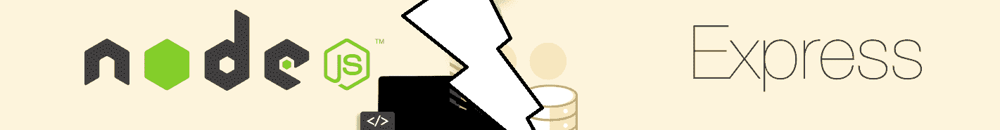
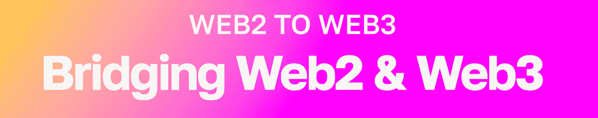
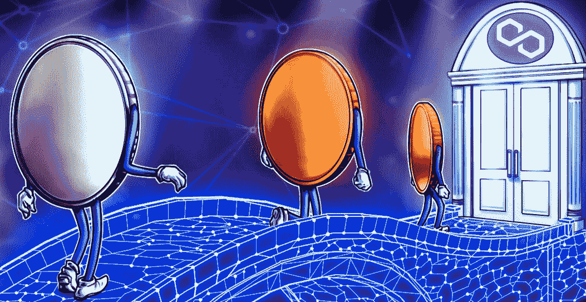
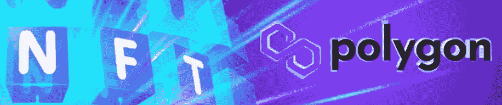
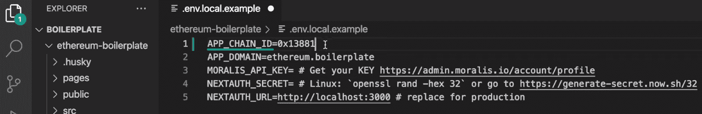

# 教程:如何将 Dapp 连接到多边形网络

> 原文：<https://moralis.io/tutorial-how-to-connect-a-dapp-to-polygon-network/>

许多在以太坊体验过高昂的煤气费的人已经将注意力转向了别处。在这样做的时候，他们很可能发现了 Polygon(以前的 Matic)。这种分散的扩展平台使用户能够以最低的成本执行链上交易。正因为如此，构建多边形 dapps 的开发者可以通过向用户提供多边形网络的好处而受益匪浅。如果这听起来很有趣，并且您想进一步探索多边形开发，请跟随我们探索如何将 dapp 连接到多边形。此外，本文展示了如何连接到多边形网络这一任务可以在几分钟内轻松完成！

多亏了当前 Web3 技术栈的先进工具，上述任务才成为可能。毕竟，近年来技术已经取得了长足的进步。此外，使用像 Moralis 这样优秀的跨链工具和平台，您可以使用您的 Web2 开发技能在各种网络上创建杀手级 dapps(去中心化应用程序)。此外，通过 Moralis(领先的企业级 Web3 API 提供商)，您可以结合 NodeJS 和 Moralis 的 EVM API 的力量来创建后端 dapp，并毫不费力地连接到 Polygon 网络。

你也可以使用终极以太坊样板，它支持所有 EVM 兼容链，包括多边形。毫无疑问，这个样板文件是构建和连接 dapp 和 Polygon 的最快方法。因此，在今天的文章中，我们还将向您展示如何使用这个快捷方式。因此，请务必[创建您的免费 Moralis 账户](https://admin.moralis.io/register)并跟随我们的脚步！

*获取 Web3 开发的最新信息—*[*加入 Moralis 杂志*](https://moralis.io/joindiscord/) *！*


## 多边形网络解释

在我们深入了解如何将 dapp 连接到多边形网络的过程之前，让我们先了解一下多边形网络需要什么。以太坊是第一个可编程链，我们实际上可以感谢以太坊的多边形网络。毕竟，是以太坊的日益普及造成了网络拥堵和天文数字的交易费用。因此，在最近的加密牛市中，开发 dapps 在经济上具有挑战性。因此，可扩展的解决方案突然变得非常受欢迎。其中一个著名的解决方案是 Matic，它于 2021 年 2 月更名为 Polygon。

Polygon 是一个去中心化的以太坊缩放平台。因此，这是以太坊网络面临的拥塞问题的潜在解决方案。换句话说，Polygon 是一个更具经济可持续性的开发平台。这有助于确保开发人员可以创建 dapps，而无需在汽油费上花费大量资金。此外，值得注意的是，它这样做并没有损害以太坊区块链的安全性。因此，将 dapp 连接到 Polygon 是非常有意义的。



此外，Polygons 的标语——“将世界带入以太坊”——告诉你他们不是在与以太坊竞争。相反，他们正与领先的开发区块链合作，帮助创建一个良好的 Web3 基础设施。由于与以太坊的关系，这两个网络有许多相似之处。首先，Polygon 使用相同的令牌标准(ERC-20、ERC-721 和 ERC-1155)。此外，多边形的本地令牌(MATIC)是一个 ERC-20 令牌。关于 MATIC，Polygon 用户利用该网络的本地货币来管理该链。当然，它也作为支付相对较低的交易费用。

尽管如此，直到以太坊合并，多边形和以太坊使用不同的共识机制。然而，这两家连锁店现在都采用了一种更具可扩展性的替代方案——利益相关证明(PoS)。



### 是 Matic 多边形吗？

如果你读了介绍和“多边形网络解释”部分，你已经知道多边形最初被称为 Matic。虽然更名发生在 2021 年 2 月，但这并没有影响连锁店的本地令牌的符号。后者仍然是 MATIC。因此，MATIC 和 Matic 是两回事。前者是被“Polygon”取代的网络的原始名称，而 MATIC 是 Polygon 原生加密货币的代号。当您学习连接到多边形网络时，请记住这一点。

另外，让我们也指出，像大多数开发区块链一样，Polygon 提供了它的 testnet/devnet。后者被称为孟买，它使用“测试”MATIC 作为其本土货币。这种测试货币完全独立于 Polygon 的本地令牌。因此，虽然你必须购买真正的 MATIC，但你可以使用孟买 testnet 水龙头免费获得“测试”MATIC。


## 使用 Moralis 的 API 将多边形连接到 Dapp

由于 Moralis 的跨平台互操作性，有许多方法可以将 dapp 连接到 Polygon。然而，如前所述，我们在这里将重点关注 NodeJS(或 Moralis 的 JS SDK)的使用。因此，您需要完成以下五个步骤来将 dapp 连接到多边形:

1.  **创建节点 JS Dapp**
2.  **导入并设置最新的 Moralis JS SDK**
3.  **设置简单快捷服务器**
4.  **将您的 Dapp 与 Moralis 服务集成**
5.  **从多边形中获取区块链数据**

在前进之前，您需要考虑一些先决条件。所以，如果你还没有这样做，现在就设置你的免费 Moralis 账户。此外，准备好您喜欢的代码编辑器(我们使用 Visual Studio 代码[VSC])，并安装 NodeJS。完成这些任务后，您就可以连接到多边形网络了。


### 创建 NodeJS Dapp

首先，创建“Simple-NodeJS”文件夹并在 VSC 中打开它。*当然，你可以随意命名你的文件夹；然而，为了避免混淆，我们鼓励您使用与我们相同的名称*。接下来，在 ide 中打开一个新的终端:


然后，初始化一个新项目。您可以通过在终端中输入“ *npm init* ”来完成此操作。输入该命令后，界面将要求您命名项目并选择您的首选项。但是，请随意坚持使用默认选项。因此，只需按“回车”几次。如果已经成功初始化了 NodeJS 项目，那么在项目的文件树中应该有一个“package.json”文件。

### 导入和设置最新的 Moralis JS SDK

是时候导入并设置最新的 Moralis JS SDK 了。幸运的是，一个简单的命令就可以解决这个问题。本质上，您只需要安装" *moralis* "依赖项。然而，跳过一步，让我们同时安装" *express* "依赖项。因此，使用您的终端执行“ *npm install moralis express* ”命令。



### 设置简单快速服务器

因为您已经安装了" *express* "依赖项，所以您可以专注于设置您的 express 服务器。为此，您需要创建一个“index.js”文件。然后，用以下代码填充该文件:

```js
const express = require('express')
const app = express()
const port = 3000

app.get('/', (req, res) => {
  res.send('Hello World!')
})

app.listen(port, () => {
  console.log(`Example app listening on port ${port}`)
})
```

此外，还要确保将“ *start* ”脚本添加到“package.json”文件中:

```js
"scripts": {
  "start": "node index.js"
},
```

现在您已经拥有了运行 Express 服务器所需的一切。因此，可以随意执行“ *npm run start* ”命令并访问“ *http://localhost:3000* ”。你应该会听到“你好，世界！”消息。



### 将您的 Dapp 与 Moralis 服务集成

通过将 dapp 与 Moralis 服务集成，您将导入包括 Polygon API 的 Moralis EVM API。为此，您将使用“index.js”文件。此外，这也是您需要粘贴 Moralis Web3 API 密钥的地方。我们将很快向您展示如何获得 API 密钥，但是首先，在“index.js”文件的顶部添加以下代码行:

```js
// Import Moralis
const Moralis = require('moralis').default
// Import the EvmChain dataType
const { EvmChain } = require("@moralisweb3/evm-utils")
```

接下来，添加以下三个变量:

```js
const MORALIS_API_KEY = "replace_me"
const address = "replace_me"
const chain = EvmChain.POLYGON
```

正如您所看到的，上面定义的变量需要特定的值。在“ *MORALIS_API_KEY* ”旁边，需要粘贴你的 API key。对于地址，请给出有效的多边形链地址。此外，由于我们的目标是连接到多边形网络，我们需要使用“ *EvmChain。多边形的*值。

*注* *:要查看 Moralis 支持的其他链，请访问“* [*EVM API 概述*](https://docs.moralis.io/reference/evm-api-overview) *”文档页面。这也是一个了解终极 EVM API 所涵盖主题的地方。*

#### 获取您的 Moralis Web3 API 密钥

此时，您应该已经启动并运行了您的 Moralis 帐户。因此，您可以使用您的凭证来访问您的 Moralis 管理区。在那里，您将能够通过两个简单的步骤复制您的 Moralis Web3 API 密钥。首先，从侧面菜单中选择“Web3 APIs”选项。其次，单击 API 密钥旁边的“复制”图标:


然后，返回到“index.js”文件，用上面复制的密钥替换“ *replace_me* ”。此外，不要忘记通过添加以下代码行来初始化 Moralis:

*const start server = async()=>{*

*等待 Moralis.start({*

*apiKey: MORALIS_API_KEY，*

*)*

### 将 Dapp 连接到多边形–获取区块链数据

初始化 Moralis 并输入适当的值后，您可以开始实现各种 Web3 API 调用。由于 Moralis EVM API 提供了许多选项，我们无法在此一一介绍。然而，通过向您展示如何获取本机余额、ERC-20 余额和 NFTs，您可以自己轻松地探索其他 API 端点。


#### 获取本地余额

当您将 dapp 连接到多边形时，您可以使用 Moralis ' "*getNativeBalance*"端点获取 MATIC balance。如果您想以简洁的方式完成这些，我们鼓励您在“index.js”文件中创建“ *getDemoData* 函数:

```js
async function getDemoData() {
  // Get native balance
  const nativeBalance = await Moralis.EvmApi.balance.getNativeBalance({
    address,
    chain,
  })

  // Format the native balance formatted in ether via the .ether getter
  const native = nativeBalance.result.balance.ether

  return { native }
}
```

此外，“*getNativeBalance*”EVM API 端点接受“*地址*”和“*链*参数。在这里，您可以使用之前定义的"*地址*和"*链*"值。

此外，确保您还添加了“ */crypto-data* ”端点。后者将返回“ *getDemoData* 函数的结果，并允许您使用“*http://localhost:3000/demo*查看响应:

```js
app.get("/demo", async (req, res) => {
  try {
    // Get and return the crypto data
    const data = await getDemoData()
    res.status(200)
    res.json(data)
  } catch (error) {
    // Handle errors
    console.error(error)
    res.status(500)
    res.json({ error: error.message })
  }
})
```

通过调用上述端点，您可以查看以下格式的响应:

```js
{
    "native": "0.169421625822962794"
}
```



#### 获取 ERC-20 天平

今天，有许多 ERC 20 代币。当然，大多数在以太坊链上，但也有很多在多边形链上。因此，您可以使用“ *getWalletTokenBalances* ”端点来获取特定地址的所有 ERC-20 令牌的余额。要实现此功能，请将以下代码行添加到“ *getDemoData* ”中:

```js
    // Get token balances
  const tokenBalances = await Moralis.EvmApi.token.getWalletTokenBalances({
    address,
    chain,
  })

  // Format the balances to a readable output with the .display() method
  const tokens = tokenBalances.result.map((token) => token.display())

  // Add tokens to the output
  return { native, tokens }
}
```



#### 获取 NFT

多边形链上有几个流行的 NFT，现在你知道如何连接到多边形网络，你可以很容易地获取它们。通过将下面几行代码添加到您的" *getDemoData* "函数中，您可以获取给定地址的前十个 NFT:

```js
   const nftsBalances = await Moralis.EvmApi.nft.getWalletNFTs({
    address,
    chain,
    limit: 10,
  })

  // Format the output to return name, amount and metadata
  const nfts = nftsBalances.result.map((nft) => ({
    name: nft.result.name,
    amount: nft.result.amount,
    metadata: nft.result.metadata,
  }))

  // Add nfts to the output
  return { native, tokens, nfts }
}
```

***注*** *:* *要查看此处显示的“index.js”文件的完整最终代码，请访问“* [使用 NodeJS](https://docs.moralis.io/docs/nodejs-dapp-from-scratch) *”文档页面。但是，请记住，那里的代码侧重于以太坊链。所以，如果你决定复制那个代码，用它来连接 dapp 和 POLYGON，就用“Polygon”代替“ETHEREUM”。此外，您还需要将示例地址替换为面链上的有效地址。*


## 构建 Dapp 并将其连接到多边形网络

既然您已经知道了如何使用 Moralis 的 EVM API 创建 NodeJS dapp，那么您就知道了如何处理后端 dapp。此外，Moralis 可以让您以最小的努力提供一个引人注目的前端。这就是下面的视频教程要给你展示的。在下面的视频中，跟随我们内部专家的指导，您将学会快速轻松地构建和连接 dapp 到 Polygon。

此外，不要让“以太坊-样板”的名称欺骗了你。毕竟，您现在知道 Polygon 是一个 EVM 兼容链，这意味着您可以使用相同的样板文件。你需要做的就是输入多边形链的 ID。你将在下面的视频中学习如何做，从 3:42 开始。此外，请记住，本视频教程主要关注 Polygon 的 testnet(链 ID *0x13881* ):



然而，如果你用“ *0x89* ”来替换那个 ID，你将会把目标对准 Polygon 的 mainnet。

最终，通过使用终极以太坊样板，你只需三个步骤就能[创建一个去中心化的应用程序:](https://moralis.io/how-to-create-a-decentralized-app-in-just-3-steps/)

1.  克隆 GitHub 上等待你的以太坊样板代码。
2.  自定义特定的环境变量，并连接到您想要的任何链。
3.  启动这个 [Web3 网站模板](https://moralis.io/web3-template-build-a-dapp-using-a-web3-website-template/)的实例。

通过完成以上三个步骤，你可以在不到七分钟的时间内准备好一个多边形 dapp。

https://www.youtube.com/watch?v=Bb5Pc–kyAY&t=10s

## 关于如何将 Dapp 连接到多边形网络的教程–摘要

在本文中，我们首先向您介绍多边形网络的基础知识。因此，你发现多边形是一个 EVM 兼容链。你也有机会一劳永逸地澄清“自动与多边形”的混淆。因此，你现在知道 MATIC 在 2021 年更名为 Polygon，而连锁店的原生硬币仍然是 Matic。然后，我们向您展示了如何使用 Moralis 的 API 将 Polygon 连接到您的 dapp。首先，我们专注于使用 NodeJS 创建后端 dapp，我们将它连接到 Moralis 的 EVM API。我们还演示了如何在将 dapp 连接到 Polygon 后获取一些链上数据。最后，我们分享了一个视频教程，展示了如何在 7 分钟内创建一个 NextJS dapp。因此，您现在知道如何将 dapp 连接到多边形或其他 EVM 兼容链。

有了这里获得的知识，您就可以开始 Web3 开发之旅的下一步了。如果你喜欢通过承担各种示例项目来学习，你应该探索一下 [Moralis YouTube 频道](https://www.youtube.com/c/MoralisWeb3)和 [Moralis 博客](https://moralis.io/blog/)。在那里，你可以找到大量优秀的教程。一些最新的文章教你如何[使用 Azure 函数](https://moralis.io/how-to-connect-playfab-with-web3-using-azure-functions/)将 PlayFab 与 Web3 连接，如何[使用 NextJS](https://moralis.io/how-to-connect-metamask-to-website-with-nextjs/) 将 MetaMask 与网站连接，如何[用五个步骤构建一个以太坊 dapp](https://moralis.io/full-guide-how-to-build-an-ethereum-dapp-in-5-steps/) ，甚至如何构建一个 [Web3 FIFA](https://moralis.io/how-to-build-a-web3-fifa-clone/) 克隆。

另一方面，你可能希望在专家的指导下开始一条个性化的学习之路。后者在[Moralis 学院](https://academy.moralis.io/)等着你，在那里你可以获得区块链认证。通过完成区块链发展课程，如[区块链商业大师班](https://academy.moralis.io/courses/blockchain-business-masterclass)课程，你增加了获得一份完美加密工作的机会。