# 终极指南:如何构建以太坊 dApps

> 原文：<https://moralis.io/ultimate-guide-how-to-build-ethereum-dapps/>

区块链项目、DeFi 应用、dApps 和 Web3 应用正在席卷全球。分散式应用程序的出现，或者说 [**dApps**](https://moralis.io/how-to-build-decentralized-apps-dapps-quickly-and-easily/) **，可以为所有权、交互和治理带来新的范例。然而，在谈论 Web3 应用和 dapp 时，不可能不谈论以太坊 dapp。以太坊作为最流行的 dApp 框架的出现意味着以太坊 dApp 开发比以往任何时候都更重要。因此，任何进入区块链的程序员都应该学习如何构建以太坊 dApps。**

到目前为止，以太坊 dapp 在活跃 dapp 总数、活跃用户、交易和交易量(以代币和美元计算)方面仍然占据市场主导地位。随着越来越多的开发者进入区块链行业，我们期待在 2021 年及以后有更多的升级和令人兴奋的应用。

作为一名程序员和有抱负的区块链开发者，你可能想知道如何成为这个快速发展的行业的一部分，并最终构建以太坊 dApps。如果你是区块链的新手，或者是一般的开发新手，我们推荐你去看看 Ivan 在技术学院的 [JavaScript 编程](https://academy.ivanontech.com/courses/javascript-programming-for-blockchain-developers)课程和 Moralis 关于 [Web3](https://moralis.io/web3-and-javascript-what-is-javascript-and-web3-js/) 和 JavaScript 作为基础知识的文章。

如果你需要更新关于 dApps 和它们是什么的知识，请务必阅读这篇来自 Moralis 博客的关于[去中心化应用](https://moralis.io/decentralized-applications-explained-what-are-dapps/)的文章。如果您已经熟悉以上所有内容，那么我们建议您直接阅读以下关于如何使用 Moralis 在以太坊上创建第一个 dApp 的深入指南:

https://www.youtube.com/watch?v=jdx2H1alijQ

# 用最少的努力建造以太坊 dApps

有了 Moralis 和它强大的平台，你可以毫不费力地在以太坊上创建 dApps。此外，在本文中，您将学习一种新的方法来构建以太坊 dApps，而无需许多开发人员在 Web3 项目中所涉及的耗时的后端工作。

您可以将构建 dApp 的过程分为三个主要部分:

1.  Web2 组件构成了前端创建，它与用户互动，并负责 dApp 的外观、实用性和最终的市场吸引力。
2.  因为它是分散的，所以 Web3 组件允许它与网络、EVM(以太坊虚拟机)交互，并运行自己的以太坊节点。
3.  智能合约组件定义了应用程序的业务逻辑。

此外，即使对有经验的开发人员来说，构建后端基础设施也是一条艰难的学习曲线。因此，复杂的步骤可能会分散你对前端设计的注意力，而前端设计对于提高用户兴趣和吸引力是非常重要的。

### 快速构建以太坊 dApps

为了解决与后端基础设施相关的问题，并使开发人员能够快速创建和启动非凡的 dApps，Moralis 提供了一整套开发人员工具，让您触手可及 Web3 的强大功能。例如， [Moralis Speedy Nodes](https://moralis.io/speedy-nodes/) 和各种 Moralis APIs，如 [Moralis Price API](https://moralis.io/introducing-the-moralis-price-api/) 和 [Moralis NFT API](https://moralis.io/announcing-the-moralis-nft-api/) 可帮助您显著加快与区块链的联系和工作。在本文接下来的部分中，我们将探讨如何使用 Moralis 的平台及其令人难以置信的工具将开发时间从数周缩短到几分钟。

## 如何在以太坊上构建

构建以太坊需要对编程语言 Solidity 和智能合约背后的原理有一个基本的理解。此外，你还需要了解 EVM(以太坊虚拟机)是如何工作的，因为它是一个至关重要的组件，并与 Solidity 密切合作，我们即将发现这一点。但首先，我们来看看 Solidity 的编码语言。

### 固态

好吧，那么[什么是稳固？](https://moralis.io/solidity-explained-what-is-solidity/)简而言之，Solidity 是一种易于理解的高级编程语言，旨在适应构建智能合同所需的“人类逻辑”。它于 2014 年提出，其创建者在构建它时考虑到了“开发者社区扩展”。结果，由于它的用户友好性，它以最快的方式让许多开发者加入了以太坊的生态系统。

Solidity 的语法与 JavaScript 非常相似，这就是为什么你首先需要理解和编写 JavaScript。此外，Solidity 从流行语言中借用了许多概念，它还融入了 Python 和 C++等其他语言的元素。因此，您将会遇到诸如支持库、复杂的用户定义类型和继承等特性。

Solidity 可以被简明地定义为一种面向对象的静态类型语言，主要用于在以太坊上创建智能合同，以及在区块链上自动完成交易。静态类型化意味着每个变量的类型，无论是状态变量还是局部变量，都需要规范。它还允许您将基本类型组合成更复杂的类型。

你需要精通坚固性来解锁在以太坊上建造的许多可能性，包括学习如何建造以太坊 dApps。通过使用为有抱负的 Solidity 开发者创建的许多在线资源，你将更好地理解 Solidity，并掌握如何使用它来创建智能合同。更重要的是，这些资源很多都是免费的，很容易获得。

### 以太坊虚拟机

EVM 或以太坊虚拟机是执行 Solidity 代码的关键组件。EVM 是区块链上物理计算机或虚拟计算机的抽象。这种图灵完全机器允许人类水平的交易概念或想法被翻译成运行区块链应用程序的代码。

在幕后，编译器将人类级别或人类可读的代码分解为处理器可以读取并可在 EVM 上执行的机器代码。此外，你可以使用流行的在线编译器 Remix 进行免费的可靠性编译。

除了之前提到的以太坊编程课程，你可能还想看看伊凡在科技学院的[以太坊 101](https://academy.ivanontech.com/courses/ethereum-101) 课程。它很好地介绍了可靠性、EVM 和智能合约。还有，Moralis 有一篇文章叫做《 [EVM 解释——什么是以太坊虚拟机？](https://moralis.io/evm-explained-what-is-ethereum-virtual-machine/)”提供了关于这一关键组件的更多信息。

作为一种动态的、快速发展的语言，Solidity 拥有当今最大、最活跃的开发人员社区之一。为了跟踪新的发展，你可以查看一下 [Solidity GitHub](https://github.com/ethereum/solidity/projects/43) 项目。最终，一旦你熟练了，你就可以为它的语言设计做出贡献。

### 智能合同

智能合约是用户在区块链上互动的一个组成部分，也是区块链工作的一个组成部分。要学习如何构建以太坊 dApps，你需要深入了解智能合约的规则，以及如何用 Solidity 这样的编程语言来表达它们。

那么，[什么是智能合约？](https://moralis.io/smart-contracts-explained-what-are-smart-contracts/)智能合约是区块链上的程序，在满足特定条件时运行。当交易的参与者达成协议并满足预定条件时，它们就会被触发。与需要中间人的典型人际交往不同，这些合同是在区块链上虚拟执行的。换句话说，它们是自动化的，不需要可信的中央权威机构来验证它们。整个以太坊区块链网络验证交易，因此有“去中心化”一词。分布式网络取代了对可信方的需求。因此，该网络将所有交易的结果通知区块链的参与者。

### 智能合同的使用案例

当您构建以太坊 dApps 时，您需要了解智能合约可能有价值的许多设置。智能合同目前用于验证数字身份，金融科技应用，如跨境支付，保险索赔和各种行业的数据记录。它们还促成了交易平台(特别是分散化交易所或 dex)、自动化抵押贷款支付、新型治理系统和管理供应链的新方式的创建。此外，他们正在改变娱乐、艺术和收藏，代币奖励游戏和 NFT 的流行就证明了这一点。

智能合约还可以提高透明度，增强功能，加快流程，并使典型交易非中介化。因此，它们减少了官僚主义、集权和繁文缛节。他们还可以无缝、安全地执行跨境协议。这意味着你可以和世界另一端的人轻松地进行交易，就像他们就在你面前一样，还增加了隐私的好处。那些希望建立以太坊 dApps 的人可以进一步贡献智能合约今天已经实时证明的许多好处。

## 如何在以太坊上构建 dApps

成功构建和启动以太坊 dApps 最常见的障碍之一是多步后端基础设施需求。由于前端主要由构建界面的典型 Web2 过程组成，学习曲线(和不便)通常发生在从头开始学习设置 Web3 后端时。

Moralis 让你很容易地构建以太坊 dApps，因为它管理所有后端的麻烦，让你，开发者，专注于创建前端。许多开发人员仍然在努力无缝连接这两者。这是可以理解的，因为 dApp 的创建涉及许多细致的步骤，需要各种各样的 Web2 和 Web3 技术堆栈。

构建以太坊 dApps 所需的基本步骤是:

*   设置开发环境。
*   生成样板代码。
*   使用 Solidity 设计智能合约。
*   合同的编译和迁移。
*   编写单元测试。
*   为 dApp 创建 UI。
*   用户界面与 dApp 的接口。

此外，dApp 的典型技术体系需要:

*   设置本地区块链和服务器。
*   使用 Solidity 在以太坊上创建核心合同代码。
*   用工具(如柴、摩卡)进行单元测试。
*   前端设计部分利用了 HTML、CSS、Bootstrap 和 JavaScript。
*   Firefox 和 MetaMask 等浏览器工具的使用。
*   使用 Web3.js 的 Web 接口和使用 Truffle 设置框架。

在下一节中，您将了解 Moralis 的中间件解决方案如何让您精简这些步骤并减少技术堆栈需求。您可以轻松解决为 dApp 项目设置主机、测试主机以及在区块链上部署主机的典型问题。

## 如何开发以太坊 dApps

要成功构建以太坊 dApps，需要合适的中间件支持。通过提供无服务器选项和计算，Moralis 正在彻底改变整个 dApp 构建过程。那么，[什么是无服务器计算？](https://moralis.io/serverless-explained-what-is-serverless-computing/)这意味着 Moralis 处理您的后端服务器需求，节省您的硬件成本和宝贵时间。此外，Moralis 提供了一整套功能，使您能够在完全支持的后端基础架构上构建无服务器 dApps。这包括节点支持、更新和管理功能、跨链功能以及更快的扩展。

### 建造以太坊时不用服务器

随着以太坊 dApps 的竞争升温，你自然希望自己的项目能够快速到达用户手中。如果您想缩短开发时间，解决方案很简单:使用 Moralis，这是首屈一指的中间件平台。

## 步骤 1:获取一个 Moralis 服务器实例

在 Moralis 上注册以获得您的服务器。最棒的是，它是免费的！快速注册后，你会在界面的右上方看到一个按钮，上面写着“+创建一个新服务器”。单击按钮。将出现一个下拉菜单，要求您从 mainnet、testnet 或 local devchain 中选择服务器选项。

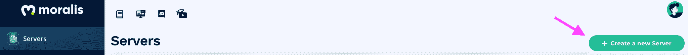

出于演示目的，我们将选择“Mainnet”。选择“Mainnet”后，您需要根据自己的喜好为其命名。然后，选择您所在的地区、所需的网络和连锁店。我们选择“新加坡”作为区域，“Eth (Mainnet)”作为链。

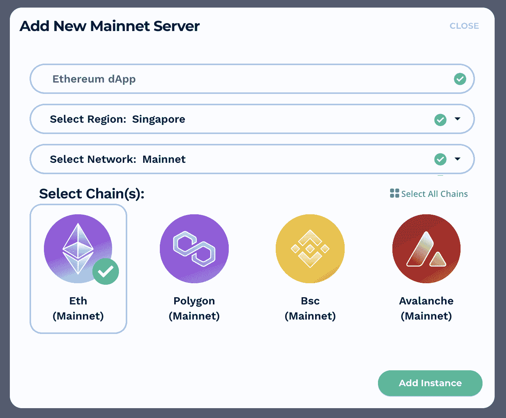

您会在右下角找到“添加实例”按钮。完成选择后，单击此处。设置可能需要几分钟，所以请坐好，伸展一下你的腿。

一旦你的服务器设置好了，它就会显示在你的屏幕上。单击服务器上的“查看详细信息”,查看服务器信息和其他有关配置的重要详细信息。

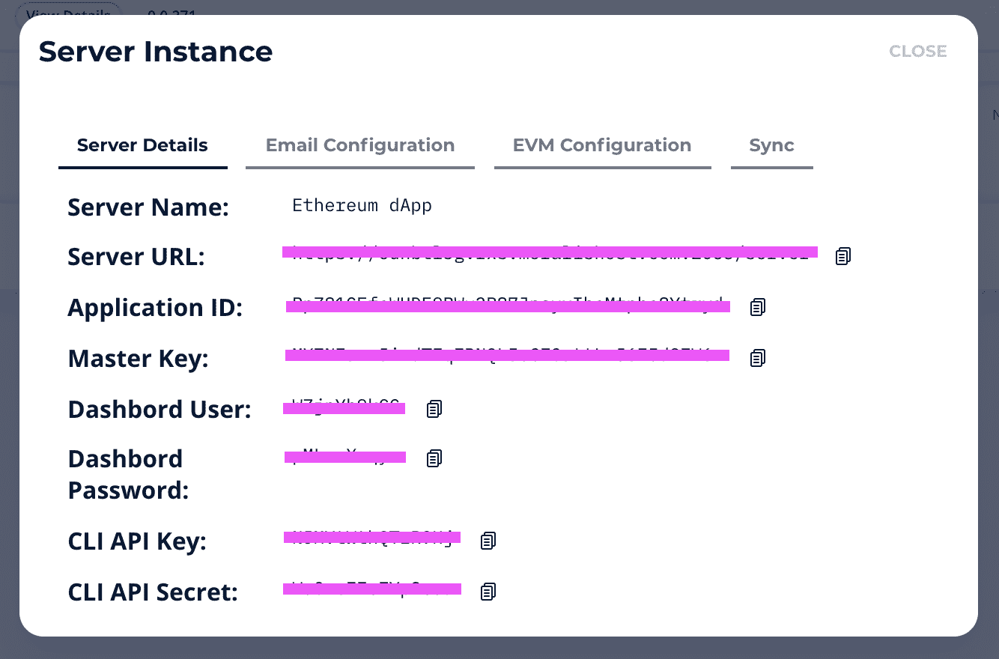

请注意，还有一种扩展服务器实例的方法。您只需点击服务器右侧的“…”即可完成此操作。

## 步骤 2:安装 Moralis SDK

下一步是安装 [Moralis SDK](https://moralis.io/exploring-moralis-sdk-the-ultimate-web3-sdk/) 。你可以在两个选项中选择:通过 CDN 或 NPM。

#### 使用 CDN

CDN 是将 Moralis SDK 引入 JavaScript 项目的最快方式。你可以通过[https://unpkg.com/moralis/dist/moralis.js](https://unpkg.com/moralis/dist/moralis.js)获得开发版。

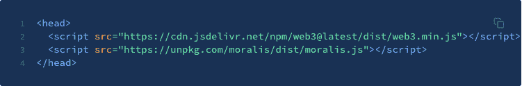

您需要修改代码以避免在生产中使用“最新的”。为了防止恶意的软件包更新，请始终指定版本，如下所示。要查找可用版本列表，请键入“ *npm info moralis versions* ”并用最新值替换< VERSION >。

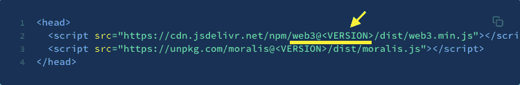

#### 使用 NPM

对于较大的版本，建议使用 NPM 模块。首先写下以下内容:

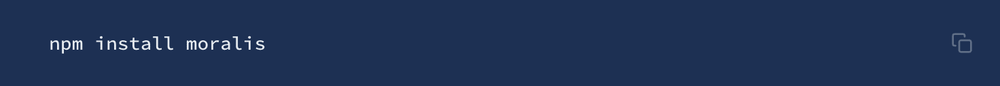

#### 基于浏览器的应用

要在基于浏览器的应用程序中使用 NPM 模块，请如下所示包含它:

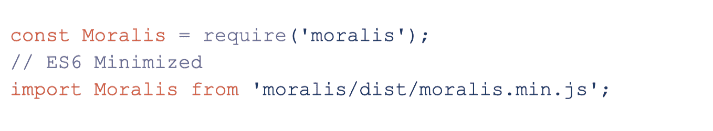

#### 服务器端应用程序

在服务器端应用程序或 Node.js 命令行工具中，包含“moralis/node ”,如下所示:

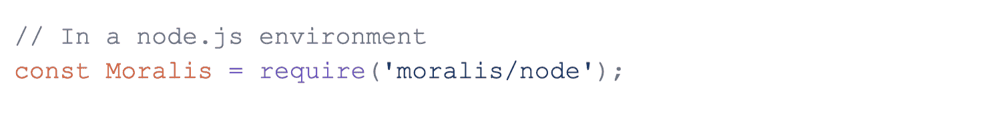

#### 对本机应用程序做出反应

在开发 React 本机应用程序时，包括如下所示的“moralis/react-native.js ”:

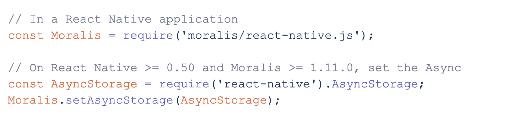

## 步骤 3:初始化 Moralis

完成上述所有步骤后，您终于可以初始化 Moralis 了，这样您就可以在代码中使用它了。要获取应用程序 ID 和服务器 URL，请在您的服务器上单击“查看详细信息”,在弹出窗口中查看它们并复制信息。

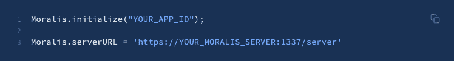

警告:仅在安全的环境中使用主密钥。千万不要在应用程序的客户端部分使用它。如果您的开发需要主密钥，请提供以下内容:

## 为什么你节省时间用 Moralis 建造以太广场

当构建一个 Web3 应用程序时，比如以太坊 dApp，你可能会花时间来设置后端。然而，Moralis 让您在一个平台上只需点击几下鼠标和几行代码就可以完成所有这些工作。

一旦你初始化了 Moralis，Moralis 的 SDK 提供了灵活的 API，可以与你喜欢的 JavaScript 库配对。这将最大限度地减少配置步骤，并进一步减少您的开发时间。然后，您可以开始使用 Moralis 快速构建 dApp 的 JavaScript 或 HTML5 前端部分。

#### 浏览器支持

对于基于浏览器的 dApps，你会很高兴知道 Moralis 的 SDK 支持 Firefox 23+、Chrome 17+、Safari 5+和 IE 10。请注意，IE 9 只支持 HTTPS 托管的 dApps。

有了所有这些便利，以及更多唾手可得的特性，您应该能够在尽可能短的时间内构建您的 dapp，最简单的 dapp 只需几分钟而不是几周！

## 如何构建以太坊 dApps–总结

有了 Moralis 管理您的后端，就以太坊 dApp 开发而言，没有什么是您不能完成的。你可以在你的 dApp 中引入许多令人兴奋的功能和特性，同时确保它看起来不错，容易导航以吸引用户。因此,“如何构建以太坊 dApps”的简单答案是*使用 Moralis* 。

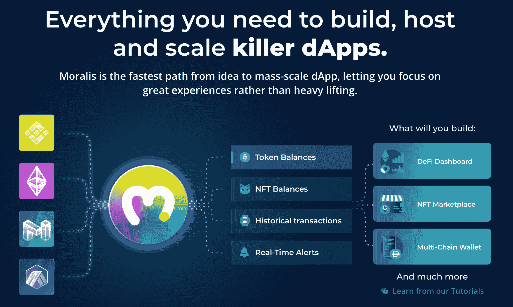

Moralis 将 Web2 开发的简易性与 Web3 的广泛功能联系起来。此外，Moralis 允许您通过几次点击和几行代码来构建强大的 dApps。是的，您可以轻松快捷地构建 dApps，而且只需付出最少的努力。Moralis 的平台让你接触到以太坊的区块链及其网络的巨大力量。无论你计划创建一个 DEX，一个 NFT 市场，一个多链钱包，还是任何抓住你想象力的东西，Moralis 都可以帮助你为它构建后端，丰富你的 dApp 的功能，这是其他任何东西都做不到的。此外，通过学习 Solidity 的编程语言，您可以进行复杂的智能合约编程，并在以太坊上构建时释放更多的可能性。如果你渴望成为一名 Solidity 开发人员并创建智能合同，那么我们建议你参加伊凡科技学院的以下课程:“[以太坊智能合同编程 101](https://academy.ivanontech.com/courses/ethereum-smart-contract-programming-201) ”。

通过阅读本文，您现在已经了解了如何在以太坊上构建 dApps，并且可以轻松快速地完成。此外，有了 Moralis 的平台，您可以简化不使用 Moralis 时所需的许多步骤。因此，Moralis 使得建造以太坊比以往任何时候都更容易。有了围绕 Moralis 驱动的 dApps 的所有可能性，您可以更少地担心后端，让您的创造力自由运行！