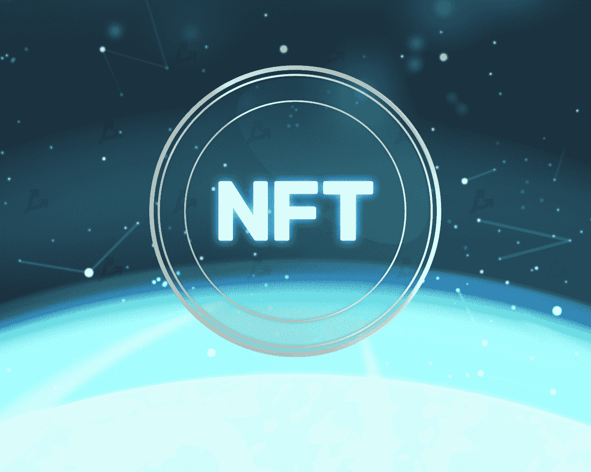
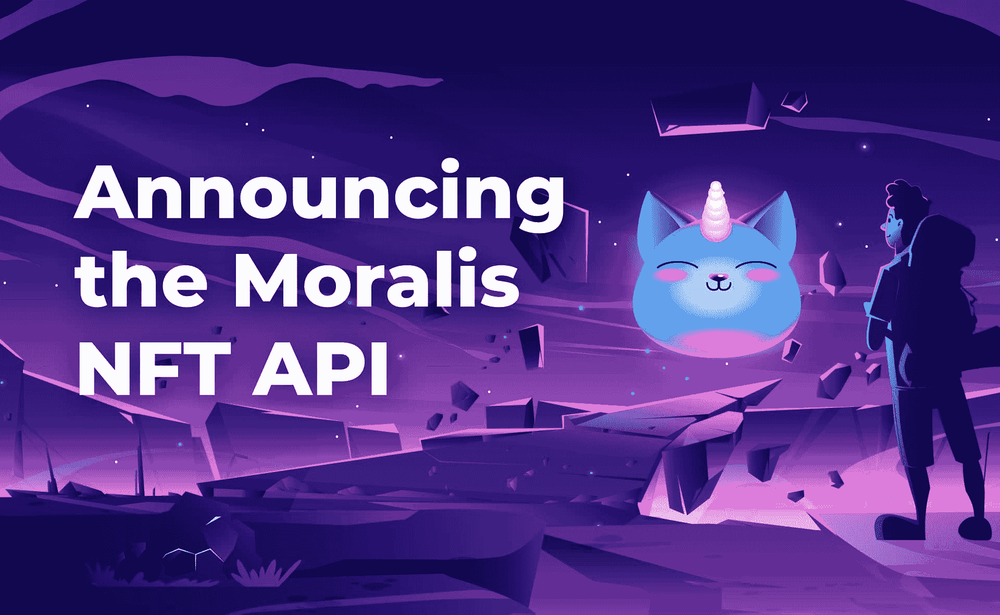
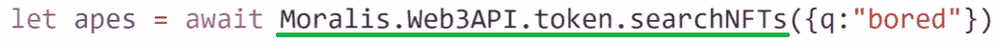
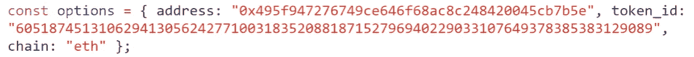
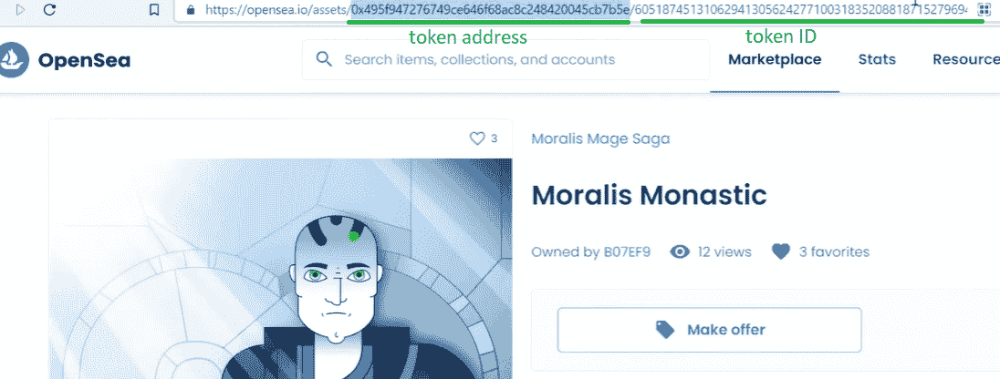
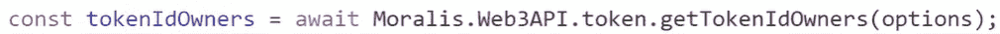
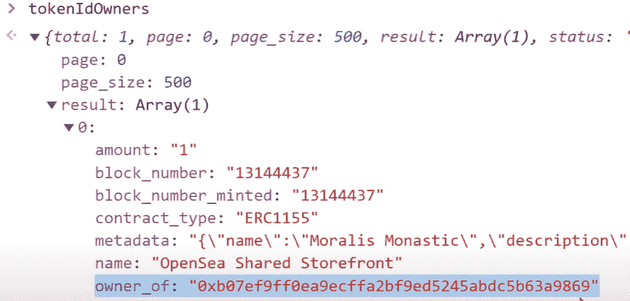
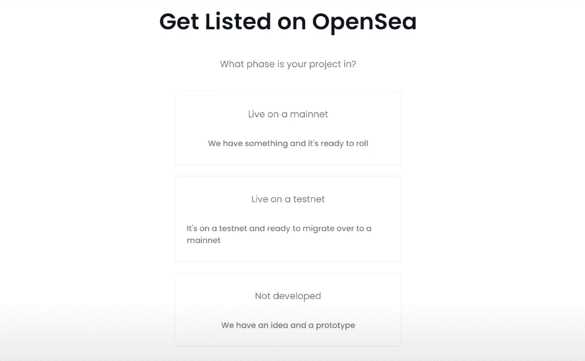
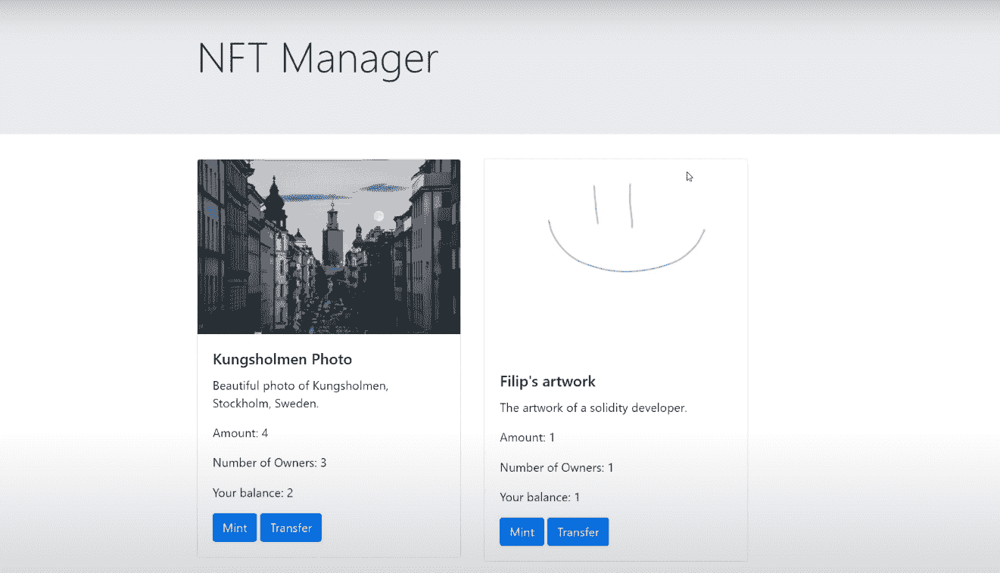

# 终极 NFT API–探索 Moralis 的 NFT API

> 原文：<https://moralis.io/ultimate-nft-api-exploring-moralis-nft-api/>

一个跨链的 NFT API，用于返回元数据并获取关于 NFT 用户、集合和事务的所有信息。

**【full nf API documentation】[【https://github . com/nf API/nf API】](https://github.com/nft-api/nft-api)**

NFT API 是每个 NFT dApp 的核心组件。无论你是想[开发一个 NFT 游戏](https://moralis.io/nft-game-development-how-to-build-an-nft-game-app-in-minutes/)、[创建一个 NFT 市场](https://moralis.io/how-to-create-an-nft-marketplace/)，创建一个钱包、分析网站，还是任何其他与 NFT 相关的 dApp，你都需要一个可靠的 NFT API。例如，这允许您获得如下内容:

*   NFTs 的元数据
*   NFT 价格
*   传输数据
*   NFT 所有权数据

随着开发者和投资者发现如何在数字和现实生活中利用 NFT，NFT 或不可替代的令牌越来越受欢迎。因此，现在是进入区块链世界，学习如何在 Web3 应用中实现 NFT 功能的绝佳时机。此外，使用正确的工具和专业知识，如 Moralis 及其 NFT API，可以轻松快速地将 NFTs 实现到您的 dApp 中。因此，我们将通过探索开发商的首选——Moralis 的 NFT API，来进一步了解当前区块链市场的终极 NFT API。

在本文中，您将了解什么是 NFT API，哪个 API 是最终的 NFT API，以及如何以最小的努力开始构建 NFT 应用程序。此外，如果您还不熟悉 Moralis 及其平台，您将看到如何使用其 NFT API，并使您的开发成为一个轻松的过程。

## NFT API——什么是 NFT API？

为了理解什么是 NFT API，我们首先要确定什么是 API。“应用程序编程接口”或 API 基本上是一个接口，它使软件能够与其他软件进行交互。从本质上讲，API 使得不同的指令集能够被传输或翻译，以便相互理解。因此，一组 API 通过确保所有可复制的功能在每个请求上可预测地交付，允许在稳定的环境中进行一致的编码。

当谈到 NFT API 时，上述特性特别关注于处理非功能性测试。它们简化了与 NFTs 相关的后端信息获取。虽然有几个 NFT API 可供选择，但我们将关注最终的 NFT API，即 [Moralis 的 NFT API](https://moralis.io/announcing-the-moralis-nft-api/?utm_source=blog&utm_medium=post&utm_campaign=Want%2520the%2520Latest%2520in%2520%253Cspan%253EBlockchain%2520Development%253F%253C%252Fspan%253E) 。这个 NFT API 是一个易于管理和使用的索引 API。此外，虽然其他 NFT API 选项需要使用多个请求，因此需要几行代码，但 Moralis NFT API 为用户提供了单行代码，这些代码将在后端完成所有繁重的工作。这包括获取与特定 NFT 相关的所有链上数据，您可以使用这些数据构建各种 NFT dapp。后者包括 NFT 钱包、NFT 追踪器、NFT 市场、NFT 游戏等。，不费吹灰之力。

此外，Moralis 的 NFT API 是广泛的 [Moralis SDK](https://moralis.io/exploring-moralis-sdk-the-ultimate-web3-sdk/) 的一部分，使 Moralis 成为最终的 [Web3](https://moralis.io/the-ultimate-guide-to-web3-what-is-web3/) 开发平台。这种强大的工具箱和对 Moralis 平台的完全访问使其成为对快速部署交付非凡 dApps 感兴趣的开发人员的首选。在我们仔细研究 Moralis 的 NFT API 之前，让我们确保您已经了解了什么是 NFT。

## 什么是 NFT？

不可替换令牌或 NFT 是独特类型的加密令牌。正如“不可替代”这个词所暗示的，它们包含了独特性，这提供了广泛的用例。除非你一直生活在岩石下，否则你会知道数字艺术收藏品最近一直是头条新闻。除了艺术和收藏品，NFT 已经在分散式游戏中发挥了重要作用，NFT 可以代表游戏中的各种物品，从皮肤、工具、药剂到角色等等。此外，当谈到“玩到赚”的概念时，NFT 是一个真正的游戏规则改变者。然而，这些只是这些类型的令牌的第一批用例中的一些。在不久的将来，我们将会看到更多使用各种非功能性测试的方法。

此外，由于 NFT 是代币，它们是可交易的；因此，它们也提供了一种将价值从数字世界转移到现实生活中的方式。尽管如此，不可替代的令牌提供了更广泛的用例，在这些用例中，它们可以作为各种证书、所有权等等的现实解决方案。

也就是说，你可以很有信心，NFT 会一直存在，知道如何使用高质量 NFT API 的开发人员可以获得优势，并从这个破坏性的利基市场中明显受益。如果你还是不能回答"[什么是 NFT？](https://moralis.io/non-fungible-tokens-explained-what-are-nfts/)“带着十足的信心，确保更深入地阅读我们的[Moralis 博客](https://moralis.io/blog/)中关于该主题的文章。

## 探索 Moralis 的 NFT API

在简要概述了 Moralis 的 NFT API 之后，我们将进一步了解如何使用它来创建和启动自己的 NFT。此外，你还将学习如何建立自己的 NFT 管理器，以及用 Moralis 开发 [NFT 游戏](https://moralis.io/what-are-nft-games-and-how-to-make-nft-games/)有多容易，Moralis 会代表你完成项目中繁琐的后端部分。

让我们先告诉你，Moralis 的 NFT API 本质上允许你用 NFTs 构建任何你能想到的东西。使用 Moralis 时，一行代码通常可以从区块链中获取必要的数据。

### Moralis 的 NFT API 是做什么的？

以下是 Moralis 的终极 NFT API 的一些最常用的功能，它们包括获取:

*   NFT 所有权信息
*   NFT 收藏中关于非功能性食物的细节
*   NFTs 的合同类型
*   NFT 创作时间(铸造)
*   关于 NFT 的元数据
*   NFT 的历史变迁
*   令牌地址、令牌 ID、令牌哈希和令牌 URI

此外，Moralis 的 NFT API 完全支持以太坊的 ERC-721 和 ERC-1155 令牌标准。因此，你可以使用最受欢迎的 NFT 代币。此外，通过使用这个强大的 NFT API，您可以构建无服务器的 NFT 应用程序，而无需大量的[以太坊](https://moralis.io/full-guide-what-is-ethereum/)、 [EVM](https://moralis.io/evm-explained-what-is-ethereum-virtual-machine/) 或[可靠性](https://moralis.io/solidity-explained-what-is-solidity/)知识。本质上，如果你知道如何使用[元掩码](https://moralis.io/metamask-explained-what-is-metamask/)，并且精通 [JavaScript](https://moralis.io/javascript-explained-what-is-javascript/) ，你就万事俱备了。现在就[创建你的免费 Moralis 账户](https://admin.moralis.io/register)，开始构建你的 Web3 应用。效仿一些声誉卓著的项目，比如已经在使用 Moralis NFT API 的 SuperFarm。

## 使用终极 NFT API

在这里，我们将看看由 Moralis NFT API 提供的一些强大而简单的函数，向您展示使用它是多么容易。我们还将向您展示使用 Moralis 创建和启动您自己的 NFT 是多么简单。

#### 搜索 NFT

Moralis 的 API 的一个强大的特性是，它可以让你把它当作“NFTs 的 Google”。例如，假设您正在构建一个 NFT 市场，并希望为您的用户提供一种使用自由文本搜索特定 NFT 的方式，那么这个选项会非常有用。这行代码将返回与用户输入的特定关键短语相关的所有 NFT:

在上图中，“无聊”只是一个搜索短语的例子。在花括号里面是用户可能搜索的内容。

此外， [Moralis 的文档](https://docs.moralis.io/)是这个终极 Web3 开发平台的另一个极好的好处。该文档是业内组织最完善、信息量最大的文档之一，为您提供了简短的代码片段、示例甚至视频说明。使用“发送 ETH、令牌和 NFT”以及“Web3 API(令牌、余额、NFT)”选项卡，它应该涵盖了构建 NFT dapp 所需的大部分内容。进入特定部分后，您可以使用右侧的内容菜单跳转到特定功能。

此外，还有“REST API”选项卡，在这里您可以找到所有其他可以用来通过 HTTP 调用的 API。然而，坚持使用 JavaScript 提供了最简单、最快的解决方案。

#### 获取 NFTs 的元数据

让我们看看如何使用 Moralis 的 NFT API 来获取 NFTs 的特定元数据的例子。为此，我们将使用已经在 OpenSea 上列出的 NFT。

首先，我们需要构造一个对象。为此，我们使用 NFT 的地址和 ID，这两者都可以在任何特定 NFT 的 OpenSea 页面的 URL 地址中找到。我们还需要指定链。

然后，我们使用 Moralis 文档提供的以下代码行来获取 NFT 的元数据:

#### 正在获取 NFT 所有者

使用 Moralis 的 NFT API，我们可以很容易地得到 NFT 的所有者，而不用考虑手边的 NFT 标准。同样，一行代码为我们提供了有关 NFT 的几个细节，包括所有者:

在下面，您可以看到显示所有者的线条(突出显示):

API 提供了更多的功能，包括“getNFTsForContract”、“getNFTTransfers”、“getHistoricalNFTTransfers”等。我们还建议观看 Moralis 的一位专家(来自 Moralis 的 Ivan)在下面的视频中解释我们 NFT API 的更多细节。您还将了解更多关于 Moralis 数据库的信息，供您使用:

https://www.youtube.com/watch?v=dAfKqirLWBI

### 如何创建和启动您自己的 NFTs

如果你了解 Solidity，并且想[学习如何使用智能契约](https://docs.moralis.io/tutorials/create-and-launch-own-nfts)创建 NFT，请务必观看我们的终极 NFT 编程教程。这演示了如何[创建智能合同](https://moralis.io/how-to-create-smart-contracts/)，该合同将检查所有权，并允许与 OpenSea 等市场进行交易。如果你想跳过项目的概述，跳到视频的 8:36。到 41:33，你将在以太坊的测试网上直播你的 NFT。

https://www.youtube.com/watch?v=tBMk1iZa85Y

然后你将学习使用 OpenSea 平台拍卖你的 NFT。您可以通过复制并粘贴您的 NFT 合同地址来完成此操作。我们建议你总是首先使用以太坊的一个测试网。一旦你确定那里的一切运行顺利，你应该在 mainnet 上启动你的 NFT。

### 如何创建自己的 NFT 经理

上面的视频还处理了另一个优秀的 NFT 范例项目。从 44:58 开始，您可以学习如何创建一个简单的 NFT 仪表板，也称为 NFT 管理器。NFT 管理器示例的一些功能包括查看谁是特定 NFT 的所有者。它还可以用来铸造新的 NFT，转移 NFT，显示关于 NFT 的统计数据，等等。

如果您决定接受这个示例项目，那么最终的结果将是这样的(它显示了在上一节中创建的两个 NFT 示例):

这种 NFT 经理是 Web3 应用程序的一个很好的例子。因为这是一个示例，这意味着您需要创建一个 HTML 结构，并将其与 CSS 编程结合起来以实现一些样式，并与 JavaScript 结合起来以实现应用程序的高级功能。通过结合使用 JavaScript 和 Moralis 的 SDK，我们可以包含由 Moralis 的文档提供的所有相关的代码片段。这样，我们负责后端与区块链相关的编码。

此外，该视频将指导您完成所有步骤，包括设置您的 Moralis 服务器并获取其详细信息。此外，为了这个示例项目的目的，您将需要使用 Visual Studio 代码(VSC)和它的一些插件，包括“实时服务器”。后者将启动一个小型网络服务器来托管你的 dApp。这样，您将能够使用 MetaMask 并检查您的 dApp 的进度和功能。

### 使用 Moralis NFT API 创建 NFT 游戏

由于 NFT 游戏现在很流行，我们鼓励你看看下面的文章，这是我们的两节课课程，将指导你一步一步地完成 [NFT 游戏开发](https://moralis.io/nft-game-development-how-to-build-an-nft-game-app-in-minutes/)过程:“ [NFT 游戏开发——如何在几分钟内建立一个 NFT 游戏应用](https://moralis.io/nft-game-development-how-to-build-an-nft-game-app-in-minutes/)”。它将向您展示用 Moralis 的 NFT API 开发 NFT 游戏是多么容易。此外，您还可以通过查看那篇文章来为您的 NFT 发展寻找灵感。
是的，Moralis 的 SDK 及其 NFT API 带来的强大功能提供了无与伦比的简单性，使您能够显著更快地部署成品。

此外，以下是我们对您的 [NFT 编程](https://moralis.io/nft-programming-for-beginners/)之旅的建议:

1.  如果您还不精通 JavaScript，请参加 Ivan on Tech Academy 的“[区块链开发者 JavaScript 编程](https://academy.ivanontech.com/courses/javascript-programming-for-blockchain-developers)课程。
2.  注册 Moralis，并在这里分享的尽可能多的示例项目中使用它，以习惯使用 Moralis 的 NFT API。
3.  创建您自己的非凡 NFT dApp 并与世界分享。
4.  重复第三步。

## 终极 NFT API–探索 Moralis 的 NFT API–总结

非功能性交易似乎会持续下去。它们不仅颠覆了数字艺术、收藏品和游戏行业，还可能提供数字世界之外的许多用例。因此，开发人员掌握 NFT 开发技能的时候到了——有了 Moralis 家的 NFT，终于有了一个能够支持简单开发的 NFT API。

根据本文中的信息，您将能够结合使用终极 NFT API 和 Moralis 的 SDK 来提高您的 Web3 开发速度。有了这个快捷方式，您就可以将最大的精力放在创建最用户友好的 NFT 应用程序上，并最终节省时间和资源。按照我们的建议，您将首先完成几个示例项目。因此，你将学会正确使用这些强大的工具——并看到 Moralis 的全部力量。例如，Moralis 还允许你轻松地[构建以太坊 dApp](https://moralis.io/ultimate-guide-how-to-build-ethereum-dapps/)，[创建 DEX](https://moralis.io/how-to-create-a-dex-in-5-steps/) ，[添加菲亚特网关](https://moralis.io/how-to-add-fiat-gateway-to-dapps/)，[创建雪崩 dApp](https://moralis.io/how-to-create-an-avalanche-dapp-in-4-steps/) ，等等。例如，Moralis 是顶级的 BSC 测试网络提供商，也是领先的备选供应商。最重要的是，所有这些都可以与 Moralis 的 NFT 开发工具无缝协作。因此，你很快就能建造 NFT dApps！

