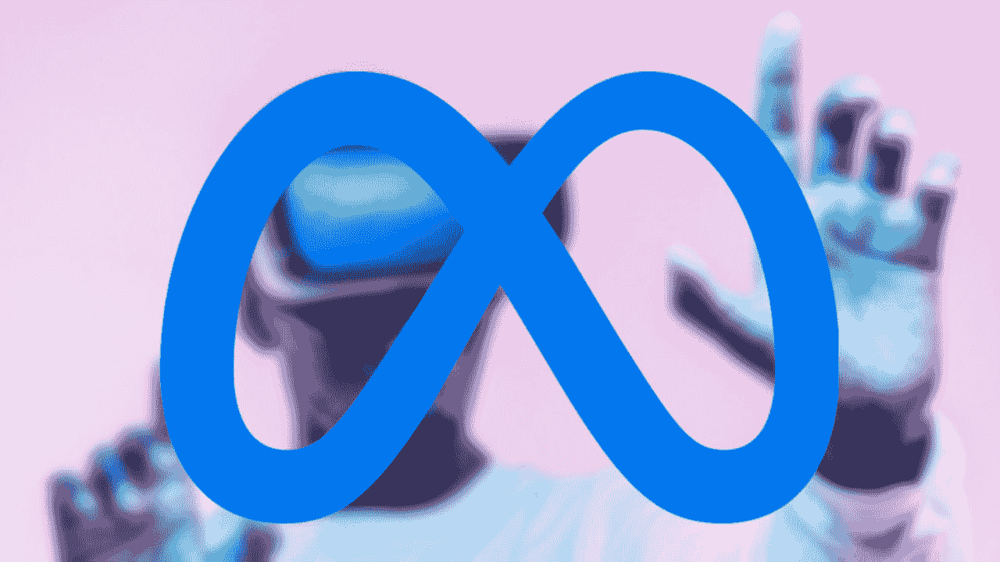
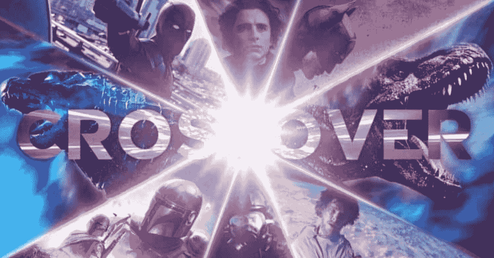
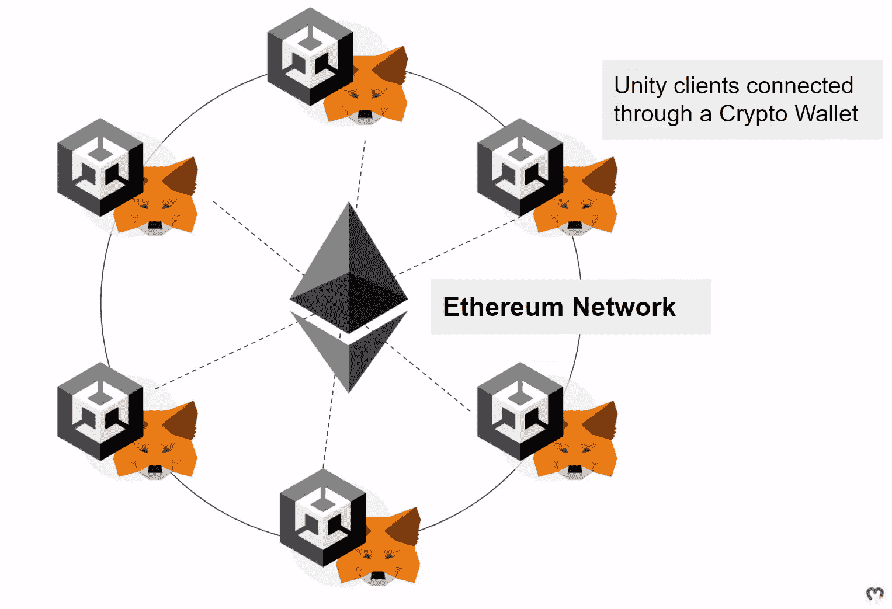
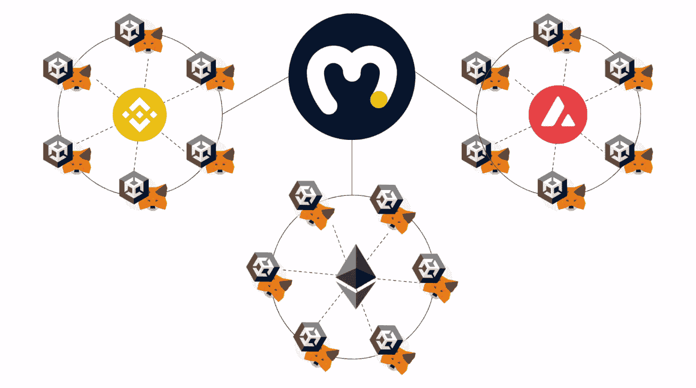
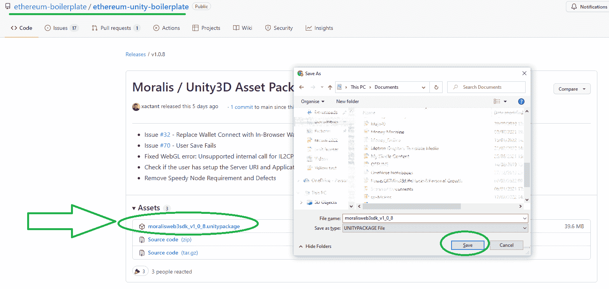
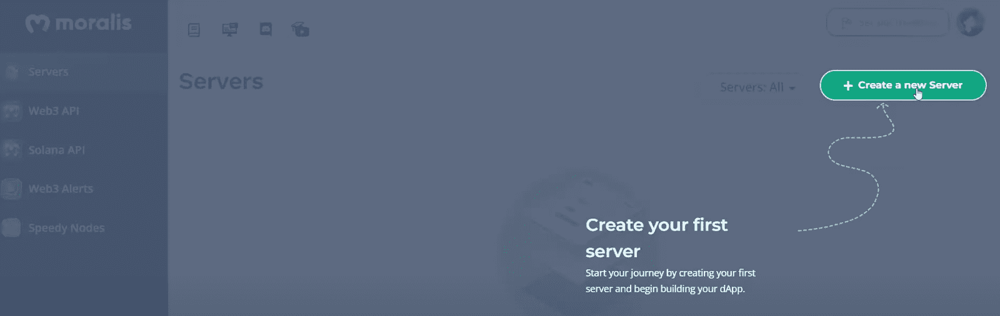
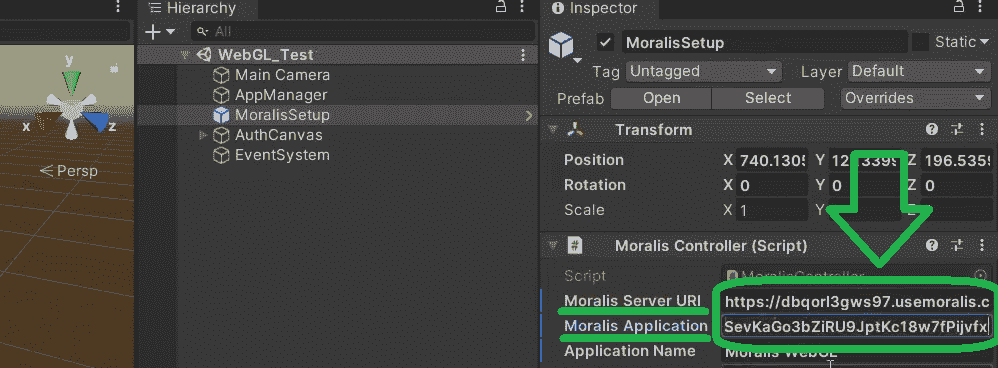
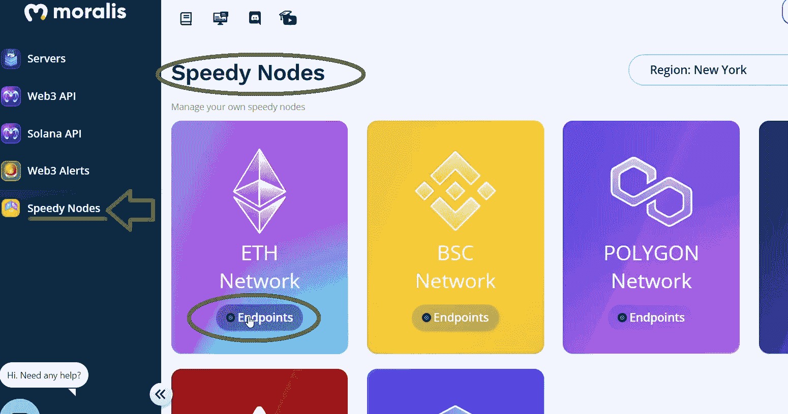
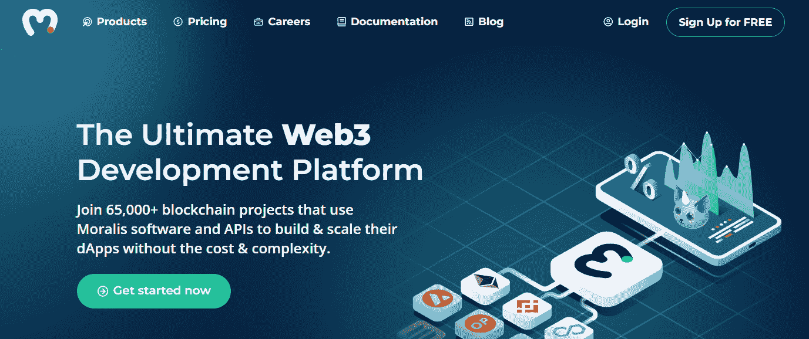

# Unity web 3–Unity web 3 编程初学者指南

> 原文：<https://moralis.io/unity-web3-beginners-guide-to-unity-web3-programming/>

https://www.youtube.com/watch?v=rZSPIyB-0R4&list=PLFPZ8ai7J-iQcI05EXqRUPK2VXDQaAPIr

你是 Unity 的开发者吗？如果是这样， [**Web3**](https://moralis.io/the-ultimate-guide-to-web3-what-is-web3/) **博彩业的崛起为你呈现了一个巨大的机会。许多大玩家已经投入巨资来创建他们的集中式元宇宙，Meta 是其中的佼佼者。然而，人类渴望分散的替代方案。因此，知道如何创建 Unity Web3 应用程序是必须的。当然，这需要知道使用什么 Unity Web3 开发工具。如果您想要一个平稳的开发过程并创建成功的 dApps，选择正确的工具是必不可少的。现在，在搜索您喜欢的**[**web 3 tech stack**](https://moralis.io/exploring-the-web3-tech-stack-full-guide/)**时，您可能已经探索了** [**Alchemy API 替代方案**](https://moralis.io/alchemy-api-alternatives-web3-development-platforms/) **。然而，虽然节点** [**和 Web3 的 API**](https://docs.moralis.io/moralis-server/web3-sdk/intro) **提供者都是很棒的工具，真正的威力在于** [**Web3 的后端平台**](https://moralis.io/exploring-the-best-web3-backend-platform/) **。因此，** [**Moralis 家**](http://moralis.io/) **是您不容错过的首要平台。让这个终极的 Web3 开发平台(“**[**Firebase for crypto**](https://moralis.io/firebase-for-crypto-the-best-blockchain-firebase-alternative/)**”)照顾你的后端需求。** [**现在就创建你的免费账户**](https://admin.moralis.io/register) **！**

从 Unity 到“Unity Web3”编程的过渡通常并不简单。事实上，许多编码人员仍然会陷入直接在[以太坊 RPC 节点](https://moralis.io/ethereum-rpc-nodes-what-they-are-and-why-you-shouldnt-use-them/)之上构建的陷阱。因此，他们最终面临 RPC 节点的所有[限制。但是，当你使用上面提到的快捷方式时，你不需要担心 Web3 后端的额外开销。您只需通过快速的初始设置将 Unity 与](https://moralis.io/exploring-the-limitations-of-rpc-nodes-and-the-solution-to-them/) [Moralis 元宇宙 SDK](https://moralis.io/metaverse/) 连接。然后，你可以将所有的精力投入到创造一个有吸引力的 Web3 UI 和最好的用户体验上。因此，你的 Unity Web3 游戏成功的机会会自动增加。接下来，我们将为您提供更多关于 [Moralis 的 SDK](https://moralis.io/exploring-moralis-sdk-the-ultimate-web3-sdk/) 的细节。希望这能帮助你决定下一步该做什么。尽管如此，我们也有一步一步的 Unity Web3 初始设置指南在这里等着您。

## 为什么选择 Unity Web3？

只看一些最受欢迎的游戏，比如使命召唤，英雄联盟，EA Sports 的 FIFA，他们都把你限制在他们的社区里。为什么？因为都是集中建设，都是集中公司所有。这意味着他们拥有你的数据和游戏中的资产。此外，在某些情况下，如果游戏属于同一品牌，您可能有机会与其他游戏社区互动。然而，没有办法把 EA 社区和暴雪娱乐社区结合在一起。但是，当使用 Unity Web3 时，可以创建一个真正去中心化的元宇宙。

现在，你可能想知道为什么有人想在不同的游戏世界之间共享信息。嗯，因为它带来了一些非常酷的选择。例如，想象交叉事件。因此，我们可以将不同游戏中的角色、特征和其他资源整合在一起。那不是很神奇吗？

我们相信，当谈到将游戏世界结合在一起时，我们已经过了“如果”这个阶段。游戏的未来显然与互操作性和去中心化有关，用户实际上拥有他们的游戏内资产。因此，剩下的唯一问题是“如何”做到这一点以及实现什么规则。因此，所有“不”和“它永远不会工作”的 sayers 将被留在后视镜。

也就是说，我们都同意集中式游戏不能提供这种交叉合作。然而，可编程区块链提供的技术，如[以太坊](https://moralis.io/full-guide-what-is-ethereum/)，给我们带来了无限的新可能。因此，分散的元诗句，甚至一个巨大的元宇宙突然成为可能。虽然，这些概念对于今天的讨论来说可能太大了。因此，让我们关注一个 Unity Web3 游戏的例子。

## 创建 Unity Web3 游戏

在这种情况下，我们可以创建的游戏是 Web3 领域中的一个世界。此外，由于以太坊仍然是最受欢迎的连锁店，让我们用 [EVM](https://moralis.io/evm-explained-what-is-ethereum-virtual-machine/) 为它供电。因此，所有玩家都可以用他们支持以太坊的 [Web3 钱包](https://moralis.io/what-is-a-web3-wallet-web3-wallets-explained/)连接。此外，他们的信息将通过整个分散的网络自动复制(见上图)。这样，玩家可以相互交易，甚至买卖各种资产。反过来，游戏资产的价值可以很容易地转移到现实世界中。

尽管如此，这样一个 Unity Web3 游戏，或者我们应该说一个数字世界，将是一个大规模任务事件和游戏内工作的好地方。在你开始怀疑这种可能性之前，让我们提醒你，新的不可思议的技术总是扰乱其当前的行业地位。此外，最初的负面过度反应通常是一个好现象。因此，革命已经开始。

事实上，上述概念可以很容易地进一步发展。通过 Moralis，您可以轻松地将您的 Unity Web3 游戏与其他知名连锁店连接起来，如下图所示。

正是 Moralis 的跨链互操作性增加了额外的价值。让我们详细阐述一下这个概念。所以，当你使用 Moralis 来满足你的后端需求时，你可以将你的游戏部署到所有 Moralis 支持的区块链。通过这种方式，你的 Web3 游戏可以提供给不同链的用户，这也意味着你可以接触到更广泛的受众。此外，你的工作是“经得起未来考验的”,因为你不拘泥于任何特定的链条。此外，这意味着如果一个新的可编程区块链在未来接管事情，你可以无缝过渡。

### 如何创建一个 Unity Web3 游戏

假设你至少有一些 Unity 的经验，你可能知道如何创建 3D 世界和他们的场景。这也是你创建 Web3 游戏的起点。然而，一旦你准备好场景，真正的 Web3 魔术就开始了。在这一点上，是时候专注于将一个 [Unity 游戏与 Web3 登录](https://moralis.io/connecting-a-unity-game-with-web3-login/)连接起来，并访问所有其他 Web3 功能了。

首先，您需要访问 Moralis 的元宇宙 SDK。你可以使用介绍中的相应链接，或者使用谷歌搜索“Moralis 元宇宙 SDK”。登陆 Moralis 元宇宙 SDK 页面后，您需要向下滚动一点。您会看到“立即开始”按钮:

当你点击按钮时，它会把你带到[以太坊统一样板](https://github.com/ethereum-boilerplate/ethereum-unity-boilerplate)。这个强大的快捷方式在 GitHub 上等待着你。在那里，您可以找到关于这个样板文件的所有细节。但是，要创建一个 Unity Web3 游戏，请点击右侧的“发布”部分。这样，您将获得最新版本:

接下来，您需要保存“*”。unitypackage* 文件到您的计算机:

## 使用 Moralis 的元宇宙 SDK

“救了之后。unitypackage "文件成功，返回 Unity。然后，你想把上面下载的文件夹拖放到 Unity 的界面上。不要忘记确认进口。通过这样做，您将成功地导入 Moralis 的 Unity 包。因此，从那时起,“MoralisWeb3ApiSdk”文件夹将由您支配:

接下来，选择使用哪种 Moralis 预设取决于你正在开发的项目或游戏的类型。然而，在所有情况下，你都想从“Moralis 设置”预设开始。请注意，您总是可以通过使用搜索选项来查找该组件，从而加快速度。下面的例子告诉你如何为“WalletConnect”预设这样做。但在添加“Moralis 设置”时，同样的原则也适用。你只需简单地将有问题的预设拖放到你的“层级”标签中:

添加“MoralisSetup”组件后，您需要通过输入您的 Moralis 服务器的详细信息来完成初始设置:

如果你想知道这些细节是什么，这意味着你以前没有和 Moralis 合作过。因此，让我们来引导您完成初始的 Moralis 设置。

### 访问您的 Moralis 管理区，并创建一个新的服务器

无论你的目标是创建一个元宇宙，一个简单的 Web3 游戏，还是使用终极[以太坊 dApp 样板](https://moralis.io/ethereum-dapp-boilerplate-full-ethereum-react-boilerplate-tutorial/)的 dApps ( [分散应用](https://moralis.io/decentralized-applications-explained-what-are-dapps/))，你都需要创建一个 Moralis 服务器。请按照以下步骤进行操作:

1.  **登录您的 Moralis 账户**–如果您使用了介绍中的链接，那么您很可能已经创建了您的免费 Moralis 账户。如果是这种情况，只需[使用您的凭证登录](https://admin.moralis.io/login)即可。*另一方面，如果你还没有一个有效的 Moralis 账户，现在就注册吧。您需要输入您的电子邮件地址，创建您的密码，然后单击将发送到您收件箱的确认链接。*

2.  [**创建一个 Moralis 服务器**](https://docs.moralis.io/moralis-server/getting-started/create-a-moralis-server)——现在您已经登录，确保您处于“服务器”选项卡中。在那里，单击“+创建新服务器”按钮(在“服务器”选项卡的右上角)。*如果这是你第一次使用 Moralis，页面上的指南会帮助你:*

一旦你点击“+创建一个新的服务器”，你会看到一个下拉菜单提供三个网络类型选项(见下面的截图)。选择最适合您的项目需求的一个。

*注意* *:如果您正在处理示例项目或测试 dApps，我们建议您关注“Testnet 服务器”或“本地 Devchain 服务器”选项。然而，当你想使用你的 Unity Web3 游戏时，你需要选择“Mainnet 服务器”。*

继续，您将看到一个弹出窗口，提示您输入服务器的详细信息。因此，输入您的服务器名称(这可以是您想要的任何名称)，然后选择您的地区、网络类型和链。最后，是时候启动您的服务器了。因此，单击“添加实例”按钮:

### 访问您的 Moralis 服务器的详细信息并填充 Unity

3.  **访问您服务器的详细信息**–现在您的服务器已经启动并运行，是时候访问它的详细信息了。后者可通过服务器名称旁边的“查看详细信息”按钮获得:

点击“查看详情”，您需要的信息将出现在一个新窗口中。因此，您现在可以通过单击右侧的复制图标来复制服务器的 URL 和应用程序 ID:

4.  **填充 Unity**

#### 使用 Moralis 快速节点进行 Unity Web3 开发

*注意* *:虽然上面提到的 Moralis 服务器设置是必不可少的，但是使用 Moralis 快速节点却不是。但是，在许多情况下，您还需要完成此设置才能获得更高级的功能。*

您可以通过从您的 Moralis 管理区域复制并粘贴相应的 URL 来使用 [Moralis Speedy Nodes](https://moralis.io/speedy-nodes/) 。因此，你需要回到你的 Moralis 管理区。这次选择“快速节点”标签。在那里，单击在上述设置过程中为服务器选择的网络下的“端点”按钮:

出于本指南的考虑，我们假设您的服务器在以太坊主网上。在这种情况下，您需要点击“以太网”下的“端点”。然后，您需要从弹出窗口中复制 mainnet URL 地址。当然，同样的原则也适用于其他主网和[测试网](https://moralis.io/ethereum-testnet-guide-connect-to-ethereum-testnets/):

复制 URL 地址后，您必须转到 Unity，将该 URL 粘贴到“ *Web 3 Rpc 节点 Url* ”旁边的输入字段中，如下所示:

## Unity web 3–Unity web 3 编程初学者指南–摘要

至此，你现在知道为什么这可能是关注 Unity Web3 开发的最佳时机了。此外，您还了解了为什么分散式方法很有意义。幸运的是，Moralis 和它的元宇宙 SDK 正好能满足你的需求。你需要做的就是下载最新版本的“Unity3D 资产包”，完成一些简单的初始设置步骤。此外，现在你已经知道如何做 Unity Web3 游戏创作，是时候发挥你的创造力了。但是，如果您缺乏信心或知识，我们建议您从一些示例项目开始。例如，你可以跟随我们的领导[开发一个中世纪的元宇宙游戏](https://moralis.io/how-to-build-a-medieval-metaverse-game/)或者[用 Unity](https://moralis.io/build-a-web3-mmorpg-with-unity-in-10-minutes/) 创建一个 Web3 MMORPG。还有，你可以仔细看看[元宇宙智能合同](https://moralis.io/metaverse-smart-contract-how-to-build-a-metaverse-game-smart-contract/)的例子。

https://www.youtube.com/watch?v=rZSPIyB-0R4

另一方面，你可能有兴趣了解更多关于区块链发展的其他领域。如果是这样的话，[Moralis 博客](https://moralis.io/blog/)和[Moralis YouTube 频道](https://www.youtube.com/c/MoralisWeb3)是值得一去的地方。这两个出口是继续你的免费加密教育的两个最好的方法。它们不仅涵盖了区块链发展的全部主题，而且还提供了无数的范例项目。一些最新的话题包括用 ReactJS 建立一个[跨链 Zapper dApp，创建一个](https://moralis.io/how-to-build-a-cross-chain-zapper-dapp-with-reactjs-using-moralis-api-and-serverless-real-time-transactions/) [Web3 电子商务平台](https://moralis.io/web3-e-commerce-create-a-web3-e-commerce-platform-in-5-steps/)或 [Web3 亚马逊市场](https://moralis.io/how-to-build-a-web3-amazon-marketplace/)，[将一个 Unity 应用程序连接到 Web3 钱包](https://moralis.io/how-to-connect-a-unity-app-to-a-web3-wallet/)，创建一个 [BNB 链令牌](https://moralis.io/how-to-create-a-bnb-chain-token-in-5-minutes/)，克隆[比特币基地钱包](https://moralis.io/cloning-coinbase-wallet-how-to-create-a-coinbase-clone/)等等。

然而，如果你真的想尽快成为一名区块链开发者，我们建议你走一条更专业的道路。因此，报名参加[Moralis 学院](https://academy.moralis.io/)可能是你的正确道路。除了获得高质量的课程，你还将成为最先进的 Web3 社区的一员。

