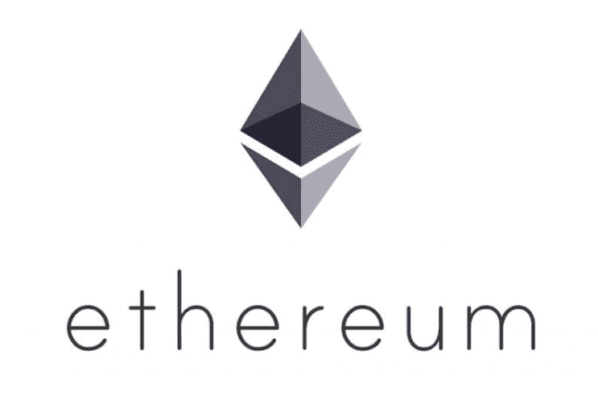
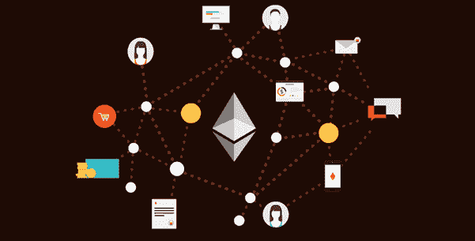
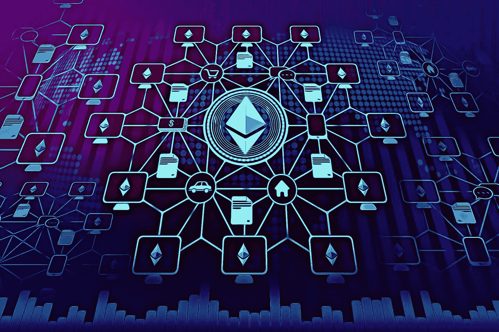
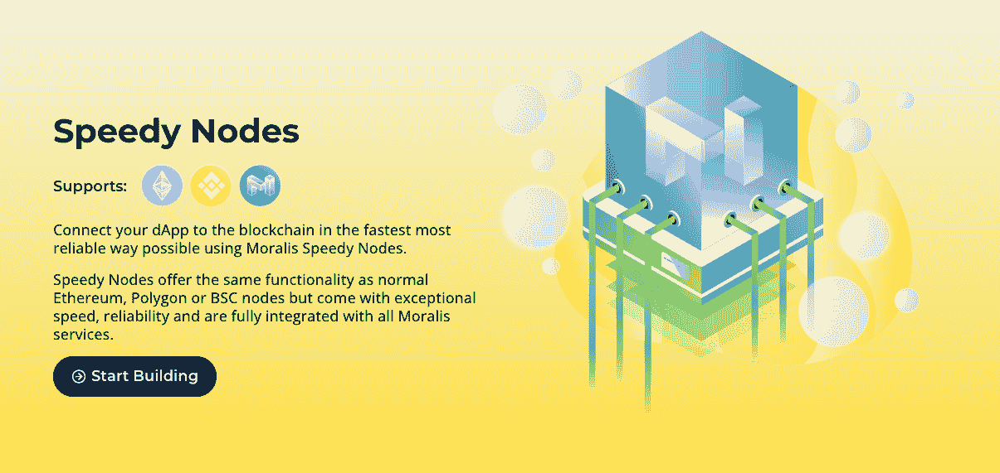
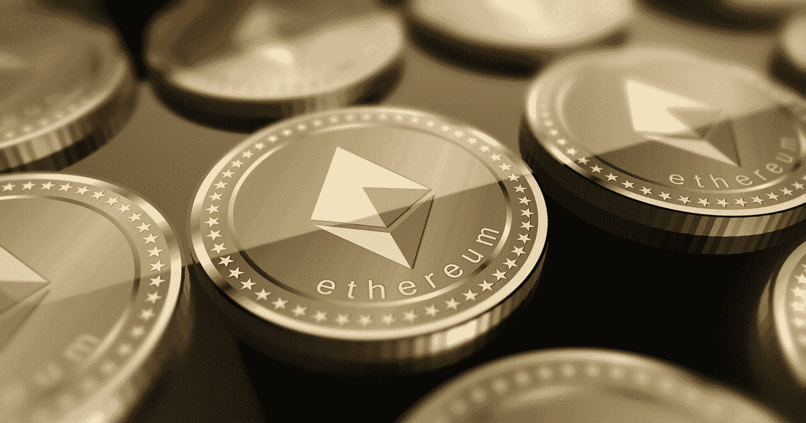
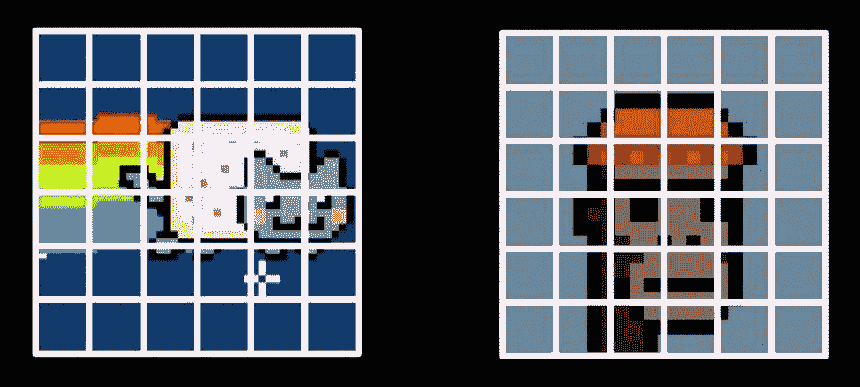
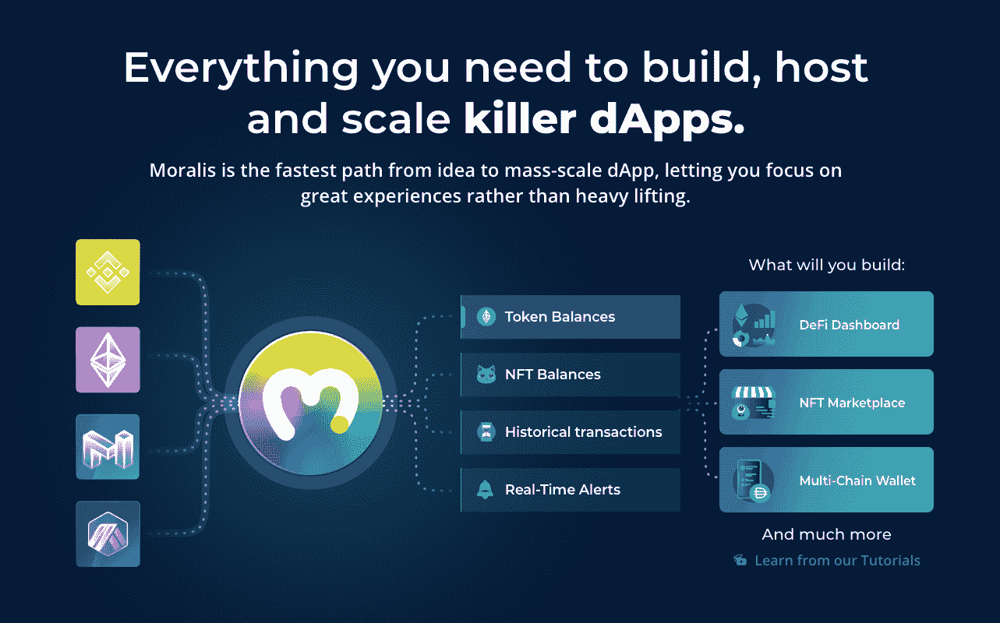
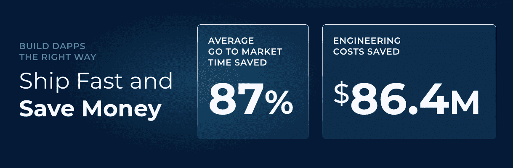

# Solidity 智能合同的用例

> 原文：<https://moralis.io/use-cases-for-solidity-smart-contracts/>

以太坊等区块链智能合约拓宽了最初比特币区块链的功能和使用案例。这些用 Solidity 的编程语言编写的智能合约，将区块链技术的使用案例扩展到了加密货币之外。虽然许多人认为智能合约是携带余额的代码，可以通过网络发送各种交易，但他们的用例不止于此。因此，如果你正在寻找 Solidity smart contracts 的编程方法，但是还没有弄清楚你希望你的合同针对什么样的利基或用例，那么这篇文章将会非常有益。首先，我们将回到基础，看看可靠智能合约的起源。然后，我们将深入 Solidity smart contracts 的用例，使您能够将您的区块链开发技能提升到一个新的水平。

可靠智能合同提供了一个主要的竞争优势，因为它们允许你在以太坊上建立 dApps。然而，[什么是用 Solidity 写的智能合约](https://moralis.io/smart-contracts-explained-what-are-smart-contracts/)？智能合同是自动执行的代码，可以在两方或多方之间实现和执行协议。这种成文的协议存在于区块链，因此被写入不可撤销的公共记录。协议的条款包含在守则中。以太坊的主要语言 Solidity 是有史以来开发的第一种智能契约语言。因此，它是快速增长的 dApp 和 Web3 生态系统的重要支柱。

可靠性智能合同有许多使用案例。在本文中，我们将探讨一些与 Solidity 智能合同最相关的用例。此外，我们将讨论它们如何影响今天的系统，并将它们带入一个新的 Web3 和 DeFi 支持的环境。

然而，如果你想直接开始建立你的第一个 Solidity smart 合同，看看这个来自 Moralis 的 YouTube 频道的优秀教程:

https://youtu.be/IkCfIE1VoRo

## 可靠性智能合同用例

在你深入研究 Solidity 智能合约及其用例之前，你必须首先能够回答"[什么是以太坊？](https://moralis.io/full-guide-what-is-ethereum/)”。此外，你必须了解[以太坊虚拟机](https://moralis.io/evm-explained-what-is-ethereum-virtual-machine/) (EVM)和 Solidity 的语言的属性。另外，你应该已经对什么是 dApps 和 Web3 有了一个大概的了解。此外，要编写 Solidity 代码并与 Web3 JavaScript 库或 [Web3.js](https://moralis.io/web3-and-javascript-what-is-javascript-and-web3-js/) 交互，你必须已经知道 [JavaScript](https://moralis.io/javascript-explained-what-is-javascript/) 。

## 可靠性智能合同的起源

可靠性智能合约构成了以太坊的支柱。2013 年，Vitalik Buterin 首次提出以太坊的想法。他打算用它来扩展世界上第一种加密货币比特币的功能。比特币只允许进行货币或金钱交易，而以太坊实现的不仅仅是这些。由于是“图灵完全的”，它可以执行多种类型的事务。

Solidity 是一种面向对象的高级契约语言。它的存在是为了执行智能合同。以太坊的联合创始人兼首席技术官加文·伍德(Gavin Wood)于 2014 年首次提出。由 Christian Reitwiessner 领导的以太坊的 Solidity 团队对其进行了进一步的开发。Solidity 借用了几种流行的语言，包括 Python 和 JavaScript。因此，它的语法与 JavaScript 有许多相似之处。此外，它还具有 JavaScript 的图灵完备特性。

此外，坚固性是静态类型的。Solidity 的智能合约运行在以太坊虚拟机或 EVM 上。EVM 决定了整个以太网的状态。它是嵌入在每个完整以太坊节点中的沙盒堆栈。此外，它执行智能契约字节码。基本上，它将 Solidity 这种高级语言翻译成 EVM 可以理解的字节码。

### EVM 和智能合约

EVM 是以太坊网络协议的核心。它负责网络中的共识。使用 Solidity smart contracts，任何人都可以以不可信的方式或在没有可信的中央机构的情况下执行代码。此外，内部 gas 机制控制着智能合同执行的激励机制。天然气成本决定了网络如何对交易进行优先排序。然而，随着以太坊更新其协议并采用新的利害关系证明(PoS)算法，围绕汽油费的激励机制将会改变。

Solidity 的设计是为了尽快发展以太坊的生态系统。因此，这需要一定程度的简单性，以允许开发人员快速入职。因此，他们需要一种快速学习的语言。此外，它需要反映人类思考协议的方式。可靠性智能合同反映了尽可能接近人类交易行为的愿望。

## Solidity 智能合同的主要使用案例

您可以将智能合约应用于几乎任何类型的交易或商业模式。要开发一个智能契约驱动的 dApp，你只需要扎实的编程技能、主动性和想象力。更重要的是，你可以从使用 Web3 开发工具如 Moralis 中获益。Moralis 有助于减少您的后端开发时间，因此您可以专注于创建一个优秀的前端。因此，Moralis 是一个很好的捷径，让你有时间开发更好的 UX/UI，以吸引更多用户使用你的智能合约驱动的 dApp。

以下是一些最激动人心的 Solidity 智能合同使用案例:

### 1.金融服务

智能合约在银行和金融领域有着广泛的应用。您可以对智能合约进行编程，以表示和执行管理金融产品或服务的规则。此外，它们可以促进自动支付、交易、结算和索赔。此外，他们还可以创建基于区块链的抵押贷款、债券、止赎和贷款。

#### DeFi dApps

DeFi(分散金融)dApps 为传统金融提供了新的替代方案，打破了传统金融壁垒。此外，它们让“得不到充分服务的人”即使没有银行账户也能享受金融服务。世界银行集团估计，截至 2017 年，无银行账户的人数约为 17 亿。因此，这个数字代表了一个可以由 DeFi 服务解决的巨大市场。

分散的 DeFi 应用程序正在创建更加灵活和独立的传统金融服务版本。此外，此类 dApps 不归任何中央机构所有或管辖。顾名思义，他们使用 Solidity smart 契约和“不可信的”公共开源区块链来执行他们的规则。

DeFi 平台具有全天候可用的优势。与传统平台不同，它们提供全天候的金融服务，其中大部分是实时结算的。此外，Solidity smart contracts 的创新能力让它们包含新的功能和好处。此外，这类平台往往会提供更高的利息收益率来吸引用户。它们也是无国界的，并取消了集中保管和费用。

Moralis 展示了创建智能合同供电 DeFi dApps 的最快方法之一。有了 [Moralis Speedy Nodes](https://moralis.io/speedy-nodes/) ，你可以在几分钟内运行一个区块链节点。此外，您可以使用 Moralis 提供的代码片段轻松增强 dApp 的功能。因此，您可以用很短的代码从 Moralis 的数据库中获取数据。

作为最终的 Web3 开发平台，Moralis 提供工具，如 Moralis 的 Price API，来增强您的 DeFi dApps。[此外，Moralis 的价格 API](https://moralis.io/introducing-the-moralis-price-api/) 为您提供实时的链上数据，以监控和计算与您的 dApp 交易相关的各种代币的价格。因此，您可以在开发 DEX(分散式交易所)或其他处理令牌管理和交易的 dApps 时使用该 API。

### 2.数字身份

智能合同有关于数字身份的有趣用例。虽然仍然不可能完全匿名参与所有类型的在线交易，特别是当它们涉及监管环境时，但 Solidity smart contracts 提供了新的选择。它们提供了独特的解决方案，提供了速度、便利性和数据保护。此外，在需要可靠的身份证明的情况下，Solidity 智能合同可以在需要的地方添加隐私层或功能。

### 解决身份盗窃和数据垄断

通过向以太坊 dApps 的用户提供自我主权身份，Solidity 智能合同提供了一种管理个人数据的新方法，而不必将其限制在一个集中的数据库中。相反，重要信息(如护照信息)存储在以太坊区块链上，只能通过 dApp 访问。

通过解除身份数据库的中介作用，智能合约解决了大型机构行使数据垄断的问题。此外，智能合同还让人们对自己的个人信息拥有更大的控制权。因此，他们可以最大限度地减少数十亿美元的身份盗窃问题。

#### 数字身份证在物联网中的应用

在尖端的“物联网”领域，Solidity 智能合同发挥着至关重要的作用。连接的机器必须与账户相对应才能进行交易。因此，智能合同为物联网中机器之间的信任提供了桥梁。此外，Solidity 智能合约可以在设备之间建立基于身份的关系。

### 3.组织

到目前为止，您可能已经听说过 Dao 或分散自治组织。Dao 为各种类型的组织提供了分散治理的框架。这种组织可能由互联网上的匿名个人组成。或者，它们也可以适用于私营企业和公司。

如今，企业可以利用 Solidity 智能合约和区块链技术来实现新的管理结构。此外，一些国家的政府已经出台了关于 Dao 的立法，从而为 Dao 经营各种类型的私营组织铺平了道路，而不必担心处罚或合规问题。有趣的是，你可以使用 Solidity smart 契约建立所有权和薪酬结构。此外，这种框架可以包括公司结构，并在公司内依法实施激励措施。

此外，Solidity 智能合同在公司管理功能中也很有用。可靠智能合同可以通过自动支付和激励来节省成本。

### 4.法律应用

单从名字上看，智能合同似乎对法律行业构成了威胁。然而，Solidity 智能合约真的能实现法律自动化吗？所有迹象表明，未来将融合传统法律和区块链技术。

可靠智能合同有可能变得和传统法律合同一样具有约束力。由于我们已经在有约束力的协议中使用电子签名，使用智能合同使这些协议完全自动化只是时间问题。

您可以轻松定制智能合同，以复制任何法律合同的功能。如果这种智能合同被监管机构和政府接受，它们可以大大提高交易速度，降低管理成本。此外，它们消除了许多中间步骤的需要。美国的某些州，如加利福尼亚州，已经允许区块链颁发结婚证。其他类型的智能合同协议成为主流只是时间问题。

### 5.标记化

令牌化是 Solidity 智能合约的一个通用用例。有趣的是，这个用例引发了许多其他用例。代币可以应用于任何类型的价值或交易。它们最普遍的用例仍然是在货币或稳定货币领域。然而，它们也可以用来表示资产的一部分，无论是真实的还是数字的。它们主要应用于房地产，其中它们可以代表不动产资产的所有权。

它们在 NFT 领域也有令人兴奋的应用。NFT 细分是创意数字资产被分割并作为代币出售。如果你想学习如何生成 NFT(T1)，这是提供 NFT 部分所有权之前的关键一步，你可以在 Moralis 的 YouTube 频道上观看“[生成 NFT 并上传到 open sea(T3)”的视频。](https://youtu.be/M5eCg_udGIA)

如上图所示，NFT 的资产可以被分割并作为代币出售。

房地产部门已经在财产标记化方面取得了成功。一些平台已经成功地融合了区块链和房地产的世界。一些政府，如格鲁吉亚共和国，自 2016 年以来一直致力于基于区块链和智能合同的土地所有权。因此，智能合同在房地产领域的应用进展顺利。

我们可以预计，在不久的将来，Solidity 智能合同将在不动产的登记、记录、销售、经纪、转让和管理中发挥更大的作用。此外，对于无力购买整栋房产的散户投资者来说，投资机会将通过一系列全新的房地产证券化工具获得。此外，通过 Solidity smart 合约，散户投资者可以分享房产的销售利润和价值增值。

### 6.赌博

Solidity 智能合约最热门的用例之一是在游戏行业。在 NFTs 和 NFT 市场的推动下，对于许多用户来说，游戏变得更加令人兴奋和有利可图。

随着对可靠智能合约的掌握，建立一个 NFT 市场变得前所未有的简单。因此，化身、特殊对象和其他游戏资产可以以更高的价格出售。而且，它们甚至可以在多个游戏中使用。像 Moralis 这样的顶级 Web3 开发平台提供了跨链的能力来桥接多个 dApps 和平台。因此，Moralis 是为 [NFT 奥运会](https://moralis.io/what-are-nft-games-and-how-to-make-nft-games/)充电的完美工具。

在游戏内部，NFT 促进了玩家身份、所有权和玩家交易的不变性。此外，它们还会给令牌添加属性，如稀缺性或稀有性。因此，由于它们的数字唯一性，它们可以使游戏对象更有价值。此外，它们还可以促进与其他平台的互操作性。因此，你可以轻松地将你拥有的任何 NFT 物品转移到另一个 NFT 游戏中。

## 用 Moralis 构建智能契约驱动的 dApps

可靠性智能合同正在推动多个行业和技术的创新。使用最终的 Web3 开发工具包 Moralis，您可以使智能契约驱动的 dApps 更加强大。

无论是在 DeFi、区块链法律、房地产、游戏、艺术、治理、商业还是新兴技术领域，Solidity 智能合约都在证明自己的价值。在创造一个新的、更具互操作性的 Web3 驱动的世界时，它们可能变得不可或缺。因此，如果您是对这些用例感兴趣的 dApp 开发人员，您应该探索使用 Moralis 的好处。

Moralis 为您提供出色的 IaaS ( [基础设施即服务](https://moralis.io/iaas-explained-what-is-infrastructure-as-a-service/))和后端支持，因此您可以专注于创造用户需要的独特体验。此外，你可以[在 Moralis 上免费注册](https://admin.moralis.io/register?utm_source=blog&utm_medium=post&utm_campaign=What%2520are%2520NFT%2520Games%2520and%2520How%2520to%2520Make%2520NFT%2520Games%253F)！借助 Moralis，您可以在几分钟内创建一个新的服务器，使用 Moralis 片段来增强您的智能合同供电的 dApp，并使用 Moralis Speedy Nodes 实现无障碍节点基础架构。

更何况在智能合约开发方面，Moralis 是从头到尾最快的路线。它将您的 dApp 开发时间缩短到通常所需时间的一小部分。因此，通过更快地运输 dApps，您将获得先发优势，从而在竞争中获得优势！

## Solidity 智能合同的使用案例——摘要

在本文中，我们研究了智能合同的整个概念是从哪里开始的，以及为什么创新者会有这个想法。此外，您已经发现了这些智能合约的主要用例。因此，你对如何利用智能合约以及它们如何在不久的将来扰乱行业有了更深刻的理解。

您是否想为 DeFi 项目、游戏、艺术等编写智能合同。，您现在已经掌握了关于 Solidity smart contracts 用例的必要知识，可以在您的区块链之旅中迈出下一步。如果你想成为一名区块链开发者，T2 Moralis 学院会提供区块链认证的课程。如果这听起来很有趣，那就去看看 Moralis 学院的[以太坊智能合同编程 101](https://academy.moralis.io/courses/ethereum-smart-contract-programming-101) 课程。因此，您将能够在创纪录的时间内开发和部署自己的以太坊智能合约！

