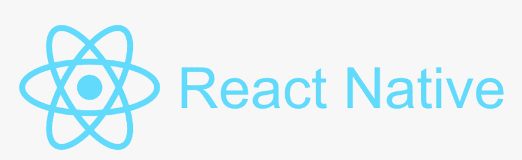

# WalletConnect Android SDK 替代方案–使用 Moralis 认证 Android 应用

> 原文：<https://moralis.io/walletconnect-android-sdk-alternative-authenticate-android-apps-withmoralis/>

**用户认证对于** [**Web3**](https://moralis.io/the-ultimate-guide-to-web3-what-is-web3/) **开发****[**构建去中心化应用(dApps)**](https://moralis.io/how-to-build-decentralized-apps-dapps-quickly-and-easily/) **至关重要，以确定用户是加密钱包的合法所有者。此外，一旦用户通过身份验证，我们的**[**dApps**](https://moralis.io/decentralized-applications-explained-what-are-dapps/?utm_source=blog&utm_medium=post&utm_campaign=How%2520to%2520Connect%2520to%2520Avalanche%2520Nodes)**就可以获取有关令牌和 NFT 余额、交易历史等更多信息。然而，如果没有底层的后端基础设施和适当的工具，对用户进行身份验证会非常麻烦。在这个过程中有一个辅助工具就是** [**Moralis 软件开发工具包**](https://moralis.io/exploring-moralis-sdk-the-ultimate-web3-sdk/) **。该 SDK 允许您使用 WalletConnect 或 MetaMask 轻松验证用户。此外，随着 React Native 的 Moralis 集成，该操作系统现在减少了对 WalletConnect Android SDK 的需求，因为 Moralis 现在支持 WalletConnect 和 Android 开发，从而更容易开发移动兼容的 dApps。因此，在本文中，我们将进一步了解 Moralis 如何消除对 WalletConnect Android SDK 的需求。****

**Moralis 是 Web3 开发的首要操作系统，作为一名用户，你可以访问该系统提供的底层后端基础设施。这使得您可以显著降低所有未来区块链项目的开发时间。**

**此外，Moralis 提供了广泛的开发工具，使得 dApp 开发更加容易和简单。在这些工具中，你会发现 [Moralis Speedy Nodes](https://moralis.io/speedy-nodes/?utm_source=blog&utm_medium=post&utm_campaign=How%2520to%2520Connect%2520to%2520Avalanche%2520Nodes) 、 [NFT API](https://moralis.io/ultimate-nft-api-exploring-moralis-nft-api/?utm_source=blog&utm_medium=post&utm_campaign=How%2520to%2520Connect%2520to%2520Avalanche%2520Nodes) 、 [Price API](https://moralis.io/introducing-the-moralis-price-api/) 、对 [IPFS](https://moralis.io/what-is-ipfs-interplanetary-file-system/) 的本地支持等等。此外，Moralis 支持跨链兼容性，允许您为多个不同的网络开发 dApps。**

**与 Moralis 合作时，区块链开发不一定很难。通过访问所有工具和操作系统的底层后端基础设施，您将能够在几分钟和几小时内开发 dApps，而不是几天。所以，如果你还没有，注册 Moralis，你将很快成为一名区块链开发者！**

### **什么是 WalletConnect？**

**dApp 开发的一个重要方面是围绕着用户的认证。首先，我们必须有一种方法来确定用户是特定加密钱包的合法所有者。此外，一旦用户通过身份验证，就可以获取余额和交易历史等信息。反过来，我们可以向最终用户显示这些信息，以提供更具吸引力的客户体验。**

**

我们可以使用大量不同的替代方法来认证用户。然而，最重要的两个是 [WalletConnect](https://moralis.io/what-is-walletconnect-the-ultimate-walletconnect-guide/) 和 MetaMask。在本节中，我们将更深入地研究并关注 WalletConnect，而不是 MetaMask。但是，如果你有兴趣了解更多关于后者的信息，你可以去访问[的 Moralis 博客](https://moralis.io/blog/)，获得[元掩码](https://moralis.io/metamask-explained-what-is-metamask/)的完整解析。

对 WalletConnect 的一个常见误解是，人们经常把它误认为是一个应用程序。然而，事实并非如此，因为 WalletConnect 是一个 Web3 协议，它将移动加密钱包连接到各种 dApps。

该协议支持几种不同的加密钱包，在备选方案中，您会发现最流行的一种——元掩码。此外，该协议在 dApp 和钱包之间建立连接。这种连接可以通过以下两种方式之一实现:深度链接或者二维码。因此，这使得用户可以通过他们的移动设备直接与 dApps 进行交互。此外，由于手机参与了这一过程，这意味着比 MetaMask 更高的安全性。

因此，WalletConnect 为 Web3 打开了一扇额外的大门，这是一个只能通过 MetaMask 才能进入的领域。此外，WalletConnect 协议支持更多的加密钱包，如 TrustWallet、Rainbow、Argent 等，增加了一层多样性。

### 什么是 React Native？

为了理解为什么 Moralis 减轻了对 WalletConnect Android SDK 的需求，我们需要理解 React Native。因此，我们将利用文章的这一部分来更深入地研究 React Native。那么，什么是 React Native 呢？



React Native 是一个基于 JavaScript 的框架，允许开发人员创建本地呈现的 Android 和 iOS 应用程序。React Native 吸引人的地方在于，它能够利用框架为几种不同的平台创建应用程序，同时使用相同的代码库。

React Native 最初于 2015 年发布，并迅速成为开发基于移动的应用程序的主要解决方案。大部分的成功源于这样一个事实，即该框架基于一个流行的 JavaScript 库 [React](https://moralis.io/react-explained-what-is-react/) 。而且，React Native 还允许企业开发兼容 Android 和 iOS 的应用。这使他们能够节省大量的资源和时间。

这被称为“跨平台”，使开发人员能够构建可以在多个不同平台上运行的代码库。同时，另一种选择是在本地构建软件，使其与单一平台兼容。此外，跨平台集成允许开发人员使用他们已经精通的工具创建应用程序，如 [JavaScript](https://moralis.io/javascript-explained-what-is-javascript/) 。因此，它不是唯一受益于 React Native 的企业，开发人员也一样，因为开发过程更容易访问。

此外，可以将 React Native 集成到现有项目中，或者从头创建一个新项目。因此，您可以根据自己的偏好和各种项目的具体需求来选择使用 React Native 的程度。

因此，与 React Native 合作提供了大量的好处，这就是 Moralis 决定集成该框架的原因。然而，这如何转化为去中心化的网络？

## WalletConnect Android SDK 替代方案–Moralis 对 React Native 的支持

在开发 dApps 时，包容性变得非常有益。许多人在与应用程序交互时更喜欢使用他们的移动设备，这意味着我们不能忽视移动用户。由于这种情况，迎合所有不同的设备以提供引人注目的跨平台体验是至关重要的。没有这一点，它可能会成为有问题的“商业智慧”，因为你会失去潜在的 dApp 用户。此外，开发与几种不同平台兼容的 dApps，至少从传统的角度来看，是相当麻烦的。然而，这不再是与 [React-Moralis](https://github.com/MoralisWeb3/react-moralis) 集成的情况。


[Moralis 对 React Native 的支持](https://moralis.io/moralis-introduces-react-native-support/)使开发人员在开发移动兼容的 Web3 dApps 时能够利用 Moralis 的功能和工具。这意味着开发人员现在可以快速轻松地创建满足网络和移动用户需求的 dApps，同时与 Moralis 合作。因此，开发人员可以克服创建基于移动的应用程序的一些困难。

这表明 Moralis 对 React Native 的集成缓解了对 WalletConnect Android SDK 的需求。此外，由于操作系统支持 WalletConnect 和 React Native，开发以 WalletConnect 为中心认证机制的强大移动 dApps 已经成为可能。此外，由于 Moralis 具有对 WalletConnect 的本地支持，因此添加该协议作为身份验证机制变得相对简单。事实上，用几行简单的代码就可以做到这一点。

为了说明这一点，我们将在下一节中仔细研究如何实现这一点。因此，我们将通过一个例子来介绍使用 Moralis 作为 WalletConnect Android SDK 替代方案来验证移动用户的过程。

## WalletConnect Android SDK 示例–如何开始

在本文的这一部分中，我们将通过创建一个示例 dApp 来进一步了解 Moralis 如何作为 WalletConnect Android SDK 的替代方案。我们将简要介绍使用已经准备好的模板开发基于以太坊的、移动兼容的 dApp 的基础知识。这将突出与 Moralis 合作的好处，因为我们将能够在几分钟内创建一个 dApp。


在本例中，我们正在使用 Visual Studio 代码，您需要做的第一件事是确保安装了“react”、“react-dom”和“moralis”依赖项。接下来，您还需要安装“react-moralis”依赖项，这可以通过以下方法之一来完成:

Npm 管理器 : *npm 安装 react react-DOM moralis react-moralis*

**纱经理** : *纱加 react react-DOM moralis react-moralis*

安装完所有依赖项后，下一步是将应用程序包装在一个“<moralisprovider>”中，如下所示:</moralisprovider>

```js
import React from "react";
import ReactDOM from "react-dom";
import { MoralisProvider } from "react-moralis";

ReactDOM.render(
 <MoralisProvider appId="xxxxxxxx" serverUrl="xxxxxxxx">
  <App />
 </MoralisProvider>,
 document.getElementById("root"),
);

Finally, all that remains is to call the hooks inside the application: 

import React from "react";
import { useMoralis } from "react-moralis";

function App() {
 const { authenticate, isAuthenticated, user } = useMoralis();

 if (!isAuthenticated) {
  return (
   <div>
    <button onClick={() => authenticate()}>Authenticate</button>
   </div>
  );
 }

 return (
  <div>
   <h1>Welcome {user.get("username")}</h1>
  </div>
 );
}
```

这涵盖了移动兼容[以太坊](https://moralis.io/full-guide-what-is-ethereum/) dApp 的基本设置，这是我们 WalletConnect Android SDK 替代示例的第一步。在下一节中，我们将详细介绍一个 Moralis React 本机模板，您可以利用它来创建 dApp，更具体地说，就是负责 WalletConnect 身份验证过程的函数。

然而，这并没有涵盖让应用程序工作的所有必要步骤。例如，您还需要初始化 WalletConnect 和 Moralis。然而，如果你继续读下去，我们会提供一个链接，链接到一个关于开发移动友好以太坊 dApps 的更广泛的指南。

## WalletConnect Android SDK 示例–Moralis 反应本机模板

现在，在应用程序内部调用钩子后，WalletConnect Android SDK 示例的下一部分将继续利用和探索 [Moralis React 本机模板](https://github.com/MoralisWeb3/demo-apps/tree/main/react-native-boilerplate)。你可以在 [Moralis GitHub](https://github.com/MoralisWeb3) 页面上找到这个模板和更多信息。而且，以后构建自己的以太坊移动应用时，可以自由使用这个模板。


如果你仔细看看这个模板，你会发现它非常广泛，包含了很多代码。出于这个原因，我们无法涵盖完整的代码，而是将重点放在验证用户的功能上，该功能可以在“App.tsx”文件中找到。在下面的函数中，我们指定 WalletConnect 应该是主要的身份验证备选方案，如下所示:

```js
function App(): JSX.Element {
 const connector = useWalletConnect();
 const { authenticate, authError, isAuthenticating, isAuthenticated, logout, Moralis } = useMoralis();

 return (
  <View style={[StyleSheet.absoluteFill, styles.center, styles.white]}>
   <View style={styles.marginLarge}>
    {authError && (
     <>
      <Text>Authentication error:</Text>
      <Text style={styles.margin}>{authError.message}</Text>
     </>
    )}
    {isAuthenticating && <Text style={styles.margin}>Authenticating...</Text>}
    {!isAuthenticated && (
     // @ts-ignore
     <TouchableOpacity onPress={() => authenticate({ connector })}>
      <Text>Authenticate</Text>
     </TouchableOpacity>
    )}
    {isAuthenticated && (
     <TouchableOpacity onPress={() => logout()}>
      <Text>Logout</Text>
     </TouchableOpacity>
    )}
   </View>
   {isAuthenticated && (
    <View>
     <UserExample />
     <Web3ApiExample />
    </View>
   )}
  </View>
 );
}
```

### 认证功能

最初，在函数的第二行，我们指定连接器" *const* "等于 WalletConnect。将连接器设置为 WalletConnect 后，当我们在代码的后面调用“ *authenticate()* ”函数时，我们继续传递这个“ *const* ”作为参数。这确保了我们使用 WalletConnect，而不是默认的替代方法 MetaMask。这涵盖了认证过程的基础；然而，正如您所看到的，这个函数有更多的功能。例如，它还能做其他有用的事情，比如显示用户的电子邮件地址和获取余额等信息。

然而，这只是模板的一小部分。此外，它还专门介绍了如何在移动友好的以太坊 dApp 中使用 WalletConnect 对用户进行身份验证。假设您想要关于应用程序其他部分的更多信息。这可能是如何指定提供者或初始化 Moralis 和 WalletConnect(使应用程序工作的重要步骤)。在这种情况下，请查看以下来自 Moralis 博客的关于创建[移动以太坊 dApp](https://moralis.io/create-mobile-ethereum-dapp-with-react-native-template/) 的指南。

此外，如果你对 Web3 游戏开发等领域感兴趣，你绝对应该去看看 Moralis 元宇宙 SDK。这使得你可以通过 Unity 快速开发适用于 Xbox、PlayStation、Android 和 iOS 等多个平台的元宇宙游戏。

## WalletConnect Android SDK 替代方案–摘要

至少从传统的角度来看，Web3 开发的一个常见问题是跨平台兼容性。分散式应用程序(dApps)通常是为网络使用而开发的，这意味着移动用户被忽视了。此外，Web3 开发的另一个重要方面是用户认证，这在开发移动兼容的 dApps 时尤其麻烦。反过来，需要一个 WalletConnect Android SDK 来使 WalletConnect 身份验证更容易用于移动开发。

然而，幸运的是，这种需求现在已经得到缓解，因为 Moralis 为这个问题提供了一个解决方案。Moralis 对 WalletConnect 和 React Native 有原生支持。这意味着该操作系统满足了与 WalletConnect Android SDK 相同的需求。因此，可以在 mobile Web3 开发中利用 Moralis 的所有工具，包括 WalletConnect 集成。

在本文中，我们通过仔细研究如何使用兼容移动设备的以太坊 dApp，说明了如何使用 Moralis 作为 WalletConnect Android SDK 的替代品。随着启动过程的进行，我们仔细研究了 Moralis React 本机模板，重点关注[如何将用户与 WalletConnect](https://moralis.io/how-to-connect-users-with-walletconnect/) 连接起来。

然而，这远远不是 Moralis 的极限，因为操作系统使所有 Web3 开发更容易实现。如果你愿意，你绝对应该看看 Moralis 博客的更多内容。在那里，您可以找到更多的文章，例如， [ERC20 契约](https://moralis.io/what-are-erc20-contracts-full-erc20-contract-guide/)、[智能契约索引](https://moralis.io/the-graph-alternative-for-smart-contract-indexing/)、[如何连接到雪崩节点](https://moralis.io/how-to-connect-to-avalanche-nodes/)等等。

所以，如果你想成为区块链的开发者，第一步就是和 T2 签约。一旦成为会员，你就可以在几分钟内[建造你的第一个区块链 dApp](https://moralis.io/build-your-first-dapp-ethereum-tutorial/) 。此外，您还可以毫无困难地满足桌面和移动用户的需求！**