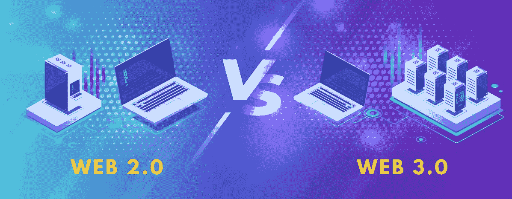
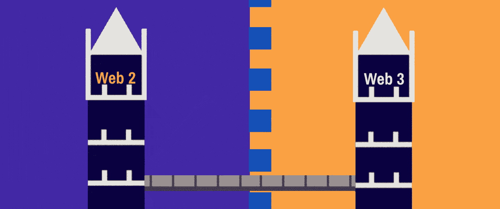
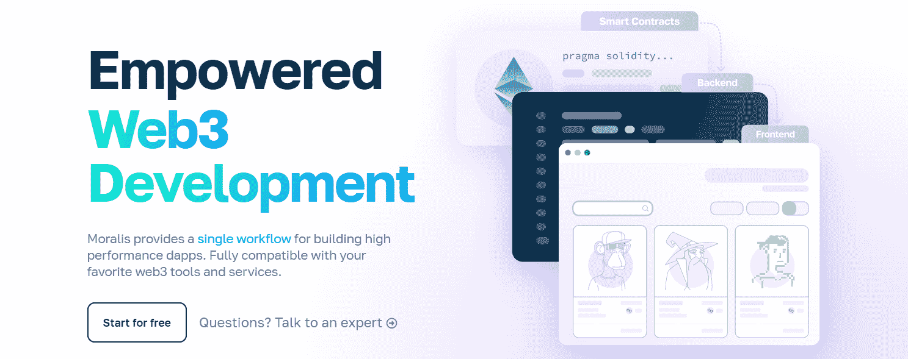
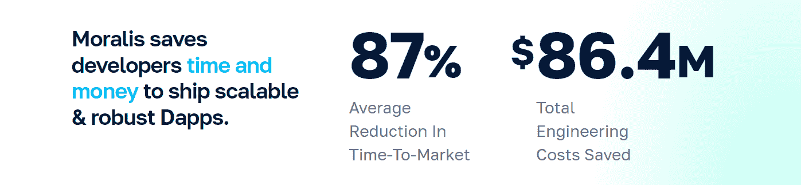
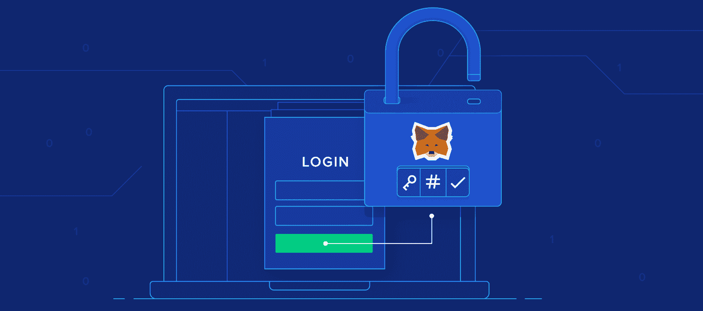
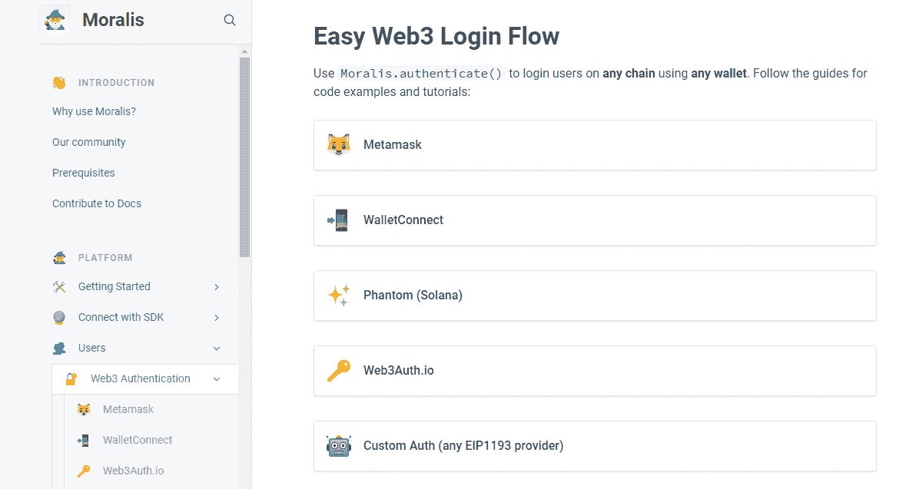
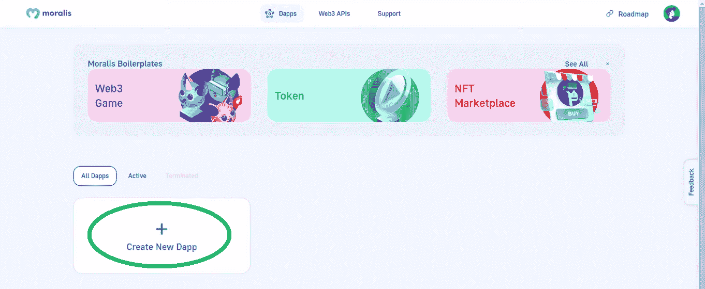
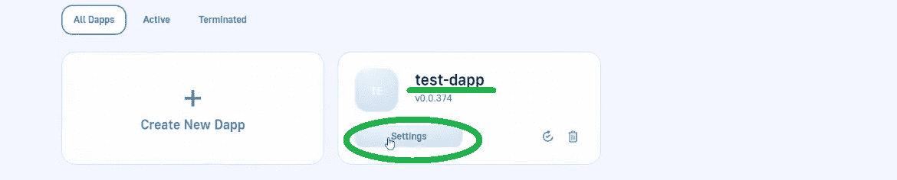

# Web2 到 Web3–桥接 Web2 和 web 3

> 原文：<https://moralis.io/web2-to-web3-bridging-web2-and-web3/>

我们已经进入了一个时代，在这个时代，连接 Web2 和 Web3 非常重要。当然，在许多方面，Web3 才刚刚起步，Web2 仍然是大多数企业和普通人使用的。然而，那些了解 Web3 的人可以清楚地看到，区块链技术将继续存在。可以有把握地推测，在未来的 10 年或 15 年里，大多数行业都将因 Web3 的出现而改变，就像它们因互联网而改变一样。然而，同样清楚的是，所有的在线活动都不需要 Web3。因此，我们可以预计，在未来几年，网络世界将走向 Web2 和 Web3 的混合。因此，将 Web2 和 Web3 连接起来将是确保用户能够体验 Web 最佳体验的关键。

此外，你还应该记住，虽然许多公司看到了 Web3 的潜力，但他们仍然更关注私人区块链。其定义模糊了 Web2 和 Web3 之间的界限。当桥接 Web2 和 Web3 时，最终目标是使用户体验尽可能友好。本质上，大多数用户不会在乎他们是在 Web2 还是 Web3 上，只要他们能得到两个世界的好处。然而，为了实现这一点，开发人员(他们大部分都具备 Web2 技能)能够毫不费力地过渡到 Web3 开发也是至关重要的。因此，连接 Web2 和 Web3 的效率很大程度上取决于开发工具的质量。这也是 Moralis 已经在创造一个与众不同的世界的地方。不过，在我们进一步讨论 Moralis 的力量之前，让我们比较一下 Web2 和 Web3。

## Web2 vs Web3

概述这两个 Web 之间的主要区别可以真正帮助你理解【Web2 和 Web3 是什么！只有当我们理解了这些关键的区别，我们才能开始把重点放在连接 Web2 和 Web3 上。

*   **信任模型**
    *   网站 2:
        *   集中式服务、服务器和软件
        *   用户需要信任服务、服务器和软件背后的公司
    *   网站 3:
        *   分散化；点对点；没有中央权威；没有单点故障
        *   信任被最小化——用户需要信任去中心化的协议。

*   **治理**
    *   网站 2:
        *   数字巨头巩固治理权力
    *   网站 3:
        *   分散自治组织(Dao)确保治理被分发给治理令牌持有者

*   **商业模式**
    *   网站 2:
        *   数字巨头和服务提供商拥有客户数据
        *   他们利用客户数据来赚取收入
    *   网站 3:
        *   区块链网络为交易验证者的工作/股份(PoW/PoS)支付报酬
        *   博弈论被用来维护交易的完整性

*   **内容**
    *   网站 2:
        *   动态、用户生成
        *   源内容可以复制
    *   网站 3:
        *   用户拥有内容(与 Web 2.0 服务分离)

*   **用户参与模式**
    *   网站 2:
        *   免费服务换取用户数据
        *   向中介支付运行服务和软件的费用
    *   网站 3:
        *   用户拥有自己的数据和内容，并可以将其货币化
        *   直接向区块链交易验证器付款

*   **用户界面**
    *   网站 2:
        *   网
        *   社交网络
        *   移动应用
    *   网站 3:
        *   分散式应用程序
        *   集中式市场或服务

*   **用户认证方式**
    *   网站 2:
        *   用户 id
        *   密码
        *   其他认证
    *   网站 3:
        *   在区块链上解锁所有者记录的私钥
        *   私钥可以在自托管钱包或第三方钱包中

*   **财务系统**
    *   网站 2:
        *   银行、其他金融机构和网络集中管理金融系统。
    *   网站 3:
        *   智能合约(链上软件)和区块链协议运行着金融系统。
        *   没有集中控制
        *   无需支付中介费用

*   **货币**
    *   网站 2:
        *   中央管理和政府支持
    *   网站 3:
        *   建成分权的区块链
        *   用户是自己的银行；但是，他们可以委托集中交换。

# 桥接 Web2 和 Web3

正如引言中所指出的，Web2 和 Web3 很可能在未来共存。因此，有好的工具来连接 Web2 和 Web3 是至关重要的。而且，正如上面提到的，开发人员是能够实现这一点的人。因此，基础设施开发人员，尤其是确保那些具有 Web2 开发技能的人能够进行 Web3 开发是至关重要的。

想象一下，精通 JavaScript 的开发人员可以在一个平台上轻松创建 dapps。或者，Unity 专家可以很容易地钻研 Web3 游戏设计。那不是很棒吗？那样的话，我们就已经有足够多的建设者来开始塑造吸引大众所需的 Web3 UIs 了。更多的用户友好的 Web3 应用程序意味着更快的 Web3 采用，因此也意味着更分散的未来。幸运的是，这种平台已经存在，并被称为 Moralis(又名加密的 Firebase)。所以，这个最终的 Web3 开发平台已经在 Web2 和 Web3 之间架起了桥梁。此外，我们将在下一节向您展示它是如何做到这一点的。

## 如何将你的 Web2 项目与 Web3 联系起来

无论您是希望构建一个完全融入 Web3 的硬核 dapp，还是只想在您的 Web2 项目中添加一些 Web3 功能，Moralis 都是可以使用的工具。通过桥接 Web2 和 Web3，甚至为 Web2 开发人员开始构建 Web3 项目变得非常容易。如前所述，JavaScript 或 Unity 技能以及一些基本的 Web3 知识是你开始工作所需要的。总而言之，对于 Web2 开发者来说，Moralis 是让他们的用户或客户体验 Web3 的最简单的方法。

Moralis 通过让开发者访问核心 Web3 功能而获得了这一声誉。这些包括 [Web3 用户认证](https://moralis.io/authentication/)，Web3 数据同步，当然还有 Moralis 的 API，比如 [NFT API](https://moralis.io/nft-api/) ， [Web3 API](https://docs.moralis.io/moralis-dapp/web3-api) 等等。因此，您可以毫不费力地满足所有与区块链相关的后端需求。大多数任务可以通过简单地从 Moralis 文档中复制一小段代码来完成。因此，您可以避免处理 RPC 节点的所有限制。

实质上，Moralis 为构建高性能 dapps 提供了单一的工作流程。此外，根据数千个使用 Moralis 的项目，这个平台平均为开发者节省了 87%的上市时间。这意味着需要更多的时间和资源来创造最佳的前端体验。然而，多亏了 Moralis 的 web3uikit，在这方面你也有几条捷径可以选择。

此外，以下是 Moralis 为您提供的 Web3 工作流程，它尽可能简单明了:

1.  **验证您的用户**
2.  **监控历史和实时交易**
3.  **为任何平台使用强大的 SDK**–Moralis 是跨平台功能
4.  **利用跨链的 web 3 API**–Moralis 是关于跨链互操作的

此外，Moralis 提供了与插件生态系统的无限集成。

### 使用 Web3 身份验证连接您的 Web2 用户群

因为 Web3 身份验证是大多数 dapps 的起点，所以您应该了解更多。所以，有了你在这里学到的信息，你就可以开始创造杀手 dapps 了。在桥接 Web2 和 Web3 时，您可以将 Web3 身份验证视为第一步。基本上，Moralis Web3 身份验证 API 为现有的用户数据库和现有的 Web2 身份验证流提供了即插即用的 Web3 解决方案。它让 Web3 onboarding 变得简单得可笑。有了这个 Web3 身份验证 API，您可以登录任何链和任何 Web3 钱包的用户。因此，您可以毫不费力地与后端系统建立经过身份验证的 web 会话。

Moralis Web3 身份验证 API 适用于项目中需要 Web3 身份验证解决方案的所有人。此外，如果您有一个现有的 Web2 用户数据库，并希望使用 Web3 身份验证进行连接，Moralis 会支持您。此外，Moralis 还使您能够使用身份验证聚合器，如 Auth0 或 Web3Auth。因此，您可以轻松地在 dapps 上实现已知的 Web3 登录方法。这意味着您可以通过电子邮件或社交媒体提供身份验证，从而提高 Web3 用户的登录成功率。

此外，当您使用这个 Web3 身份验证解决方案时，您真的不需要担心技术问题。您所需要的只是简单地从 Moralis 文档中复制一行代码。你只需要使用“Moralis.authenticate()”让用户使用任何钱包登录任何链。此外，到目前为止，您已经知道 Moralis 完全是关于跨平台和跨链的互操作性。因此，它可以帮助您的身份验证流程面向未来。如果说 Web3 行业有什么可以确定的话，那就是它发展得很快。所以，你要为新的钱包、可编程链和认证方法不断出现做好准备。

#### 实施 Web3 身份验证

正如您在上面所了解到的，Web3 身份验证基本上是所有 dapps 的起点。因此，它也是 Web2 和 Web3 开始连接的地方。因此，如果您精通 JavaScript 并对成为 Web3 开发人员感兴趣，我们鼓励您从一些“Web3 认证”示例项目开始。下面是几个视频教程，可以帮助你掌握这个简单的网关。

*   如何使用元掩码进行身份验证:

https://youtu.be/6BfOtYfwFBI

*   使用此视频学习使用 WalletConnect 进行身份验证，这是移动用户的最佳选择之一:

https://youtu.be/3Ij6wp0fuXw

*   在这里，您可以了解如何使用 Google、电子邮件、Twitter 和其他社交媒体提供 Web3 登录:

https://youtu.be/44ItBuw86AA

*   使用此视频实施“神奇链接”认证:

https://youtu.be/gLJ4YejmG2E

当然，为了利用 Moralis 的力量来连接 Web2 和 Web3，您需要完成初始的 Moralis 设置。

### 用 Moralis 来沟通网站 2 和网站 3

以下是您需要完成的步骤，以访问 Moralis 的 SDK，从而显著减少您的 dapp 开发时间:

1.  访问 Moralis 官方网页，在这里您可以创建您的免费 Moralis 帐户:

2.  进入 Moralis 管理区后，点击“创建新的 Dapp”按钮，开始三步设置:

3.  设置的第一步要求您选择网络类型:

*注意* *:在进行示例项目和开发 dapps 时，最好使用“Testnet”选项。*

4.  接下来，您需要选择一个您想要关注的网络。您也可以同时选择多个链。尽管如此，正如下面的截图所示，“多边形孟买”网络是一个很好的选择，因为它的交易费用非常低。选择网络后，您需要单击“继续”按钮来确认您的选择:

5.  初始设置的第二步要求您选择您所在的地区。本质上，你需要从下拉菜单中选择离你最近的城市。然后，再次单击“继续”按钮继续前进:

6.  第三步是你需要命名你的 dapp。在这里你可以尽情发挥创造力。然而，为了这个演示，我们使用了“test-dapp”。输入姓名后，您可以通过点击“创建您的 dapp”来启动您的 Moralis Dapp:

7.  现在您的 dapp 已经启动并运行，您需要使用“设置”按钮来访问其所有详细信息和功能:

8.  默认情况下，您将进入“Dapp 详细信息”选项卡。您可以在这里复制您的 dapp 凭据:

9.  最后，您需要将上面复制的凭证粘贴到您的代码中(例如:")。env”、HTML、JS 文件、“Unity Moralis Web3 设置”窗口等。).

## Web2 到 web 3–桥接 Web2 和 web 3–总结

我们在今天的文章中谈了相当多的内容。在这一点上，你知道目前我们所使用的两个网站之间的主要区别。此外，您还了解了如何将 Web2 和 Web3 联系起来。因此，你现在明白了开发者是主流采用新网络的关键。此外，您还了解到，在未来十年左右的时间里，Web2 和 Web3 很可能会共存。因此，使用工具来处理这种共存的开发人员将会占上风。

有鉴于此，我们仔细研究了 Moralis，尤其是 Moralis Web3 身份验证 API。后者帮助你毫不费力地开始 Web3 开发，并轻松地接纳 Web2 用户。然后，我们还与您分享了四个示例项目，它们可以帮助您练习实现 Web3 身份验证。最后但同样重要的是，我们引导您完成了初始 Moralis 设置的过程。因此，你现在已经有了所有你需要的信息来决定你是否想成为一名区块链开发者。

而且，如果那是你想探索的职业，我们推荐下面两条路中的一条。如果你更喜欢通过观看教程和阅读指南来学习，你应该深入到 Moralis 家的 YouTube 频道和 Moralis 家的博客。由于这两个渠道定期发布大量有价值的内容，它们可以满足您持续的加密教育需求。另一方面，如果你喜欢采取更专业的教育方法，报名参加[Moralis 学院](https://academy.moralis.io/)可能是你的道路，或者从经验丰富的 [NFT 程序员](https://nftcoders.com/)那里了解 NFT，到[开始生成 NFT](https://nftcoders.com/begin-generating-nfts-in-15-minutes/)，了解 [NFT 用例](https://nftcoders.com/learning-all-about-nft-use-cases-in-2022/)，等等！除了顶级的区块链发展课程，这里也是成为业内最先进社区成员的地方。