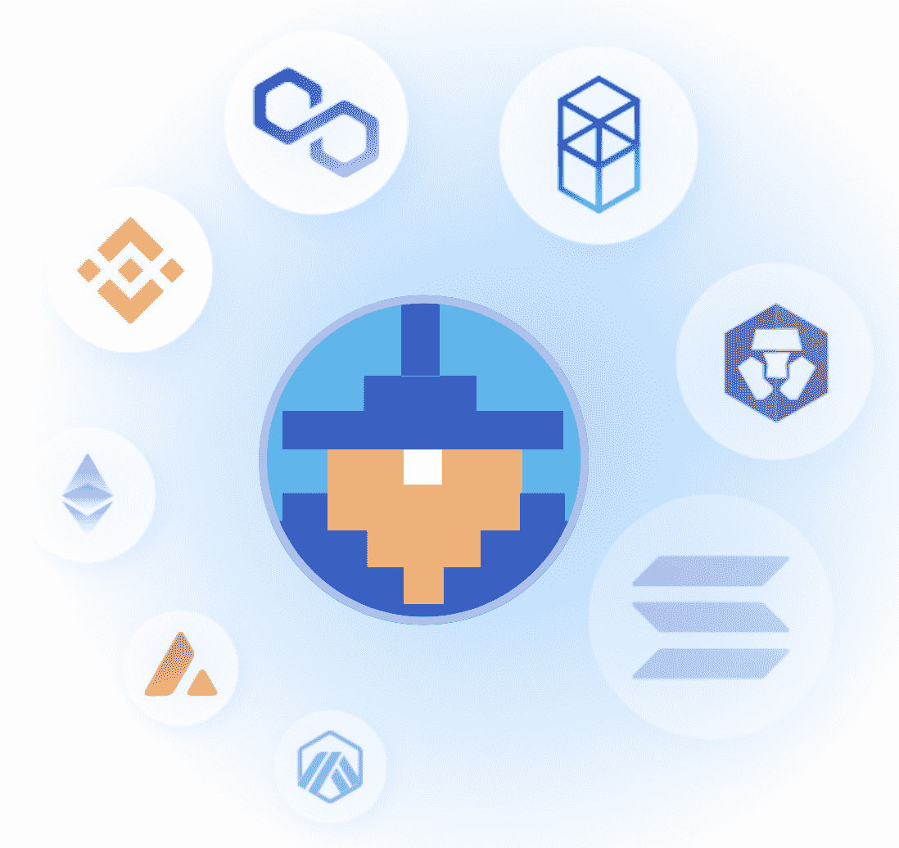
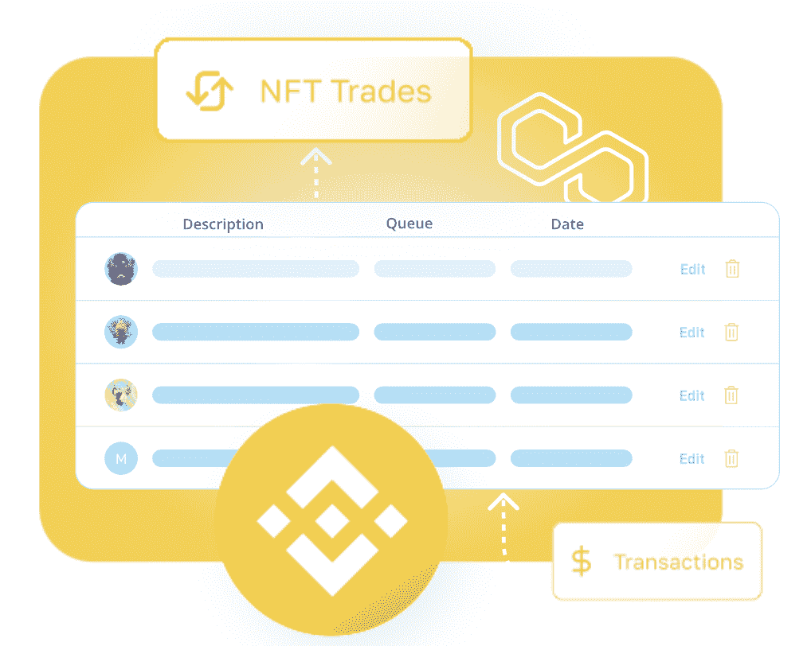
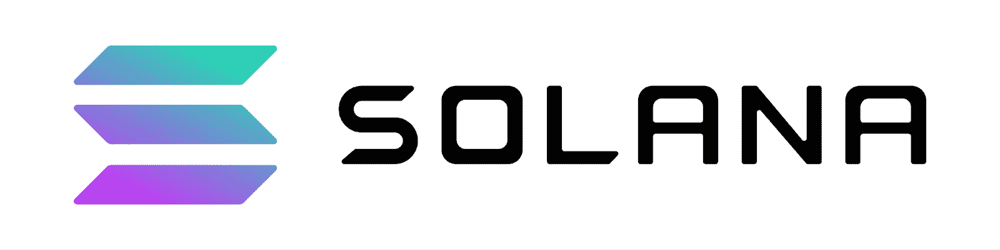
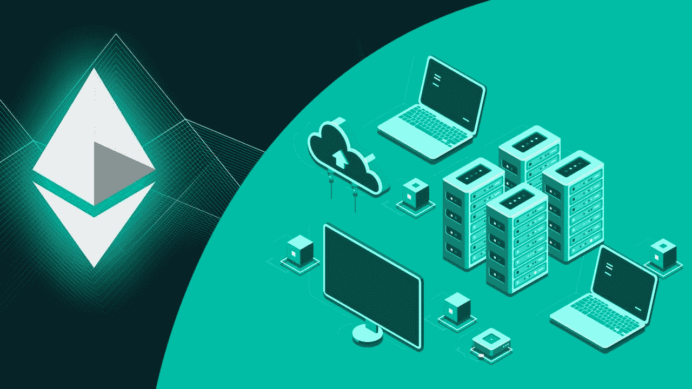

# web 3 API–探索 5 大区块链 API

> 原文：<https://moralis.io/web3-apis-exploring-the-top-5-blockchain-apis/>

在基于 Web3 构建时，Web3 APIs 至关重要，因为这些 API 能够带来流畅的开发体验。您是否知道 [**Moralis 家**](https://moralis.io/) **提供了一些业界最强大的 Web3 APIs？此外，你知道你可以利用这些连接任何技术栈到区块链网络吗？如果您想进一步研究这些，请跟随我们探索排名前五的区块链 API！**

在探索最佳 Web3 APIs 之前，我们将通过解释 API 的复杂性来开始本指南。这样做将提供什么是 API 以及它们如何对开发人员有所帮助的简要概述。接下来，我们将探讨五大 Web3 APIs。具体来说，我们将仔细研究 Moralis 的 NFT、认证、流、Solana 和 EVM API。

上面的 API 在几个不同的 [Web3 开发](https://moralis.io/how-to-build-decentralized-apps-dapps-quickly-and-easily/)领域有很大的帮助。因此，有可能将 Moralis 集成到任何后端，使您作为开发人员的任务更加简单明了。更重要的是，Moralis 在 Web2 和 Web3 之间架起了一座桥梁，允许您创建功能强大的 dapps(分散式应用程序),并具有传统 Web2 开发的可访问性。此外，由于 Moralis 本身是跨链兼容的，所以 Web3 APIs 支持几种不同的网络。因此，在与 Moralis 合作时，你不会将自己或项目局限于某个特定的网络。

因此，如果你想[创建一个 Web3 dapp](https://moralis.io/how-to-create-a-web3-dapp-in-3-steps/) 、DeFi 平台或其他 Web3 项目，可以考虑与 Moralis 签约。作为 Moralis 会员，您将立即获得所有 API，简化区块链相关数据与任何项目的集成。更重要的是，创建一个 Moralis 账户是免费的，所以你不会有任何损失！

## 什么是 Web3 APIs？

在探索前五名区块链 API 之前，我们将在第一部分深入探究 Web3 APIs 的复杂性。因此，我们将简要回答这个问题，“什么是 Web3 APIs？”。但是，如果您已经熟悉 Web3 APIs，我们建议您跳过这一部分，直接进入下一节，在这一节中，我们将探索五大区块链 API。

API 是“应用编程接口”的缩写。此外，API 负责通过翻译相关理解的指令来促进软件之间的通信。这进一步意味着，Web3 APIs 通过可靠且一致地根据请求提供功能，负责在安全和受控的开发环境中实现可靠的编程。

此外，可以使用类比来使上述解释更容易理解。在这种情况下，我们将以一家餐馆为例。在这个比喻中，厨房是处理你的订单的“系统”或“软件”。但是，在去餐厅的时候，你一般不会直接和厨房沟通。取而代之的是，你使用一个中介，比如女服务员或侍者。在我们的例子中，服务员是 API，因为他们促进了你和厨房之间的交流。女服务员/服务员传递你的订单(请求)，并向你提供来自厨房(系统)的响应，即食物。

无论何时浏览互联网，当您的设备连接到互联网并向数据库或服务器发送信息时，您都会接触到 API。随后，接收端分析数据，执行操作并发回响应。然后，您的设备解释这些信息，并以可读的方式呈现出来。类似地，Web3 APIs 通常在区块链空间中促进这一完整过程。因此，Web3 APIs 为全世界的开发者打开了 Web3 开发的大门！

## 前 5 大区块链 API–Moralis 的 Web3 APIs

随着对 Web3 APIs 更深刻的理解，我们现在将发现最佳的替代方案。Moralis 提供市场上最好的区块链 API，允许您轻松开发 dapps、DeFi 平台和其他令人兴奋的 Web3 项目。如果你使用 Moralis，你可以显著提高效率，击败市场竞争对手。事实上，Moralis 是构建 Web3 应用程序最快的方法！

此外，Moralis 提供了一系列优秀的 API，可以帮助所有的开发过程。不管你是想建造一个多边形 dapp 还是 T2 建造一个索拉纳 NFT 探险者 T3。你仍然可以从 Moralis 提供的工具中获益。

为了更好地理解 Moralis 如何使 Web3 开发变得更容易，我们将在接下来的几个小节中探讨 Web3 的五大 API。此外，这些是我们将深入探讨的 API:

1.  NFT API
2.  认证 API
3.  流 API
4.  索拉纳 API
5.  EVM API

如果这些看起来很有趣，并且您想了解更多关于业内一些最有效的 API 的信息，请跟随我们一起深入探究前面提到的 Web3 APIs。所以，事不宜迟，让我们从深入探究 Moralis 的 NFT API 开始吧！

### NFT API

Moralis 的 [NFT API](https://moralis.io/nft-api/) 集合了构建复杂的 NFT 相关 dapps(去中心化应用)所需的一切。此外，您可以使用 Moralis 的 NFT API 轻松获取 NFT(不可替换令牌)数据，并且可以快速获取 NFT 元数据、传输数据、价格、所有权数据等等！

在 Moralis 的 NFT API 之前，获取 NFT 数据是一项相对麻烦的任务。它通常要求您解析单个智能契约、对不规则数据集进行排序、查询元数据节点等。但是，您现在可以避免这些不必要的任务。相反，你所需要的是一个单一的调用来检索任何区块链 Moralis 支持的 NFT 信息！

以下是 Moralis NFT API 的一些主要特性:

*   **获取 NFT 元数据**–使用 Moralis，您可以避免查询不可靠的 IPFS 服务或元数据服务器，只需通过一次 API 调用就可以获取元数据。此外，该 API 是跨链兼容的，并具有一个搜索端点。这表明您可以选择在特定的 NFT 数据中进行搜索。
*   **获取所有权数据**–使用 NFT API 确保您不需要任何定制代码来跟踪令牌在区块链网络中的传输。有了 Moralis，你只需一个电话就可以查询 NFT 或整个收藏的所有者。
*   **获取 NFT 转移数据**–NFT API 进一步确保您的项目保持最新的 NFT 转移数据。如果您想查询特定 Web3 钱包、特定 NFT 或实时转账的转账历史，这并不重要；Moralis 负责繁重的工作。

### 认证 API

Web3 开发的一个重要部分是认证用户。从传统的角度来看，这是一个麻烦的任务，因为它需要建立复杂的后端基础设施。然而，由于 Moralis 的 [Web3 认证](https://moralis.io/authentication/) API，这不再是一个问题。

如果您创建一个新的 Web3 应用程序，想要使用身份验证聚合器，或者使用 Web3 身份验证机制连接您现有的 Web2 用户数据库，这都没有关系；Moralis 会罩着你的。

从传统的角度来看，Web3 身份验证通常要求您理解 Web3 身份验证流程，将用户重定向到第三方界面，了解钱包如何签名/验证消息，等等。然而，现在您可以选择使用 Moralis 的认证 API。该接口提供了一个复杂的 SDK(软件开发工具包)，一个用于所有身份验证方法的统一 API，并且与身份验证聚合器兼容！

如果你想了解更多关于实现不同认证机制的知识，我们在 Moralis 有一些很好的指南。例如，了解如何[使用 RainbowKit 添加登录功能](https://moralis.io/how-to-add-a-sign-in-with-rainbowkit-to-your-project-in-5-steps/)或[添加比特币基地钱包登录功能](https://moralis.io/how-to-add-coinbase-wallet-login-functionality/)。

### 流 API

获取链上数据是大多数 dapps 和 Web3 项目的重要组成部分，使用 Moralis 的 [Web3 Streams](https://moralis.io/streams/) API，您可以通过 webhooks 将区块链数据传输到项目的后端！

此外，Streams API 提供了几个区块链和所有测试网，包括以太坊、多边形、BNB 链等。此外，Moralis 的团队正在不断增加对其他网络的支持。

该 API 允许您从多个网络接收 webhooks，并为大量不同的场景提供 L2 解决方案。这里有三个例子:

*   当一个地址发送、标桩、接收、交换等。，一种资产。
*   有人参与你的代币销售。
*   智能合同链事件根据您自己的过滤器触发。

此外，Streams API 消除了不必要的麻烦，例如连接到错误的 RPC 节点、构建不必要的抽象、浪费时间构建复杂的数据管道等。相反，您会发现 Streams API 提供了更具吸引力的开发人员体验，并有助于提高您使用 Moralis 的效率。

### 索拉纳 API

有了 [Solana API](https://docs.moralis.io/reference/solana-api) ，您现在可以选择使用 Moralis 轻松创建基于 Solana 的项目。该工具使 [Solana 编程](https://moralis.io/solana-programming-the-ultimate-guide-to-solana-development/)变得更加容易使用，使您能够大大减少开发时间。

API 提供了对用户和令牌数据的简单访问，供您在开发工作中使用。例如，您可以轻松查询的信息包括余额、价格、符号、名称等令牌数据。、和 NFT 相关的数据。

此外，API 支持 Solana mainnet 和 devnet。因此，在开发过程的所有部分都可以使用 Solana API。请记住，API 仍处于起步阶段，并且在不断扩展。因此，如果您对 Solana 网络的开发项目感兴趣，请留意新的更新和新出现的特性。

### EVM API

借助 Moralis 的 [EVM API](https://moralis.io/evm-api/) ，为 EVM 网络开发 dapps 变得前所未有的容易。EVM API 允许您轻松地从 EVM 兼容的链中获取信息，并以可访问的方式发送请求。因此，这是一个对你有很大帮助的工具，例如，以太坊开发，你可以通过提高效率来节省大量时间。此外，API 还支持所有测试网。因此，您有机会在开发过程的各个阶段使用 Moralis 的 EVM API。

此外，EVM API 是一个 REST API，默认情况下允许您在任何编程语言中调用它。因此，开发者可以很容易地通过几个平台、应用程序和 dapps(分散应用程序)发送请求和获取链上数据！

这就是前五个 Web3 APIs！要了解如何使用这些 API 的更多信息，您可以在 Moralis 的 [Web3 博客](https://moralis.io/blog/)查看更多内容。例如，学习如何[创建一个 NFT 门控网站](https://moralis.io/how-to-create-an-nft-gated-website-in-django/)或[从多边形区块链](https://moralis.io/how-to-pull-data-from-polygon-blockchain/)提取数据。

您还可以浏览 Moralis 的官方文档，从中您可以获得每个 API 的概述。此外，附加教程演示了如何启动您的第一个项目，提供了如何在实践中使用 Moralis 的 Web3 APIs 的清晰示例！

## 前 5 名 web 3 API–摘要

Web3 APIs 负责通过翻译指令来促进软件之间的通信，以便相互理解。通过这样做，API 通过一致地提供查询功能，负责在安全的开发环境中进行编程。此外，Web3 APIs 支持更易访问的区块链开发体验，允许全球开发人员节省宝贵的资源和时间。此外，在本文中，我们深入探讨了五大 Web3 APIs。通过这样做，我们研究了 Moralis 的 NFT、认证、流、Solana 和 EVM API。

前面提到的 API 提供了更有吸引力的开发人员体验，允许您更有效地创建 Web3 项目。更重要的是，由于 Moralis 的跨链能力，在为多个不同的网络开发项目时，您可以选择使用这些 API。此外，如果你想了解更多关于 Moralis 的能力，请点击 Moralis 查看更多内容。例如，我们推荐查看我们关于 Web3 的终极[NodeJS SDK](https://moralis.io/nodejs-sdk-for-web3-exploring-moralis-nodejs-sdk/)或者如何[设置自托管解析服务器](https://moralis.io/how-to-set-up-a-self-hosted-parse-server/)的文章。

此外，如果你想更加精通 Web3 开发，可以考虑报名参加[Moralis 学院](https://academy.moralis.io/)。该学院为有经验和新手开发人员提供[区块链课程](https://academy.moralis.io/all-courses)。例如，如果你是这个领域的新手，就报名参加“[区块链&比特币 101](https://academy.moralis.io/courses/blockchain-bitcoin-101) ”课程，学习基础知识。

然而，如果你想使用市场上一些最著名的 Web3 APIs，请立即与 Moralis 签约。创建一个帐户是免费的，你可以马上获得文章中提到的 API。作为 Moralis 的一员，您将能够节省资源和宝贵的开发时间。所以，现在就创建一个帐户；你没什么可失去的！