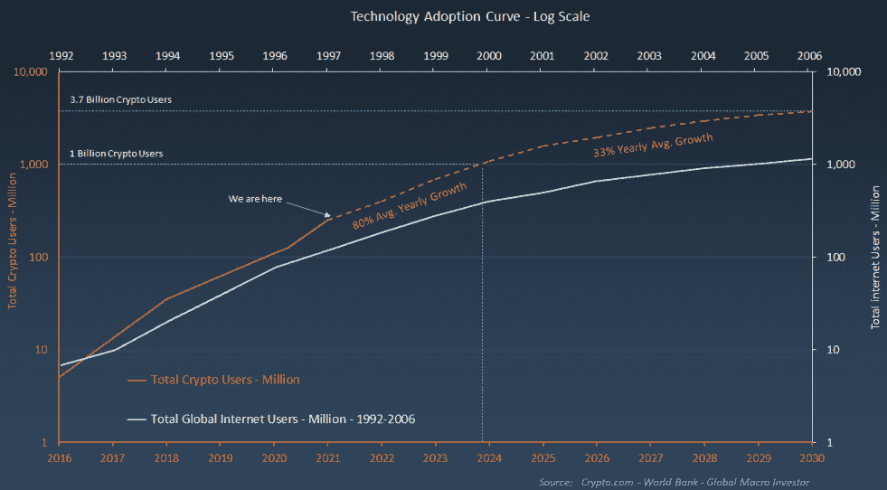
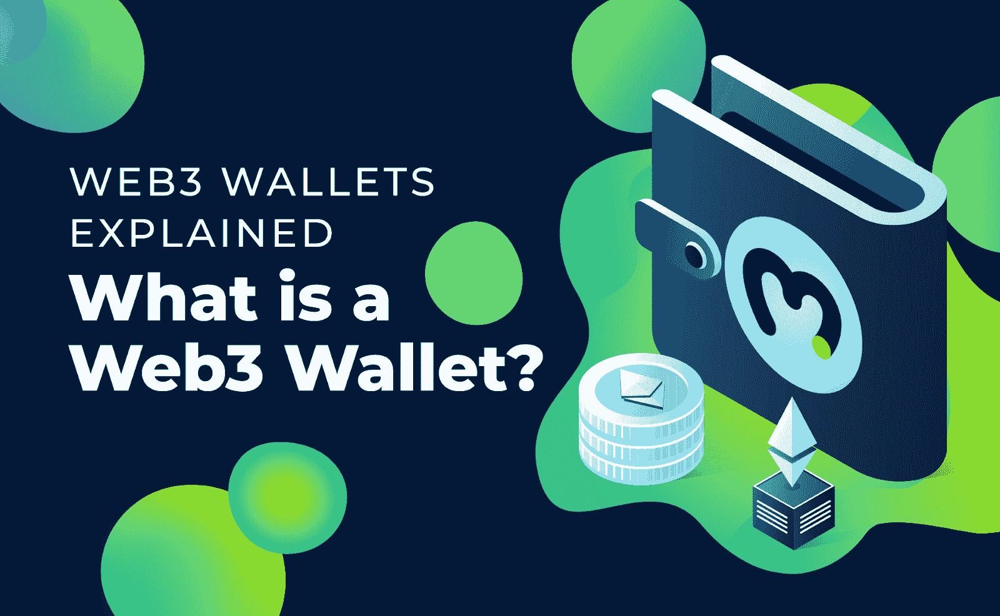
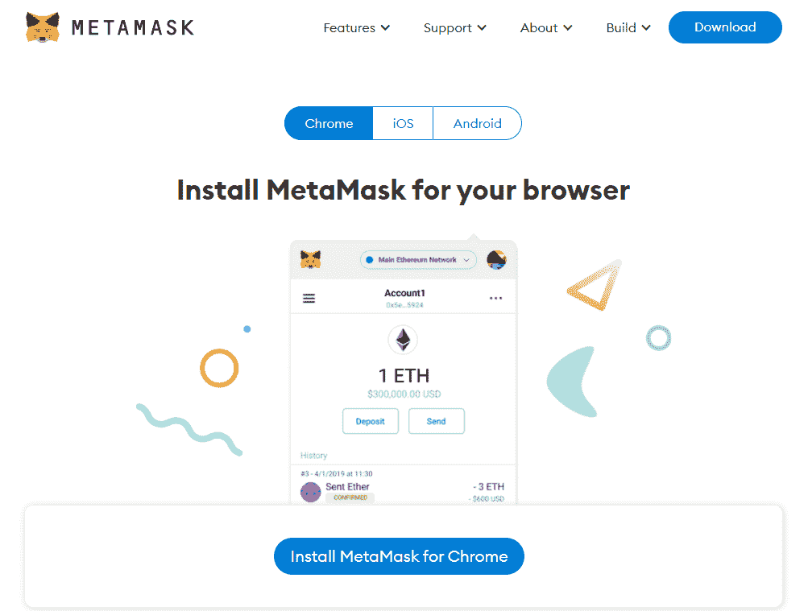
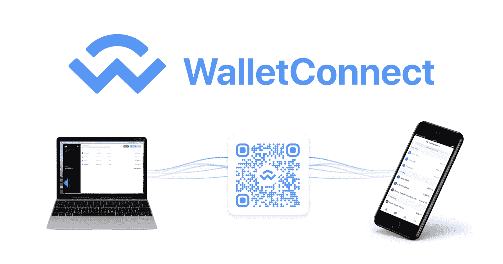
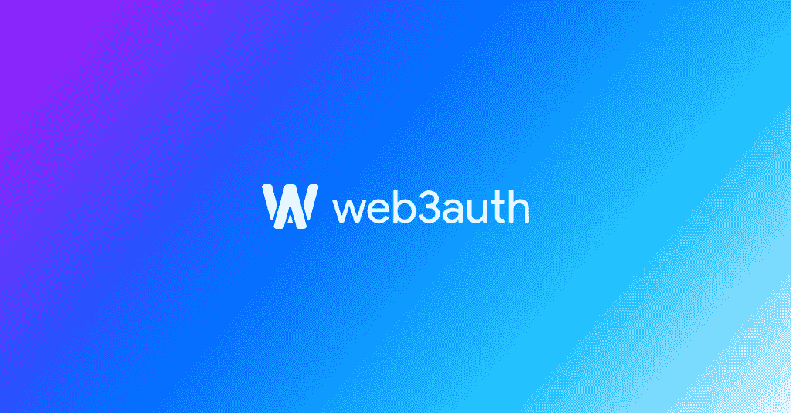
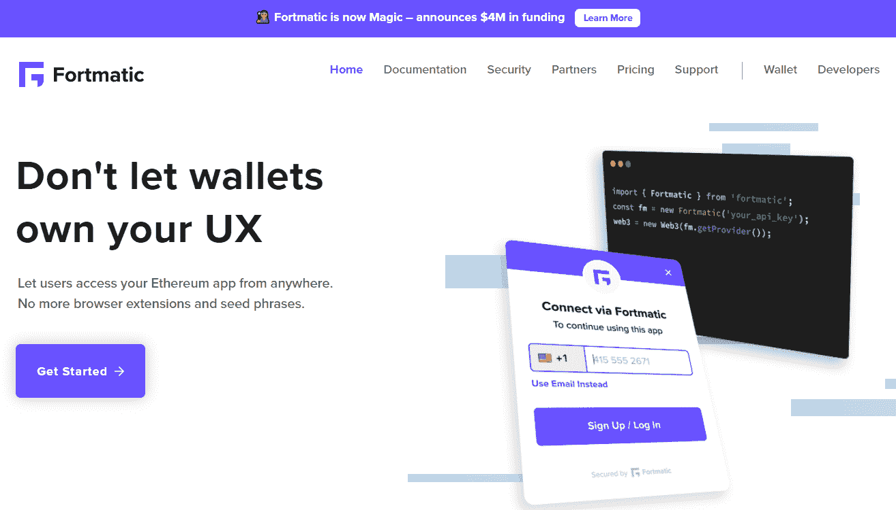
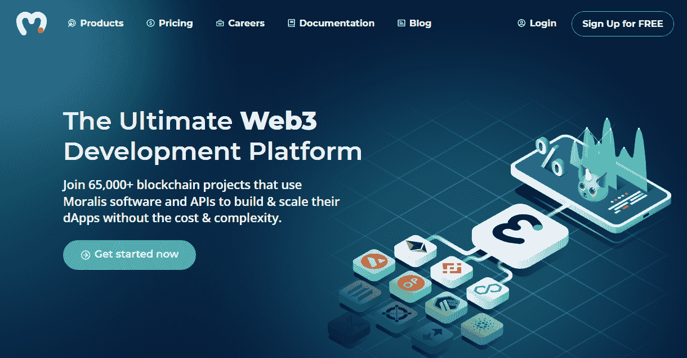
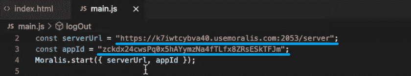

# Web3 身份验证–完整指南

> 原文：<https://moralis.io/web3-authentication-the-full-guide/>

在本文中，我们将描述您需要了解的关于 Web3 认证的一切。但是，如果您想马上动手，请观看此视频，了解使用 Moralis 进行 Web3 身份验证的分步指南:

https://www.youtube.com/watch?v=XmezdzLb154

## 关于 Web3 身份验证您需要知道的一切

**无论用户是与 DeFi 协议交互，还是想通过区块链游戏深入元宇宙，Web3 认证都是绝对必要的。如果用户无法登录区块链，您的** [**Web3 应用**](https://moralis.io/metamask-for-developers-how-to-launch-web3-apps-with-metamask/) **很可能会失败。然而，允许用户登录 Web3 领域提供了改变生活的机会，尤其是对于早期用户。所以，如果你立志** [**成为区块链开发者**](https://moralis.io/how-to-become-a-blockchain-developer/) **想要创造高利润的下一级**[**dApps**](https://moralis.io/decentralized-applications-explained-what-are-dapps/)**，你应该知道如何实现 Web3 认证。最初，这可能看起来是一个令人生畏的挑战。然而，一个新的范式转变正在这里，它被称为******。这个最终的 Web3 开发平台，称为“**[**Firebase for crypto**](https://moralis.io/firebase-for-crypto-the-best-blockchain-firebase-alternative/)**”，使前端开发人员能够在几分钟内将 Web3 身份验证实施到他们的 dApps 中。反过来，他们可以轻松地将用户登录到区块链。****

**

接下来，您将学习 Web3、Web3 身份验证和 Moralis 的基础知识。我们将向您展示如何完成初始设置和访问 Moralis 的全部功能。有了 [ultimate Web3 SDK](https://moralis.io/exploring-moralis-sdk-the-ultimate-web3-sdk/) 供您使用，您可以用简短的代码片段轻松满足所有后端需求。这些可以简单地从 [Moralis 文档](https://docs.moralis.io/)中复制，那里解释了最好的[以太坊 API](https://moralis.io/ethereum-api-develop-ethereum-dapps-with-moralis/) 和其他强大的工具。此外，虽然以太坊仍然是领先的可编程链并充当默认网络，但 Moralis 实际上是跨链互操作的。反过来，它为大多数领先的 [EVM](https://moralis.io/evm-explained-what-is-ethereum-virtual-machine/) 兼容区块链提供全面支持——例如[多边形](https://moralis.io/how-to-build-polygon-dapps-easily/)、币安智能链( [BSC](https://moralis.io/bsc-programming-guide-intro-to-binance-smart-chain-development-in-10-minutes/) )、[雪崩](https://moralis.io/how-to-create-an-avalanche-dapp-in-4-steps/)等等。因此，您所有的工作都是面向未来的，因为您可以轻松地在所有支持的链上部署 dApps。此外，您还有机会将 Web3 身份验证付诸实践。因此，[创建您的免费 Moralis 账户](https://admin.moralis.io/register)并跟随我们的脚步吧！

### 什么是 Web3？

在过去的几年里，有很多关于 Web3 的讨论。起初，只有加密媒体提到它，但最近，甚至主流媒体都倾向于解决这场正在进行的革命。然而，你知道什么是 [Web 3.0](https://moralis.io/the-ultimate-guide-to-web3-what-is-web3/) 吗？为了让我们讨论 Web3 身份验证，我们需要了解一些基础知识。简而言之，就用户体验而言，Web3 的目标是与 Web2 相似(目前大多数网站都是这样)。然而，它应该(理想地)是完全分散的，并有一个内置的分散货币体系。

事实上，在相当长的一段时间内，我们最有可能处理 Web2 和理想 Web3 之间的某种混合。不过，目前所有能让你连接到任何区块链网络的网站或应用程序都被认为是 Web3 应用程序或 dApp。如果你有兴趣更深入地探讨 Web3，请使用上面的“Web3”链接。

## 什么是 Web3 认证？

Web3 身份验证听起来可能很奇特；然而，它只不过是一个登录工具。此外，虽然 Web2 网站使用电子邮件和密码，但 Web3 应用程序使用用户的加密地址。然而，确保区块链网络和用户安全的加密技术要复杂得多。因此，手动登录需要处理公开的私钥对，这对用户来说一点也不友好。幸运的是，有许多著名的热门加密钱包以浏览器扩展和移动应用的形式出现。此外，除了处理和存储加密货币，这些钱包还可以用作 Web3 认证工具。下面我们将更多地讨论热门钱包。

### 为什么需要 Web3 认证？

如上所述，Web3 网站和应用程序运行在特定的区块链上，或者至少向用户提供与特定的进行交互的功能。因此，必须有一种安全的方式让用户连接到这些特定的加密网络。通过使用 Web3 身份验证，用户能够连接到选定的网络。一旦通过身份验证，他们就可以与网络上其他通过身份验证的用户进行交互。因此，每个 Web3 dApp 都需要这种认证。

然而，直接在[以太坊 RPC 节点](https://moralis.io/ethereum-rpc-nodes-what-they-are-and-why-you-shouldnt-use-them/)之上构建的开发者可以告诉你从头构建这样的认证是多么的费力和耗时。幸运的是，Moralis 使您能够克服 RPC 节点的所有[限制，包括认证。Moralis 完全集成了领先的网络和移动认证解决方案。因此，您可以用一行代码来涵盖这一方面。](https://moralis.io/exploring-the-limitations-of-rpc-nodes-and-the-solution-to-them/)

## Web3 钱包

[Web3 钱包](https://moralis.io/what-is-a-web3-wallet-web3-wallets-explained/)就是现在大热的加密货币钱包，也叫数字钱包。它们以应用程序和浏览器扩展的形式出现。此外，它们是每个探索加密领域的人必不可少的工具。一个合适的 Web3 钱包使用户能够存储各种加密资产。此外，随着跨链功能显然成为未来，大多数加密钱包支持多链。通过 Web3 钱包，你可以访问 [DeFi](https://moralis.io/how-to-create-a-defi-dashboard-in-5-steps/) 平台、 [NFT 市场](https://moralis.io/how-to-launch-an-nft-marketplace/)、区块链或 [NFT 游戏](https://moralis.io/what-are-nft-games-and-how-to-make-nft-games/)以及其他加密平台。另外，Web3 钱包也是区块链开发者的必备工具。*有关 Web3 钱包的更多详情，请使用本节开头的链接。*

## Web3 身份验证替代方案

现在您已经知道 Web3 钱包用于 Web3 身份验证，让我们更仔细地看看三个最著名的选项，即 MetaMask、WalletConnect 和 Web3Auth。这些选项中的每一个都提供了可靠的用户体验；MetaMask 和 WalletConnect 结合在一起是原生加密用户的完美体验，而 Web3Auth 则迎合了主流用户。此外，MetaMask 可以说是 web 用户的最佳选择，而 WalletConnect 是移动用户的首选工具。

### MetaMask

MetaMask 是由 ConsenSys 在 2016 年推出的，它是历史最长的。此外，像大多数先行者一样，它已经获得了很大的知名度。然而，MetaMask 并没有睡在它的荣耀上。随着不断的开发和无数次的升级，它成为了一个优秀的、极其强大的工具。它是 Chrome、Firefox、Brave 和 Edge 的浏览器扩展。此外，它还支持 iOS 和 Android 设备作为移动应用程序。

默认情况下，MetaMask 包括以太坊网络，包括所有最流行的[以太坊测试网](https://moralis.io/ethereum-testnet-guide-connect-to-ethereum-testnets/)。但是，您可以轻松添加其他兼容 EVM 的网络。总之，我们认为用 MetaMask 对[进行认证是简单实用的；因此，它是我们最好的 Web3 身份验证替代方案。反过来，](https://moralis.io/how-to-authenticate-with-metamask/)[用 MetaMask](https://moralis.io/building-dapps-with-metamask/) 构建 dApps 就简单多了。*尽管如此，请务必查看如何使用 MetaMask* *启动 Web3 应用程序。*

### WalletConnect

很多人认为 [WalletConnect](https://moralis.io/what-is-walletconnect-the-ultimate-walletconnect-guide/) 是一个 app 然而，它实际上是一个开源协议，用于在各种钱包和 dApps 之间建立连接。顾名思义。因此，称之为热钱包在技术上也是不正确的。WalletConnect 通过两个对等方的共享密钥建立“对称加密连接”。此外，这种 Web3 身份验证替代方案可与超过 75 个热门加密钱包配合使用。

为了方便用户，WalletConnect 通过扫描二维码或使用深层链接来建立联系。因此，与 WalletConnect 集成的 dApps 可以轻松创建安全可靠的连接。要了解更多关于 WalletConnect 的详细信息，请使用本部分顶部的链接。还有，一定要探索如何用*[*认证安卓应用。*](https://moralis.io/walletconnect-android-sdk-alternative-authenticate-android-apps-withmoralis/)*

### *Web3Auth*

*对于新用户来说，Web3Auth 是弥合 Web2 和 Web3 之间差距的最受欢迎和最安全的替代方案之一。它被 Skyweaver、币安和育碧等流行应用程序以及许多其他 dApps 和钱包所使用。Web3Auth(以前称为 Torus)是一个简单的非托管身份验证基础设施，它通过聚合 OAuth (Google、Twitter、Discord)登录、不同的钱包和现有的密钥管理解决方案来工作。它为每个用户提供了熟悉的登录体验，从而将转化率提高了 64%。*

*

您可以用几行代码将 Web3Auth 集成到您的应用程序中。借助 web 和 mobile SDKs，您可以为自己的应用定制外观，甚至可以在基础设施中插入您自己现有的授权/用户基础。

### 格式化的

Fortmatic 现在更名为“Magic ”,是另一个可靠的 Web3 认证替代方案。Fortmatic 的独特之处在于它让你可以完全控制 UX。它是可定制和嵌入式的，这意味着它不会从你的应用中夺走用户。根据 Fortmatic 的官网，Fortmatic 是 MetaMask 更好的替代产品。*如上所述，我们一直专注于在 Moralis 使用 MetaMask 和 WalletConnect 因此，我们将由您来进一步探索 Fortmatic。*

## Web3 认证和 Moralis

至少从理论上来说，我们已经对 Web3 身份验证有了足够的了解。所以，是时候卷起袖子干点实事了。因此，你将有机会看到 Moralis 的一位专家构建一个简单干净的 Web3 登录页面。他将指导你完成所有步骤——从创建前端到选择用于覆盖后端的代码片段。然而，在我们将您交给我们同事的视频之前，让我们带您一步一步地完成 Moralis 的初始设置。

### 初始 Moralis 系统设置-第 1 部分

无论您是从头开始 dApps(如下面的视频所示)还是使用我们的终极 [Web3 样板](https://moralis.io/web3-boilerplate-beginners-guide-to-web3/)，您都需要创建您的 Moralis 服务器来访问后端功能。因此，请确保完成以下步骤:

1.  [**创建你的自由 Moralis 账户**](https://admin.moralis.io/register)——如果你还没有创建你的自由 Moralis 账户，现在就创建吧。只需使用左边的链接。它会带你到注册页面，在那里你可以输入你的电子邮件和创建你的密码。要完成该过程，请记住点击确认链接，确认链接将发送到您的电子邮件地址。*但是，如果您已经有一个有效的 Moralis 家帐户，只需* [*登录*](https://admin.moralis.io/login) *到您的管理区。*

2.  [**创建 Moralis 服务器**](https://docs.moralis.io/moralis-server/getting-started/create-a-moralis-server)–进入 Moralis 管理区域后，导航至“服务器”选项卡(位于导航选项卡的左侧)。接下来，单击右上角的“+创建新服务器”。然后，您会看到一个下拉菜单，您需要在其中选择最适合您需求的网络类型(见下图)。*在示例项目和测试阶段的情况下，你通常会关注“Testnet 服务器”或“本地 Devchain 服务器”选项。然而，一旦你准备好向公众发布你的 dApps，你将需要创建一个“Mainnet 服务器”。*

选择网络类型后，会弹出一个窗口要求您输入服务器的详细信息。这些包括您的服务器名称(可以是您想要的任何名称)，选择您的区域、网络类型和链。要完成此步骤，请单击“添加实例”:

### 初始 Moralis 标准设置-第 2 部分

*注意* *:请记住，你的服务器可能需要几分钟才能准备好。因此，你现在可以跳过第三和第四步。一旦你有了你的孩子，你就会回到他们身边。js“或者”。env”文件就绪(这是您将要粘贴服务器详细信息的地方)。*

3.  **访问服务器详细信息**–一旦您的服务器启动并运行，您就可以访问其详细信息。在这样做之前，有你的也是有意义的”。js“或者”。env”文件准备就绪。要访问服务器 URL 和应用 ID 信息，请单击“查看详细信息”按钮:

点击该按钮，您需要的所有信息(“服务器 URL”和“应用 ID”)将显示在一个新窗口中。正如您在下面的截图中看到的，您可以通过点击每个细节旁边的右侧复制图标来复制细节(一个接一个):

4.  初始化 Moralis 规范–现在是初始化 Moralis 规范的时候了。这将最终让你完全接触到 Moralis 的力量。因此，您将能够满足您的后端需求。因此，填充您的编码文件(".js“或者”。env ")以及应用程序 ID 和服务器 URL:
    *   如果你是从零开始，你通常会使用一个"。js "文件来连接和初始化 Moralis:

*   当使用 Web3 样板文件时，您将填充您的”。env "文件:

## 将 Web3 身份验证付诸实施

如上所述，现在是时候把你交给 Moralis 家的专家了。他将首先向你展示你将要建造的东西。接下来，他将带您完成设置过程。接下来，他将告诉你一些关于 Next.js 的事情。另外，在 4:47，你将开始构建前端，然后包含后端功能。另外，他还会告诉你如何正确处理错误。

## Web3 认证–登录区块链的用户–摘要

在这里，我们已经介绍了 Web3 如何作为通往加密领域的门户。您知道如何为用户提供进入 Web3 世界的方法——通过实现认证工具，如 MetaMask。此外，现在您已经知道了什么是 Web3 身份验证，以及用 Moralis 覆盖它是多么容易，您已经准备好创建一些令人敬畏的 dApps 了。

不过，如果你想免费建立你的区块链发展信心、知识和技能，一定要看看[Moralis 博客](https://moralis.io/blog/)和[Moralis YouTube 频道](https://www.youtube.com/c/MoralisWeb3)。在这两个平台上，我们每天都发布新鲜内容。这包括许多范例项目，在这些项目中，你可以遵循 Moralis 专家的指导。我们的一些最新话题涵盖了 [GameFi 和 play-to-earn (P2E)](https://moralis.io/what-is-gamefi-and-play-to-earn-p2e/) ，如何[通过网站](https://moralis.io/how-to-interact-with-smart-contracts-through-your-website/)，[与智能合约交互](https://moralis.io/dao-smart-contract-example-dao-guide/)， [ERC20 合约](https://moralis.io/what-are-erc20-contracts-full-erc20-contract-guide/)，如何使用一个[图替代](https://moralis.io/the-graph-alternative-for-smart-contract-indexing/)到[将 mint 功能集成到 JS 接口](https://moralis.io/integrate-mint-function-to-js-interface-nft-development/)，以及[如何索引区块链](https://moralis.io/how-to-index-the-blockchain-the-ultimate-guide/)。

此外，如果你对专业的区块链教育感兴趣，一定要报名参加[Moralis 学院](https://academy.moralis.io/)。这样做，你不仅可以接触到一些业内最好的课程，还可以加入一个不可思议的社区。此外，你将有机会获得区块链专家一对一的指导。

***