# Web3 数据科学-导入连锁事件

> 原文：<https://moralis.io/web3-data-science-importing-on-chain-events/>

区块链最大的优点之一就是所有的数据都是公开的。反过来，每个数据科学家都可以以无数种方式使用 Web3 数据，并为他人提供价值。对于那些对 Web3 感兴趣的人来说，对 Web3 数据科学的介绍将非常有益。通过使用一些非凡的工具，我们将向您展示导入链上事件的过程是多么简单。后者是通过监听智能合约事件来完成的。本质上，目标是 [**同步和索引智能合约事件**](https://moralis.io/sync-and-index-smart-contract-events-full-guide/) **以理解和利用链上数据。因此，一旦你学会了** [**如何索引区块链**](https://moralis.io/how-to-index-the-blockchain-the-ultimate-guide/) **，你就可以使用可用的编程语言来充分利用所获得的数据。**

接下来，您将学习如何使用 [Moralis](https://moralis.io/) 轻松应对 Web3 数据科学挑战。这个终极的 [Web3](https://moralis.io/the-ultimate-guide-to-web3-what-is-web3/) 开发平台，也被称为 [Firebase for crypto](https://moralis.io/firebase-for-crypto-the-best-blockchain-firebase-alternative/) ，为你提供一个完整的 [Web3 SDK](https://moralis.io/exploring-moralis-sdk-the-ultimate-web3-sdk/) 。此外，您还可以使用 Moralis 的“同步”功能和高级数据库。此外，为了使事情尽可能清楚，我们甚至将承担一个示例项目。此外，我们将使用 [Moralis Nitro](https://forum.moralis.io/t/moralis-nitro-beta-testing/7489) 的 [Moralis 的测试版](https://beta.moralis.io/login)。因此，你将有机会亲身体验 Moralis 的力量。另外，你可能知道 [Python](https://moralis.io/python-explained-what-is-python/) 和 R 是两种最流行的数据处理编程语言，对吗？因此，我们将向您展示如何使用这两个流行的选项来导入链上事件。因此，你也可以把这篇文章看作是你通向 Web3 数据科学的大门。

## 是什么让 Web3 对数据科学如此重要？

如前所述，加密领域提供了大量关于各种区块链的公开可用数据。因此，拥有正确知识和工具的个人可以很容易地访问链上信息。这包括所有交易数据、传输数据、[NFT](https://moralis.io/non-fungible-tokens-explained-what-are-nfts/)和可替换令牌上的数据、赌注数据等等。因此，Web3 是为任何愿意钻研它的人设计的高级数据科学应用程序。此外，由于我们还处于游戏的早期，你可以成为第一批引入连锁事件的科学家之一。

此外，随着几个著名的可编程区块链的启动和运行，数据的海洋正在快速扩散。幸运的是，所有著名的链也有公开可用的链探索者，帮助 Web3 数据科学的进步。例如，您有针对[以太坊](https://moralis.io/full-guide-what-is-ethereum/)的以太扫描、 [BscScan](https://moralis.io/exploring-bscscan-full-guide/) 币安智能连锁( [BSC](https://moralis.io/bsc-programming-guide-intro-to-binance-smart-chain-development-in-10-minutes/) )、针对[雪崩](https://moralis.io/how-to-build-avalanche-dapps-in-minutes/)、针对[多边形](https://moralis.io/how-to-build-polygon-dapps-easily/)的 Polygonscan、针对 Fantom 的 FtmScan 以及针对 [Solana](https://moralis.io/moralis-releases-solana-api/) 的 Solscan。所有这些区块链探索者与 Moralis 的力量相结合，为数据科学家提供了无数的机会。顺便说一句，Moralis 完全支持上述所有区块链。因此，你可以很容易地在这些链上构建有用的 dapp([分散应用](https://moralis.io/decentralized-applications-explained-what-are-dapps/))。说完这些，让我们开始我们的 Web3 数据科学示例项目。

## Web3 数据科学-导入链上事件-示例项目

如上所述，我们将使用 Moralis 来同步智能合同数据。因此，我们将首先引导您完成初始设置，包括创建一个 Moralis 服务器。此外，为了确保你能体验到最新的更新，请确保使用上面的链接到 Moralis 的测试版。有了 Moralis Nitro 更新，您将能够使用一个更强大的数据库。一旦我们使用 Moralis 的“同步”和“数据库”特性来导入链上事件，我们将使用 R 和 Python 来测试这些数据。尽管如此，我们将通过仔细查看一些数据探索示例来结束本文。

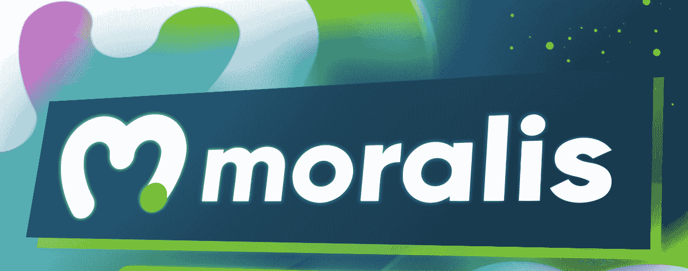

### 创建 Moralis 服务器

要获得 Moralis 的后端功能，您需要创建您的 Moralis 服务器。当使用 Moralis 执行其他 Web3 数据科学任务时，后者也是必不可少的。因此，请遵循以下步骤:

1.  **创建一个免费的 Moralis 账户**–使用本文开头的“Moralis beta 版”链接访问注册页面。然后，输入您的电子邮件地址，创建您的密码，并通过确认您的帐户完成该过程(单击发送给您的电子邮件中的确认链接)。*另一方面，如果你已经有了你的 Moralis 家 beta 账号，只需* [*登录*](https://beta.moralis.io/login) *。*

[**创建一个 Moralis 服务器**](https://docs.moralis.io/moralis-server/getting-started/create-a-moralis-server)——一旦登录，您将进入您的 Moralis 管理区。接下来，确保你在“服务器”部分(如下图所示)。在那里，单击右上角的“+创建新服务器”按钮。从下拉菜单中，选择适当的网络类型。由于 CryptoPunks 是以太坊上的一个活项目(在我们的例子中我们将使用 CryptoPunks)，所以选择“Mainnet Server”选项。*然而，当测试 dApps 或处理示例项目时，我们建议选择“Testnet 服务器”选项(参见我们的* [*以太坊 testnet*](https://moralis.io/ethereum-testnet-guide-connect-to-ethereum-testnets/) *指南)*。

选择服务器类型后，将出现一个弹出窗口，询问服务器的详细信息。因此，输入您的服务器名称(这可以是您想要的任何名称)，然后选择区域、网络和链(CryptoPunks 在以太坊上)。最后，通过点击“添加实例”按钮启动您的服务器。 *T2】*

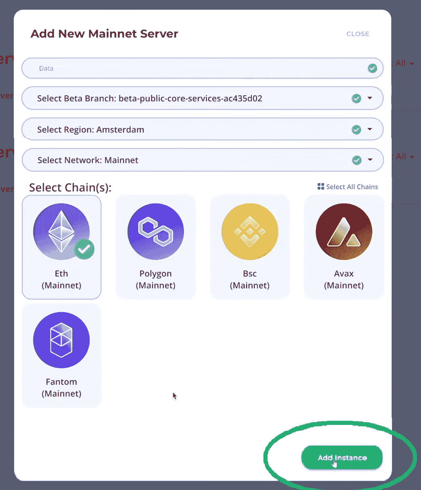

Moralis 服务器启动并运行后，您就可以处理导入链上事件的过程了。怎么会？嗯，每台服务器都配有全套工具，包括上面提到的“同步”功能和一个强大的数据库(Moralis dashboard)。这两个工具对于在 Web3 数据科学中使用 Moralis 都是必不可少的。

## 使用 Moralis 的“同步”功能导入链上事件

要访问“同步”功能，您需要单击上面创建的服务器的“查看详细信息”按钮。然后，您将在窗口的最右侧看到“同步”标签，该标签将会出现:

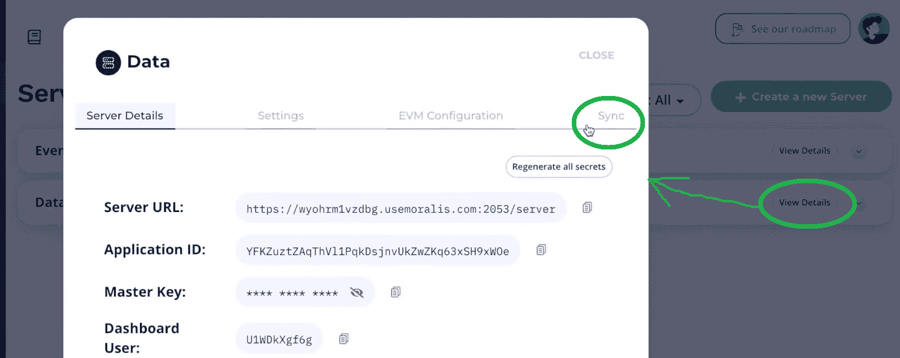

要开始导入链上事件，您需要点击“添加新同步”。点击后，选择“同步和观察合同事件”选项:

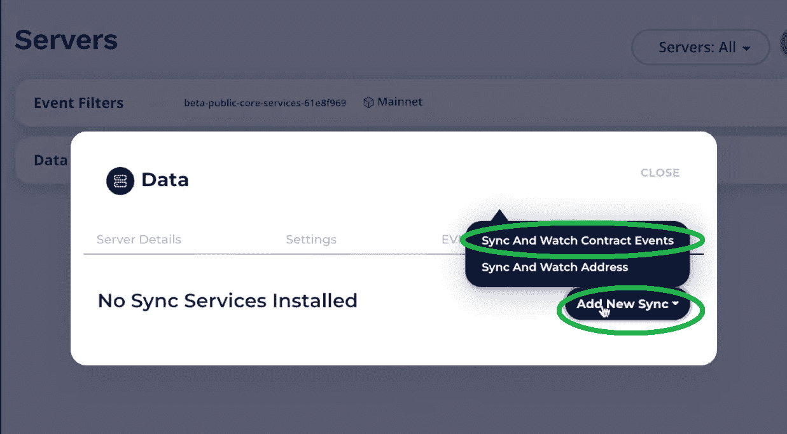

接下来，您将看到“配置”选项。由于您已经为以太坊主网创建了上述服务器，这将是“ChainId”类别下的唯一选项。因此，单击它以选择它。然后，添加描述(可以是您想要的任何内容)并单击“Sync_historical”选项:

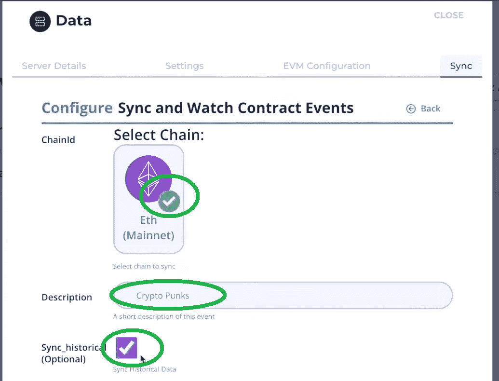

### 使用以太扫描获取主题

说到“话题”，事情就更具体了。因此，您需要为有问题的智能合约输入一组特定的值。由于 CryptoPunks 是一个基于以太坊的项目，我们可以使用以太扫描。在以太扫描上，我们在搜索栏中输入“密码朋克”:

在返回的搜索结果中(“Transfers”选项卡)，您需要单击一个具有“Transfer Punk”方法的事务散列:

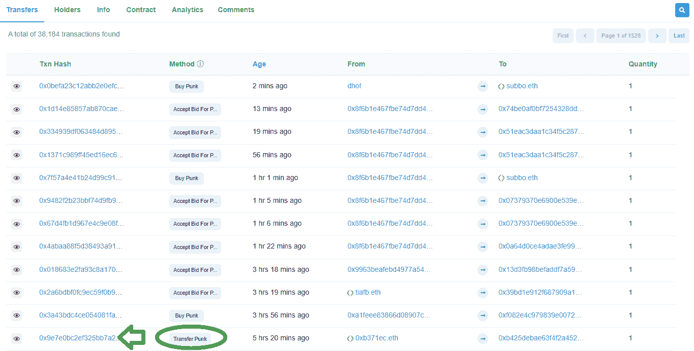

查看“交易详细信息”页面后，选择“日志”选项卡:

在“日志”标签中，您会在“名称”旁边看到“传送”和“PunkTransfer”。现在，你知道“PunkTransfer”是我们感兴趣的。此外，为了最终获得主题，您需要使用“PunkTransfer”后面的括号中的详细信息(仅类型):

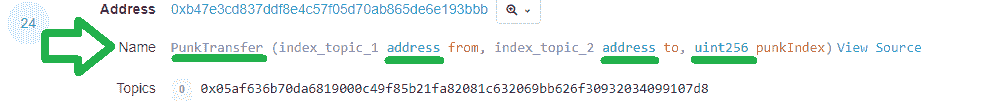

现在，将上述详细信息输入“配置同步和观察合同事件”窗口中“主题”旁边的输入字段:

此外，您可以对“PunkBought”事件进行同样的操作。事实上，现在让我们使用另一种有效的方法来获取事件的主题。首先，请点击 CryptoPunks 的合同地址:

在下一页，稍微向下滚动并点击“合同”选项卡:

现在你应该在“合同”选项卡上。如果是这样，请确保选择了“代码”部分。

再次向下滚动向前移动。在契约源代码的第 53 行，您将看到所有事件:

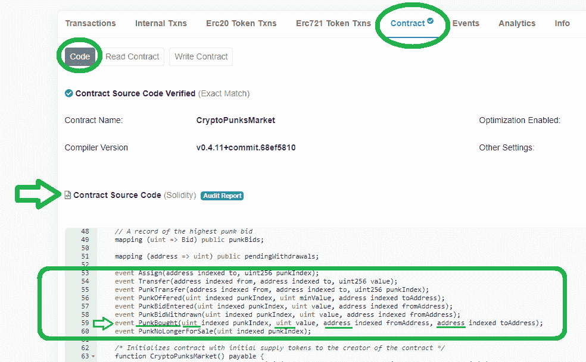

剩下要做的就是将事件类型复制到主题输入字段中:

*注意* *:转到“配置同步和观察合同事件”窗口的下一个类别，我们将关注“PunkBought”事件。*

### 使用以太网扫描获取 ABI

以太扫描网上也有 ABI 的详细信息。事实上，它们就在上面提到的“契约源代码”的下面。因此，返回以太扫描，向下滚动一点，直到你看到“合同 ABI”:

您可以手动查找“PunkBought”事件，或者使用浏览器的搜索选项。找到它后，选择包含有问题的事件的花括号内的所有内容，然后复制所选内容:

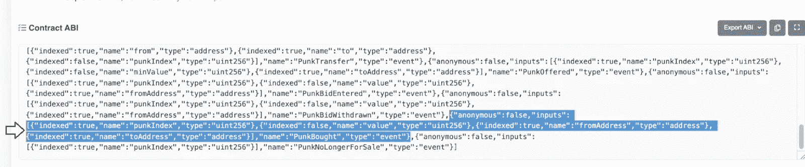

返回“配置同步和观察合同事件”，将信息粘贴到“Abi”旁边的输入框中:

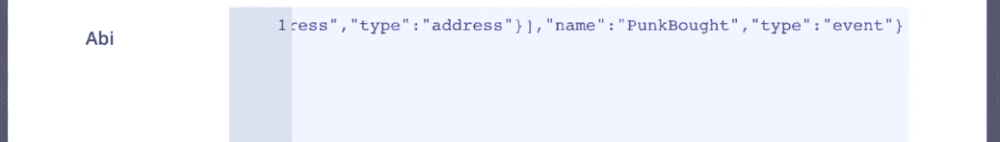

### 使用以太网扫描获取合同地址

下一个条目需要相关的合同地址。当然，以太扫描也有那条信息。此外，这是您在前面的一个步骤中单击的合同地址。但是，它也位于以太扫描的当前页面上(如果您关注我们的话)。如果你滚动到顶部，你会看到它。接下来，只需点击复制图标:

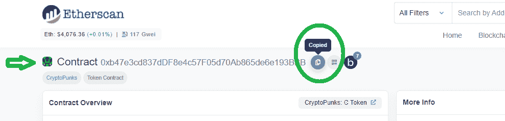

返回“同步”标签，粘贴地址:

在“地址”类别下，您会看到“过滤器”。这个可选类别非常强大，我们很快就会用到它。但是，现在只需在“表名”旁边输入“朋克”(可以是任何不带空格的东西)，然后点击“确认”:

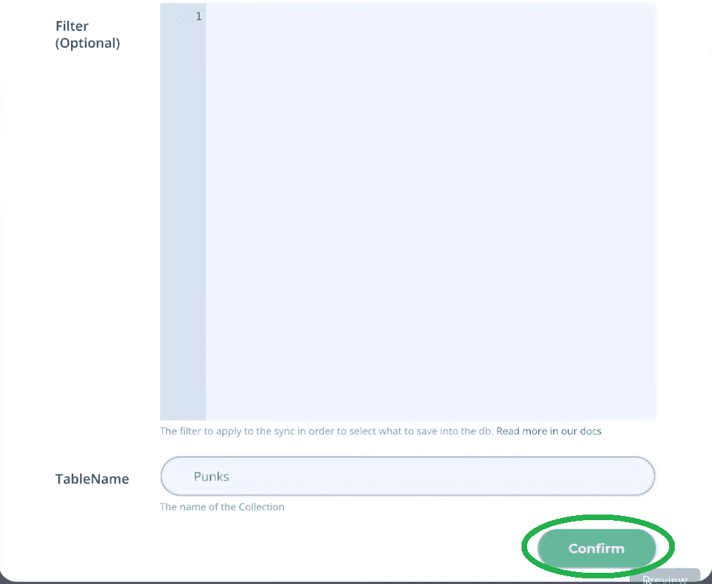

## 使用 Moralis Dashboard 简化 Web3 数据科学

在创建您的同步和观察合同事件(如上所述)后，您的 Moralis 仪表板(数据库)将自动填充一个新创建的名为“Punks”的类。要访问服务器的仪表板，首先，关闭“同步”窗口。然后，单击“查看详细信息”按钮旁边的箭头图标，然后单击“仪表板”:

如果你已经按照指示做了所有的事情，你现在应该会看到你的 Moralis 仪表板。后者应该包含所有默认类和“朋克”类:

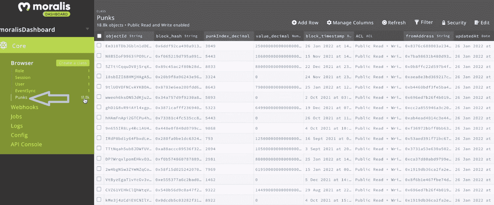

令人难以置信的是，您的数据库已经完成了链上事件的导入。这意味着您可以根据自己的需求进一步使用这些数据。这对于 Web3 数据科学来说怎么样？此外，如前所述，我们可以使用各种过滤器来消除所有我们不感兴趣的数据。此外，如果您有兴趣了解如何将特定的滤镜设置到位，请务必观看下面的视频(4:15)。Moralis 专家将向您展示如何过滤掉值为零的交易。此外，作为一个例子，他甚至会告诉你如何获得仅在 2021 年完成的交易。

### 使用 Web3 数据科学工具

现在您已经了解了导入链上事件有多简单，您可以使用 Web3 数据科学工具了。当然，有很多选项可供选择；然而，为了这个示例项目，我们将重点关注 Python 和 r。在下面的视频中，Moralis 专家将向您展示如何将上述数据导出到这两个选项中的任何一个。但在此之前，他还会指导您完成启用该选项的设置步骤(7:55)。此外，就“Python”web 3 数据科学而言，它从 8:50 开始。然而，如果你对“R”教程感兴趣，可以跳到 11:50。尽管如此，您还有机会在 13:58 看到一些数据探索的例子。

这是我们一直在参考的视频:

https://www.youtube.com/watch?v=ljHLkuhhN2A

## Web3 数据科学-导入连锁事件-摘要

上面我们已经介绍了相当多的信息。至此，你应该知道为什么 Web3 数据科学值得关注了。此外，您现在知道 Moralis 为您提供了导入链上事件所需的所有工具。通过使用 Moralis 的“同步”功能和您服务器的数据库，您首先索引您感兴趣的区块链。在这一步中，您可以通过使用适合您的焦点的过滤器来进一步细化数据。然后，您可以进行适当的设置，轻松地将数据导入各种 Web3 数据科学工具。在上面的视频中，你已经有机会看到 Python 和 r。

如果你有兴趣了解更多关于区块链发展的信息，并承担更多的范例项目，请务必访问 [Moralis YouTube 频道](https://www.youtube.com/c/MoralisWeb3)和 [Moralis 博客](https://moralis.io/blog/)。一些最新的话题深入到了 [ERC721 智能合约](https://moralis.io/erc721-contract-exploring-erc721-smart-contracts/)标准、 [Web3UI 套件](https://moralis.io/web3ui-kit-the-ultimate-web3-user-interface-kit/)、如何[在 2022 年获得 OpenSea API 密钥](https://moralis.io/get-an-opensea-api-key-in-2022-full-guide/)、[web 3 如何工作](https://moralis.io/how-does-web3-work-web3-explained/)、最终 [Web3 技术栈](https://moralis.io/exploring-the-web3-tech-stack-full-guide/)、一个 [Web3.js 与 Ethers.js](https://moralis.io/web3-js-vs-ethers-js-guide-to-eth-javascript-libraries/) 比较、 [NFT API 替代方案](https://moralis.io/nft-api-alternatives-comparing-alchemys-nft-api-with-moralis-nft-api/)、[无气交易](https://moralis.io/gasless-transactions-exploring-gasless-transactions-on-ethereum/)此外，你们中的一些人可能决心将你们的区块链开发游戏更快地提升到下一个水平。幸运的是，有一条快速通道可用，它被称为[Moralis 学院](https://academy.moralis.io/)。通过注册，你可以接触到一个支持性的社区，最高质量的课程和专业的指导。因此，你可以[成为一名区块链开发者](https://moralis.io/how-to-become-a-blockchain-developer/)并且很快成为全职加密员。

