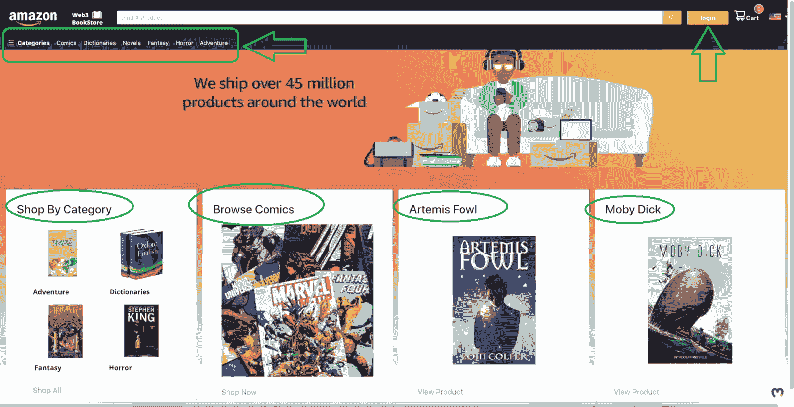
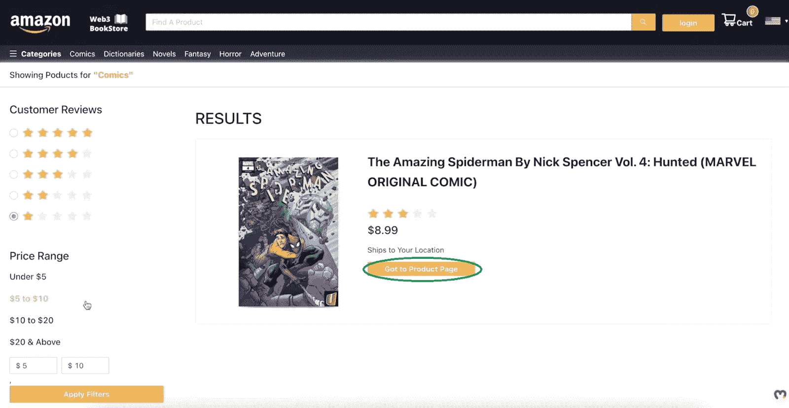
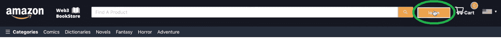
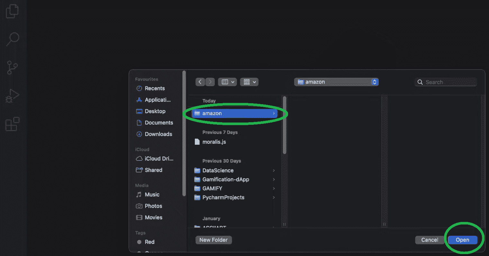
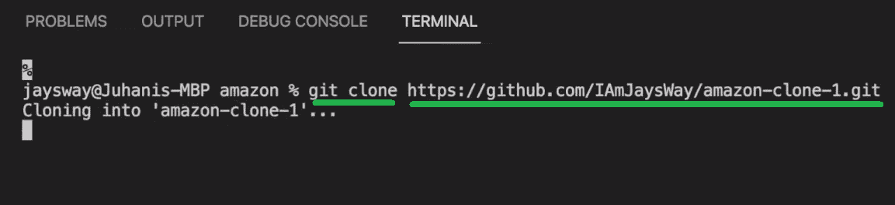
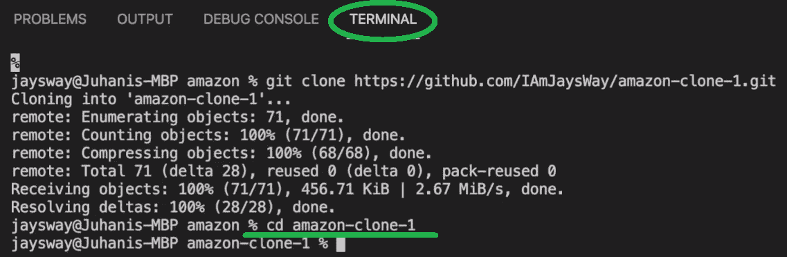
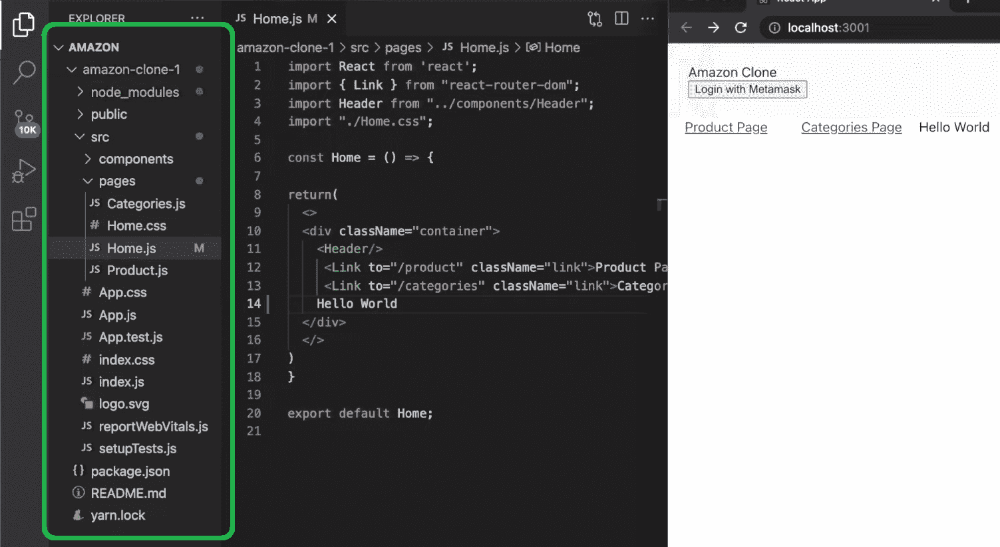
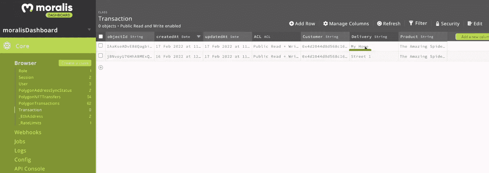
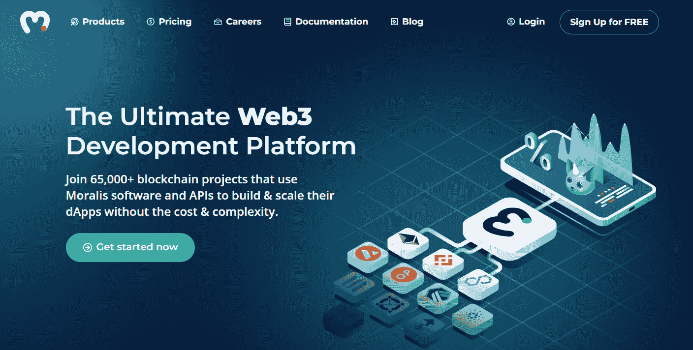

# Web3 电子商务–通过 5 个步骤创建 Web3 电子商务平台

> 原文：<https://moralis.io/web3-e-commerce-create-a-web3-e-commerce-platform-in-5-steps/>

以亚马逊为代表的电子商务平台已经发展了十多年。越来越多的人开始在网上购物。自 2020 年疫情开始以来，情况尤其如此。然而，随着 [**Web3**](https://moralis.io/the-ultimate-guide-to-web3-what-is-web3/) **慢慢走向世界，Web3 电子商务开始腾飞。然而，我们仍然处于游戏的早期，因此，这是学习如何创建 Web3 电子商务平台的最佳时机。这听起来是一个相当耗时的挑战，对吗？嗯，有了合适的工具和正确的指导，你可以在大约一个小时内准备好你自己的 Web3 电子商务平台。并且，这正是你将从这篇文章中得到的。此外，您将有机会了解**[**web 3 tech stack**](https://moralis.io/exploring-the-web3-tech-stack-full-guide/)**最先进的部分。**

接下来，您将学习如何通过五个步骤创建一个 Web3 电子商务平台。此外，如果你决定自己承担这个示例项目，你也会熟悉[Moralis 规范](https://moralis.io/)。这个终极的 Web3 开发平台，也被称为 crypto 的 [Firebase，是如此短的开发时间的关键。一旦你完成了初始的 Moralis 设置，你就可以使用它的](https://moralis.io/firebase-for-crypto-the-best-blockchain-firebase-alternative/) [Web3 SDK](https://moralis.io/exploring-moralis-sdk-the-ultimate-web3-sdk/) 来满足你所有的后端需求。因此，你只需从 [Moralis 的文档](https://docs.moralis.io/introduction/readme)中复制并粘贴简短的代码片段。此外，通过节省时间和资源，你可以轻松地[创建一个伟大的 Web3 UI](https://moralis.io/web3-ui-how-to-create-a-great-dapp-ui/) 。除了使用 Moralis 创建 Web3 电子商务平台之外，它还是开发 dApps ( [分散应用](https://moralis.io/decentralized-applications-explained-what-are-dapps/))的工具。Moralis 使你能够使用你的 [JavaScript](https://moralis.io/javascript-explained-what-is-javascript/) 技能和[元掩码](https://moralis.io/metamask-explained-what-is-metamask/)创建杀手级应用程序。因此，[在继续下一步之前，创建你的免费 Moralis 账户](https://admin.moralis.io/register)。

# 用 5 个步骤创建一个 Web3 电子商务平台

让我们再次鼓励你自己采取行动，加入我们这个范例项目。这样你就能从本指南中获得最大收益。如前所述，除了精通 JavaScript、元掩码和一个免费的 Moralis 帐户，你不需要更多。当然，您还需要使用您喜欢的代码编辑器。因为我们倾向于使用 Visual Studio 代码(VSC)，所以这里的所有说明都适用于该代码编辑器。

此外，正如标题所示，我们将整个过程分为五个可管理的步骤:

1.  项目设置。
2.  创建您的电子商务标题。
3.  创建页面–主页、类别页面和产品页面。
4.  完成初始 Moralis 设置。
5.  后端实施–web 3 API、支付和数据库。

结合一个视频教程，我们将详细介绍以上五个步骤。因此，你可以毫不费力地跟随我们的领导。然而，在我们开始创建一个 Web3 电子商务平台之前，让我们先来看看我们将构建什么。

## 创建 Web3 电子商务平台之前——dApp 预览

在本文结束时，您将有机会建立自己的类似亚马逊的网络书店。下面是我们的 Web3 电子商务示例的主页:

如果你仔细看了上面的截图，你可能会注意到“亚马逊”的外观，对不对？黑，为了显而易见，我们甚至用了他们的 logo。此外，您还可以看到，为了最大程度的方便，我们在顶部添加了一个搜索栏。此外，搜索栏的右边是“登录”按钮。后者使用户能够轻松完成他们的 [Web3 认证](https://moralis.io/web3-authentication-the-full-guide/)。为了这个示例项目，我们决定使用最流行的 [Web3 钱包](https://moralis.io/what-is-a-web3-wallet-web3-wallets-explained/)，用于 [Web3 登录](https://moralis.io/how-to-build-a-web3-login-in-5-steps/)。然而，Moralis 还通过电子邮件为您提供 [Web3 社交登录](https://moralis.io/web3-social-login-sign-in-dapp-users-with-google-email-or-twitter/)或 [Web3 认证，以提高](https://moralis.io/how-to-do-web3-authentication-via-email/) [Web3 用户加入](https://moralis.io/how-to-boost-web3-user-onboarding-success-rates/)的成功率。

向下移动我们的主页，你可以看到搜索栏下面的顶部菜单。这是用户在不同类别中进行选择的地方。为了这个教程，我们包括了以下类别:漫画，字典，小说，幻想，恐怖和冒险。在顶部菜单栏下方，您可以看到旋转区域。在这里，我们设置了三个旋转横幅来吸引客户。此外，转盘下方是四个部分。这些包括“分类购物”、“浏览漫画”、“阿特米斯奇幻历险”和“莫比迪克”。此外，这四个部分的底部都有一个按钮。当用户点击这些按钮中的任何一个，他们就会被带到一个特定的页面。例如，如果用户点击“浏览漫画”部分下的“立即购买”，他们会进入“结果”页面。在该页面上，他们可以浏览漫画并选择他们想要购买的漫画:

这是用户点击“浏览漫画”部分下的“立即购买”按钮后进入的页面:

### 示例 Web3 电子商务预览–结果页面

现在让我们进一步探索“结果”页面。看上面的截图，你可以看到这个页面提供给用户查看有哪些漫画。此外，用户还可以看到漫画的评论星级及其价格。此外，观察上图的左侧，您可以看到两个搜索过滤器。因此，用户只能看到有特定评论明星的漫画。此外，用户还可以使用价格过滤器。该选项使他们能够观看特定价格范围的漫画。尽管如此，他们可以选择一个预定义的价格范围，甚至输入自己独特的价格范围。

### 示例 Web3 电子商务预览–完成购买

如果不向您展示用户如何完成购买，我们的 Web3 电子商务预览版就不完整。因此，让我们考虑想要购买特定漫画的客户。首先，他们需要点击特定漫画下的“转到产品页面”按钮:

点击“转到产品页面”按钮后，客户将被带到该产品的页面。后者包含产品标题、星级评论、价格和简短描述:

此外，左手边还有一张封面图片。后者还提供了一个放大效果，当悬停在它上面。而且，在产品页面的对面是一个框架框。使用这个框架框的内容，用户可以选择数量，预览总价格，并购买商品。要真正购买选中的商品，用户需要点击“立即购买”按钮。尽管只有登录的用户才能完成购买。

### 示例 Web3 电子商务预览–登录

如前所述，我们的 Web3 电子商务示例登录基于[元掩码认证](https://moralis.io/how-to-authenticate-with-metamask/)。这意味着用户需要准备好元掩码浏览器扩展和他们的加密钱包。一旦完成，只需点击“登录”按钮:

当然，他们还需要通过单击“签名”按钮来签署元掩码的签名请求:

所有资金充足的登录用户都可以完成购买。点击“立即购买”按钮后，会出现一个新的弹出窗口:

看上面的截图，你可以看到用户被要求输入他们的送货地址。然后，他们还需要单击“确定”按钮。通过这样做，它们的元掩码扩展将要求确认。下面的截图显示，产品价格自动转换为 MATIC。只需点击“确认”按钮即可完成购买:

*注* *:为了这个示例项目，我们使用孟买测试网。因此，使用的加密货币是“测试”自动的。* *此外，“账户 1”代表示例用户的账户。另一方面，“帐户 2”是我们的示例 Web3 电子商务所有者的帐户。这是用于购买的所有 MATIC 交易发送到的帐户。*

## 用 5 个步骤创建一个 Web3 电子商务平台–示例项目

现在你知道我们将要创造什么，是时候卷起袖子跟随我们了。接下来，我们将向您展示如何使用 Moralis 创建一个 Web3 电子商务平台。因此，你将学习如何实现所有的功能和网站的外观如上所述。为了提醒你，下面是我们需要涵盖的五个步骤:

1.  项目设置。
2.  创建您的电子商务标题。
3.  创建页面–主页、类别页面和产品页面。
4.  完成初始 Moralis 设置。
5.  后端实施–web 3 API、支付和数据库。

用这篇文章来涵盖所有的步骤会使事情变得过于广泛。因此，我们将把你交给 Moralis 的专家。他的详细视频教程将带您浏览整个代码。但是，为了确保您有一个良好的开端，我们将指导您完成最初的项目设置。

### 创建一个 Web3 电子商务平台–步骤 1:项目设置

首先，启动您最喜欢的代码编辑器。如前所述，我们将使用 VSC。在代码编辑器中，打开一个文件夹(或创建一个新文件夹)。您将使用此文件夹存储您的项目。由于亚马逊是领先的电子商务平台，我们将我们的文件夹命名为“亚马逊”:

然后，使用您的终端输入正确的命令。您应该从克隆[启动代码](https://github.com/IAmJaysWay/amazon-clone-1)开始。GitHub 上有。作为替代，你也可以选择使用我们的[最终代码](https://github.com/IAmJaysWay/amazon-clone-full)。通过使用“ ***git clone*** ”命令，后跟代码的 URL，您可以克隆代码:

一旦克隆完成，使用" ***cd amazon-clone-1*** "命令。后者将打开克隆的项目:

接下来，是时候安装所有的依赖项了。您可以通过运行“yarn”或“npm”来实现这一点。我们选择了前者:

现在，您已经准备好运行您的模板应用程序了。因此，在终端中使用“纱线开始”:

如果您已经正确完成了上述所有子步骤，您应该会看到这个屏幕:

基本上，你看到的是一张空白的画布——这是创建 Web3 电子商务平台的完美起点。此外，您还可以在 VSC 仪表板的左侧看到您的项目包含的所有文件:

在我们把您交给 Moralis 的专家之前，让我们导入“antd”CSS 库。因此，首先选择“App.css”文件。在文件内部粘贴"***@ import ' antd/dist/antd . CSS '；***’”顶行中:

### 创建一个 Web3 电子商务平台–步骤 2-5

现在，您已经完成了初始设置，可以开始剩下的四个步骤了。如需详细指导，请使用下面的视频教程。

#### 第二步:创建你的电子商务标题

在下面的视频中，在 Moralis 专家的带领下，您将首先学习创建您的电子商务标题(05:45)。

#### 步骤#3:创建页面

接下来，您将创建最重要的页面。构建主页的细节在 15:50 等待您，类别页面在 22:14，产品页面在 47:14。

#### 步骤#4:初始 Moralis 设置

说到 Web3 开发，这是最重要的步骤之一。这是一个让你能够使用 Moralis 和它的全部力量。这也是你在接手其他项目时需要完成的。此外，作为初始 Moralis 设置的一部分，您需要[创建一个 Moralis 服务器](https://docs.moralis.io/moralis-server/getting-started/create-a-moralis-server)，并将其详细信息复制到“index.js”文件中(视频如下，01:00:58):

#### 步骤#5:后端实现

有了 Moralis，你终于可以处理你的 Web3 电子商务的后端了(01:05:57)。在这里，您将了解到使用 Moralis 及其 [Web3 API](https://docs.moralis.io/moralis-server/web3-sdk/intro) 是多么简单。这也将使您能够访问 Moralis 仪表板。后者基本上是你的服务器的 Web3 数据库。

此外，Moralis 仪表板是一个强大的工具。结合 Moralis“同步”功能，Moralis 仪表盘使您能够[同步和索引智能合同事件](https://moralis.io/sync-and-index-smart-contract-events-full-guide/)。因此，你基本上是尽可能不费力地将区块链编入索引[。尽管如此，作为“创建 Web3 电子商务”任务的最后一步，您还将学习如何实现支付。](https://moralis.io/how-to-index-the-blockchain-the-ultimate-guide/)

*最后，这是我们在上述* *:* 章节中一直提到的视频教程

https://www.youtube.com/watch?v=GKsIPkXWpyc

## Web3 电子商务–通过 5 个步骤创建 Web3 电子商务平台–总结

我们在今天的文章中涉及了很多内容。此外，如果您自己承担了我们的示例项目，您现在已经准备好了自己的 Web3 电子商务平台。在这个过程中，您已经学习了如何涵盖前端和后端两个方面。然而，老实说，当使用 Moralis 时，真的很少需要工作来满足所有后端需求。

如果你喜欢这个示例项目，并有兴趣进一步提高你的区块链开发技能，请务必访问 [Moralis 的 YouTube 频道](https://www.youtube.com/c/MoralisWeb3)和 [Moralis 的博客](https://moralis.io/blog/)。这两个出口都是免费加密教育的最佳选择。我们的一些最新文章关注如何建立一个 [Web3 亚马逊市场](https://moralis.io/how-to-build-a-web3-amazon-marketplace/)，如何[将一个 Unity 应用连接到一个 Web3 钱包](https://moralis.io/how-to-connect-a-unity-app-to-a-web3-wallet/)， [Alchemy PI 替代品](https://moralis.io/alchemy-api-alternatives-web3-development-platforms/)，克隆[比特币基地钱包](https://moralis.io/cloning-coinbase-wallet-how-to-create-a-coinbase-clone/)，如何[创建一个 BNB 链令牌](https://moralis.io/how-to-create-a-bnb-chain-token-in-5-minutes/)，如何[创建一个索拉纳令牌](https://moralis.io/how-to-create-a-solana-token-in-5-steps/)，如何[启动一个 NFT 铸造页面](https://moralis.io/how-to-launch-an-nft-minting-page-full-walkthrough/)，以及如何[创建一个元宇宙 dApp 然而，如果你渴望尽早成为一名区块链开发者(T21)，你可能需要采取更专业的方法。因此，你可能会考虑报名参加 Moralis 学院。](https://moralis.io/how-to-create-a-metaverse-dapp-with-unity/)

