# Web3 Firebase 身份验证–使用 Moralis 创建 Web3 登录

> 原文：<https://moralis.io/web3-firebase-authentication-create-a-web3-sign-in-with-moralis/>

使用 Moralis 时，集成 Firebase Web3 身份验证是一个简单的过程。通过利用 Moralis 的“App.js”文件中的以下代码片段，您在创建 Web3 Firebase 登录时有了一个良好的开端:

```js
const firebaseConfig = {
	 "GET": "FROM FIREBASE ADMIN PANEL"
	};

	const app = initializeApp(firebaseConfig);
	const moralisAuth = getMoralisAuth(app);
	const auth = getAuth(app);

	function App() {

	 const [user, setUser]= useState(null);

	 async function login(){

	 const res = await signInWithMoralis(moralisAuth);
	 setUser(res.credentials.user.uid)
	 }
```

如果您想立即使用以上内容，您可以直接访问我们的 GitHub repo，访问完整的代码，并开始集成 Web3 Firebase 身份验证。或者，如果您在如何设置 Firebase Web3 登录应用程序的整个过程中需要帮助，请继续阅读！

[**Complete Web3 Firebase Authentication Repo**](https://github.com/MoralisWeb3/youtube-tutorials/tree/main/FirebaseAuthExtension)

### 概观

Web3 身份验证是区块链开发的重要组成部分，因为它支持 Web3 的统一身份验证层，从而带来更加无缝的用户体验。更重要的是，这极大地有利于企业，因为 Web3 认证机制有助于降低入职摩擦。这是 Web3 开发的一个重要部分，程序员迫切需要工具将 Web3 认证流程与 Firebase 等其他服务集成起来。这正是 Moralis 通过促进可访问的 Web3 Firebase 身份验证集成而介入的地方！

本教程将教你如何使用 [Moralis 的认证扩展](https://docs.moralis.io/docs/nodejs-demo-firebase-auth-ext)创建一个带有 MetaMask 的 Firebase Web3 登录。此外，本文还向您展示了如何设置一个简单的 React 应用程序来测试 Firebase Web3 身份验证。因此，在本教程结束时，您将知道 Moralis Web3 Firebase 身份验证是如何工作的，并且可以将相同的原则应用于任何未来的 Web3 项目！简而言之，我们将通过以下五个步骤来完成本教程:

1.  Firebase 设置
2.  正在初始化 Firebase CLI
3.  Moralis 的验证扩展设置
4.  部署身份验证扩展
5.  创建 React 应用程序

本教程的可访问性部分源于 Moralis 提供的企业级[web 3 API](https://moralis.io/web3-apis-exploring-the-top-5-blockchain-apis/)。例如，查看一下 [Web3 认证 API](https://moralis.io/authentication/) ，它允许您轻松地向您的区块链项目添加各种认证方法。如果这听起来令人兴奋，你可以，例如，查看我们的指南如何[添加比特币基地钱包登录功能](https://moralis.io/how-to-add-coinbase-wallet-login-functionality/)！

然而，如果您对 Firebase Web3 身份验证感兴趣，[立即注册 Moralis](https://admin.moralis.io/register) 并使用 API 释放区块链技术的全部潜力！

## 什么是 Firebase？

Firebase 是一个开发平台，用于构建、发展、改进和维护从简单的应用程序到更复杂的游戏的一切。Firebase 由谷歌的基础设施支持并建立在其上，目前全球有数百万企业正在使用该平台。一些突出的例子有 Twitch、Glovo、9gag 等。此外，多种工具具有 Firebase 集成功能，如基于 Google 的 Google Ads、Slack 等商业消息应用程序，当然还有 Moralis Web3 APIs！


从传统的角度来看，Firebase 提供了开发人员通常需要自己构建的一些特性和工具。这包括数据库解决方案、分析、文件存储服务、推送消息等。此外，Firebase 提供了极好的扩展机会，几乎不需要开发人员付出任何努力。因此，使用 Firebase，您可以避免“重新发明轮子”,并通过无缝的应用程序体验为您的客户创造价值。

此外，通过 Moralis 的 Firebase 集成，您现在可以轻松地将 Firebase 特性集成到所有基于区块链的项目中。例如，这包括通过 Moralis 的 [Web3 Streams API](https://moralis.io/streams/) 快速实施 [Web3 webhooks](https://moralis.io/web3-webhooks-the-ultimate-guide-to-blockchain-webhooks/) 和 Web3 认证流程，而无需设置复杂的后端基础设施。因此，你可以依靠 Moralis 和 Firebase，通过提供全面的托管解决方案来处理大部分繁重的工作。

如果您希望了解更多关于 Moralis Firebase 集成的信息，请继续阅读这篇深入探讨 Web3 Firebase 身份验证的文章。在此过程中，您将学习如何使用 MetaMask 创建 Firebase Web3 登录！

## Firebase Web3 教程成果–您的目标是什么？

本教程通过教你如何使用 MetaMask 创建 Web3 Firebase 登录来探索 Moralis 的 Firebase Web3 集成。这样，您将利用 Moralis 的 Web3 认证 API 和认证扩展来构建一个 React 应用程序，允许用户使用他们的 [Web3 钱包](https://moralis.io/what-is-a-web3-wallet-web3-wallets-explained/)登录。此外，这一部分探讨了应用程序的 UI(用户界面),以提供您正在努力的方向。尽管如此，下图显示了该项目的登录页面:


登录页面有一个标题和一个“登录”按钮。按下该按钮会触发您的 MetaMask 钱包，允许您签署一封新邮件。一旦您签署了消息并验证了自己，React 应用程序就会显示一个唯一的用户 ID。此外，ID 与签署消息的钱包直接相连:


除了显示用户 ID 之外，该应用程序还利用这个惟一的标识符来创建一个新的 Firebase 用户，您可以在 Firebase 管理面板的“Authentication”选项卡下找到这个用户:

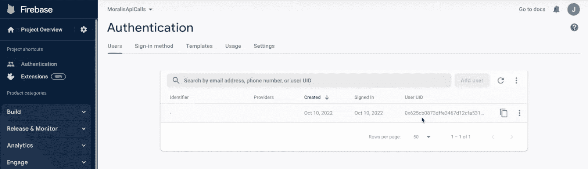

此外，由于 Moralis auth 扩展，添加到应用后端的所有用户都包含附加信息。因此，您可以将这些数据集成到您的应用程序和其他 Firebase 服务中，比如数据库。

然而，如果您想了解如何在未来的 Web3 项目中添加类似的功能，请跟随本 Web3 Firebase 身份验证教程，我们将从头至尾分解整个过程！

## Firebase Web3 身份验证教程–5 步分解

现在是 Firebase Web3 身份验证教程的核心部分，我们将教您如何使用 Moralis 的 Firebase 身份验证扩展创建带有 MetaMask 的 Web3 登录。结合 Moralis Firebase 集成的演练，您将了解如何设置 React 应用程序来测试 Web3 元掩码登录功能！


为了使本教程尽可能简单明了，它将分为以下五个步骤:

1.  Firebase 设置
2.  正在初始化 Firebase CLI
3.  Moralis 的验证扩展设置
4.  部署身份验证扩展
5.  创建 React 应用程序

因此，如果您遵循前面提到的步骤，您将学习如何使用 MetaMask 轻松创建 Web3 登录。因此，您可以将类似的 Web3 Firebase 集成添加到您未来的区块链开发工作中，以快速创建[基于区块链的认证](https://moralis.io/blockchain-based-authentication-how-to-integrate/)机制，并将[链上数据](https://moralis.io/on-chain-data-the-ultimate-guide-to-understanding-and-accessing-on-chain-data/)直接传输到您的 Firebase 后端！

此外，如果你更喜欢看视频来学习，看看下面来自 YouTube 频道的剪辑。该视频提供了整个过程的完整分解，其中我们一位才华横溢的工程师将一步一步地引导您完成整个教程:

[https://www.youtube.com/embed/2HLxYYmZp94?feature=oembed](https://www.youtube.com/embed/2HLxYYmZp94?feature=oembed)

你也可以跟着来，因为我们将向你展示如何在本教程的第一步设置 Firebase！

### 步骤 1: Firebase 设置

首先，Firebase Web3 身份验证教程的第一步是设置 Firebase。如果您已经熟悉 Firebase，可以跳过这一步，直接进入 Firebase Web3 教程的第二部分:“*步骤 2:初始化 Firebase CLI* ”。

尽管如此，如果你还没有，请访问 Firebase 的网页，点击“开始”按钮创建一个帐户:

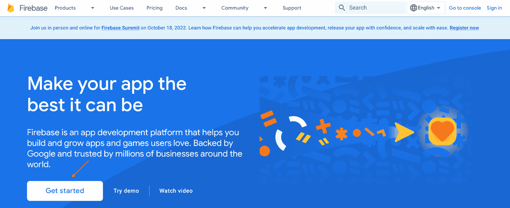

有了自己的帐户，登录 Firebase，点击“创建项目”按钮，按照说明建立一个全新的 Firebase 项目:


一旦你选择了适合你的项目的选项，点击“创建项目”按钮，你将直接进入 Firebase 管理面板。新的 Firebase 项目会自动设置为免费的“Spark”计划。然而，对于这个 Firebase Web3 教程，您需要从“Spark”切换到“Blaze”来访问所需的 Firebase 特性。要更改计划，请点击左下方的“升级”并选择“Blaze”计费计划:

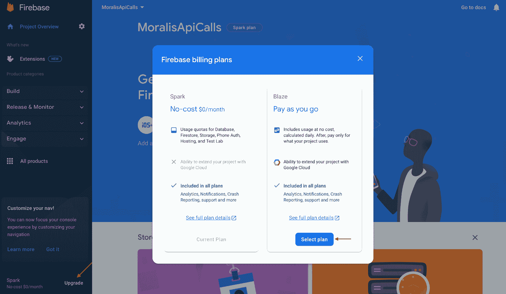

然而，正如上面的打印屏幕所示,“Blaze”替代方案采用了“随用随付”的支付模式。幸运的是，有一个免费限制，只有当你的应用程序获得大量流量时，你才需要付费。因此，在本 Firebase Web3 教程中，您可能不需要担心这个问题。

最后，剩下的就是设置具有*身份验证*功能的 Firebase。为此，导航到“身份验证”选项卡并单击“开始”:


这涵盖了教程的 Firebase 设置部分！下一节将向您展示如何初始化 Firebase CLI！

### 步骤 2:初始化 Firebase CLI

本 Firebase Web3 教程的第二步是初始化 Firebase CLI 并建立一个新的 Firebase 项目。因此，您可以打开首选的 IDE(集成开发环境)并为您的项目创建一个新文件夹。对于这个演示，我们将使用 Visual Studio 代码(VSC)。因此，请注意，如果您使用另一个开发环境，该过程可能会略有不同。

在 IDE 打开并有新文件夹可供使用的情况下，打开一个新的终端。如果你像我们一样使用 VSC，你可以点击顶部的“终端”标签，然后点击“新终端”:


从那里，在您的本地设备上安装 Firebase 工具。您可以通过在终端中运行以下任一命令来实现这一点:

**对于 Windows:**

```js
npm install -g firebase-tools
```

**对于 macOS:**

```js
sudo npm install -g firebase-tools
```

工具安装完成后，下一步是使用 Firebase 登录，如果运行以下命令，就可以完成:

```js
firebase login
```

如果这是你第一次登录 Firebase，终端会提示你的浏览器，允许你用 Firebase 登录！

#### Firebase 项目设置

接下来，您需要通过在终端中运行以下命令来初始化一个新的 Firebase 项目:

```js
firebase init hosting
```

此外，请注意，通过运行上面的命令，您用“hosting”初始化了 Firebase 项目。因此，您现在将能够通过 Firebase 在一个实时服务器上测试应用程序。因此，除了在本地尝试应用程序之外，您还有更多选择。

尽管如此，运行" *firebase init hosting* "命令会提示您的终端，您必须做出一些决定。在这种情况下，因为您在第一步中设置了一个 Firebase 项目，所以接下来选择一个已经存在的项目，并选择您以前创建的项目:

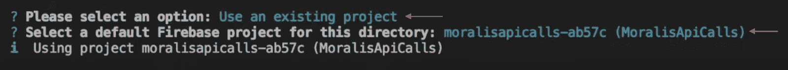

在那里，终端将询问您想要使用什么作为您的公共目录。对于本 Firebase Web3 教程，输入以下内容并按回车键:

```js
frontend/build
```

最后，对以下两个问题选择“否”:


这就是初始化 Firebase CLI 和建立一个新的 Firebase 项目！如果您一直这样做，现在您的本地存储库中应该有一个类似如下的结构:

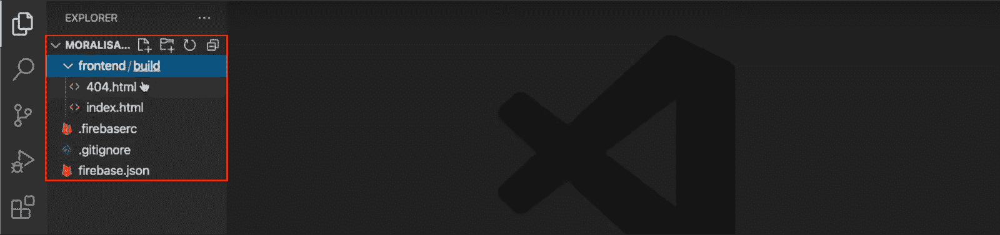

### 步骤 3: Moralis 的认证扩展设置

在 Firebase Web3 教程的第三步中，是时候设置 Moralis 身份验证扩展了，这是您轻松建立 Web3 Firebase 集成的方式。然而，要设置它，请返回到您的 IDE 并在您的终端中运行以下命令:

```js
firebase ext:install moralis/moralis-auth
```

对于初始提示，选择“Yes”，选择“Iowa (us-central1)”，并确保将机密存储在“Google Cloud Secret Manager”上(如果在此阶段出现错误，请参见下面的“*潜在的 Secret Manager API 错误*”小节):


在选择您想要存储您的秘密的位置之后，终端将提示您输入您的 Moralis API 密钥。要获得 API 密钥，您需要一个 Moralis 帐户。因此，如果你还没有注册，现在就注册吧！

准备好一个帐户，登录并通过导航到“Web3 API”选项卡获取您的 web 3 API 密钥:


输入 Web3 API 密钥后，下一个提示将要求您输入网站 URL，在这种情况下，您可以通过以下命令选择“localhost ”:

```js
https://localhost
```

最后，您需要添加“服务帐户的项目 ID”、“服务帐户的电子邮件”和“服务帐户的私钥”。要获得这三个元素，您必须首先生成一个新的 Firebase 私钥。因此，单击 Firebase 管理面板左上角的齿轮，点击“项目设置”，选择“服务帐户”，然后单击“生成新的私钥”按钮:

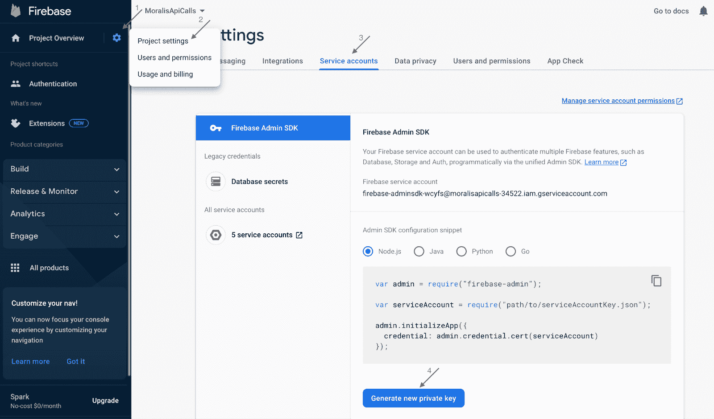

现在，您可以使用私钥和 Moralis 的 [Firebase 服务帐户转换器](https://moralisweb3.github.io/firebase-extensions/service-account-converter/)来获取扩展参数，您可以将这些参数用作终端提示的输入:

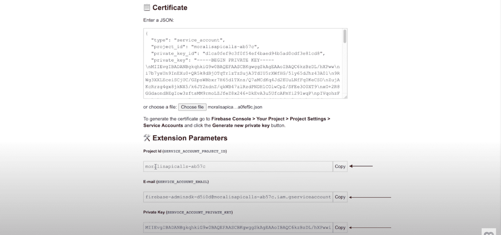

#### 潜在的机密管理器 API 错误

在这一步的前面，当选择存储机密的位置时，不幸的是，出现以下错误并不罕见:


由于您可能会遇到同样的问题，本节将简要介绍如何解决它。如上图所示，错误消息包含一个链接。如果您在终端中单击该链接，您应该会看到如下所示的页面:

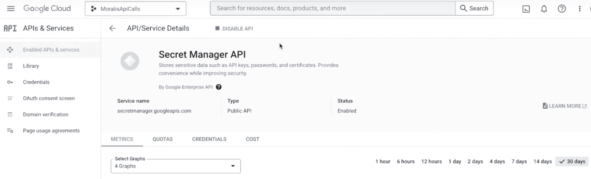

要解决此问题，您需要禁用并重新启用 API，方法是单击“禁用 API”按钮:


单击上面的按钮后，它会将您重定向到“Secret Manager API”页面，您可以在这里再次启用它:

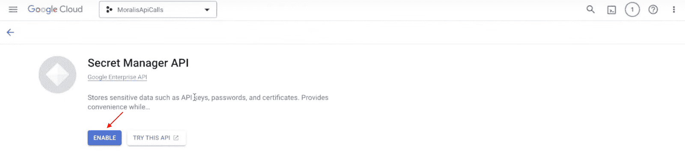

就是这样！现在问题应该解决了！从这里开始，等待几分钟，重新执行 Firebase Web3 教程的第三步；它现在应该可以正常工作了！

### 步骤 4:部署身份验证扩展

既然您已经设置好了 Moralis 的身份验证扩展，那么是时候部署它了。为此，请再次打开您的终端并运行以下命令:

```js
firebase deploy --only extensions
```

当您运行该命令时，您必须在终端中回答几个问题，并且您可以为该批次选择“ *Yes* ”。此外，部署扩展可能需要一段时间；但是，它应该很快就会部署！

一旦 Moralis 的认证扩展部署，你可以在你的 Firebase 管理面板上找到它。因此，要检查扩展是否部署成功，请单击“Build”选项卡，然后单击“Extensions”:

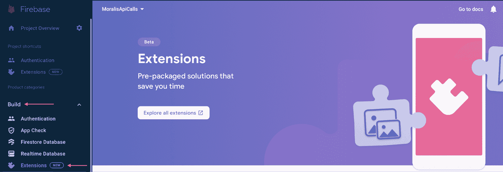

这就涵盖了 Firebase Web3 教程的全部第四步！从现在开始，唯一剩下的事情就是使用 React 应用程序测试 Firebase Web3 登录！

### 步骤 5:创建 React 应用程序

Firebase Web3 教程的最后一步演示了如何使用 React 应用程序测试您的 Firebase Web3 登录。要创建应用程序，请导航到您的 IDE 并检查您的本地目录。如果您还记得第二步，在选择使用什么作为您的公共目录时，您选择了输入“ *frontend/build* ”。因此，您应该在存储库中找到一个名为“frontend/build”的文件夹。

该文件夹最初包含两个文件；但是，您希望用 React 应用程序替换它们。为了让这个过程尽可能简单，你可以使用这个 [GitHub 库](https://github.com/MoralisWeb3/youtube-tutorials/tree/main/FirebaseAuthExtension)作为已经准备好的应用模板。因此，您需要做的就是从存储库中复制文件，并将它们输入到“前端/构建”文件夹中，为您留下一个类似于下面的目录:

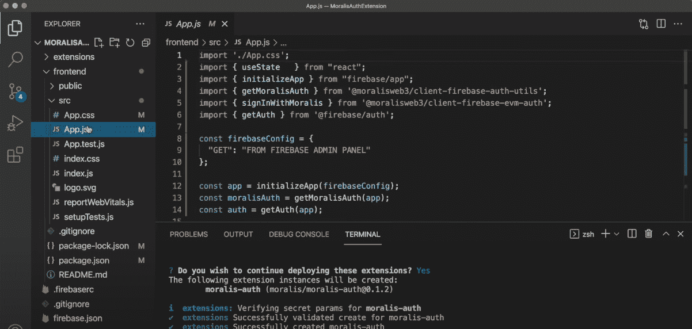

有了模板代码，您需要对“App.js”文件进行一些配置。具体来说，您需要将您的 Firebase 配置添加到" *firebaseConfig"* 对象中。要获得所需的配置，请打开 Firebase 管理面板，单击“项目概述”，然后创建一个新的 web 应用程序:


要设置 web 应用程序，您需要添加一个名称，然后单击“注册应用程序”按钮，这将带您进入注册过程的第二部分。它应该是这样的，您可以复制这个" *firebaseConfig* "对象，并用相同的名称替换您的本地目录的对象:

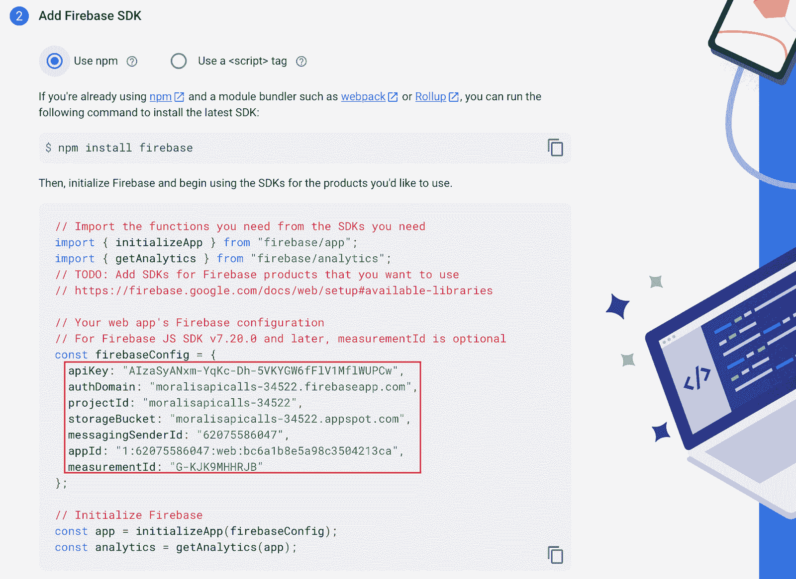

#### 启动应用程序

在本地目录中添加了应用程序代码和配置之后，剩下的工作就是启动和测试应用程序。但是，在这样做之前，打开一个终端，用下面的命令将" *cd"* 放入" frontend/build "文件夹:

```js
cd frontend/build
```

然后，您可以通过在终端中运行“ *npm i* ”命令来安装所需的依赖项。最后，您可以通过输入“ *npm run start* ”并按 enter 键在本地运行应用程序！

因此，您现在应该能够访问以下 URL，在您的浏览器中本地启动 React 应用程序并对其进行测试:" [https://localhost3000](https://localhost3000/) "。

更重要的是，由于您最初使用“*托管*来启动项目，因此您还可以在线部署应用程序，以便任何人都可以从任何地方访问该应用程序。如果你想了解更多关于如何做的信息，请查看“ *Firebase Web3 认证教程-5 步分解*”部分的视频，该视频位于“ [11:10](https://youtu.be/2HLxYYmZp94?t=670) ”时间戳！

此外，如果你在教程中遇到了麻烦，请加入 Moralis 的不和谐频道，从我们有才华的社区工程师那里获得帮助！

## 摘要–Firebase web 3 身份验证

本教程深入探讨了 Firebase Web3 身份验证的复杂性。具体来说，该指南向您展示了如何使用 MetaMask 创建 Web3 登录并集成 Firebase 服务。此外，由于 Moralis 和 Firebase 身份验证扩展的可访问性，您只需五个步骤即可完成:

1.  Firebase 设置
2.  正在初始化 Firebase CLI
3.  Moralis 的验证扩展设置
4.  部署身份验证扩展
5.  创建 React 应用程序

因此，如果您遵循了本文的内容，您现在应该知道如何使用 Moralis 创建 Web3 登录。此外，您现在可以使用相同的原则将 Firebase Web3 身份验证添加到任何未来的区块链项目中！

如果你觉得这篇文章很有帮助，可以考虑在 Moralis 的 [Web3 博客](https://moralis.io/blog/)查看更多的区块链发展内容。例如，阅读我们在 [Web3 for business](https://moralis.io/web3-for-business-how-and-why-you-can-integrate-web3-into-your-enterprise/) 上的文章，或者学习如何[使用 Unity](https://moralis.io/how-to-build-a-web3-multiplayer-game-using-unity-multiplayer/) 构建 Web3 多人游戏！

如果你想磨练你的 Web3 开发技能，你也应该考虑报名参加 Moralis 学院。如果你是 Web3 的新手，可以看看下面这个关于区块链行业基本面的课程:“[区块链&比特币 101](https://academy.moralis.io/courses/blockchain-bitcoin-101) ”。


然而，如果你想利用区块链技术的全部力量，请立即注册 Moralis。创建您的帐户是免费的，您可以立即获得由 Moralis 提供的各种工具！