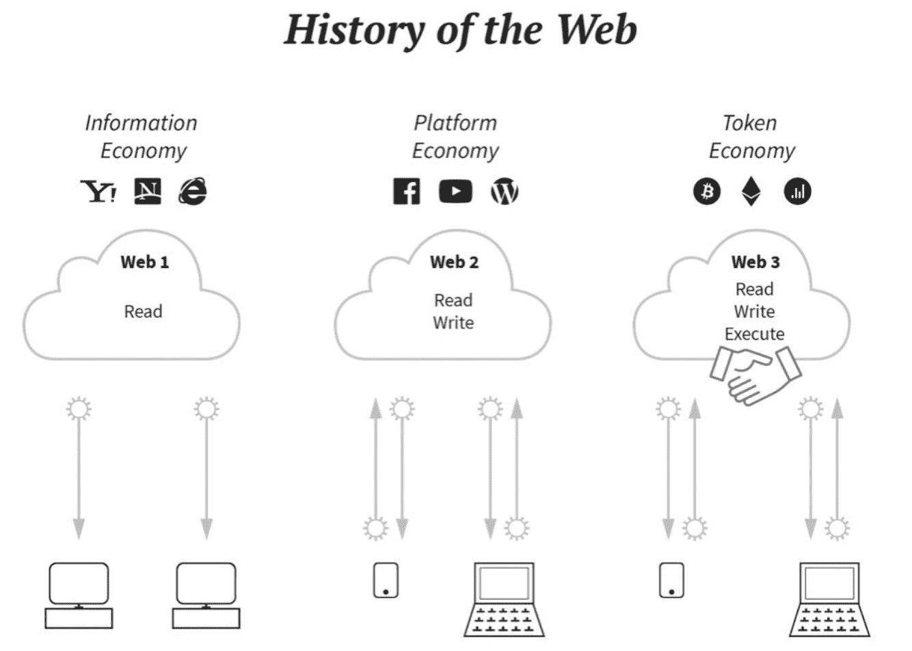
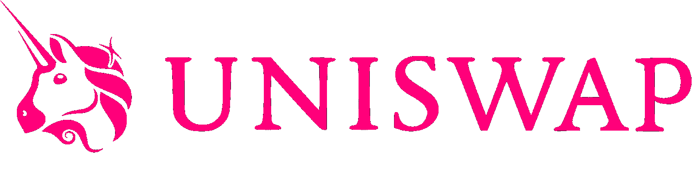
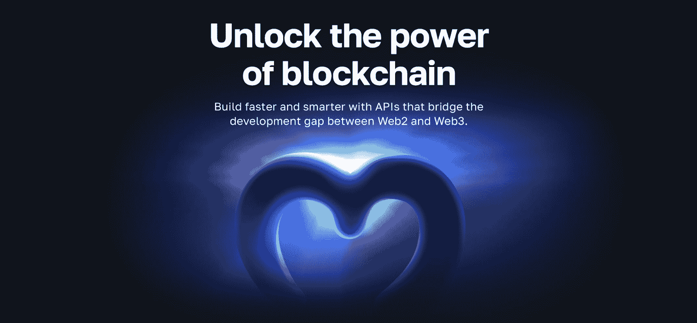
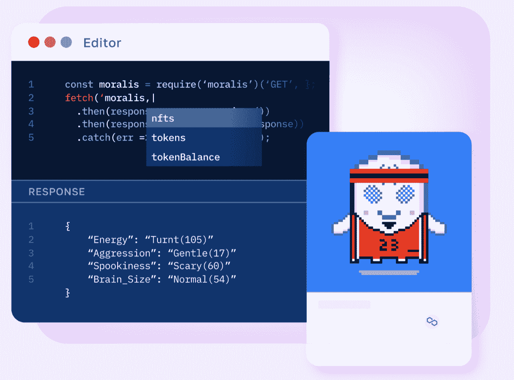
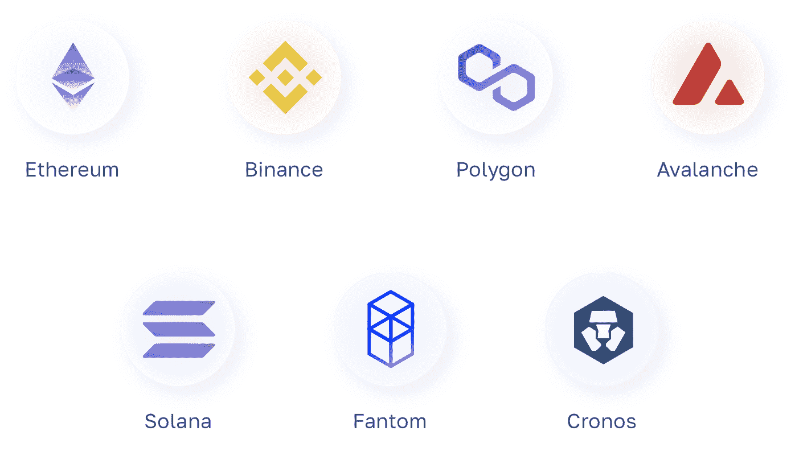

# 面向企业的 Web3——如何以及为什么将 web 3 集成到您的企业中

> 原文：<https://moralis.io/web3-for-business-how-and-why-you-can-integrate-web3-into-your-enterprise/>

**在探索 Web3 for business 的复杂性时，您会很快注意到底层技术有可能颠覆传统行业，凸显了对无缝 Web3 集成的需求。因此，结合对 Web3 商业应用的深入研究，这篇文章探索了将 Web3 集成到任何技术堆栈中的最简单的方法——通过使用[Moralis](https://moralis.io)！**

Moralis 的企业级 Web3 APIs 支持更无缝的开发体验，允许任何人轻松利用区块链技术更快、更智能地进行构建。事实上，Moralis 提供了构建 Web3 应用程序的最快方法！除了优秀的开发工具，Moralis 还具有跨链兼容性，这增加了您项目的[可伸缩 Web3 基础设施](https://moralis.io/scale/)。此外，Moralis 提供与 IPFS 等服务的集成，让你[快速方便地将文件上传到 IPFS](https://moralis.io/how-to-upload-files-to-ipfs-full-guide/) ！

尽管如此，如果你想为商业整合 Web3，考虑与 Moralis 签约。创建一个帐户是完全免费的，你将立即获得优秀的开发工具，如 Web3 APIs！

[**Integrate Scalable Web3 Infrastructure for Enterprise**](https://moralis.io/scale/)

### 概观

由于 Web3 为创新提供了极好的机会，所以企业在这个迅速崛起的领域积极尝试也就不足为奇了。尽管传统媒体主要强调 NFTs、加密货币和区块链，但企业关注的是 Web3 的业务用例。此外，严肃的组织认识到区块链的潜力，并积极探索利用这一技术的创新方法。因此，理解 Web3 对当今商业格局的影响变得非常有趣，这也是为什么这篇文章探讨了 Web3 对于商业的复杂性！

在我们深入探讨 Web3 for business 的细节以及去中心化的 Web 如何影响商业世界之前，我们需要回到基础。因此，第一部分回答了这个问题，“什么是 Web3？”。

## 什么是 Web3？

即使你是区块链发展空间的新手，你也可能听说过 Web3。此外，Web3 通俗地说，通常被理解为“互联网的第三阶段”。因此，你可以想象，互联网有两个前代/阶段:Web1 和 Web2！

*   **web 1–静态**
*   **web 2–动态互动**
*   **web 3–分散化**

正如上述要点所示，每个阶段都由普遍的特征来定义。Web1 是静态的，这意味着，在互联网的早期，用户主要消费内容，没有办法做出贡献。

随着知名社交媒体集团的崛起，网络的静态性质转变为更加互动和动态，这一阶段通常被称为 Web2。有了更动态的网络体验，用户可以贡献和参与创造价值。

然而，Web2 也是高度集中的，引发了透明性、单点故障、隐私等问题。因此，Web3 目前正迅速引入去中心化的概念。在这种模式下，互联网从一个集中的模式转变为基于区块链的模式。此外，Web3 生态系统的两个关键组件是 dapps 和智能合约。这些组件在很大程度上有助于 Web3 如何通过提供一个创新平台和消除不必要中介的机会来彻底改变今天的互联网。

尽管如此，随着对分散式 web 的概述，现在是时候更仔细地看看 Web3 for business，以及互联网的这一阶段如何影响当今的商业格局了！

## 面向企业的 web 3——web 3 如何影响企业？

鉴于 Web2 对商业世界的重大影响，不难想象 Web3 革命也会产生同样的影响。因此，这为现有组织和新组织带来了颠覆当今商业格局的重大机遇。因此，拓宽我们对 Web3 for business 的认识并回答“Web3 如何影响商业？”这个问题变得令人兴奋。

从金融服务公司到医疗保健行业，Web3 的底层区块链技术的功能使企业能够在所有经济领域改进现有的和开发新的创新业务模式。而且，这些机会主要来源于 Web3 的去中心化架构。

因此，企业正在尝试收入共享、收入共享、持续融资、ico 等概念。然而，涵盖 Web3 影响商业世界的所有潜在方式超出了本文的范围，这就是为什么本文将其缩小到简要阐述以下三个方面:

*   Dao 通常指 Web3 项目/协议的治理主体。当 Dao 建立后，令牌被分发，允许涉众参与关键的决策制定。因此，这为各组织以权力下放的方式构建其理事机构提供了一个创新的机会。

*   **更少的入职摩擦**–与今天的网络生态系统不同，去中心化的网络有一个统一的识别层。因此，用户只需要他们的 Web3 身份就可以登录各种平台，从而提供更加无缝的用户体验。更重要的是，它降低了入职摩擦，大大有利于企业。

*   **分布式账本和供应链**–区块链是分布式账本，企业一直在试验这种技术来跟踪数据、存储数据、检测造假等。在他们的供应链中。

然而，Web3 对业务的影响只会继续增长，突出了对业务集成的简单 Web3 的需求！

## 现实生活中的 Web3 业务示例

在我们研究集成 Web3 业务的最简单方法之前，本节将介绍三个成功集成 Web3 的组织的真实例子。更具体地说，我们将密切关注 Uniswap、Filecoin 和 Livepeer！

*   unis WAP–[unis WAP](https://uniswap.org)是目前市场上最著名的 dex 或“分散交易所”之一。此外，它是一个 AMM(自动做市商)，这意味着 Uniswap 使用分散的流动性池，通过智能合约发挥作用。

*   **Filecoin**–[Filecoin](https://filecoin.io)是一个分布式文件存储网络，非常适合存储大型数据集。与传统的云存储服务相比，该网络以更低的价格提供了更好的互操作性和更高的性能。

*   **live peer**–[live peer](https://livepeer.org)是一个基于以太坊区块链的视频流媒体平台。该网络是分散和开源的，目的是为 Web3 视频流提供基础设施和堆栈。

随着对 Web3 将如何影响商业世界和一些利用 Web3 技术的组织的突出例子有了更好的理解，现在是时候更仔细地研究如何轻松地集成 Web3 for business 了！

## 为企业集成 Web3

正如“ *Web3 for Business”中所强调的，Web3 如何影响业务？*”部分，很明显，Web3 对全球企业产生了重大影响。此外，Web3 的分散架构使开发者有可能通过提供新的、创新的商业模式来颠覆成熟的行业。因此，组织必须有机会轻松集成 Web3 for business。

对可访问的 Web3 集成的需求是双重的。首先，它为初创公司提供了巨大的发展机会，并在充满挑战的市场中占有份额。第二，它确保了声誉卓著的公司能够在市场中保持自己的地位并保持增长。然而，采用不容易集成的新技术总是具有挑战性，尤其是对于灵活性较差的大型公司。

此外，从传统的角度来看，在商业中采用和集成 Web3 是一个相当大的挑战，主要原因是缺乏专业的开发工具。然而，这正是 Moralis 占据中心位置的地方，它为企业提供了一条更容易实现的 Web3 集成之路！

Moralis 为寻求集成 Web3 业务的小型和大型组织提供可扩展的 Web3 基础设施。通过 Moralis，您有机会释放区块链的力量，更快、更有效地构建 dapps 和其他 Web3 项目。Moralis 的 Web3 APIs 通过使您能够将区块链集成到任何技术堆栈中，弥合了 Web2 和 Web3 之间的开发差距。因此，有了 Moralis，你可以用 Web2 的无缝开发体验构建强大的 Web3 应用程序！

请继续阅读，下一节将深入探讨 Moralis 的每个企业级 Web3 APIs！

## Moralis 的企业级 API–任何企业都可以访问 Web3

本节探索 Moralis 的[Web3 API](https://moralis.io/web3-apis-exploring-the-top-5-blockchain-apis/)的复杂性，这些 API 是企业级开发工具，使任何人都可以访问 web 3 集成！如果你想将 Web3 集成到任何技术堆栈中，请继续阅读并学习最简单的方法！

此外，以下部分将深入探讨以下六个 API:

1.  Web3 流 API
2.  Auth API
3.  索拉纳 API
4.  EVM API
5.  NFT API
6.  Token API

除了简要地探究 Moralis API 的来龙去脉，下一节还将介绍一些 API 功能的实际例子。不过，让我们继续，直接进入第一个 API: Moralis 的 Web3 Streams API！

### 流 API

Moralis 的 [Streams API](https://moralis.io/streams/) 让你可以使用 [Web3 webhooks](https://moralis.io/web3-webhooks-the-ultimate-guide-to-blockchain-webhooks/) 轻松地将区块链数据传输到你的后端。由于 Moralis 的跨链能力，您可以从几乎任何网络、第二层解决方案以及它们各自的测试网接收 webhooks！

使用 Streams API，您可以在任何时候接收 Web3 webhooks:

*   特定加密地址通过发送/接收资产进行交易
*   交换特定的令牌
*   参与代币销售活动
*   智能合同事件根据您的过滤器触发
*   还有更多

### 授权 API

接下来，Moralis 的[认证 API](https://moralis.io/authentication/) 为您的所有应用程序提供统一的 Web3 和 Web2 认证流。更重要的是，它兼容任何技术堆栈，您将完全控制所有用户数据。

该 API 提供了一个统一的工具来设置任何 Web3 身份验证方法，以及一个全面的 SDK 来轻松集成。此外，Auth API 也在不断改进，以跟上快速发展的 Web3 行业。因此，使用这个 API 来保护您的所有身份验证流程。比如你可以轻松学会[添加比特币基地钱包登录功能](https://moralis.io/how-to-add-coinbase-wallet-login-functionality/)！

### 索拉纳 API

使用 [Solana API](https://moralis.io/solana-api/) ，您可以立即构建基于 Solana 的项目！这个 Moralis 工具提供了查询令牌和用户数据的能力，您可以在任何 Solana 项目中使用它。因此，您可以轻松访问链上数据，如余额、价格、符号、名称等！

### EVM API

Moralis 的 [EVM API](https://moralis.io/evm-api/) 使得查询链上数据和向任何 EVM 兼容的区块链发送请求成为可能。因此，当与 Moralis 合作时，您将能够更有效地开发 EVM dapps！

例如，您可以查询块号、日期、智能合同事件等数据！因此，如果你正在考虑 EVM 开发，请务必进一步查看 Moralis 的 EVM API！

### NFT API

NFT API 积累你需要的一切来建造著名的 NFT dapp。这个 API 可以获取实时的 NFT 元数据、所有权数据、转让数据、价格等。此外，NFT API 具有完整的跨链支持。因此，您可以轻松地从任何支持的链中查询 NFT 相关的数据，包括以太坊、多边形、雪崩、索拉纳等等！

### Token API

[令牌 API](https://moralis.io/token-api/) 使得将实时令牌数据集成到您的 Web3 应用程序变得容易。因此，你可以通过几个最著名的区块链网络获得代币价格、所有权和传输数据！

## 总结–面向企业的 Web3

社交媒体的兴起和互联网向 Web2 的转变彻底改变了商业世界，催生了一些世界上最大的企业集团。鉴于 Web2 对商业世界的不可思议的影响，Web3 范式的转变也有可能导致类似的结果。因此，探索 Web3 的来龙去脉变得非常有趣！

Web3 的功能和底层的区块链技术为一个激动人心的行业奠定了基础，这个行业为新兴和现有的组织提供了重要的机会。因此，企业目前正在尝试收入共享、收入共享、DAOs、ico 等概念。

然而，从传统的角度来看，整合 Web3 业务的门槛相对较高。幸运的是，现在不再是这种情况了，因为 Moralis 使 Web3 和区块链技术的整合变得更加容易。可访问性主要源于 Moralis 的六个 Web3 APIs:

1.  Web3 流 API
2.  授权 API
3.  索拉纳 API
4.  EVM API
5.  NFT API
6.  Token API

如果你觉得这份指南很有帮助，并想了解更多关于 Moralis 和整个行业的信息，请点击 Moralis [Web3 博客](https://moralis.io/blog/)查看更多内容。例如，看看我们关于隋 T3 的文章或者如何在索拉纳 T5 铸造硬币！

因此，如果你想整合 Web3 业务，并进一步探索 Moralis，[现在就注册 Moralis](https://admin.moralis.io/register) ！您可以免费创建您的帐户；只需要几秒钟！